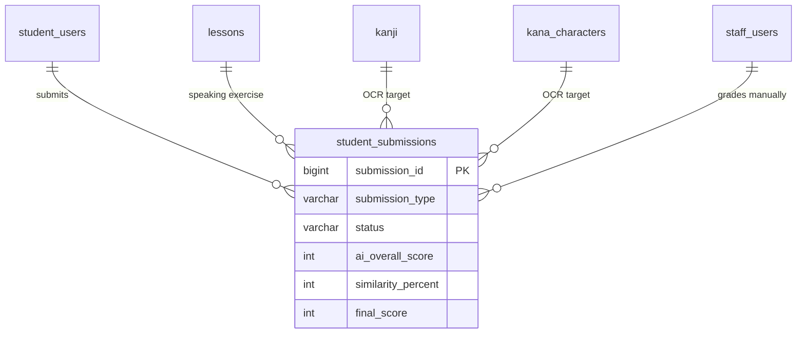

# SPEC — AI Skills (Speaking Practice & Handwriting OCR)
> **Feature ID:** `feat-ai-skills`
> **UC Coverage:** UC-13 (Speaking + AI Grading), UC-20 (AI Handwriting Practice)
> **Version:** 1.0 | **Status:** Draft
> **Author:** Team | **Last Updated:** 2026-05-28

---

## 1. CONTEXT & GOAL

### 1.1 Bối cảnh
Kỹ năng nói và viết là hai kỹ năng khó luyện nhất khi học ngôn ngữ mà không có gia sư. Nền tảng tích hợp AI để cung cấp phản hồi tức thì: AI chấm phát âm qua Speech Recognition (UC-13) và AI nhận diện chữ viết tay Kanji/Kana qua OCR (UC-20).

### 1.2 Mục tiêu
- Cho phép học viên ghi âm và nhận phản hồi phát âm từ AI (Shadowing method)
- Cho phép học viên vẽ Kanji/Kana trên Canvas và nhận kết quả nhận diện OCR
- Thực thi async pattern: trả `job_id` ngay, poll kết quả sau
- Staff có thể override điểm AI bằng điểm thủ công (final_score)

### 1.3 Tại sao cần?
Không có AI feedback → học viên không biết phát âm sai ở đâu hoặc viết sai nét nào. AI biến nền tảng từ "đọc nội dung" thành "luyện tập tích cực."

---

## 2. ACTOR

| Actor | Role | Điều kiện tiền quyết |
|:---|:---|:---|
| **Student** | Luyện nói / luyện viết, nhận AI feedback | Đã đăng nhập; có micro (UC-13) hoặc thiết bị cảm ứng/chuột (UC-20) |
| **Staff** | Xem bài nộp, override điểm thủ công | Đã đăng nhập Staff — xem `feat-support` UC-31 |

---

## 3. FUNCTIONAL REQUIREMENTS (EARS)

### 3.1 UC-13 — Speaking Practice & AI Grading

| ID | EARS Requirement |
|:---|:---|
| FR-AI-01 | WHEN a Student selects a Speaking lesson, THE SYSTEM SHALL display the Japanese text prompt, sample audio URL (`audio_url` from `lessons` where `lesson_type = 'speaking'`), and a "Record" button. |
| FR-AI-02 | WHEN a Student clicks "Nộp bài" with a recorded audio file, THE SYSTEM SHALL: (1) store the audio file in `/uploads` or S3, (2) create a `student_submissions` record with `submission_type = 'speaking'`, `status = 'pending'`, and `recording_url`, (3) enqueue an async AI processing job, and (4) immediately return `{ submissionId, status: 'PENDING' }`. |
| FR-AI-03 | THE SYSTEM SHALL NOT block the response while waiting for AI processing. THE SYSTEM SHALL return a job reference immediately. |
| FR-AI-04 | WHEN the AI engine completes analysis, THE SYSTEM SHALL update `student_submissions` with: `ai_overall_score`, `ai_pronunciation_score`, `ai_fluency_score`, `ai_highlighted_errors` (JSON), `ai_suggestions`, `ai_graded_at`, and `status = 'ai_graded'`. |
| FR-AI-05 | WHEN a Student polls for results and `status = 'ai_graded'`, THE SYSTEM SHALL return the full AI feedback including: overall score (0-100), pronunciation score, fluency score, highlighted error positions, and improvement suggestions. |
| FR-AI-06 | IF the AI engine fails or times out (> 30 seconds), THE SYSTEM SHALL retry up to 3 times with exponential backoff. IF all retries fail, THE SYSTEM SHALL set `status = 'ai_graded'` with a fallback message and log the full error. |
| FR-AI-07 | THE SYSTEM SHALL NOT expose raw AI model errors to the Student. THE SYSTEM SHALL return a user-friendly fallback message on AI failure. |
| FR-AI-08 | THE SYSTEM SHALL store audio files at `/uploads` or S3. THE SYSTEM SHALL NOT store audio as BLOB in the database. |

### 3.2 UC-20 — AI Handwriting Practice (OCR)

| ID | EARS Requirement |
|:---|:---|
| FR-AI-20 | WHEN a Student selects a Kanji or Kana character to practice writing, THE SYSTEM SHALL display the target character and its `stroke_order_url` (static guide image) as reference. |
| FR-AI-21 | WHEN a Student submits a Canvas drawing, THE SYSTEM SHALL export the canvas as a PNG image, store it in `/uploads` or S3, create a `student_submissions` record with `submission_type = 'handwriting'`, `target_type` ('kanji' or 'kana'), `expected_character`, `status = 'pending'`, and enqueue an async OCR job. |
| FR-AI-22 | WHEN the OCR engine processes the image, THE SYSTEM SHALL: recognize the handwritten character, compare it with `expected_character`, compute `similarity_percent` (0-100), set `is_correct = true` if `similarity_percent >= 70` (configurable threshold), and update `status = 'ai_graded'`. |
| FR-AI-23 | WHEN a Student polls for OCR result and it is ready, THE SYSTEM SHALL return: `recognized_character`, `similarity_percent`, `is_correct`, `expected_character`. |
| FR-AI-24 | THE SYSTEM SHALL compare character shapes only via similarity percentage. THE SYSTEM SHALL NOT analyze individual stroke order, stroke direction, or calligraphy aesthetics (ADR-007). |
| FR-AI-25 | IF the OCR engine fails or times out (> 30 seconds), THE SYSTEM SHALL retry up to 3 times. IF all retries fail, THE SYSTEM SHALL set `recognized_character = null`, `similarity_percent = 0`, `is_correct = false`, log the error, and return a user-friendly fallback. |

### 3.3 Quy tắc chung AI

| ID | EARS Requirement |
|:---|:---|
| FR-AI-30 | THE SYSTEM SHALL set a timeout of 30 seconds per AI API call. |
| FR-AI-31 | THE SYSTEM SHALL retry failed AI calls a maximum of 3 times using exponential backoff (1s, 2s, 4s). |
| FR-AI-32 | ALL AI calls MUST be asynchronous. THE SYSTEM SHALL return a `submissionId` immediately and process in the background. |
| FR-AI-33 | THE SYSTEM SHALL log all AI call attempts with: `{submissionId, engine, attempt, status, duration, errorMessage}` using SLF4J. |
| FR-AI-34 | AI score (`ai_overall_score`) is a suggestion only. `final_score = manual_score ?? ai_overall_score`. Staff can override via `feat-support` UC-31. |
| FR-AI-35 | THE SYSTEM SHALL validate AI score: `0 <= ai_overall_score <= 100`. IF out of range, THE SYSTEM SHALL log a warning and clamp to [0, 100]. |

---

## 4. NON-FUNCTIONAL REQUIREMENTS

| ID | Category | Requirement |
|:---|:---|:---|
| NFR-AI-01 | Async | AI calls PHẢI async — trả job reference trong < 500ms |
| NFR-AI-02 | Timeout | Mỗi AI API call: timeout 30 giây |
| NFR-AI-03 | Retry | Max 3 lần retry; exponential backoff (1s, 2s, 4s) |
| NFR-AI-04 | Fallback | Luôn có fallback response khi AI fail — không để student thấy raw error |
| NFR-AI-05 | Storage | Audio/image lưu tại `/uploads` hoặc S3 — KHÔNG BLOB trong DB |
| NFR-AI-06 | Security | Validate file type: audio (mp3/wav/webm), image (png/jpg); max 10MB/file |
| NFR-AI-07 | Logging | Log đầy đủ mọi AI interaction với SLF4J |
| NFR-AI-08 | AI Placeholder | Engine cụ thể (`[AI_ENGINE]`) chưa chốt — thiết kế phải abstract qua interface |

---

## 5. DATA MODEL

### 5.1 Bảng chính

> Nguồn: [`jlpt_database_v2.sql`](file:///d:/Japanese-Skill-Practice-Platform/3.src/infra/Database/jlpt_database_v2.sql)

```sql
-- Bảng 15: student_submissions (Speaking + Handwriting, AI + manual grading)
CREATE TABLE student_submissions (
    submission_id     BIGINT IDENTITY(1,1) PRIMARY KEY,
    student_id        BIGINT          NOT NULL,  -- FK → student_users
    submission_type   NVARCHAR(20)    NOT NULL
        CHECK (submission_type IN ('speaking','handwriting')),
    status            NVARCHAR(20)    NOT NULL DEFAULT 'pending'
        CHECK (status IN ('pending','ai_graded','graded','rejected')),
    exercise_id       BIGINT          NULL,  -- FK → lessons(lesson_id) where lesson_type='speaking'
    recording_url     NVARCHAR(500)   NULL,
    duration_seconds  INT             NULL,

    -- AI grading (Speaking)
    ai_overall_score        DECIMAL(5,2)  NULL,  -- AI suggested total score
    ai_pronunciation_score  DECIMAL(5,2)  NULL,
    ai_fluency_score        DECIMAL(5,2)  NULL,
    ai_highlighted_errors   NVARCHAR(MAX) NULL,  -- Key errors detected by AI
    ai_suggestions          NVARCHAR(MAX) NULL,
    ai_graded_at            DATETIME2     NULL,

    -- OCR grading (Handwriting: Kanji / Kana)
    target_type             NVARCHAR(20)  NULL
        CONSTRAINT CK_sub_target_type CHECK (target_type IN ('kanji','kana')),
    kanji_id                BIGINT        NULL,  -- FK → kanji
    kana_id                 INT           NULL,  -- FK → kana_characters
    handwriting_image_url   NVARCHAR(500) NULL,
    expected_character      NVARCHAR(5)   NULL,
    recognized_character    NVARCHAR(5)   NULL,
    similarity_percent      DECIMAL(5,2)  NULL,  -- ADR-007: similarity % only, no stroke analysis
    is_correct              BIT           NULL,
    ocr_processed_at        DATETIME2     NULL,

    -- Final score & manual grading (Staff)
    final_score             DECIMAL(5,2)  NULL,  -- = manual_score ?? ai_overall_score
    manual_score            DECIMAL(5,2)  NULL,  -- Score set by Staff (overrides AI)
    manual_feedback         NVARCHAR(MAX) NULL,
    graded_by               BIGINT        NULL,  -- FK → staff_users
    graded_at               DATETIME2     NULL,

    submitted_at      DATETIME2       NOT NULL DEFAULT SYSUTCDATETIME(),
    updated_at        DATETIME2       NOT NULL DEFAULT SYSUTCDATETIME(),

    CONSTRAINT FK_sub_student  FOREIGN KEY (student_id)  REFERENCES student_users(student_id) ON DELETE CASCADE,
    CONSTRAINT FK_sub_exercise FOREIGN KEY (exercise_id) REFERENCES lessons(lesson_id),
    CONSTRAINT FK_sub_kanji    FOREIGN KEY (kanji_id)    REFERENCES kanji(kanji_id),
    CONSTRAINT FK_sub_kana     FOREIGN KEY (kana_id)     REFERENCES kana_characters(kana_id),
    CONSTRAINT FK_sub_grader   FOREIGN KEY (graded_by)   REFERENCES staff_users(staff_id)
);
```

### 5.2 Quan hệ



---

## 6. API SPEC

### `GET /api/lessons/{lessonId}/speaking`
**Actor:** Student | **Auth:** Bearer JWT
> Lấy thông tin bài luyện nói (lesson_type = 'speaking').

**Response (200):**
```json
{
  "status": 200,
  "message": "OK",
  "data": {
    "lessonId": "long",
    "title": "string",
    "textPrompt": "string",
    "sampleAudioUrl": "string"
  }
}
```

---

### `POST /api/submissions/speaking`
**Actor:** Student | **Auth:** Bearer JWT
> Nộp bài ghi âm — async, trả ngay submission ID.

**Request:** `multipart/form-data`
```
lessonId: long
audioFile: File (mp3/wav/webm, max 10MB)
```

**Response (202 Accepted):**
```json
{
  "status": 202,
  "message": "Bài nộp đang được xử lý",
  "data": {
    "submissionId": "long",
    "status": "PENDING"
  }
}
```

---

### `GET /api/submissions/{submissionId}/result`
**Actor:** Student | **Auth:** Bearer JWT
> Poll kết quả AI.

**Response (200) — Khi đang xử lý:**
```json
{
  "status": 200,
  "message": "OK",
  "data": {
    "submissionId": "long",
    "status": "PENDING",
    "message": "Đang xử lý, vui lòng thử lại sau..."
  }
}
```

**Response (200) — Khi có kết quả:**
```json
{
  "status": 200,
  "message": "OK",
  "data": {
    "submissionId": "long",
    "status": "ai_graded",
    "submissionType": "speaking",
    "aiOverallScore": "int",
    "aiPronunciationScore": "int",
    "aiFluentScore": "int",
    "aiHighlightedErrors": [
      { "position": "int", "word": "string", "suggestion": "string" }
    ],
    "aiSuggestions": "string",
    "finalScore": "int"
  }
}
```

---

### `POST /api/submissions/handwriting`
**Actor:** Student | **Auth:** Bearer JWT
> Nộp ảnh viết tay Canvas — async.

**Request:** `multipart/form-data`
```
targetType: string (kanji|kana)
targetId: long (kanjiId or kanaId)
expectedCharacter: string
imageFile: File (png/jpg, max 5MB)
```

**Response (202 Accepted):**
```json
{
  "status": 202,
  "message": "Đang nhận diện chữ viết...",
  "data": {
    "submissionId": "long",
    "status": "PENDING"
  }
}
```

**Poll result (200) — Khi có kết quả:**
```json
{
  "status": 200,
  "message": "OK",
  "data": {
    "submissionId": "long",
    "status": "ai_graded",
    "submissionType": "handwriting",
    "expectedCharacter": "string",
    "recognizedCharacter": "string|null",
    "similarityPercent": "int",
    "isCorrect": "boolean",
    "ocrProcessedAt": "datetime"
  }
}
```

---

### `GET /api/submissions?type={speaking|handwriting}&page=0&size=10`
**Actor:** Student | **Auth:** Bearer JWT
> Lịch sử bài nộp của Student.

**Response (200):**
```json
{
  "status": 200,
  "message": "OK",
  "data": {
    "content": [
      {
        "submissionId": "long",
        "submissionType": "string",
        "status": "string",
        "finalScore": "int|null",
        "createdAt": "datetime"
      }
    ],
    "totalElements": "long"
  }
}
```

---

## 7. ERROR HANDLING

| HTTP Code | Error Code | Message | Trigger |
|:---:|:---|:---|:---|
| 400 | `INVALID_FILE_TYPE` | "Định dạng file không hỗ trợ. Chỉ chấp nhận mp3/wav/webm" | File type sai |
| 400 | `FILE_TOO_LARGE` | "File quá lớn. Tối đa 10MB" | File > 10MB |
| 400 | `VALIDATION_FAILED` | "Thiếu thông tin bắt buộc: {field}" | Field thiếu |
| 401 | `UNAUTHORIZED` | "Yêu cầu đăng nhập" | JWT thiếu/hết hạn |
| 404 | `LESSON_NOT_FOUND` | "Bài học không tồn tại" | lessonId không có |
| 404 | `SUBMISSION_NOT_FOUND` | "Bài nộp không tồn tại" | submissionId không có |
| 500 | `AI_PROCESSING_FAILED` | "Không thể xử lý bài nộp. Vui lòng thử lại sau" | AI fail sau 3 retries |
| 500 | `INTERNAL_ERROR` | "Internal server error" | Lỗi hệ thống |

---

## 8. ACCEPTANCE CRITERIA

| ID | Scenario | Given | When | Then |
|:---|:---|:---|:---|:---|
| AC-AI-01 | Nộp bài nói async | Bài speaking tồn tại | POST /submissions/speaking | HTTP 202 + submissionId ngay, không chờ AI |
| AC-AI-02 | Poll khi đang xử lý | submission status=pending | GET /result | Trả PENDING, không lỗi |
| AC-AI-03 | Nhận kết quả AI | AI xử lý xong | GET /result | status=ai_graded, có điểm |
| AC-AI-04 | AI fail → fallback | AI timeout sau 3 lần | GET /result | status=ai_graded, fallback message, không expose raw error |
| AC-AI-05 | Nộp bài viết tay | Kanji tồn tại | POST /submissions/handwriting | HTTP 202 ngay |
| AC-AI-06 | OCR đúng | Viết đúng chữ | GET /result | similarityPercent ≥ 70, isCorrect=true |
| AC-AI-07 | OCR sai | Viết sai chữ | GET /result | similarityPercent < 70, isCorrect=false |
| AC-AI-08 | File quá lớn bị từ chối | File 15MB | POST speaking | HTTP 400 FILE_TOO_LARGE |
| AC-AI-09 | Audio không lưu BLOB | Bất kỳ submission | Kiểm tra DB | recording_url là string URL, không phải BLOB |

---

## OUT OF SCOPE

- ❌ Staff chấm bài thủ công (manual grading) — xem `feat-support` UC-31
- ❌ AI đánh giá thứ tự nét viết (stroke order) — chỉ similarity % (ADR-007)
- ❌ AI chấm điểm thẩm mỹ thư pháp — ngoài phạm vi
- ❌ Real-time AI feedback trong khi ghi âm — chỉ xử lý sau khi nộp
- ❌ Chọn AI engine cụ thể — cần thảo luận thêm (placeholder [AI_ENGINE])
- ❌ Ticket/Support từ Student — xem `feat-support`
