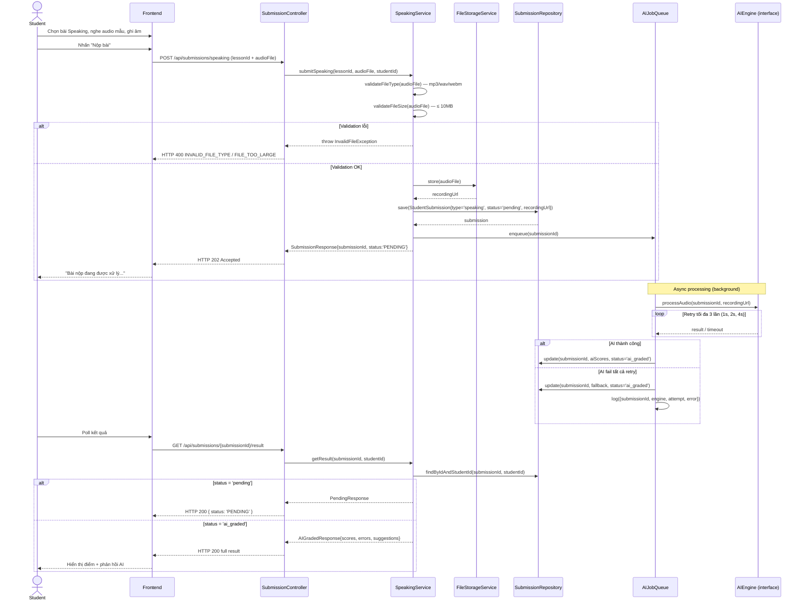

# UC-13 — Luyện Nói & Chấm Điểm AI (Speaking Practice & AI Grading)

> **Feature:** `feat-ai-skills` | **Phiên bản:** 1.0 | **Trạng thái:** Draft
> **Tham chiếu FR:** FR-AI-01, FR-AI-02, FR-AI-03, FR-AI-04, FR-AI-05, FR-AI-06, FR-AI-07, FR-AI-08, FR-AI-30, FR-AI-31, FR-AI-32, FR-AI-33, FR-AI-34, FR-AI-35
> **Cập nhật:** 2026-06-17

---

## 1. Tổng Quan

| Thuộc tính | Nội dung |
|:---|:---|
| **Mã Use Case** | UC-13 |
| **Tên** | Luyện Nói & Chấm Điểm AI (Speaking Practice & AI Grading) |
| **Tác nhân chính** | Student — học viên đã đăng nhập, có microphone |
| **Mô tả ngắn** | Học viên chọn bài luyện nói (Shadowing), nghe audio mẫu, ghi âm lại, nộp lên hệ thống. Hệ thống xử lý bất đồng bộ (async) qua AI Speech Recognition và trả về điểm phát âm, điểm lưu loát, các lỗi phát âm nổi bật và gợi ý cải thiện |
| **Độ ưu tiên** | Cao (P1) — kỹ năng nói là core value của AI module |

---

## 2. Tác Nhân & Điều Kiện

### 2.1 Tác Nhân

| Tác nhân | Vai trò |
|:---|:---|
| **Student** | Nghe audio mẫu, ghi âm, nộp bài, poll kết quả AI |
| **AI Engine** | Phân tích âm thanh, trả về điểm phát âm + fluency + highlighted errors (abstract qua interface — engine cụ thể chưa chốt) |
| **Staff** | Override điểm AI bằng điểm thủ công (`final_score`) — ngoài phạm vi, xem `feat-support` UC-31 |

### 2.2 Điều Kiện Tiền Quyết (Preconditions)

- Student đã đăng nhập (JWT hợp lệ), `student_users.status = 'active'`
- Bài học tồn tại: `lessons` có `lesson_type = 'speaking'`, `status = 'published'`, `is_deleted = 0`
- Student có thiết bị microphone và trình duyệt hỗ trợ ghi âm

### 2.3 Hậu Điều Kiện (Postconditions)

- **Thành công (nộp bài):** Bản ghi `student_submissions` (`submission_type='speaking'`, `status='pending'`) được tạo; file audio lưu tại `/uploads` hoặc S3; job AI được enqueue; trả HTTP 202 với `submissionId`
- **Thành công (kết quả):** `student_submissions` được cập nhật với điểm AI đầy đủ, `status='ai_graded'`; Student nhận phản hồi chi tiết
- **Thất bại:** Không tạo bản ghi nếu validation lỗi (400); AI fail sau 3 lần retry → `status='ai_graded'` với fallback message, toàn bộ lỗi được log

---

## 3. Luồng Xử Lý

### 3.1 Luồng Chính — Nộp Bài & Nhận Kết Quả AI (Happy Path)

```
Bước 1  [Student]:  Chọn bài luyện nói tại trang "Speaking Practice"
Bước 2  [Frontend]: GET /api/lessons/{lessonId}/speaking
Bước 3  [Backend]:  Validate lessonId, trả { lessonId, title, textPrompt, sampleAudioUrl }
Bước 4  [Student]:  Nghe audio mẫu, ghi âm lại qua trình duyệt
Bước 5  [Student]:  Nhấn "Nộp bài" với file audio đã ghi
Bước 6  [Frontend]: POST /api/submissions/speaking (multipart: lessonId + audioFile)
Bước 7  [Backend]:  Validate file type (mp3/wav/webm) và size (≤ 10MB)
Bước 8  [Backend]:  Lưu file audio tại /uploads hoặc S3, lấy URL
Bước 9  [Backend]:  Tạo student_submissions { submission_type='speaking', status='pending', recording_url }
Bước 10 [Backend]:  Enqueue async AI processing job với submissionId
Bước 11 [Backend]:  Trả ngay HTTP 202 { submissionId, status: 'PENDING' } — KHÔNG chờ AI
Bước 12 [AI Engine]: (background) Phân tích audio, tính ai_overall_score, ai_pronunciation_score,
                     ai_fluency_score, ai_highlighted_errors, ai_suggestions
Bước 13 [Backend]:  Cập nhật student_submissions với kết quả AI, status='ai_graded', ai_graded_at=now
Bước 14 [Student]:  Poll kết quả: GET /api/submissions/{submissionId}/result
Bước 15 [Backend]:  Kiểm tra status → nếu 'pending' trả PENDING; nếu 'ai_graded' trả full result
Bước 16 [Student]:  Nhận phản hồi: điểm tổng, điểm phát âm, điểm lưu loát, lỗi nổi bật, gợi ý
```

### 3.2 Luồng Lỗi

| Tình huống | HTTP | Error Code | Xử lý |
|:---|:---:|:---|:---|
| File không phải mp3/wav/webm | 400 | `INVALID_FILE_TYPE` | Từ chối ngay tại Controller |
| File > 10MB | 400 | `FILE_TOO_LARGE` | Từ chối ngay tại Controller |
| `lessonId` thiếu hoặc sai định dạng | 400 | `VALIDATION_FAILED` | Từ chối ngay tại Controller |
| `lessonId` không tồn tại / không phải type 'speaking' | 404 | `LESSON_NOT_FOUND` | Service throw exception |
| `submissionId` không tồn tại | 404 | `SUBMISSION_NOT_FOUND` | Service throw exception |
| JWT thiếu hoặc hết hạn | 401 | `UNAUTHORIZED` | Spring Security filter |
| AI fail sau 3 lần retry | 500 (nội bộ) | — | Set fallback trong submission, trả user-friendly message qua poll |
| AI score ngoài [0, 100] | — (nội bộ) | — | Clamp về [0,100], log warning |

### 3.3 Luồng AI Fail & Fallback

```
AI Engine timeout / lỗi (attempt 1)
  → Retry sau 1 giây (attempt 2)
  → Retry sau 2 giây (attempt 3)
  → Retry sau 4 giây (attempt 4 — final)
  → Tất cả fail: cập nhật student_submissions:
      status = 'ai_graded'
      ai_suggestions = "Không thể xử lý bài nộp. Vui lòng thử lại sau."
      ai_overall_score = null
  → Log đầy đủ { submissionId, engine, attempt, status, duration, errorMessage }
  → Trả user-friendly message (KHÔNG expose raw AI error)
```

---

## 4. Quy Tắc Nghiệp Vụ

| Mã | Quy tắc | Tham chiếu FR |
|:---|:---|:---|
| BR-13-01 | File audio KHÔNG được lưu BLOB trong DB — chỉ lưu URL/path | FR-AI-08, ADR-006 |
| BR-13-02 | Hệ thống PHẢI trả HTTP 202 + submissionId ngay, KHÔNG chờ AI xử lý | FR-AI-02, FR-AI-03 |
| BR-13-03 | AI call phải có timeout 30 giây/lần, tối đa 3 lần retry (backoff: 1s, 2s, 4s) | FR-AI-06, FR-AI-30, FR-AI-31 |
| BR-13-04 | KHÔNG expose raw AI error ra Student — luôn dùng fallback message | FR-AI-07 |
| BR-13-05 | AI score phải validate: 0 ≤ score ≤ 100; nếu ngoài khoảng → clamp + log warning | FR-AI-35 |
| BR-13-06 | `final_score = manual_score ?? ai_overall_score` — Staff có thể override | FR-AI-34 |
| BR-13-07 | Mọi AI call phải log đầy đủ: `{ submissionId, engine, attempt, status, duration, errorMessage }` | FR-AI-33 |
| BR-13-08 | Bài học phải có `lesson_type = 'speaking'` — không accept lessonId của loại khác | FR-AI-01 |
| BR-13-09 | AI engine phải abstract qua interface — không hard-code implementation cụ thể | NFR-AI-08 |

---

## 5. Quy Tắc Kiểm Tra Đầu Vào

| Trường | Kiểm tra | Thông báo lỗi nếu sai |
|:---|:---|:---|
| `lessonId` | Bắt buộc, số nguyên dương, tồn tại trong DB với `lesson_type='speaking'` | 400 `VALIDATION_FAILED` / 404 `LESSON_NOT_FOUND` |
| `audioFile` | Bắt buộc, MIME type mp3/wav/webm, kích thước ≤ 10MB | 400 `INVALID_FILE_TYPE` / 400 `FILE_TOO_LARGE` |
| `submissionId` (poll) | Bắt buộc, số nguyên dương, tồn tại trong DB, thuộc Student đang đăng nhập | 400 `VALIDATION_FAILED` / 404 `SUBMISSION_NOT_FOUND` |

---

## 6. Sơ Đồ Tuần Tự (Sequence Diagram)



---

## 7. Tham Chiếu API

| Phương thức | Endpoint | Mô tả |
|:---|:---|:---|
| `GET` | `/api/lessons/{lessonId}/speaking` | Lấy thông tin bài luyện nói (text prompt, sample audio URL) |
| `POST` | `/api/submissions/speaking` | Nộp file audio — async, trả ngay 202 + submissionId |
| `GET` | `/api/submissions/{submissionId}/result` | Poll kết quả AI (PENDING → ai_graded) |
| `GET` | `/api/submissions?type=speaking&page=0&size=10` | Lịch sử nộp bài của Student |

> Xem đặc tả request/response đầy đủ tại [`feat-ai-skills/SPEC.md §6`](./SPEC.md)

---

## 8. Tiêu Chí Chấp Nhận (Acceptance Criteria)

### AC-13-01 — Xem thông tin bài luyện nói

> **Tham chiếu:** FR-AI-01

- **Cho trước:** Bài học `lesson_type='speaking'`, `status='published'` tồn tại
- **Khi:** `GET /api/lessons/{lessonId}/speaking`
- **Thì:** HTTP 200; response có `textPrompt` và `sampleAudioUrl`

### AC-13-02 — Nộp bài async, trả ngay submission ID

> **Tham chiếu:** FR-AI-02, FR-AI-03, AC-AI-01

- **Cho trước:** File audio hợp lệ (webm, < 10MB), lessonId tồn tại
- **Khi:** `POST /api/submissions/speaking`
- **Thì:** HTTP 202 trong vòng < 500ms, response có `submissionId` và `status: 'PENDING'`; KHÔNG chờ AI xử lý

### AC-13-03 — Poll khi đang xử lý trả PENDING

> **Tham chiếu:** FR-AI-05, AC-AI-02

- **Cho trước:** Submission vừa nộp, AI chưa xử lý xong
- **Khi:** `GET /api/submissions/{submissionId}/result`
- **Thì:** HTTP 200, `status: 'PENDING'`, có message hướng dẫn thử lại

### AC-13-04 — Nhận kết quả AI đầy đủ sau khi xử lý xong

> **Tham chiếu:** FR-AI-04, FR-AI-05, AC-AI-03

- **Cho trước:** AI đã xử lý xong
- **Khi:** `GET /api/submissions/{submissionId}/result`
- **Thì:** HTTP 200, `status: 'ai_graded'`, có `aiOverallScore`, `aiPronunciationScore`, `aiFluentScore`, `aiHighlightedErrors`, `aiSuggestions`, `finalScore`

### AC-13-05 — AI fail → fallback, không expose raw error

> **Tham chiếu:** FR-AI-06, FR-AI-07, AC-AI-04

- **Cho trước:** AI engine timeout liên tục sau 3 lần retry
- **Khi:** `GET /api/submissions/{submissionId}/result`
- **Thì:** HTTP 200, `status: 'ai_graded'`, có fallback message thân thiện; KHÔNG có raw error; lỗi được log đầy đủ

### AC-13-06 — Từ chối file sai định dạng

> **Tham chiếu:** NFR-AI-06, AC-AI-08

- **Cho trước:** File mp4 (không hợp lệ)
- **Khi:** `POST /api/submissions/speaking` với audioFile là mp4
- **Thì:** HTTP 400, error code `INVALID_FILE_TYPE`

### AC-13-07 — Từ chối file quá lớn

> **Tham chiếu:** NFR-AI-06, AC-AI-08

- **Cho trước:** File audio 15MB
- **Khi:** `POST /api/submissions/speaking`
- **Thì:** HTTP 400, error code `FILE_TOO_LARGE`

### AC-13-08 — Audio không lưu BLOB trong DB

> **Tham chiếu:** FR-AI-08, ADR-006, AC-AI-09

- **Cho trước:** Bất kỳ submission nào thành công
- **Khi:** Kiểm tra bản ghi trong DB
- **Thì:** `recording_url` là chuỗi URL/path; cột không chứa binary data

---

## 9. Ngoài Phạm Vi (Out of Scope)

- ❌ Chấm bài thủ công (manual grading) bởi Staff — xem `feat-support` UC-31
- ❌ Chọn AI engine cụ thể — placeholder `[AI_ENGINE]`, thiết kế qua interface
- ❌ Real-time feedback trong khi ghi âm — chỉ xử lý sau khi nộp
- ❌ Đánh giá nội dung ngữ nghĩa của câu nói — chỉ phát âm + fluency
- ❌ Lưu trữ audio dài hạn / quản lý vòng đời file — ngoài phạm vi feature này
