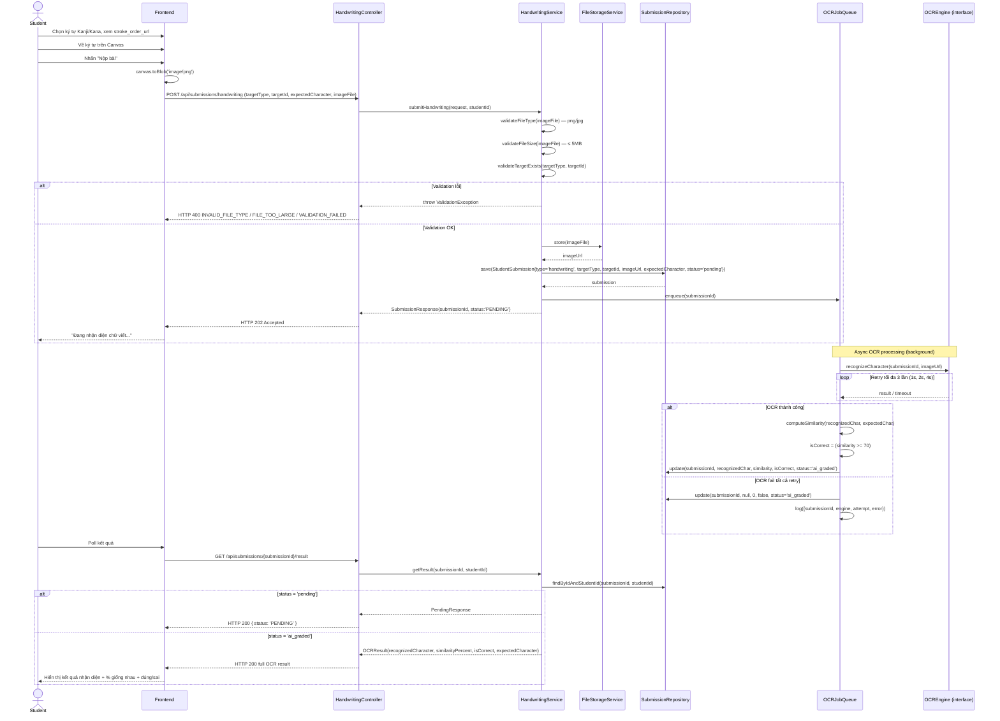

# UC-20 — Luyện Viết Tay AI (AI Handwriting Practice — OCR)

> **Feature:** `feat-ai-skills` | **Phiên bản:** 1.0 | **Trạng thái:** Draft
> **Tham chiếu FR:** FR-AI-20, FR-AI-21, FR-AI-22, FR-AI-23, FR-AI-24, FR-AI-25, FR-AI-30, FR-AI-31, FR-AI-32, FR-AI-33, FR-AI-34, FR-AI-35
> **Cập nhật:** 2026-06-17

---

## 1. Tổng Quan

| Thuộc tính | Nội dung |
|:---|:---|
| **Mã Use Case** | UC-20 |
| **Tên** | Luyện Viết Tay AI (AI Handwriting Practice — OCR) |
| **Tác nhân chính** | Student — học viên đã đăng nhập, có thiết bị cảm ứng hoặc chuột |
| **Mô tả ngắn** | Học viên chọn ký tự Kanji hoặc Kana cần luyện, xem hướng dẫn nét viết (stroke order), vẽ lại trên Canvas trong trình duyệt, nộp ảnh PNG. Hệ thống dùng OCR nhận diện ký tự đã vẽ, so sánh với ký tự chuẩn và trả về phần trăm giống nhau (`similarity_percent`) |
| **Độ ưu tiên** | Cao (P1) — kỹ năng viết là core value của AI module |

---

## 2. Tác Nhân & Điều Kiện

### 2.1 Tác Nhân

| Tác nhân | Vai trò |
|:---|:---|
| **Student** | Chọn ký tự, vẽ trên Canvas, nộp ảnh, poll kết quả OCR |
| **AI Engine (OCR)** | Nhận diện ký tự từ ảnh PNG, tính similarity % (abstract qua interface — engine cụ thể chưa chốt) |
| **Staff** | Override điểm nếu cần — ngoài phạm vi, xem `feat-support` UC-31 |

### 2.2 Điều Kiện Tiền Quyết (Preconditions)

- Student đã đăng nhập (JWT hợp lệ), `student_users.status = 'active'`
- Ký tự mục tiêu tồn tại: bản ghi `kanji` hoặc `kana_characters` với `targetId` hợp lệ
- Frontend có thể render Canvas và export PNG (hỗ trợ bởi HTML5 Canvas API)

### 2.3 Hậu Điều Kiện (Postconditions)

- **Thành công (nộp bài):** Bản ghi `student_submissions` (`submission_type='handwriting'`, `status='pending'`) được tạo; ảnh PNG lưu tại `/uploads` hoặc S3; job OCR được enqueue; trả HTTP 202 với `submissionId`
- **Thành công (kết quả):** `student_submissions` được cập nhật với `recognized_character`, `similarity_percent`, `is_correct`, `status='ai_graded'`
- **Thất bại:** Không tạo bản ghi nếu validation lỗi; OCR fail sau 3 retry → `similarity_percent=0`, `is_correct=false`, fallback message, toàn bộ lỗi log

---

## 3. Luồng Xử Lý

### 3.1 Luồng Chính — Vẽ & Nhận Kết Quả OCR (Happy Path)

```
Bước 1  [Student]:  Chọn ký tự Kanji/Kana cần luyện (từ trang học hoặc danh sách)
Bước 2  [Frontend]: Hiển thị: ký tự mục tiêu + stroke_order_url (ảnh hướng dẫn nét)
Bước 3  [Student]:  Vẽ ký tự lên Canvas bằng chuột hoặc màn hình cảm ứng
Bước 4  [Student]:  Nhấn "Nộp bài"
Bước 5  [Frontend]: Export Canvas → PNG; gửi POST /api/submissions/handwriting
                    (multipart: targetType + targetId + expectedCharacter + imageFile)
Bước 6  [Backend]:  Validate imageFile (png/jpg, ≤ 5MB)
Bước 7  [Backend]:  Validate targetType ∈ {'kanji','kana'} và targetId tồn tại trong bảng tương ứng
Bước 8  [Backend]:  Lưu PNG tại /uploads hoặc S3, lấy URL
Bước 9  [Backend]:  Tạo student_submissions {
                      submission_type='handwriting',
                      target_type=targetType,
                      kanji_id / kana_id = targetId,
                      handwriting_image_url = imageUrl,
                      expected_character = expectedCharacter,
                      status = 'pending'
                    }
Bước 10 [Backend]:  Enqueue async OCR job với submissionId
Bước 11 [Backend]:  Trả ngay HTTP 202 { submissionId, status: 'PENDING' } — KHÔNG chờ OCR
Bước 12 [OCR Engine]: (background) Nhận diện ký tự từ PNG
                       So sánh với expected_character
                       Tính similarity_percent (0–100)
                       Đặt is_correct = (similarity_percent >= 70)
Bước 13 [Backend]:  Cập nhật student_submissions với kết quả OCR, status='ai_graded', ocr_processed_at=now
Bước 14 [Student]:  Poll kết quả: GET /api/submissions/{submissionId}/result
Bước 15 [Backend]:  Nếu 'pending' → trả PENDING; nếu 'ai_graded' → trả kết quả OCR đầy đủ
Bước 16 [Student]:  Nhận kết quả: ký tự nhận diện được, % giống nhau, đúng/sai
```

### 3.2 Luồng Lỗi

| Tình huống | HTTP | Error Code | Xử lý |
|:---|:---:|:---|:---|
| File không phải png/jpg | 400 | `INVALID_FILE_TYPE` | Từ chối ngay tại Controller |
| File > 5MB | 400 | `FILE_TOO_LARGE` | Từ chối ngay tại Controller |
| `targetType` không phải 'kanji' hoặc 'kana' | 400 | `VALIDATION_FAILED` | Từ chối tại Controller |
| `targetId` không tồn tại trong bảng tương ứng | 404 | `SUBMISSION_NOT_FOUND` | Service throw exception |
| `expectedCharacter` thiếu | 400 | `VALIDATION_FAILED` | Từ chối tại Controller |
| `submissionId` không tồn tại khi poll | 404 | `SUBMISSION_NOT_FOUND` | Service throw exception |
| JWT thiếu hoặc hết hạn | 401 | `UNAUTHORIZED` | Spring Security filter |
| OCR fail sau 3 lần retry | — (nội bộ) | — | Set fallback: `recognized_character=null`, `similarity_percent=0`, `is_correct=false`; log đầy đủ; trả message thân thiện qua poll |

### 3.3 Luồng OCR Fail & Fallback

```
OCR Engine timeout / lỗi (attempt 1)
  → Retry sau 1 giây (attempt 2)
  → Retry sau 2 giây (attempt 3)
  → Retry sau 4 giây (attempt 4 — final)
  → Tất cả fail: cập nhật student_submissions:
      status              = 'ai_graded'
      recognized_character = null
      similarity_percent   = 0
      is_correct           = false
      ocr_processed_at     = now
  → Log đầy đủ { submissionId, engine, attempt, status, duration, errorMessage }
  → Poll response: message thân thiện, KHÔNG expose raw OCR error
```

---

## 4. Quy Tắc Nghiệp Vụ

| Mã | Quy tắc | Tham chiếu FR |
|:---|:---|:---|
| BR-20-01 | Ảnh viết tay KHÔNG được lưu BLOB trong DB — chỉ lưu URL/path | FR-AI-21, ADR-006 |
| BR-20-02 | Hệ thống PHẢI trả HTTP 202 + submissionId ngay, KHÔNG chờ OCR | FR-AI-21, FR-AI-32 |
| BR-20-03 | OCR chỉ so sánh **similarity %** — KHÔNG phân tích stroke order, stroke direction, hay thẩm mỹ thư pháp | FR-AI-24, ADR-007 |
| BR-20-04 | Ngưỡng đúng/sai: `is_correct = (similarity_percent >= 70)` — ngưỡng có thể cấu hình | FR-AI-22 |
| BR-20-05 | OCR fail → `recognized_character=null`, `similarity_percent=0`, `is_correct=false` | FR-AI-25 |
| BR-20-06 | OCR call phải có timeout 30 giây/lần, tối đa 3 lần retry (backoff: 1s, 2s, 4s) | FR-AI-25, FR-AI-30, FR-AI-31 |
| BR-20-07 | KHÔNG expose raw OCR error ra Student — luôn dùng fallback message | FR-AI-07, FR-AI-25 |
| BR-20-08 | Mọi OCR call phải log đầy đủ: `{ submissionId, engine, attempt, status, duration, errorMessage }` | FR-AI-33 |
| BR-20-09 | `targetType` phải là 'kanji' hoặc 'kana'; `targetId` phải khớp bảng tương ứng | FR-AI-21 |
| BR-20-10 | OCR engine phải abstract qua interface — không hard-code implementation cụ thể | NFR-AI-08 |

---

## 5. Quy Tắc Kiểm Tra Đầu Vào

| Trường | Kiểm tra | Thông báo lỗi nếu sai |
|:---|:---|:---|
| `targetType` | Bắt buộc, enum {'kanji', 'kana'} | 400 `VALIDATION_FAILED` |
| `targetId` | Bắt buộc, số nguyên dương, tồn tại trong `kanji` hoặc `kana_characters` | 400 `VALIDATION_FAILED` / 404 `SUBMISSION_NOT_FOUND` |
| `expectedCharacter` | Bắt buộc, chuỗi không rỗng, tối đa 5 ký tự | 400 `VALIDATION_FAILED` |
| `imageFile` | Bắt buộc, MIME type png/jpg, kích thước ≤ 5MB | 400 `INVALID_FILE_TYPE` / 400 `FILE_TOO_LARGE` |
| `submissionId` (poll) | Bắt buộc, số nguyên dương, tồn tại trong DB, thuộc Student đang đăng nhập | 400 `VALIDATION_FAILED` / 404 `SUBMISSION_NOT_FOUND` |

---

## 6. Sơ Đồ Tuần Tự (Sequence Diagram)



---

## 7. Tham Chiếu API

| Phương thức | Endpoint | Mô tả |
|:---|:---|:---|
| `POST` | `/api/submissions/handwriting` | Nộp ảnh viết tay PNG — async, trả ngay 202 + submissionId |
| `GET` | `/api/submissions/{submissionId}/result` | Poll kết quả OCR (PENDING → ai_graded) |
| `GET` | `/api/submissions?type=handwriting&page=0&size=10` | Lịch sử nộp bài viết tay của Student |

> Xem đặc tả request/response đầy đủ tại [`feat-ai-skills/SPEC.md §6`](./SPEC.md)

---

## 8. Tiêu Chí Chấp Nhận (Acceptance Criteria)

### AC-20-01 — Hiển thị ký tự mục tiêu và hướng dẫn nét viết

> **Tham chiếu:** FR-AI-20

- **Cho trước:** Ký tự Kanji/Kana tồn tại trong DB có `stroke_order_url`
- **Khi:** Frontend render trang luyện viết
- **Thì:** Hiển thị đúng ký tự mục tiêu và ảnh `stroke_order_url` làm tham chiếu

### AC-20-02 — Nộp bài async, trả ngay submission ID

> **Tham chiếu:** FR-AI-21, AC-AI-05

- **Cho trước:** Ảnh PNG hợp lệ (≤ 5MB), targetType='kanji', targetId tồn tại
- **Khi:** `POST /api/submissions/handwriting`
- **Thì:** HTTP 202 trong vòng < 500ms, response có `submissionId` và `status: 'PENDING'`; KHÔNG chờ OCR

### AC-20-03 — OCR nhận diện đúng → isCorrect = true

> **Tham chiếu:** FR-AI-22, FR-AI-23, AC-AI-06

- **Cho trước:** Student vẽ đúng ký tự; OCR trả về `similarity_percent >= 70`
- **Khi:** `GET /api/submissions/{submissionId}/result` sau khi OCR xong
- **Thì:** HTTP 200, `status: 'ai_graded'`, `isCorrect: true`, `similarityPercent >= 70`

### AC-20-04 — OCR nhận diện sai → isCorrect = false

> **Tham chiếu:** FR-AI-22, FR-AI-23, AC-AI-07

- **Cho trước:** Student vẽ sai ký tự; OCR trả về `similarity_percent < 70`
- **Khi:** `GET /api/submissions/{submissionId}/result` sau khi OCR xong
- **Thì:** HTTP 200, `status: 'ai_graded'`, `isCorrect: false`, `similarityPercent < 70`

### AC-20-05 — OCR chỉ trả similarity %, không phân tích stroke

> **Tham chiếu:** FR-AI-24, ADR-007

- **Cho trước:** Bất kỳ submission nào thành công
- **Khi:** Kiểm tra response của poll result
- **Thì:** Response không có trường nào liên quan đến stroke order, stroke direction, hay calligraphy score

### AC-20-06 — OCR fail → fallback, không expose raw error

> **Tham chiếu:** FR-AI-25, AC-AI-04

- **Cho trước:** OCR engine timeout liên tục sau 3 lần retry
- **Khi:** `GET /api/submissions/{submissionId}/result`
- **Thì:** HTTP 200, `status: 'ai_graded'`, `recognizedCharacter: null`, `similarityPercent: 0`, `isCorrect: false`, message thân thiện; lỗi được log đầy đủ

### AC-20-07 — Từ chối file sai định dạng

> **Tham chiếu:** NFR-AI-06

- **Cho trước:** File gif (không hợp lệ)
- **Khi:** `POST /api/submissions/handwriting` với imageFile là gif
- **Thì:** HTTP 400, error code `INVALID_FILE_TYPE`

### AC-20-08 — Từ chối file quá lớn

> **Tham chiếu:** NFR-AI-06

- **Cho trước:** File PNG 6MB
- **Khi:** `POST /api/submissions/handwriting`
- **Thì:** HTTP 400, error code `FILE_TOO_LARGE`

### AC-20-09 — Ảnh không lưu BLOB trong DB

> **Tham chiếu:** FR-AI-21, ADR-006, AC-AI-09

- **Cho trước:** Bất kỳ submission nào thành công
- **Khi:** Kiểm tra bản ghi trong DB
- **Thì:** `handwriting_image_url` là chuỗi URL/path; cột không chứa binary data

---

## 9. Ngoài Phạm Vi (Out of Scope)

- ❌ Phân tích thứ tự nét viết (stroke order) — chỉ so sánh similarity % (ADR-007)
- ❌ Đánh giá thẩm mỹ thư pháp (calligraphy aesthetics)
- ❌ Chấm bài thủ công bởi Staff — xem `feat-support` UC-31
- ❌ Hướng dẫn nét viết động (animated stroke) — chỉ hiển thị ảnh tĩnh `stroke_order_url`
- ❌ Chọn OCR engine cụ thể — placeholder `[AI_ENGINE]`, thiết kế qua interface
- ❌ So sánh nhiều ký tự cùng lúc trong một submission
