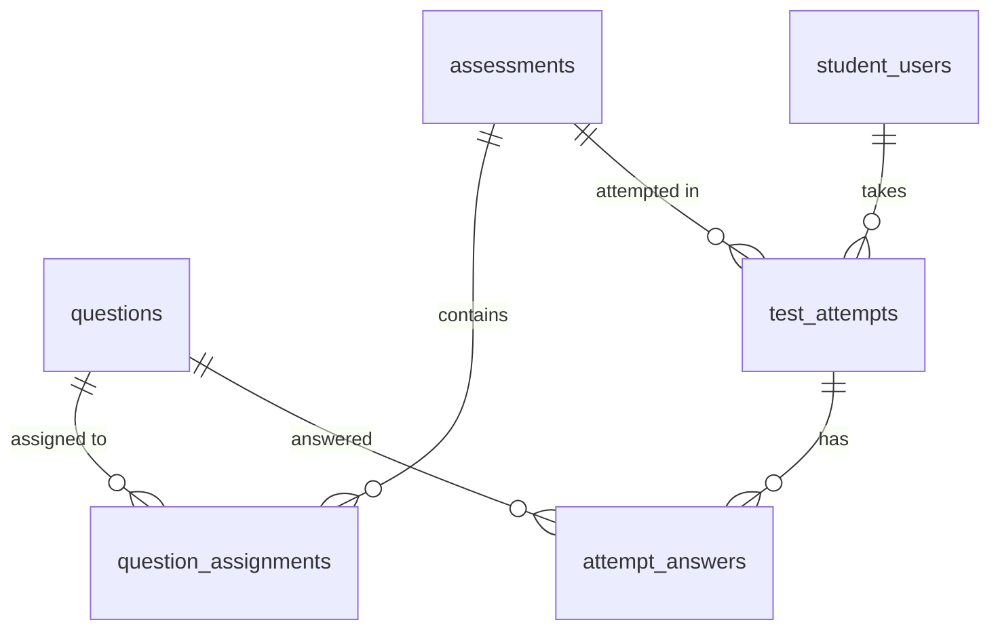

# SPEC — Assessment & Testing (Quiz & JLPT Mock Exam)
> **Feature ID:** `feat-assessment`
> **UC Coverage:** UC-10 (JLPT Mock Test), UC-11 (Quiz & Practice)
> **Version:** 1.0 | **Status:** Draft
> **Author:** Team | **Last Updated:** 2026-05-28

---

## 1. CONTEXT & GOAL

### 1.1 Bối cảnh
Học viên cần kiểm tra kiến thức qua hai hình thức: (1) Quiz ngắn theo bài học/kỹ năng để luyện tập hàng ngày, và (2) Đề thi thử JLPT đầy đủ giả lập cấu trúc thi thật với đồng hồ đếm ngược.

### 1.2 Mục tiêu
- Cung cấp quiz 10-20 câu với chấm điểm tức thì và giải thích chi tiết
- Cung cấp đề thi thử JLPT đầy đủ 3 phần với timer server-side
- Đảm bảo điểm số chỉ được tính server-side, không tin tưởng client
- Mỗi lần nộp bài tạo một bản ghi mới (bất biến)

### 1.3 Tại sao cần?
Kiểm tra là cách duy nhất học viên biết họ đang ở đâu trong lộ trình. Mock test giả lập trải nghiệm thi thật giúp giảm lo lắng và cải thiện kết quả.

---

## 2. ACTOR

| Actor | Role | Điều kiện tiền quyết |
|:---|:---|:---|
| **Student** | Làm bài quiz/thi | Đã đăng nhập, status = `active` |
| **Staff** | Xem kết quả thống kê | Đã đăng nhập Staff — xem `feat-support` |

---

## 3. FUNCTIONAL REQUIREMENTS (EARS)

### 3.1 UC-11 — Quiz & Luyện tập (Practice Quiz)

| ID | EARS Requirement |
|:---|:---|
| FR-ASSESS-01 | WHEN a Student selects a quiz or practice session, THE SYSTEM SHALL fetch `assessments` with `assessment_type = 'quiz'` or `'practice'` and `status = 'published'`. |
| FR-ASSESS-02 | WHEN a quiz session is initiated, THE SYSTEM SHALL return 10–20 questions from `question_assignments` linked to the assessment, each with `option_a`, `option_b`, `option_c`, `option_d` (for multiple choice) or blank indicator (for fill_blank). |
| FR-ASSESS-03 | THE SYSTEM SHALL NOT include `correct_option` or `correct_answer_text` in the question payload sent to the client. |
| FR-ASSESS-04 | WHEN a Student submits answers via POST, THE SYSTEM SHALL calculate the score server-side by comparing submitted answers against `questions.correct_option` or `correct_answer_text`. |
| FR-ASSESS-05 | WHEN scoring is complete, THE SYSTEM SHALL create a new `test_attempts` record with `attempt_type = 'quiz'/'practice'`, the calculated score, and timestamp. THE SYSTEM SHALL NOT update existing attempt records. |
| FR-ASSESS-06 | WHEN the result is returned to the Student, THE SYSTEM SHALL include: total score, per-question correct/incorrect status, and the explanation (`explanation` field from `questions`) for each question. |
| FR-ASSESS-07 | THE SYSTEM SHALL validate that `score >= 0` AND `score <= total_questions`. IF violated, THE SYSTEM SHALL throw a `BusinessRuleViolationException` and log the incident. |

### 3.2 UC-10 — Thi thử JLPT (JLPT Mock Exam)

| ID | EARS Requirement |
|:---|:---|
| FR-ASSESS-10 | WHEN a Student starts a JLPT mock exam, THE SYSTEM SHALL load the `assessments` record with `assessment_type = 'exam'` and `status = 'published'`, record the start time server-side, and return all questions organized by `section_name` from `question_assignments`. |
| FR-ASSESS-11 | WHILE a mock exam is in progress, THE SYSTEM SHALL track the elapsed time server-side using the stored start time. The client timer is for display only. |
| FR-ASSESS-12 | WHEN a Student submits the exam (manual or timeout), THE SYSTEM SHALL validate that the submission time does not exceed `assessments.duration_min`. IF time exceeded, THE SYSTEM SHALL only accept answers submitted within the allowed window. |
| FR-ASSESS-13 | WHEN scoring a mock exam, THE SYSTEM SHALL calculate section scores separately (language/reading/listening) and store them as JSON in `test_attempts.section_scores`. |
| FR-ASSESS-14 | WHEN the exam result is computed, THE SYSTEM SHALL compare the total score against `assessments.pass_score` and set `is_passed = true/false` accordingly. |
| FR-ASSESS-15 | WHEN the exam result is returned, THE SYSTEM SHALL display: total score, section scores, pass/fail status, and per-question results. |
| FR-ASSESS-16 | IF an exam has an `audio_url` for the listening section, THE SYSTEM SHALL return the `audio_url` as part of the exam payload. THE SYSTEM SHALL NOT stream audio directly from the backend. |

### 3.3 Quy tắc chung

| ID | EARS Requirement |
|:---|:---|
| FR-ASSESS-20 | WHILE a `questions` record has `is_locked = true` (has existing attempts), THE SYSTEM SHALL NOT allow Staff to modify the question content; Staff must create a new version instead. |
| FR-ASSESS-21 | THE SYSTEM SHALL log each submission to `admin_audit_logs` with action = `QUIZ_SUBMITTED` or `EXAM_SUBMITTED`, including `{studentId, assessmentId, attemptId, score}`. |

---

## 4. NON-FUNCTIONAL REQUIREMENTS

| ID | Category | Requirement |
|:---|:---|:---|
| NFR-ASSESS-01 | Security | Score phải được tính server-side 100%. Client không được gửi score. |
| NFR-ASSESS-02 | Security | `correct_option`/`correct_answer_text` KHÔNG BAO GIỜ được trả về client trước khi nộp bài |
| NFR-ASSESS-03 | Correctness | `score >= 0` và `score <= max_score` phải được validate tại Service layer |
| NFR-ASSESS-04 | Immutability | `test_attempts` records phải là bất biến sau khi submitted — không UPDATE |
| NFR-ASSESS-05 | Performance | Submit quiz response < 1000ms (p95) kể cả tính điểm 20 câu |
| NFR-ASSESS-06 | Time Validation | Server phải validate thời gian nộp bài; client timer chỉ để hiển thị |
| NFR-ASSESS-07 | Logging | SLF4J: log mọi submission với `{studentId, assessmentId, score, duration}` |

---

## 5. DATA MODEL

### 5.1 Bảng chính

> Nguồn: [`jlpt_database_v2.sql`](file:///d:/Japanese-Skill-Practice-Platform/3.src/infra/Database/jlpt_database_v2.sql)

```sql
-- Bảng 10: questions (ngân hàng câu hỏi)
CREATE TABLE questions (
    question_id      BIGINT IDENTITY(1,1) PRIMARY KEY,
    question_text    NVARCHAR(MAX)  NOT NULL,
    question_type    NVARCHAR(30)   NOT NULL
        CHECK (question_type IN ('multiple_choice','fill_blank','true_false')),
    skill            NVARCHAR(30)   NOT NULL
        CHECK (skill IN ('vocabulary','grammar','kanji','reading','listening','mixed')),
    jlpt_level       NVARCHAR(5)    NOT NULL
        CHECK (jlpt_level IN ('N5','N4','N3','N2','N1')),
    explanation      NVARCHAR(MAX)  NULL,
    audio_url        NVARCHAR(500)  NULL,
    image_url        NVARCHAR(500)  NULL,
    option_a         NVARCHAR(MAX)  NULL,
    option_b         NVARCHAR(MAX)  NULL,
    option_c         NVARCHAR(MAX)  NULL,
    option_d         NVARCHAR(MAX)  NULL,
    correct_option   CHAR(1)        NULL
        CHECK (correct_option IN ('A','B','C','D')),
    correct_answer_text NVARCHAR(MAX) NULL,
    created_by       BIGINT         NULL,  -- FK → staff_users
    status           NVARCHAR(20)   NOT NULL DEFAULT 'draft'
        CHECK (status IN ('draft','pending_review','rejected','published','archived','deleted')),
    approved_by      BIGINT         NULL,  -- FK → staff_users
    published_at     DATETIME2      NULL,
    created_at       DATETIME2      NOT NULL DEFAULT SYSUTCDATETIME(),
    updated_at       DATETIME2      NOT NULL DEFAULT SYSUTCDATETIME()
);

-- Bảng 11: assessments (Quiz + Exam gộp chung)
CREATE TABLE assessments (
    assessment_id   BIGINT IDENTITY(1,1) PRIMARY KEY,
    assessment_type NVARCHAR(20)    NOT NULL
        CHECK (assessment_type IN ('quiz','exam')),
    title           NVARCHAR(255)   NOT NULL,
    lesson_id       BIGINT          NULL,   -- FK → lessons
    topic           NVARCHAR(100)   NULL,
    jlpt_level      NVARCHAR(5)     NULL
        CHECK (jlpt_level IN ('N5','N4','N3','N2','N1')),
    duration_min    INT             NULL,
    pass_score      INT             NULL,
    total_score     INT             NULL,
    audio_url       NVARCHAR(500)   NULL,
    status          NVARCHAR(20)    NOT NULL DEFAULT 'draft'
        CHECK (status IN ('draft','pending_review','rejected','published','archived','deleted')),
    created_by      BIGINT          NULL,   -- FK → staff_users
    approved_by     BIGINT          NULL,   -- FK → staff_users
    published_at    DATETIME2       NULL,
    created_at      DATETIME2       NOT NULL DEFAULT SYSUTCDATETIME(),
    updated_at      DATETIME2       NOT NULL DEFAULT SYSUTCDATETIME()
);

-- Bảng 12: question_assignments
CREATE TABLE question_assignments (
    assignment_id   BIGINT IDENTITY(1,1) PRIMARY KEY,
    parent_type     NVARCHAR(30)    NOT NULL
        CHECK (parent_type IN ('assessment','lesson')),
    parent_id       BIGINT          NOT NULL,  -- assessment_id or lesson_id
    question_id     BIGINT          NOT NULL,  -- FK → questions
    section_name    NVARCHAR(100)   NULL,
    score           DECIMAL(6,2)    NOT NULL DEFAULT 1,
    display_order   INT             NOT NULL DEFAULT 0,
    CONSTRAINT UQ_assign UNIQUE (parent_type, parent_id, question_id)
);

-- Bảng 13: test_attempts
CREATE TABLE test_attempts (
    attempt_id        BIGINT IDENTITY(1,1) PRIMARY KEY,
    student_id        BIGINT          NOT NULL,  -- FK → student_users
    attempt_type      NVARCHAR(20)    NOT NULL
        CHECK (attempt_type IN ('exam','quiz','practice','reading','listening')),
    parent_type       NVARCHAR(30)    NOT NULL
        CHECK (parent_type IN ('assessment','lesson','random_practice')),
    parent_id         BIGINT          NULL,
    started_at        DATETIME2       NOT NULL DEFAULT SYSUTCDATETIME(),
    submitted_at      DATETIME2       NULL,
    duration_seconds  INT             NULL,
    total_score       DECIMAL(8,2)    NULL,
    max_score         DECIMAL(8,2)    NULL,
    is_passed         BIT             NULL,
    language_knowledge_score DECIMAL(8,2) NULL,
    reading_score            DECIMAL(8,2) NULL,
    listening_score          DECIMAL(8,2) NULL,
    status            NVARCHAR(20)    NOT NULL DEFAULT 'in_progress'
        CHECK (status IN ('in_progress','submitted','auto_submitted','abandoned'))
);

-- Bảng 14: attempt_answers
CREATE TABLE attempt_answers (
    answer_id          BIGINT IDENTITY(1,1) PRIMARY KEY,
    attempt_id         BIGINT          NOT NULL,  -- FK → test_attempts
    question_id        BIGINT          NOT NULL,  -- FK → questions
    selected_option    CHAR(1)         NULL
        CHECK (selected_option IN ('A','B','C','D')),
    answer_text        NVARCHAR(MAX)   NULL,       -- fill_blank
    is_correct         BIT             NULL,
    score              DECIMAL(6,2)    NULL,
    answered_at        DATETIME2       NOT NULL DEFAULT SYSUTCDATETIME()
);
```

### 5.2 Quan hệ



---

## 6. API SPEC

### `GET /api/assessments?type={quiz|exam}&level={N3}&page=0&size=10`
**Actor:** Student | **Auth:** Bearer JWT

**Response (200):**
```json
{
  "status": 200,
  "message": "OK",
  "data": {
    "content": [
      {
        "assessmentId": "long",
        "title": "string",
        "assessmentType": "string",
        "jlptLevel": "string",
        "skill": "string",
        "durationMin": "int",
        "totalScore": "int",
        "questionCount": "int"
      }
    ],
    "totalElements": "long",
    "totalPages": "int"
  }
}
```

---

### `POST /api/assessments/{assessmentId}/start`
**Actor:** Student | **Auth:** Bearer JWT
> Bắt đầu bài thi, server ghi lại `started_at`.

**Response (200):**
```json
{
  "status": 200,
  "message": "Bắt đầu làm bài",
  "data": {
    "attemptId": "long",
    "startedAt": "datetime",
    "durationMin": "int",
    "sections": [
      {
        "sectionName": "string",
        "questions": [
          {
            "questionId": "long",
            "content": "string",
            "questionType": "string",
            "optionA": "string|null",
            "optionB": "string|null",
            "optionC": "string|null",
            "optionD": "string|null",
            "displayOrder": "int"
          }
        ]
      }
    ],
    "audioUrl": "string|null"
  }
}
```

---

### `POST /api/assessments/{assessmentId}/submit`
**Actor:** Student | **Auth:** Bearer JWT

**Request:**
```json
{
  "attemptId": "long",
  "answers": [
    {
      "questionId": "long",
      "selectedOption": "string|null — A|B|C|D",
      "answerText": "string|null — fill_blank"
    }
  ]
}
```

**Response (200):**
```json
{
  "status": 200,
  "message": "Nộp bài thành công",
  "data": {
    "attemptId": "long",
    "score": "int",
    "maxScore": "int",
    "isPassed": "boolean|null",
    "sectionScores": {
      "language": "int|null",
      "reading": "int|null",
      "listening": "int|null"
    },
    "results": [
      {
        "questionId": "long",
        "isCorrect": "boolean",
        "selectedOption": "string|null",
        "correctOption": "string",
        "explanation": "string|null"
      }
    ]
  }
}
```

---

### `GET /api/test-attempts?assessmentId={id}&page=0&size=10`
**Actor:** Student | **Auth:** Bearer JWT
> Lịch sử làm bài của Student.

**Response (200):**
```json
{
  "status": 200,
  "message": "OK",
  "data": {
    "content": [
      {
        "attemptId": "long",
        "assessmentTitle": "string",
        "score": "int",
        "maxScore": "int",
        "isPassed": "boolean|null",
        "submittedAt": "datetime",
        "durationSeconds": "int"
      }
    ],
    "totalElements": "long"
  }
}
```

---

## 7. ERROR HANDLING

| HTTP Code | Error Code | Message | Trigger |
|:---:|:---|:---|:---|
| 400 | `VALIDATION_FAILED` | "Dữ liệu không hợp lệ" | answers array rỗng, selectedOption không phải A-D |
| 400 | `TIME_EXCEEDED` | "Đã hết thời gian làm bài" | Submit sau khi hết duration |
| 401 | `UNAUTHORIZED` | "Yêu cầu đăng nhập" | JWT thiếu/hết hạn |
| 403 | `VIP_REQUIRED` | "Bài thi này yêu cầu tài khoản VIP" | is_vip_only content |
| 404 | `ASSESSMENT_NOT_FOUND` | "Bài thi không tồn tại" | assessmentId không có hoặc status ≠ published |
| 404 | `ATTEMPT_NOT_FOUND` | "Lần làm bài không tồn tại" | attemptId không có |
| 422 | `SCORE_INVARIANT_VIOLATION` | "Điểm số không hợp lệ" | score < 0 hoặc score > max_score |
| 422 | `ATTEMPT_ALREADY_SUBMITTED` | "Bài đã được nộp" | Nộp lại cùng attemptId |
| 500 | `INTERNAL_ERROR` | "Internal server error" | Lỗi hệ thống |

---

## 8. ACCEPTANCE CRITERIA

| ID | Scenario | Given | When | Then |
|:---|:---|:---|:---|:---|
| AC-ASSESS-01 | Lấy danh sách quiz N3 | Quiz N3 published tồn tại | GET /api/assessments?type=quiz&level=N3 | Trả list đúng, không có draft/deleted |
| AC-ASSESS-02 | Correct_option không lộ khi GET | Quiz đang làm | GET /api/assessments/{id}/start | Response KHÔNG có correct_option |
| AC-ASSESS-03 | Nộp bài quiz, tính điểm đúng | 10 câu, trả lời đúng 8 | POST submit | score=8, isCorrect đúng từng câu |
| AC-ASSESS-04 | Tạo bản ghi mới mỗi lần nộp | Student nộp lần 2 | POST submit lần 2 | Tạo attempt_id mới, không update cũ |
| AC-ASSESS-05 | Quá giờ bị chặn | durationMin=60, submit sau 61 phút | POST submit | HTTP 400 TIME_EXCEEDED |
| AC-ASSESS-06 | score không âm | Tất cả sai | POST submit | score=0, không âm |
| AC-ASSESS-07 | Mock exam tính section scores | Thi đủ 3 phần | POST submit exam | sectionScores có language, reading, listening |
| AC-ASSESS-08 | Pass/Fail đúng | pass_score=60, score=65 | POST submit | isPassed=true |

---

## OUT OF SCOPE

- ❌ Tạo/chỉnh sửa đề thi và câu hỏi — xem `feat-content-management`
- ❌ Staff xem kết quả thống kê — xem `feat-support` (UC-32)
- ❌ Luyện đọc/nghe riêng lẻ — xem `feat-reading-listening`
- ❌ AI chấm điểm — xem `feat-ai-skills`
- ❌ Xem review bài làm chi tiết sau khi nộp (lần sau) — Phase 2
- ❌ Giới hạn số lần làm lại — Phase 2
