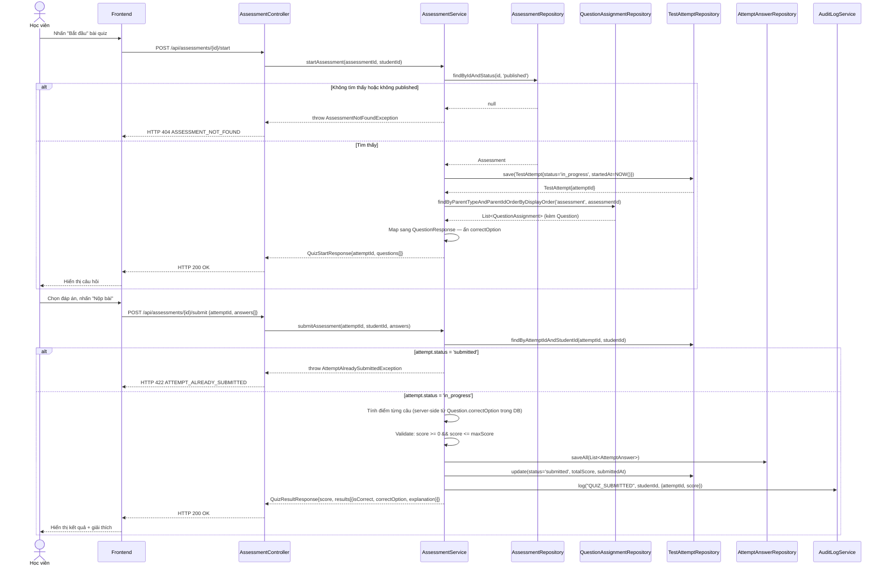

# UC-11 — Quiz & Luyện Tập (Quiz & Practice)

> **Feature:** `feat-assessment` | **Phiên bản:** 1.0 | **Trạng thái:** Draft
> **Tham chiếu FR:** FR-ASSESS-01, FR-ASSESS-02, FR-ASSESS-03, FR-ASSESS-04, FR-ASSESS-05, FR-ASSESS-06, FR-ASSESS-07, FR-ASSESS-20, FR-ASSESS-21
> **Cập nhật:** 2026-06-10

---

## 1. Tổng Quan

| Thuộc tính | Nội dung |
|:---|:---|
| **Mã Use Case** | UC-11 |
| **Tên** | Quiz & Luyện Tập |
| **Tác nhân chính** | Học viên (Student) — đã đăng nhập, `status = 'active'` |
| **Mô tả ngắn** | Học viên chọn một bài quiz hoặc phiên luyện tập ngắn (10–20 câu), làm bài, và nhận kết quả tức thì kèm giải thích chi tiết từng câu |
| **Độ ưu tiên** | Cao (P1) — tính năng học tập cốt lõi hàng ngày |

---

## 2. Tác Nhân & Điều Kiện

### 2.1 Tác Nhân

| Tác nhân | Vai trò |
|:---|:---|
| **Học viên (Student)** | Người chủ động chọn quiz, làm bài và nhận kết quả |
| **Backend (AssessmentService)** | Tính điểm server-side, lưu bản ghi bài làm |
| **AuditLogService** | Ghi lại mọi lần nộp bài |

### 2.2 Điều Kiện Tiền Quyết (Preconditions)

- Học viên đã đăng nhập và JWT còn hạn
- Tài khoản `status = 'active'`
- Bài quiz tồn tại trong DB với `status = 'published'`
- Nếu quiz `is_vip_only = true`: học viên phải có `subscription = VIP`

### 2.3 Hậu Điều Kiện (Postconditions)

- **Thành công:** Bản ghi `test_attempts` mới (status = `submitted`) được tạo, cùng toàn bộ `attempt_answers`. Học viên nhận kết quả với điểm số và giải thích từng câu.
- **Thất bại (nộp lại):** Bản ghi cũ không bị thay đổi; hệ thống trả HTTP 422.
- **Thất bại (validation):** Không có bản ghi nào được tạo.

---

## 3. Luồng Xử Lý

### 3.1 Luồng Chính — Làm Quiz (Happy Path)

```
Bước 1 [Học viên]:    Mở trang danh sách quiz, chọn level/kỹ năng muốn luyện
Bước 2 [Frontend]:    GET /api/assessments?type=quiz&level=N3
Bước 3 [Backend]:     Filter assessments: type='quiz', level='N3', status='published'
                       Trả danh sách kèm số câu, độ khó
Bước 4 [Học viên]:    Chọn một bài quiz, nhấn "Bắt đầu"
Bước 5 [Frontend]:    POST /api/assessments/{assessmentId}/start
Bước 6 [Backend]:     Validate assessment tồn tại và published
                       Tạo TestAttempt (status='in_progress', started_at=NOW())
                       Load câu hỏi từ question_assignments
                       Trả QuizStartResponse — KHÔNG kèm correct_option
Bước 7 [Học viên]:    Đọc câu hỏi, chọn đáp án (A/B/C/D hoặc điền vào ô trống)
Bước 8 [Học viên]:    Nhấn "Nộp bài"
Bước 9 [Frontend]:    POST /api/assessments/{assessmentId}/submit {attemptId, answers[]}
Bước 10 [Backend]:    Validate attemptId thuộc student này
                       Validate attempt.status = 'in_progress'
                       Tính điểm từng câu: so sánh selected_option vs correct_option (server DB)
                       Validate: score >= 0 && score <= maxScore
                       Batch insert attempt_answers records
                       Update test_attempts: status='submitted', score, submitted_at
                       Ghi audit log: QUIZ_SUBMITTED {studentId, assessmentId, score}
                       Trả QuizResultResponse: điểm, isCorrect từng câu, explanation
Bước 11 [Frontend]:   Hiển thị kết quả: tổng điểm, từng câu đúng/sai, giải thích
```

### 3.2 Luồng Phụ A — Luyện Tập Ngẫu Nhiên (practice type)

```
Bước 1–3 như trên nhưng với type='practice'
Bước 6 [Backend]: assessment_type='practice', có thể không giới hạn thời gian (duration_min=NULL)
Bước 7–11: Tương tự luồng chính
```

### 3.3 Luồng Lỗi — Nộp Bài Lại (Attempt đã Submitted)

```
Bước 9 [Frontend]:    Gửi POST submit với cùng attemptId đã submitted
Bước 10 [Backend]:    attempt.status = 'submitted' → throw AttemptAlreadySubmittedException
Bước 10 [Backend]:    Bản ghi cũ không bị thay đổi
                       Trả HTTP 422 — ATTEMPT_ALREADY_SUBMITTED
Bước 11 [Frontend]:   Hiển thị lỗi "Bài đã được nộp"
```

### 3.4 Luồng Lỗi — Quiz Không Tồn Tại hoặc Chưa Published

```
Bước 5 [Frontend]:    POST /api/assessments/999/start (không tồn tại)
Bước 6 [Backend]:     throw AssessmentNotFoundException
                       Trả HTTP 404 — ASSESSMENT_NOT_FOUND
```

### 3.5 Luồng Lỗi — Score Invariant Violation (edge case)

```
Bước 10 [Backend]:    Tính điểm → score < 0 HOẶC score > maxScore (lỗi logic nghiêm trọng)
                       throw BusinessRuleViolationException
                       Log [ERROR] [AssessmentService] Score invariant violated {attemptId, score, maxScore}
                       Trả HTTP 422 — SCORE_INVARIANT_VIOLATION
                       Không lưu attempt_answers, không update test_attempts
```

---

## 4. Quy Tắc Nghiệp Vụ

| Mã | Quy tắc | Chi tiết |
|:---|:---|:---|
| BR-11-01 | `correct_option` và `correct_answer_text` **KHÔNG BAO GIỜ** được gửi về client trước khi nộp bài | `QuestionResponse` DTO không chứa các field này |
| BR-11-02 | Score phải được tính **server-side** từ DB | Service lấy `correct_option` từ DB, không tin client |
| BR-11-03 | Mỗi lần nộp tạo **bản ghi MỚI** `test_attempts` | Không UPDATE bản ghi cũ — bất biến hoàn toàn |
| BR-11-04 | `score >= 0` và `score <= maxScore` bắt buộc | Throw exception nếu vi phạm — không persist |
| BR-11-05 | `attempt.status = 'in_progress'` thì mới được submit | Status = 'submitted' → từ chối ngay |
| BR-11-06 | Chỉ nộp được attempt của chính mình | `attempt.student_id = JWT.studentId` — throw 403 nếu không khớp |
| BR-11-07 | `fill_blank` so sánh case-insensitive | `answer_text.trim().equalsIgnoreCase(correct_answer_text.trim())` |
| BR-11-08 | Mọi submission phải ghi audit log | `QUIZ_SUBMITTED` với `{studentId, assessmentId, attemptId, score}` |

---

## 5. Quy Tắc Kiểm Tra Đầu Vào

### POST /api/assessments/{assessmentId}/submit

| Trường | Kiểm tra | Lỗi khi vi phạm |
|:---|:---|:---|
| `attemptId` | Bắt buộc, > 0 | "attemptId không hợp lệ" |
| `answers` | Bắt buộc, không rỗng | "Danh sách đáp án không được rỗng" |
| `answers[].questionId` | Bắt buộc, > 0 | "questionId không hợp lệ" |
| `answers[].selectedOption` | Null hoặc một trong A/B/C/D | "selectedOption phải là A, B, C hoặc D" |
| `answers[].answerText` | Null hoặc max 1000 ký tự | "Câu trả lời quá dài" |

---

## 6. Sơ Đồ Tuần Tự (Sequence Diagram)

### 6.1 Luồng Start + Submit Quiz



---

## 7. Tham Chiếu API

> Xem đặc tả đầy đủ tại [SPEC.md § 6 — API SPEC](./SPEC.md)

| Phương thức | Endpoint | Mô tả |
|:---|:---|:---|
| `GET` | `/api/assessments` | Danh sách quiz/practice có thể làm |
| `POST` | `/api/assessments/{id}/start` | Bắt đầu bài quiz, nhận câu hỏi |
| `POST` | `/api/assessments/{id}/submit` | Nộp bài, nhận kết quả |
| `GET` | `/api/test-attempts` | Lịch sử bài làm |

---

## 8. Tiêu Chí Chấp Nhận (Acceptance Criteria)

### AC-11-01 — Lấy danh sách quiz theo level

> **Tham chiếu:** FR-ASSESS-01

- **Cho trước:** 3 quiz N3 published, 1 quiz N3 draft, 1 quiz N2 published
- **Khi:** GET `/api/assessments?type=quiz&level=N3`
- **Thì:**
  - HTTP 200
  - Trả đúng 3 quiz N3 published
  - Không trả draft/deleted/N2

---

### AC-11-02 — `correct_option` không lộ khi bắt đầu quiz

> **Tham chiếu:** FR-ASSESS-03

- **Cho trước:** Quiz có 10 câu, mỗi câu có `correct_option`
- **Khi:** POST `/api/assessments/{id}/start`
- **Thì:**
  - HTTP 200
  - Response KHÔNG có field `correctOption` trong bất kỳ `QuestionResponse` nào
  - Response CÓ `optionA`, `optionB`, `optionC`, `optionD`

---

### AC-11-03 — Nộp bài, tính điểm đúng

> **Tham chiếu:** FR-ASSESS-04, FR-ASSESS-05

- **Cho trước:** Quiz 10 câu, học viên trả lời đúng 8 câu
- **Khi:** POST `/api/assessments/{id}/submit`
- **Thì:**
  - HTTP 200
  - `score = 8`, `maxScore = 10`
  - 8 câu có `isCorrect = true`, 2 câu có `isCorrect = false`
  - Bản ghi `test_attempts` mới được tạo trong DB

---

### AC-11-04 — Tạo bản ghi mới mỗi lần nộp (không update cũ)

> **Tham chiếu:** FR-ASSESS-05

- **Cho trước:** Học viên đã nộp bài lần 1 (attemptId=1)
- **Khi:** Bắt đầu và nộp lại quiz (POST start → POST submit lần 2)
- **Thì:**
  - `attemptId` lần 2 khác lần 1
  - Bản ghi cũ (attemptId=1) không bị thay đổi
  - DB có 2 bản ghi `test_attempts` riêng biệt

---

### AC-11-05 — Chặn nộp lại cùng attemptId

> **Tham chiếu:** FR-ASSESS-05

- **Cho trước:** Attempt đã `status = 'submitted'`
- **Khi:** POST submit với cùng `attemptId`
- **Thì:**
  - HTTP 422
  - `error_code = "ATTEMPT_ALREADY_SUBMITTED"`
  - Bản ghi cũ không bị thay đổi

---

### AC-11-06 — Score không âm (tất cả sai)

> **Tham chiếu:** FR-ASSESS-07

- **Cho trước:** Quiz 10 câu
- **Khi:** Trả lời sai tất cả 10 câu
- **Thì:**
  - `score = 0`
  - `score >= 0` — không âm

---

### AC-11-07 — Giải thích hiển thị sau khi nộp

> **Tham chiếu:** FR-ASSESS-06

- **Cho trước:** Câu hỏi có `explanation = "Động từ nhóm II..."` trong DB
- **Khi:** POST submit
- **Thì:**
  - Response có `explanation` cho câu đó
  - `correctOption` được trả sau khi nộp bài

---

### AC-11-08 — Chặn truy cập không có JWT

- **Khi:** Gọi bất kỳ endpoint nào không kèm Bearer token
- **Thì:** HTTP 401 `UNAUTHORIZED`

---

## 9. Ngoài Phạm Vi (Out of Scope)

- ❌ Tạo/chỉnh sửa câu hỏi và bài quiz — xem `feat-content-management`
- ❌ JLPT Mock Exam (full exam, timer, section scoring) — xem `feat-mock-test` (UC-10)
- ❌ AI chấm điểm (OCR, Speech) — xem `feat-ai-skills`
- ❌ Giới hạn số lần làm lại — Phase 2
- ❌ Xem lại bài làm chi tiết lần trước — Phase 2
- ❌ Xếp hạng và so sánh điểm với học viên khác — Phase 2
