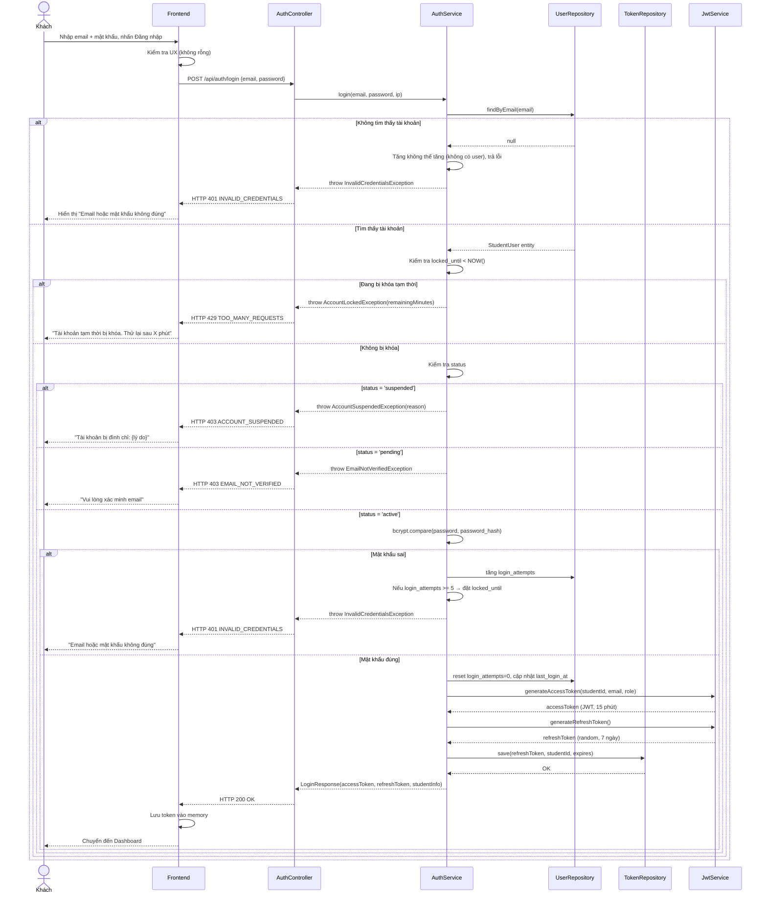
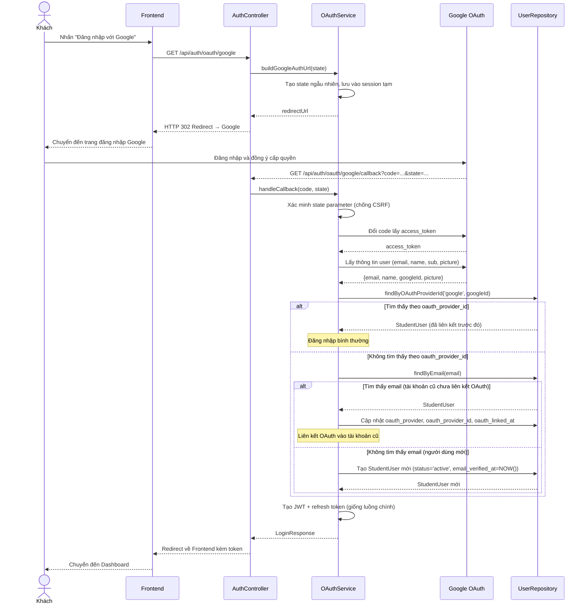

# UC-01 — Đăng Nhập (User Login)

> **Feature:** `feat-auth` | **Phiên bản:** 1.0 | **Trạng thái:** Draft
> **Tham chiếu FR:** FR-AUTH-01, FR-AUTH-02, FR-AUTH-03, FR-AUTH-04, FR-AUTH-05, FR-AUTH-06, FR-AUTH-07
> **Cập nhật:** 2026-05-30

---

## 1. Tổng Quan

| Thuộc tính | Nội dung |
|:---|:---|
| **Mã Use Case** | UC-01 |
| **Tên** | Đăng Nhập (User Login) |
| **Tác nhân chính** | Khách (Guest) — người dùng chưa có phiên đăng nhập |
| **Mô tả ngắn** | Khách xác thực danh tính qua Email/Mật khẩu hoặc Google OAuth để truy cập hệ thống với tư cách Học viên |
| **Độ ưu tiên** | Rất cao (P0) — cổng vào toàn bộ hệ thống |

---

## 2. Tác Nhân & Điều Kiện

### 2.1 Tác Nhân

| Tác nhân | Vai trò |
|:---|:---|
| **Khách** | Người chủ động thực hiện đăng nhập |
| **Google OAuth Provider** | Bên thứ ba xác thực danh tính qua OAuth 2.0 |
| **Hệ thống Email** | Gửi thông báo đăng nhập bất thường (nếu cần) |

### 2.2 Điều Kiện Tiền Quyết (Preconditions)

- Khách có kết nối internet
- Với luồng Email/Mật khẩu: tài khoản đã tồn tại trong `student_users`
- Với luồng OAuth: Google account hợp lệ và có email

### 2.3 Hậu Điều Kiện (Postconditions)

- **Thành công:** Hệ thống tạo bản ghi `auth_tokens` (loại `session` và `refresh`), trả về JWT access token (15 phút) và refresh token (7 ngày); người dùng được chuyển đến Dashboard
- **Thất bại:** Bộ đếm `login_attempts` tăng lên; không tạo token; người dùng ở lại trang đăng nhập

---

## 3. Luồng Xử Lý

### 3.1 Luồng Chính — Đăng Nhập Email/Mật Khẩu (Happy Path)

```
Bước 1 [Khách]:      Điền email và mật khẩu vào form đăng nhập, nhấn "Đăng nhập"
Bước 2 [Frontend]:   Kiểm tra UX cơ bản (email không rỗng, mật khẩu không rỗng), gửi POST /api/auth/login
Bước 3 [Backend]:    Validate định dạng request (email format, required fields)
Bước 4 [Backend]:    Tìm tài khoản trong student_users theo email
Bước 5 [Backend]:    Kiểm tra tài khoản không bị khóa (locked_until < NOW() hoặc NULL)
Bước 6 [Backend]:    Kiểm tra trạng thái tài khoản (status = 'active')
Bước 7 [Backend]:    So sánh mật khẩu với bcrypt (password_hash)
Bước 8 [Backend]:    Đặt lại login_attempts = 0, cập nhật last_login_at
Bước 9 [Backend]:    Tạo JWT access token (15 phút) và refresh token (7 ngày)
Bước 10 [Backend]:   Lưu refresh token vào auth_tokens (token_type = 'refresh')
Bước 11 [Backend]:   Trả về HTTP 200 với accessToken, refreshToken, thông tin student cơ bản
Bước 12 [Frontend]:  Lưu token vào memory/secure storage, chuyển hướng đến Dashboard
```

### 3.2 Luồng Phụ A — Đăng Nhập Qua Google OAuth

```
Bước 1 [Khách]:      Nhấn nút "Đăng nhập với Google"
Bước 2 [Frontend]:   Chuyển hướng đến GET /api/auth/oauth/google
Bước 3 [Backend]:    Tạo state parameter ngẫu nhiên (chống CSRF), lưu vào session tạm
                      Redirect đến Google OAuth consent screen kèm:
                        - client_id, redirect_uri, scope (email, profile), state, response_type=code
Bước 4 [Khách]:      Đồng ý cấp quyền trên trang Google
Bước 5 [Google]:     Redirect về GET /api/auth/oauth/google/callback?code=...&state=...
Bước 6 [Backend]:    Xác minh state parameter khớp với giá trị đã lưu (chống CSRF)
Bước 7 [Backend]:    Đổi authorization code lấy access token từ Google
Bước 8 [Backend]:    Gọi Google API lấy thông tin: email, name, google_id (sub), picture
Bước 9 [Backend]:    → Nếu tìm thấy student_users theo oauth_provider_id = google_id: đăng nhập tài khoản đó
                      → Nếu tìm thấy student_users theo email nhưng chưa có OAuth: liên kết OAuth vào tài khoản (cập nhật oauth_provider, oauth_provider_id, oauth_linked_at)
                      → Nếu không tìm thấy: tạo tài khoản mới (status = 'active', email_verified_at = NOW())
Bước 10 [Backend]:   Tạo JWT và refresh token như luồng chính (Bước 9-10)
Bước 11 [Backend]:   Redirect về Frontend kèm token (qua query param hoặc fragment, cần HTTPS)
Bước 12 [Frontend]:  Nhận token, lưu vào memory, chuyển đến Dashboard
```

### 3.3 Luồng Lỗi — Sai Mật Khẩu (< 5 lần)

```
Bước 4→ [Backend]:   Không tìm thấy tài khoản HOẶC bcrypt so sánh thất bại
Bước X  [Backend]:   Tăng login_attempts thêm 1
                      Ghi log: [WARN] [AuthService] Đăng nhập thất bại {email, ip, attempt_count}
Bước X  [Backend]:   Trả về HTTP 401 — INVALID_CREDENTIALS
                      "Email hoặc mật khẩu không đúng"
```

> **Lưu ý bảo mật:** Thông báo lỗi KHÔNG phân biệt "email không tồn tại" vs "sai mật khẩu" để tránh email enumeration.

### 3.4 Luồng Lỗi — Tài Khoản Bị Khóa Tạm Thời (5 lần sai liên tiếp)

```
Bước X  [Backend]:   login_attempts đạt ngưỡng 5
Bước X  [Backend]:   Đặt locked_until = NOW() + 15 phút
                      Ghi log: [WARN] [AuthService] Tài khoản bị khóa tạm thời {email, ip}
Bước X  [Backend]:   Trả về HTTP 429 — TOO_MANY_REQUESTS
                      "Tài khoản tạm thời bị khóa. Vui lòng thử lại sau {X} phút"
```

> **Lưu ý:** Mọi lần thử đăng nhập trong thời gian bị khóa đều bị từ chối ngay (kiểm tra `locked_until` trước khi so sánh mật khẩu) và KHÔNG tăng thêm `login_attempts`.

### 3.5 Luồng Lỗi — Tài Khoản Bị Đình Chỉ (Suspended)

```
Bước 6 [Backend]:    status = 'suspended'
Bước X  [Backend]:   Ghi log: [WARN] [AuthService] Đăng nhập bị từ chối - tài khoản bị đình chỉ {email}
Bước X  [Backend]:   Trả về HTTP 403 — ACCOUNT_SUSPENDED
                      "Tài khoản của bạn đã bị đình chỉ. Lý do: {suspend_reason}"
```

### 3.6 Luồng Lỗi — Email Chưa Xác Minh

```
Bước 6 [Backend]:    status = 'pending'
Bước X  [Backend]:   Trả về HTTP 403 — EMAIL_NOT_VERIFIED
                      "Vui lòng xác minh email trước khi đăng nhập. Kiểm tra hộp thư hoặc yêu cầu gửi lại."
```

---

## 4. Quy Tắc Nghiệp Vụ

| Mã | Quy tắc | Chi tiết |
|:---|:---|:---|
| BR-01-01 | Bộ đếm thất bại chỉ reset khi **đăng nhập thành công** | Không reset khi hết thời gian khóa |
| BR-01-02 | Kiểm tra `locked_until` **trước** khi so sánh mật khẩu | Tránh timing attack, không cần thiết nhất |
| BR-01-03 | Thời gian khóa tạm thời: **15 phút** tính từ lần thất bại thứ 5 | Sau 15 phút, locked_until < NOW() → cho phép thử lại |
| BR-01-04 | Mật khẩu **KHÔNG BAO GIỜ** được log | Kể cả dạng plaintext lẫn hash |
| BR-01-05 | Thông báo lỗi đăng nhập luôn **chung chung** | "Email hoặc mật khẩu không đúng" — không tiết lộ email có tồn tại không |
| BR-01-06 | JWT **KHÔNG** được lưu trong DB | Chỉ lưu refresh token vào `auth_tokens` |
| BR-01-07 | OAuth state parameter **bắt buộc** để chống CSRF | Phải xác minh state trước khi xử lý callback |
| BR-01-08 | Liên kết OAuth với tài khoản email có sẵn **chỉ** khi email trùng khớp | Không liên kết tự động nếu email khác nhau |
| BR-01-09 | Rate limit: tối đa **10 request/phút/IP** trên endpoint `/api/auth/login` | → FR-AUTH-08 (NFR) |
| BR-01-10 | Log mọi lần đăng nhập (thành công & thất bại): `[INFO/WARN] [AuthService] {email, ip, result}` — IP lấy từ request header, ghi vào application log và `auth_tokens.ip_address` | → NFR-AUTH-06 |

---

## 5. Quy Tắc Kiểm Tra Đầu Vào

| Trường | Kiểm tra | Thông báo lỗi nếu sai |
|:---|:---|:---|
| `email` | Bắt buộc, không rỗng | "Email là bắt buộc" |
| `email` | Định dạng email hợp lệ (RFC 5322 cơ bản) | "Email không hợp lệ" |
| `email` | Độ dài tối đa 255 ký tự | "Email quá dài" |
| `password` | Bắt buộc, không rỗng | "Mật khẩu là bắt buộc" |
| `password` | Độ dài tối thiểu 1 ký tự (không kiểm tra strength ở đây, chỉ required) | "Mật khẩu là bắt buộc" |

> **Lưu ý:** Validation đầu vào trả về HTTP 400 trước khi truy vấn DB.

---

## 6. Sơ Đồ Tuần Tự (Sequence Diagram)

### 6.1 Luồng Email/Mật Khẩu



### 6.2 Luồng Google OAuth



---

## 7. Tham Chiếu API

> Xem đặc tả đầy đủ tại [SPEC.md § 6 — API SPEC](./SPEC.md)

| Phương thức | Endpoint | Mô tả |
|:---|:---|:---|
| `POST` | `/api/auth/login` | Đăng nhập Email/Mật khẩu |
| `GET` | `/api/auth/oauth/google` | Bắt đầu luồng OAuth Google |
| `GET` | `/api/auth/oauth/google/callback` | Xử lý callback OAuth |
| `POST` | `/api/auth/refresh` | Làm mới access token |

---

## 8. Tiêu Chí Chấp Nhận (Acceptance Criteria)

### AC-01-01 — Đăng nhập Email/Mật khẩu thành công

> **Tham chiếu:** FR-AUTH-01

- **Cho trước:** Tài khoản `student@test.com` tồn tại, `status = 'active'`, `login_attempts = 0`
- **Khi:** Gửi POST `/api/auth/login` với `email = "student@test.com"` và mật khẩu đúng
- **Thì:**
  - Nhận HTTP 200
  - Response chứa `accessToken` (JWT hợp lệ, hết hạn trong 15 phút)
  - Response chứa `refreshToken`
  - Response chứa thông tin student (studentId, fullName, email, currentJlptLevel, avatarUrl)
  - `login_attempts` trong DB được đặt về 0
  - `last_login_at` được cập nhật
  - Bản ghi `auth_tokens` mới (type=`refresh`) được tạo trong DB

---

### AC-01-02 — Sai mật khẩu (lần đầu)

> **Tham chiếu:** FR-AUTH-03

- **Cho trước:** Tài khoản tồn tại, `login_attempts = 0`
- **Khi:** Gửi POST `/api/auth/login` với mật khẩu sai
- **Thì:**
  - Nhận HTTP 401
  - `error_code = "INVALID_CREDENTIALS"`
  - Thông báo: "Email hoặc mật khẩu không đúng" (không tiết lộ nguyên nhân cụ thể)
  - `login_attempts` trong DB tăng lên 1
  - Không tạo token nào

---

### AC-01-03 — Khóa tài khoản sau 5 lần sai liên tiếp

> **Tham chiếu:** FR-AUTH-04

- **Cho trước:** Tài khoản tồn tại, `login_attempts = 4`
- **Khi:** Gửi POST `/api/auth/login` với mật khẩu sai lần thứ 5
- **Thì:**
  - Nhận HTTP 429
  - `error_code = "TOO_MANY_REQUESTS"`
  - Thông báo chứa số phút cần chờ (15 phút)
  - `locked_until` trong DB = `NOW() + 15 phút`
  - `login_attempts = 5`

---

### AC-01-04 — Không thể đăng nhập khi đang bị khóa tạm thời

> **Tham chiếu:** FR-AUTH-04

- **Cho trước:** `locked_until = NOW() + 10 phút` (đang bị khóa)
- **Khi:** Gửi POST `/api/auth/login` với mật khẩu **đúng**
- **Thì:**
  - Nhận HTTP 429
  - `error_code = "TOO_MANY_REQUESTS"`
  - `login_attempts` KHÔNG tăng thêm
  - Không tạo token

---

### AC-01-05 — Tài khoản bị đình chỉ

> **Tham chiếu:** FR-AUTH-05

- **Cho trước:** `status = 'suspended'`, `suspend_reason = "Vi phạm quy chế"`
- **Khi:** Gửi POST `/api/auth/login` với thông tin đúng
- **Thì:**
  - Nhận HTTP 403
  - `error_code = "ACCOUNT_SUSPENDED"`
  - Thông báo chứa lý do đình chỉ

---

### AC-01-06 — Tài khoản chưa xác minh email

- **Cho trước:** `status = 'pending'`
- **Khi:** Gửi POST `/api/auth/login` với thông tin đúng
- **Thì:**
  - Nhận HTTP 403
  - `error_code = "EMAIL_NOT_VERIFIED"`
  - Thông báo gợi ý xác minh email

---

### AC-01-07 — Đăng nhập OAuth Google — người dùng mới

> **Tham chiếu:** FR-AUTH-02

- **Cho trước:** Google account `newuser@gmail.com` chưa tồn tại trong hệ thống
- **Khi:** Hoàn tất luồng OAuth Google
- **Thì:**
  - Bản ghi `student_users` mới được tạo với `status = 'active'`, `email_verified_at` được đặt
  - `oauth_provider = 'google'`, `oauth_provider_id` được lưu
  - Nhận JWT và refresh token hợp lệ
  - Chuyển đến Dashboard

---

### AC-01-08 — Đăng nhập OAuth Google — liên kết tài khoản cũ

> **Tham chiếu:** FR-AUTH-02

- **Cho trước:** Tài khoản `existing@gmail.com` đã tồn tại (đăng ký bằng email), chưa có OAuth
- **Khi:** Đăng nhập OAuth bằng Google account có email `existing@gmail.com`
- **Thì:**
  - Không tạo tài khoản mới
  - Cập nhật `oauth_provider`, `oauth_provider_id`, `oauth_linked_at` vào tài khoản cũ
  - Nhận JWT hợp lệ

---

## 9. Ngoài Phạm Vi (Out of Scope)

- ❌ Đăng nhập cho Admin/Staff — xem `feat-system-admin`
- ❌ 2FA (TOTP) cho Student — chỉ áp dụng cho Admin
- ❌ OAuth qua Facebook, Apple, GitHub — Phase 2
- ❌ Đăng nhập bằng số điện thoại/OTP — Phase 2
- ❌ "Ghi nhớ đăng nhập" (Remember me) ngoài refresh token 7 ngày — Phase 2
- ❌ Phát hiện đăng nhập bất thường (suspicious login detection) — Phase 2
