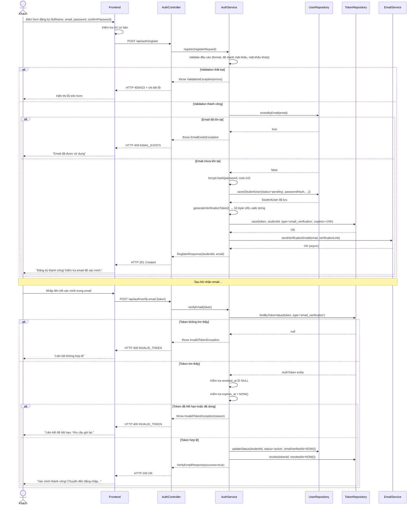

# UC-02 — Đăng Ký Tài Khoản (User Register)

> **Feature:** `feat-auth` | **Phiên bản:** 1.0 | **Trạng thái:** Draft
> **Tham chiếu FR:** FR-AUTH-10, FR-AUTH-11, FR-AUTH-12, FR-AUTH-13, FR-AUTH-14
> **Cập nhật:** 2026-05-30

---

## 1. Tổng Quan

| Thuộc tính | Nội dung |
|:---|:---|
| **Mã Use Case** | UC-02 |
| **Tên** | Đăng Ký Tài Khoản (User Register) |
| **Tác nhân chính** | Khách (Guest) — người dùng chưa có tài khoản |
| **Mô tả ngắn** | Khách tạo tài khoản mới bằng Email/Mật khẩu và xác minh qua email trước khi được phép đăng nhập |
| **Độ ưu tiên** | Rất cao (P0) — điều kiện tiên quyết để sử dụng hệ thống |

---

## 2. Tác Nhân & Điều Kiện

### 2.1 Tác Nhân

| Tác nhân | Vai trò |
|:---|:---|
| **Khách** | Người chủ động đăng ký tài khoản |
| **Hệ thống Email** | Gửi email xác minh chứa liên kết kích hoạt |

### 2.2 Điều Kiện Tiền Quyết (Preconditions)

- Khách có kết nối internet
- Email đăng ký chưa tồn tại trong `student_users`
- Hệ thống gửi email đang hoạt động bình thường

### 2.3 Hậu Điều Kiện (Postconditions)

- **Đăng ký thành công:** Bản ghi `student_users` mới với `status = 'pending'` được tạo; email xác minh được gửi
- **Xác minh email thành công:** `status` chuyển sang `'active'`; token xác minh bị vô hiệu hoá; tài khoản có thể đăng nhập
- **Thất bại:** Không tạo tài khoản; hiển thị lỗi cụ thể

---

## 3. Luồng Xử Lý

### 3.1 Luồng Chính — Đăng Ký Tài Khoản Mới

```
Bước 1 [Khách]:      Điền form đăng ký: Họ tên, Email, Mật khẩu, Xác nhận mật khẩu
Bước 2 [Frontend]:   Kiểm tra UX (không rỗng, mật khẩu khớp với xác nhận), gửi POST /api/auth/register
Bước 3 [Backend]:    Validate đầy đủ: email format, mật khẩu đủ mạnh, hai mật khẩu khớp
Bước 4 [Backend]:    Kiểm tra email chưa tồn tại trong student_users
Bước 5 [Backend]:    Hash mật khẩu bằng bcrypt (cost ≥ 10)
Bước 6 [Backend]:    Tạo bản ghi student_users mới:
                        - status = 'pending'
                        - password_hash = <bcrypt hash>
                        - email_verified_at = NULL
                        - created_at = NOW()
Bước 7 [Backend]:    Tạo token xác minh email:
                        - token_value = random URL-safe string (≥ 32 bytes)
                        - token_type = 'email_verification'
                        - expires_at = NOW() + 24 giờ
                      Lưu vào auth_tokens
Bước 8 [Backend]:    Gửi email xác minh chứa liên kết:
                        {BASE_URL}/verify-email?token={token_value}
Bước 9 [Backend]:    Trả về HTTP 201 với studentId và email
Bước 10 [Frontend]:  Hiển thị thông báo "Đăng ký thành công. Kiểm tra email để xác minh tài khoản."
```

### 3.2 Luồng Phụ A — Xác Minh Email (Kích Hoạt Tài Khoản)

```
Bước 1 [Khách]:      Mở email, nhấp vào liên kết xác minh
Bước 2 [Frontend]:   Đọc token từ query string, gửi POST /api/auth/verify-email {token}
Bước 3 [Backend]:    Tìm bản ghi trong auth_tokens theo token_value và token_type = 'email_verification'
Bước 4 [Backend]:    Kiểm tra token chưa bị thu hồi (revoked_at IS NULL)
Bước 5 [Backend]:    Kiểm tra token chưa hết hạn (expires_at > NOW())
Bước 6 [Backend]:    Cập nhật student_users:
                        - status = 'active'
                        - email_verified_at = NOW()
Bước 7 [Backend]:    Thu hồi token: revoked_at = NOW()
Bước 8 [Backend]:    Trả về HTTP 200 — thành công
Bước 9 [Frontend]:   Hiển thị "Xác minh thành công!" và chuyển hướng đến trang Đăng nhập
```

### 3.3 Luồng Phụ B — Gửi Lại Email Xác Minh

```
Bước 1 [Khách]:      Nhấn "Gửi lại email xác minh" trên trang thông báo hoặc trang đăng nhập
Bước 2 [Frontend]:   Gửi POST /api/auth/resend-verification {email}
Bước 3 [Backend]:    Kiểm tra tài khoản tồn tại và status = 'pending'
Bước 4 [Backend]:    Kiểm tra rate limit: chưa gửi quá 3 lần trong 1 giờ qua (đếm token loại 'email_verification' tạo trong 1 giờ gần nhất)
Bước 5 [Backend]:    Thu hồi tất cả token 'email_verification' cũ còn hợp lệ của user này
Bước 6 [Backend]:    Tạo token mới (như Bước 7 luồng chính), gửi email
Bước 7 [Backend]:    Trả về HTTP 200 — (luôn trả 200 dù email không tồn tại để tránh enumeration)
```

### 3.4 Luồng Lỗi — Email Đã Tồn Tại

> **Tham chiếu:** FR-AUTH-11

```
Bước 4 [Backend]:    Phát hiện email đã có trong student_users
Bước X  [Backend]:   Trả về HTTP 409 — EMAIL_EXISTS
                      "Email này đã được sử dụng. Bạn có muốn đăng nhập không?"
```

### 3.5 Luồng Lỗi — Mật Khẩu Không Đủ Mạnh

> **Tham chiếu:** FR-AUTH-12

```
Bước 3 [Backend]:    Mật khẩu không đáp ứng yêu cầu độ mạnh
Bước X  [Backend]:   Trả về HTTP 422 — WEAK_PASSWORD
                      "Mật khẩu quá yếu: cần tối thiểu 8 ký tự, ít nhất 1 chữ hoa và 1 chữ số"
```

### 3.6 Luồng Lỗi — Token Xác Minh Hết Hạn

> **Tham chiếu:** FR-AUTH-14

```
Bước 5 [Backend]:    expires_at < NOW()
Bước X  [Backend]:   Trả về HTTP 400 — INVALID_TOKEN
                      "Liên kết xác minh đã hết hạn. Vui lòng yêu cầu gửi lại email xác minh."
```

---

## 4. Quy Tắc Nghiệp Vụ

| Mã | Quy tắc | Chi tiết |
|:---|:---|:---|
| BR-02-01 | Tài khoản mới luôn được tạo với `status = 'pending'` | Bắt buộc xác minh email trước khi đăng nhập |
| BR-02-02 | Mật khẩu bcrypt với cost factor **≥ 10** | → FR-AUTH-06 |
| BR-02-03 | Token xác minh email: random URL-safe string **≥ 32 bytes**, hết hạn sau **24 giờ** | → FR-AUTH-13, NFR-AUTH-05 |
| BR-02-04 | Một token xác minh chỉ sử dụng **một lần** | Sau khi dùng phải set `revoked_at` |
| BR-02-05 | Rate limit gửi lại email xác minh: tối đa **3 lần/giờ/tài khoản** | Chống spam email |
| BR-02-06 | Liên kết xác minh email phải dùng **HTTPS** trong môi trường production | Bảo mật token trong transit |
| BR-02-07 | Tên đầy đủ (`full_name`): tối đa 150 ký tự, không chứa ký tự đặc biệt nguy hiểm | Theo schema DB |
| BR-02-08 | Gửi lại email xác minh luôn trả HTTP 200 dù tài khoản không tồn tại | Chống email enumeration |
| BR-02-09 | Khi gửi lại, thu hồi token cũ chưa hết hạn trước khi tạo token mới | Tránh nhiều token hợp lệ song song |

---

## 5. Quy Tắc Kiểm Tra Đầu Vào

### Bảng Validation — POST /api/auth/register

| Trường | Kiểm tra | Thông báo lỗi |
|:---|:---|:---|
| `fullName` | Bắt buộc, không rỗng | "Họ tên là bắt buộc" |
| `fullName` | Tối thiểu 2 ký tự | "Họ tên phải có ít nhất 2 ký tự" |
| `fullName` | Tối đa 150 ký tự | "Họ tên không được vượt quá 150 ký tự" |
| `email` | Bắt buộc, không rỗng | "Email là bắt buộc" |
| `email` | Định dạng hợp lệ (pattern cơ bản: `^[^@]+@[^@]+\.[^@]+$`) | "Email không hợp lệ" |
| `email` | Tối đa 255 ký tự | "Email quá dài (tối đa 255 ký tự)" |
| `password` | Bắt buộc, không rỗng | "Mật khẩu là bắt buộc" |
| `password` | Tối thiểu 8 ký tự | "Mật khẩu phải có ít nhất 8 ký tự" |
| `password` | Có ít nhất 1 chữ hoa (A-Z) | "Mật khẩu cần có ít nhất 1 chữ hoa" |
| `password` | Có ít nhất 1 chữ số (0-9) | "Mật khẩu cần có ít nhất 1 chữ số" |
| `confirmPassword` | Bắt buộc | "Xác nhận mật khẩu là bắt buộc" |
| `confirmPassword` | Khớp với `password` | "Mật khẩu xác nhận không khớp" |

---

## 6. Sơ Đồ Tuần Tự (Sequence Diagram)

### 6.1 Luồng Đăng Ký & Xác Minh Email



---

## 7. Tham Chiếu API

> Xem đặc tả đầy đủ tại [SPEC.md § 6 — API SPEC](./SPEC.md)

| Phương thức | Endpoint | Mô tả |
|:---|:---|:---|
| `POST` | `/api/auth/register` | Đăng ký tài khoản mới |
| `POST` | `/api/auth/verify-email` | Xác minh email bằng token |
| `POST` | `/api/auth/resend-verification` | Gửi lại email xác minh |

---

## 8. Tiêu Chí Chấp Nhận (Acceptance Criteria)

### AC-02-01 — Đăng ký thành công

> **Tham chiếu:** FR-AUTH-10

- **Cho trước:** Email `new@test.com` chưa tồn tại trong hệ thống
- **Khi:** Gửi POST `/api/auth/register` với `fullName="Nguyễn Văn A"`, `email="new@test.com"`, `password="Abcdef12"`, `confirmPassword="Abcdef12"`
- **Thì:**
  - Nhận HTTP 201
  - Bản ghi `student_users` mới với `status = 'pending'`, `email = 'new@test.com'`
  - Bản ghi `auth_tokens` với `token_type = 'email_verification'`, `expires_at = NOW() + 24h`
  - Email xác minh được gửi đến `new@test.com`
  - Response chứa `studentId` và `email`

---

### AC-02-02 — Đăng ký với email đã tồn tại

> **Tham chiếu:** FR-AUTH-11

- **Cho trước:** `existing@test.com` đã tồn tại trong `student_users`
- **Khi:** Gửi POST `/api/auth/register` với `email="existing@test.com"`
- **Thì:**
  - Nhận HTTP 409
  - `error_code = "EMAIL_EXISTS"`
  - Thông báo gợi ý đăng nhập
  - Không tạo bản ghi mới trong DB

---

### AC-02-03 — Mật khẩu không đủ mạnh

> **Tham chiếu:** FR-AUTH-12

- **Cho trước:** Dữ liệu hợp lệ ngoại trừ mật khẩu
- **Khi:** Gửi với `password = "abc"` (quá ngắn, không có hoa, không có số)
- **Thì:**
  - Nhận HTTP 422
  - `error_code = "WEAK_PASSWORD"`
  - Thông báo liệt kê các yêu cầu chưa đáp ứng

---

### AC-02-04 — Mật khẩu xác nhận không khớp

- **Cho trước:** Dữ liệu hợp lệ
- **Khi:** Gửi với `password = "Abcdef12"`, `confirmPassword = "Abcdef99"`
- **Thì:**
  - Nhận HTTP 400
  - `error_code = "PASSWORD_MISMATCH"`

---

### AC-02-05 — Xác minh email với token hợp lệ

> **Tham chiếu:** FR-AUTH-13

- **Cho trước:** Tài khoản `status = 'pending'`, token xác minh hợp lệ còn trong hạn
- **Khi:** Gửi POST `/api/auth/verify-email` với token đúng
- **Thì:**
  - Nhận HTTP 200
  - `student_users.status` chuyển thành `'active'`
  - `student_users.email_verified_at` được cập nhật
  - Token trong `auth_tokens` bị thu hồi (`revoked_at` được đặt)
  - Tài khoản có thể đăng nhập thành công

---

### AC-02-06 — Token xác minh hết hạn

> **Tham chiếu:** FR-AUTH-14

- **Cho trước:** Token xác minh được tạo hơn 24 giờ trước
- **Khi:** Gửi POST `/api/auth/verify-email` với token đã hết hạn
- **Thì:**
  - Nhận HTTP 400
  - `error_code = "INVALID_TOKEN"`
  - Thông báo hướng dẫn gửi lại email
  - `student_users.status` KHÔNG thay đổi

---

### AC-02-07 — Token xác minh đã được dùng (dùng lại)

- **Cho trước:** Token đã được dùng một lần thành công (status = 'active', revoked_at đã được đặt)
- **Khi:** Gửi lại POST `/api/auth/verify-email` với cùng token đó
- **Thì:**
  - Nhận HTTP 400
  - `error_code = "INVALID_TOKEN"`
  - `student_users.status` KHÔNG thay đổi lần thứ hai

---

### AC-02-08 — Gửi lại email bị giới hạn tần suất

- **Cho trước:** Tài khoản `status = 'pending'`, đã gửi lại 3 lần trong vòng 1 giờ
- **Khi:** Yêu cầu gửi lại lần thứ 4 trong giờ đó
- **Thì:**
  - Nhận HTTP 429
  - `error_code = "TOO_MANY_REQUESTS"`
  - Thông báo thời gian chờ

---

## 9. Ngoài Phạm Vi (Out of Scope)

- ❌ Đăng ký bằng số điện thoại/OTP — Phase 2
- ❌ Đăng ký qua OAuth (Google đăng ký) — đã xử lý trong UC-01 (auto-register khi OAuth lần đầu)
- ❌ Xác minh email qua SMS — Phase 2
- ❌ Captcha/reCAPTCHA — có thể thêm ở Phase 2
- ❌ Admin/Staff tạo tài khoản — xem `feat-system-admin`
