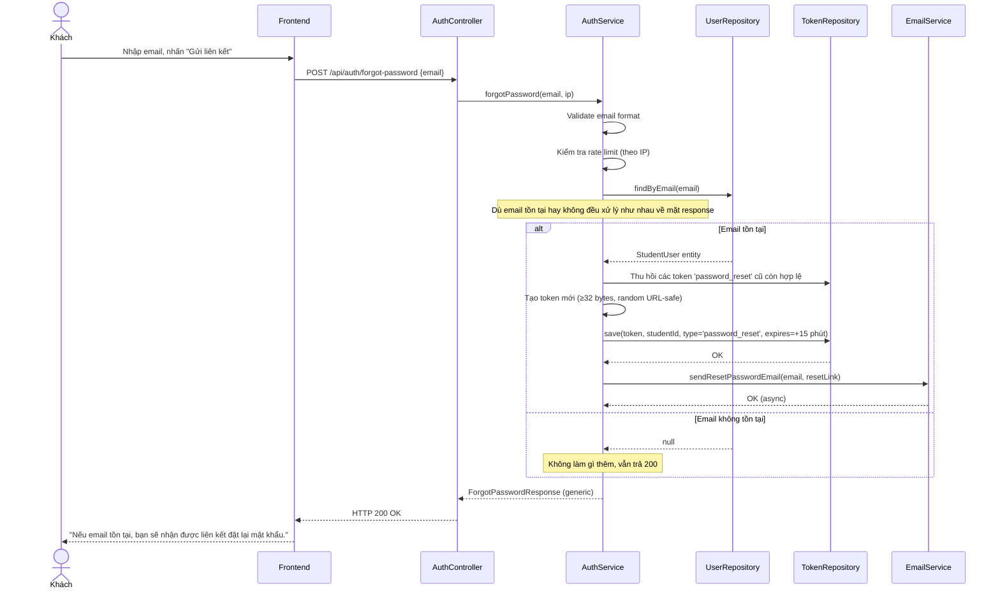
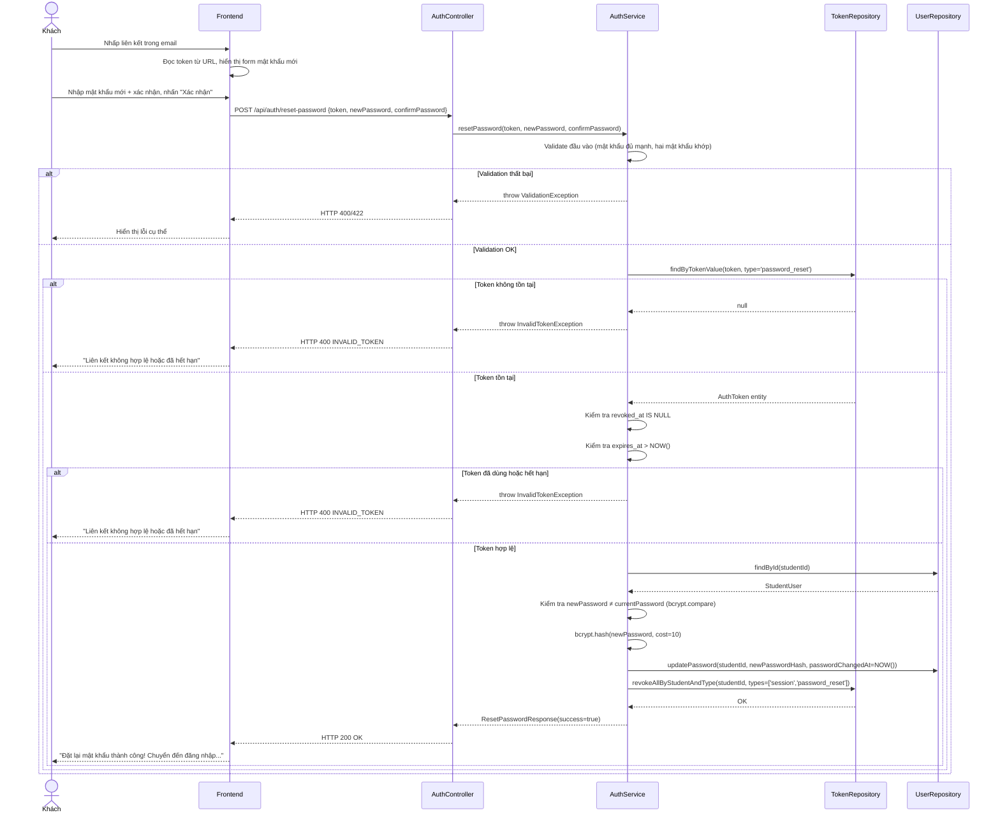

# UC-03 — Khôi Phục Mật Khẩu (Reset Password)

> **Feature:** `feat-auth` | **Phiên bản:** 1.0 | **Trạng thái:** Draft
> **Tham chiếu FR:** FR-AUTH-20, FR-AUTH-21, FR-AUTH-22, FR-AUTH-23
> **Cập nhật:** 2026-05-30

---

## 1. Tổng Quan

| Thuộc tính | Nội dung |
|:---|:---|
| **Mã Use Case** | UC-03 |
| **Tên** | Khôi Phục Mật Khẩu (Reset Password) |
| **Tác nhân chính** | Khách (Guest) hoặc Học viên (Student) đã quên mật khẩu |
| **Mô tả ngắn** | Người dùng yêu cầu đặt lại mật khẩu qua email; hệ thống gửi liên kết bảo mật có thời hạn 15 phút để người dùng cập nhật mật khẩu mới |
| **Độ ưu tiên** | Cao (P1) |

---

## 2. Tác Nhân & Điều Kiện

### 2.1 Tác Nhân

| Tác nhân | Vai trò |
|:---|:---|
| **Khách / Học viên** | Người chủ động yêu cầu khôi phục mật khẩu |
| **Hệ thống Email** | Gửi liên kết đặt lại mật khẩu |

### 2.2 Điều Kiện Tiền Quyết (Preconditions)

- Người dùng có kết nối internet
- Người dùng có quyền truy cập hộp thư email đã đăng ký

### 2.3 Hậu Điều Kiện (Postconditions)

- **Thành công:** `student_users.password_hash` được cập nhật bằng bcrypt; tất cả token loại `session` và `password_reset` của người dùng bị thu hồi
- **Thất bại:** Mật khẩu không thay đổi; token vẫn hợp lệ (nếu chưa hết hạn)

---

## 3. Luồng Xử Lý

### 3.1 Luồng Chính — Yêu Cầu Gửi Liên Kết Đặt Lại Mật Khẩu

```
Bước 1 [Khách]:      Nhấn "Quên mật khẩu?" trên trang đăng nhập
Bước 2 [Frontend]:   Hiển thị form yêu cầu nhập email
Bước 3 [Khách]:      Nhập địa chỉ email, nhấn "Gửi liên kết đặt lại mật khẩu"
Bước 4 [Frontend]:   Gửi POST /api/auth/forgot-password {email}
Bước 5 [Backend]:    Validate email (định dạng cơ bản)
Bước 6 [Backend]:    Kiểm tra rate limit: chưa vượt 3 yêu cầu/email/giờ
Bước 7 [Backend]:    Tìm tài khoản trong student_users theo email
                      → Dù tìm thấy hay không: LUÔN trả HTTP 200 (chống email enumeration)
Bước 8 [Backend]:    Nếu tìm thấy tài khoản:
                        a. Thu hồi tất cả token 'password_reset' cũ còn hợp lệ
                        b. Tạo token mới: random URL-safe string ≥ 32 bytes
                        c. Lưu vào auth_tokens: token_type='password_reset', expires_at=NOW()+15 phút
                        d. Gửi email chứa liên kết: {BASE_URL}/reset-password?token={token_value}
Bước 9 [Backend]:    Trả về HTTP 200 — thông báo chung
Bước 10 [Frontend]:  Hiển thị "Nếu email tồn tại, bạn sẽ nhận được liên kết đặt lại mật khẩu."
```

### 3.2 Luồng Phụ A — Đặt Lại Mật Khẩu Mới

```
Bước 1 [Khách]:      Mở email, nhấp vào liên kết đặt lại mật khẩu
Bước 2 [Frontend]:   Đọc token từ query string, hiển thị form nhập mật khẩu mới
Bước 3 [Khách]:      Nhập mật khẩu mới và xác nhận mật khẩu mới, nhấn "Xác nhận"
Bước 4 [Frontend]:   Gửi POST /api/auth/reset-password {token, newPassword, confirmPassword}
Bước 5 [Backend]:    Validate đầu vào (mật khẩu đủ mạnh, hai mật khẩu khớp)
Bước 6 [Backend]:    Tìm token trong auth_tokens (token_type='password_reset')
Bước 7 [Backend]:    Kiểm tra token chưa bị thu hồi (revoked_at IS NULL)
Bước 8 [Backend]:    Kiểm tra token chưa hết hạn (expires_at > NOW())
Bước 9 [Backend]:    Hash mật khẩu mới bằng bcrypt (cost ≥ 10)
Bước 10 [Backend]:   Cập nhật student_users:
                        - password_hash = <bcrypt hash mới>
                        - password_changed_at = NOW()
Bước 11 [Backend]:   Thu hồi tất cả token loại 'session' và 'password_reset' của người dùng:
                        UPDATE auth_tokens SET revoked_at = NOW()
                        WHERE student_id = ? AND token_type IN ('session', 'password_reset')
                        AND revoked_at IS NULL
Bước 12 [Backend]:   Trả về HTTP 200 — thành công
Bước 13 [Frontend]:  Hiển thị "Đặt lại mật khẩu thành công!" và chuyển hướng đến trang Đăng nhập
```

### 3.3 Luồng Lỗi — Token Hết Hạn

> **Tham chiếu:** FR-AUTH-23

```
Bước 8 [Backend]:    expires_at < NOW()
Bước X  [Backend]:   Trả về HTTP 400 — INVALID_TOKEN
                      "Liên kết đặt lại mật khẩu không hợp lệ hoặc đã hết hạn.
                       Vui lòng yêu cầu liên kết mới."
```

### 3.4 Luồng Lỗi — Token Đã Sử Dụng

> **Tham chiếu:** FR-AUTH-23

```
Bước 7 [Backend]:    revoked_at IS NOT NULL
Bước X  [Backend]:   Trả về HTTP 400 — INVALID_TOKEN
                      "Liên kết đặt lại mật khẩu không hợp lệ hoặc đã hết hạn."
```

### 3.5 Luồng Lỗi — Vượt Rate Limit

```
Bước 6 [Backend]:    Đếm bản ghi auth_tokens với student_id này, type='password_reset',
                      created_at > NOW() - 1 giờ → số lượng ≥ 3
Bước X  [Backend]:   Trả về HTTP 429 — TOO_MANY_REQUESTS
                      "Quá nhiều yêu cầu. Vui lòng thử lại sau {X} phút."
```

> **Lưu ý:** Rate limit áp dụng **chỉ khi email tồn tại** trong hệ thống. Nếu email không tồn tại, vẫn trả HTTP 200 chung chung (không tiết lộ rate limit status để tránh enumeration).

---

## 4. Quy Tắc Nghiệp Vụ

| Mã | Quy tắc | Chi tiết |
|:---|:---|:---|
| BR-03-01 | **LUÔN** trả HTTP 200 cho endpoint `forgot-password`, dù email có tồn tại hay không | → FR-AUTH-21 — Chống email enumeration |
| BR-03-02 | Token đặt lại mật khẩu hết hạn sau **15 phút** | → FR-AUTH-20 |
| BR-03-03 | Token là random URL-safe string **≥ 32 bytes** (256-bit entropy) | → NFR-AUTH-05 |
| BR-03-04 | Một token chỉ sử dụng **một lần duy nhất** | Thu hồi ngay sau khi dùng |
| BR-03-05 | Sau khi đặt lại mật khẩu thành công, thu hồi **tất cả** token `session` và `password_reset` của người dùng | → FR-AUTH-22 — Buộc đăng nhập lại trên mọi thiết bị |
| BR-03-06 | Rate limit: tối đa **3 yêu cầu/email/giờ** | Chống tấn công gửi email hàng loạt |
| BR-03-07 | Mật khẩu mới phải đáp ứng tiêu chí độ mạnh (≥ 8 ký tự, 1 hoa, 1 số) | → FR-AUTH-12 tái áp dụng |
| BR-03-08 | Mật khẩu mới **không được trùng** mật khẩu cũ | → Kiểm tra bcrypt.compare trước khi lưu |
| BR-03-09 | Thu hồi token `password_reset` cũ còn hợp lệ trước khi tạo token mới | Tránh nhiều token hợp lệ cùng lúc |
| BR-03-10 | Liên kết đặt lại mật khẩu **KHÔNG** được log (chứa sensitive token) | → NFR-AUTH-02 |

---

## 5. Quy Tắc Kiểm Tra Đầu Vào

### POST /api/auth/forgot-password

| Trường | Kiểm tra | Thông báo lỗi |
|:---|:---|:---|
| `email` | Bắt buộc, không rỗng | "Email là bắt buộc" |
| `email` | Định dạng email hợp lệ | "Email không hợp lệ" |

### POST /api/auth/reset-password

| Trường | Kiểm tra | Thông báo lỗi |
|:---|:---|:---|
| `token` | Bắt buộc, không rỗng | "Token là bắt buộc" |
| `newPassword` | Bắt buộc, không rỗng | "Mật khẩu mới là bắt buộc" |
| `newPassword` | Tối thiểu 8 ký tự | "Mật khẩu phải có ít nhất 8 ký tự" |
| `newPassword` | Có ít nhất 1 chữ hoa | "Mật khẩu cần có ít nhất 1 chữ hoa" |
| `newPassword` | Có ít nhất 1 chữ số | "Mật khẩu cần có ít nhất 1 chữ số" |
| `confirmPassword` | Bắt buộc | "Xác nhận mật khẩu là bắt buộc" |
| `confirmPassword` | Khớp với `newPassword` | "Mật khẩu xác nhận không khớp" |

---

## 6. Sơ Đồ Tuần Tự (Sequence Diagram)

### 6.1 Yêu Cầu Đặt Lại Mật Khẩu



### 6.2 Đặt Lại Mật Khẩu Mới



---

## 7. Tham Chiếu API

> Xem đặc tả đầy đủ tại [SPEC.md § 6 — API SPEC](./SPEC.md)

| Phương thức | Endpoint | Mô tả |
|:---|:---|:---|
| `POST` | `/api/auth/forgot-password` | Gửi yêu cầu đặt lại mật khẩu |
| `POST` | `/api/auth/reset-password` | Xác nhận token và đặt mật khẩu mới |

---

## 8. Tiêu Chí Chấp Nhận (Acceptance Criteria)

### AC-03-01 — Yêu cầu đặt lại với email hợp lệ (có trong hệ thống)

> **Tham chiếu:** FR-AUTH-20

- **Cho trước:** `active@test.com` tồn tại, `status = 'active'`
- **Khi:** POST `/api/auth/forgot-password` với `email = "active@test.com"`
- **Thì:**
  - Nhận HTTP 200
  - Thông báo chung (không xác nhận email tồn tại)
  - Bản ghi `auth_tokens` mới với `token_type = 'password_reset'`, `expires_at = NOW() + 15 phút`
  - Email được gửi đến `active@test.com`

---

### AC-03-02 — Yêu cầu đặt lại với email không tồn tại

> **Tham chiếu:** FR-AUTH-21

- **Cho trước:** `ghost@test.com` KHÔNG tồn tại trong hệ thống
- **Khi:** POST `/api/auth/forgot-password` với `email = "ghost@test.com"`
- **Thì:**
  - Nhận HTTP 200
  - Thông báo **giống hệt** AC-03-01 (không tiết lộ sự khác biệt)
  - Không tạo bản ghi `auth_tokens` nào
  - Không gửi email

---

### AC-03-03 — Đặt lại mật khẩu thành công với token hợp lệ

> **Tham chiếu:** FR-AUTH-22

- **Cho trước:** Token `password_reset` hợp lệ, còn trong hạn 15 phút
- **Khi:** POST `/api/auth/reset-password` với token đúng, `newPassword = "NewPass12"`, `confirmPassword = "NewPass12"`
- **Thì:**
  - Nhận HTTP 200
  - `student_users.password_hash` được cập nhật (bcrypt hash mới)
  - `student_users.password_changed_at` được đặt = NOW()
  - Token `password_reset` bị thu hồi (`revoked_at` được đặt)
  - Tất cả token `session` của user bị thu hồi
  - Có thể đăng nhập với mật khẩu mới; KHÔNG thể đăng nhập với mật khẩu cũ

---

### AC-03-04 — Token đặt lại hết hạn (sau 15 phút)

> **Tham chiếu:** FR-AUTH-23

- **Cho trước:** Token được tạo hơn 15 phút trước (`expires_at < NOW()`)
- **Khi:** POST `/api/auth/reset-password` với token này
- **Thì:**
  - Nhận HTTP 400
  - `error_code = "INVALID_TOKEN"`
  - Mật khẩu KHÔNG thay đổi

---

### AC-03-05 — Token đặt lại đã sử dụng

> **Tham chiếu:** FR-AUTH-23

- **Cho trước:** Token đã được dùng thành công một lần (revoked_at đã đặt)
- **Khi:** Dùng lại token đó để POST `/api/auth/reset-password`
- **Thì:**
  - Nhận HTTP 400
  - `error_code = "INVALID_TOKEN"`
  - Mật khẩu KHÔNG thay đổi

---

### AC-03-06 — Mật khẩu mới quá yếu

- **Cho trước:** Token hợp lệ
- **Khi:** POST `/api/auth/reset-password` với `newPassword = "abc"`
- **Thì:**
  - Nhận HTTP 422
  - `error_code = "WEAK_PASSWORD"`
  - Mật khẩu KHÔNG thay đổi; Token vẫn còn hợp lệ (chưa bị thu hồi)

---

### AC-03-07 — Mật khẩu mới trùng với mật khẩu cũ

- **Cho trước:** Token hợp lệ, user có mật khẩu cũ là `OldPass12`
- **Khi:** POST `/api/auth/reset-password` với `newPassword = "OldPass12"`
- **Thì:**
  - Nhận HTTP 422
  - `error_code = "SAME_PASSWORD"`
  - Thông báo: "Mật khẩu mới không được giống mật khẩu cũ"

---

## 9. Ngoài Phạm Vi (Out of Scope)

- ❌ Đặt lại mật khẩu qua OTP SMS — Phase 2
- ❌ Đặt lại mật khẩu cho tài khoản OAuth (password_hash = NULL) — không áp dụng; tài khoản OAuth không có mật khẩu
- ❌ Admin đặt lại mật khẩu thay học viên — xem `feat-system-admin`
- ❌ Chính sách lịch sử mật khẩu (không dùng lại N mật khẩu cũ) — Phase 2
