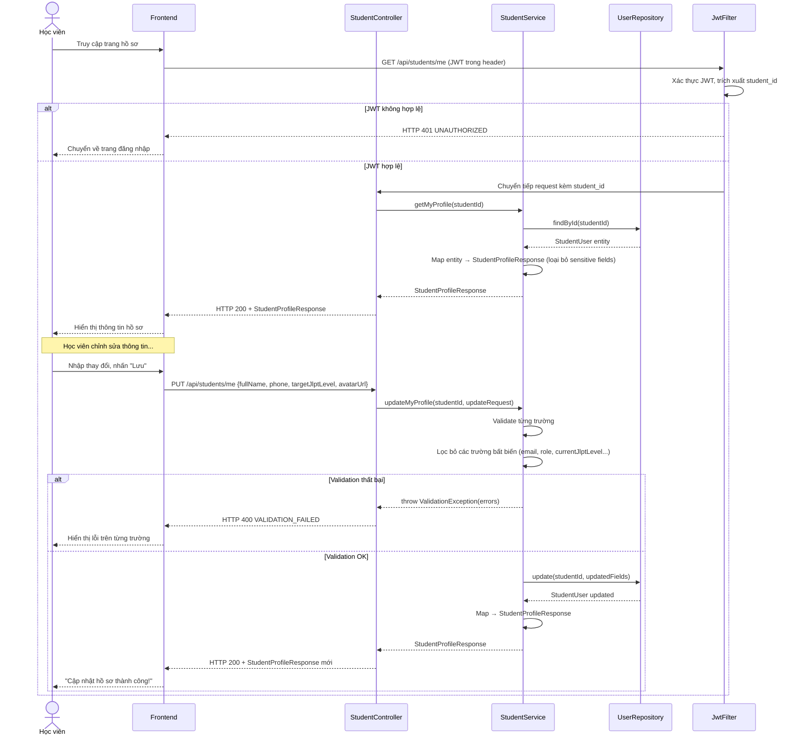
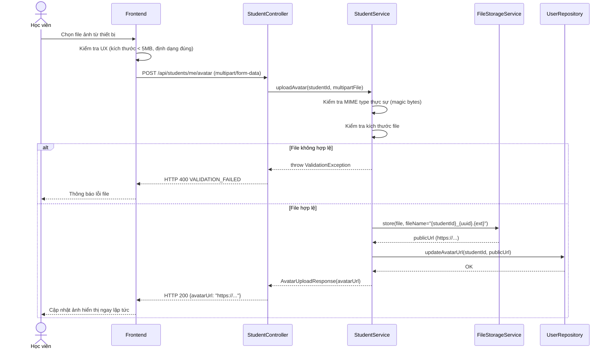

# UC-04 — Hồ Sơ Cá Nhân (User Profile)

> **Feature:** `feat-auth` | **Phiên bản:** 1.0 | **Trạng thái:** Draft
> **Tham chiếu FR:** FR-AUTH-30, FR-AUTH-31, FR-AUTH-32, FR-AUTH-33
> **Cập nhật:** 2026-05-30

---

## 1. Tổng Quan

| Thuộc tính | Nội dung |
|:---|:---|
| **Mã Use Case** | UC-04 |
| **Tên** | Hồ Sơ Cá Nhân (User Profile) |
| **Tác nhân chính** | Học viên đã đăng nhập (Student) |
| **Mô tả ngắn** | Học viên xem thông tin cá nhân, cập nhật hồ sơ (họ tên, ảnh đại diện, số điện thoại, sinh nhật, tiểu sử, cấp độ JLPT mục tiêu) và tải lên ảnh đại diện mới |
| **Độ ưu tiên** | Cao (P1) |

---

## 2. Tác Nhân & Điều Kiện

### 2.1 Tác Nhân

| Tác nhân | Vai trò |
|:---|:---|
| **Học viên (Student)** | Người xem và cập nhật hồ sơ cá nhân của mình |
| **Dịch vụ Lưu trữ File** | Nhận file ảnh và trả về URL công khai (S3 hoặc `/uploads`) |

### 2.2 Điều Kiện Tiền Quyết (Preconditions)

- Học viên đã đăng nhập (có JWT access token hợp lệ)
- JWT chứa `student_id` hợp lệ

### 2.3 Hậu Điều Kiện (Postconditions)

- **Xem hồ sơ:** Không thay đổi dữ liệu; trả về snapshot hiện tại
- **Cập nhật thành công:** `student_users` được cập nhật các trường được phép; trả về dữ liệu mới nhất
- **Upload ảnh thành công:** File được lưu trên storage; `avatar_url` trong DB được cập nhật

---

## 3. Luồng Xử Lý

### 3.1 Luồng Chính A — Xem Hồ Sơ Cá Nhân

```
Bước 1 [Học viên]:   Truy cập trang hồ sơ cá nhân
Bước 2 [Frontend]:   Gửi GET /api/students/me (kèm Authorization: Bearer <JWT>)
Bước 3 [Backend]:    Xác thực JWT, trích xuất student_id
Bước 4 [Backend]:    Tìm tài khoản trong student_users theo student_id
Bước 5 [Backend]:    Map entity → StudentProfileResponse (loại bỏ password_hash, sensitive fields)
Bước 6 [Backend]:    Trả về HTTP 200 với thông tin đầy đủ
Bước 7 [Frontend]:   Hiển thị thông tin: ảnh đại diện, họ tên, email, số điện thoại,
                      cấp độ JLPT hiện tại, cấp độ mục tiêu, ngày tham gia
```

### 3.2 Luồng Chính B — Cập Nhật Hồ Sơ

```
Bước 1 [Học viên]:   Chỉnh sửa các trường được phép trên trang hồ sơ, nhấn "Lưu thay đổi"
Bước 2 [Frontend]:   Gửi PUT /api/students/me với các trường muốn cập nhật
Bước 3 [Backend]:    Xác thực JWT, trích xuất student_id
Bước 4 [Backend]:    Validate đầu vào (từng trường theo quy tắc riêng)
Bước 5 [Backend]:    Đảm bảo request KHÔNG chứa các trường bất biến (email, role, student_id)
                      → Nếu có: bỏ qua hoàn toàn (hoặc trả lỗi tùy cấu hình)
Bước 6 [Backend]:    Cập nhật student_users với các trường được cung cấp:
                        - Chỉ cập nhật trường có giá trị trong request (partial update)
                        - Đặt updated_at = NOW()
Bước 7 [Backend]:    Trả về HTTP 200 với StudentProfileResponse cập nhật
Bước 8 [Frontend]:   Hiển thị thông báo "Cập nhật hồ sơ thành công" và làm mới dữ liệu
```

### 3.3 Luồng Phụ A — Upload Ảnh Đại Diện

```
Bước 1 [Học viên]:   Nhấp vào vùng ảnh đại diện, chọn file ảnh từ thiết bị
Bước 2 [Frontend]:   Kiểm tra kích thước và định dạng file (UX cơ bản)
Bước 3 [Frontend]:   Gửi POST /api/students/me/avatar với multipart/form-data {file: <image>}
Bước 4 [Backend]:    Xác thực JWT
Bước 5 [Backend]:    Validate file:
                        - Định dạng: JPG, PNG, WebP, GIF
                        - Kích thước tối đa: 5 MB
                        - MIME type thực sự (kiểm tra magic bytes, không tin vào extension)
Bước 6 [Backend]:    Tạo tên file duy nhất: {student_id}_{uuid}.{ext}
Bước 7 [Backend]:    Lưu file vào /uploads hoặc S3 — KHÔNG lưu BLOB vào DB
Bước 8 [Backend]:    Cập nhật student_users.avatar_url = <URL công khai>
Bước 9 [Backend]:    Trả về HTTP 200 với avatarUrl mới
Bước 10 [Frontend]:  Cập nhật ảnh đại diện hiển thị trên giao diện
```

### 3.4 Luồng Lỗi — Token JWT Hết Hạn / Thiếu

```
Bước 3 [Backend]:    JWT thiếu hoặc hết hạn
Bước X  [Backend]:   Trả về HTTP 401 — UNAUTHORIZED
                      "Yêu cầu đăng nhập để thực hiện thao tác này"
```

### 3.5 Luồng Lỗi — Validation Đầu Vào Thất Bại

```
Bước 4 [Backend]:    Một hoặc nhiều trường không hợp lệ
Bước X  [Backend]:   Trả về HTTP 400 — VALIDATION_FAILED
                      Danh sách lỗi theo từng trường
```

### 3.6 Luồng Lỗi — File Ảnh Không Hợp Lệ

```
Bước 5 [Backend]:    File không đúng định dạng hoặc vượt kích thước
Bước X  [Backend]:   Trả về HTTP 400 — VALIDATION_FAILED
                      "File không hợp lệ: {lý do cụ thể}"
```

---

## 4. Quy Tắc Nghiệp Vụ

| Mã | Quy tắc | Chi tiết |
|:---|:---|:---|
| BR-04-01 | Học viên chỉ được xem và sửa **hồ sơ của chính mình** | Xác định bằng `student_id` từ JWT — không nhận `id` từ client |
| BR-04-02 | Các trường **bất biến** qua endpoint này: `email`, `role`, `student_id`, `status`, `current_jlpt_level` | → FR-AUTH-32 |
| BR-04-03 | `current_jlpt_level` chỉ được hệ thống cập nhật theo kết quả thi — không tự sửa được | Học viên chỉ sửa `target_jlpt_level` |
| BR-04-04 | Avatar **KHÔNG** được lưu dưới dạng BLOB trong DB | Chỉ lưu URL → FR-AUTH-33 |
| BR-04-05 | File avatar cũ **có thể** xóa sau khi upload thành công (để tiết kiệm storage) | Tùy chính sách storage |
| BR-04-06 | Partial update: chỉ cập nhật các trường được gửi trong request body | Nếu trường không có trong body → giữ nguyên giá trị cũ |
| BR-04-07 | `phone` phải theo định dạng số điện thoại hợp lệ (nếu có giá trị) | 10-15 ký tự, chỉ chứa chữ số, +, -, dấu cách |
| BR-04-08 | Không trả `password_hash`, `oauth_provider_id`, `login_attempts`, `locked_until` trong response | Chỉ trả dữ liệu cần thiết |

---

## 5. Quy Tắc Kiểm Tra Đầu Vào

### PUT /api/students/me

| Trường | Kiểm tra | Thông báo lỗi |
|:---|:---|:---|
| `fullName` | Nếu có: tối thiểu 2 ký tự | "Họ tên phải có ít nhất 2 ký tự" |
| `fullName` | Nếu có: tối đa 150 ký tự | "Họ tên không được vượt quá 150 ký tự" |
| `phone` | Nếu có: chỉ chứa chữ số, +, -, dấu cách | "Số điện thoại không hợp lệ" |
| `phone` | Nếu có: 10-15 ký tự | "Số điện thoại phải từ 10-15 ký tự" |
| `targetJlptLevel` | Nếu có: một trong các giá trị N5, N4, N3, N2, N1 | "Cấp độ JLPT không hợp lệ. Chỉ chấp nhận: N5, N4, N3, N2, N1" |
| `avatarUrl` | Nếu có: phải là URL hợp lệ bắt đầu bằng https:// | "URL ảnh đại diện không hợp lệ" |

### POST /api/students/me/avatar

| Kiểm tra | Thông báo lỗi |
|:---|:---|
| File bắt buộc | "Vui lòng chọn file ảnh" |
| Định dạng: JPG, JPEG, PNG, WebP, GIF | "Định dạng ảnh không được hỗ trợ. Chỉ chấp nhận: JPG, PNG, WebP, GIF" |
| Kích thước tối đa: 5 MB | "File quá lớn. Kích thước tối đa là 5 MB" |
| MIME type thực sự hợp lệ (kiểm tra magic bytes) | "File không phải là ảnh hợp lệ" |

---

## 6. Sơ Đồ Tuần Tự (Sequence Diagram)

### 6.1 Xem & Cập Nhật Hồ Sơ



### 6.2 Upload Ảnh Đại Diện



---

## 7. Tham Chiếu API

> Xem đặc tả đầy đủ tại [SPEC.md § 6 — API SPEC](./SPEC.md)

| Phương thức | Endpoint | Mô tả |
|:---|:---|:---|
| `GET` | `/api/students/me` | Lấy thông tin hồ sơ cá nhân |
| `PUT` | `/api/students/me` | Cập nhật thông tin hồ sơ |
| `POST` | `/api/students/me/avatar` | Upload ảnh đại diện mới |

---

## 8. Tiêu Chí Chấp Nhận (Acceptance Criteria)

### AC-04-01 — Xem hồ sơ cá nhân thành công

> **Tham chiếu:** FR-AUTH-30

- **Cho trước:** Học viên đã đăng nhập, JWT hợp lệ
- **Khi:** GET `/api/students/me`
- **Thì:**
  - Nhận HTTP 200
  - Response chứa: `studentId`, `fullName`, `email`, `phone`, `avatarUrl`, `currentJlptLevel`, `targetJlptLevel`, `createdAt`
  - Response KHÔNG chứa: `passwordHash`, `loginAttempts`, `lockedUntil`, `oauthProviderId`

---

### AC-04-02 — Cập nhật hồ sơ thành công

> **Tham chiếu:** FR-AUTH-31

- **Cho trước:** Học viên đã đăng nhập
- **Khi:** PUT `/api/students/me` với `{"fullName": "Trần Thị B", "targetJlptLevel": "N3"}`
- **Thì:**
  - Nhận HTTP 200
  - `student_users.full_name = "Trần Thị B"`
  - `student_users.target_jlpt_level = "N3"`
  - `student_users.updated_at` được cập nhật
  - Response chứa dữ liệu mới nhất

---

### AC-04-03 — Cập nhật trường bất biến bị từ chối

> **Tham chiếu:** FR-AUTH-32

- **Cho trước:** Học viên đã đăng nhập, email hiện tại là `student@test.com`
- **Khi:** PUT `/api/students/me` với `{"email": "hacked@evil.com"}`
- **Thì:**
  - Nhận HTTP 200 (request thành công) HOẶC HTTP 400 (tùy chính sách)
  - `student_users.email` KHÔNG thay đổi — vẫn là `student@test.com`

> **Ghi chú thiết kế:** Khuyến nghị bỏ qua trường bất biến thay vì trả lỗi, để tránh tiết lộ cấu trúc hệ thống.

---

### AC-04-04 — Upload ảnh đại diện thành công

> **Tham chiếu:** FR-AUTH-33

- **Cho trước:** Học viên đã đăng nhập, file ảnh JPG hợp lệ, kích thước < 5 MB
- **Khi:** POST `/api/students/me/avatar` với multipart file
- **Thì:**
  - Nhận HTTP 200
  - Response chứa `avatarUrl` là URL công khai (bắt đầu bằng `https://`)
  - `student_users.avatar_url` trong DB được cập nhật
  - File ảnh KHÔNG được lưu dưới dạng BLOB trong DB

---

### AC-04-05 — Upload ảnh đại diện với file quá lớn

- **Cho trước:** File ảnh hợp lệ nhưng kích thước 6 MB (> 5 MB)
- **Khi:** POST `/api/students/me/avatar`
- **Thì:**
  - Nhận HTTP 400
  - `error_code = "VALIDATION_FAILED"`
  - Thông báo: "File quá lớn. Kích thước tối đa là 5 MB"
  - `avatar_url` KHÔNG thay đổi

---

### AC-04-06 — Truy cập hồ sơ không có JWT

- **Cho trước:** Không có hoặc JWT hết hạn
- **Khi:** GET `/api/students/me` không có header Authorization
- **Thì:**
  - Nhận HTTP 401
  - `error_code = "UNAUTHORIZED"`

---

## 9. Ngoài Phạm Vi (Out of Scope)

- ❌ Staff/Admin xem hồ sơ học viên qua endpoint này — xem `feat-student-management`
- ❌ Thay đổi email — cần luồng xác minh email mới, Phase 2
- ❌ Xóa tài khoản — Soft delete, xem `feat-system-admin`
- ❌ Huy hiệu/thành tích — xem `feat-learning-analytics`
- ❌ Kết nối/ngắt kết nối OAuth — Phase 2
