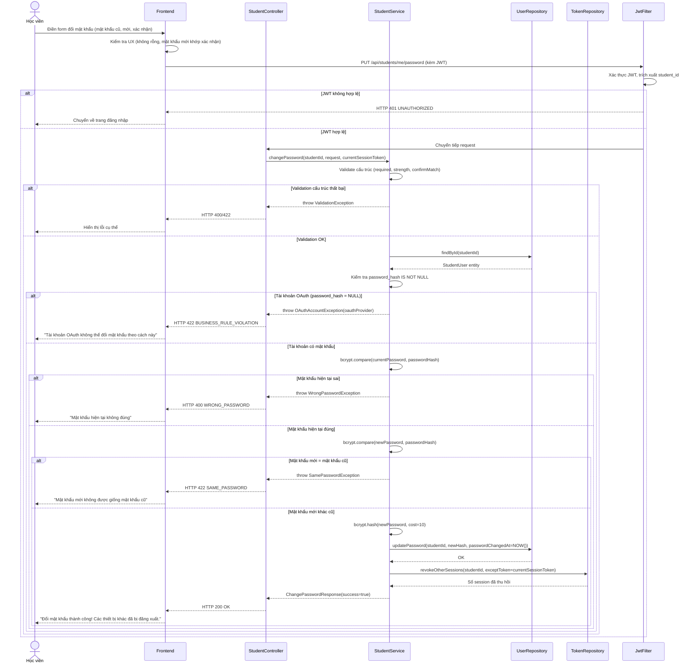

# UC-05 — Đổi Mật Khẩu (Change Password)

> **Feature:** `feat-auth` | **Phiên bản:** 1.0 | **Trạng thái:** Draft
> **Tham chiếu FR:** FR-AUTH-40, FR-AUTH-41, FR-AUTH-42, FR-AUTH-43
> **Cập nhật:** 2026-05-30

---

## 1. Tổng Quan

| Thuộc tính | Nội dung |
|:---|:---|
| **Mã Use Case** | UC-05 |
| **Tên** | Đổi Mật Khẩu (Change Password) |
| **Tác nhân chính** | Học viên đã đăng nhập (Student) |
| **Mô tả ngắn** | Học viên đang đăng nhập chủ động thay đổi mật khẩu của mình bằng cách cung cấp mật khẩu hiện tại để xác minh và nhập mật khẩu mới |
| **Độ ưu tiên** | Trung bình (P2) |

> **Phân biệt với UC-03:** UC-03 dành cho người dùng đã **quên** mật khẩu (không cần đăng nhập). UC-05 dành cho người dùng **đang đăng nhập** và chủ động muốn thay đổi.

---

## 2. Tác Nhân & Điều Kiện

### 2.1 Tác Nhân

| Tác nhân | Vai trò |
|:---|:---|
| **Học viên (Student)** | Người chủ động đổi mật khẩu của mình |

### 2.2 Điều Kiện Tiền Quyết (Preconditions)

- Học viên đã đăng nhập (JWT hợp lệ)
- Học viên đã đăng ký bằng Email/Mật khẩu (có `password_hash` — không áp dụng cho tài khoản OAuth thuần)

### 2.3 Hậu Điều Kiện (Postconditions)

- **Thành công:** `student_users.password_hash` được cập nhật bằng bcrypt; `password_changed_at = NOW()`; tất cả token `session` **khác** (không phải session hiện tại) bị thu hồi
- **Thất bại:** Mật khẩu không thay đổi; session hiện tại vẫn hợp lệ

---

## 3. Luồng Xử Lý

### 3.1 Luồng Chính — Đổi Mật Khẩu Thành Công

```
Bước 1 [Học viên]:   Truy cập mục "Đổi mật khẩu" trong cài đặt tài khoản
Bước 2 [Frontend]:   Hiển thị form: Mật khẩu hiện tại | Mật khẩu mới | Xác nhận mật khẩu mới
Bước 3 [Học viên]:   Điền đầy đủ 3 trường, nhấn "Xác nhận đổi mật khẩu"
Bước 4 [Frontend]:   Kiểm tra UX cơ bản (không rỗng, mật khẩu mới khớp xác nhận)
                      Gửi PUT /api/students/me/password {currentPassword, newPassword, confirmPassword}
Bước 5 [Backend]:    Xác thực JWT, trích xuất student_id
Bước 6 [Backend]:    Validate đầu vào (cấu trúc và độ mạnh mật khẩu mới)
Bước 7 [Backend]:    Tải thông tin học viên từ DB, kiểm tra có password_hash không
Bước 8 [Backend]:    Kiểm tra tài khoản là loại Email/Mật khẩu (password_hash IS NOT NULL)
Bước 9 [Backend]:    Xác minh mật khẩu hiện tại: bcrypt.compare(currentPassword, password_hash)
Bước 10 [Backend]:   Kiểm tra mật khẩu mới KHÁC mật khẩu cũ: bcrypt.compare(newPassword, password_hash) = false
Bước 11 [Backend]:   Hash mật khẩu mới: bcrypt.hash(newPassword, cost=10)
Bước 12 [Backend]:   Cập nhật DB:
                        - student_users.password_hash = <hash mới>
                        - student_users.password_changed_at = NOW()
Bước 13 [Backend]:   Thu hồi tất cả token 'session' của user này NGOẠI TRỪ session hiện tại:
                        UPDATE auth_tokens
                        SET revoked_at = NOW()
                        WHERE student_id = ?
                          AND token_type = 'session'
                          AND revoked_at IS NULL
                          AND token_value != <current_session_token>
Bước 14 [Backend]:   Trả về HTTP 200 — thành công
Bước 15 [Frontend]:  Hiển thị "Đổi mật khẩu thành công! Các thiết bị khác đã bị đăng xuất."
```

### 3.2 Luồng Lỗi — Mật Khẩu Hiện Tại Sai

> **Tham chiếu:** FR-AUTH-41

```
Bước 9 [Backend]:    bcrypt.compare(currentPassword, password_hash) = false
Bước X  [Backend]:   Trả về HTTP 400 — WRONG_PASSWORD
                      "Mật khẩu hiện tại không đúng"
Bước X  [Backend]:   KHÔNG cập nhật gì; KHÔNG tăng login_attempts (đã đăng nhập rồi)
```

### 3.3 Luồng Lỗi — Mật Khẩu Mới Giống Mật Khẩu Cũ

> **Tham chiếu:** FR-AUTH-43

```
Bước 10 [Backend]:   bcrypt.compare(newPassword, password_hash) = true (mật khẩu mới = cũ)
Bước X  [Backend]:   Trả về HTTP 422 — SAME_PASSWORD
                      "Mật khẩu mới không được giống mật khẩu cũ"
```

### 3.4 Luồng Lỗi — Tài Khoản OAuth (Không Có Mật Khẩu)

```
Bước 8 [Backend]:    password_hash IS NULL (tài khoản đăng nhập thuần OAuth)
Bước X  [Backend]:   Trả về HTTP 422 — BUSINESS_RULE_VIOLATION
                      "Tài khoản của bạn đăng nhập qua {oauth_provider}.
                       Không thể đổi mật khẩu theo cách này."
```

### 3.5 Luồng Lỗi — Mật Khẩu Mới Không Đủ Mạnh

```
Bước 6 [Backend]:    newPassword không đáp ứng yêu cầu độ mạnh
Bước X  [Backend]:   Trả về HTTP 422 — WEAK_PASSWORD
                      "Mật khẩu quá yếu: cần tối thiểu 8 ký tự, ít nhất 1 chữ hoa và 1 chữ số"
```

---

## 4. Quy Tắc Nghiệp Vụ

| Mã | Quy tắc | Chi tiết |
|:---|:---|:---|
| BR-05-01 | Phải xác minh **mật khẩu hiện tại** trước khi cho phép đổi | → FR-AUTH-40 — Tránh kẻ tấn công chiếm session tạm thời |
| BR-05-02 | Mật khẩu mới **không được trùng** mật khẩu cũ | → FR-AUTH-43 |
| BR-05-03 | Sau khi đổi, thu hồi tất cả session **khác** — giữ session hiện tại | → FR-AUTH-42 — Học viên không bị đăng xuất khỏi thiết bị đang dùng |
| BR-05-04 | Tài khoản OAuth thuần (password_hash = NULL) **không thể** dùng tính năng này | Phải thông báo rõ ràng |
| BR-05-05 | **Không tăng** `login_attempts` khi sai mật khẩu hiện tại trong UC-05 | Học viên đã xác thực qua JWT |
| BR-05-06 | Mật khẩu mới phải đáp ứng tiêu chí độ mạnh: **≥ 8 ký tự, 1 hoa, 1 số** | → FR-AUTH-12 tái áp dụng |
| BR-05-07 | Mật khẩu **KHÔNG BAO GIỜ** được log | Kể cả trong error logs |
| BR-05-08 | Cập nhật `password_changed_at` sau khi đổi thành công | Phục vụ audit trail |

---

## 5. Quy Tắc Kiểm Tra Đầu Vào

### PUT /api/students/me/password

| Trường | Kiểm tra | Thông báo lỗi |
|:---|:---|:---|
| `currentPassword` | Bắt buộc, không rỗng | "Mật khẩu hiện tại là bắt buộc" |
| `newPassword` | Bắt buộc, không rỗng | "Mật khẩu mới là bắt buộc" |
| `newPassword` | Tối thiểu 8 ký tự | "Mật khẩu phải có ít nhất 8 ký tự" |
| `newPassword` | Có ít nhất 1 chữ hoa (A-Z) | "Mật khẩu cần có ít nhất 1 chữ hoa" |
| `newPassword` | Có ít nhất 1 chữ số (0-9) | "Mật khẩu cần có ít nhất 1 chữ số" |
| `confirmPassword` | Bắt buộc | "Xác nhận mật khẩu là bắt buộc" |
| `confirmPassword` | Khớp với `newPassword` | "Mật khẩu xác nhận không khớp" |

> **Thứ tự kiểm tra được khuyến nghị:**
> 1. Validate cấu trúc (required, format, strength)
> 2. Verify mật khẩu hiện tại (DB check)
> 3. Kiểm tra mật khẩu mới ≠ cũ (DB check)

---

## 6. Sơ Đồ Tuần Tự (Sequence Diagram)



---

## 7. Tham Chiếu API

> Xem đặc tả đầy đủ tại [SPEC.md § 6 — API SPEC](./SPEC.md)

| Phương thức | Endpoint | Mô tả |
|:---|:---|:---|
| `PUT` | `/api/students/me/password` | Đổi mật khẩu (yêu cầu xác minh mật khẩu hiện tại) |

---

## 8. Tiêu Chí Chấp Nhận (Acceptance Criteria)

### AC-05-01 — Đổi mật khẩu thành công

> **Tham chiếu:** FR-AUTH-40, FR-AUTH-42

- **Cho trước:** Học viên đã đăng nhập trên thiết bị A và B (2 session token), tài khoản Email/Mật khẩu
- **Khi:** PUT `/api/students/me/password` từ thiết bị A với `currentPassword` đúng, `newPassword="NewPass12"`, `confirmPassword="NewPass12"`
- **Thì:**
  - Nhận HTTP 200
  - `student_users.password_hash` được cập nhật (bcrypt hash mới)
  - `student_users.password_changed_at` = NOW()
  - Session token của thiết bị B bị thu hồi (`revoked_at` được đặt)
  - Session token của thiết bị A (session hiện tại) **KHÔNG** bị thu hồi
  - Có thể đăng nhập bằng `newPassword`; KHÔNG thể đăng nhập bằng mật khẩu cũ

---

### AC-05-02 — Mật khẩu hiện tại sai

> **Tham chiếu:** FR-AUTH-41

- **Cho trước:** Học viên đã đăng nhập
- **Khi:** PUT `/api/students/me/password` với `currentPassword` sai
- **Thì:**
  - Nhận HTTP 400
  - `error_code = "WRONG_PASSWORD"`
  - Thông báo: "Mật khẩu hiện tại không đúng"
  - Mật khẩu KHÔNG thay đổi
  - Session KHÔNG bị thu hồi
  - `login_attempts` KHÔNG tăng

---

### AC-05-03 — Mật khẩu mới giống mật khẩu cũ

> **Tham chiếu:** FR-AUTH-43

- **Cho trước:** Học viên đã đăng nhập, mật khẩu hiện tại là `OldPass12`
- **Khi:** PUT `/api/students/me/password` với `currentPassword="OldPass12"`, `newPassword="OldPass12"`, `confirmPassword="OldPass12"`
- **Thì:**
  - Nhận HTTP 422
  - `error_code = "SAME_PASSWORD"`
  - Thông báo: "Mật khẩu mới không được giống mật khẩu cũ"
  - Mật khẩu KHÔNG thay đổi

---

### AC-05-04 — Mật khẩu mới không đủ mạnh

- **Cho trước:** Học viên đã đăng nhập
- **Khi:** PUT `/api/students/me/password` với `currentPassword` đúng, `newPassword = "abc"`
- **Thì:**
  - Nhận HTTP 422
  - `error_code = "WEAK_PASSWORD"`
  - Thông báo: "Mật khẩu quá yếu..."
  - Mật khẩu KHÔNG thay đổi

---

### AC-05-05 — Xác nhận mật khẩu không khớp

- **Cho trước:** Học viên đã đăng nhập
- **Khi:** PUT `/api/students/me/password` với `newPassword="NewPass12"`, `confirmPassword="DiffPass12"`
- **Thì:**
  - Nhận HTTP 400
  - `error_code = "PASSWORD_MISMATCH"`
  - Mật khẩu KHÔNG thay đổi

---

### AC-05-06 — Tài khoản OAuth không thể đổi mật khẩu

- **Cho trước:** Học viên đăng nhập qua Google OAuth, `password_hash IS NULL`
- **Khi:** PUT `/api/students/me/password` với bất kỳ dữ liệu nào
- **Thì:**
  - Nhận HTTP 422
  - `error_code = "BUSINESS_RULE_VIOLATION"`
  - Thông báo giải thích tài khoản là OAuth, hướng dẫn cách xử lý

---

## 9. Ngoài Phạm Vi (Out of Scope)

- ❌ Admin/Staff đổi mật khẩu thay học viên — xem `feat-system-admin`
- ❌ Đăng xuất tất cả thiết bị (logout all) kèm đổi mật khẩu — Phase 2 (hiện tại đã thu hồi các session khác)
- ❌ Lịch sử mật khẩu (không dùng lại mật khẩu cũ) — Phase 2
- ❌ Thiết lập mật khẩu lần đầu cho tài khoản OAuth — Phase 2
