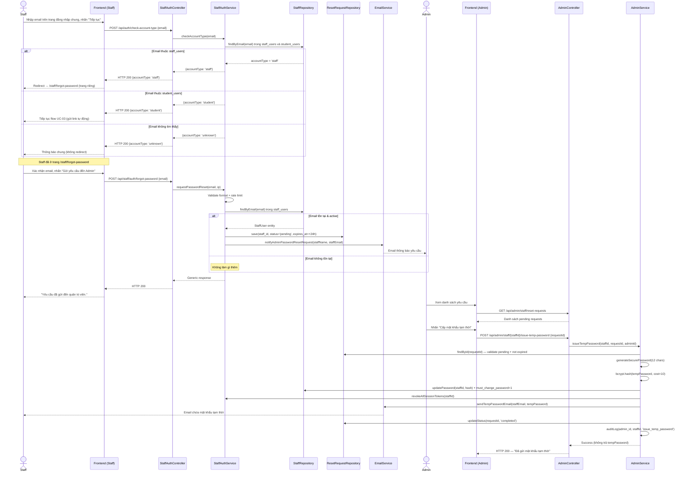
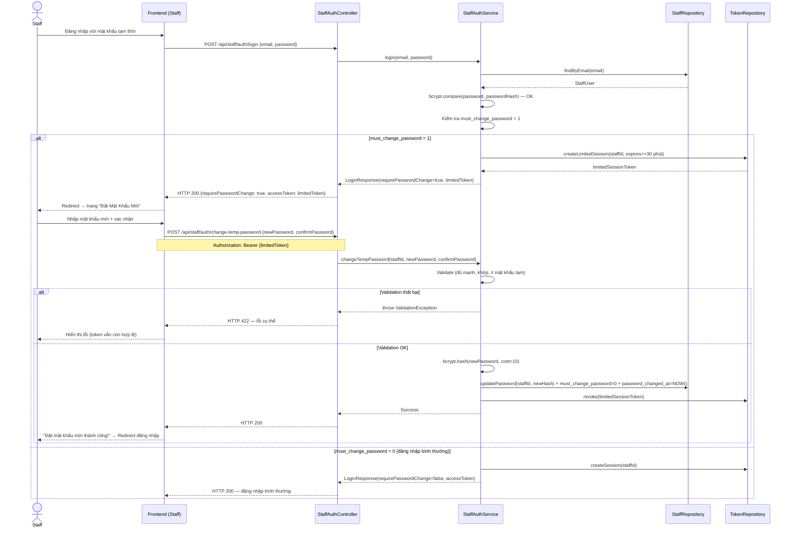
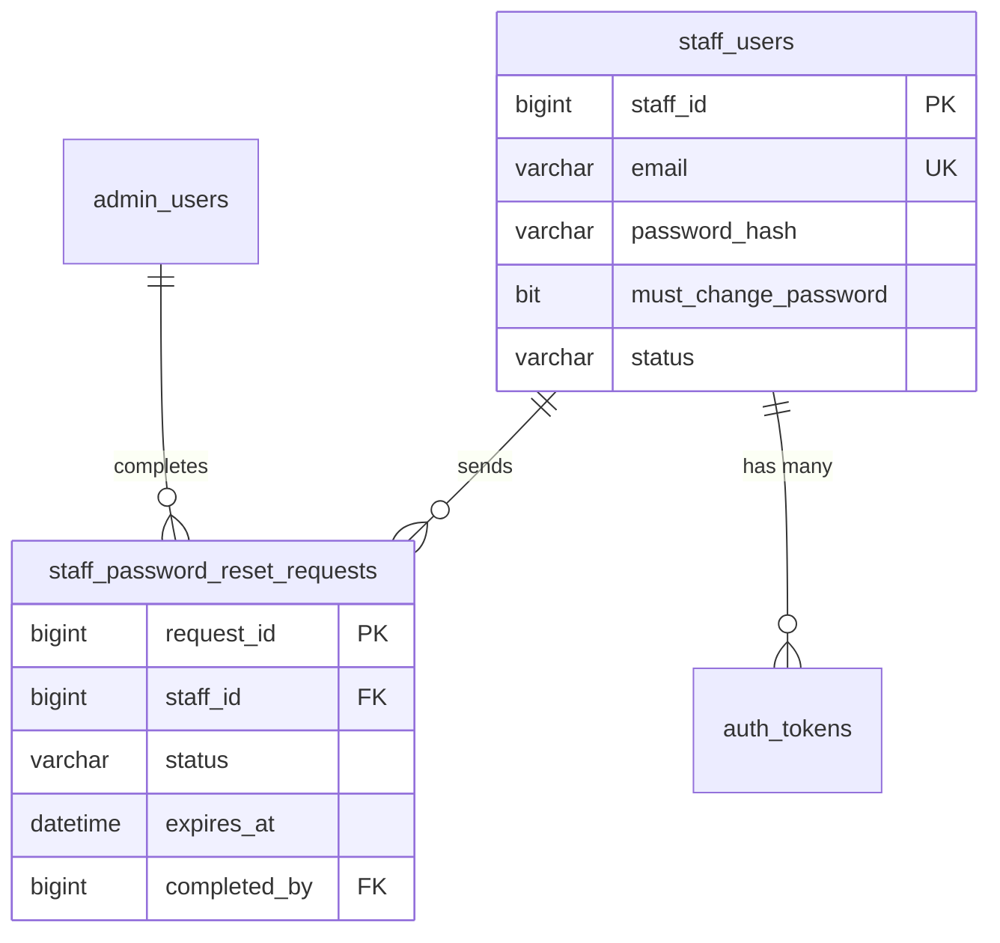

# UC-06 — Đặt Lại Mật Khẩu Staff (Admin-Mediated Reset)

> **Feature:** `feat-auth` | **Phiên bản:** 1.0 | **Trạng thái:** Draft
> **Tham chiếu FR:** FR-ADMIN-12, FR-STAFF-RESET-01 → FR-STAFF-RESET-08
> **Cập nhật:** 2026-05-30

---

## 1. Tổng Quan

| Thuộc tính | Nội dung |
|:---|:---|
| **Mã Use Case** | UC-06 |
| **Tên** | Đặt Lại Mật Khẩu Staff (Admin-Mediated Reset) |
| **Tác nhân chính** | Staff (yêu cầu) + Admin (phê duyệt & cấp mật khẩu tạm) |
| **Mô tả ngắn** | Staff nhập email và gửi yêu cầu đặt lại mật khẩu; Admin nhận thông báo, sinh mật khẩu tạm thời và gửi qua email; Staff đăng nhập bằng mật khẩu tạm thời rồi hệ thống bắt buộc đổi sang mật khẩu mới |
| **Độ ưu tiên** | Cao (P1) |

> **Khác biệt so với UC-03:** UC-03 là self-service — hệ thống tự động gửi link cho Student. UC-06 là admin-mediated — Admin phải phê duyệt và cấp mật khẩu tạm thủ công; không có link magic token.

---

## 2. Tác Nhân & Điều Kiện

### 2.1 Tác Nhân

| Tác nhân | Vai trò |
|:---|:---|
| **Staff** | Gửi yêu cầu đặt lại mật khẩu, đăng nhập bằng mật khẩu tạm thời, đặt mật khẩu mới |
| **Admin** | Nhận thông báo, sinh & gửi mật khẩu tạm thời cho Staff qua email |
| **Email Service (SMTP)** | Gửi thông báo đến Admin và mật khẩu tạm thời đến Staff |

### 2.2 Điều Kiện Tiền Quyết (Preconditions)

- Staff có tài khoản `staff_users` với `status = 'active'`
- Admin đã đăng nhập
- Cấu hình SMTP hoạt động (`system_settings`)

### 2.3 Hậu Điều Kiện (Postconditions)

- **Thành công (full flow):** `staff_users.password_hash` được cập nhật bằng mật khẩu mới của Staff; `must_change_password = 0`; yêu cầu reset bị đóng (`status = 'completed'`)
- **Thất bại / bỏ dở:** Mật khẩu tạm thời vẫn còn hiệu lực cho đến khi Admin thu hồi hoặc hết hạn (24 giờ)

---

## 3. Luồng Xử Lý

### 3.1 Luồng Chính — Staff Gửi Yêu Cầu

> **Điểm vào:** Trang đăng nhập **chung** (dùng chung với Student). Staff nhấn "Quên mật khẩu?" trên trang đó.

```
Bước 1 [Staff]:      Mở trang đăng nhập chung → nhấn "Quên mật khẩu?"
Bước 2 [Frontend]:   Hiển thị form nhập email (dùng chung, chưa phân biệt role)
Bước 3 [Staff]:      Nhập email (Gmail/email công ty), nhấn "Tiếp tục"
Bước 4 [Frontend]:   POST /api/auth/check-account-type {email}
Bước 5 [Backend]:    Validate định dạng email
Bước 6 [Backend]:    Kiểm tra rate limit: chưa quá 3 yêu cầu/email/giờ
Bước 7 [Backend]:    Query song song staff_users và student_users theo email
                        - Nếu tìm thấy trong staff_users  → accountType = 'staff'
                        - Nếu tìm thấy trong student_users → accountType = 'student'
                        - Nếu không tìm thấy ở đâu        → accountType = 'unknown'
Bước 8 [Backend]:    Trả về HTTP 200 {accountType}
                      ⚠ Trả về 'unknown' thay vì 404 để tránh lộ email nào tồn tại
Bước 9 [Frontend]:   Dựa vào accountType để điều hướng:
                        - accountType = 'staff'   → redirect /staff/forgot-password
                          (trang reset password riêng của Staff, luồng admin-mediated)
                        - accountType = 'student' → tiếp tục flow UC-03 tại trang hiện tại
                          (gửi link reset tự động)
                        - accountType = 'unknown' → hiển thị thông báo chung, không redirect
                          "Nếu email tồn tại, bạn sẽ nhận được hướng dẫn đặt lại mật khẩu."

--- Từ đây: Staff đã ở trang /staff/forgot-password ---

Bước 10 [Frontend]:  Trang Staff Reset hiển thị email đã nhập sẵn + nút "Gửi yêu cầu đến Admin"
Bước 11 [Staff]:     Xác nhận, nhấn "Gửi yêu cầu"
Bước 12 [Frontend]:  POST /api/staff/auth/forgot-password {email}
Bước 13 [Backend]:   Validate email + rate limit (lần nữa, bảo vệ endpoint trực tiếp)
Bước 14 [Backend]:   Nếu email tồn tại trong staff_users và status = 'active':
                        a. Tạo bản ghi staff_password_reset_requests
                           (staff_id, status='pending', expires_at=NOW()+24h)
                        b. Gửi email thông báo đến Admin
                           (địa chỉ lấy từ system_settings: admin_notify_email)
                        c. Tạo in-app notification cho Admin trong Admin Panel
Bước 15 [Backend]:   Trả về HTTP 200 — thông báo chung (luôn 200)
Bước 16 [Frontend]:  Hiển thị "Yêu cầu đã gửi đến quản trị viên. Vui lòng chờ email xác nhận."
```

> **Lý do tách 2 bước (check-account-type trước, rồi mới gửi yêu cầu):**
> Bước 4–9 chỉ xác định loại tài khoản để điều hướng đúng trang — không tạo request, không gửi email.
> Bước 12–16 mới là bước thực sự tạo yêu cầu reset. Rate limit áp dụng ở cả hai bước độc lập.

### 3.2 Luồng Phụ A — Admin Xử Lý Yêu Cầu & Cấp Mật Khẩu Tạm

```
Bước 1 [Admin]:      Nhận email thông báo / thấy badge notification trong Admin Panel
Bước 2 [Admin]:      Mở danh sách yêu cầu: GET /api/admin/staff/reset-requests
Bước 3 [Admin]:      Xác nhận danh tính Staff (xem thông tin: tên, email, thời gian yêu cầu)
Bước 4 [Admin]:      Nhấn "Cấp mật khẩu tạm thời" cho yêu cầu tương ứng
Bước 5 [Frontend]:   POST /api/admin/staff/{staffId}/issue-temp-password {requestId}
Bước 6 [Backend]:    Kiểm tra request tồn tại, status='pending', chưa hết hạn
Bước 7 [Backend]:    Sinh mật khẩu tạm thời ngẫu nhiên (12 ký tự, đủ mạnh)
Bước 8 [Backend]:    bcrypt.hash(tempPassword, cost=10) → lưu vào staff_users.password_hash
Bước 9 [Backend]:    Đặt staff_users.must_change_password = 1
Bước 10 [Backend]:   Thu hồi tất cả token 'session' hiện tại của Staff
Bước 11 [Backend]:   Gửi email đến Staff chứa mật khẩu tạm thời (plaintext, một lần)
                      ⚠ KHÔNG log mật khẩu tạm thời — chỉ truyền qua SMTP TLS
Bước 12 [Backend]:   Cập nhật request: status='completed', completed_at=NOW()
Bước 13 [Backend]:   Ghi admin_audit_logs: action='issue_temp_password', staff_id, admin_id
Bước 14 [Backend]:   Trả về HTTP 200 — thành công (không trả về mật khẩu tạm thời)
Bước 15 [Frontend]:  Hiển thị "Đã gửi mật khẩu tạm thời đến email của nhân viên."
```

### 3.3 Luồng Phụ B — Staff Đăng Nhập & Bắt Buộc Đổi Mật Khẩu

```
Bước 1 [Staff]:      Nhận email từ Admin chứa mật khẩu tạm thời
Bước 2 [Staff]:      Đăng nhập: POST /api/staff/auth/login {email, tempPassword}
Bước 3 [Backend]:    Xác thực email + password (bcrypt.compare)
Bước 4 [Backend]:    Kiểm tra staff_users.must_change_password
                      → must_change_password = 1:
                        a. Tạo session token hạn chế (limited_session, expires=30 phút)
                        b. Trả HTTP 200 với flag requirePasswordChange: true
Bước 5 [Frontend]:   Nhận requirePasswordChange=true → redirect đến trang "Đặt Mật Khẩu Mới"
                      (không cho phép truy cập các trang khác khi limited_session)
Bước 6 [Staff]:      Nhập mật khẩu mới + xác nhận, nhấn "Cập nhật mật khẩu"
Bước 7 [Frontend]:   POST /api/staff/auth/change-temp-password {newPassword, confirmPassword}
                      Authorization: Bearer {limited_session_token}
Bước 8 [Backend]:    Validate: newPassword đủ mạnh, hai mật khẩu khớp
Bước 9 [Backend]:    Kiểm tra newPassword ≠ tempPassword (bcrypt.compare)
Bước 10 [Backend]:   bcrypt.hash(newPassword, cost=10) → staff_users.password_hash
Bước 11 [Backend]:   Đặt staff_users.must_change_password = 0
                      Cập nhật staff_users.password_changed_at = NOW()
Bước 12 [Backend]:   Thu hồi limited_session_token
Bước 13 [Backend]:   Trả HTTP 200 — thành công
Bước 14 [Frontend]:  Hiển thị "Đặt mật khẩu mới thành công!" → redirect trang đăng nhập
```

### 3.4 Luồng Lỗi — Yêu Cầu Hết Hạn (24 giờ)

```
Admin vào xử lý request sau 24 giờ:
Bước 6 [Backend]:    expires_at < NOW() → Trả HTTP 400 RESET_REQUEST_EXPIRED
                      "Yêu cầu đặt lại mật khẩu đã hết hạn. Staff cần gửi yêu cầu mới."
```

### 3.5 Luồng Lỗi — Vượt Rate Limit

```
Staff gửi quá 3 yêu cầu/email/giờ:
Bước 6 [Backend]:    Trả HTTP 429 TOO_MANY_REQUESTS
                      "Quá nhiều yêu cầu. Vui lòng thử lại sau {X} phút."
```

### 3.6 Luồng Lỗi — Mật Khẩu Mới Yếu / Trùng Mật Khẩu Tạm

```
Bước 8 [Backend]:    Mật khẩu không đủ mạnh → HTTP 422 WEAK_PASSWORD
Bước 9 [Backend]:    newPassword = tempPassword  → HTTP 422 SAME_PASSWORD
                      "Mật khẩu mới không được giống mật khẩu tạm thời."
                      (limited_session_token vẫn còn hợp lệ, Staff thử lại được)
```

---

## 4. Quy Tắc Nghiệp Vụ

| Mã | Quy tắc | Chi tiết |
|:---|:---|:---|
| BR-06-01 | **LUÔN** trả HTTP 200 cho endpoint `forgot-password`, dù email có tồn tại hay không | Chống email enumeration |
| BR-06-02 | Yêu cầu reset hết hạn sau **24 giờ** nếu Admin chưa xử lý | Tránh request tồn đọng vô thời hạn |
| BR-06-03 | Mật khẩu tạm thời phải là chuỗi ngẫu nhiên **12 ký tự** (chữ hoa + chữ thường + số + ký tự đặc biệt) | Đủ entropy, không đoán được |
| BR-06-04 | **KHÔNG log** mật khẩu tạm thời tại bất kỳ layer nào | NFR bảo mật — chỉ gửi qua SMTP TLS |
| BR-06-05 | Backend **KHÔNG** trả mật khẩu tạm thời trong API response | Admin không xem được trên màn hình |
| BR-06-06 | Sau khi cấp mật khẩu tạm: thu hồi **tất cả** session token hiện tại của Staff | Buộc đăng nhập lại trên mọi thiết bị |
| BR-06-07 | Khi `must_change_password = 1`: login trả `limited_session` hết hạn sau **30 phút** | Staff phải đổi mật khẩu ngay, không truy cập được các trang khác |
| BR-06-08 | `limited_session` chỉ được phép gọi endpoint `change-temp-password` | Ngăn Staff bypass bằng cách dùng token trực tiếp |
| BR-06-09 | Mật khẩu mới **không được trùng** mật khẩu tạm thời | Buộc Staff tạo mật khẩu thực sự mới |
| BR-06-10 | Mật khẩu mới phải đủ mạnh: ≥ 8 ký tự, ≥ 1 hoa, ≥ 1 số | Kế thừa từ FR-AUTH-12 |
| BR-06-11 | Rate limit: tối đa **3 yêu cầu/email/giờ** | Chống spam thông báo Admin |
| BR-06-12 | Mỗi lần Admin issue temp password phải ghi **admin_audit_logs** | Trách nhiệm giải trình |

---

## 5. Quy Tắc Kiểm Tra Đầu Vào

### POST /api/staff/auth/forgot-password

| Trường | Kiểm tra | Thông báo lỗi |
|:---|:---|:---|
| `email` | Bắt buộc, không rỗng | "Email là bắt buộc" |
| `email` | Định dạng email hợp lệ | "Email không hợp lệ" |

### POST /api/admin/staff/{staffId}/issue-temp-password

| Trường | Kiểm tra | Thông báo lỗi |
|:---|:---|:---|
| `requestId` | Bắt buộc, tồn tại trong DB | "Yêu cầu không tồn tại" |
| `requestId` | `status = 'pending'` | "Yêu cầu đã được xử lý" |
| `requestId` | `expires_at > NOW()` | "Yêu cầu đã hết hạn" |

### POST /api/staff/auth/change-temp-password

| Trường | Kiểm tra | Thông báo lỗi |
|:---|:---|:---|
| `newPassword` | Bắt buộc, không rỗng | "Mật khẩu mới là bắt buộc" |
| `newPassword` | Tối thiểu 8 ký tự | "Mật khẩu phải có ít nhất 8 ký tự" |
| `newPassword` | Có ít nhất 1 chữ hoa | "Mật khẩu cần có ít nhất 1 chữ hoa" |
| `newPassword` | Có ít nhất 1 chữ số | "Mật khẩu cần có ít nhất 1 chữ số" |
| `confirmPassword` | Bắt buộc | "Xác nhận mật khẩu là bắt buộc" |
| `confirmPassword` | Khớp với `newPassword` | "Mật khẩu xác nhận không khớp" |

---

## 6. Sơ Đồ Tuần Tự (Sequence Diagram)

### 6.1 Staff Gửi Yêu Cầu & Admin Xử Lý



### 6.2 Staff Đăng Nhập & Đổi Mật Khẩu



---

## 7. Data Model

### 7.1 Thay đổi bảng hiện có

```sql
-- Thêm cột vào staff_users
ALTER TABLE staff_users ADD
    must_change_password BIT NOT NULL DEFAULT 0;
    -- 1 = đang dùng mật khẩu tạm thời, bắt buộc đổi khi đăng nhập tiếp theo
```

### 7.2 Bảng mới

```sql
-- Bảng: staff_password_reset_requests
CREATE TABLE staff_password_reset_requests (
    request_id      BIGINT IDENTITY(1,1) PRIMARY KEY,
    staff_id        BIGINT          NOT NULL,
    status          NVARCHAR(20)    NOT NULL DEFAULT 'pending'
        CHECK (status IN ('pending', 'completed', 'expired', 'cancelled')),
    requested_at    DATETIME2       NOT NULL DEFAULT SYSUTCDATETIME(),
    expires_at      DATETIME2       NOT NULL,           -- requested_at + 24 giờ
    completed_at    DATETIME2       NULL,
    completed_by    BIGINT          NULL,               -- admin_id đã xử lý
    request_ip      NVARCHAR(45)    NULL,

    CONSTRAINT FK_reset_req_staff FOREIGN KEY (staff_id)      REFERENCES staff_users(staff_id),
    CONSTRAINT FK_reset_req_admin FOREIGN KEY (completed_by)  REFERENCES admin_users(admin_id)
);

-- Index để Admin truy vấn pending requests nhanh
CREATE INDEX IX_reset_req_status_expires ON staff_password_reset_requests (status, expires_at);
```

### 7.3 Token type mới trong auth_tokens

```sql
-- auth_tokens.token_type cần thêm giá trị 'limited_session'
-- Cập nhật CHECK constraint:
CHECK (token_type IN ('session','email_verification','password_reset','refresh','limited_session'))
```

> `limited_session`: Token chỉ cho phép gọi `/api/staff/auth/change-temp-password`, hết hạn sau 30 phút.

### 7.4 Quan hệ



---

## 8. API Spec

### `POST /api/auth/check-account-type`
**Actor:** Guest (trang đăng nhập chung) | **Auth:** None

> Endpoint dùng chung, được gọi trước khi phân nhánh sang UC-03 (Student) hoặc UC-06 (Staff).
> Rate limit: 10 request/phút/IP.

**Request:**
```json
{ "email": "string — email nhập trên trang đăng nhập chung" }
```

**Response (200 — luôn trả 200):**
```json
{
  "status": 200,
  "message": "OK",
  "data": {
    "accountType": "staff | student | unknown"
  }
}
```

> - `staff`   → Frontend redirect sang `/staff/forgot-password` (flow UC-06)
> - `student` → Frontend tiếp tục flow UC-03 tại chỗ
> - `unknown` → Frontend hiển thị thông báo chung, không tiết lộ email không tồn tại

---

### `POST /api/staff/auth/forgot-password`
**Actor:** Staff (unauthenticated) | **Auth:** None

> Chỉ được gọi từ trang `/staff/forgot-password` sau khi đã qua `check-account-type`.

**Request:**
```json
{ "email": "string — địa chỉ email Staff đã xác nhận" }
```

**Response (200 — luôn trả về dù email có hay không):**
```json
{
  "status": 200,
  "message": "Yêu cầu đã gửi đến quản trị viên. Vui lòng chờ email xác nhận.",
  "data": null
}
```

---

### `GET /api/admin/staff/reset-requests`
**Actor:** Admin | **Auth:** Bearer JWT | **Role:** ADMIN

**Query Params:** `status=pending|completed|expired` (optional, default: `pending`)

**Response (200):**
```json
{
  "status": 200,
  "message": "OK",
  "data": [
    {
      "requestId": "long",
      "staffId": "long",
      "staffName": "string",
      "staffEmail": "string",
      "requestedAt": "datetime",
      "expiresAt": "datetime",
      "status": "pending"
    }
  ]
}
```

---

### `POST /api/admin/staff/{staffId}/issue-temp-password`
**Actor:** Admin | **Auth:** Bearer JWT | **Role:** ADMIN

**Request:**
```json
{ "requestId": "long — ID yêu cầu cần xử lý" }
```

**Response (200):**
```json
{
  "status": 200,
  "message": "Đã sinh và gửi mật khẩu tạm thời đến email của nhân viên.",
  "data": {
    "staffId": "long",
    "staffEmail": "string",
    "completedAt": "datetime"
  }
}
```

> ⚠ Response **không** chứa mật khẩu tạm thời. Mật khẩu chỉ được gửi qua SMTP đến Staff.

---

### `POST /api/staff/auth/change-temp-password`
**Actor:** Staff | **Auth:** Bearer JWT (`limited_session` token) | **Role:** STAFF

**Request:**
```json
{
  "newPassword":     "string — mật khẩu mới (≥8 ký tự, ≥1 hoa, ≥1 số)",
  "confirmPassword": "string — xác nhận mật khẩu"
}
```

**Response (200):**
```json
{
  "status": 200,
  "message": "Đặt mật khẩu mới thành công. Vui lòng đăng nhập lại.",
  "data": null
}
```

---

### `POST /api/staff/auth/login` (bổ sung so với login bình thường)

**Response khi `must_change_password = 1` (200):**
```json
{
  "status": 200,
  "message": "Đăng nhập thành công. Bạn phải đặt mật khẩu mới trước khi tiếp tục.",
  "data": {
    "accessToken": "string — limited_session JWT (30 phút)",
    "requirePasswordChange": true
  }
}
```

---

## 9. Error Handling

| HTTP Code | Error Code | Message | Trigger |
|:---:|:---|:---|:---|
| 400 | `RESET_REQUEST_EXPIRED` | "Yêu cầu đặt lại mật khẩu đã hết hạn. Staff cần gửi yêu cầu mới." | Admin xử lý sau 24 giờ |
| 400 | `RESET_REQUEST_ALREADY_PROCESSED` | "Yêu cầu này đã được xử lý." | Admin xử lý yêu cầu đã completed |
| 400 | `PASSWORD_MISMATCH` | "Mật khẩu xác nhận không khớp" | confirmPassword ≠ newPassword |
| 400 | `SAME_PASSWORD` | "Mật khẩu mới không được giống mật khẩu tạm thời." | newPassword = tempPassword |
| 401 | `UNAUTHORIZED` | "Yêu cầu đăng nhập" | JWT thiếu hoặc hết hạn |
| 403 | `FORBIDDEN` | "Không đủ quyền truy cập" | Staff cố gọi Admin API |
| 403 | `LIMITED_SESSION_ONLY` | "Token này chỉ dùng để đổi mật khẩu tạm thời" | `limited_session` gọi API khác |
| 404 | `RESET_REQUEST_NOT_FOUND` | "Không tìm thấy yêu cầu đặt lại mật khẩu" | requestId sai |
| 422 | `WEAK_PASSWORD` | "Mật khẩu quá yếu: cần ≥ 8 ký tự, 1 hoa, 1 số" | Password không đủ mạnh |
| 429 | `TOO_MANY_REQUESTS` | "Quá nhiều yêu cầu. Vui lòng thử lại sau {X} phút." | Vượt rate limit 3/email/giờ |
| 500 | `INTERNAL_ERROR` | "Internal server error" | Lỗi hệ thống |

---

## 10. Tiêu Chí Chấp Nhận (Acceptance Criteria)

### AC-06-01 — Staff gửi yêu cầu với email hợp lệ

- **Cho trước:** `staff@jlpt.com` tồn tại, `status = 'active'`
- **Khi:** POST `/api/staff/auth/forgot-password` với `email = "staff@jlpt.com"`
- **Thì:**
  - Nhận HTTP 200, thông báo chung
  - Bản ghi `staff_password_reset_requests` mới với `status = 'pending'`, `expires_at = NOW() + 24h`
  - Email thông báo được gửi đến Admin

---

### AC-06-02 — Staff gửi yêu cầu với email không tồn tại

- **Cho trước:** `ghost@jlpt.com` KHÔNG tồn tại
- **Khi:** POST `/api/staff/auth/forgot-password` với `email = "ghost@jlpt.com"`
- **Thì:**
  - Nhận HTTP 200, **thông báo giống hệt** AC-06-01
  - Không tạo bản ghi `staff_password_reset_requests`
  - Không gửi email Admin

---

### AC-06-03 — Admin cấp mật khẩu tạm thời thành công

- **Cho trước:** Yêu cầu `pending` còn trong hạn, Admin đã đăng nhập
- **Khi:** POST `/api/admin/staff/{staffId}/issue-temp-password`
- **Thì:**
  - `staff_users.password_hash` được cập nhật (bcrypt hash của mật khẩu tạm)
  - `staff_users.must_change_password = 1`
  - Tất cả `session` token hiện tại của Staff bị thu hồi
  - Email chứa mật khẩu tạm thời được gửi đến Staff
  - Request cập nhật `status = 'completed'`
  - Ghi `admin_audit_logs`
  - Response **không** chứa mật khẩu tạm thời

---

### AC-06-04 — Staff đăng nhập bằng mật khẩu tạm thời

- **Cho trước:** `must_change_password = 1`, mật khẩu tạm thời đúng
- **Khi:** POST `/api/staff/auth/login`
- **Thì:**
  - Nhận HTTP 200 với `requirePasswordChange: true`
  - `accessToken` là `limited_session` (hết hạn 30 phút)
  - Frontend redirect đến trang "Đặt Mật Khẩu Mới"

---

### AC-06-05 — Staff đặt mật khẩu mới thành công

- **Cho trước:** Có `limited_session` token hợp lệ
- **Khi:** POST `/api/staff/auth/change-temp-password` với `newPassword = "NewSecure1"`
- **Thì:**
  - `staff_users.password_hash` được cập nhật
  - `staff_users.must_change_password = 0`
  - `staff_users.password_changed_at = NOW()`
  - `limited_session` token bị thu hồi
  - Có thể đăng nhập bình thường với mật khẩu mới
  - KHÔNG thể đăng nhập với mật khẩu tạm thời cũ

---

### AC-06-06 — Staff bị chặn truy cập trang khác khi dùng limited_session

- **Cho trước:** Có `limited_session` token
- **Khi:** Gọi bất kỳ API nào khác ngoài `/api/staff/auth/change-temp-password`
- **Thì:** HTTP 403 `LIMITED_SESSION_ONLY`

---

### AC-06-07 — Admin xử lý yêu cầu đã hết hạn

- **Cho trước:** Request được tạo hơn 24 giờ trước
- **Khi:** Admin cố gọi `issue-temp-password` với request đó
- **Thì:** HTTP 400 `RESET_REQUEST_EXPIRED`

---

### AC-06-08 — Mật khẩu mới trùng mật khẩu tạm thời

- **Cho trước:** Có `limited_session` token hợp lệ
- **Khi:** POST change-temp-password với `newPassword = <tempPassword>`
- **Thì:**
  - HTTP 422 `SAME_PASSWORD`
  - `must_change_password` vẫn là `1`
  - Token vẫn còn hợp lệ (Staff thử lại được)

---

### AC-06-09 — Vượt rate limit gửi yêu cầu

- **Cho trước:** Staff đã gửi 3 yêu cầu trong vòng 1 giờ
- **Khi:** Gửi yêu cầu thứ 4
- **Thì:** HTTP 429 `TOO_MANY_REQUESTS`

---

## 11. Ngoài Phạm Vi (Out of Scope)

- ❌ Staff tự reset mật khẩu qua link email (như Student UC-03) — Staff phải qua Admin
- ❌ Reset mật khẩu cho Admin — ngoài scope
- ❌ Admin tự nhập mật khẩu tạm thời thay vì để hệ thống sinh — hệ thống phải sinh để đảm bảo entropy
- ❌ Lịch sử mật khẩu (không dùng lại N mật khẩu cũ) — Phase 2
- ❌ Thông báo SMS cho Staff — Phase 2
- ❌ Staff tự hủy yêu cầu đang pending — Phase 2
