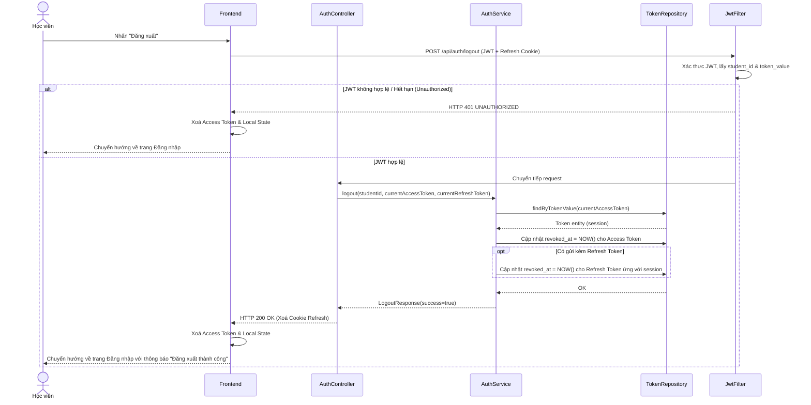

# UC-18 — Đăng Xuất (Logout)

> **Feature:** `feat-auth` | **Phiên bản:** 1.0 | **Trạng thái:** Draft
> **Tham chiếu FR:** FR-AUTH-50, FR-AUTH-51, FR-AUTH-52
> **Cập nhật:** 2026-05-30

---

## 1. Tổng Quan

| Thuộc tính | Nội dung |
|:---|:---|
| **Mã Use Case** | UC-18 |
| **Tên** | Đăng Xuất (Logout) |
| **Tác nhân chính** | Học viên đã đăng nhập (Student) |
| **Mô tả ngắn** | Học viên đang trong phiên đăng nhập chủ động thực hiện đăng xuất để vô hiệu hóa token hiện tại của thiết bị đó, đảm bảo an toàn cho tài khoản. |
| **Độ ưu tiên** | Cao (P1) |

---

## 2. Tác Nhân & Điều Kiện

### 2.1 Tác Nhân

| Tác nhân | Vai trò |
|:---|:---|
| **Học viên (Student)** | Người chủ động thực hiện đăng xuất để huỷ phiên làm việc hiện tại |

### 2.2 Điều Kiện Tiền Quyết (Preconditions)

- Học viên đang ở trạng thái đã đăng nhập (sở hữu JWT và/hoặc Refresh Token hợp lệ).

### 2.3 Hậu Điều Kiện (Postconditions)

- **Thành công:**
  - Token session hiện tại bị thu hồi trong DB (`revoked_at` của bản ghi `auth_tokens` tương ứng được cập nhật thành thời gian hiện tại).
  - Client xoá Access Token trong bộ nhớ và xoá Refresh Token (nếu dùng HttpOnly Cookie thì cookie đó bị xoá hoặc set hết hạn ngay lập tức).
  - Học viên được chuyển hướng về trang Đăng nhập.
- **Thất bại:** Không có luồng thất bại thực sự trên UI vì cho dù server lỗi hoặc token gửi lên đã hết hạn, client vẫn bắt buộc xoá bỏ dữ liệu lưu trữ cục bộ và chuyển hướng học viên về trang đăng nhập để tránh kẹt trạng thái.

---

## 3. Luồng Xử Lý

### 3.1 Luồng Chính — Đăng Xuất Thành Công (Single Device)

```
Bước 1 [Học viên]:   Nhấn nút "Đăng xuất" trên giao diện (ví dụ: ở Header hoặc trang Cá nhân).
Bước 2 [Frontend]:   Gửi request POST /api/auth/logout kèm JWT trong header Authorization và HttpOnly Cookie Refresh Token (nếu có).
Bước 3 [Backend]:    Nhận request, JwtFilter xác thực JWT hợp lệ và lấy thông tin Student.
Bước 4 [Backend]:    Trích xuất token giá trị cụ thể từ session đang dùng.
Bước 5 [Backend]:    Tìm bản ghi trong bảng auth_tokens ứng với token hiện tại.
Bước 6 [Backend]:    Cập nhật bản ghi auth_tokens hiện tại:
                        - revoked_at = NOW()
Bước 7 [Backend]:    Xoá cookie refresh token (nếu dùng HttpOnly cookie) bằng cách trả về Set-Cookie với Max-Age = 0.
Bước 8 [Backend]:    Ghi log bảo mật (Audit Log): "LOGOUT_SUCCESS" cho student_id tương ứng.
Bước 9 [Backend]:    Trả về HTTP 200 OK cùng thông điệp "Đăng xuất thành công."
Bước 10 [Frontend]:  Xoá Access Token khỏi bộ nhớ (memory/state) và các thông tin cá nhân của Student.
Bước 11 [Frontend]:  Chuyển hướng học viên về trang Đăng nhập (/login).
```

### 3.2 Luồng Khác — Đăng Xuất Khi Session/JWT Đã Hết Hạn Trên Server

```
Bước 1 [Học viên]:   Nhấn nút "Đăng xuất" sau một thời gian dài không hoạt động hoặc sau khi JWT hết hạn.
Bước 2 [Frontend]:   Gửi request POST /api/auth/logout.
Bước 3 [Backend]:    JwtFilter phát hiện JWT đã hết hạn hoặc không hợp lệ. Trả về HTTP 401 UNAUTHORIZED.
Bước 4 [Frontend]:   Nhận kết quả HTTP 401. Thực hiện cơ chế fallback:
                        - Xoá hoàn toàn Access Token và thông tin User trong bộ nhớ Client.
                        - Xoá Refresh Token trong cookie/storage cục bộ.
                        - Chuyển hướng học viên về trang Đăng nhập.
```

---

## 4. Quy Tắc Nghiệp Vụ

| Mã | Quy tắc | Chi tiết |
|:---|:---|:---|
| BR-18-01 | **Thu hồi chính xác session** | Chỉ vô hiệu hoá token session hiện tại đang sử dụng. Không ảnh hưởng đến các session hợp lệ khác của học viên trên các thiết bị khác (tránh trường hợp đăng xuất ở thiết bị này làm thiết bị khác bị đăng xuất theo) — → FR-AUTH-52 |
| BR-18-02 | **Làm sạch dữ liệu Client** | Phía client bắt buộc phải xoá sạch dấu vết phiên đăng nhập (Access token, Refresh token, thông tin học viên trong State/LocalStorage) sau khi nhấn đăng xuất, bất kể API trả về kết quả gì (200 hay 401/500). |
| BR-18-03 | **Xử lý Refresh Token đi kèm** | Khi đăng xuất session, nếu hệ thống có lưu Refresh Token tương ứng của phiên đó trong DB, Refresh Token này cũng phải được chuyển sang trạng thái bị thu hồi (`revoked_at = NOW()`). |
| BR-18-04 | **Audit Log đầy đủ** | Hành động đăng xuất thành công phải được ghi nhận vào log của hệ thống để theo dõi lịch sử truy cập (IP, thời gian, User ID). |

---

## 5. Quy Tắc Kiểm Tra Đầu Vào

### POST /api/auth/logout

| Trường/Header | Kiểm tra | Thông báo lỗi / Cách xử lý |
|:---|:---|:---|
| Header `Authorization` | Bắt buộc chứa `Bearer <JWT_ACCESS_TOKEN>` | Nếu không có hoặc sai định dạng: Trả về HTTP 401, client tự động xoá session cục bộ. |
| Cookie `refreshToken` (Tùy chọn) | Chứa Refresh Token để xoá trong DB | Nếu có, server thực hiện thu hồi cả Refresh Token trong bảng `auth_tokens`. |

---

## 6. Sơ Đồ Tuần Tự (Sequence Diagram)



---

## 7. Tham Chiếu API

> Xem đặc tả đầy đủ tại [SPEC.md § 6 — API SPEC](./SPEC.md)

| Phương thức | Endpoint | Mô tả |
|:---|:---|:---|
| `POST` | `/api/auth/logout` | Đăng xuất thiết bị hiện tại, thu hồi session và refresh token |

---

## 8. Tiêu Chí Chấp Nhận (Acceptance Criteria)

### AC-18-01 — Đăng xuất thành công (Single Device)

> **Tham chiếu:** FR-AUTH-50, FR-AUTH-52

- **Cho trước:** Học viên đã đăng nhập trên 2 thiết bị: Thiết bị A (session token A) và Thiết bị B (session token B).
- **Khi:** POST `/api/auth/logout` từ thiết bị A kèm session token A hợp lệ.
- **Thì:**
  - Nhận HTTP 200.
  - Bản ghi của session token A trong `auth_tokens` có `revoked_at` = NOW().
  - Bản ghi của session token B trong `auth_tokens` **KHÔNG** thay đổi (`revoked_at` vẫn NULL).
  - Client xoá sạch token và thông tin user, redirect về trang đăng nhập.
  - Dùng token A để gọi API bảo mật sau đó sẽ nhận HTTP 401.

---

### AC-18-02 — Đăng xuất khi JWT đã hết hạn

> **Tham chiếu:** FR-AUTH-51

- **Cho trước:** Học viên đã đăng nhập, nhưng JWT Access Token đã hết hạn trên client và không thể refresh tự động.
- **Khi:** Học viên nhấn nút "Đăng xuất", Frontend gửi request logout nhưng nhận HTTP 401 từ Gateway/Server.
- **Thì:**
  - Frontend nhận HTTP 401.
  - Frontend kích hoạt cơ chế dọn dẹp cục bộ: xoá bỏ Access Token, xoá Refresh Token, xoá Local State.
  - Redirect học viên về trang đăng nhập thành công.
  - Không xuất hiện lỗi trắng trang hay kẹt trạng thái vô tận.

---

## 9. Ngoài Phạm Vi (Out of Scope)

- ❌ Đăng xuất toàn bộ các thiết bị (Logout all sessions) — Hẹn Phase 2.
- ❌ Tự động đăng xuất sau X phút không hoạt động (Inactivity timeout) — Xử lý độc lập bằng client-side timer hoặc cấu trúc middleware riêng.
