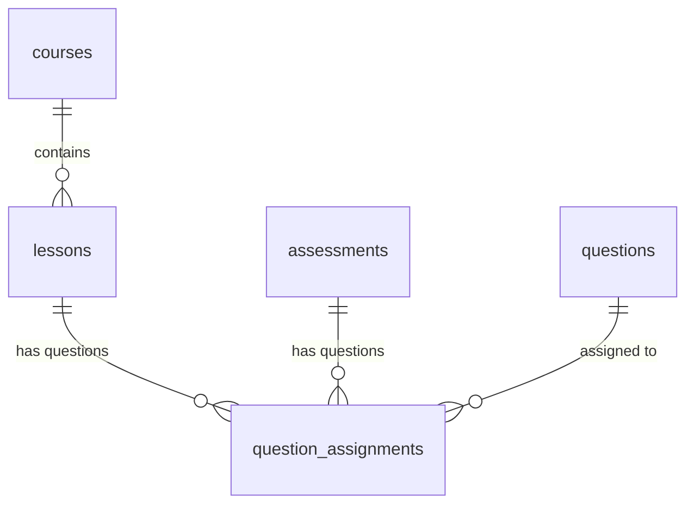

# SPEC — Content & Question Bank Management (Staff Role)
>
> **Feature ID:** `feat-content-management`
> **UC Coverage:** UC-24 (Manage Question Bank), UC-25 (Manage Grammar Content), UC-26 (Manage Quiz), UC-27 (Manage Learning Content), UC-28 (Manage JLPT Mock Exams)
> **Version:** 1.0 | **Status:** Draft
> **Author:** Team | **Last Updated:** 2026-05-28

---

## 1. CONTEXT & GOAL

### 1.1 Bối cảnh

Chất lượng và tính phong phú của nội dung bài học là yếu tố then chốt thu hút và giữ chân học viên ôn thi JLPT. Các Nhân viên soạn thảo nội dung (Staff) cần có các công cụ nghiệp vụ chuyên dụng để xây dựng hệ thống bài học (khóa học, bài giảng, Kanji, từ vựng, ngữ pháp) và thiết lập các bài đánh giá (Quiz trắc nghiệm, ngân hàng câu hỏi, đề thi thử JLPT).

### 1.2 Mục tiêu

- **Quản lý học liệu (UC-25, UC-27):** Cho phép Staff thêm mới, sửa đổi, ẩn/hiện các khóa học (`courses`), bài giảng (`lessons`), điểm ngữ pháp (`grammar_points`), từ vựng (`vocabulary`), và chữ Hán (`kanji`) ở trạng thái nháp (`draft`).
- **Quản lý ngân hàng câu hỏi (UC-24):** Xây dựng kho câu hỏi trắc nghiệm (`questions`) được gắn nhãn theo kỹ năng và trình độ. Hỗ trợ khóa sửa đổi khi câu hỏi đã được làm bài (`is_locked`).
- **Xây dựng đánh giá (UC-26, UC-28):** Cho phép gán các câu hỏi từ ngân hàng vào bài trắc nghiệm nhanh (`quiz`) hoặc cấu trúc đề thi thử JLPT phức tạp (`exam`) chia theo các phần thi cụ thể.
- **Quy trình chất lượng:** Mọi nội dung do Staff tạo ra phải đi qua trạng thái chờ duyệt (`pending_review`) và chỉ hiển thị công khai cho học viên sau khi được Quản lý (StaffManager) xuất bản (`published`).

### 1.3 Tại sao cần?

Nếu không quản lý tập trung và phân tách trạng thái kiểm duyệt $\rightarrow$ các bài học bị lỗi chính tả, sai kiến thức sư phạm hoặc đề thi không cân đối điểm số sẽ hiển thị trực tiếp đến học viên, làm giảm uy tín thương hiệu. Cơ chế khóa câu hỏi (`is_locked`) ngăn chặn việc thay đổi nội dung câu hỏi làm sai lệch dữ liệu lịch sử làm bài trước đây.

---

## 2. ACTOR

| Actor | Role | Điều kiện tiền quyết |
|:---|:---|:---|
| **Staff** | Soạn thảo câu hỏi, bài giảng, đề thi và gửi kiểm duyệt | Đã đăng nhập vai trò Staff, status = `active` |

---

## 3. FUNCTIONAL REQUIREMENTS (EARS)

### 3.1 UC-24 & UC-27 — Soạn thảo Học liệu & Ngân hàng câu hỏi

| ID | EARS Requirement |
|:---|:---|
| FR-CONTENT-01 | WHEN a Staff member creates or updates a content item (course, lesson, kanji, vocabulary, grammar, question), THE SYSTEM SHALL save the record with `status = 'draft'` and assign the editor's ID to `created_by`. |
| FR-CONTENT-02 | WHEN a Staff completes editing, THE SYSTEM SHALL allow changing `status = 'pending_review'` to place the content into the Review Queue. |
| FR-CONTENT-03 | THE SYSTEM SHALL NOT allow Staff to modify any question that has been attempted by students (checked via existence in `attempt_answers`). Instead, the system shall force the creation of a new version. |
| FR-CONTENT-04 | THE SYSTEM SHALL enforce that vocabularies, Kanji, and grammar points contain all mandatory fields and valid JLPT levels ('N5' to 'N1') before submitting for review. |

### 3.2 UC-25, UC-26 & UC-28 — Thiết lập Quiz và Đề thi JLPT

| ID | EARS Requirement |
|:---|:---|
| FR-CONTENT-10 | WHEN a Staff member creates an assessment, THE SYSTEM SHALL support setting `assessment_type` to 'quiz' or 'exam' with total score and pass score. |
| FR-CONTENT-11 | WHEN a Staff assigns a question to an assessment or a lesson, THE SYSTEM SHALL record the link in `question_assignments` specifying the `display_order`, `section_name` (for exams), and question `score`. |
| FR-CONTENT-12 | THE SYSTEM SHALL ensure the sum of question scores in `question_assignments` matches the `total_score` of the parent assessment before allowing submission for review. |
| FR-CONTENT-13 | WHILE an assessment is in `published` status, THE SYSTEM SHALL block any changes to its linked question assignments to preserve historical test integrity. |

---

## 4. NON-FUNCTIONAL REQUIREMENTS

| ID | Category | Requirement |
|:---|:---|:---|
| NFR-CONTENT-01 | Data Integrity | Việc kiểm tra khóa câu hỏi (`is_locked`) phải được validate cứng ở tầng DB/Service Layer trước khi cho phép thực thi câu lệnh sửa câu hỏi. |
| NFR-CONTENT-02 | Storage | Tất cả file âm thanh, hình ảnh nét viết, ảnh Canvas phải được lưu trữ trên Cloud Storage (/uploads hoặc S3). Database chỉ được lưu đường dẫn URL. |
| NFR-CONTENT-03 | Naming & Code Standard | Mọi method, class, package phải tuân thủ nghiêm ngặt chuẩn đặt tên Java (PascalCase/camelCase) như quy định trong `AGENTS.md`. |
| NFR-CONTENT-04 | Logging | Log mọi hành vi chỉnh sửa nội dung bằng SLF4J: `[INFO] Staff {staffId} edited {contentType} ID {contentId}`. |

---

## 5. DATA MODEL

### 5.1 Bảng chính

> Nguồn: [`jlpt_database_v2.sql`](file:///d:/Japanese-Skill-Practice-Platform/3.src/infra/Database/jlpt_database_v2.sql)

```sql
-- Bảng 5: courses
CREATE TABLE courses (
    course_id        BIGINT IDENTITY(1,1) PRIMARY KEY,
    title            NVARCHAR(255)   NOT NULL,
    description      NVARCHAR(MAX)   NULL,
    jlpt_level       NVARCHAR(5)     NOT NULL
        CHECK (jlpt_level IN ('N5','N4','N3','N2','N1')),
    thumbnail_url    NVARCHAR(500)   NULL,
    is_vip_only      BIT             NOT NULL DEFAULT 0,
    display_order    INT             NOT NULL DEFAULT 0,
    status           NVARCHAR(20)    NOT NULL DEFAULT 'draft'
        CHECK (status IN ('draft','pending_review','rejected','published','archived','deleted')),
    created_by       BIGINT          NULL,
    approved_by      BIGINT          NULL,
    published_at     DATETIME2       NULL,
    created_at       DATETIME2       NOT NULL DEFAULT SYSUTCDATETIME(),
    updated_at       DATETIME2       NOT NULL DEFAULT SYSUTCDATETIME(),
    CONSTRAINT FK_courses_creator  FOREIGN KEY (created_by)  REFERENCES staff_users(staff_id),
    CONSTRAINT FK_courses_approver FOREIGN KEY (approved_by) REFERENCES staff_users(staff_id)
);

-- Bảng 6: lessons
CREATE TABLE lessons (
    lesson_id        BIGINT IDENTITY(1,1) PRIMARY KEY,
    course_id        BIGINT          NULL,
    lesson_type      NVARCHAR(20)    NOT NULL DEFAULT 'lesson'
        CHECK (lesson_type IN ('lesson','reading','listening','speaking')),
    title            NVARCHAR(255)   NOT NULL,
    jlpt_level       NVARCHAR(5)     NOT NULL
        CHECK (jlpt_level IN ('N5','N4','N3','N2','N1')),
    content_text     NVARCHAR(MAX)   NULL,
    video_url        NVARCHAR(500)   NULL,
    audio_url        NVARCHAR(500)   NULL,
    attachment_url   NVARCHAR(500)   NULL,
    explanation      NVARCHAR(MAX)   NULL,
    display_order    INT             NOT NULL DEFAULT 0,
    status           NVARCHAR(20)    NOT NULL DEFAULT 'draft'
        CHECK (status IN ('draft','pending_review','rejected','published','archived','deleted')),
    created_by       BIGINT          NULL,
    approved_by      BIGINT          NULL,
    published_at     DATETIME2       NULL,
    created_at       DATETIME2       NOT NULL DEFAULT SYSUTCDATETIME(),
    updated_at       DATETIME2       NOT NULL DEFAULT SYSUTCDATETIME(),
    CONSTRAINT FK_lessons_course   FOREIGN KEY (course_id)   REFERENCES courses(course_id),
    CONSTRAINT FK_lessons_creator  FOREIGN KEY (created_by)  REFERENCES staff_users(staff_id),
    CONSTRAINT FK_lessons_approver FOREIGN KEY (approved_by) REFERENCES staff_users(staff_id)
);

-- Bảng 10: questions
CREATE TABLE questions (
    question_id      BIGINT IDENTITY(1,1) PRIMARY KEY,
    question_text    NVARCHAR(MAX)  NOT NULL,
    question_type    NVARCHAR(30)   NOT NULL
        CHECK (question_type IN ('multiple_choice','fill_blank','true_false')),
    skill            NVARCHAR(30)   NOT NULL
        CHECK (skill IN ('vocabulary','grammar','kanji','reading','listening','mixed')),
    jlpt_level       NVARCHAR(5)    NOT NULL
        CHECK (jlpt_level IN ('N5','N4','N3','N2','N1')),
    explanation      NVARCHAR(MAX)  NULL,
    audio_url        NVARCHAR(500)  NULL,
    image_url        NVARCHAR(500)  NULL,
    option_a         NVARCHAR(MAX)  NULL,
    option_b         NVARCHAR(MAX)  NULL,
    option_c         NVARCHAR(MAX)  NULL,
    option_d         NVARCHAR(MAX)  NULL,
    correct_option   CHAR(1)        NULL
        CHECK (correct_option IN ('A','B','C','D')),
    correct_answer_text NVARCHAR(MAX) NULL,
    created_by       BIGINT         NULL,
    status           NVARCHAR(20)   NOT NULL DEFAULT 'draft'
        CHECK (status IN ('draft','pending_review','rejected','published','archived','deleted')),
    approved_by      BIGINT         NULL,
    published_at     DATETIME2      NULL,
    created_at       DATETIME2      NOT NULL DEFAULT SYSUTCDATETIME(),
    updated_at       DATETIME2      NOT NULL DEFAULT SYSUTCDATETIME(),
    CONSTRAINT FK_questions_creator  FOREIGN KEY (created_by)  REFERENCES staff_users(staff_id),
    CONSTRAINT FK_questions_approver FOREIGN KEY (approved_by) REFERENCES staff_users(staff_id)
);

-- Bảng 11: assessments
CREATE TABLE assessments (
    assessment_id   BIGINT IDENTITY(1,1) PRIMARY KEY,
    assessment_type NVARCHAR(20)    NOT NULL
        CHECK (assessment_type IN ('quiz','exam')),
    title           NVARCHAR(255)   NOT NULL,
    lesson_id       BIGINT          NULL,
    topic           NVARCHAR(100)   NULL,
    jlpt_level      NVARCHAR(5)     NULL
        CHECK (jlpt_level IN ('N5','N4','N3','N2','N1')),
    duration_min    INT             NULL,
    pass_score      INT             NULL,
    total_score     INT             NULL,
    audio_url       NVARCHAR(500)   NULL,
    status          NVARCHAR(20)    NOT NULL DEFAULT 'draft'
        CHECK (status IN ('draft','pending_review','rejected','published','archived','deleted')),
    created_by      BIGINT          NULL,
    approved_by     BIGINT          NULL,
    published_at    DATETIME2       NULL,
    created_at      DATETIME2       NOT NULL DEFAULT SYSUTCDATETIME(),
    updated_at      DATETIME2       NOT NULL DEFAULT SYSUTCDATETIME(),
    CONSTRAINT FK_assessments_lesson   FOREIGN KEY (lesson_id)   REFERENCES lessons(lesson_id),
    CONSTRAINT FK_assessments_creator  FOREIGN KEY (created_by)  REFERENCES staff_users(staff_id),
    CONSTRAINT FK_assessments_approver FOREIGN KEY (approved_by) REFERENCES staff_users(staff_id)
);

-- Bảng 12: question_assignments
CREATE TABLE question_assignments (
    assignment_id   BIGINT IDENTITY(1,1) PRIMARY KEY,
    parent_type     NVARCHAR(30)    NOT NULL
        CHECK (parent_type IN ('assessment','lesson')),
    parent_id       BIGINT          NOT NULL,
    question_id     BIGINT          NOT NULL,
    section_name    NVARCHAR(100)   NULL,
    score           DECIMAL(6,2)    NOT NULL DEFAULT 1,
    display_order   INT             NOT NULL DEFAULT 0,
    CONSTRAINT FK_assign_question FOREIGN KEY (question_id) REFERENCES questions(question_id) ON DELETE CASCADE,
    CONSTRAINT UQ_assign UNIQUE (parent_type, parent_id, question_id)
);
```

### 5.2 Quan hệ



---

## 6. API SPEC

### `POST /api/staff/questions`

**Actor:** Staff | **Auth:** Bearer JWT

**Request:**

```json
{
  "questionText": "N5 Kanji: '水' đọc là gì?",
  "questionType": "multiple_choice",
  "skill": "kanji",
  "jlptLevel": "N5",
  "optionA": "mizu",
  "optionB": "kawa",
  "optionC": "yama",
  "optionD": "ki",
  "correctOption": "A",
  "explanation": "'水' là nước, đọc là mizu."
}
```

**Response (201 Created):**

```json
{
  "status": 201,
  "message": "Tạo câu hỏi thành công",
  "data": {
    "questionId": 105,
    "status": "draft",
    "createdAt": "2026-05-28T23:44:00Z"
  }
}
```

---

### `PUT /api/staff/questions/{questionId}`

**Actor:** Staff | **Auth:** Bearer JWT

**Request:**

```json
{
  "questionText": "N5 Kanji: '水' (Water) đọc là gì?",
  "questionType": "multiple_choice",
  "skill": "kanji",
  "jlptLevel": "N5",
  "optionA": "mizu",
  "optionB": "kawa",
  "optionC": "yama",
  "optionD": "ki",
  "correctOption": "A"
}
```

**Response (200 OK):**

```json
{
  "status": 200,
  "message": "Cập nhật câu hỏi thành công",
  "data": {
    "questionId": 105,
    "status": "draft"
  }
}
```

---

### `POST /api/staff/assessments`

**Actor:** Staff | **Auth:** Bearer JWT

**Request:**

```json
{
  "assessmentType": "quiz",
  "title": "Trắc nghiệm Kanji N5 bài 2",
  "lessonId": 3,
  "topic": "Kanji",
  "jlptLevel": "N5",
  "durationMin": 15,
  "passScore": 5,
  "totalScore": 10
}
```

**Response (201 Created):**

```json
{
  "status": 201,
  "message": "Tạo bài trắc nghiệm thành công",
  "data": {
    "assessmentId": 24,
    "status": "draft"
  }
}
```

---

### `POST /api/staff/assessments/{assessmentId}/assign-questions`

**Actor:** Staff | **Auth:** Bearer JWT

**Request:**

```json
{
  "assignments": [
    {
      "questionId": 105,
      "score": 1.0,
      "displayOrder": 1,
      "sectionName": "Kanji"
    }
  ]
}
```

**Response (200 OK):**

```json
{
  "status": 200,
  "message": "Gán câu hỏi vào bài kiểm tra thành công",
  "data": null
}
```

---

### `POST /api/staff/contents/submit-review`

**Actor:** Staff | **Auth:** Bearer JWT

**Request:**

```json
{
  "contentType": "question",
  "contentId": 105
}
```

**Response (200):**

```json
{
  "status": 200,
  "message": "Đã gửi nội dung phê duyệt thành công",
  "data": {
    "contentId": 105,
    "contentType": "question",
    "status": "pending_review"
  }
}
```

---

## 7. ERROR HANDLING

| HTTP Code | Error Code | Message | Trigger |
|:---:|:---|:---|:---|
| 400 | `VALIDATION_FAILED` | "Cấp độ JLPT phải là N5 đến N1" | Điền sai định dạng jlptLevel |
| 400 | `SCORE_MISMATCH` | "Tổng điểm câu hỏi không khớp với điểm cấu hình của bài kiểm tra" | Tổng điểm assignments khác totalScore |
| 401 | `UNAUTHORIZED` | "Yêu cầu đăng nhập" | JWT token thiếu hoặc hết hạn |
| 403 | `FORBIDDEN` | "Không có quyền chỉnh sửa học liệu này" | Sửa đổi nội dung của Staff khác khi chưa được phân công |
| 409 | `QUESTION_LOCKED` | "Câu hỏi đã được học viên làm, không thể sửa đổi" | Sửa đổi câu hỏi đã tồn tại trong attempt_answers |
| 409 | `ASSESSMENT_PUBLISHED` | "Bài kiểm tra đã xuất bản, không thể thay đổi danh sách câu hỏi" | Gán thêm câu hỏi vào đề thi đã published |
| 404 | `RESOURCE_NOT_FOUND` | "Không tìm thấy nội dung yêu cầu" | ID tài nguyên không tồn tại |
| 500 | `INTERNAL_ERROR` | "Internal server error" | Lỗi hệ thống CSDL |

---

## 8. ACCEPTANCE CRITERIA

| ID | Scenario | Given | When | Then |
|:---|:---|:---|:---|:---|
| AC-CONTENT-01 | Tạo câu hỏi bản nháp thành công | Các trường nhập vào hợp lệ | POST /api/staff/questions | Tạo record questions với `status = 'draft'` |
| AC-CONTENT-02 | Chặn sửa câu hỏi đã có attempt | Câu hỏi đã được nộp bài trước đó | PUT /api/staff/questions/{id} | Trả về lỗi 409 `QUESTION_LOCKED` và chặn cập nhật |
| AC-CONTENT-03 | Gán đề thi đúng tổng điểm | Đề thi 10 điểm, gán câu hỏi tổng 9 điểm | POST /assign-questions | Trả về lỗi 400 `SCORE_MISMATCH` và rollback giao dịch |
| AC-CONTENT-04 | Gửi duyệt nội dung thành công | Dữ liệu đầy đủ, status hiện tại = draft | POST /submit-review | Cập nhật `status = 'pending_review'` |

---

## OUT OF SCOPE

- ❌ Staff tự ý duyệt xuất bản nội dung của mình lên trực tiếp — bắt buộc phải thông qua StaffManager (ADR-005).
- ❌ Import câu hỏi hàng loạt từ tệp PDF/Docx không có cấu trúc.
