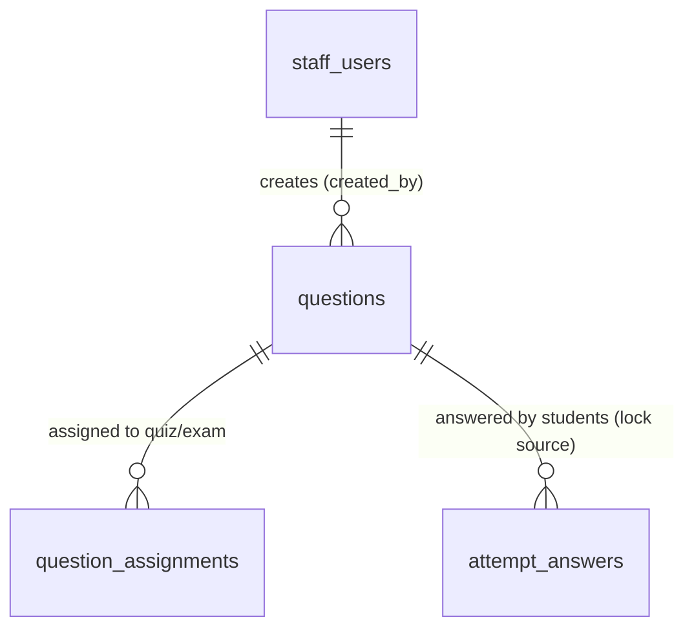

# UC-24 — Quản Lý Ngân Hàng Câu Hỏi (Manage Question Bank)

> **Feature:** `feat-content-management` | **Phiên bản:** 1.0 | **Trạng thái:** Draft
> **Actor chính:** Staff
> **Tham chiếu FR:** FR-24-01 → FR-24-25 (chi tiết hóa từ FR-CONTENT-01..04 trong `feat-content-management/SPEC.md`)
> **Liên quan:** UC-29 (Review/Publish Content — StaffManager), UC-26/UC-28 (Assign Questions)
> **Cập nhật:** 2026-06-12

---

## 1. CONTEXT & GOAL

### 1.1 Bối cảnh

Ngân hàng câu hỏi (`questions`) là nguồn dữ liệu trung tâm cấp dữ liệu cho mọi bài trắc nghiệm (`quiz`) và đề thi thử JLPT (`exam`). Nhân viên soạn thảo (Staff) cần một bộ công cụ nghiệp vụ để **tạo, xem, sửa, tìm kiếm, lọc và gửi duyệt** câu hỏi theo từng kỹ năng (skill) và trình độ (jlpt_level). Vì câu hỏi sau khi xuất bản sẽ ảnh hưởng trực tiếp đến điểm số học viên, quy trình soạn thảo phải tách bạch trạng thái (`draft` → `pending_review` → `published`) và **khóa sửa đổi** đối với câu hỏi đã từng được học viên làm bài.

### 1.2 Mục tiêu

- Cho phép Staff tạo câu hỏi mới ở trạng thái `draft` với đầy đủ metadata (skill, jlpt_level, question_type).
- Cho phép Staff xem danh sách câu hỏi với **tìm kiếm theo từ khóa** và **lọc** theo skill / jlpt_level / question_type / status.
- Cho phép Staff xem chi tiết và cập nhật câu hỏi **khi chưa bị khóa**.
- Cho phép Staff gửi câu hỏi sang `pending_review` để StaffManager duyệt.
- Bảo toàn tính nhất quán dữ liệu lịch sử: câu hỏi đã xuất hiện trong `attempt_answers` **không được sửa trực tiếp**.

### 1.3 Tại sao cần?

Nếu không quản lý tập trung và không khóa câu hỏi đã làm bài → nội dung sai sẽ hiển thị cho học viên, hoặc việc sửa câu hỏi đang được dùng làm **sai lệch điểm số đã chấm** (vi phạm LESSON-005 và Domain Rule §7.1.6). Việc tách trạng thái kiểm duyệt và cấm Staff tự publish (Rule 9) đảm bảo chất lượng nội dung trước khi đến học viên.

---

## 2. ACTOR

| Actor | Role | Điều kiện tiền quyết (Precondition) |
|:---|:---|:---|
| **Staff** | Soạn thảo, tìm kiếm, sửa và gửi duyệt câu hỏi | Đã đăng nhập với JWT hợp lệ role `STAFF`, `status = 'active'` |
| **StaffManager** | (Tham chiếu) Duyệt & xuất bản câu hỏi từ hàng đợi `pending_review` | Ngoài phạm vi UC-24 — xem UC-29 |
| **Hệ thống (System)** | Validate nghiệp vụ, gán trạng thái, ghi audit log | — |

**Postconditions:**

- **Thành công:** Bản ghi `questions` được tạo/cập nhật/chuyển trạng thái; mọi thao tác thay đổi được ghi log (`created_by`, `updated_at`).
- **Thất bại:** Không thay đổi dữ liệu; trả về mã lỗi rõ ràng; giao dịch được rollback.

---

## 3. FUNCTIONAL REQUIREMENTS (EARS)

> **EARS Syntax:** `WHEN [trigger] THE SYSTEM SHALL [behavior]` · `WHILE [state] …` · `IF [condition] THEN THE SYSTEM SHALL [response]` · `THE SYSTEM SHALL [ubiquitous]`

### 3.1 Tạo câu hỏi (Create — POST /api/staff/questions)

| ID | EARS Requirement |
|:---|:---|
| FR-24-01 | WHEN a Staff submits a new question, THE SYSTEM SHALL persist the record with `status = 'draft'` and set `created_by` to the authenticated Staff's `staff_id`. |
| FR-24-02 | THE SYSTEM SHALL require `question_text`, `question_type`, `skill`, and `jlpt_level` to be non-null and non-empty before persisting a question. |
| FR-24-03 | THE SYSTEM SHALL accept `question_type` only within the set {`multiple_choice`, `fill_blank`, `true_false`}. |
| FR-24-04 | THE SYSTEM SHALL accept `skill` only within the set {`vocabulary`, `grammar`, `kanji`, `reading`, `listening`, `mixed`}. |
| FR-24-05 | THE SYSTEM SHALL accept `jlpt_level` only within the set {`N5`, `N4`, `N3`, `N2`, `N1`}. |
| FR-24-06 | IF `question_type = 'multiple_choice'` THEN THE SYSTEM SHALL require `option_a`, `option_b`, `option_c`, `option_d` to be non-empty and `correct_option` to be one of {`A`,`B`,`C`,`D`}. |
| FR-24-07 | IF `question_type = 'true_false'` THEN THE SYSTEM SHALL require `correct_answer_text` to be one of {`true`,`false`} and SHALL ignore option_a..option_d. |
| FR-24-08 | IF `question_type = 'fill_blank'` THEN THE SYSTEM SHALL require `correct_answer_text` to be non-empty and SHALL ignore `correct_option`. |
| FR-24-09 | WHEN a question is created successfully, THE SYSTEM SHALL return HTTP 201 with the new `questionId` and `status = 'draft'`. |

### 3.2 Xem & Tìm kiếm & Lọc (Read/Search/Filter — GET /api/staff/questions)

| ID | EARS Requirement |
|:---|:---|
| FR-24-10 | WHEN a Staff requests the question list, THE SYSTEM SHALL return a paginated result ordered by `updated_at` descending. |
| FR-24-11 | WHEN the query parameter `q` is provided, THE SYSTEM SHALL filter questions whose `question_text` matches `q` (case-insensitive, partial match). |
| FR-24-12 | WHEN any of `skill`, `jlptLevel`, `questionType`, `status` filters are provided, THE SYSTEM SHALL return only questions matching ALL supplied filters (AND semantics). |
| FR-24-13 | THE SYSTEM SHALL exclude questions with `status = 'deleted'` from list results unless explicitly requested via `status=deleted`. |
| FR-24-14 | WHEN a Staff requests a single question by id (GET /api/staff/questions/{questionId}), THE SYSTEM SHALL return its full detail mapped to a Response DTO. |
| FR-24-15 | THE SYSTEM SHALL include a derived `isLocked` flag in the question detail indicating whether the question exists in `attempt_answers`. |

### 3.3 Cập nhật (Update — PUT /api/staff/questions/{questionId})

| ID | EARS Requirement |
|:---|:---|
| FR-24-16 | WHEN a Staff updates an existing question, THE SYSTEM SHALL re-validate all field constraints defined in FR-24-02 through FR-24-08. |
| FR-24-17 | IF the question already appears in `attempt_answers` THEN THE SYSTEM SHALL reject the direct update with HTTP 409 `QUESTION_LOCKED` and SHALL NOT modify the record. |
| FR-24-18 | THE SYSTEM SHALL allow updates only WHILE the question `status` is in {`draft`, `rejected`}; IF `status` is `pending_review`, `published`, or `archived` THEN THE SYSTEM SHALL reject the update with HTTP 409 `INVALID_STATUS_TRANSITION`. |
| FR-24-19 | WHEN a question is updated successfully, THE SYSTEM SHALL refresh `updated_at` to the current server timestamp. |

### 3.4 Gửi duyệt (Submit for Review — POST /api/staff/contents/submit-review)

| ID | EARS Requirement |
|:---|:---|
| FR-24-20 | WHEN a Staff submits a question for review with `contentType = 'question'`, THE SYSTEM SHALL transition `status` from `draft` (or `rejected`) to `pending_review`. |
| FR-24-21 | THE SYSTEM SHALL re-run mandatory-field and type-specific validation (FR-24-02..FR-24-08) before allowing the transition to `pending_review`. |
| FR-24-22 | IF the current `status` is not in {`draft`, `rejected`} THEN THE SYSTEM SHALL reject the submission with HTTP 409 `INVALID_STATUS_TRANSITION`. |
| FR-24-23 | THE SYSTEM SHALL NOT allow a Staff to set `status = 'published'` through any endpoint in this use case (publishing is reserved for StaffManager — UC-29). |
| FR-24-24 | THE SYSTEM SHALL restrict create/update/submit operations to the Staff who owns the question (`created_by = current staff_id`) unless the caller has role `STAFF_MANAGER`. |
| FR-24-25 | THE SYSTEM SHALL log every create/update/status-change action via SLF4J in the format `[INFO] Staff {staffId} {action} question {questionId}`. |

---

## 4. NON-FUNCTIONAL REQUIREMENTS

| ID | Category | Requirement |
|:---|:---|:---|
| NFR-24-01 | Performance | GET danh sách phân trang phải phản hồi < 500ms (p95) với 100,000 câu hỏi; cột lọc (`skill`, `jlpt_level`, `question_type`, `status`) phải có index. |
| NFR-24-02 | Security | Mọi endpoint yêu cầu JWT hợp lệ + role `STAFF`; vi phạm trả 401/403. KHÔNG bypass Spring Security. |
| NFR-24-03 | Data Integrity | Kiểm tra khóa câu hỏi (`isLocked` qua tồn tại trong `attempt_answers`) phải thực hiện ở Service Layer trong cùng transaction với lệnh UPDATE. |
| NFR-24-04 | Architecture | Controller chỉ nhận/trả DTO (`*Request`/`*Response`); KHÔNG trả Entity `questions` trực tiếp (ADR-005). |
| NFR-24-05 | Logging | Dùng SLF4J; KHÔNG `System.out.println`. Ghi `staffId`, `action`, `questionId` cho mọi thao tác ghi. |
| NFR-24-06 | Validation | Sử dụng `@Valid` + Jakarta Bean Validation trên mọi `@RequestBody`; validation nghiệp vụ (enum, ràng buộc theo type) thực hiện ở backend, không tin client. |
| NFR-24-07 | Soft Delete | Xóa câu hỏi dùng `status = 'deleted'`, KHÔNG `DELETE FROM` (ADR-004). |

---

## 5. DATA MODEL

### 5.1 Bảng chính

> Nguồn: `jlpt_database_v2.sql` (Bảng 10 `questions`, Bảng 12 `question_assignments`).

```sql
-- Bảng 10: questions (bảng trọng tâm của UC-24)
CREATE TABLE questions (
    question_id         BIGINT IDENTITY(1,1) PRIMARY KEY,
    question_text       NVARCHAR(MAX)  NOT NULL,
    question_type       NVARCHAR(30)   NOT NULL
        CHECK (question_type IN ('multiple_choice','fill_blank','true_false')),
    skill               NVARCHAR(30)   NOT NULL
        CHECK (skill IN ('vocabulary','grammar','kanji','reading','listening','mixed')),
    jlpt_level          NVARCHAR(5)    NOT NULL
        CHECK (jlpt_level IN ('N5','N4','N3','N2','N1')),
    explanation         NVARCHAR(MAX)  NULL,
    audio_url           NVARCHAR(500)  NULL,
    image_url           NVARCHAR(500)  NULL,
    option_a            NVARCHAR(MAX)  NULL,
    option_b            NVARCHAR(MAX)  NULL,
    option_c            NVARCHAR(MAX)  NULL,
    option_d            NVARCHAR(MAX)  NULL,
    correct_option      CHAR(1)        NULL CHECK (correct_option IN ('A','B','C','D')),
    correct_answer_text NVARCHAR(MAX)  NULL,
    created_by          BIGINT         NULL,
    status              NVARCHAR(20)   NOT NULL DEFAULT 'draft'
        CHECK (status IN ('draft','pending_review','rejected','published','archived','deleted')),
    approved_by         BIGINT         NULL,
    published_at        DATETIME2      NULL,
    created_at          DATETIME2      NOT NULL DEFAULT SYSUTCDATETIME(),
    updated_at          DATETIME2      NOT NULL DEFAULT SYSUTCDATETIME(),
    CONSTRAINT FK_questions_creator  FOREIGN KEY (created_by)  REFERENCES staff_users(staff_id),
    CONSTRAINT FK_questions_approver FOREIGN KEY (approved_by) REFERENCES staff_users(staff_id)
);

-- Index hỗ trợ tìm kiếm & lọc (NFR-24-01)
CREATE INDEX IX_questions_filter ON questions (status, jlpt_level, skill, question_type);
```

**Bảng phụ thuộc (chỉ đọc trong UC-24):**

- `attempt_answers` — dùng để xác định `isLocked`: nếu tồn tại bản ghi với `question_id` tương ứng ⇒ câu hỏi đã được học viên làm ⇒ khóa sửa (Rule 7).
- `question_assignments` — liên kết câu hỏi vào `quiz`/`exam` (thuộc UC-26/UC-28, chỉ tham chiếu).
- `staff_users` — chủ sở hữu câu hỏi (`created_by`), kiểm tra quyền (FR-24-24).

### 5.2 Quan hệ



### 5.3 Vòng đời trạng thái (State machine — phạm vi Staff)

```
            create                submit-review              (UC-29)
   ─────►  draft  ───────────────►  pending_review  ──────────────►  published
             ▲                          │  reject
   update    │                          ▼
   (allowed) └──────────────────────  rejected  ──► (update / re-submit)

   * Staff KHÔNG được chuyển sang published (FR-24-23).
   * update chỉ hợp lệ khi status ∈ {draft, rejected} VÀ chưa bị khóa (FR-24-17/18).
```

---

## 6. API SPEC

> Tất cả endpoint: **Auth = Bearer JWT (role STAFF)**. Định dạng response chuẩn `{ status, message, data }` (AGENTS.md §6).

### 6.1 `POST /api/staff/questions` — Tạo câu hỏi

**Request (multiple_choice):**

```json
{
  "questionText": "N5 Kanji: '水' đọc là gì?",
  "questionType": "multiple_choice",
  "skill": "kanji",
  "jlptLevel": "N5",
  "optionA": "mizu",
  "optionB": "kawa",
  "optionC": "yama",
  "optionD": "ki",
  "correctOption": "A",
  "explanation": "'水' nghĩa là nước, đọc là mizu."
}
```

**Response (201 Created):**

```json
{
  "status": 201,
  "message": "Tạo câu hỏi thành công",
  "data": { "questionId": 105, "status": "draft", "createdAt": "2026-06-12T09:00:00Z" }
}
```

### 6.2 `GET /api/staff/questions` — Danh sách / Tìm kiếm / Lọc

**Query params:**

| Param | Kiểu | Bắt buộc | Mô tả |
|:---|:---|:---:|:---|
| `q` | string | Không | Từ khóa tìm trong `question_text` (LIKE, không phân biệt hoa thường) |
| `skill` | enum | Không | `vocabulary\|grammar\|kanji\|reading\|listening\|mixed` |
| `jlptLevel` | enum | Không | `N5\|N4\|N3\|N2\|N1` |
| `questionType` | enum | Không | `multiple_choice\|fill_blank\|true_false` |
| `status` | enum | Không | `draft\|pending_review\|rejected\|published\|archived\|deleted` |
| `page` | int | Không | Mặc định 0 |
| `size` | int | Không | Mặc định 20, tối đa 100 |

**Response (200):**

```json
{
  "status": 200,
  "message": "OK",
  "data": {
    "content": [
      {
        "questionId": 105,
        "questionText": "N5 Kanji: '水' đọc là gì?",
        "questionType": "multiple_choice",
        "skill": "kanji",
        "jlptLevel": "N5",
        "status": "draft",
        "isLocked": false,
        "updatedAt": "2026-06-12T09:00:00Z"
      }
    ],
    "totalElements": 342,
    "totalPages": 18
  }
}
```

### 6.3 `GET /api/staff/questions/{questionId}` — Chi tiết câu hỏi

**Response (200):**

```json
{
  "status": 200,
  "message": "OK",
  "data": {
    "questionId": 105,
    "questionText": "N5 Kanji: '水' đọc là gì?",
    "questionType": "multiple_choice",
    "skill": "kanji",
    "jlptLevel": "N5",
    "optionA": "mizu", "optionB": "kawa", "optionC": "yama", "optionD": "ki",
    "correctOption": "A",
    "correctAnswerText": null,
    "explanation": "'水' nghĩa là nước, đọc là mizu.",
    "status": "draft",
    "isLocked": false,
    "createdBy": 5,
    "createdAt": "2026-06-12T09:00:00Z",
    "updatedAt": "2026-06-12T09:00:00Z"
  }
}
```

### 6.4 `PUT /api/staff/questions/{questionId}` — Cập nhật câu hỏi

**Request:**

```json
{
  "questionText": "N5 Kanji: '水' (Water) đọc là gì?",
  "questionType": "multiple_choice",
  "skill": "kanji",
  "jlptLevel": "N5",
  "optionA": "mizu", "optionB": "kawa", "optionC": "yama", "optionD": "ki",
  "correctOption": "A"
}
```

**Response (200):**

```json
{
  "status": 200,
  "message": "Cập nhật câu hỏi thành công",
  "data": { "questionId": 105, "status": "draft", "updatedAt": "2026-06-12T10:15:00Z" }
}
```

### 6.5 `POST /api/staff/contents/submit-review` — Gửi duyệt

**Request:**

```json
{ "contentType": "question", "contentId": 105 }
```

**Response (200):**

```json
{
  "status": 200,
  "message": "Đã gửi câu hỏi để phê duyệt",
  "data": { "contentId": 105, "contentType": "question", "status": "pending_review" }
}
```

---

## 7. ERROR HANDLING

| HTTP | Error Code | Message | Trigger |
|:---:|:---|:---|:---|
| 400 | `VALIDATION_FAILED` | "Thiếu trường bắt buộc: {field}" | Thiếu `question_text`/`question_type`/`skill`/`jlpt_level` (FR-24-02) |
| 400 | `INVALID_QUESTION_TYPE` | "question_type không hợp lệ" | Ngoài {multiple_choice, fill_blank, true_false} (FR-24-03) |
| 400 | `INVALID_SKILL` | "skill không hợp lệ" | Ngoài tập skill cho phép (FR-24-04) |
| 400 | `INVALID_JLPT_LEVEL` | "Cấp độ JLPT phải là N5 đến N1" | Ngoài {N5..N1} (FR-24-05) |
| 400 | `MISSING_OPTIONS` | "Câu trắc nghiệm phải có đủ 4 đáp án A/B/C/D và correct_option" | multiple_choice thiếu option/correct_option (FR-24-06) |
| 401 | `UNAUTHORIZED` | "Yêu cầu đăng nhập" | JWT thiếu hoặc hết hạn |
| 403 | `FORBIDDEN` | "Không có quyền thao tác câu hỏi này" | Không phải chủ sở hữu (FR-24-24) hoặc role ≠ STAFF |
| 403 | `PUBLISH_NOT_ALLOWED` | "Staff không được tự xuất bản câu hỏi" | Cố gắng đặt status=published (FR-24-23) |
| 404 | `QUESTION_NOT_FOUND` | "Không tìm thấy câu hỏi" | `questionId` không tồn tại hoặc đã `deleted` |
| 409 | `QUESTION_LOCKED` | "Câu hỏi đã được học viên làm, không thể sửa trực tiếp" | Tồn tại trong `attempt_answers` (FR-24-17, Rule 7) |
| 409 | `INVALID_STATUS_TRANSITION` | "Không thể thực hiện thao tác ở trạng thái hiện tại" | Update/submit khi status ∉ {draft, rejected} (FR-24-18/22) |
| 500 | `INTERNAL_ERROR` | "Internal server error" | Lỗi hệ thống / CSDL |

---

## 8. ACCEPTANCE CRITERIA

| ID | Scenario | Given | When | Then |
|:---|:---|:---|:---|:---|
| AC-24-01 | Tạo câu hỏi nháp thành công | Dữ liệu multiple_choice hợp lệ | POST /api/staff/questions | HTTP 201; bản ghi `questions` với `status='draft'`, `created_by` = staff hiện tại |
| AC-24-02 | Thiếu trường bắt buộc | Body không có `skill` | POST /api/staff/questions | HTTP 400 `VALIDATION_FAILED`; không tạo bản ghi |
| AC-24-03 | Trắc nghiệm thiếu đáp án | `questionType=multiple_choice`, thiếu `optionD` | POST /api/staff/questions | HTTP 400 `MISSING_OPTIONS`; rollback |
| AC-24-04 | Enum không hợp lệ | `jlptLevel='N6'` | POST /api/staff/questions | HTTP 400 `INVALID_JLPT_LEVEL` |
| AC-24-05 | Lọc theo skill + level | 342 câu hỏi, 40 câu `kanji` N5 | GET ?skill=kanji&jlptLevel=N5 | HTTP 200; chỉ trả câu `kanji` N5, phân trang đúng |
| AC-24-06 | Tìm kiếm theo từ khóa | Có câu chứa "水" | GET ?q=水 | HTTP 200; kết quả chứa câu có "水" trong `question_text` |
| AC-24-07 | Xem chi tiết kèm cờ khóa | Câu hỏi 105 đã có trong `attempt_answers` | GET /api/staff/questions/105 | HTTP 200; `isLocked = true` |
| AC-24-08 | Cập nhật câu hỏi draft | Câu 105 `status=draft`, chưa làm bài | PUT /api/staff/questions/105 | HTTP 200; `updated_at` được làm mới |
| AC-24-09 | Chặn sửa câu đã làm bài | Câu 200 tồn tại trong `attempt_answers` | PUT /api/staff/questions/200 | HTTP 409 `QUESTION_LOCKED`; không thay đổi dữ liệu |
| AC-24-10 | Chặn sửa khi đã gửi duyệt | Câu 105 `status=pending_review` | PUT /api/staff/questions/105 | HTTP 409 `INVALID_STATUS_TRANSITION` |
| AC-24-11 | Gửi duyệt thành công | Câu 105 `status=draft`, dữ liệu đủ | POST /api/staff/contents/submit-review | HTTP 200; `status='pending_review'` |
| AC-24-12 | Chặn Staff tự publish | Bất kỳ payload cố đặt `status=published` | PUT/submit | HTTP 403 `PUBLISH_NOT_ALLOWED`; status không đổi |
| AC-24-13 | Không phải chủ sở hữu | Câu 105 do Staff A tạo, Staff B gọi | PUT /api/staff/questions/105 | HTTP 403 `FORBIDDEN` |

---

## 9. OUT OF SCOPE

- ❌ **Xuất bản (publish) câu hỏi** — thuộc StaffManager / UC-29 (Content Review). Staff chỉ gửi `pending_review`.
- ❌ **Gán câu hỏi vào quiz/exam** (`question_assignments`) — thuộc UC-26 / UC-28.
- ❌ **Versioning câu hỏi đã khóa** (tạo phiên bản mới khi câu hỏi đã làm bài) — Phase 2; UC-24 chỉ chặn sửa và báo lỗi `QUESTION_LOCKED`.
- ❌ **Import hàng loạt** câu hỏi từ PDF/Docx/Excel — Phase 2.
- ❌ **Upload file audio/image** cho câu hỏi listening — xử lý qua module File Upload (chỉ lưu URL, ADR-006), không nằm trong các endpoint UC-24.
- ❌ **Xóa cứng (hard delete)** — chỉ soft delete bằng `status='deleted'` (ngoài 5 API liệt kê, không mô tả ở đây).
