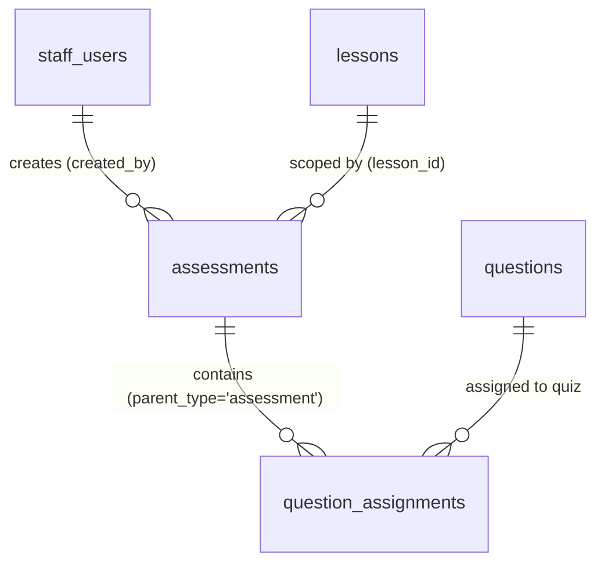

# UC-26 — Quản Lý Bài Trắc Nghiệm (Manage Quiz)

> **Feature:** `feat-content-management` | **Phiên bản:** 1.0 | **Trạng thái:** Draft
> **Actor chính:** Staff
> **Tham chiếu FR:** FR-26-01 → FR-26-28 (chi tiết hóa từ FR-CONTENT-10..13 trong `feat-content-management/SPEC.md`)
> **Liên quan:** UC-24 (Manage Question Bank — nguồn câu hỏi), UC-28 (Manage JLPT Mock Exams — cùng bảng `assessments`), UC-29 (Review/Publish Content — StaffManager), UC-11 (Student làm Quiz — `feat-assessment`)
> **Cập nhật:** 2026-06-12

---

## 1. CONTEXT & GOAL

### 1.1 Bối cảnh
Bài trắc nghiệm (`quiz`) là hình thức đánh giá ngắn, gắn với một bài học (`lesson`) hoặc một chủ đề (`topic`), giúp học viên tự kiểm tra kiến thức ngay sau khi học. Trong mô hình dữ liệu, quiz và đề thi thử JLPT (`exam`) dùng chung bảng `assessments`, phân biệt bằng `assessment_type`. Một quiz **không tự chứa câu hỏi** mà **tham chiếu** đến các câu hỏi có sẵn trong Ngân hàng câu hỏi (`questions`, xem UC-24) thông qua bảng nối `question_assignments`.

Nhân viên soạn thảo (Staff) cần quy trình nghiệp vụ để: (1) tạo khung quiz (`assessment_type = 'quiz'`) ở trạng thái nháp, (2) chọn và gán câu hỏi từ ngân hàng vào quiz kèm thứ tự hiển thị (`display_order`) và điểm từng câu (`score`), và (3) gửi quiz sang hàng đợi kiểm duyệt (`pending_review`). Vì điểm quiz ảnh hưởng trực tiếp đến tiến trình học viên, hệ thống phải bảo đảm **tổng điểm các câu hỏi gán vào bằng `total_score`** trước khi cho gửi duyệt, và **khóa danh sách câu hỏi** đối với quiz đã xuất bản.

### 1.2 Mục tiêu
- Cho phép Staff tạo quiz mới với `assessment_type = 'quiz'`, `status = 'draft'` và đầy đủ metadata (`title`, `lesson_id`/`topic`, `jlpt_level`, `duration_min`, `pass_score`, `total_score`).
- Cho phép Staff xem danh sách / chi tiết quiz của mình và cập nhật metadata khi chưa xuất bản.
- Cho phép Staff gán câu hỏi từ ngân hàng vào quiz, lưu `display_order` và `score` cho từng câu.
- Đảm bảo bất biến nghiệp vụ: **Σ `question_assignments.score` = `assessments.total_score`** mới được gửi duyệt.
- Cho phép Staff gửi quiz sang `pending_review`; **không** cho Staff tự `publish`.
- Khóa thay đổi danh sách câu hỏi của quiz đã `published` để bảo toàn tính nhất quán điểm số lịch sử.

### 1.3 Tại sao cần?
Nếu tổng điểm câu hỏi không khớp `total_score` → thang điểm quiz sai lệch, điểm học viên không phản ánh đúng kết quả (vi phạm Domain Rule §7.1 và Forbidden Pattern #4). Nếu sửa danh sách câu hỏi của quiz đã có người làm → điểm đã chấm trở nên vô nghĩa (LESSON-005, FR-CONTENT-13). Tách trạng thái kiểm duyệt và cấm Staff tự publish (Rule 9) bảo đảm chất lượng nội dung trước khi đến học viên.

---

## 2. ACTOR

| Actor | Role | Điều kiện tiền quyết (Precondition) |
|:---|:---|:---|
| **Staff** | Tạo quiz, gán câu hỏi, sửa metadata và gửi duyệt | Đã đăng nhập với JWT hợp lệ role `STAFF`, `status = 'active'` |
| **StaffManager** | (Tham chiếu) Duyệt & xuất bản quiz từ hàng đợi `pending_review` | Ngoài phạm vi UC-26 — xem UC-29 |
| **Hệ thống (System)** | Validate nghiệp vụ, gán trạng thái, kiểm tra bất biến tổng điểm, ghi audit log | — |

**Postconditions:**
- **Thành công:** Bản ghi `assessments` (type=quiz) được tạo/cập nhật/chuyển trạng thái; các bản ghi `question_assignments` được tạo/thay thế đúng; mọi thao tác được ghi log (`created_by`, `updated_at`).
- **Thất bại:** Không thay đổi dữ liệu; trả về mã lỗi rõ ràng; giao dịch được rollback toàn bộ.

---

## 3. FUNCTIONAL REQUIREMENTS (EARS)

> **EARS Syntax:** `WHEN [trigger] THE SYSTEM SHALL [behavior]` · `WHILE [state] …` · `IF [condition] THEN THE SYSTEM SHALL [response]` · `THE SYSTEM SHALL [ubiquitous]`

### 3.1 Tạo Quiz (Create — POST /api/staff/assessments)

| ID | EARS Requirement |
|:---|:---|
| FR-26-01 | WHEN a Staff submits a new quiz, THE SYSTEM SHALL persist an `assessments` record with `assessment_type = 'quiz'`, `status = 'draft'`, and set `created_by` to the authenticated Staff's `staff_id`. |
| FR-26-02 | THE SYSTEM SHALL require `title`, `jlpt_level`, `duration_min`, `pass_score`, and `total_score` to be non-null before persisting a quiz. |
| FR-26-03 | THE SYSTEM SHALL require at least one of `lesson_id` or `topic` to be provided; IF both are null THEN THE SYSTEM SHALL reject the request with HTTP 400 `VALIDATION_FAILED`. |
| FR-26-04 | THE SYSTEM SHALL accept `jlpt_level` only within the set {`N5`, `N4`, `N3`, `N2`, `N1`}. |
| FR-26-05 | THE SYSTEM SHALL require `duration_min > 0`, `total_score > 0`, and `0 <= pass_score <= total_score`; IF violated THEN THE SYSTEM SHALL reject with HTTP 400 `VALIDATION_FAILED`. |
| FR-26-06 | IF `lesson_id` is provided THEN THE SYSTEM SHALL verify the referenced `lessons` record exists and is not `deleted`; otherwise THE SYSTEM SHALL reject with HTTP 404 `LESSON_NOT_FOUND`. |
| FR-26-07 | THE SYSTEM SHALL force `assessment_type = 'quiz'` for this endpoint regardless of any client-supplied value, and SHALL ignore any client-supplied `status`, `approved_by`, or `published_at`. |
| FR-26-08 | WHEN a quiz is created successfully, THE SYSTEM SHALL return HTTP 201 with the new `assessmentId` and `status = 'draft'`. |

### 3.2 Xem & Lọc Quiz (Read/List — GET /api/staff/assessments, GET /api/staff/assessments/{id})

| ID | EARS Requirement |
|:---|:---|
| FR-26-10 | WHEN a Staff requests the assessment list, THE SYSTEM SHALL return a paginated result of `assessment_type = 'quiz'` records ordered by `updated_at` descending. |
| FR-26-11 | WHEN any of `jlptLevel`, `status`, `lessonId` filters are provided, THE SYSTEM SHALL return only quizzes matching ALL supplied filters (AND semantics). |
| FR-26-12 | THE SYSTEM SHALL exclude quizzes with `status = 'deleted'` from list results unless explicitly requested via `status=deleted`. |
| FR-26-13 | WHEN a Staff requests a single quiz by id, THE SYSTEM SHALL return its full detail including the ordered list of assigned questions (from `question_assignments`, sorted by `display_order`) with each question's `score`. |
| FR-26-14 | THE SYSTEM SHALL include in the quiz detail a derived `assignedScoreSum` (Σ of `question_assignments.score`) and a boolean `scoreMatched` (`assignedScoreSum == total_score`) to support the submit-review gate. |

### 3.3 Cập nhật metadata Quiz (Update — PUT /api/staff/assessments/{id})

| ID | EARS Requirement |
|:---|:---|
| FR-26-15 | WHEN a Staff updates an existing quiz, THE SYSTEM SHALL re-validate all field constraints defined in FR-26-02 through FR-26-06. |
| FR-26-16 | THE SYSTEM SHALL allow metadata updates only WHILE the quiz `status` is in {`draft`, `rejected`}; IF `status` is `pending_review`, `published`, or `archived` THEN THE SYSTEM SHALL reject the update with HTTP 409 `INVALID_STATUS_TRANSITION`. |
| FR-26-17 | THE SYSTEM SHALL NOT allow `assessment_type` to be changed from `quiz` to any other value through this endpoint. |
| FR-26-18 | WHEN a quiz is updated successfully, THE SYSTEM SHALL refresh `updated_at` to the current server timestamp. |

### 3.4 Gán câu hỏi vào Quiz (Assign — POST /api/staff/assessments/{id}/assign-questions)

| ID | EARS Requirement |
|:---|:---|
| FR-26-19 | WHEN a Staff assigns questions to a quiz, THE SYSTEM SHALL create `question_assignments` rows with `parent_type = 'assessment'`, `parent_id = assessmentId`, and for each item the supplied `question_id`, `display_order`, and `score`. |
| FR-26-20 | THE SYSTEM SHALL require each assignment item to provide `questionId`, `displayOrder`, and `score`, with `score > 0` and `displayOrder >= 0`; IF violated THEN THE SYSTEM SHALL reject with HTTP 400 `VALIDATION_FAILED` and rollback the whole batch. |
| FR-26-21 | THE SYSTEM SHALL verify every referenced `question_id` exists, is not `deleted`, and has `status = 'published'`; IF any question is invalid THEN THE SYSTEM SHALL reject with HTTP 404 `QUESTION_NOT_FOUND` (or 422 `QUESTION_NOT_PUBLISHED`) and rollback. |
| FR-26-22 | THE SYSTEM SHALL enforce uniqueness of `(parent_type, parent_id, question_id)`; IF the same question is assigned twice THEN THE SYSTEM SHALL reject with HTTP 409 `DUPLICATE_ASSIGNMENT`. |
| FR-26-23 | THE SYSTEM SHALL treat the assign-questions call as the full desired set for the quiz (replace semantics): existing assignments for the quiz are removed and replaced by the supplied set, within a single transaction. |
| FR-26-24 | WHILE a quiz `status = 'published'`, THE SYSTEM SHALL block any change to its `question_assignments` and SHALL reject with HTTP 409 `ASSESSMENT_PUBLISHED`. |
| FR-26-25 | THE SYSTEM SHALL allow assigning questions only WHILE the quiz `status` is in {`draft`, `rejected`}; otherwise THE SYSTEM SHALL reject with HTTP 409 `INVALID_STATUS_TRANSITION`. |

### 3.5 Gửi duyệt Quiz (Submit for Review — POST /api/staff/contents/submit-review)

| ID | EARS Requirement |
|:---|:---|
| FR-26-26 | WHEN a Staff submits a quiz for review with `contentType = 'assessment'`, THE SYSTEM SHALL verify that Σ `question_assignments.score` equals `assessments.total_score`; IF the sums differ THEN THE SYSTEM SHALL reject with HTTP 422 `SCORE_MISMATCH` and SHALL NOT change the status. |
| FR-26-27 | WHEN the score invariant (FR-26-26) holds AND the current `status` is in {`draft`, `rejected`}, THE SYSTEM SHALL transition `status` to `pending_review`; otherwise THE SYSTEM SHALL reject with HTTP 409 `INVALID_STATUS_TRANSITION`. |
| FR-26-28 | THE SYSTEM SHALL also require the quiz to have at least one assigned question before allowing the transition to `pending_review`; IF none exist THEN THE SYSTEM SHALL reject with HTTP 422 `EMPTY_QUIZ`. |

### 3.6 Quy tắc chung (Ubiquitous)

| ID | EARS Requirement |
|:---|:---|
| FR-26-30 | THE SYSTEM SHALL NOT allow a Staff to set `status = 'published'` through any endpoint in this use case (publishing is reserved for StaffManager — UC-29). |
| FR-26-31 | THE SYSTEM SHALL restrict create/update/assign/submit operations to the Staff who owns the quiz (`created_by = current staff_id`) unless the caller has role `STAFF_MANAGER`. |
| FR-26-32 | THE SYSTEM SHALL log every create/update/assign/status-change action via SLF4J in the format `[INFO] Staff {staffId} {action} assessment {assessmentId}`. |
| FR-26-33 | THE SYSTEM SHALL perform soft delete only (`status = 'deleted'`) and SHALL NOT execute physical `DELETE FROM assessments` (ADR-004). |

---

## 4. NON-FUNCTIONAL REQUIREMENTS

| ID | Category | Requirement |
|:---|:---|:---|
| NFR-26-01 | Performance | GET danh sách quiz phân trang phải phản hồi < 500ms (p95); cột lọc (`assessment_type`, `status`, `jlpt_level`, `lesson_id`) phải có index. |
| NFR-26-02 | Security | Mọi endpoint yêu cầu JWT hợp lệ + role `STAFF`; vi phạm trả 401/403. KHÔNG bypass Spring Security. |
| NFR-26-03 | Data Integrity | Kiểm tra bất biến tổng điểm (Σ score = total_score) và kiểm tra khóa (`status = published`) phải thực hiện ở Service Layer, trong cùng transaction với lệnh ghi `question_assignments`. |
| NFR-26-04 | Atomicity | Thao tác assign-questions phải nguyên tử: hoặc tất cả gán thành công, hoặc rollback toàn bộ (`@Transactional` tại Service). |
| NFR-26-05 | Architecture | Controller chỉ nhận/trả DTO (`*Request`/`*Response`); KHÔNG trả Entity `assessments`/`question_assignments` trực tiếp (ADR-005). |
| NFR-26-06 | Validation | Sử dụng `@Valid` + Jakarta Bean Validation trên mọi `@RequestBody`; validation nghiệp vụ (enum, range, tổng điểm) thực hiện ở backend, không tin client. |
| NFR-26-07 | Logging | Dùng SLF4J; KHÔNG `System.out.println`. Ghi `staffId`, `action`, `assessmentId` cho mọi thao tác ghi. |
| NFR-26-08 | Concurrency | Khi nhiều Staff cùng sửa, thao tác replace assignments phải dùng khóa lạc quan/giao dịch tuần tự để tránh ghi đè mất dữ liệu. |

---

## 5. DATA MODEL

### 5.1 Bảng chính

> Nguồn: `jlpt_database_v2.sql` (Bảng 11 `assessments`, Bảng 12 `question_assignments`, Bảng 10 `questions`, Bảng 6 `lessons`).

```sql
-- Bảng 11: assessments (bảng trọng tâm của UC-26, lọc assessment_type = 'quiz')
CREATE TABLE assessments (
    assessment_id   BIGINT IDENTITY(1,1) PRIMARY KEY,
    assessment_type NVARCHAR(20)    NOT NULL
        CHECK (assessment_type IN ('quiz','exam')),
    title           NVARCHAR(255)   NOT NULL,
    lesson_id       BIGINT          NULL,   -- FK → lessons (lesson_id HOẶC topic)
    topic           NVARCHAR(100)   NULL,
    jlpt_level      NVARCHAR(5)     NULL
        CHECK (jlpt_level IN ('N5','N4','N3','N2','N1')),
    duration_min    INT             NULL,
    pass_score      INT             NULL,
    total_score     INT             NULL,
    audio_url       NVARCHAR(500)   NULL,
    status          NVARCHAR(20)    NOT NULL DEFAULT 'draft'
        CHECK (status IN ('draft','pending_review','rejected','published','archived','deleted')),
    created_by      BIGINT          NULL,   -- FK → staff_users
    approved_by     BIGINT          NULL,   -- FK → staff_users
    published_at    DATETIME2       NULL,
    created_at      DATETIME2       NOT NULL DEFAULT SYSUTCDATETIME(),
    updated_at      DATETIME2       NOT NULL DEFAULT SYSUTCDATETIME(),
    CONSTRAINT FK_assessments_lesson   FOREIGN KEY (lesson_id)   REFERENCES lessons(lesson_id),
    CONSTRAINT FK_assessments_creator  FOREIGN KEY (created_by)  REFERENCES staff_users(staff_id),
    CONSTRAINT FK_assessments_approver FOREIGN KEY (approved_by) REFERENCES staff_users(staff_id)
);

-- Bảng 12: question_assignments (liên kết câu hỏi vào quiz)
CREATE TABLE question_assignments (
    assignment_id   BIGINT IDENTITY(1,1) PRIMARY KEY,
    parent_type     NVARCHAR(30)    NOT NULL
        CHECK (parent_type IN ('assessment','lesson')),
    parent_id       BIGINT          NOT NULL,  -- = assessment_id khi parent_type='assessment'
    question_id     BIGINT          NOT NULL,  -- FK → questions
    section_name    NVARCHAR(100)   NULL,      -- không bắt buộc cho quiz (dùng cho exam)
    score           DECIMAL(6,2)    NOT NULL DEFAULT 1,   -- điểm câu hỏi trong quiz (Rule 5)
    display_order   INT             NOT NULL DEFAULT 0,   -- thứ tự hiển thị (Rule 5)
    CONSTRAINT FK_assign_question FOREIGN KEY (question_id) REFERENCES questions(question_id) ON DELETE CASCADE,
    CONSTRAINT UQ_assign UNIQUE (parent_type, parent_id, question_id)  -- chống trùng (FR-26-22)
);

-- Index hỗ trợ lọc danh sách quiz (NFR-26-01)
CREATE INDEX IX_assessments_filter ON assessments (assessment_type, status, jlpt_level, lesson_id);
-- Index hỗ trợ tổng hợp điểm theo quiz (NFR-26-03)
CREATE INDEX IX_assign_parent ON question_assignments (parent_type, parent_id);
```

**Bảng phụ thuộc (chỉ đọc trong UC-26):**
- `questions` — nguồn câu hỏi để gán; chỉ câu hỏi `status = 'published'` mới được gán (FR-26-21). Soạn thảo câu hỏi thuộc UC-24.
- `lessons` — gắn quiz vào bài học (`lesson_id`); kiểm tra tồn tại (FR-26-06).
- `staff_users` — chủ sở hữu quiz (`created_by`), kiểm tra quyền (FR-26-31).

### 5.2 Quan hệ



### 5.3 Bất biến nghiệp vụ (Invariant)

```
Σ ( question_assignments.score
    WHERE parent_type = 'assessment' AND parent_id = :quizId )
  == assessments.total_score   (:quizId)      ← BẮT BUỘC trước khi gửi duyệt (Rule 6, 7 / FR-26-26)
```

### 5.4 Vòng đời trạng thái (State machine — phạm vi Staff)

```
            create                 assign-questions      submit-review            (UC-29)
   ─────►  draft  ──────────────►  (Σscore=total)  ──────────────────►  pending_review  ──────►  published
             ▲                                                              │  reject
   update/   │                                                              ▼
   assign    └──────────────────────────────────────────────────────  rejected  ──► (update/assign/re-submit)

   * Staff KHÔNG được chuyển sang published (FR-26-30).
   * update/assign chỉ hợp lệ khi status ∈ {draft, rejected} (FR-26-16/25).
   * published → khóa danh sách câu hỏi (FR-26-24).
```

---

## 6. API SPEC

> Tất cả endpoint: **Auth = Bearer JWT (role STAFF)**. Định dạng response chuẩn `{ status, message, data }` (AGENTS.md §6).

### 6.1 `POST /api/staff/assessments` — Tạo quiz

**Request:**
```json
{
  "assessmentType": "quiz",
  "title": "Trắc nghiệm Kanji N5 bài 2",
  "lessonId": 3,
  "topic": "Kanji",
  "jlptLevel": "N5",
  "durationMin": 15,
  "passScore": 5,
  "totalScore": 10
}
```

**Response (201 Created):**
```json
{
  "status": 201,
  "message": "Tạo bài trắc nghiệm thành công",
  "data": { "assessmentId": 24, "assessmentType": "quiz", "status": "draft", "createdAt": "2026-06-12T09:00:00Z" }
}
```

### 6.2 `GET /api/staff/assessments` — Danh sách / Lọc quiz

**Query params:**

| Param | Kiểu | Bắt buộc | Mô tả |
|:---|:---|:---:|:---|
| `jlptLevel` | enum | Không | `N5\|N4\|N3\|N2\|N1` |
| `status` | enum | Không | `draft\|pending_review\|rejected\|published\|archived\|deleted` |
| `lessonId` | long | Không | Lọc quiz theo bài học |
| `page` | int | Không | Mặc định 0 |
| `size` | int | Không | Mặc định 20, tối đa 100 |

> Endpoint này chỉ trả `assessment_type = 'quiz'`.

**Response (200):**
```json
{
  "status": 200,
  "message": "OK",
  "data": {
    "content": [
      {
        "assessmentId": 24,
        "title": "Trắc nghiệm Kanji N5 bài 2",
        "assessmentType": "quiz",
        "jlptLevel": "N5",
        "lessonId": 3,
        "topic": "Kanji",
        "durationMin": 15,
        "passScore": 5,
        "totalScore": 10,
        "questionCount": 10,
        "status": "draft",
        "updatedAt": "2026-06-12T09:00:00Z"
      }
    ],
    "totalElements": 12,
    "totalPages": 1
  }
}
```

### 6.3 `GET /api/staff/assessments/{assessmentId}` — Chi tiết quiz

**Response (200):**
```json
{
  "status": 200,
  "message": "OK",
  "data": {
    "assessmentId": 24,
    "assessmentType": "quiz",
    "title": "Trắc nghiệm Kanji N5 bài 2",
    "lessonId": 3,
    "topic": "Kanji",
    "jlptLevel": "N5",
    "durationMin": 15,
    "passScore": 5,
    "totalScore": 10,
    "status": "draft",
    "assignedScoreSum": 10.0,
    "scoreMatched": true,
    "questions": [
      { "assignmentId": 51, "questionId": 105, "displayOrder": 1, "score": 1.0, "questionText": "N5 Kanji: '水' đọc là gì?" }
    ],
    "createdBy": 5,
    "createdAt": "2026-06-12T09:00:00Z",
    "updatedAt": "2026-06-12T09:00:00Z"
  }
}
```

### 6.4 `PUT /api/staff/assessments/{assessmentId}` — Cập nhật metadata quiz

**Request:**
```json
{
  "title": "Trắc nghiệm Kanji N5 bài 2 (cập nhật)",
  "lessonId": 3,
  "topic": "Kanji cơ bản",
  "jlptLevel": "N5",
  "durationMin": 20,
  "passScore": 6,
  "totalScore": 10
}
```

**Response (200):**
```json
{
  "status": 200,
  "message": "Cập nhật bài trắc nghiệm thành công",
  "data": { "assessmentId": 24, "status": "draft", "updatedAt": "2026-06-12T10:15:00Z" }
}
```

### 6.5 `POST /api/staff/assessments/{assessmentId}/assign-questions` — Gán câu hỏi

> Replace semantics (FR-26-23): tập gửi lên là tập đầy đủ mong muốn của quiz.

**Request:**
```json
{
  "assignments": [
    { "questionId": 105, "displayOrder": 1, "score": 1.0, "sectionName": null },
    { "questionId": 106, "displayOrder": 2, "score": 1.0, "sectionName": null }
  ]
}
```

**Response (200):**
```json
{
  "status": 200,
  "message": "Gán câu hỏi vào bài trắc nghiệm thành công",
  "data": { "assessmentId": 24, "assignedCount": 2, "assignedScoreSum": 2.0, "totalScore": 10, "scoreMatched": false }
}
```

### 6.6 `POST /api/staff/contents/submit-review` — Gửi duyệt quiz

**Request:**
```json
{ "contentType": "assessment", "contentId": 24 }
```

**Response (200):**
```json
{
  "status": 200,
  "message": "Đã gửi bài trắc nghiệm để phê duyệt",
  "data": { "contentId": 24, "contentType": "assessment", "status": "pending_review" }
}
```

---

## 7. ERROR HANDLING

| HTTP | Error Code | Message | Trigger |
|:---:|:---|:---|:---|
| 400 | `VALIDATION_FAILED` | "Thiếu trường bắt buộc hoặc giá trị không hợp lệ" | Thiếu `title`/`jlpt_level`/`duration_min`/`pass_score`/`total_score`, thiếu cả `lesson_id` lẫn `topic`, hoặc range sai (FR-26-02/03/05/20) |
| 400 | `INVALID_JLPT_LEVEL` | "Cấp độ JLPT phải là N5 đến N1" | `jlptLevel` ngoài {N5..N1} (FR-26-04) |
| 401 | `UNAUTHORIZED` | "Yêu cầu đăng nhập" | JWT thiếu hoặc hết hạn |
| 403 | `FORBIDDEN` | "Không có quyền thao tác bài trắc nghiệm này" | Không phải chủ sở hữu (FR-26-31) hoặc role ≠ STAFF |
| 403 | `PUBLISH_NOT_ALLOWED` | "Staff không được tự xuất bản bài trắc nghiệm" | Cố đặt `status = published` (FR-26-30) |
| 404 | `ASSESSMENT_NOT_FOUND` | "Không tìm thấy bài trắc nghiệm" | `assessmentId` không tồn tại hoặc đã `deleted` |
| 404 | `LESSON_NOT_FOUND` | "Không tìm thấy bài học" | `lesson_id` tham chiếu không tồn tại (FR-26-06) |
| 404 | `QUESTION_NOT_FOUND` | "Không tìm thấy câu hỏi cần gán" | `question_id` không tồn tại hoặc đã `deleted` (FR-26-21) |
| 409 | `DUPLICATE_ASSIGNMENT` | "Câu hỏi bị gán trùng trong bài trắc nghiệm" | Trùng `(parent_type, parent_id, question_id)` (FR-26-22) |
| 409 | `ASSESSMENT_PUBLISHED` | "Bài trắc nghiệm đã xuất bản, không thể thay đổi danh sách câu hỏi" | Sửa assignments khi `status = published` (FR-26-24, Rule 8) |
| 409 | `INVALID_STATUS_TRANSITION` | "Không thể thực hiện thao tác ở trạng thái hiện tại" | Update/assign/submit khi status ∉ {draft, rejected} (FR-26-16/25/27) |
| 422 | `SCORE_MISMATCH` | "Tổng điểm câu hỏi không khớp với total_score của bài trắc nghiệm" | Σ score ≠ total_score khi gửi duyệt (FR-26-26, Rule 6/7) |
| 422 | `QUESTION_NOT_PUBLISHED` | "Chỉ được gán câu hỏi đã xuất bản" | Gán câu hỏi `status ≠ published` (FR-26-21) |
| 422 | `EMPTY_QUIZ` | "Bài trắc nghiệm chưa có câu hỏi nào" | Gửi duyệt khi không có assignment (FR-26-28) |
| 500 | `INTERNAL_ERROR` | "Internal server error" | Lỗi hệ thống / CSDL |

---

## 8. ACCEPTANCE CRITERIA

| ID | Scenario | Given | When | Then |
|:---|:---|:---|:---|:---|
| AC-26-01 | Tạo quiz nháp thành công | Body hợp lệ, có `lessonId` | POST /api/staff/assessments | HTTP 201; `assessments` với `assessment_type='quiz'`, `status='draft'`, `created_by` = staff hiện tại |
| AC-26-02 | Thiếu cả lesson_id và topic | Body không có `lessonId` lẫn `topic` | POST /api/staff/assessments | HTTP 400 `VALIDATION_FAILED`; không tạo bản ghi |
| AC-26-03 | pass_score vượt total_score | `passScore=12`, `totalScore=10` | POST /api/staff/assessments | HTTP 400 `VALIDATION_FAILED`; rollback |
| AC-26-04 | Cấp độ JLPT sai | `jlptLevel='N6'` | POST /api/staff/assessments | HTTP 400 `INVALID_JLPT_LEVEL` |
| AC-26-05 | Liệt kê quiz theo level | 12 quiz, 4 quiz N5 | GET ?jlptLevel=N5 | HTTP 200; chỉ trả quiz N5, phân trang đúng; không có `exam` |
| AC-26-06 | Chi tiết quiz hiển thị câu hỏi theo thứ tự | Quiz 24 có 3 câu hỏi | GET /api/staff/assessments/24 | HTTP 200; `questions` sắp theo `displayOrder`, kèm `assignedScoreSum`, `scoreMatched` |
| AC-26-07 | Gán câu hỏi lưu order + score | Quiz 24 draft, 2 câu published | POST /assign-questions | HTTP 200; tạo `question_assignments` đúng `display_order` và `score` |
| AC-26-08 | Gán câu hỏi trùng | Gửi 2 item cùng `questionId` | POST /assign-questions | HTTP 409 `DUPLICATE_ASSIGNMENT`; rollback toàn batch |
| AC-26-09 | Gán câu hỏi chưa publish | Câu hỏi `status='draft'` | POST /assign-questions | HTTP 422 `QUESTION_NOT_PUBLISHED`; rollback |
| AC-26-10 | Tổng điểm khớp → gửi duyệt OK | Quiz 24 `totalScore=10`, Σscore=10 | POST /submit-review | HTTP 200; `status='pending_review'` |
| AC-26-11 | Tổng điểm lệch → chặn gửi duyệt | Quiz 24 `totalScore=10`, Σscore=9 | POST /submit-review | HTTP 422 `SCORE_MISMATCH`; status không đổi |
| AC-26-12 | Quiz rỗng → chặn gửi duyệt | Quiz 24 chưa có assignment | POST /submit-review | HTTP 422 `EMPTY_QUIZ` |
| AC-26-13 | Chặn sửa câu hỏi quiz đã publish | Quiz 24 `status='published'` | POST /assign-questions | HTTP 409 `ASSESSMENT_PUBLISHED`; không thay đổi dữ liệu |
| AC-26-14 | Chặn cập nhật khi đã gửi duyệt | Quiz 24 `status='pending_review'` | PUT /api/staff/assessments/24 | HTTP 409 `INVALID_STATUS_TRANSITION` |
| AC-26-15 | Chặn Staff tự publish | Payload cố đặt `status=published` | POST/PUT | HTTP 403 `PUBLISH_NOT_ALLOWED`; status không đổi |
| AC-26-16 | Không phải chủ sở hữu | Quiz 24 do Staff A tạo, Staff B gọi | PUT/assign/submit trên 24 | HTTP 403 `FORBIDDEN` |

---

## 9. OUT OF SCOPE

- ❌ **Xuất bản (publish) quiz** — thuộc StaffManager / UC-29 (Content Review). Staff chỉ gửi `pending_review`.
- ❌ **Soạn thảo / sửa nội dung câu hỏi** (`questions`) — thuộc UC-24 (Manage Question Bank). UC-26 chỉ tham chiếu câu hỏi đã `published`.
- ❌ **Tạo / cấu hình đề thi thử JLPT** (`assessment_type='exam'`, chia `section_name`) — thuộc UC-28.
- ❌ **Học viên làm quiz, chấm điểm, lưu `test_attempts`** — thuộc UC-11 / `feat-assessment`.
- ❌ **Versioning câu hỏi đã khóa** (tạo phiên bản mới khi câu hỏi đã làm bài) — thuộc UC-24 / Phase 2.
- ❌ **Tự động sinh quiz / chọn câu hỏi ngẫu nhiên theo cấu hình** — Phase 2.
- ❌ **Xóa cứng (hard delete)** — chỉ soft delete bằng `status='deleted'` (ADR-004).
