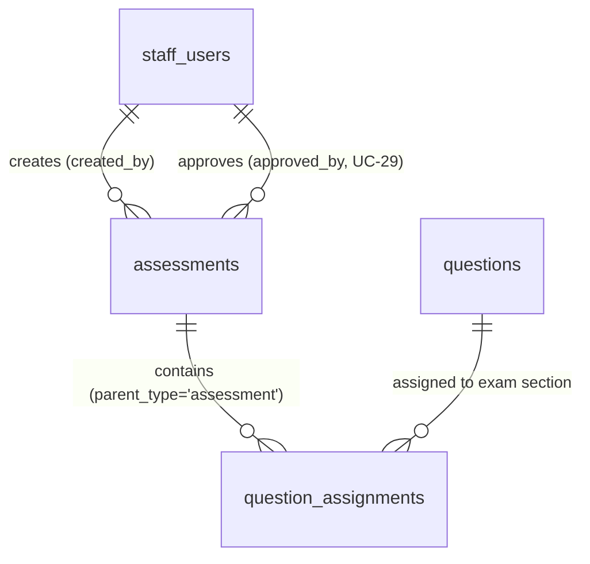

# UC-28 — Quản Lý Đề Thi Thử JLPT (Manage JLPT Mock Exams)

> **Feature:** `feat-content-management` | **Phiên bản:** 1.0 | **Trạng thái:** Draft
> **Actor chính:** Staff
> **Chuẩn:** SDD / Spec-Kit (8 thành phần) · **Văn phong yêu cầu:** EARS
> **Tham chiếu FR:** FR-28-01 → FR-28-34 (chi tiết hóa từ FR-CONTENT trong `feat-content-management/SPEC.md`)
> **Tham chiếu tài liệu:** `CONSTITUTION.md §1/§2/§3`, `AGENTS.md §5/§6/§7`, `CLAUDE.md` (Testing & AI Module, LESSON-005), `jlpt_database_v2.sql` (Bảng 10 `questions`, Bảng 11 `assessments`, Bảng 12 `question_assignments`, `staff_users`)
> **Liên quan:** UC-24 (Manage Question Bank — nguồn câu hỏi), UC-26 (Manage Quiz — cùng bảng `assessments`), UC-29 (Review/Publish Content — StaffManager), UC-10 (Student làm Mock Exam — `feat-assessment`)
> **Ngày tạo:** 2026-06-12

---

## ⚠️ Lưu ý ánh xạ đề bài ↔ schema thực tế

Tuân `AGENTS.md §9.1` (spec không khớp schema → nêu rõ, không tự đoán):

1. **`assessments` dùng chung cho `quiz` và `exam`**, phân biệt bằng cột `assessment_type`. UC-28 chỉ thao tác trên các bản ghi `assessment_type = 'exam'`.
2. **"Section đề thi" không phải bảng riêng.** Schema hiện tại không có bảng `sections`/`exam_sections`. Việc chia phần (`vocabulary`, `grammar`, `kanji`, `reading`, `listening`) được mô hình hóa qua cột `question_assignments.section_name` trên từng câu hỏi gán vào đề. Vì vậy "tạo section" ≡ "gán câu hỏi kèm `section_name`" (xem §5, §9).
3. **Khác biệt so với UC-26 (Quiz):** với `exam`, `section_name` là **bắt buộc** cho mỗi assignment (Rule 6); với `quiz`, `section_name` không bắt buộc.

---

## 1. CONTEXT & GOAL

### 1.1 Bối cảnh

Đề thi thử JLPT (`assessment_type = 'exam'`) giả lập cấu trúc kỳ thi thật từ **N5 đến N1**, giúp học viên luyện tập trong điều kiện gần với thi thực tế (đồng hồ đếm ngược server-side, chia phần thi, điểm đạt/không đạt). Trong mô hình dữ liệu, đề thi **không tự chứa câu hỏi** mà **tham chiếu** đến các câu hỏi có sẵn trong Ngân hàng câu hỏi (`questions`, xem UC-24) thông qua bảng nối `question_assignments`.

Nhân viên soạn thảo (Staff) cần một quy trình nghiệp vụ để: (1) tạo khung đề thi ở trạng thái nháp, (2) **chia đề thành các phần** (vocabulary / grammar / kanji / reading / listening) và **gán câu hỏi** từ ngân hàng vào từng phần kèm thứ tự hiển thị (`display_order`) và điểm từng câu (`score`), và (3) gửi đề sang hàng đợi kiểm duyệt (`pending_review`). Vì điểm thi thử ảnh hưởng trực tiếp đến đánh giá năng lực học viên, hệ thống phải bảo đảm **tổng điểm các câu hỏi gán vào bằng `total_score`** trước khi cho gửi duyệt, và **khóa danh sách câu hỏi** đối với đề đã xuất bản.

### 1.2 Mục tiêu

- Cho phép Staff tạo đề thi thử mới với `assessment_type = 'exam'`, `status = 'draft'` và đầy đủ metadata (`title`, `jlpt_level`, `duration_min`, `pass_score`, `total_score`).
- Cho phép Staff chia đề thành nhiều phần (`section_name`) và gán câu hỏi đã xuất bản từ ngân hàng vào từng phần, lưu `display_order` và `score`.
- Cho phép Staff xem danh sách / chi tiết đề thi của mình (gom nhóm theo section) và cập nhật metadata khi chưa xuất bản.
- Đảm bảo bất biến nghiệp vụ: **Σ `question_assignments.score` = `assessments.total_score`** mới được gửi duyệt (Rule 7, 8).
- Cho phép Staff gửi đề sang `pending_review`; **không** cho Staff tự `publish` (Rule 10).
- Khóa thay đổi danh sách câu hỏi của đề đã `published` để bảo toàn tính nhất quán điểm số lịch sử (Rule 9, LESSON-005).

### 1.3 Tại sao cần?

Nếu tổng điểm câu hỏi không khớp `total_score` → thang điểm đề sai lệch, kết quả thi thử không phản ánh đúng năng lực (vi phạm Domain Rule `AGENTS.md §7.1` và Forbidden Pattern #4). Nếu sửa danh sách câu hỏi của đề đã có người làm → điểm đã chấm trở nên vô nghĩa (LESSON-005, FR-ASSESS-20). Tách trạng thái kiểm duyệt và cấm Staff tự publish (Rule 10) bảo đảm chất lượng nội dung trước khi đến học viên; lẫn lộn cấp độ N1–N5 trong cùng một đề là lỗi nghiêm trọng (`AGENTS.md §5 #5`).

---

## 2. ACTOR

| Actor | Role | Điều kiện tiền quyết (Precondition) |
|:---|:---|:---|
| **Staff** | Tạo đề thi, chia section, gán câu hỏi, sửa metadata và gửi duyệt | Đã đăng nhập với JWT hợp lệ role `STAFF`, `staff_users.status = 'active'` |
| **StaffManager** | (Tham chiếu) Duyệt & xuất bản đề thi từ hàng đợi `pending_review` | Kế thừa quyền Staff; thao tác duyệt/publish thuộc UC-29 (ngoài phạm vi) |
| **Hệ thống (System)** | Validate nghiệp vụ, gán trạng thái mặc định, kiểm tra bất biến tổng điểm, enforce state machine, ghi audit log | — |
| Admin / Student | Không tham gia | Ngoài phạm vi UC-28 |

**Postconditions:**

- **Thành công:** Bản ghi `assessments` (type=exam) được tạo/cập nhật/chuyển trạng thái; các bản ghi `question_assignments` được tạo/thay thế đúng theo section; mọi thao tác ghi được log (`created_by`, `updated_at`).
- **Thất bại:** Không thay đổi dữ liệu; trả về mã lỗi rõ ràng; giao dịch được rollback toàn bộ.

---

## 3. FUNCTIONAL REQUIREMENTS (EARS)

> **EARS Syntax:** `WHEN [trigger] THE SYSTEM SHALL [behavior]` · `WHILE [state] …` · `IF [condition] THEN THE SYSTEM SHALL [response]` · `THE SYSTEM SHALL [ubiquitous]` · `WHERE [option] …`

### 3.1 Tạo đề thi (Create — POST /api/staff/assessments)

| ID | EARS Requirement |
|:---|:---|
| FR-28-01 | WHEN a Staff submits a new mock exam, THE SYSTEM SHALL persist an `assessments` record with `assessment_type = 'exam'`, `status = 'draft'`, and set `created_by` to the authenticated Staff's `staff_id`. (Rule 1, 2) |
| FR-28-02 | THE SYSTEM SHALL require `title`, `jlpt_level`, `duration_min`, `pass_score`, and `total_score` to be non-null before persisting an exam. (Rule 3) |
| FR-28-03 | THE SYSTEM SHALL accept `jlpt_level` only within the set {`N5`, `N4`, `N3`, `N2`, `N1`}; IF violated THEN THE SYSTEM SHALL reject with HTTP 400 `INVALID_JLPT_LEVEL`. |
| FR-28-04 | THE SYSTEM SHALL require `duration_min > 0`, `total_score > 0`, and `0 <= pass_score <= total_score`; IF violated THEN THE SYSTEM SHALL reject with HTTP 400 `VALIDATION_FAILED`. |
| FR-28-05 | THE SYSTEM SHALL force `assessment_type = 'exam'` for this use case regardless of any client-supplied value, and SHALL ignore any client-supplied `status`, `created_by`, `approved_by`, or `published_at`. (Rule 1, 10) |
| FR-28-06 | THE SYSTEM SHALL set `created_at` / `updated_at` to the server timestamp on creation. |
| FR-28-07 | WHEN an exam is created successfully, THE SYSTEM SHALL return HTTP 201 with the new `assessmentId`, `assessmentType = 'exam'`, and `status = 'draft'`. |

### 3.2 Xem & Lọc đề thi (Read/List — GET /api/staff/assessments?type=exam, GET /api/staff/assessments/{id})

| ID | EARS Requirement |
|:---|:---|
| FR-28-10 | WHEN a Staff requests the assessment list with `type=exam`, THE SYSTEM SHALL return a paginated result of `assessment_type = 'exam'` records ordered by `updated_at` descending. |
| FR-28-11 | WHEN any of `jlptLevel` or `status` filters are provided, THE SYSTEM SHALL return only exams matching ALL supplied filters (AND semantics). |
| FR-28-12 | THE SYSTEM SHALL exclude exams with `status = 'deleted'` from list results unless explicitly requested via `status=deleted`. |
| FR-28-13 | WHEN a Staff requests a single exam by `assessmentId`, THE SYSTEM SHALL return its full detail including the assigned questions **grouped by `section_name`**, each section's questions sorted by `display_order`, with each question's `score`. |
| FR-28-14 | THE SYSTEM SHALL include in the exam detail a derived `assignedScoreSum` (Σ of `question_assignments.score`), a per-section score subtotal, and a boolean `scoreMatched` (`assignedScoreSum == total_score`) to support the submit-review gate. |
| FR-28-15 | IF the requested `assessmentId` does not exist, is `deleted`, or is not `assessment_type = 'exam'`, THEN THE SYSTEM SHALL return HTTP 404 `ASSESSMENT_NOT_FOUND`. |

### 3.3 Cập nhật metadata đề thi (Update — PUT /api/staff/assessments/{id})

| ID | EARS Requirement |
|:---|:---|
| FR-28-16 | WHEN a Staff updates an existing exam, THE SYSTEM SHALL re-validate all field constraints defined in FR-28-02 through FR-28-04. |
| FR-28-17 | THE SYSTEM SHALL allow metadata updates only WHILE the exam `status` is in {`draft`, `rejected`}; IF `status` is `pending_review`, `published`, or `archived` THEN THE SYSTEM SHALL reject the update with HTTP 409 `INVALID_STATUS_TRANSITION`. |
| FR-28-18 | THE SYSTEM SHALL NOT allow `assessment_type` to be changed from `exam` to any other value through this endpoint, and SHALL ignore any client-supplied `status`. |
| FR-28-19 | WHEN an exam is updated successfully, THE SYSTEM SHALL refresh `updated_at` to the current server timestamp. |

### 3.4 Chia section & Gán câu hỏi (Assign — POST /api/staff/assessments/{id}/assign-questions)

| ID | EARS Requirement |
|:---|:---|
| FR-28-20 | WHEN a Staff assigns questions to an exam, THE SYSTEM SHALL create `question_assignments` rows with `parent_type = 'assessment'`, `parent_id = assessmentId`, and for each item the supplied `question_id`, `section_name`, `score`, and `display_order`. (Rule 5, 6) |
| FR-28-21 | THE SYSTEM SHALL require each assignment item to provide `questionId`, `sectionName`, `score`, and `displayOrder`, with `score > 0` and `displayOrder >= 0`; IF any field is missing or invalid THEN THE SYSTEM SHALL reject with HTTP 400 `VALIDATION_FAILED` and rollback the whole batch. (Rule 6) |
| FR-28-22 | THE SYSTEM SHALL accept `section_name` only within the set {`vocabulary`, `grammar`, `kanji`, `reading`, `listening`}; IF violated THEN THE SYSTEM SHALL reject with HTTP 400 `INVALID_SECTION`. (Rule 4) |
| FR-28-23 | THE SYSTEM SHALL verify every referenced `question_id` exists and is not `deleted`; IF any question does not exist THEN THE SYSTEM SHALL reject with HTTP 404 `QUESTION_NOT_FOUND` and rollback. |
| FR-28-24 | THE SYSTEM SHALL verify every referenced question has `status = 'published'`; IF any question is not published THEN THE SYSTEM SHALL reject with HTTP 422 `QUESTION_NOT_PUBLISHED` and rollback. |
| FR-28-25 | THE SYSTEM SHALL verify every referenced question's `jlpt_level` equals the exam's `jlpt_level`; IF any question's level differs THEN THE SYSTEM SHALL reject with HTTP 422 `LEVEL_MISMATCH` and rollback (chống lẫn lộn cấp độ — `AGENTS.md §5 #5`). |
| FR-28-26 | THE SYSTEM SHALL enforce uniqueness of `(parent_type, parent_id, question_id)`; IF the same question is assigned twice THEN THE SYSTEM SHALL reject with HTTP 409 `DUPLICATE_ASSIGNMENT` and rollback. |
| FR-28-27 | THE SYSTEM SHALL treat the assign-questions call as the full desired set for the exam (replace semantics): existing assignments for the exam are removed and replaced by the supplied set, within a single transaction. |
| FR-28-28 | WHILE an exam `status = 'published'`, THE SYSTEM SHALL block any change to its `question_assignments` and SHALL reject with HTTP 409 `ASSESSMENT_PUBLISHED`. (Rule 9) |
| FR-28-29 | THE SYSTEM SHALL allow assigning questions only WHILE the exam `status` is in {`draft`, `rejected`}; otherwise THE SYSTEM SHALL reject with HTTP 409 `INVALID_STATUS_TRANSITION`. |

### 3.5 Gửi duyệt đề thi (Submit for Review — POST /api/staff/contents/submit-review)

| ID | EARS Requirement |
|:---|:---|
| FR-28-30 | WHEN a Staff submits an exam for review with `contentType = 'assessment'`, THE SYSTEM SHALL verify that Σ `question_assignments.score` equals `assessments.total_score`; IF the sums differ THEN THE SYSTEM SHALL reject with HTTP 422 `SCORE_MISMATCH` and SHALL NOT change the status. (Rule 7, 8) |
| FR-28-31 | THE SYSTEM SHALL require the exam to have at least one assigned question before allowing the transition to `pending_review`; IF none exist THEN THE SYSTEM SHALL reject with HTTP 422 `EMPTY_EXAM`. |
| FR-28-32 | WHEN the score invariant (FR-28-30) holds AND at least one question exists AND the current `status` is in {`draft`, `rejected`}, THE SYSTEM SHALL transition `status` to `pending_review`; otherwise THE SYSTEM SHALL reject with HTTP 409 `INVALID_STATUS_TRANSITION`. (Rule 10) |

### 3.6 Quy tắc chung (Ubiquitous)

| ID | EARS Requirement |
|:---|:---|
| FR-28-33 | THE SYSTEM SHALL NOT provide a Staff any means to set `status = 'published'` through any endpoint in this use case (publishing is reserved for StaffManager — UC-29). (Rule 10) |
| FR-28-34 | THE SYSTEM SHALL restrict create/update/assign/submit operations to the Staff who owns the exam (`created_by = current staff_id`) unless the caller has role `STAFF_MANAGER`; otherwise THE SYSTEM SHALL reject with HTTP 403 `FORBIDDEN`. |
| FR-28-35 | THE SYSTEM SHALL log every create/update/assign/status-change action via SLF4J in the format `[INFO] Staff {staffId} {action} assessment {assessmentId}`. |
| FR-28-36 | THE SYSTEM SHALL perform soft delete only (`status = 'deleted'`) and SHALL NOT execute physical `DELETE FROM assessments` (ADR-004). |

---

## 4. NON-FUNCTIONAL REQUIREMENTS

| ID | Category | Requirement (EARS Ubiquitous) |
|:---|:---|:---|
| NFR-28-01 | Performance | THE SYSTEM SHALL trả GET danh sách đề thi phân trang < 500ms (p95) với page size mặc định 20; cột lọc (`assessment_type`, `status`, `jlpt_level`) phải có index. |
| NFR-28-02 | Security | THE SYSTEM SHALL yêu cầu JWT hợp lệ + role `STAFF`/`STAFF_MANAGER` cho mọi endpoint UC-28; thiếu/sai token → 401, sai role → 403. KHÔNG bypass Spring Security. |
| NFR-28-03 | Data Integrity | THE SYSTEM SHALL kiểm tra bất biến tổng điểm (Σ score = total_score) và kiểm tra khóa (`status = published`) ở Service Layer, trong cùng transaction với lệnh ghi `question_assignments`. |
| NFR-28-04 | Atomicity | THE SYSTEM SHALL thực hiện assign-questions nguyên tử: hoặc tất cả gán thành công, hoặc rollback toàn bộ (`@Transactional` tại Service). |
| NFR-28-05 | Architecture | THE SYSTEM SHALL tuân thủ Controller→Service→Repository→Entity; Controller chỉ nhận/trả DTO (`*Request`/`*Response`), KHÔNG trả Entity `assessments`/`question_assignments` (ADR-005); method ≤ 40 dòng, file ≤ 300 dòng. |
| NFR-28-06 | Validation | THE SYSTEM SHALL validate mọi `@RequestBody` bằng `@Valid` + Jakarta Bean Validation; validation nghiệp vụ (enum, range, section, tổng điểm) thực hiện ở backend, không tin client. |
| NFR-28-07 | Logging | THE SYSTEM SHALL dùng SLF4J (KHÔNG `System.out.println`), ghi `staffId`, `action`, `assessmentId` cho mọi thao tác ghi. |
| NFR-28-08 | Concurrency | THE SYSTEM SHALL dùng khóa lạc quan/giao dịch tuần tự khi replace assignments để tránh ghi đè mất dữ liệu khi nhiều Staff cùng sửa. |
| NFR-28-09 | SQL Safety | THE SYSTEM SHALL chỉ dùng JPA/Hibernate parameterized queries (zero SQL injection — `CONSTITUTION.md §3.2`). |
| NFR-28-10 | i18n | THE SYSTEM SHALL hỗ trợ lưu trữ Unicode (NVARCHAR) cho `title` và nội dung câu hỏi tiếng Nhật/Việt. |
| NFR-28-11 | Pagination | THE SYSTEM SHALL phân trang danh sách (default `page=0`, `size=20`, `size` tối đa 100). |

---

## 5. DATA MODEL

### 5.1 Bảng chính

> Nguồn: `jlpt_database_v2.sql` (Bảng 11 `assessments`, Bảng 12 `question_assignments`, Bảng 10 `questions`). **Không thay đổi schema** (tuân ADR-004 / migration policy).

```sql
-- Bảng 11: assessments (trọng tâm UC-28, lọc assessment_type = 'exam')
CREATE TABLE assessments (
    assessment_id   BIGINT IDENTITY(1,1) PRIMARY KEY,
    assessment_type NVARCHAR(20)    NOT NULL
        CHECK (assessment_type IN ('quiz','exam')),   -- UC-28 = 'exam'
    title           NVARCHAR(255)   NOT NULL,         -- Rule 3 (bắt buộc)
    lesson_id       BIGINT          NULL,             -- không dùng cho exam (gắn theo level)
    topic           NVARCHAR(100)   NULL,
    jlpt_level      NVARCHAR(5)     NULL              -- Rule 3: enforce NOT NULL ở Service (N5..N1)
        CHECK (jlpt_level IN ('N5','N4','N3','N2','N1')),
    duration_min    INT             NULL,             -- Rule 3: enforce NOT NULL & > 0 ở Service
    pass_score      INT             NULL,             -- Rule 3: enforce 0 <= pass <= total
    total_score     INT             NULL,             -- Rule 3: enforce NOT NULL & > 0 (Rule 7 đối chiếu)
    audio_url       NVARCHAR(500)   NULL,             -- dùng cho section listening (ADR-006: chỉ lưu URL)
    status          NVARCHAR(20)    NOT NULL DEFAULT 'draft'
        CHECK (status IN ('draft','pending_review','rejected','published','archived','deleted')),
    created_by      BIGINT          NULL,             -- FK → staff_users
    approved_by     BIGINT          NULL,             -- FK → staff_users (set bởi UC-29)
    published_at    DATETIME2       NULL,             -- set khi publish (UC-29)
    created_at      DATETIME2       NOT NULL DEFAULT SYSUTCDATETIME(),
    updated_at      DATETIME2       NOT NULL DEFAULT SYSUTCDATETIME(),
    CONSTRAINT FK_assessments_creator  FOREIGN KEY (created_by)  REFERENCES staff_users(staff_id),
    CONSTRAINT FK_assessments_approver FOREIGN KEY (approved_by) REFERENCES staff_users(staff_id)
);

-- Bảng 12: question_assignments (chia section + gán câu hỏi vào đề)
CREATE TABLE question_assignments (
    assignment_id   BIGINT IDENTITY(1,1) PRIMARY KEY,
    parent_type     NVARCHAR(30)    NOT NULL
        CHECK (parent_type IN ('assessment','lesson')),
    parent_id       BIGINT          NOT NULL,         -- = assessment_id khi parent_type='assessment'
    question_id     BIGINT          NOT NULL,         -- FK → questions (Rule 6)
    section_name    NVARCHAR(100)   NULL,             -- Rule 6: BẮT BUỘC cho exam, enforce ở Service
    score           DECIMAL(6,2)    NOT NULL DEFAULT 1,  -- điểm câu hỏi (Rule 6, 7)
    display_order   INT             NOT NULL DEFAULT 0,  -- thứ tự trong section (Rule 6)
    CONSTRAINT FK_assign_question FOREIGN KEY (question_id) REFERENCES questions(question_id) ON DELETE CASCADE,
    CONSTRAINT UQ_assign UNIQUE (parent_type, parent_id, question_id)  -- chống trùng (FR-28-26)
);

-- Index hỗ trợ lọc danh sách đề thi (NFR-28-01)
CREATE INDEX IX_assessments_filter ON assessments (assessment_type, status, jlpt_level);
-- Index hỗ trợ tổng hợp điểm theo đề + gom nhóm section (NFR-28-03)
CREATE INDEX IX_assign_parent ON question_assignments (parent_type, parent_id);
```

> **Lưu ý NV:** Nhiều cột của `assessments` (`jlpt_level`, `duration_min`, `pass_score`, `total_score`) là NULL-able trong DB, nhưng Rule 3 yêu cầu bắt buộc → **enforce ở Service layer** (không sửa schema). Tương tự, `section_name` NULL-able trong DB nhưng Rule 6 bắt buộc với exam → enforce ở Service.

**Bảng phụ thuộc (chỉ đọc trong UC-28):**

- `questions` — nguồn câu hỏi để gán; chỉ câu hỏi `status = 'published'` và cùng `jlpt_level` với đề mới được gán (FR-28-24/25). Soạn thảo câu hỏi thuộc UC-24.
- `staff_users` — chủ sở hữu đề (`created_by`), kiểm tra `status = 'active'` và quyền (FR-28-34).

### 5.2 Quan hệ



### 5.3 Mô hình Section (giải thích)

```
assessment (exam, N3)
 ├── section_name = 'vocabulary'  → [Q12 (order 1, 1.0đ), Q15 (order 2, 1.0đ) ...]
 ├── section_name = 'grammar'     → [Q40 (order 1, 1.0đ) ...]
 ├── section_name = 'kanji'       → [Q60 (order 1, 1.0đ) ...]
 ├── section_name = 'reading'     → [Q88 (order 1, 2.0đ) ...]
 └── section_name = 'listening'   → [Q120 (order 1, 2.0đ) ...]   (dùng audio_url)
* "Section" = nhóm các question_assignments cùng section_name (không có bảng riêng).
```

### 5.4 Bất biến nghiệp vụ (Invariant)

```
Σ ( question_assignments.score
    WHERE parent_type = 'assessment' AND parent_id = :examId )
  == assessments.total_score   (:examId)      ← BẮT BUỘC trước khi gửi duyệt (Rule 7, 8 / FR-28-30)
```

### 5.5 Vòng đời trạng thái (State machine — phạm vi Staff)

```
        create              assign-questions          submit-review              (UC-29)
 ─────► draft ─────────────► (sections + Σscore=total) ───────────────► pending_review ──────► published
          ▲                                                                  │  reject
 update/  │                                                                  ▼
 assign   └──────────────────────────────────────────────────────────  rejected ──► (update/assign/re-submit)

 * Staff KHÔNG được chuyển sang published (FR-28-33, Rule 10).
 * update/assign chỉ hợp lệ khi status ∈ {draft, rejected} (FR-28-17/29).
 * published → khóa danh sách câu hỏi (FR-28-28, Rule 9).
 * delete (soft): bất kỳ → 'deleted' (UC quản lý xóa riêng).
```

---

## 6. API SPEC

> Tất cả endpoint: **Auth = Bearer JWT (role STAFF)**. Định dạng response chuẩn `{ status, message, data }` (`AGENTS.md §6`). Prefix theo `AGENTS.md §3.3`.

### 6.1 `POST /api/staff/assessments` — Tạo đề thi thử (201)

**Request (CreateExamRequest):**

```json
{
  "assessmentType": "exam",
  "title": "Đề thi thử JLPT N3 - Tháng 6",
  "jlptLevel": "N3",
  "durationMin": 140,
  "passScore": 95,
  "totalScore": 180,
  "audioUrl": "https://cdn.example.com/exams/n3-listening.mp3"
}
```

**Response (201 Created):**

```json
{
  "status": 201,
  "message": "Tạo đề thi thử thành công",
  "data": { "assessmentId": 51, "assessmentType": "exam", "status": "draft", "createdAt": "2026-06-12T09:00:00Z" }
}
```

### 6.2 `GET /api/staff/assessments?type=exam` — Danh sách / Lọc đề thi (200)

**Query params:**

| Param | Kiểu | Bắt buộc | Mô tả |
|:---|:---|:---:|:---|
| `type` | enum | Có | Cố định `exam` cho UC-28 (`quiz` thuộc UC-26) |
| `jlptLevel` | enum | Không | `N5\|N4\|N3\|N2\|N1` |
| `status` | enum | Không | `draft\|pending_review\|rejected\|published\|archived\|deleted` |
| `page` | int | Không | Mặc định 0 |
| `size` | int | Không | Mặc định 20, tối đa 100 |

**Response (200):**

```json
{
  "status": 200,
  "message": "OK",
  "data": {
    "content": [
      {
        "assessmentId": 51,
        "title": "Đề thi thử JLPT N3 - Tháng 6",
        "assessmentType": "exam",
        "jlptLevel": "N3",
        "durationMin": 140,
        "passScore": 95,
        "totalScore": 180,
        "questionCount": 0,
        "status": "draft",
        "updatedAt": "2026-06-12T09:00:00Z"
      }
    ],
    "totalElements": 4,
    "totalPages": 1
  }
}
```

### 6.3 `GET /api/staff/assessments/{assessmentId}` — Chi tiết đề thi (gom theo section) (200)

**Response (200):**

```json
{
  "status": 200,
  "message": "OK",
  "data": {
    "assessmentId": 51,
    "assessmentType": "exam",
    "title": "Đề thi thử JLPT N3 - Tháng 6",
    "jlptLevel": "N3",
    "durationMin": 140,
    "passScore": 95,
    "totalScore": 180,
    "status": "draft",
    "assignedScoreSum": 60.0,
    "scoreMatched": false,
    "sections": [
      {
        "sectionName": "vocabulary",
        "sectionScore": 35.0,
        "questions": [
          { "assignmentId": 301, "questionId": 12, "displayOrder": 1, "score": 1.0, "questionText": "..." }
        ]
      },
      {
        "sectionName": "grammar",
        "sectionScore": 25.0,
        "questions": [
          { "assignmentId": 340, "questionId": 40, "displayOrder": 1, "score": 1.0, "questionText": "..." }
        ]
      }
    ],
    "createdBy": 5,
    "createdAt": "2026-06-12T09:00:00Z",
    "updatedAt": "2026-06-12T09:30:00Z"
  }
}
```

### 6.4 `PUT /api/staff/assessments/{assessmentId}` — Cập nhật metadata đề thi (200)

> Chỉ cho phép khi `status ∈ {draft, rejected}` (FR-28-17). **Không** chứa `status`/`assessmentType`.

**Request (UpdateExamRequest):**

```json
{
  "title": "Đề thi thử JLPT N3 - Tháng 6 (cập nhật)",
  "jlptLevel": "N3",
  "durationMin": 150,
  "passScore": 95,
  "totalScore": 180,
  "audioUrl": "https://cdn.example.com/exams/n3-listening-v2.mp3"
}
```

**Response (200):**

```json
{
  "status": 200,
  "message": "Cập nhật đề thi thử thành công",
  "data": { "assessmentId": 51, "status": "draft", "updatedAt": "2026-06-12T10:15:00Z" }
}
```

### 6.5 `POST /api/staff/assessments/{assessmentId}/assign-questions` — Chia section & Gán câu hỏi (200)

> Replace semantics (FR-28-27): tập gửi lên là **tập đầy đủ mong muốn** của đề. Mỗi item **bắt buộc** `sectionName` (Rule 6).

**Request (AssignQuestionsRequest):**

```json
{
  "assignments": [
    { "questionId": 12,  "sectionName": "vocabulary", "displayOrder": 1, "score": 1.0 },
    { "questionId": 15,  "sectionName": "vocabulary", "displayOrder": 2, "score": 1.0 },
    { "questionId": 40,  "sectionName": "grammar",    "displayOrder": 1, "score": 1.0 },
    { "questionId": 88,  "sectionName": "reading",    "displayOrder": 1, "score": 2.0 },
    { "questionId": 120, "sectionName": "listening",  "displayOrder": 1, "score": 2.0 }
  ]
}
```

**Response (200):**

```json
{
  "status": 200,
  "message": "Gán câu hỏi vào đề thi thử thành công",
  "data": {
    "assessmentId": 51,
    "assignedCount": 5,
    "assignedScoreSum": 7.0,
    "totalScore": 180,
    "scoreMatched": false,
    "sectionSummary": [
      { "sectionName": "vocabulary", "count": 2, "sectionScore": 2.0 },
      { "sectionName": "grammar",    "count": 1, "sectionScore": 1.0 },
      { "sectionName": "reading",    "count": 1, "sectionScore": 2.0 },
      { "sectionName": "listening",  "count": 1, "sectionScore": 2.0 }
    ]
  }
}
```

### 6.6 `POST /api/staff/contents/submit-review` — Gửi duyệt đề thi (200)

**Request (SubmitReviewRequest):**

```json
{ "contentType": "assessment", "contentId": 51 }
```

**Response (200):**

```json
{
  "status": 200,
  "message": "Đã gửi đề thi thử để phê duyệt",
  "data": { "contentId": 51, "contentType": "assessment", "status": "pending_review" }
}
```

### 6.7 Bảng tóm tắt

| Method | Path | Mục đích | Success | Auth |
|--------|------|----------|---------|------|
| POST | `/api/staff/assessments` | Tạo đề thi (exam, draft) | 201 | staff |
| GET | `/api/staff/assessments?type=exam` | List đề thi của mình | 200 | staff |
| GET | `/api/staff/assessments/{assessmentId}` | Chi tiết (gom section) | 200 | staff |
| PUT | `/api/staff/assessments/{assessmentId}` | Sửa metadata (draft/rejected) | 200 | staff |
| POST | `/api/staff/assessments/{assessmentId}/assign-questions` | Chia section + gán câu hỏi | 200 | staff |
| POST | `/api/staff/contents/submit-review` | Gửi duyệt | 200 | staff |

---

## 7. ERROR HANDLING

> Xử lý tập trung qua `@RestControllerAdvice` (ADR-008). Format lỗi: `{ status, message, data:{ field?, error? } }`.

| HTTP | Error Code | Message | Trigger (FR liên quan) |
|:---:|:---|:---|:---|
| 400 | `VALIDATION_FAILED` | "Thiếu trường bắt buộc hoặc giá trị không hợp lệ" | Thiếu `title`/`jlpt_level`/`duration_min`/`pass_score`/`total_score`, hoặc range sai (`duration_min<=0`, `total_score<=0`, `pass_score>total_score`), hoặc thiếu trường assignment (FR-28-02/04/21) |
| 400 | `INVALID_JLPT_LEVEL` | "Cấp độ JLPT phải là N5 đến N1" | `jlptLevel` ngoài {N5..N1} (FR-28-03) |
| 400 | `INVALID_SECTION` | "Section phải thuộc: vocabulary, grammar, kanji, reading, listening" | `sectionName` ngoài tập cho phép (FR-28-22) |
| 401 | `UNAUTHORIZED` | "Yêu cầu đăng nhập" | Thiếu/sai/hết hạn JWT (NFR-28-02) |
| 403 | `FORBIDDEN` | "Không có quyền thao tác đề thi này" | Không phải chủ sở hữu hoặc role ≠ STAFF (FR-28-34) |
| 403 | `PUBLISH_NOT_ALLOWED` | "Staff không được tự xuất bản đề thi" | Cố đặt `status = published` (FR-28-33, Rule 10) |
| 404 | `ASSESSMENT_NOT_FOUND` | "Không tìm thấy đề thi thử" | `assessmentId` không tồn tại / đã `deleted` / không phải `exam` (FR-28-15) |
| 404 | `QUESTION_NOT_FOUND` | "Không tìm thấy câu hỏi cần gán" | `question_id` không tồn tại hoặc đã `deleted` (FR-28-23) |
| 409 | `DUPLICATE_ASSIGNMENT` | "Câu hỏi bị gán trùng trong đề thi" | Trùng `(parent_type, parent_id, question_id)` (FR-28-26) |
| 409 | `ASSESSMENT_PUBLISHED` | "Đề thi đã xuất bản, không thể thay đổi danh sách câu hỏi" | Sửa assignments khi `status = published` (FR-28-28, Rule 9) |
| 409 | `INVALID_STATUS_TRANSITION` | "Không thể thực hiện thao tác ở trạng thái hiện tại" | Update/assign/submit khi status ∉ {draft, rejected} (FR-28-17/29/32) |
| 422 | `QUESTION_NOT_PUBLISHED` | "Chỉ được gán câu hỏi đã xuất bản" | Gán câu hỏi `status ≠ published` (FR-28-24) |
| 422 | `LEVEL_MISMATCH` | "Câu hỏi phải cùng cấp độ JLPT với đề thi" | `question.jlpt_level` ≠ `exam.jlpt_level` (FR-28-25) |
| 422 | `SCORE_MISMATCH` | "Tổng điểm câu hỏi không khớp với total_score của đề thi" | Σ score ≠ total_score khi gửi duyệt (FR-28-30, Rule 7/8) |
| 422 | `EMPTY_EXAM` | "Đề thi chưa có câu hỏi nào" | Gửi duyệt khi không có assignment (FR-28-31) |
| 500 | `INTERNAL_ERROR` | "Internal server error" | Lỗi hệ thống / CSDL (NFR-28-07) |

---

## 8. ACCEPTANCE CRITERIA

> Định dạng Given/When/Then, ánh xạ FR. Là cơ sở cho Integration tests (`CONSTITUTION.md §5` — 100% coverage endpoint).

| ID | Scenario | Given | When | Then |
|:---|:---|:---|:---|:---|
| AC-28-01 | Tạo đề thi nháp thành công | Body hợp lệ (N3, đủ trường) | POST /api/staff/assessments | HTTP 201; `assessments` với `assessment_type='exam'`, `status='draft'`, `created_by`=staff hiện tại (Rule 1, 2) |
| AC-28-02 | Bỏ qua status client gửi | Body kèm `"status":"published"` | POST /api/staff/assessments | HTTP 201; bản ghi vẫn `status='draft'` (FR-28-05) |
| AC-28-03 | Thiếu trường bắt buộc | Body không có `totalScore` | POST /api/staff/assessments | HTTP 400 `VALIDATION_FAILED`; không tạo bản ghi (Rule 3) |
| AC-28-04 | pass_score vượt total_score | `passScore=200`, `totalScore=180` | POST /api/staff/assessments | HTTP 400 `VALIDATION_FAILED`; rollback |
| AC-28-05 | Cấp độ JLPT sai | `jlptLevel='N6'` | POST /api/staff/assessments | HTTP 400 `INVALID_JLPT_LEVEL` |
| AC-28-06 | Liệt kê đề thi theo level | 4 đề exam, 2 đề N3 | GET ?type=exam&jlptLevel=N3 | HTTP 200; chỉ trả đề `exam` N3; không có `quiz`; phân trang đúng (FR-28-10/11) |
| AC-28-07 | Chi tiết gom theo section | Đề 51 có câu ở 2 section | GET /api/staff/assessments/51 | HTTP 200; `sections[]` gom theo `sectionName`, câu sắp theo `displayOrder`, kèm `assignedScoreSum`, `scoreMatched` (FR-28-13/14) |
| AC-28-08 | Gán câu hỏi kèm section | Đề 51 draft, 5 câu published cùng N3 | POST /assign-questions với `sectionName` mỗi item | HTTP 200; tạo `question_assignments` đúng `section_name`, `display_order`, `score` (Rule 5, 6) |
| AC-28-09 | Thiếu sectionName khi gán | Một item thiếu `sectionName` | POST /assign-questions | HTTP 400 `VALIDATION_FAILED`; rollback toàn batch (Rule 6, FR-28-21) |
| AC-28-10 | Section không hợp lệ | `sectionName='speaking'` | POST /assign-questions | HTTP 400 `INVALID_SECTION`; rollback (Rule 4, FR-28-22) |
| AC-28-11 | Gán câu hỏi chưa publish | Câu hỏi `status='draft'` | POST /assign-questions | HTTP 422 `QUESTION_NOT_PUBLISHED`; rollback (FR-28-24) |
| AC-28-12 | Gán câu hỏi khác cấp độ | Đề N3, câu hỏi N2 | POST /assign-questions | HTTP 422 `LEVEL_MISMATCH`; rollback (FR-28-25) |
| AC-28-13 | Gán câu hỏi trùng | 2 item cùng `questionId` | POST /assign-questions | HTTP 409 `DUPLICATE_ASSIGNMENT`; rollback (FR-28-26) |
| AC-28-14 | Tổng điểm khớp → gửi duyệt OK | Đề 51 `totalScore=180`, Σscore=180 | POST /submit-review | HTTP 200; `status='pending_review'` (Rule 7, 10) |
| AC-28-15 | Tổng điểm lệch → chặn gửi duyệt | Đề 51 `totalScore=180`, Σscore=175 | POST /submit-review | HTTP 422 `SCORE_MISMATCH`; status không đổi (Rule 8, FR-28-30) |
| AC-28-16 | Đề rỗng → chặn gửi duyệt | Đề 51 chưa có assignment | POST /submit-review | HTTP 422 `EMPTY_EXAM` (FR-28-31) |
| AC-28-17 | Chặn sửa câu hỏi đề đã publish | Đề 51 `status='published'` | POST /assign-questions | HTTP 409 `ASSESSMENT_PUBLISHED`; không thay đổi dữ liệu (Rule 9) |
| AC-28-18 | Chặn cập nhật khi đã gửi duyệt | Đề 51 `status='pending_review'` | PUT /api/staff/assessments/51 | HTTP 409 `INVALID_STATUS_TRANSITION` (FR-28-17) |
| AC-28-19 | Chặn Staff tự publish | Payload cố đặt `status=published` | POST/PUT | HTTP 403 `PUBLISH_NOT_ALLOWED`; status không đổi (Rule 10) |
| AC-28-20 | Không phải chủ sở hữu | Đề 51 do Staff A tạo, Staff B gọi | PUT/assign/submit trên 51 | HTTP 403 `FORBIDDEN` (FR-28-34) |
| AC-28-21 | Thiếu JWT / sai role | Request không JWT, hoặc role student | Gọi bất kỳ endpoint | HTTP 401 / 403 (NFR-28-02) |
| AC-28-22 | Chỉ trả DTO | Bất kỳ response | GET chi tiết | Không lộ Entity/field nội bộ (vd: không trả `password_hash` của creator) (NFR-28-05) |

---

## 9. OUT OF SCOPE

- ❌ **Xuất bản (publish) / từ chối (reject) đề thi** (`pending_review → published/rejected`, set `approved_by`, `published_at`) — thuộc StaffManager / UC-29 (Content Review). Staff chỉ gửi `pending_review` (Rule 10).
- ❌ **Soạn thảo / sửa nội dung câu hỏi** (`questions`) — thuộc UC-24 (Manage Question Bank). UC-28 chỉ tham chiếu câu hỏi đã `published`.
- ❌ **Tạo / cấu hình bài trắc nghiệm** (`assessment_type='quiz'`) — thuộc UC-26 (Manage Quiz).
- ❌ **Học viên làm đề thi thử, chấm điểm, tính section scores, lưu `test_attempts`** — thuộc UC-10 / `feat-assessment`.
- ❌ **Bảng section riêng / cấu hình section nâng cao** (thời lượng riêng mỗi phần, thứ tự phần, điểm chuẩn từng phần kiểu JLPT thật) — schema hiện tại mô hình section bằng `section_name`; nếu cần section là thực thể độc lập → yêu cầu thay đổi schema qua migration (`CONSTITUTION.md §7.3 vote`).
- ❌ **Upload file audio/ảnh** cho section listening — xử lý qua module File Upload (chỉ lưu URL vào `audio_url`, ADR-006), không nằm trong các endpoint UC-28.
- ❌ **Tự động sinh đề / chọn câu hỏi ngẫu nhiên theo cấu hình** — Phase 2.
- ❌ **Versioning đề thi đã publish** (tạo phiên bản mới khi đã có người làm) — chỉ nêu ràng buộc chặn sửa (FR-28-28); cơ chế tạo version là UC riêng / Phase 2.
- ❌ **Xóa cứng (hard delete)** — chỉ soft delete bằng `status='deleted'` (ADR-004); thao tác xóa thuộc UC quản lý xóa riêng.
