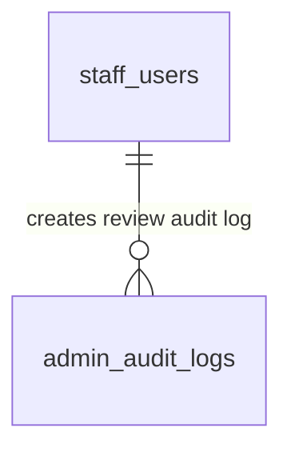

# SPEC — Content Review & Status Control (StaffManager Role)
>
> **Feature ID:** `feat-content-review`
> **UC Coverage:** UC-33 (Review Submitted Content), UC-34 (Manage Published Content Status)
> **Version:** 1.0 | **Status:** Draft
> **Author:** Team | **Last Updated:** 2026-05-28

---

## 1. CONTEXT & GOAL

### 1.1 Bối cảnh

Nội dung học tập được xem là tài sản cốt lõi của nền tảng JLPT. Để đảm bảo tính sư phạm và chất lượng chuyên môn tối đa, mọi tài liệu bài học và câu hỏi trắc nghiệm do Nhân viên (Staff) tạo ra không bao giờ được xuất bản trực tiếp lên hệ thống. Chúng phải đi qua một bộ lọc chất lượng bắt buộc, được đánh giá và phê duyệt bởi Quản lý Nội dung (StaffManager).

### 1.2 Mục tiêu

- **Phê duyệt nội dung (UC-33):** Thiết lập màn hình Hàng đợi duyệt (`Review Queue`) tập trung cho phép StaffManager phê duyệt (`Approve`), từ chối (`Reject`), hoặc yêu cầu sửa đổi (`Request Changes`) các nội dung đang ở trạng thái `pending_review`.
- **Kiểm soát xuất bản (UC-34):** Cấp quyền điều phối cho StaffManager thực hiện xuất bản công khai (`Publish`), thu hồi/tạm ẩn (`Unpublish`), lưu trữ (`Archive`) hoặc khôi phục (`Restore`) các tài nguyên bài học đang hoạt động trên hệ thống.
- **Tính năng an toàn nghiệp vụ:** Cảnh báo và ngăn chặn StaffManager thu hồi (Unpublish) các câu hỏi hoặc bài giảng đang được tham chiếu trực tiếp bởi các đề thi thử JLPT đang mở.

### 1.3 Tại sao cần?

Không có vai trò StaffManager $\rightarrow$ Staff có thể tự ý duyệt và xuất bản học liệu của mình mà không có sự kiểm tra chéo (vi phạm quy tắc chéo 4 mắt - Four-Eyes Principle). Việc unpublish đột ngột một câu hỏi đang nằm trong đề thi thử trực tuyến sẽ gây ra lỗi nghiêm trọng (NPE hoặc lỗi tính điểm) cho các học viên đang làm bài thi tại thời điểm đó.

---

## 2. ACTOR

| Actor | Role | Điều kiện tiền quyết |
|:---|:---|:---|
| **StaffManager** | Kiểm duyệt bài học, từ vựng, ngữ pháp, đề thi, câu hỏi và điều phối trạng thái xuất bản | Đã đăng nhập vai trò Staff với phân quyền `staff_manager`, status = `active` |

---

## 3. FUNCTIONAL REQUIREMENTS (EARS)

### 3.1 UC-33 — Kiểm duyệt Nội dung Chờ duyệt (Review Queue)

| ID | EARS Requirement |
|:---|:---|
| FR-REVIEW-01 | WHEN a StaffManager approves a content item in the Review Queue, THE SYSTEM SHALL: (1) set `status = 'published'`, (2) set `approved_by = ManagerId`, (3) set `published_at = SYSUTCDATETIME()`, and (4) log to `admin_audit_logs`. |
| FR-REVIEW-02 | WHEN a StaffManager rejects a content item or requests changes, THE SYSTEM SHALL set `status = 'rejected'` or `'draft'` and enforce a mandatory feedback explanation. |
| FR-REVIEW-03 | IF a Staff member attempts to approve their own submitted content, THEN THE SYSTEM SHALL reject the request with HTTP 403 and throw a `SelfReviewNotAllowedException`. |
| FR-REVIEW-04 | THE SYSTEM SHALL resolve review race conditions by throwing an HTTP 409 Conflict if another reviewer has already processed the item. |

### 3.2 UC-34 — Quản lý Trạng thái Xuất bản (Manage Published Status)

| ID | EARS Requirement |
|:---|:---|
| FR-REVIEW-10 | WHEN a StaffManager sets a published content item to 'archived' or 'deleted', THE SYSTEM SHALL perform a soft delete by updating `status` and preserving the record. |
| FR-REVIEW-11 | IF a StaffManager attempts to unpublish a question currently assigned to an active published exam, THEN THE SYSTEM SHALL return HTTP 409 and prompt a list of referencing exams to prevent database reference corruption. |
| FR-REVIEW-12 | WHEN a content item is unpublished or archived, THE SYSTEM SHALL immediately exclude it from Student-facing endpoints (study pages, search, random practice generators). |

---

## 4. NON-FUNCTIONAL REQUIREMENTS

| ID | Category | Requirement |
|:---|:---|:---|
| NFR-REVIEW-01 | Correctness (4-Eyes Rule) | Việc chặn hành vi "vừa đá bóng vừa thổi còi" (Staff tự duyệt bài viết của chính mình) phải được cấu hình bắt buộc ở tầng Service Layer để chống bypass. |
| NFR-REVIEW-02 | Performance | Truy vấn hàng đợi duyệt `Review Queue` phải hoàn thành dưới 300ms (p95) nhờ tối ưu hóa các Index trên cột `status` của các bảng học liệu. |
| NFR-REVIEW-03 | Security | Vai trò Staff thường (`staff_role = 'staff'`) tuyệt đối không được phép tiếp cận hoặc gửi request tới các API phê duyệt này. |
| NFR-REVIEW-04 | Logging | Ghi nhận chi tiết lịch sử phê duyệt trong `admin_audit_logs` để phục vụ công tác giám sát hiệu suất và chất lượng của ban biên tập nội dung. |

---

## 5. DATA MODEL

### 5.1 Bảng chính liên quan

> Nguồn: [`jlpt_database_v2.sql`](file:///d:/Japanese-Skill-Practice-Platform/3.src/infra/Database/jlpt_database_v2.sql)

Trạng thái kiểm duyệt và xuất bản được quản lý thông qua cột `status` có mặt ở tất cả các bảng học liệu cốt lõi:

- `courses`
- `lessons`
- `grammar_points`
- `vocabulary`
- `kanji`
- `questions`
- `assessments`

Ràng buộc miền giá trị chung cho cột `status`:

```sql
CHECK (status IN ('draft','pending_review','rejected','published','archived','deleted'))
```

Cấu trúc lưu vết lịch sử trong `admin_audit_logs`:

```sql
-- Bảng 22: admin_audit_logs
CREATE TABLE admin_audit_logs (
    audit_id        BIGINT IDENTITY(1,1) PRIMARY KEY,
    admin_actor_id  BIGINT          NULL,
    staff_actor_id  BIGINT          NULL,                       -- StaffManager ID
    action          NVARCHAR(100)   NOT NULL,                   -- 'approve_content', 'reject_content', 'archive_content'...
    target_table    NVARCHAR(100)   NULL,                       -- e.g. 'grammar_points'
    target_id       BIGINT          NULL,                       -- e.g. grammar_id
    description     NVARCHAR(MAX)   NULL,                       -- feedback / reason
    ip_address      NVARCHAR(45)    NULL,
    created_at      DATETIME2       NOT NULL DEFAULT SYSUTCDATETIME()
);
```

### 5.2 Quan hệ



---

## 6. API SPEC

### `GET /api/manager/review-queue?type={question|lesson|grammar}&page=0&size=20`

**Actor:** StaffManager | **Auth:** Bearer JWT

**Response (200 OK):**

```json
{
  "status": 200,
  "message": "Lấy hàng đợi phê duyệt thành công",
  "data": {
    "content": [
      {
        "contentId": 105,
        "contentType": "question",
        "titleOrText": "N5 Kanji: '水' đọc là gì?",
        "submittedBy": "Staff Nguyen Van B",
        "submittedAt": "2026-05-28T23:00:00Z"
      }
    ],
    "totalElements": 1,
    "totalPages": 1
  }
}
```

---

### `POST /api/manager/reviews`

**Actor:** StaffManager | **Auth:** Bearer JWT

**Request:**

```json
{
  "contentType": "question",
  "contentId": 105,
  "action": "APPROVE",
  "feedback": "Câu hỏi biên soạn chuẩn xác, đáp án hợp lý."
}
```

**Response (200 OK):**

```json
{
  "status": 200,
  "message": "Phê duyệt nội dung thành công",
  "data": {
    "contentId": 105,
    "status": "published",
    "approvedAt": "2026-05-28T23:44:00Z"
  }
}
```

---

### `POST /api/manager/reviews/request-changes`

**Actor:** StaffManager | **Auth:** Bearer JWT

**Request:**

```json
{
  "contentType": "question",
  "contentId": 105,
  "feedback": "Lỗi chính tả ở đáp án D (thiếu chữ 'i'). Yêu cầu sửa lại trước khi gửi duyệt lại."
}
```

**Response (200 OK):**

```json
{
  "status": 200,
  "message": "Yêu cầu chỉnh sửa nội dung thành công",
  "data": {
    "contentId": 105,
    "status": "rejected"
  }
}
```

---

### `PUT /api/manager/contents/{contentId}/status`

**Actor:** StaffManager | **Auth:** Bearer JWT

**Request:**

```json
{
  "contentType": "assessment",
  "status": "archived",
  "reason": "Đề thi thử cũ năm 2024 không còn phù hợp với cấu trúc đề thi mới."
}
```

**Response (200 OK):**

```json
{
  "status": 200,
  "message": "Cập nhật trạng thái xuất bản thành công",
  "data": {
    "contentId": 24,
    "status": "archived"
  }
}
```

---

## 7. ERROR HANDLING

| HTTP Code | Error Code | Message | Trigger |
|:---:|:---|:---|:---|
| 400 | `VALIDATION_FAILED` | "Hành động duyệt không hợp lệ" | Gửi action khác APPROVE / REJECT / REQ_CHANGES |
| 401 | `UNAUTHORIZED` | "Yêu cầu đăng nhập" | JWT token thiếu hoặc hết hạn |
| 403 | `FORBIDDEN` | "Tài khoản không có thẩm quyền kiểm duyệt" | Staff thường hoặc Student gọi API phê duyệt |
| 403 | `SELF_REVIEW_DENIED` | "Nguyên tắc chéo: Không thể tự phê duyệt nội dung của chính mình" | StaffManager tự duyệt nội dung do mình tạo ra |
| 409 | `RESOURCE_IN_USE` | "Câu hỏi đang nằm trong đề thi đang hoạt động, không thể thu hồi" | Thu hồi câu hỏi đang được exam published dùng |
| 409 | `CONCURRENT_REVIEW` | "Nội dung này đã được duyệt bởi một StaffManager khác" | Xử lý trùng lặp phê duyệt đồng thời |
| 404 | `CONTENT_NOT_FOUND` | "Không tìm thấy nội dung yêu cầu phê duyệt" | contentId sai lệch |
| 500 | `INTERNAL_ERROR` | "Internal server error" | Lỗi hệ thống |

---

## 8. ACCEPTANCE CRITERIA

| ID | Scenario | Given | When | Then |
|:---|:---|:---|:---|:---|
| AC-REVIEW-01 | Phê duyệt nội dung thành công | StaffManager khác người tạo, dữ liệu pending | POST /reviews với APPROVE | Status đổi thành `published`, ghi nhận approved_by và audit log |
| AC-REVIEW-02 | Yêu cầu sửa đổi thành công | StaffManager gửi phản hồi | POST /request-changes | Status đổi thành `rejected` và chuyển về hàng nháp của Staff |
| AC-REVIEW-03 | Cấm Staff tự phê duyệt | StaffManager tạo câu hỏi ID 1 | POST /reviews duyệt câu hỏi ID 1 | Trả về lỗi 403 `SELF_REVIEW_DENIED` |
| AC-REVIEW-04 | Chặn unpublish câu hỏi đang thi | Câu hỏi ID 1 đang được dùng trong Exam 2 | PUT status thành `archived` | Trả về lỗi 409 `RESOURCE_IN_USE` và chặn unpublish |

---

## OUT OF SCOPE

- ❌ Sửa đổi trực tiếp nội dung bài học trong quá trình phê duyệt — StaffManager chỉ có quyền Duyệt / Từ chối / Yêu cầu sửa; việc sửa đổi thuộc trách nhiệm của Staff soạn thảo.
- ❌ Tự động dịch thuật nội dung bài giảng bằng AI khi duyệt.
