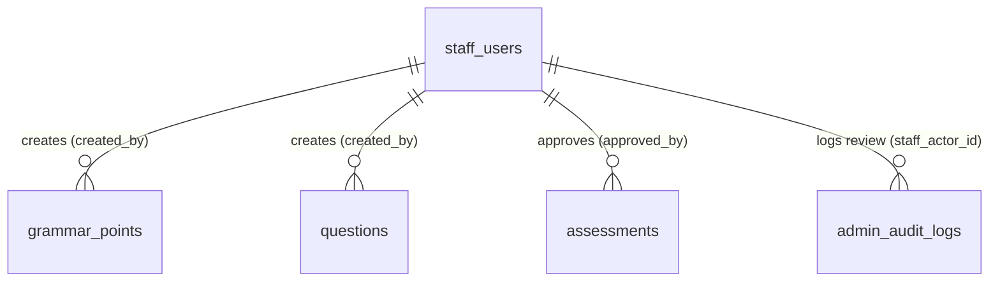

# UC-33 — Kiểm Duyệt Nội Dung Chờ Duyệt (Review Submitted Content)

> **Feature:** `feat-content-review` | **Phiên bản:** 1.0 | **Trạng thái:** Draft
> **Actor chính:** StaffManager
> **Tham chiếu FR:** FR-33-01 → FR-33-22 (chi tiết hóa từ FR-REVIEW-01..04 trong `feat-content-review/SPEC.md`)
> **Liên quan:** UC-24 (Manage Question Bank — Staff gửi `pending_review`), UC-25/UC-26/UC-27/UC-28 (Soạn thảo học liệu), UC-34 (Manage Published Content Status)
> **Cập nhật:** 2026-06-12

---

## 1. CONTEXT & GOAL

### 1.1 Bối cảnh

Học liệu (`courses`, `lessons`, `grammar_points`, `vocabulary`, `kanji`, `questions`, `assessments`) do Nhân viên soạn thảo (Staff) tạo ra **không bao giờ được xuất bản trực tiếp** cho học viên. Mọi nội dung sau khi Staff hoàn thiện sẽ được chuyển sang trạng thái `pending_review` và phải đi qua một bộ lọc chất lượng bắt buộc do **StaffManager** kiểm duyệt.

UC-33 thiết lập màn hình **Hàng đợi duyệt (Review Queue)** tập trung, nơi StaffManager xem toàn bộ nội dung đang `pending_review`, mở chi tiết để đối chiếu, rồi thực hiện một trong ba hành động: **Approve** (phê duyệt & xuất bản), **Reject** (từ chối), hoặc **Request Changes** (yêu cầu chỉnh sửa).

### 1.2 Mục tiêu

- Cho phép StaffManager xem **danh sách phân trang** mọi nội dung đang `pending_review` trên tất cả bảng học liệu, có lọc theo loại nội dung và cấp độ.
- Cho phép StaffManager xem **chi tiết** một mục nội dung bất kỳ trước khi quyết định.
- Cho phép StaffManager **Approve** nội dung hợp lệ → chuyển sang `published`, ghi `approved_by`, `published_at`.
- Bắt buộc nhập **feedback** khi **Reject** hoặc **Request Changes**.
- Thực thi **nguyên tắc chéo bốn mắt (Four-Eyes Principle)**: StaffManager không được tự duyệt nội dung do chính mình tạo.
- Chống **xử lý trùng lặp đồng thời** (concurrent review) bằng phát hiện xung đột trạng thái → HTTP 409.
- Ghi **audit log** đầy đủ cho mọi hành động kiểm duyệt.

### 1.3 Tại sao cần?

Không có vai trò kiểm duyệt độc lập → Staff có thể tự phê duyệt và xuất bản học liệu của chính mình mà không có kiểm tra chéo, dẫn đến nội dung sai lệch hiển thị trực tiếp cho học viên và ảnh hưởng điểm số (vi phạm Domain Rule §7.1 và LESSON-005). Việc cấm tự duyệt (Rule 8) và phát hiện xử lý đồng thời (Rule 9) đảm bảo chất lượng nội dung và tính nhất quán dữ liệu trước khi đến học viên.

---

## 2. ACTOR

| Actor | Role | Điều kiện tiền quyết (Precondition) |
|:---|:---|:---|
| **StaffManager** | Xem hàng đợi, xem chi tiết, Approve / Reject / Request Changes nội dung `pending_review` | Đã đăng nhập JWT hợp lệ, vai trò Staff với phân quyền `staff_manager`, `status = 'active'` |
| **Staff** | (Tham chiếu) Người soạn thảo & gửi duyệt nội dung; nhận lại feedback để sửa | Ngoài phạm vi UC-33 — xem UC-24..UC-28 |
| **Hệ thống (System)** | Xác thực phân quyền, kiểm tra quy tắc nghiệp vụ, đổi trạng thái, ghi audit log | — |

**Postconditions:**

- **Thành công (Approve):** Bản ghi nội dung có `status = 'published'`, `approved_by = StaffManagerId`, `published_at = now`; audit log được ghi.
- **Thành công (Reject / Request Changes):** `status = 'rejected'` (hoặc `'draft'` với Request Changes); feedback được lưu vào `admin_audit_logs.description`; audit log được ghi.
- **Thất bại:** Không thay đổi dữ liệu; giao dịch rollback; trả mã lỗi rõ ràng.

---

## 3. FUNCTIONAL REQUIREMENTS (EARS)

> **EARS Syntax:** `WHEN [trigger] THE SYSTEM SHALL [behavior]` · `WHILE [state] …` · `IF [condition] THEN THE SYSTEM SHALL [response]` · `THE SYSTEM SHALL [ubiquitous]`

### 3.1 Truy cập & Phân quyền Review Queue (Rule 1, 2)

| ID | EARS Requirement |
|:---|:---|
| FR-33-01 | THE SYSTEM SHALL restrict every endpoint under `/api/manager/**` to authenticated users whose Staff role is `staff_manager`; any other role SHALL receive HTTP 403 `FORBIDDEN`. |
| FR-33-02 | WHEN a StaffManager requests the Review Queue (`GET /api/manager/review-queue`), THE SYSTEM SHALL return ONLY content items whose `status = 'pending_review'` across the tables `courses`, `lessons`, `grammar_points`, `vocabulary`, `kanji`, `questions`, `assessments`. |
| FR-33-03 | THE SYSTEM SHALL return the Review Queue as a paginated result ordered by `updated_at` ascending (oldest-waiting first) so the longest-pending items are reviewed first. |
| FR-33-04 | WHEN the query parameter `type` is provided, THE SYSTEM SHALL return only items of that content type; valid values are {`course`,`lesson`,`grammar`,`vocabulary`,`kanji`,`question`,`assessment`}. |
| FR-33-05 | WHEN the query parameter `jlptLevel` is provided, THE SYSTEM SHALL filter queue items to that level within {`N5`,`N4`,`N3`,`N2`,`N1`}. |

### 3.2 Xem chi tiết nội dung (GET /api/manager/contents/{contentId})

| ID | EARS Requirement |
|:---|:---|
| FR-33-06 | WHEN a StaffManager requests a content item detail with a `contentType` discriminator, THE SYSTEM SHALL return its full detail mapped to a Response DTO, including `submittedBy`, `submittedAt`, and current `status`. |
| FR-33-07 | IF the requested `contentId` (for the given `contentType`) does not exist or has `status = 'deleted'`, THEN THE SYSTEM SHALL return HTTP 404 `CONTENT_NOT_FOUND`. |
| FR-33-08 | THE SYSTEM SHALL NOT return the JPA entity directly; it SHALL map the content to a dedicated `*Response` DTO (ADR-005). |

### 3.3 Phê duyệt nội dung — Approve (Rule 3, 4)

| ID | EARS Requirement |
|:---|:---|
| FR-33-09 | WHEN a StaffManager approves a content item that is in `status = 'pending_review'`, THE SYSTEM SHALL atomically set `status = 'published'`, `approved_by = StaffManagerId`, and `published_at = SYSUTCDATETIME()`. |
| FR-33-10 | THE SYSTEM SHALL perform the approve transition only WHILE the item's current `status = 'pending_review'`; IF the current status is anything else THEN THE SYSTEM SHALL reject with HTTP 409 `CONCURRENT_REVIEW`. |
| FR-33-11 | WHEN an approve succeeds, THE SYSTEM SHALL return HTTP 200 with `contentId`, `status = 'published'`, and `approvedAt`. |

### 3.4 Từ chối & Yêu cầu chỉnh sửa — Reject / Request Changes (Rule 5, 6, 7)

| ID | EARS Requirement |
|:---|:---|
| FR-33-12 | WHEN a StaffManager rejects a content item (`action = 'REJECT'`), THE SYSTEM SHALL set `status = 'rejected'` and SHALL require a non-empty `feedback`. |
| FR-33-13 | WHEN a StaffManager requests changes (`POST /api/manager/reviews/request-changes`), THE SYSTEM SHALL set `status` to `'draft'` (default, returns item to the Staff's editable workspace) or `'rejected'` according to the supplied `targetStatus`, and SHALL require a non-empty `feedback`. |
| FR-33-14 | IF `feedback` is missing, blank, or whitespace-only on a REJECT or Request-Changes request, THEN THE SYSTEM SHALL reject with HTTP 400 `FEEDBACK_REQUIRED` and SHALL NOT change the item status. |
| FR-33-15 | THE SYSTEM SHALL accept `targetStatus` for Request Changes only within {`draft`,`rejected`}; any other value SHALL produce HTTP 400 `VALIDATION_FAILED`. |
| FR-33-16 | THE SYSTEM SHALL persist the reviewer `feedback` into `admin_audit_logs.description` so the authoring Staff can read the reason for rejection / requested changes. |

### 3.5 Nguyên tắc bốn mắt & Đồng thời (Rule 8, 9)

| ID | EARS Requirement |
|:---|:---|
| FR-33-17 | IF a StaffManager attempts to Approve / Reject / Request-Changes a content item whose `created_by` equals their own `staff_id`, THEN THE SYSTEM SHALL reject the request with HTTP 403 `SELF_REVIEW_DENIED` and SHALL NOT change the item status. |
| FR-33-18 | THE SYSTEM SHALL enforce the self-review prohibition (FR-33-17) at the Service Layer (not only the UI) to prevent bypass. |
| FR-33-19 | IF another reviewer has already moved the item out of `pending_review` before the current review transaction commits, THEN THE SYSTEM SHALL detect the stale state (optimistic check / `WHERE status = 'pending_review'` guard) and return HTTP 409 `CONCURRENT_REVIEW`. |

### 3.6 Audit & Ràng buộc chung (Rule 10)

| ID | EARS Requirement |
|:---|:---|
| FR-33-20 | THE SYSTEM SHALL write one row to `admin_audit_logs` for every review action with `staff_actor_id = StaffManagerId`, `action ∈ {'approve_content','reject_content','request_changes_content'}`, `target_table`, `target_id`, and `description = feedback`. |
| FR-33-21 | THE SYSTEM SHALL log every review action via SLF4J in the format `[INFO] StaffManager {managerId} {action} {contentType} {contentId}`; it SHALL NOT use `System.out.println`. |
| FR-33-22 | THE SYSTEM SHALL execute the status change and the audit-log write inside the same `@Transactional` Service method so that a failure of either rolls back both. |

---

## 4. NON-FUNCTIONAL REQUIREMENTS

| ID | Category | Requirement |
|:---|:---|:---|
| NFR-33-01 | Correctness (4-Eyes) | Chặn tự duyệt phải cấu hình bắt buộc ở Service Layer (FR-33-18); không phụ thuộc việc ẩn UI. |
| NFR-33-02 | Performance | Truy vấn Review Queue phải < 300ms (p95); cột `status` của mọi bảng học liệu phải có index (`IX_*_status`). |
| NFR-33-03 | Security | Vai trò `staff` thường và `student` tuyệt đối không truy cập được `/api/manager/**`; trả 401/403. KHÔNG bypass Spring Security / JWT. |
| NFR-33-04 | Concurrency | Việc đổi trạng thái phải dùng câu lệnh `UPDATE ... WHERE status = 'pending_review'` (guarded update) hoặc optimistic locking để bảo đảm chỉ một reviewer thắng (FR-33-19). |
| NFR-33-05 | Architecture | Controller chỉ nhận/trả DTO (`*Request`/`*Response`); KHÔNG trả Entity trực tiếp (ADR-005). |
| NFR-33-06 | Logging & Audit | Mọi hành động kiểm duyệt ghi `admin_audit_logs` + SLF4J; phục vụ giám sát chất lượng ban biên tập (ĐIỀU 3.1 — Admin/Staff audit log bắt buộc). |
| NFR-33-07 | Validation | Dùng `@Valid` + Jakarta Bean Validation trên mọi `@RequestBody`; `feedback` bắt buộc với REJECT / Request Changes được validate ở backend, không tin client. |
| NFR-33-08 | Soft Delete | Reject/Request Changes KHÔNG xóa cứng bản ghi; chỉ đổi `status` (ADR-004). |

---

## 5. DATA MODEL

### 5.1 Bảng chính liên quan

> Nguồn: `jlpt_database_v2.sql`. Trạng thái kiểm duyệt được quản lý qua cột `status` chung ở tất cả bảng học liệu.

Các bảng nội dung chịu kiểm duyệt (đều có chung bộ cột workflow):

| Bảng | Khóa chính | Cột tiêu đề/định danh hiển thị |
|:---|:---|:---|
| `courses` | `course_id` | `title` |
| `lessons` | `lesson_id` | `title` |
| `grammar_points` | `grammar_id` | `title` / `pattern` |
| `vocabulary` | `vocab_id` | `word` |
| `kanji` | `kanji_id` | `character` |
| `questions` | `question_id` | `question_text` |
| `assessments` | `assessment_id` | `title` |

Bộ cột workflow chung (minh họa với `grammar_points`):

```sql
-- Mẫu cột kiểm duyệt dùng chung cho mọi bảng học liệu
... 
created_by    BIGINT        NULL,                              -- FK staff_users(staff_id): người soạn thảo
status        NVARCHAR(20)  NOT NULL DEFAULT 'draft'
    CHECK (status IN ('draft','pending_review','rejected','published','archived','deleted')),
approved_by   BIGINT        NULL,                              -- FK staff_users(staff_id): StaffManager duyệt
published_at  DATETIME2     NULL,
created_at    DATETIME2     NOT NULL DEFAULT SYSUTCDATETIME(),
updated_at    DATETIME2     NOT NULL DEFAULT SYSUTCDATETIME(),
CONSTRAINT FK_grammar_creator  FOREIGN KEY (created_by)  REFERENCES staff_users(staff_id),
CONSTRAINT FK_grammar_approver FOREIGN KEY (approved_by) REFERENCES staff_users(staff_id)

-- Index phục vụ Review Queue (NFR-33-02)
CREATE INDEX IX_grammar_points_status ON grammar_points (status, jlpt_level, updated_at);
```

Bảng người dùng quản trị nội dung:

```sql
-- staff_users: nguồn xác định created_by (chủ sở hữu) và approved_by (người duyệt)
-- Cột phân quyền dùng cho FR-33-01: staff_role ∈ ('staff','staff_manager')
staff_users (
    staff_id    BIGINT IDENTITY(1,1) PRIMARY KEY,
    full_name   NVARCHAR(150),
    staff_role  NVARCHAR(30) NOT NULL CHECK (staff_role IN ('staff','staff_manager')),
    status      NVARCHAR(20) NOT NULL DEFAULT 'active'
)
```

Bảng lưu vết kiểm duyệt:

```sql
-- Bảng 22: admin_audit_logs
CREATE TABLE admin_audit_logs (
    audit_id        BIGINT IDENTITY(1,1) PRIMARY KEY,
    admin_actor_id  BIGINT          NULL,
    staff_actor_id  BIGINT          NULL,        -- StaffManager thực hiện review (FR-33-20)
    action          NVARCHAR(100)   NOT NULL,    -- 'approve_content' | 'reject_content' | 'request_changes_content'
    target_table    NVARCHAR(100)   NULL,        -- 'grammar_points', 'questions', ...
    target_id       BIGINT          NULL,        -- khóa chính của nội dung
    description     NVARCHAR(MAX)   NULL,        -- feedback / lý do
    ip_address      NVARCHAR(45)    NULL,
    created_at      DATETIME2       NOT NULL DEFAULT SYSUTCDATETIME()
);
```

### 5.2 Quan hệ



### 5.3 Vòng đời trạng thái (State machine — phạm vi StaffManager / UC-33)

```
                                      ┌──────── Approve (FR-33-09) ─────────►  published
                                      │
   (Staff) ──submit──►  pending_review ┼──────── Reject  (FR-33-12) ────────►  rejected
                                      │
                                      └─ Request Changes (FR-33-13) ──►  draft | rejected
                                                                          (Staff sửa & gửi lại)

   * UC-33 chỉ thao tác trên item đang ở 'pending_review' (FR-33-02, FR-33-10).
   * Approve / Reject / Request Changes đều yêu cầu reviewer ≠ creator (FR-33-17).
   * Item đã rời 'pending_review' bởi reviewer khác ⇒ 409 CONCURRENT_REVIEW (FR-33-19).
```

---

## 6. API SPEC

> Tất cả endpoint: **Auth = Bearer JWT (role `staff_manager`)**. Định dạng response chuẩn `{ status, message, data }` (AGENTS.md §6). `contentType ∈ {course,lesson,grammar,vocabulary,kanji,question,assessment}`.

### 6.1 `GET /api/manager/review-queue` — Hàng đợi duyệt

**Query params:**

| Param | Kiểu | Bắt buộc | Mô tả |
|:---|:---|:---:|:---|
| `type` | enum | Không | Lọc theo loại nội dung (FR-33-04) |
| `jlptLevel` | enum | Không | `N5\|N4\|N3\|N2\|N1` (FR-33-05) |
| `page` | int | Không | Mặc định 0 |
| `size` | int | Không | Mặc định 20, tối đa 100 |

**Response (200):**

```json
{
  "status": 200,
  "message": "Lấy hàng đợi phê duyệt thành công",
  "data": {
    "content": [
      {
        "contentId": 105,
        "contentType": "question",
        "titleOrText": "N5 Kanji: '水' đọc là gì?",
        "jlptLevel": "N5",
        "submittedBy": "Staff Nguyen Van B",
        "submittedById": 7,
        "submittedAt": "2026-06-11T23:00:00Z"
      }
    ],
    "totalElements": 1,
    "totalPages": 1
  }
}
```

### 6.2 `GET /api/manager/contents/{contentId}` — Chi tiết nội dung

**Query params:** `contentType` (bắt buộc) — xác định bảng nguồn của `contentId`.

**Response (200):**

```json
{
  "status": 200,
  "message": "OK",
  "data": {
    "contentId": 105,
    "contentType": "question",
    "titleOrText": "N5 Kanji: '水' đọc là gì?",
    "jlptLevel": "N5",
    "status": "pending_review",
    "submittedById": 7,
    "submittedBy": "Staff Nguyen Van B",
    "submittedAt": "2026-06-11T23:00:00Z",
    "detail": {
      "questionType": "multiple_choice",
      "optionA": "mizu", "optionB": "kawa", "optionC": "yama", "optionD": "ki",
      "correctOption": "A",
      "explanation": "'水' nghĩa là nước, đọc là mizu."
    }
  }
}
```

### 6.3 `POST /api/manager/reviews` — Approve / Reject

**Request:**

```json
{
  "contentType": "question",
  "contentId": 105,
  "action": "APPROVE",
  "feedback": "Câu hỏi biên soạn chuẩn xác, đáp án hợp lý."
}
```

| Trường | Kiểu | Bắt buộc | Ghi chú |
|:---|:---|:---:|:---|
| `contentType` | enum | ✅ | Bảng nguồn |
| `contentId` | long | ✅ | Khóa chính nội dung |
| `action` | enum | ✅ | `APPROVE` \| `REJECT` |
| `feedback` | string | ⚠️ | **Bắt buộc** khi `action = 'REJECT'` (FR-33-14); tùy chọn khi `APPROVE` |

**Response (200) — Approve:**

```json
{
  "status": 200,
  "message": "Phê duyệt nội dung thành công",
  "data": { "contentId": 105, "contentType": "question", "status": "published", "approvedAt": "2026-06-12T09:44:00Z" }
}
```

**Response (200) — Reject:**

```json
{
  "status": 200,
  "message": "Từ chối nội dung thành công",
  "data": { "contentId": 105, "contentType": "question", "status": "rejected" }
}
```

### 6.4 `POST /api/manager/reviews/request-changes` — Yêu cầu chỉnh sửa

**Request:**

```json
{
  "contentType": "question",
  "contentId": 105,
  "targetStatus": "draft",
  "feedback": "Lỗi chính tả ở đáp án D (thiếu chữ 'i'). Yêu cầu sửa lại trước khi gửi duyệt lại."
}
```

| Trường | Kiểu | Bắt buộc | Ghi chú |
|:---|:---|:---:|:---|
| `contentType` | enum | ✅ | Bảng nguồn |
| `contentId` | long | ✅ | Khóa chính nội dung |
| `targetStatus` | enum | Không | `draft` (mặc định) \| `rejected` (FR-33-13, FR-33-15) |
| `feedback` | string | ✅ | **Bắt buộc** (FR-33-14) |

**Response (200):**

```json
{
  "status": 200,
  "message": "Yêu cầu chỉnh sửa nội dung thành công",
  "data": { "contentId": 105, "contentType": "question", "status": "draft" }
}
```

---

## 7. ERROR HANDLING

| HTTP | Error Code | Message | Trigger |
|:---:|:---|:---|:---|
| 400 | `VALIDATION_FAILED` | "Dữ liệu yêu cầu không hợp lệ" | `action`/`contentType`/`targetStatus` sai miền giá trị (FR-33-15) |
| 400 | `FEEDBACK_REQUIRED` | "Phải nhập lý do khi từ chối hoặc yêu cầu chỉnh sửa" | `feedback` rỗng/khoảng trắng khi REJECT / Request Changes (FR-33-14) |
| 401 | `UNAUTHORIZED` | "Yêu cầu đăng nhập" | JWT thiếu hoặc hết hạn |
| 403 | `FORBIDDEN` | "Tài khoản không có thẩm quyền kiểm duyệt" | Không phải `staff_manager` (FR-33-01) |
| 403 | `SELF_REVIEW_DENIED` | "Nguyên tắc chéo: Không thể tự phê duyệt nội dung của chính mình" | `created_by = managerId` (FR-33-17) |
| 404 | `CONTENT_NOT_FOUND` | "Không tìm thấy nội dung yêu cầu phê duyệt" | `contentId`/`contentType` sai hoặc đã `deleted` (FR-33-07) |
| 409 | `CONCURRENT_REVIEW` | "Nội dung này đã được xử lý bởi một StaffManager khác" | Item không còn `pending_review` khi commit (FR-33-10, FR-33-19) |
| 500 | `INTERNAL_ERROR` | "Internal server error" | Lỗi hệ thống / CSDL |

---

## 8. ACCEPTANCE CRITERIA

| ID | Scenario | Given | When | Then |
|:---|:---|:---|:---|:---|
| AC-33-01 | Xem hàng đợi chỉ pending | 3 item `pending_review`, 5 item `published` | GET /api/manager/review-queue | HTTP 200; trả đúng 3 item `pending_review`, sắp xếp `updated_at` tăng dần |
| AC-33-02 | Lọc theo loại nội dung | Queue có question & grammar | GET /review-queue?type=question | HTTP 200; chỉ trả item `question` |
| AC-33-03 | Chặn role không hợp lệ | Đăng nhập role `staff` thường | GET /api/manager/review-queue | HTTP 403 `FORBIDDEN` |
| AC-33-04 | Xem chi tiết nội dung | Question 105 `pending_review`, `contentType=question` | GET /api/manager/contents/105 | HTTP 200; trả chi tiết + `submittedBy`, `submittedAt` |
| AC-33-05 | Chi tiết không tồn tại | `contentId=999` không có | GET /api/manager/contents/999 | HTTP 404 `CONTENT_NOT_FOUND` |
| AC-33-06 | Approve thành công | Reviewer ≠ creator, item `pending_review` | POST /reviews `action=APPROVE` | HTTP 200; `status='published'`, `approved_by=managerId`, `published_at` set, audit log ghi |
| AC-33-07 | Reject bắt buộc feedback | `action=REJECT`, không có `feedback` | POST /reviews | HTTP 400 `FEEDBACK_REQUIRED`; status không đổi |
| AC-33-08 | Reject thành công | `action=REJECT`, feedback hợp lệ | POST /reviews | HTTP 200; `status='rejected'`; feedback lưu `admin_audit_logs.description` |
| AC-33-09 | Request Changes về draft | `targetStatus=draft`, feedback hợp lệ | POST /reviews/request-changes | HTTP 200; `status='draft'`; audit log ghi |
| AC-33-10 | Request Changes thiếu feedback | `feedback` rỗng | POST /reviews/request-changes | HTTP 400 `FEEDBACK_REQUIRED`; status không đổi |
| AC-33-11 | Cấm tự phê duyệt | Item `created_by` = manager hiện tại | POST /reviews `action=APPROVE` | HTTP 403 `SELF_REVIEW_DENIED`; status không đổi |
| AC-33-12 | Xử lý đồng thời | Item vừa bị reviewer khác `published` | POST /reviews `action=APPROVE` | HTTP 409 `CONCURRENT_REVIEW`; không ghi đè |
| AC-33-13 | Audit log đầy đủ | Mọi hành động review thành công | Approve/Reject/Request Changes | 1 dòng `admin_audit_logs` với `staff_actor_id`, `action`, `target_table`, `target_id`, `description` |
| AC-33-14 | Transaction nguyên tử | Lỗi khi ghi audit log | POST /reviews | Đổi `status` được rollback; HTTP 500 `INTERNAL_ERROR` |

---

## 9. OUT OF SCOPE

- ❌ **Sửa trực tiếp nội dung** trong lúc duyệt — StaffManager chỉ Approve / Reject / Request Changes; sửa thuộc Staff soạn thảo (UC-24..UC-28).
- ❌ **Quản lý trạng thái xuất bản** (`Unpublish` / `Archive` / `Restore`) nội dung đã `published` — thuộc **UC-34** (`feat-content-review/SPEC.md` §3.2).
- ❌ **Chặn unpublish câu hỏi đang dùng trong đề thi** (FR-REVIEW-11) — thuộc UC-34, không nằm trong luồng duyệt `pending_review`.
- ❌ **Gửi duyệt (submit for review)** từ phía Staff — thuộc UC-24..UC-28.
- ❌ **Thông báo email/in-app** cho Staff khi nội dung bị reject — xử lý qua module Notification (ngoài 4 API của UC-33).
- ❌ **Versioning nội dung** đã xuất bản — Phase 2.
- ❌ **Xóa cứng (hard delete)** — chỉ soft delete bằng đổi `status` (ADR-004).
