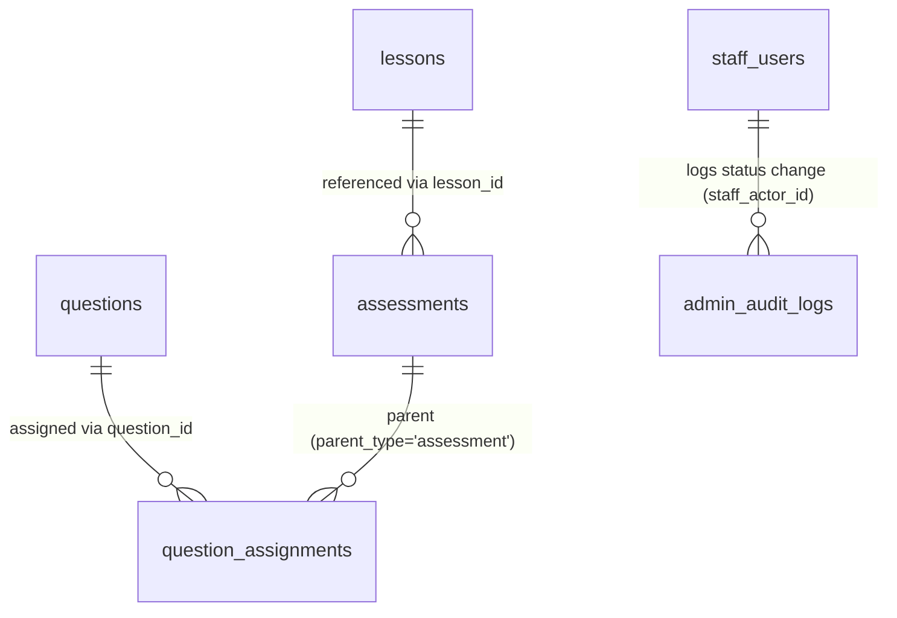

# UC-34 — Quản Lý Trạng Thái Nội Dung Đã Xuất Bản (Manage Published Content Status)

> **Feature:** `feat-content-review` | **Phiên bản:** 1.0 | **Trạng thái:** Draft
> **Actor chính:** StaffManager
> **Tham chiếu FR:** FR-34-01 → FR-34-24 (chi tiết hóa từ FR-REVIEW-10..12 trong `feat-content-review/SPEC.md`)
> **Liên quan:** UC-33 (Review Submitted Content — luồng `pending_review` → `published`), UC-24..UC-28 (Staff soạn thảo học liệu), UC-28 (Manage JLPT Mock Exams — đề thi tham chiếu câu hỏi), UC-37 (Admin Manage Users)
> **Cập nhật:** 2026-06-12

---

## 1. CONTEXT & GOAL

### 1.1 Bối cảnh

Sau khi học liệu (`courses`, `lessons`, `grammar_points`, `vocabulary`, `kanji`, `questions`, `assessments`) đã được StaffManager phê duyệt ở UC-33 và chuyển sang `status = 'published'`, nội dung đó hiển thị công khai cho học viên qua các Student-facing API (trang học, tìm kiếm, sinh đề luyện tập ngẫu nhiên, đề thi thử).

Trong quá trình vận hành, nội dung đã xuất bản có thể trở nên lỗi thời, sai sót, hoặc cần gỡ tạm để chỉnh sửa. **UC-34** trao cho **StaffManager** quyền điều phối **vòng đời sau xuất bản** của nội dung: **Unpublish** (thu hồi tạm, đưa về `draft`), **Archive** (lưu trữ), **Delete** (xóa mềm — trạng thái cuối), và **Restore** (khôi phục nội dung đã `archived` về `published`).

Tất cả các thao tác này là **soft delete** (chỉ cập nhật cột `status`, không xóa vật lý bản ghi) và phải bảo toàn toàn vẹn tham chiếu: không được phép ẩn một câu hỏi đang nằm trong **đề thi đã published** vì sẽ gây lỗi tính điểm / NPE cho học viên đang làm bài (LESSON-005, Domain Rule §7.1).

### 1.2 Mục tiêu

- Cho phép StaffManager **xem danh sách phân trang** mọi nội dung đang `published` trên tất cả bảng học liệu, có lọc theo loại nội dung và cấp độ JLPT.
- Cho phép StaffManager **xem chi tiết** một mục nội dung đã xuất bản (kèm danh sách tài nguyên đang tham chiếu) trước khi đổi trạng thái.
- Cho phép StaffManager **Unpublish / Archive / Delete** nội dung đã xuất bản bằng cơ chế **soft delete** (chỉ đổi `status`).
- Bắt buộc nhập **reason** khi Unpublish / Archive / Delete.
- **Chặn** thao tác ẩn (unpublish/archive/delete) nếu nội dung đang được **tham chiếu bởi nội dung active** (câu hỏi trong đề thi published, lesson/assessment được nội dung active trỏ tới) → trả **HTTP 409 `RESOURCE_IN_USE`** kèm danh sách tham chiếu.
- Cho phép **Restore** nội dung **`archived`** trở lại `published`; **không** áp dụng cho `deleted` (trạng thái cuối).
- Bảo đảm nội dung `archived` / `deleted` / `unpublished (draft)` **không hiển thị** ở bất kỳ Student-facing API nào.
- Ghi **audit log** đầy đủ cho mọi hành động đổi trạng thái vào `admin_audit_logs`.

### 1.3 Tại sao cần?

Nếu nội dung đã xuất bản không có cơ chế thu hồi/lưu trữ có kiểm soát, các bài học sai hoặc đề thi lỗi thời vẫn hiển thị cho học viên, ảnh hưởng chất lượng đào tạo và tính chính xác điểm số. Quan trọng hơn, **unpublish đột ngột một câu hỏi đang nằm trong đề thi thử đang mở** sẽ phá vỡ tham chiếu (`question_assignments` → `assessments`) và gây lỗi nghiêm trọng khi học viên nộp bài. Rule chặn `RESOURCE_IN_USE` (FR-34-12..15) và nguyên tắc chỉ soft delete (ADR-004) bảo vệ tính toàn vẹn dữ liệu và trải nghiệm học viên.

---

## 2. ACTOR

| Actor | Role | Điều kiện tiền quyết (Precondition) |
|:---|:---|:---|
| **StaffManager** | Xem danh sách published, xem chi tiết, Unpublish / Archive / Delete / Restore nội dung đã xuất bản | Đã đăng nhập JWT hợp lệ, vai trò Staff với phân quyền `staff_manager`, `status = 'active'` |
| **Staff** | (Tham chiếu) Người soạn thảo; nhận lại nội dung `draft` khi bị unpublish để chỉnh sửa | Ngoài phạm vi UC-34 — xem UC-24..UC-28 |
| **Student** | (Tham chiếu) Người tiêu thụ nội dung `published`; KHÔNG bao giờ thấy nội dung `archived`/`deleted`/`draft` | Ngoài phạm vi UC-34 |
| **Hệ thống (System)** | Xác thực phân quyền, kiểm tra ràng buộc tham chiếu, đổi trạng thái, ghi audit log | — |

**Postconditions:**

- **Thành công (Unpublish):** `status = 'draft'`; `published_at` được giữ nguyên hoặc đặt `NULL` theo quy ước; reason ghi vào `admin_audit_logs.description`; audit log được ghi.
- **Thành công (Archive):** `status = 'archived'`; bản ghi được bảo toàn; reason ghi audit; audit log được ghi.
- **Thành công (Delete):** `status = 'deleted'`; bản ghi **không** bị xóa vật lý; reason ghi audit; audit log được ghi.
- **Thành công (Restore):** `status` từ `'archived'` → `'published'`; audit log được ghi.
- **Thất bại:** Không thay đổi dữ liệu; giao dịch rollback; trả mã lỗi rõ ràng (đặc biệt 409 `RESOURCE_IN_USE` kèm danh sách tham chiếu).

---

## 3. FUNCTIONAL REQUIREMENTS (EARS)

> **EARS Syntax:** `WHEN [trigger] THE SYSTEM SHALL [behavior]` · `WHILE [state] …` · `IF [condition] THEN THE SYSTEM SHALL [response]` · `THE SYSTEM SHALL [ubiquitous]`

### 3.1 Truy cập & Phân quyền (Rule 1)

| ID | EARS Requirement |
|:---|:---|
| FR-34-01 | THE SYSTEM SHALL restrict every endpoint under `/api/manager/**` to authenticated users whose Staff role is `staff_manager`; any other role (`staff`, `student`, unauthenticated) SHALL receive HTTP 403 `FORBIDDEN` (or 401 if JWT is missing/expired). |
| FR-34-02 | THE SYSTEM SHALL enforce the `staff_manager` authorization check at the Service Layer (not only the UI) to prevent bypass (Constitution §3.1, NFR-REVIEW-03). |

### 3.2 Liệt kê nội dung đã xuất bản — `GET /api/manager/published-contents` (Rule 3)

| ID | EARS Requirement |
|:---|:---|
| FR-34-03 | WHEN a StaffManager requests the published-content list, THE SYSTEM SHALL return ONLY items whose `status = 'published'` across the tables `courses`, `lessons`, `grammar_points`, `vocabulary`, `kanji`, `questions`, `assessments`. |
| FR-34-04 | THE SYSTEM SHALL return the list as a paginated result ordered by `published_at` descending (most recently published first). |
| FR-34-05 | WHEN the query parameter `type` is provided, THE SYSTEM SHALL return only items of that content type within {`course`,`lesson`,`grammar`,`vocabulary`,`kanji`,`question`,`assessment`}. |
| FR-34-06 | WHEN the query parameter `jlptLevel` is provided, THE SYSTEM SHALL filter items to that level within {`N5`,`N4`,`N3`,`N2`,`N1`}. |

### 3.3 Xem chi tiết nội dung — `GET /api/manager/contents/{contentId}` (Rule 6)

| ID | EARS Requirement |
|:---|:---|
| FR-34-07 | WHEN a StaffManager requests a content item detail with a `contentType` discriminator, THE SYSTEM SHALL return its full detail mapped to a Response DTO, including current `status`, `publishedAt`, and a `references` list of active resources that depend on this item. |
| FR-34-08 | IF the requested `contentId` (for the given `contentType`) does not exist, THEN THE SYSTEM SHALL return HTTP 404 `CONTENT_NOT_FOUND`. |
| FR-34-09 | THE SYSTEM SHALL NOT return the JPA entity directly; it SHALL map the content to a dedicated `*Response` DTO (ADR-005). |

### 3.4 Đổi trạng thái xuất bản — `PUT /api/manager/contents/{contentId}/status` (Rule 2, 4)

| ID | EARS Requirement |
|:---|:---|
| FR-34-10 | WHEN a StaffManager sets a content item to `unpublished` (→ `draft`), `archived`, or `deleted`, THE SYSTEM SHALL perform a **soft delete** by updating ONLY the `status` column and SHALL preserve the physical record (ADR-004); it SHALL NEVER execute `DELETE FROM`. |
| FR-34-11 | IF the request to Unpublish / Archive / Delete has a missing, blank, or whitespace-only `reason`, THEN THE SYSTEM SHALL reject with HTTP 400 `REASON_REQUIRED` and SHALL NOT change the item status. |
| FR-34-12 | THE SYSTEM SHALL accept `status` transitions only within the allowed target set {`unpublished`,`archived`,`deleted`}; any other target SHALL produce HTTP 400 `VALIDATION_FAILED`. |
| FR-34-13 | WHEN a status change succeeds, THE SYSTEM SHALL set `updated_at = SYSUTCDATETIME()` and return HTTP 200 with `contentId`, `contentType`, and the new `status`. |

### 3.5 Ràng buộc tham chiếu — RESOURCE_IN_USE (Rule 5, 6, 7)

| ID | EARS Requirement |
|:---|:---|
| FR-34-14 | IF a StaffManager attempts to unpublish / archive / delete a **question** that is currently assigned (via `question_assignments`) to at least one **assessment whose `status = 'published'`**, THEN THE SYSTEM SHALL reject the request with HTTP 409 `RESOURCE_IN_USE` and SHALL NOT change the item status. |
| FR-34-15 | IF a StaffManager attempts to unpublish / archive / delete a **lesson** or **assessment** that is currently referenced by active content (e.g., a `published` assessment referencing the lesson via `assessments.lesson_id`, or active `question_assignments` pointing to it), THEN THE SYSTEM SHALL check referencing resources before hiding and, when blocking references exist, reject with HTTP 409 `RESOURCE_IN_USE`. |
| FR-34-16 | WHEN the system blocks a status change due to active references (FR-34-14, FR-34-15), THE SYSTEM SHALL return in the response body a `references` array listing each blocking resource with `referenceType`, `referenceId`, and `referenceTitle`. |
| FR-34-17 | THE SYSTEM SHALL evaluate the reference-integrity check (FR-34-14, FR-34-15) **inside the same transaction** as the status update, using a guarded query, so no referencing item can become active between the check and the commit. |

### 3.6 Khôi phục nội dung — `POST /api/manager/contents/{contentId}/restore` (Rule 8)

| ID | EARS Requirement |
|:---|:---|
| FR-34-18 | WHEN a StaffManager restores a content item whose current `status = 'archived'`, THE SYSTEM SHALL set `status = 'published'` and return HTTP 200. |
| FR-34-19 | IF a StaffManager attempts to restore a content item whose current `status = 'deleted'`, THEN THE SYSTEM SHALL reject with HTTP 409 `RESTORE_NOT_ALLOWED`, because `deleted` is a terminal state. |
| FR-34-20 | IF a StaffManager attempts to restore a content item whose current `status` is neither `archived` nor `deleted` (e.g., already `published`), THEN THE SYSTEM SHALL reject with HTTP 409 `INVALID_STATE_TRANSITION`. |

### 3.7 Hiển thị Student-facing (Rule 3)

| ID | EARS Requirement |
|:---|:---|
| FR-34-21 | THE SYSTEM SHALL exclude any content item whose `status ∈ {'draft','rejected','archived','deleted','pending_review'}` from every Student-facing endpoint (study pages, search, random practice generators, mock exams); only `status = 'published'` SHALL be visible to students. |
| FR-34-22 | WHEN an item is unpublished, archived, or deleted, THE SYSTEM SHALL make the exclusion take effect immediately (within the same transaction), so no student request served after the commit returns the hidden item. |

### 3.8 Audit & Ràng buộc chung (Rule 9)

| ID | EARS Requirement |
|:---|:---|
| FR-34-23 | THE SYSTEM SHALL write exactly one row to `admin_audit_logs` for every status change (unpublish/archive/delete/restore) with `staff_actor_id = StaffManagerId`, `action ∈ {'unpublish_content','archive_content','delete_content','restore_content'}`, `target_table`, `target_id`, and `description = reason`. |
| FR-34-24 | THE SYSTEM SHALL execute the reference check, the status update, and the audit-log write inside the same `@Transactional` Service method so that a failure of any step rolls back all of them; it SHALL log via SLF4J in the format `[INFO] StaffManager {managerId} {action} {contentType} {contentId}` and SHALL NOT use `System.out.println`. |

---

## 4. NON-FUNCTIONAL REQUIREMENTS

| ID | Category | Requirement |
|:---|:---|:---|
| NFR-34-01 | Soft Delete (ADR-004) | Unpublish / Archive / Delete chỉ đổi cột `status`; TUYỆT ĐỐI không `DELETE FROM`; bản ghi luôn được bảo toàn để phục vụ audit và khôi phục. |
| NFR-34-02 | Data Integrity | Kiểm tra tham chiếu (`question_assignments` → `assessments` published; `assessments.lesson_id`) phải chạy **trong cùng transaction** với UPDATE status (FR-34-17) để tránh race condition. |
| NFR-34-03 | Performance | Truy vấn `published-contents` phải < 300ms (p95); cột `status` của mọi bảng học liệu phải có index (đã có `IX_questions_public_bank`, `IX_assessments_public_list`, …). |
| NFR-34-04 | Security | Vai trò `staff` thường và `student` tuyệt đối không truy cập được `/api/manager/**`; trả 401/403. KHÔNG bypass Spring Security / JWT. |
| NFR-34-05 | Architecture | Controller chỉ nhận/trả DTO (`*Request`/`*Response`); KHÔNG trả Entity trực tiếp (ADR-005). |
| NFR-34-06 | Logging & Audit | Mọi hành động đổi trạng thái ghi `admin_audit_logs` + SLF4J (Constitution §3.1 — Staff audit log bắt buộc, không được bỏ qua). |
| NFR-34-07 | Validation | Dùng `@Valid` + Jakarta Bean Validation trên mọi `@RequestBody`; `reason` bắt buộc với Unpublish/Archive/Delete được validate ở backend, không tin client. |
| NFR-34-08 | Consistency (Student-facing) | Mọi truy vấn Student-facing phải lọc `status = 'published'` ở tầng Repository/Service; không dựa vào việc ẩn UI để bảo mật dữ liệu (CLAUDE.md — Authorization by UI hide là anti-pattern). |

---

## 5. DATA MODEL

### 5.1 Bảng chính liên quan

> Nguồn: `apps/backend/src/main/resources/db/migration/V1__init_schema.sql`. Trạng thái xuất bản được quản lý qua cột `status` chung ở tất cả bảng học liệu.

Các bảng nội dung chịu quản lý trạng thái (đều có chung bộ cột workflow):

| Bảng | Khóa chính | Cột tiêu đề/định danh hiển thị |
|:---|:---|:---|
| `courses` | `course_id` | `title` |
| `lessons` | `lesson_id` | `title` |
| `grammar_points` | `grammar_id` | `title` / `pattern` |
| `vocabulary` | `vocab_id` | `word` |
| `kanji` | `kanji_id` | `character` |
| `questions` | `question_id` | `question_text` |
| `assessments` | `assessment_id` | `title` |

Miền giá trị chung của cột `status` (mọi bảng học liệu):

```sql
CHECK (status IN ('draft','pending_review','rejected','published','archived','deleted'))
```

> **Quy ước trạng thái cho UC-34:**
>
> - `Unpublish` → `status = 'draft'` (trả về vùng làm việc của Staff để sửa).
> - `Archive`  → `status = 'archived'` (có thể Restore).
> - `Delete`   → `status = 'deleted'` (**trạng thái cuối** — không Restore — Rule 8).

### 5.2 Bảng tham chiếu phục vụ kiểm tra RESOURCE_IN_USE

```sql
-- 12. questions (trích): nội dung câu hỏi, có status workflow
questions (
    question_id  BIGINT PRIMARY KEY,
    question_text NVARCHAR(MAX) NOT NULL,
    status       NVARCHAR(20) NOT NULL DEFAULT 'draft',   -- 'published' khi đang dùng
    ...
)

-- 14. assessments (trích): đề thi/quiz, có status workflow + lesson_id
assessments (
    assessment_id BIGINT PRIMARY KEY,
    assessment_type NVARCHAR(20) NOT NULL,                -- 'quiz' | 'exam'
    title        NVARCHAR(255) NOT NULL,
    lesson_id    BIGINT NULL,                             -- FK lessons(lesson_id)
    status       NVARCHAR(20) NOT NULL DEFAULT 'draft',
    ...
)

-- 15. question_assignments: gán câu hỏi vào assessment/lesson
question_assignments (
    assignment_id BIGINT PRIMARY KEY,
    parent_type  NVARCHAR(30) NOT NULL,                   -- 'assessment' | 'lesson'
    parent_id    BIGINT NOT NULL,                         -- assessment_id / lesson_id
    question_id  BIGINT NOT NULL,                         -- FK questions(question_id)
    CONSTRAINT UQ_assign UNIQUE (parent_type, parent_id, question_id)
)
```

**Truy vấn guard kiểm tra "question đang trong đề thi published" (FR-34-14):**

```sql
SELECT a.assessment_id, a.title
FROM   question_assignments qa
JOIN   assessments a ON a.assessment_id = qa.parent_id
WHERE  qa.parent_type = 'assessment'
  AND  qa.question_id = :questionId
  AND  a.status = 'published';
-- Nếu trả về >= 1 dòng ⇒ HTTP 409 RESOURCE_IN_USE, kèm danh sách (assessment_id, title)
```

**Truy vấn guard kiểm tra "lesson đang được assessment published tham chiếu" (FR-34-15):**

```sql
SELECT a.assessment_id, a.title
FROM   assessments a
WHERE  a.lesson_id = :lessonId
  AND  a.status = 'published';
```

### 5.3 Bảng lưu vết

```sql
-- admin_audit_logs (Bảng 22)
CREATE TABLE admin_audit_logs (
    audit_id        BIGINT IDENTITY(1,1) PRIMARY KEY,
    admin_actor_id  BIGINT          NULL,
    staff_actor_id  BIGINT          NULL,    -- StaffManager thực hiện (FR-34-23)
    action          NVARCHAR(100)   NOT NULL,-- 'unpublish_content' | 'archive_content' | 'delete_content' | 'restore_content'
    target_table    NVARCHAR(100)   NULL,    -- 'questions','assessments','lessons',...
    target_id       BIGINT          NULL,    -- khóa chính của nội dung
    description     NVARCHAR(MAX)   NULL,    -- reason
    ip_address      NVARCHAR(45)    NULL,
    created_at      DATETIME2       NOT NULL DEFAULT SYSUTCDATETIME()
);
```

### 5.4 Quan hệ



### 5.5 Vòng đời trạng thái (State machine — phạm vi UC-34)

```
                 Unpublish (FR-34-10)
   published ───────────────────────────►  draft   (Staff sửa & gửi duyệt lại — UC-33)
      │  ▲
      │  │ Restore (FR-34-18)
      │  └───────────────────────────────  archived
      │            Archive (FR-34-10)
      ├──────────────────────────────────►  archived
      │
      │            Delete (FR-34-10)
      └──────────────────────────────────►  deleted   ✗ (terminal — Restore bị chặn, FR-34-19)

   * Unpublish/Archive/Delete chỉ thao tác trên item đang 'published'.
   * Mọi thao tác ẩn đều phải qua kiểm tra tham chiếu (FR-34-14..17) ⇒ có thể 409 RESOURCE_IN_USE.
   * Restore chỉ hợp lệ khi item đang 'archived' (FR-34-18); 'deleted' là trạng thái cuối (FR-34-19).
```

---

## 6. API SPEC

> Tất cả endpoint: **Auth = Bearer JWT (role `staff_manager`)**. Định dạng response chuẩn `{ status, message, data }` (AGENTS.md §6). `contentType ∈ {course,lesson,grammar,vocabulary,kanji,question,assessment}`.

### 6.1 `GET /api/manager/published-contents` — Danh sách nội dung đã xuất bản

**Query params:**

| Param | Kiểu | Bắt buộc | Mô tả |
|:---|:---|:---:|:---|
| `type` | enum | Không | Lọc theo loại nội dung (FR-34-05) |
| `jlptLevel` | enum | Không | `N5\|N4\|N3\|N2\|N1` (FR-34-06) |
| `page` | int | Không | Mặc định 0 |
| `size` | int | Không | Mặc định 20, tối đa 100 |

**Response (200):**

```json
{
  "status": 200,
  "message": "Lấy danh sách nội dung đã xuất bản thành công",
  "data": {
    "content": [
      {
        "contentId": 105,
        "contentType": "question",
        "titleOrText": "N5 Kanji: '水' đọc là gì?",
        "jlptLevel": "N5",
        "status": "published",
        "publishedAt": "2026-06-10T09:00:00Z"
      }
    ],
    "totalElements": 1,
    "totalPages": 1
  }
}
```

### 6.2 `GET /api/manager/contents/{contentId}` — Chi tiết + tham chiếu

**Query params:** `contentType` (bắt buộc) — xác định bảng nguồn của `contentId`.

**Response (200):**

```json
{
  "status": 200,
  "message": "OK",
  "data": {
    "contentId": 105,
    "contentType": "question",
    "titleOrText": "N5 Kanji: '水' đọc là gì?",
    "jlptLevel": "N5",
    "status": "published",
    "publishedAt": "2026-06-10T09:00:00Z",
    "references": [
      { "referenceType": "assessment", "referenceId": 24, "referenceTitle": "Đề thi thử N5 - Tháng 6" }
    ]
  }
}
```

### 6.3 `PUT /api/manager/contents/{contentId}/status` — Unpublish / Archive / Delete

**Request:**

```json
{
  "contentType": "assessment",
  "status": "archived",
  "reason": "Đề thi thử cũ năm 2024 không còn phù hợp với cấu trúc đề thi mới."
}
```

| Trường | Kiểu | Bắt buộc | Ghi chú |
|:---|:---|:---:|:---|
| `contentType` | enum | ✅ | Bảng nguồn |
| `status` | enum | ✅ | `unpublished` \| `archived` \| `deleted` (FR-34-12) |
| `reason` | string | ✅ | **Bắt buộc** (FR-34-11), 10–500 ký tự |

**Response (200) — thành công:**

```json
{
  "status": 200,
  "message": "Cập nhật trạng thái xuất bản thành công",
  "data": { "contentId": 24, "contentType": "assessment", "status": "archived" }
}
```

**Response (409) — bị chặn vì đang được tham chiếu (FR-34-14, FR-34-16):**

```json
{
  "status": 409,
  "message": "Câu hỏi đang được sử dụng trong đề thi đang hoạt động, không thể thu hồi",
  "data": {
    "errorCode": "RESOURCE_IN_USE",
    "references": [
      { "referenceType": "assessment", "referenceId": 2, "referenceTitle": "Đề thi thử N5 - Tháng 6" },
      { "referenceType": "assessment", "referenceId": 7, "referenceTitle": "Quiz Ngữ pháp N5 - Bài 3" }
    ]
  }
}
```

### 6.4 `POST /api/manager/contents/{contentId}/restore` — Khôi phục

**Request:**

```json
{
  "contentType": "assessment"
}
```

| Trường | Kiểu | Bắt buộc | Ghi chú |
|:---|:---|:---:|:---|
| `contentType` | enum | ✅ | Bảng nguồn |

**Response (200) — thành công:**

```json
{
  "status": 200,
  "message": "Khôi phục nội dung thành công",
  "data": { "contentId": 24, "contentType": "assessment", "status": "published" }
}
```

**Response (409) — cố khôi phục nội dung đã `deleted` (FR-34-19):**

```json
{
  "status": 409,
  "message": "Nội dung đã bị xóa không thể khôi phục (trạng thái cuối)",
  "data": { "errorCode": "RESTORE_NOT_ALLOWED" }
}
```

---

## 7. ERROR HANDLING

| HTTP | Error Code | Message | Trigger |
|:---:|:---|:---|:---|
| 400 | `VALIDATION_FAILED` | "Dữ liệu yêu cầu không hợp lệ" | `status`/`contentType` sai miền giá trị (FR-34-12) |
| 400 | `REASON_REQUIRED` | "Phải nhập lý do khi thu hồi, lưu trữ hoặc xóa nội dung" | `reason` rỗng/khoảng trắng khi Unpublish/Archive/Delete (FR-34-11) |
| 401 | `UNAUTHORIZED` | "Yêu cầu đăng nhập" | JWT thiếu hoặc hết hạn |
| 403 | `FORBIDDEN` | "Tài khoản không có thẩm quyền quản lý nội dung xuất bản" | Không phải `staff_manager` (FR-34-01) |
| 404 | `CONTENT_NOT_FOUND` | "Không tìm thấy nội dung" | `contentId`/`contentType` sai (FR-34-08) |
| 409 | `RESOURCE_IN_USE` | "Nội dung đang được tham chiếu bởi tài nguyên đang hoạt động, không thể ẩn" | Question trong đề thi published / lesson-assessment được nội dung active trỏ tới (FR-34-14, FR-34-15) — kèm `references` |
| 409 | `RESTORE_NOT_ALLOWED` | "Nội dung đã bị xóa không thể khôi phục (trạng thái cuối)" | Restore item `deleted` (FR-34-19) |
| 409 | `INVALID_STATE_TRANSITION` | "Chuyển trạng thái không hợp lệ" | Restore item không phải `archived`/`deleted`, hoặc Unpublish/Archive/Delete item không phải `published` (FR-34-20) |
| 500 | `INTERNAL_ERROR` | "Internal server error" | Lỗi hệ thống / CSDL |

---

## 8. ACCEPTANCE CRITERIA

| ID | Scenario | Given | When | Then |
|:---|:---|:---|:---|:---|
| AC-34-01 | Liệt kê chỉ nội dung published | 4 item `published`, 6 item ở trạng thái khác | GET /api/manager/published-contents | HTTP 200; trả đúng 4 item `published`, sắp xếp `published_at` giảm dần |
| AC-34-02 | Lọc theo loại & cấp độ | Có question N5 và assessment N3 published | GET /published-contents?type=question&jlptLevel=N5 | HTTP 200; chỉ trả question N5 |
| AC-34-03 | Chặn role không hợp lệ | Đăng nhập role `staff` thường | GET /api/manager/published-contents | HTTP 403 `FORBIDDEN` |
| AC-34-04 | Xem chi tiết + tham chiếu | Question 105 published, nằm trong assessment 24 | GET /api/manager/contents/105?contentType=question | HTTP 200; `references` chứa assessment 24 |
| AC-34-05 | Chi tiết không tồn tại | `contentId=999` không có | GET /api/manager/contents/999 | HTTP 404 `CONTENT_NOT_FOUND` |
| AC-34-06 | Archive thành công (soft delete) | Assessment 24 published, không bị tham chiếu | PUT /contents/24/status `status=archived`, reason hợp lệ | HTTP 200; `status='archived'`; bản ghi VẪN tồn tại; audit log `archive_content` ghi |
| AC-34-07 | Bắt buộc reason | `status=deleted`, không có `reason` | PUT /contents/24/status | HTTP 400 `REASON_REQUIRED`; status không đổi |
| AC-34-08 | Chặn unpublish câu hỏi đang thi | Question 1 nằm trong assessment 2 `published` | PUT /contents/1/status `status=archived` | HTTP 409 `RESOURCE_IN_USE`, body có `references=[assessment 2]`; status không đổi |
| AC-34-09 | Unpublish hợp lệ → draft | Question 9 published, không bị tham chiếu | PUT /contents/9/status `status=unpublished`, reason hợp lệ | HTTP 200; `status='draft'`; không còn hiển thị Student-facing |
| AC-34-10 | Delete là soft delete | Lesson 5 published, không bị tham chiếu | PUT /contents/5/status `status=deleted`, reason hợp lệ | HTTP 200; `status='deleted'`; bản ghi vẫn còn trong DB (không `DELETE FROM`) |
| AC-34-11 | Restore nội dung archived | Assessment 24 đang `archived` | POST /contents/24/restore | HTTP 200; `status='published'`; audit log `restore_content` ghi |
| AC-34-12 | Cấm restore nội dung deleted | Question 9 đang `deleted` | POST /contents/9/restore | HTTP 409 `RESTORE_NOT_ALLOWED`; status không đổi |
| AC-34-13 | Ẩn khỏi Student-facing tức thì | Question vừa được archive | GET Student-facing study/search/practice | Item không xuất hiện trong bất kỳ kết quả nào |
| AC-34-14 | Audit log đầy đủ | Mọi thao tác đổi trạng thái thành công | Unpublish/Archive/Delete/Restore | 1 dòng `admin_audit_logs` với `staff_actor_id`, `action`, `target_table`, `target_id`, `description=reason` |
| AC-34-15 | Transaction nguyên tử | Lỗi khi ghi audit log | PUT /contents/{id}/status | Đổi `status` được rollback; HTTP 500 `INTERNAL_ERROR` |

---

## 9. OUT OF SCOPE

- ❌ **Phê duyệt nội dung `pending_review`** (Approve / Reject / Request Changes) — thuộc **UC-33**.
- ❌ **Soạn thảo / chỉnh sửa nội dung** học liệu — thuộc Staff (UC-24..UC-28); UC-34 chỉ đổi trạng thái, không sửa nội dung.
- ❌ **Gửi duyệt lại (re-submit for review)** nội dung đã unpublish về `draft` — Staff thực hiện qua UC-24..UC-28.
- ❌ **Khôi phục nội dung `deleted`** — `deleted` là trạng thái cuối; phục hồi (nếu cần) là tác vụ Admin đặc biệt ngoài 4 API của UC-34.
- ❌ **Hard delete / dọn dẹp vật lý** bản ghi cũ — chỉ soft delete bằng đổi `status` (ADR-004).
- ❌ **Versioning nội dung** đã xuất bản — Phase 2.
- ❌ **Thông báo email/in-app** cho Staff khi nội dung bị unpublish/archive — xử lý qua module Notification (ngoài 4 API của UC-34).
- ❌ **Quản lý người dùng / phân quyền Staff** — thuộc UC-37 (Admin Manage Users).
