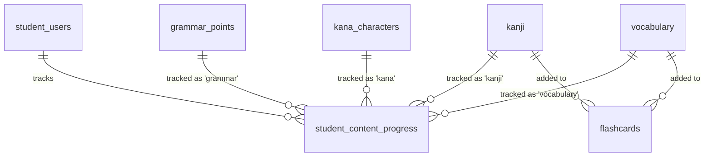

# SPEC — Core Learning Content
>
> **Feature ID:** `feat-core-learning`
> **UC Coverage:** UC-06 (Grammar), UC-07 (Kanji), UC-08 (Kana), UC-09 (Vocabulary)
> **Version:** 1.0 | **Status:** Draft
> **Author:** Team | **Last Updated:** 2026-05-28

---

## 1. CONTEXT & GOAL

### 1.1 Bối cảnh

Nội dung học tập cốt lõi là trái tim của nền tảng JLPT. Học viên cần học bốn khối kiến thức nền tảng — Ngữ pháp, Kanji, Kana và Từ vựng — được tổ chức theo cấp độ N5→N1 trước khi luyện tập kỹ năng nâng cao.

### 1.2 Mục tiêu

- Cung cấp nội dung học Ngữ pháp, Kanji, Kana, Từ vựng có cấu trúc theo JLPT level
- Theo dõi tiến độ học từng mục nội dung của học viên
- Cho phép đánh dấu "đã học" và thêm vào Flashcard
- Hiển thị nội dung phong phú: audio, hình ảnh nét viết, câu ví dụ song ngữ

### 1.3 Tại sao cần?

Không có nội dung học → không có lý do để học viên ở lại nền tảng. Đây là core value proposition của sản phẩm.

---

## 2. ACTOR

| Actor | Role | Điều kiện tiền quyết |
|:---|:---|:---|
| **Student** | Học viên học nội dung | Đã đăng nhập (JWT valid), status = `active` |
| **Staff** | Tạo/chỉnh sửa nội dung | Đăng nhập Staff — xem `feat-content-management` |

---

## 3. FUNCTIONAL REQUIREMENTS (EARS)

### 3.1 UC-06 — Học Ngữ pháp (Learn Grammar)

| ID | EARS Requirement |
|:---|:---|
| FR-LEARN-01 | WHEN an authenticated Student selects a JLPT level (N5–N1), THE SYSTEM SHALL display a list of grammar points filtered by `jlpt_level` with status `published`. |
| FR-LEARN-02 | WHEN a Student opens a grammar point, THE SYSTEM SHALL display: structure, formula, meaning, usage_explanation, and a list of example sentences (Japanese + Vietnamese translation). |
| FR-LEARN-03 | WHEN a Student marks a grammar point as "completed", THE SYSTEM SHALL upsert a record in `student_content_progress` with `content_type = 'grammar'`, `status = 'completed'`. |
| FR-LEARN-04 | WHILE a grammar point has `status != 'published'`, THE SYSTEM SHALL NOT expose it to Student endpoints. |

### 3.2 UC-07 — Học Kanji (Learn Kanji)

> 📌 **Spec chuyên sâu:** [`feat-kanji/SPEC.md`](../feat-kanji/SPEC.md) — lọc theo level N5→N1, số nét, bộ thủ; chi tiết API, error & acceptance. Phần dưới đây chỉ là yêu cầu tổng quan.

| ID | EARS Requirement |
|:---|:---|
| FR-LEARN-10 | WHEN a Student selects a JLPT level, THE SYSTEM SHALL display a list of Kanji characters filtered by `jlpt_level` with `status = 'published'`. |
| FR-LEARN-11 | WHEN a Student opens a Kanji detail page, THE SYSTEM SHALL display: character_value, stroke_count, stroke_order_url (static image), onyomi, kunyomi, meaning (Vietnamese), and example_words. |
| FR-LEARN-12 | WHEN a Student marks a Kanji as "completed", THE SYSTEM SHALL upsert a `student_content_progress` record with `content_type = 'kanji'`. |
| FR-LEARN-13 | WHEN a Student clicks "Add to Flashcard" on a Kanji, THE SYSTEM SHALL create a `flashcards` record with `content_type = 'kanji'` and link it to the student's personal deck. |
| FR-LEARN-14 | THE SYSTEM SHALL serve `stroke_order_url` as a static image URL (stored in /uploads or S3) and SHALL NOT serve animated stroke-order or evaluate stroke direction. |

### 3.3 UC-08 — Học Kana (Learn Kana)

| ID | EARS Requirement |
|:---|:---|
| FR-LEARN-20 | WHEN a Student selects Hiragana or Katakana, THE SYSTEM SHALL display the full character chart from `kana_characters` filtered by `type`. |
| FR-LEARN-21 | WHEN a Student clicks on a Kana character, THE SYSTEM SHALL display the character, its romanization, `audio_url` for pronunciation, and `stroke_order_url` as a static image. |
| FR-LEARN-22 | WHEN a Student marks a Kana character as "completed", THE SYSTEM SHALL upsert a `student_content_progress` record with `content_type = 'kana'`. |
| FR-LEARN-23 | THE SYSTEM SHALL allow the browser to play audio from `audio_url` directly without requiring a separate API call. |

### 3.4 UC-09 — Học Từ vựng (Learn Vocabulary)

> 📌 **Spec chuyên sâu:** [`feat-vocabulary/SPEC.md`](../feat-vocabulary/SPEC.md) — lọc theo level N5→N1 + topic, tìm kiếm; chi tiết API, error & acceptance. Phần dưới đây chỉ là yêu cầu tổng quan.

| ID | EARS Requirement |
|:---|:---|
| FR-LEARN-30 | WHEN a Student selects a topic or JLPT level, THE SYSTEM SHALL display vocabulary items from `vocabulary` matching the filter with `status = 'published'`. |
| FR-LEARN-31 | WHEN a Student views a vocabulary item, THE SYSTEM SHALL display: word, furigana, meaning (Vietnamese), jlpt_level, topic, audio_url, and example_sentence with translation. |
| FR-LEARN-32 | WHEN a Student marks vocabulary as "completed", THE SYSTEM SHALL upsert a `student_content_progress` record with `content_type = 'vocabulary'`. |
| FR-LEARN-33 | WHEN a Student clicks "Add to Flashcard" on a vocabulary item, THE SYSTEM SHALL create a `flashcards` record with `content_type = 'vocabulary'`. |
| FR-LEARN-34 | THE SYSTEM SHALL support filtering vocabulary by both `topic` (e.g., "Nhà hàng", "Du lịch") AND `jlpt_level` simultaneously. |

### 3.5 Quy tắc chung (Cross-cutting)

| ID | EARS Requirement |
|:---|:---|
| FR-LEARN-40 | THE SYSTEM SHALL track `progress_percent` in `student_content_progress` incrementally and SHALL NOT allow progress to decrease manually. |
| FR-LEARN-41 | WHILE a content item has `is_deleted = 1`, THE SYSTEM SHALL treat it as non-existent and return HTTP 404. |
| FR-LEARN-42 | THE SYSTEM SHALL log every content view to update `student_users.last_activity_date` for streak calculation. |

---

## 4. NON-FUNCTIONAL REQUIREMENTS

| ID | Category | Requirement |
|:---|:---|:---|
| NFR-LEARN-01 | Performance | Content list API phải phản hồi < 300ms (p95) với dữ liệu paginated (max 50 items/page) |
| NFR-LEARN-02 | Performance | Audio/image files phải được serve qua CDN hoặc pre-signed URL, không qua Spring Boot |
| NFR-LEARN-03 | Security | Tất cả endpoints yêu cầu JWT hợp lệ; nội dung VIP (`is_vip_only = 1`) phải kiểm tra subscription |
| NFR-LEARN-04 | Correctness | JLPT level data phải đúng chuẩn — không mix N1 content vào N5 |
| NFR-LEARN-05 | Logging | SLF4J — log content access với `{studentId, contentType, contentId}` |
| NFR-LEARN-06 | Data Integrity | `student_content_progress` phải upsert (INSERT OR UPDATE) — không tạo duplicate |

---

## 5. DATA MODEL

### 5.1 Bảng chính

> Nguồn: [`jlpt_database_v2.sql`](file:///d:/Japanese-Skill-Practice-Platform/3.src/infra/Database/jlpt_database_v2.sql)

```sql
-- Bảng 9: grammar_points
CREATE TABLE grammar_points (
    grammar_id          BIGINT IDENTITY(1,1) PRIMARY KEY,
    structure           NVARCHAR(255)  NOT NULL,
    formula             NVARCHAR(500)  NULL,
    meaning             NVARCHAR(500)  NOT NULL,
    usage_explanation   NVARCHAR(MAX)  NULL,
    jlpt_level          NVARCHAR(5)    NOT NULL
        CHECK (jlpt_level IN ('N5','N4','N3','N2','N1')),
    example_sentence_jp NVARCHAR(MAX)  NULL,
    example_sentence_vi NVARCHAR(MAX)  NULL,
    lesson_id           BIGINT         NULL,   -- FK → lessons
    status              NVARCHAR(20)   NOT NULL DEFAULT 'draft'
        CHECK (status IN ('draft','pending_review','rejected','published','archived','deleted')),
    created_by          BIGINT         NULL,   -- FK → staff_users
    approved_by         BIGINT         NULL,   -- FK → staff_users
    published_at        DATETIME2      NULL,
    created_at          DATETIME2      NOT NULL DEFAULT SYSUTCDATETIME(),
    updated_at          DATETIME2      NOT NULL DEFAULT SYSUTCDATETIME()
);

-- Bảng 7: kanji
CREATE TABLE kanji (
    kanji_id          BIGINT IDENTITY(1,1) PRIMARY KEY,
    character_value   NVARCHAR(5)    NOT NULL UNIQUE,
    meaning           NVARCHAR(500)  NOT NULL,
    onyomi            NVARCHAR(200)  NULL,
    kunyomi           NVARCHAR(200)  NULL,
    stroke_count      INT            NULL,
    jlpt_level        NVARCHAR(5)    NOT NULL
        CHECK (jlpt_level IN ('N5','N4','N3','N2','N1')),
    stroke_order_url  NVARCHAR(500)  NULL,
    example_word      NVARCHAR(100)  NULL,
    example_reading   NVARCHAR(200)  NULL,
    example_meaning   NVARCHAR(500)  NULL,
    status            NVARCHAR(20)   NOT NULL DEFAULT 'draft'
        CHECK (status IN ('draft','pending_review','rejected','published','archived','deleted')),
    created_by        BIGINT         NULL,   -- FK → staff_users
    approved_by       BIGINT         NULL,   -- FK → staff_users
    published_at      DATETIME2      NULL,
    created_at        DATETIME2      NOT NULL DEFAULT SYSUTCDATETIME(),
    updated_at        DATETIME2      NOT NULL DEFAULT SYSUTCDATETIME()
);

-- Bảng 6 (số phụ): kana_characters
CREATE TABLE kana_characters (
    kana_id           INT IDENTITY(1,1) PRIMARY KEY,
    character_value   NVARCHAR(5)     NOT NULL,
    romaji            NVARCHAR(10)    NOT NULL,
    kana_type         NVARCHAR(15)    NOT NULL
        CHECK (kana_type IN ('hiragana','katakana')),
    audio_url         NVARCHAR(500)   NULL,
    stroke_order_url  NVARCHAR(500)   NULL,
    display_order     INT             NOT NULL DEFAULT 0
);

-- Bảng 8: vocabulary
CREATE TABLE vocabulary (
    vocabulary_id       BIGINT IDENTITY(1,1) PRIMARY KEY,
    word                NVARCHAR(100)  NOT NULL,
    furigana            NVARCHAR(200)  NULL,
    meaning             NVARCHAR(500)  NOT NULL,
    word_type           NVARCHAR(50)   NULL,
    jlpt_level          NVARCHAR(5)    NOT NULL
        CHECK (jlpt_level IN ('N5','N4','N3','N2','N1')),
    topic               NVARCHAR(100)  NULL,
    audio_url           NVARCHAR(500)  NULL,
    example_sentence_jp NVARCHAR(MAX)  NULL,
    example_sentence_vi NVARCHAR(MAX)  NULL,
    lesson_id           BIGINT         NULL,   -- FK → lessons
    status              NVARCHAR(20)   NOT NULL DEFAULT 'draft'
        CHECK (status IN ('draft','pending_review','rejected','published','archived','deleted')),
    created_by          BIGINT         NULL,
    approved_by         BIGINT         NULL,
    published_at        DATETIME2      NULL,
    created_at          DATETIME2      NOT NULL DEFAULT SYSUTCDATETIME(),
    updated_at          DATETIME2      NOT NULL DEFAULT SYSUTCDATETIME()
);

-- Bảng 16: student_content_progress (tiến độ + bookmark)
CREATE TABLE student_content_progress (
    progress_id      BIGINT IDENTITY(1,1) PRIMARY KEY,
    student_id       BIGINT          NOT NULL,  -- FK → student_users
    content_type     NVARCHAR(30)    NOT NULL
        CHECK (content_type IN ('lesson','vocabulary','kanji','kana','grammar')),
    content_id       BIGINT          NOT NULL,
    status           NVARCHAR(20)    NOT NULL DEFAULT 'learning'
        CHECK (status IN ('learning','completed','reviewing')),
    progress_percent DECIMAL(5,2)    NOT NULL DEFAULT 0,
    completed_at     DATETIME2       NULL,
    is_bookmarked    BIT             NOT NULL DEFAULT 0,
    bookmark_note    NVARCHAR(500)   NULL,
    bookmarked_at    DATETIME2       NULL,
    last_studied_at  DATETIME2       NOT NULL DEFAULT SYSUTCDATETIME(),
    created_at       DATETIME2       NOT NULL DEFAULT SYSUTCDATETIME(),
    CONSTRAINT UQ_progress UNIQUE (student_id, content_type, content_id)
);
```

### 5.2 Quan hệ



---

## 6. API SPEC

### `GET /api/grammar-points?level={N5|N4|N3|N2|N1}&page=0&size=20`

**Actor:** Student | **Auth:** Bearer JWT

**Response (200):**

```json
{
  "status": 200,
  "message": "OK",
  "data": {
    "content": [
      {
        "grammarId": "long",
        "title": "string",
        "structure": "string",
        "meaning": "string",
        "jlptLevel": "string",
        "isCompleted": "boolean"
      }
    ],
    "totalElements": "long",
    "totalPages": "int",
    "page": "int",
    "size": "int"
  }
}
```

---

### `GET /api/grammar-points/{grammarId}`

**Actor:** Student | **Auth:** Bearer JWT

**Response (200):**

```json
{
  "status": 200,
  "message": "OK",
  "data": {
    "grammarId": "long",
    "title": "string",
    "structure": "string",
    "formula": "string",
    "meaning": "string",
    "usageExplanation": "string",
    "jlptLevel": "string",
    "exampleSentenceJp": "string",
    "exampleSentenceVi": "string",
    "progressStatus": "string|null"
  }
}
```

---

### `GET /api/kanji?level={N5}&page=0&size=20`

**Actor:** Student | **Auth:** Bearer JWT

**Response (200):**

```json
{
  "status": 200,
  "message": "OK",
  "data": {
    "content": [
      {
        "kanjiId": "long",
        "characterValue": "string",
        "meaning": "string",
        "jlptLevel": "string",
        "isCompleted": "boolean"
      }
    ],
    "totalElements": "long",
    "totalPages": "int"
  }
}
```

---

### `GET /api/kanji/{kanjiId}`

**Actor:** Student | **Auth:** Bearer JWT

**Response (200):**

```json
{
  "status": 200,
  "message": "OK",
  "data": {
    "kanjiId": "long",
    "characterValue": "string",
    "strokeCount": "int",
    "strokeOrderUrl": "string",
    "onyomi": "string",
    "kunyomi": "string",
    "meaning": "string",
    "jlptLevel": "string",
    "exampleWord": "string",
    "exampleReading": "string",
    "exampleMeaning": "string",
    "progressStatus": "string|null"
  }
}
```

---

### `GET /api/kana?type={hiragana|katakana}`

**Actor:** Student | **Auth:** Bearer JWT

**Response (200):**

```json
{
  "status": 200,
  "message": "OK",
  "data": [
    {
      "kanaId": "long",
      "characterValue": "string",
      "romanization": "string",
      "type": "string",
      "audioUrl": "string",
      "strokeOrderUrl": "string",
      "isCompleted": "boolean"
    }
  ]
}
```

---

### `GET /api/vocabulary?level={N5}&topic={string}&page=0&size=20`

**Actor:** Student | **Auth:** Bearer JWT

**Response (200):**

```json
{
  "status": 200,
  "message": "OK",
  "data": {
    "content": [
      {
        "vocabId": "long",
        "word": "string",
        "furigana": "string",
        "meaning": "string",
        "jlptLevel": "string",
        "topic": "string",
        "audioUrl": "string",
        "isCompleted": "boolean"
      }
    ],
    "totalElements": "long",
    "totalPages": "int"
  }
}
```

---

### `POST /api/learning-progress`

**Actor:** Student | **Auth:** Bearer JWT
> Đánh dấu hoàn thành hoặc cập nhật tiến độ một mục nội dung.

**Request:**

```json
{
  "contentType": "string — grammar|kanji|kana|vocabulary|lesson",
  "contentId": "long",
  "status": "string — learning|completed|reviewing",
  "progressPercent": "int — 0-100"
}
```

**Response (200):**

```json
{
  "status": 200,
  "message": "Cập nhật tiến độ thành công",
  "data": {
    "progressId": "long",
    "contentType": "string",
    "contentId": "long",
    "status": "string",
    "progressPercent": "int"
  }
}
```

---

### `POST /api/flashcards`

**Actor:** Student | **Auth:** Bearer JWT
> Thêm một mục nội dung vào bộ Flashcard cá nhân.

**Request:**

```json
{
  "contentType": "string — kanji|vocabulary",
  "contentId": "long",
  "deckName": "string — optional, default 'Mặc định'"
}
```

**Response (201):**

```json
{
  "status": 201,
  "message": "Đã thêm vào Flashcard",
  "data": { "flashcardId": "long" }
}
```

---

## 7. ERROR HANDLING

| HTTP Code | Error Code | Message | Trigger |
|:---:|:---|:---|:---|
| 400 | `VALIDATION_FAILED` | "Dữ liệu không hợp lệ: {field}" | contentType sai, progressPercent ngoài 0-100 |
| 401 | `UNAUTHORIZED` | "Yêu cầu đăng nhập" | JWT thiếu/hết hạn |
| 403 | `VIP_REQUIRED` | "Nội dung này yêu cầu tài khoản VIP" | is_vip_only=1 mà user không có VIP |
| 404 | `CONTENT_NOT_FOUND` | "Nội dung không tồn tại" | ID không tồn tại hoặc đã bị xóa |
| 409 | `FLASHCARD_EXISTS` | "Nội dung này đã có trong Flashcard" | Tạo flashcard trùng |
| 422 | `LEVEL_MISMATCH` | "Cấp độ JLPT không hợp lệ" | level ngoài N5-N1 |
| 500 | `INTERNAL_ERROR` | "Internal server error" | Lỗi hệ thống |

---

## 8. ACCEPTANCE CRITERIA

| ID | Scenario | Given | When | Then |
|:---|:---|:---|:---|:---|
| AC-LEARN-01 | Xem danh sách Grammar N3 | Student login, có grammar N3 published | GET /api/grammar-points?level=N3 | Trả list đúng level, không có draft |
| AC-LEARN-02 | Xem chi tiết Kanji | Kanji published tồn tại | GET /api/kanji/{id} | Có đủ onyomi, kunyomi, stroke_order_url, examples |
| AC-LEARN-03 | Xem Kana bảng Hiragana | Student login | GET /api/kana?type=hiragana | Trả đủ 46+ ký tự, có audio_url |
| AC-LEARN-04 | Đánh dấu hoàn thành | Student chưa học | POST /api/learning-progress, status=completed | Record tạo trong student_content_progress |
| AC-LEARN-05 | Không tạo duplicate progress | Student đã học nội dung | POST lại cùng contentType+contentId | Upsert, không có record trùng |
| AC-LEARN-06 | Thêm Kanji vào Flashcard | Kanji published | POST /api/flashcards | flashcards record tạo thành công |
| AC-LEARN-07 | Nội dung VIP bị chặn | Student FREE, content is_vip_only=1 | Truy cập endpoint | HTTP 403 VIP_REQUIRED |
| AC-LEARN-08 | Nội dung chưa duyệt không hiện | grammar status=draft | GET list | Không có trong response |

---

## OUT OF SCOPE

- ❌ CRUD nội dung (tạo/sửa/xóa) — xem `feat-content-management`
- ❌ Luyện viết tay Kanji/Kana với AI — xem `feat-ai-skills`
- ❌ Flashcard algorithm (SRS) — xem `feat-flashcard-srs`
- ❌ Audio streaming backend — chỉ trả URL, frontend tự play
- ❌ Animated stroke order — chỉ static image (ADR-007)
- ❌ Vocabulary topics management — thuộc content management
