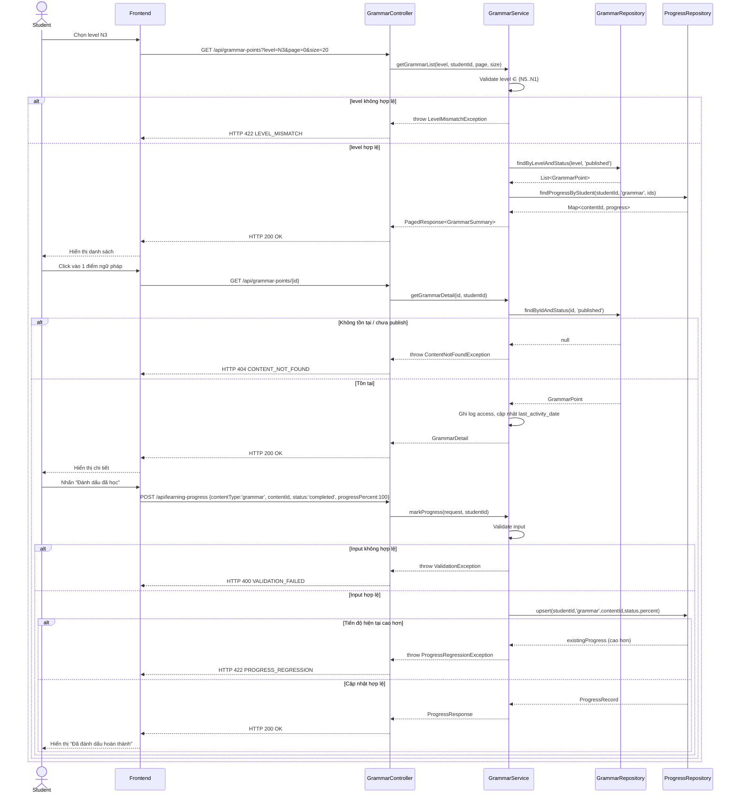

# UC-06 — Học Ngữ Pháp (Learn Grammar)

> **Feature:** `feat-core-learning` | **Phiên bản:** 1.0 | **Trạng thái:** Draft
> **Tham chiếu FR:** FR-LEARN-01, FR-LEARN-02, FR-LEARN-03, FR-LEARN-04, FR-LEARN-40, FR-LEARN-41, FR-LEARN-42
> **Cập nhật:** 2026-06-16

---

## 1. Tổng Quan

| Thuộc tính | Nội dung |
|:---|:---|
| **Mã Use Case** | UC-06 |
| **Tên** | Học Ngữ Pháp (Learn Grammar) |
| **Tác nhân chính** | Student — học viên đã đăng nhập |
| **Mô tả ngắn** | Học viên chọn cấp độ JLPT, xem danh sách/chi tiết điểm ngữ pháp (cấu trúc, công thức, nghĩa, ví dụ song ngữ) và đánh dấu đã học |
| **Độ ưu tiên** | Cao (P1) — một trong 4 khối kiến thức nền tảng |

---

## 2. Tác Nhân & Điều Kiện

### 2.1 Tác Nhân

| Tác nhân | Vai trò |
|:---|:---|
| **Student** | Người chủ động xem nội dung và đánh dấu tiến độ |
| **Staff** | Tạo/duyệt nội dung ngữ pháp — ngoài phạm vi (xem `feat-content-management`, `feat-content-review`) |

### 2.2 Điều Kiện Tiền Quyết (Preconditions)

- Student đã đăng nhập (JWT hợp lệ), `student_users.status = 'active'`
- Tồn tại ít nhất một `grammar_points` với `status = 'published'`, `is_deleted = 0` ở cấp độ được chọn

### 2.3 Hậu Điều Kiện (Postconditions)

- **Thành công:** Danh sách/chi tiết được trả về đúng phạm vi level + trạng thái `published`; khi đánh dấu hoàn thành, một bản ghi `student_content_progress` (`content_type = 'grammar'`) được upsert; `student_users.last_activity_date` được cập nhật
- **Thất bại:** Không có thay đổi dữ liệu; trả lỗi tương ứng (400/403/404/422)

---

## 3. Luồng Xử Lý

### 3.1 Luồng Chính — Xem Danh Sách → Chi Tiết → Đánh Dấu Hoàn Thành (Happy Path)

```
Bước 1  [Student]:   Chọn cấp độ JLPT (N5–N1) tại trang "Ngữ pháp"
Bước 2  [Frontend]:  GET /api/grammar-points?level=N3&page=0&size=20
Bước 3  [Backend]:   Validate level ∈ {N5,N4,N3,N2,N1}
Bước 4  [Backend]:   Query grammar_points WHERE jlpt_level=level AND status='published' AND is_deleted=0
Bước 5  [Backend]:   LEFT JOIN student_content_progress theo studentId hiện tại để gắn cờ isCompleted
Bước 6  [Backend]:   Trả HTTP 200 — danh sách phân trang (content, totalElements, totalPages, page, size)
Bước 7  [Student]:   Nhấn vào một điểm ngữ pháp để xem chi tiết
Bước 8  [Frontend]:  GET /api/grammar-points/{grammarId}
Bước 9  [Backend]:   Tìm theo grammarId; nếu không tồn tại HOẶC status≠'published' HOẶC is_deleted=1 → 404
Bước 10 [Backend]:   Trả structure, formula, meaning, usageExplanation, exampleSentenceJp/Vi, progressStatus hiện tại
Bước 11 [Backend]:   Ghi log access {studentId, contentType:'grammar', contentId}; cập nhật student_users.last_activity_date
Bước 12 [Student]:   Sau khi đọc xong, nhấn "Đánh dấu đã học"
Bước 13 [Frontend]:  POST /api/learning-progress {contentType:'grammar', contentId, status:'completed', progressPercent:100}
Bước 14 [Backend]:   Validate contentType, contentId, status, progressPercent (0–100)
Bước 15 [Backend]:   Kiểm tra grammar tồn tại + published
Bước 16 [Backend]:   Upsert student_content_progress theo UNIQUE(student_id, content_type, content_id); set completed_at=NOW() nếu status='completed'
Bước 17 [Backend]:   Trả HTTP 200 kèm bản ghi tiến độ
```

### 3.2 Luồng Phụ A — Lọc Theo Level Khác / Phân Trang

```
Bước 1 [Student]:   Đổi dropdown level hoặc chuyển trang
Bước 2 [Frontend]:  GET /api/grammar-points?level={level mới}&page={n}&size=20
Bước 3 [Backend]:   Lặp lại Bước 3–6 của luồng chính với tham số mới
```

### 3.3 Luồng Lỗi — Level Không Hợp Lệ

```
Bước 3→ [Backend]:  level không thuộc {N5,N4,N3,N2,N1}
Bước X  [Backend]:  Trả HTTP 422 — LEVEL_MISMATCH
                     "Cấp độ JLPT không hợp lệ"
```

### 3.4 Luồng Lỗi — Nội Dung Không Tồn Tại / Chưa Duyệt

```
Bước 9→ [Backend]:  grammarId không tồn tại HOẶC status ∈ {draft,pending_review,rejected,archived,deleted} HOẶC is_deleted=1
Bước X  [Backend]:  Ghi log: [WARN] [GrammarService] Truy cập nội dung không tồn tại {studentId, grammarId}
Bước X  [Backend]:  Trả HTTP 404 — CONTENT_NOT_FOUND
                     "Nội dung không tồn tại"
```

### 3.5 Luồng Lỗi — Dữ Liệu Tiến Độ Không Hợp Lệ

```
Bước 14→ [Backend]: contentType ≠ 'grammar' (sai bối cảnh) HOẶC progressPercent ngoài [0,100] HOẶC status không thuộc {learning,completed,reviewing}
Bước X   [Backend]: Trả HTTP 400 — VALIDATION_FAILED
                     "Dữ liệu không hợp lệ: {field}"
```

### 3.6 Luồng Lỗi — Hạ Tiến Độ Thủ Công

```
Bước 16→ [Backend]: Bản ghi progress hiện có progress_percent/status cao hơn giá trị mới gửi lên
Bước X   [Backend]: KHÔNG cập nhật giá trị thấp hơn; trả HTTP 422 — PROGRESS_REGRESSION
                     "Không thể hạ tiến độ đã đạt"
```

### 3.7 Luồng Lỗi — Nội Dung VIP

```
Bước 9→ [Backend]:  grammar.is_vip_only=1 và Student không có subscription VIP còn hiệu lực
Bước X  [Backend]:  Trả HTTP 403 — VIP_REQUIRED
                     "Nội dung này yêu cầu tài khoản VIP"
```

---

## 4. Quy Tắc Nghiệp Vụ

| Mã | Quy tắc | Chi tiết |
|:---|:---|:---|
| BR-06-01 | Chỉ trả `grammar_points` có `status='published'` và `is_deleted=0` cho Student | FR-LEARN-04, FR-LEARN-41 |
| BR-06-02 | `student_content_progress` phải **upsert** theo `UNIQUE(student_id, content_type='grammar', content_id)` | FR-LEARN-03, NFR-LEARN-06 |
| BR-06-03 | `progress_percent`/`status` chỉ **tăng**, không giảm thủ công qua API thông thường | FR-LEARN-40 |
| BR-06-04 | Mọi lượt xem nội dung cập nhật `student_users.last_activity_date` (tính streak) | FR-LEARN-42 |
| BR-06-05 | Nội dung `is_vip_only=1` chỉ hiển thị khi Student có subscription VIP còn hiệu lực | NFR-LEARN-03, `AGENTS.md §7.3` |
| BR-06-06 | Ví dụ song ngữ (`example_sentence_jp` + `example_sentence_vi`) luôn trả cùng nhau | FR-LEARN-02 |
| BR-06-07 | Response luôn theo chuẩn `{ status, message, data }`, không trả Entity JPA trực tiếp | ADR-005 |

---

## 5. Quy Tắc Kiểm Tra Đầu Vào

| Trường | Kiểm tra | Thông báo lỗi nếu sai |
|:---|:---|:---|
| `level` (query) | Bắt buộc khi gọi list, enum {N5,N4,N3,N2,N1} | "Cấp độ JLPT không hợp lệ" (422 LEVEL_MISMATCH) |
| `page` | Số nguyên ≥ 0, mặc định 0 | Clamp về 0 nếu âm |
| `size` | Số nguyên 1–50, mặc định 20 | Clamp về 50 nếu vượt |
| `contentType` | Bắt buộc, phải = `"grammar"` trong ngữ cảnh UC này | "Dữ liệu không hợp lệ: contentType" (400) |
| `contentId` | Bắt buộc, phải tồn tại trong `grammar_points` | 404 CONTENT_NOT_FOUND |
| `status` | Bắt buộc, enum {learning, completed, reviewing} | "Dữ liệu không hợp lệ: status" (400) |
| `progressPercent` | Bắt buộc, số nguyên 0–100 | "Dữ liệu không hợp lệ: progressPercent" (400) |

---

## 6. Sơ Đồ Tuần Tự (Sequence Diagram)



---

## 7. Tham Chiếu API

> Xem đặc tả đầy đủ tại [SPEC.md § 6 — API SPEC](./SPEC.md)

| Phương thức | Endpoint | Mô tả |
|:---|:---|:---|
| `GET` | `/api/grammar-points?level=&page=&size=` | Danh sách ngữ pháp theo level (phân trang) |
| `GET` | `/api/grammar-points/{grammarId}` | Chi tiết một điểm ngữ pháp |
| `POST` | `/api/learning-progress` | Đánh dấu/cập nhật tiến độ học (`contentType='grammar'`) |

---

## 8. Tiêu Chí Chấp Nhận (Acceptance Criteria)

### AC-06-01 — Xem danh sách Grammar theo level

> **Tham chiếu:** FR-LEARN-01, AC-LEARN-01

- **Cho trước:** Student đã login; tồn tại grammar N3 `published` và một bản N3 `draft`
- **Khi:** `GET /api/grammar-points?level=N3`
- **Thì:** HTTP 200; danh sách chỉ chứa bản `published`; không có bản `draft`

---

### AC-06-02 — Xem chi tiết Grammar đầy đủ thông tin

> **Tham chiếu:** FR-LEARN-02

- **Cho trước:** Grammar `published` tồn tại với đầy đủ structure/formula/meaning/usage_explanation/example
- **Khi:** `GET /api/grammar-points/{id}`
- **Thì:** Response chứa đủ `structure`, `formula`, `meaning`, `usageExplanation`, `exampleSentenceJp`, `exampleSentenceVi`, `progressStatus`

---

### AC-06-03 — Đánh dấu hoàn thành lần đầu

> **Tham chiếu:** FR-LEARN-03, AC-LEARN-04

- **Cho trước:** Student chưa có progress cho grammar này
- **Khi:** `POST /api/learning-progress` với `status='completed'`
- **Thì:** Tạo mới bản ghi `student_content_progress` (`content_type='grammar'`); `completed_at` được set

---

### AC-06-04 — Không tạo duplicate khi đánh dấu lại

> **Tham chiếu:** NFR-LEARN-06, AC-LEARN-05

- **Cho trước:** Student đã có progress `completed` cho grammar này
- **Khi:** Gửi lại `POST /api/learning-progress` cùng `contentType` + `contentId`
- **Thì:** Upsert — chỉ 1 bản ghi duy nhất (ràng buộc `UQ_progress`), không tạo bản ghi trùng

---

### AC-06-05 — Level không hợp lệ bị từ chối

- **Cho trước:** —
- **Khi:** `GET /api/grammar-points?level=N9`
- **Thì:** HTTP 422; `error_code = "LEVEL_MISMATCH"`

---

### AC-06-06 — Nội dung chưa duyệt không hiển thị

> **Tham chiếu:** FR-LEARN-04, AC-LEARN-08

- **Cho trước:** Grammar có `status='draft'`
- **Khi:** `GET /api/grammar-points?level=N3` hoặc `GET /api/grammar-points/{id}`
- **Thì:** List không chứa bản ghi này; detail trả HTTP 404 `CONTENT_NOT_FOUND`

---

### AC-06-07 — Nội dung VIP bị chặn với Student FREE

> **Tham chiếu:** NFR-LEARN-03, AC-LEARN-07

- **Cho trước:** Grammar có `is_vip_only=1`; Student có subscription FREE
- **Khi:** `GET /api/grammar-points/{id}`
- **Thì:** HTTP 403; `error_code = "VIP_REQUIRED"`

---

### AC-06-08 — Không thể hạ tiến độ thủ công

> **Tham chiếu:** FR-LEARN-40

- **Cho trước:** Progress hiện tại `status='completed'`, `progressPercent=100`
- **Khi:** `POST /api/learning-progress` với `status='learning'`, `progressPercent=20`
- **Thì:** HTTP 422; `error_code = "PROGRESS_REGRESSION"`; dữ liệu trong DB không đổi

---

## 9. Ngoài Phạm Vi (Out of Scope)

- ❌ CRUD nội dung ngữ pháp (tạo/sửa/xóa/duyệt) — xem `feat-content-management`, `feat-content-review`
- ❌ Quiz/kiểm tra ngữ pháp — xem `feat-assessment`, `feat-mock-test`
- ❌ Thêm điểm ngữ pháp vào Flashcard — Flashcard chỉ áp dụng cho Kanji/Vocabulary (FR-LEARN-13, FR-LEARN-33)
- ❌ Audio phát âm cho ví dụ ngữ pháp — bảng `grammar_points` không có `audio_url`
