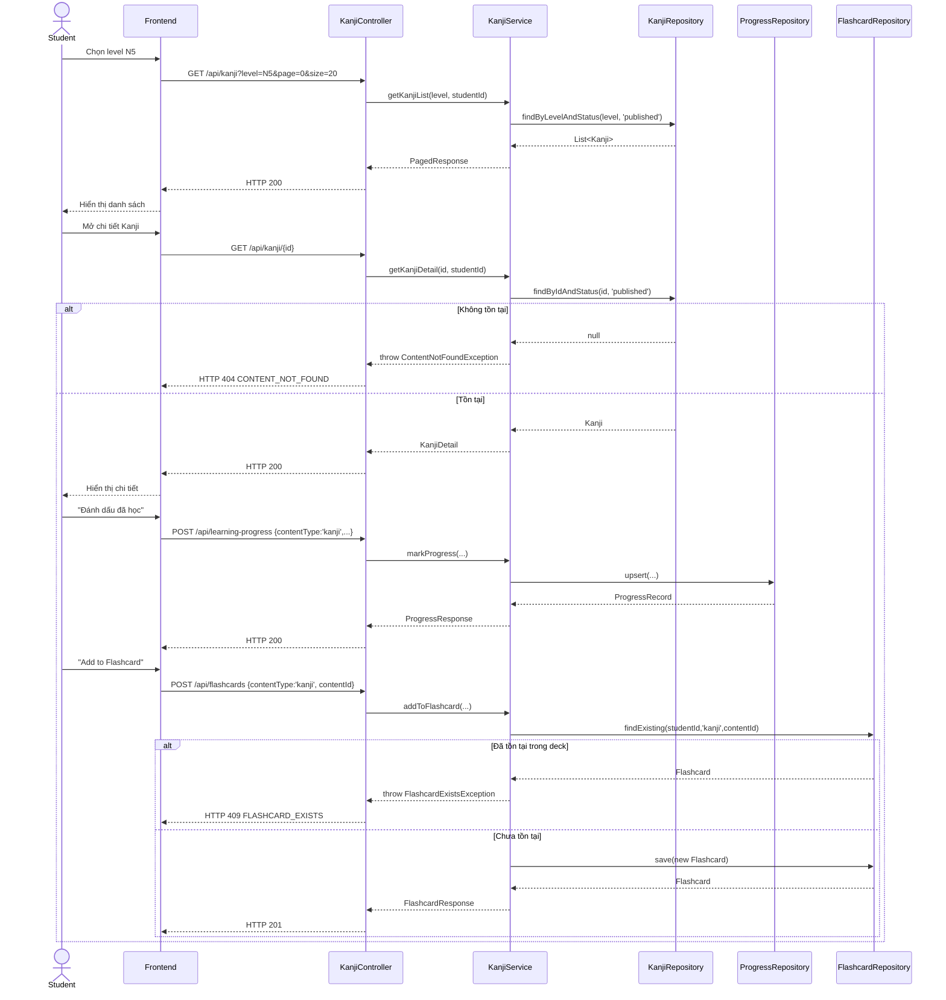

# UC-07 — Học Kanji (Learn Kanji)

> **Feature:** `feat-core-learning` | **Phiên bản:** 1.0 | **Trạng thái:** Draft
> **Tham chiếu FR:** FR-LEARN-10, FR-LEARN-11, FR-LEARN-12, FR-LEARN-13, FR-LEARN-14, FR-LEARN-40, FR-LEARN-41, FR-LEARN-42
> **Cập nhật:** 2026-06-16
>
> 📌 **Đây là spec tổng quan.** Spec chuyên sâu (lọc theo số nét/bộ thủ, đầy đủ API/Error/AC) nằm tại [`feat-kanji/SPEC.md`](../feat-kanji/SPEC.md). File này mô tả UC-07 ở mức use case theo cùng cấu trúc với các UC khác trong `feat-core-learning`, không lặp lại chi tiết đã có ở `feat-kanji`.

---

## 1. Tổng Quan

| Thuộc tính | Nội dung |
|:---|:---|
| **Mã Use Case** | UC-07 |
| **Tên** | Học Kanji (Learn Kanji) |
| **Tác nhân chính** | Student — học viên đã đăng nhập |
| **Mô tả ngắn** | Học viên chọn cấp độ JLPT, xem danh sách/chi tiết Kanji (ký tự, số nét, ảnh thứ tự nét tĩnh, âm đọc, nghĩa, từ ví dụ), đánh dấu đã học và thêm vào Flashcard |
| **Độ ưu tiên** | Cao (P1) — khối kiến thức khó nhất, ảnh hưởng giữ chân học viên |

---

## 2. Tác Nhân & Điều Kiện

### 2.1 Tác Nhân

| Tác nhân | Vai trò |
|:---|:---|
| **Student** | Xem nội dung Kanji, đánh dấu tiến độ, thêm Flashcard |
| **Staff** | Tạo/duyệt Kanji — ngoài phạm vi (xem `feat-content-management`, `feat-content-review`) |
| **System (CDN/Storage)** | Phục vụ `stroke_order_url` dạng ảnh tĩnh |

### 2.2 Điều Kiện Tiền Quyết (Preconditions)

- Student đã đăng nhập (JWT hợp lệ), `student_users.status = 'active'`
- Tồn tại ít nhất một `kanji` với `status = 'published'`, `is_deleted = 0` ở cấp độ được chọn

### 2.3 Hậu Điều Kiện (Postconditions)

- **Thành công:** Danh sách/chi tiết Kanji trả đúng phạm vi level + trạng thái `published`; đánh dấu hoàn thành → upsert `student_content_progress` (`content_type='kanji'`); "Add to Flashcard" → tạo bản ghi `flashcards`
- **Thất bại:** Không có thay đổi dữ liệu; trả lỗi tương ứng (400/403/404/409/422)

---

## 3. Luồng Xử Lý

### 3.1 Luồng Chính — Xem Danh Sách → Chi Tiết → Đánh Dấu Hoàn Thành (Happy Path)

```
Bước 1 [Student]:   Chọn cấp độ JLPT (N5–N1) tại trang "Kanji"
Bước 2 [Frontend]:  GET /api/kanji?level=N5&page=0&size=20
Bước 3 [Backend]:   Validate level; query kanji WHERE jlpt_level=level AND status='published' AND is_deleted=0
Bước 4 [Backend]:   Trả danh sách phân trang kèm cờ isCompleted theo student hiện tại
Bước 5 [Student]:   Mở chi tiết một Kanji
Bước 6 [Frontend]:  GET /api/kanji/{kanjiId}
Bước 7 [Backend]:   Trả characterValue, strokeCount, strokeOrderUrl (ảnh tĩnh), onyomi, kunyomi, meaning, exampleWord/Reading/Meaning, progressStatus
Bước 8 [Backend]:   Ghi log access {studentId, contentType:'kanji', contentId}; cập nhật last_activity_date
Bước 9 [Student]:   Nhấn "Đánh dấu đã học"
Bước 10 [Frontend]: POST /api/learning-progress {contentType:'kanji', contentId, status:'completed', progressPercent:100}
Bước 11 [Backend]:  Upsert student_content_progress theo UNIQUE(student_id, content_type, content_id)
Bước 12 [Student]:  Nhấn "Add to Flashcard"
Bước 13 [Frontend]: POST /api/flashcards {contentType:'kanji', contentId}
Bước 14 [Backend]:  Tạo bản ghi flashcards liên kết deck cá nhân; trả HTTP 201
```

> Chi tiết các luồng phụ (lọc theo số nét/bộ thủ, tìm kiếm), luồng lỗi đầy đủ và sequence diagram — xem [`feat-kanji/SPEC.md §3, §6, §7`](../feat-kanji/SPEC.md).

### 3.2 Luồng Lỗi (tóm tắt)

| Tình huống | HTTP | Error Code |
|:---|:---:|:---|
| `level` không thuộc {N5..N1} | 422 | `LEVEL_MISMATCH` |
| Kanji không tồn tại / chưa `published` / `is_deleted=1` | 404 | `CONTENT_NOT_FOUND` |
| `is_vip_only=1` và Student không có VIP | 403 | `VIP_REQUIRED` |
| Thêm Flashcard trùng (đã có trong deck) | 409 | `FLASHCARD_EXISTS` |
| Hạ tiến độ thủ công (`completed → learning`) | 422 | `PROGRESS_REGRESSION` |
| `progressPercent`/`contentType` sai định dạng | 400 | `VALIDATION_FAILED` |

---

## 4. Quy Tắc Nghiệp Vụ

| Mã | Quy tắc | Chi tiết |
|:---|:---|:---|
| BR-07-01 | Chỉ trả `kanji` có `status='published'` và `is_deleted=0` cho Student | FR-LEARN-10, FR-LEARN-41 |
| BR-07-02 | `stroke_order_url` chỉ là **ảnh tĩnh** — không phục vụ animation hay đánh giá thứ tự nét | FR-LEARN-14, ADR-007 |
| BR-07-03 | `student_content_progress` phải **upsert**, không tạo duplicate | FR-LEARN-12, NFR-LEARN-06 |
| BR-07-04 | `progress_percent`/`status` chỉ tăng, không giảm thủ công | FR-LEARN-40 |
| BR-07-05 | "Add to Flashcard" tạo `flashcards` (`content_type='kanji'`) gắn deck cá nhân; trùng → 409 | FR-LEARN-13 |
| BR-07-06 | Mọi lượt xem cập nhật `student_users.last_activity_date` | FR-LEARN-42 |
| BR-07-07 | Nội dung `is_vip_only=1` chỉ hiển thị khi Student có VIP còn hiệu lực | NFR-LEARN-03 |

> Quy tắc lọc số nét/bộ thủ và index hiệu năng — xem `feat-kanji/SPEC.md §3.1, §4`.

---

## 5. Quy Tắc Kiểm Tra Đầu Vào

| Trường | Kiểm tra | Thông báo lỗi nếu sai |
|:---|:---|:---|
| `level` | Bắt buộc khi gọi list, enum {N5,N4,N3,N2,N1} | 422 LEVEL_MISMATCH |
| `page` / `size` | Số nguyên ≥0 / 1–50 (mặc định 20) | Clamp về giá trị hợp lệ |
| `contentType` | Bắt buộc, = `"kanji"` trong ngữ cảnh UC này | 400 VALIDATION_FAILED |
| `contentId` | Bắt buộc, phải tồn tại trong `kanji` | 404 CONTENT_NOT_FOUND |
| `progressPercent` | Bắt buộc, số nguyên 0–100 | 400 VALIDATION_FAILED |
| `deckName` (flashcard) | Tùy chọn, mặc định `"Mặc định"` | — |

---

## 6. Sơ Đồ Tuần Tự (Sequence Diagram)



---

## 7. Tham Chiếu API

> Xem đặc tả đầy đủ (kèm lọc số nét/bộ thủ) tại [`feat-kanji/SPEC.md §6`](../feat-kanji/SPEC.md)

| Phương thức | Endpoint | Mô tả |
|:---|:---|:---|
| `GET` | `/api/kanji?level=&page=&size=` | Danh sách Kanji theo level |
| `GET` | `/api/kanji/{kanjiId}` | Chi tiết một Kanji |
| `POST` | `/api/learning-progress` | Đánh dấu/cập nhật tiến độ (`contentType='kanji'`) |
| `POST` | `/api/flashcards` | Thêm Kanji vào Flashcard cá nhân |

---

## 8. Tiêu Chí Chấp Nhận (Acceptance Criteria)

### AC-07-01 — Xem chi tiết Kanji đầy đủ thông tin

> **Tham chiếu:** FR-LEARN-11, AC-LEARN-02

- **Cho trước:** Kanji `published` tồn tại
- **Khi:** `GET /api/kanji/{id}`
- **Thì:** Response có đủ `characterValue`, `strokeCount`, `strokeOrderUrl`, `onyomi`, `kunyomi`, `meaning`, `exampleWord`, `exampleReading`, `exampleMeaning`

### AC-07-02 — Đánh dấu hoàn thành Kanji

> **Tham chiếu:** FR-LEARN-12

- **Cho trước:** Student chưa học Kanji này
- **Khi:** `POST /api/learning-progress` status=completed
- **Thì:** Tạo bản ghi `student_content_progress` (`content_type='kanji'`)

### AC-07-03 — Thêm Kanji vào Flashcard

> **Tham chiếu:** FR-LEARN-13, AC-LEARN-06

- **Cho trước:** Kanji `published`, chưa có trong deck của Student
- **Khi:** `POST /api/flashcards` contentType=kanji
- **Thì:** HTTP 201; bản ghi `flashcards` được tạo

### AC-07-04 — Stroke order chỉ là ảnh tĩnh

> **Tham chiếu:** FR-LEARN-14

- **Cho trước:** Kanji có `stroke_order_url`
- **Khi:** `GET /api/kanji/{id}`
- **Thì:** `strokeOrderUrl` trả về là URL ảnh tĩnh; hệ thống không cung cấp animation hoặc đánh giá nét viết

> Các AC chuyên sâu hơn (lọc số nét, bộ thủ, search) — xem `feat-kanji/SPEC.md §8`.

---

## 9. Ngoài Phạm Vi (Out of Scope)

- ❌ CRUD Kanji (tạo/sửa/xóa/duyệt) — xem `feat-content-management`, `feat-content-review`
- ❌ Luyện viết tay Kanji + OCR similarity — xem `feat-ai-skills` (ADR-007)
- ❌ Thuật toán Spaced Repetition của Flashcard — xem `feat-flashcard-srs`
- ❌ Animated stroke order — chỉ ảnh tĩnh (ADR-007)
- ❌ Lọc theo số nét/bộ thủ, tìm kiếm nâng cao — xem `feat-kanji/SPEC.md`
