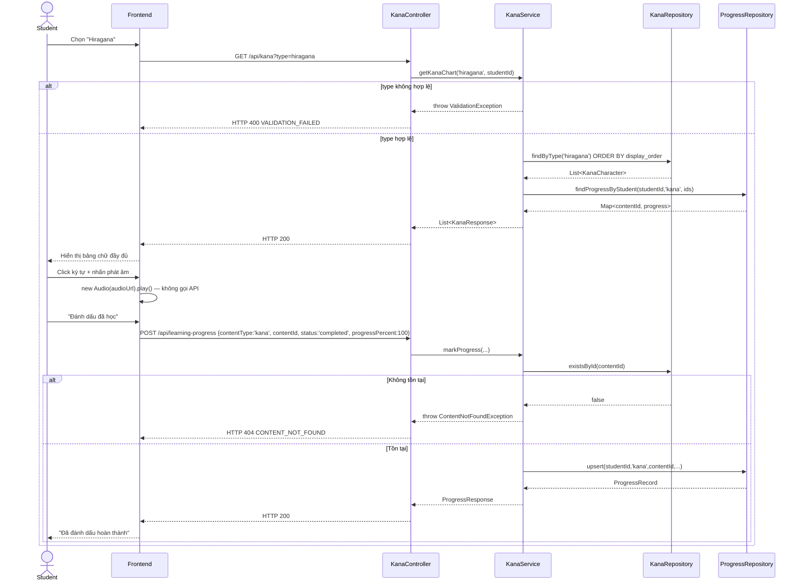

# UC-08 — Học Kana (Learn Kana)

> **Feature:** `feat-core-learning` | **Phiên bản:** 1.0 | **Trạng thái:** Draft
> **Tham chiếu FR:** FR-LEARN-20, FR-LEARN-21, FR-LEARN-22, FR-LEARN-23, FR-LEARN-40, FR-LEARN-41, FR-LEARN-42
> **Cập nhật:** 2026-06-16

---

## 1. Tổng Quan

| Thuộc tính | Nội dung |
|:---|:---|
| **Mã Use Case** | UC-08 |
| **Tên** | Học Kana (Learn Kana — Hiragana/Katakana) |
| **Tác nhân chính** | Student — học viên đã đăng nhập |
| **Mô tả ngắn** | Học viên xem bảng chữ Hiragana/Katakana đầy đủ, mở chi tiết từng ký tự (romaji, audio phát âm, ảnh thứ tự nét tĩnh) và đánh dấu đã học |
| **Độ ưu tiên** | Cao (P1) — nền tảng nhập môn, thường là nội dung học đầu tiên |

---

## 2. Tác Nhân & Điều Kiện

### 2.1 Tác Nhân

| Tác nhân | Vai trò |
|:---|:---|
| **Student** | Xem bảng Kana, nghe phát âm, đánh dấu tiến độ |
| **Staff** | Tạo/chỉnh sửa ký tự Kana — ngoài phạm vi (xem `feat-content-management`) |
| **System (CDN/Storage)** | Phục vụ `audio_url` và `stroke_order_url` |

### 2.2 Điều Kiện Tiền Quyết (Preconditions)

- Student đã đăng nhập (JWT hợp lệ), `student_users.status = 'active'`
- Bảng `kana_characters` đã có dữ liệu cho `kana_type` tương ứng (`hiragana`/`katakana`)

### 2.3 Hậu Điều Kiện (Postconditions)

- **Thành công:** Trả về toàn bộ bảng ký tự theo loại được chọn; khi đánh dấu hoàn thành → upsert `student_content_progress` (`content_type='kana'`)
- **Thất bại:** Không có thay đổi dữ liệu; trả lỗi tương ứng (400/404/422)

---

## 3. Luồng Xử Lý

### 3.1 Luồng Chính — Xem Bảng Kana → Chi Tiết Ký Tự → Đánh Dấu Hoàn Thành (Happy Path)

```
Bước 1  [Student]:  Chọn "Hiragana" hoặc "Katakana" tại trang "Kana"
Bước 2  [Frontend]: GET /api/kana?type=hiragana
Bước 3  [Backend]:  Validate type ∈ {hiragana, katakana}
Bước 4  [Backend]:  Query kana_characters WHERE kana_type=type, ORDER BY display_order
Bước 5  [Backend]:  Gắn cờ isCompleted theo student hiện tại; trả HTTP 200 — danh sách đầy đủ (≥46 ký tự cơ bản)
Bước 6  [Student]:  Nhấn vào một ký tự Kana
Bước 7  [Frontend]: Hiển thị characterValue, romanization, audioUrl, strokeOrderUrl từ dữ liệu đã tải (không gọi API riêng — FR-LEARN-23)
Bước 8  [Student]:  Nhấn nút phát âm
Bước 9  [Frontend]: Phát audio trực tiếp từ audioUrl trên browser (HTML5 Audio), không qua Backend
Bước 10 [Student]:  Nhấn "Đánh dấu đã học"
Bước 11 [Frontend]: POST /api/learning-progress {contentType:'kana', contentId:kanaId, status:'completed', progressPercent:100}
Bước 12 [Backend]:  Validate input; upsert student_content_progress theo UNIQUE(student_id, content_type, content_id)
Bước 13 [Backend]:  Ghi log access {studentId, contentType:'kana', contentId}; cập nhật student_users.last_activity_date
Bước 14 [Backend]:  Trả HTTP 200 kèm bản ghi tiến độ
```

### 3.2 Luồng Phụ A — Chuyển Đổi Giữa Hiragana và Katakana

```
Bước 1 [Student]:   Đổi tab/segmented control sang loại Kana khác
Bước 2 [Frontend]:  GET /api/kana?type=katakana
Bước 3 [Backend]:   Lặp lại Bước 3–5 của luồng chính với type mới
```

### 3.3 Luồng Lỗi — Loại Kana Không Hợp Lệ

```
Bước 3→ [Backend]:  type không thuộc {hiragana, katakana}
Bước X  [Backend]:  Trả HTTP 400 — VALIDATION_FAILED
                     "Dữ liệu không hợp lệ: type"
```

### 3.4 Luồng Lỗi — Đánh Dấu Tiến Độ Cho Ký Tự Không Tồn Tại

```
Bước 12→ [Backend]: contentId không tồn tại trong kana_characters
Bước X   [Backend]: Trả HTTP 404 — CONTENT_NOT_FOUND
                     "Nội dung không tồn tại"
```

### 3.5 Luồng Lỗi — Dữ Liệu Tiến Độ Không Hợp Lệ

```
Bước 12→ [Backend]: progressPercent ngoài [0,100] HOẶC status không thuộc {learning,completed,reviewing}
Bước X   [Backend]: Trả HTTP 400 — VALIDATION_FAILED
                     "Dữ liệu không hợp lệ: {field}"
```

---

## 4. Quy Tắc Nghiệp Vụ

| Mã | Quy tắc | Chi tiết |
|:---|:---|:---|
| BR-08-01 | `GET /api/kana` luôn trả **toàn bộ** bảng ký tự theo `type` — không phân trang (bảng cố định ≤ ~50 ký tự) | FR-LEARN-20 |
| BR-08-02 | Browser phát audio trực tiếp từ `audio_url` — Backend KHÔNG cung cấp endpoint stream riêng | FR-LEARN-23, ADR-006 |
| BR-08-03 | `stroke_order_url` chỉ là **ảnh tĩnh** — không có animation | ADR-007 (đồng nhất với Kanji) |
| BR-08-04 | `student_content_progress` phải **upsert**, không tạo duplicate | FR-LEARN-22, NFR-LEARN-06 |
| BR-08-05 | `progress_percent`/`status` chỉ tăng, không giảm thủ công | FR-LEARN-40 |
| BR-08-06 | Mọi lượt xem/đánh dấu cập nhật `student_users.last_activity_date` | FR-LEARN-42 |
| BR-08-07 | Kana không có khái niệm `is_vip_only`/`status published` như Grammar/Kanji/Vocabulary — toàn bộ bảng Kana luôn công khai cho Student đã đăng nhập | Suy ra từ bảng `kana_characters` (§5.1 `SPEC.md`, không có cột `status`/`is_vip_only`) |

---

## 5. Quy Tắc Kiểm Tra Đầu Vào

| Trường | Kiểm tra | Thông báo lỗi nếu sai |
|:---|:---|:---|
| `type` (query) | Bắt buộc, enum {hiragana, katakana} | "Dữ liệu không hợp lệ: type" (400) |
| `contentType` | Bắt buộc, = `"kana"` trong ngữ cảnh UC này | 400 VALIDATION_FAILED |
| `contentId` | Bắt buộc, phải tồn tại trong `kana_characters` | 404 CONTENT_NOT_FOUND |
| `progressPercent` | Bắt buộc, số nguyên 0–100 | 400 VALIDATION_FAILED |
| `status` | Bắt buộc, enum {learning, completed, reviewing} | 400 VALIDATION_FAILED |

---

## 6. Sơ Đồ Tuần Tự (Sequence Diagram)



---

## 7. Tham Chiếu API

> Xem đặc tả đầy đủ tại [SPEC.md § 6 — API SPEC](./SPEC.md)

| Phương thức | Endpoint | Mô tả |
|:---|:---|:---|
| `GET` | `/api/kana?type=hiragana\|katakana` | Bảng chữ Kana đầy đủ theo loại |
| `POST` | `/api/learning-progress` | Đánh dấu/cập nhật tiến độ (`contentType='kana'`) |

---

## 8. Tiêu Chí Chấp Nhận (Acceptance Criteria)

### AC-08-01 — Xem bảng Hiragana đầy đủ

> **Tham chiếu:** FR-LEARN-20, AC-LEARN-03

- **Cho trước:** Student đã login; `kana_characters` có đủ dữ liệu Hiragana
- **Khi:** `GET /api/kana?type=hiragana`
- **Thì:** HTTP 200; trả đủ ≥46 ký tự cơ bản, mỗi item có `audioUrl`

### AC-08-02 — Xem chi tiết ký tự Kana

> **Tham chiếu:** FR-LEARN-21

- **Cho trước:** Ký tự Kana tồn tại với `audio_url` và `stroke_order_url`
- **Khi:** Student click vào ký tự trên giao diện
- **Thì:** Hiển thị `characterValue`, `romanization`, có thể phát `audioUrl`, hiển thị `strokeOrderUrl` (ảnh tĩnh)

### AC-08-03 — Phát audio không cần gọi API riêng

> **Tham chiếu:** FR-LEARN-23

- **Cho trước:** Item Kana đã tải kèm `audioUrl`
- **Khi:** Student nhấn nút phát âm
- **Thì:** Browser phát audio trực tiếp từ `audioUrl`; không có request HTTP mới đến Backend cho việc phát âm

### AC-08-04 — Đánh dấu hoàn thành một ký tự Kana

> **Tham chiếu:** FR-LEARN-22, AC-LEARN-04

- **Cho trước:** Student chưa học ký tự này
- **Khi:** `POST /api/learning-progress` với `contentType='kana'`, `status='completed'`
- **Thì:** Tạo/upsert bản ghi `student_content_progress` (`content_type='kana'`)

### AC-08-05 — Loại Kana không hợp lệ bị từ chối

- **Cho trước:** —
- **Khi:** `GET /api/kana?type=romaji`
- **Thì:** HTTP 400; `error_code = "VALIDATION_FAILED"`

### AC-08-06 — Không tạo duplicate progress

> **Tham chiếu:** NFR-LEARN-06, AC-LEARN-05

- **Cho trước:** Student đã có progress cho ký tự này
- **Khi:** Gửi lại `POST /api/learning-progress` cùng `contentId`
- **Thì:** Upsert — vẫn 1 bản ghi duy nhất

---

## 9. Ngoài Phạm Vi (Out of Scope)

- ❌ CRUD ký tự Kana (tạo/sửa/xóa) — xem `feat-content-management`
- ❌ Luyện viết tay Kana + OCR similarity — xem `feat-ai-skills`
- ❌ Animated stroke order — chỉ ảnh tĩnh (ADR-007)
- ❌ Audio streaming backend — chỉ trả URL, frontend tự phát (`AGENTS.md`, `SPEC.md § OUT OF SCOPE`)
- ❌ Thêm ký tự Kana vào Flashcard — Flashcard chỉ áp dụng cho Kanji/Vocabulary
