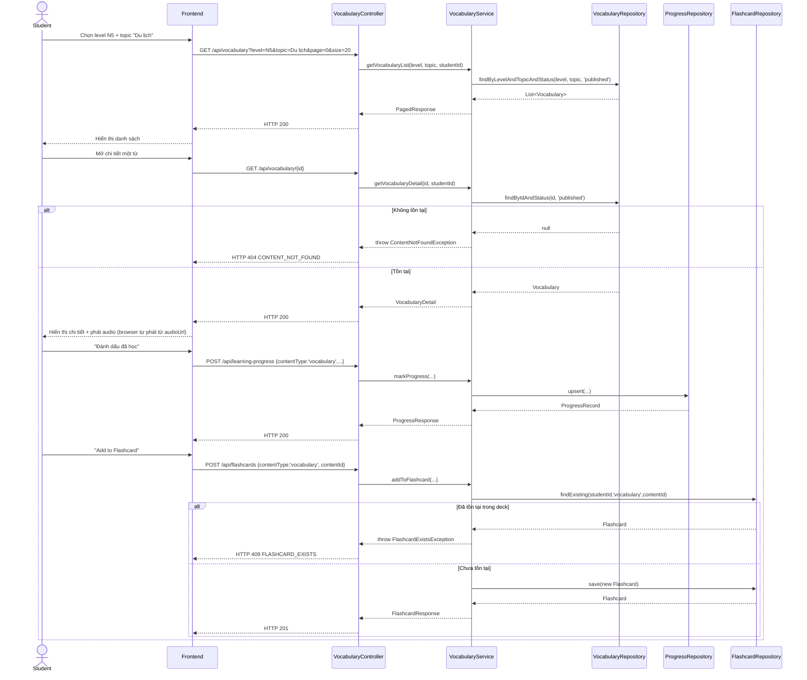

# UC-09 — Học Từ Vựng (Learn Vocabulary)

> **Feature:** `feat-core-learning` | **Phiên bản:** 1.0 | **Trạng thái:** Draft
> **Tham chiếu FR:** FR-LEARN-30, FR-LEARN-31, FR-LEARN-32, FR-LEARN-33, FR-LEARN-34, FR-LEARN-40, FR-LEARN-41, FR-LEARN-42
> **Cập nhật:** 2026-06-16

> 📌 **Đây là spec tổng quan.** Spec chuyên sâu (lọc theo level + topic, tìm kiếm, đầy đủ API/Error/AC) nằm tại [`feat-vocabulary/SPEC.md`](../feat-vocabulary/SPEC.md). File này mô tả UC-09 ở mức use case theo cùng cấu trúc với các UC khác trong `feat-core-learning`, không lặp lại chi tiết đã có ở `feat-vocabulary`.

---

## 1. Tổng Quan

| Thuộc tính | Nội dung |
|:---|:---|
| **Mã Use Case** | UC-09 |
| **Tên** | Học Từ Vựng (Learn Vocabulary) |
| **Tác nhân chính** | Student — học viên đã đăng nhập |
| **Mô tả ngắn** | Học viên chọn cấp độ JLPT và/hoặc chủ đề (topic), xem danh sách/chi tiết từ vựng (word, furigana, nghĩa, audio, câu ví dụ song ngữ), đánh dấu đã học và thêm vào Flashcard |
| **Độ ưu tiên** | Cao (P1) — khối kiến thức có khối lượng lớn nhất |

---

## 2. Tác Nhân & Điều Kiện

### 2.1 Tác Nhân

| Tác nhân | Vai trò |
|:---|:---|
| **Student** | Xem nội dung từ vựng, đánh dấu tiến độ, thêm Flashcard |
| **Staff** | Tạo/duyệt từ vựng — ngoài phạm vi (xem `feat-content-management`, `feat-content-review`) |
| **System (CDN/Storage)** | Phục vụ `audio_url` |

### 2.2 Điều Kiện Tiền Quyết (Preconditions)

- Student đã đăng nhập (JWT hợp lệ), `student_users.status = 'active'`
- Tồn tại ít nhất một `vocabulary` với `status = 'published'`, `is_deleted = 0` khớp filter

### 2.3 Hậu Điều Kiện (Postconditions)

- **Thành công:** Danh sách/chi tiết từ vựng trả đúng phạm vi level + topic + trạng thái `published`; đánh dấu hoàn thành → upsert `student_content_progress` (`content_type='vocabulary'`); "Add to Flashcard" → tạo bản ghi `flashcards`
- **Thất bại:** Không có thay đổi dữ liệu; trả lỗi tương ứng (400/403/404/409/422)

---

## 3. Luồng Xử Lý

### 3.1 Luồng Chính — Xem Danh Sách → Chi Tiết → Đánh Dấu Hoàn Thành (Happy Path)

```
Bước 1  [Student]:  Chọn cấp độ JLPT và/hoặc chủ đề tại trang "Từ vựng"
Bước 2  [Frontend]: GET /api/vocabulary?level=N5&topic=Du lịch&page=0&size=20
Bước 3  [Backend]:  Validate level; query vocabulary WHERE jlpt_level=level AND topic=topic (nếu có) AND status='published' AND is_deleted=0
Bước 4  [Backend]:  Trả danh sách phân trang kèm cờ isCompleted theo student hiện tại
Bước 5  [Student]:  Mở chi tiết một từ vựng
Bước 6  [Frontend]: GET /api/vocabulary/{vocabularyId}
Bước 7  [Backend]:  Trả word, furigana, meaning, jlptLevel, topic, audioUrl, exampleSentence (JP+VI), progressStatus
Bước 8  [Backend]:  Ghi log access {studentId, contentType:'vocabulary', contentId}; cập nhật last_activity_date
Bước 9  [Student]:  Nhấn "Đánh dấu đã học"
Bước 10 [Frontend]: POST /api/learning-progress {contentType:'vocabulary', contentId, status:'completed', progressPercent:100}
Bước 11 [Backend]:  Upsert student_content_progress theo UNIQUE(student_id, content_type, content_id)
Bước 12 [Student]:  Nhấn "Add to Flashcard"
Bước 13 [Frontend]: POST /api/flashcards {contentType:'vocabulary', contentId}
Bước 14 [Backend]:  Tạo bản ghi flashcards liên kết deck cá nhân; trả HTTP 201
```

> Chi tiết luồng tìm kiếm theo từ khóa, danh sách topic khả dụng theo level, luồng lỗi đầy đủ và sequence diagram — xem [`feat-vocabulary/SPEC.md §3, §6, §7`](../feat-vocabulary/SPEC.md).

### 3.2 Luồng Lỗi (tóm tắt)

| Tình huống | HTTP | Error Code |
|:---|:---:|:---|
| `level` không thuộc {N5..N1} | 422 | `LEVEL_MISMATCH` |
| Từ vựng không tồn tại / chưa `published` / `is_deleted=1` | 404 | `CONTENT_NOT_FOUND` |
| `is_vip_only=1` và Student không có VIP | 403 | `VIP_REQUIRED` |
| Thêm Flashcard trùng (đã có trong deck) | 409 | `FLASHCARD_EXISTS` |
| Hạ tiến độ thủ công (`completed → learning`) | 422 | `PROGRESS_REGRESSION` |
| `progressPercent`/`contentType` sai định dạng | 400 | `VALIDATION_FAILED` |

---

## 4. Quy Tắc Nghiệp Vụ

| Mã | Quy tắc | Chi tiết |
|:---|:---|:---|
| BR-09-01 | Chỉ trả `vocabulary` có `status='published'` và `is_deleted=0` cho Student | FR-LEARN-30, FR-LEARN-41 |
| BR-09-02 | Hỗ trợ lọc **đồng thời** theo `topic` VÀ `jlpt_level` | FR-LEARN-34 |
| BR-09-03 | `student_content_progress` phải **upsert**, không tạo duplicate | FR-LEARN-32, NFR-LEARN-06 |
| BR-09-04 | `progress_percent`/`status` chỉ tăng, không giảm thủ công | FR-LEARN-40 |
| BR-09-05 | "Add to Flashcard" tạo `flashcards` (`content_type='vocabulary'`) gắn deck cá nhân; trùng → 409 | FR-LEARN-33 |
| BR-09-06 | Mọi lượt xem cập nhật `student_users.last_activity_date` | FR-LEARN-42 |
| BR-09-07 | Nội dung `is_vip_only=1` chỉ hiển thị khi Student có VIP còn hiệu lực | NFR-LEARN-03 |
| BR-09-08 | Câu ví dụ song ngữ (`example_sentence_jp` + `example_sentence_vi`) luôn trả cùng nhau | FR-LEARN-31 |

> Quy tắc suy luận danh sách topic khả dụng và index hiệu năng — xem `feat-vocabulary/SPEC.md §3, §4`.

---

## 5. Quy Tắc Kiểm Tra Đầu Vào

| Trường | Kiểm tra | Thông báo lỗi nếu sai |
|:---|:---|:---|
| `level` | Tùy chọn, nếu có phải enum {N5,N4,N3,N2,N1} | 422 LEVEL_MISMATCH |
| `topic` | Tùy chọn, chuỗi tự do khớp giá trị tồn tại trong DB | Không lỗi nếu không khớp — trả rỗng |
| `page` / `size` | Số nguyên ≥0 / 1–50 (mặc định 20) | Clamp về giá trị hợp lệ |
| `contentType` | Bắt buộc, = `"vocabulary"` trong ngữ cảnh UC này | 400 VALIDATION_FAILED |
| `contentId` | Bắt buộc, phải tồn tại trong `vocabulary` | 404 CONTENT_NOT_FOUND |
| `progressPercent` | Bắt buộc, số nguyên 0–100 | 400 VALIDATION_FAILED |
| `deckName` (flashcard) | Tùy chọn, mặc định `"Mặc định"` | — |

---

## 6. Sơ Đồ Tuần Tự (Sequence Diagram)



---

## 7. Tham Chiếu API

> Xem đặc tả đầy đủ (kèm lọc topic, tìm kiếm) tại [`feat-vocabulary/SPEC.md §6`](../feat-vocabulary/SPEC.md)

| Phương thức | Endpoint | Mô tả |
|:---|:---|:---|
| `GET` | `/api/vocabulary?level=&topic=&page=&size=` | Danh sách từ vựng theo level/topic |
| `GET` | `/api/vocabulary/{vocabularyId}` | Chi tiết một từ vựng |
| `POST` | `/api/learning-progress` | Đánh dấu/cập nhật tiến độ (`contentType='vocabulary'`) |
| `POST` | `/api/flashcards` | Thêm từ vựng vào Flashcard cá nhân |

---

## 8. Tiêu Chí Chấp Nhận (Acceptance Criteria)

### AC-09-01 — Lọc đồng thời theo level và topic

> **Tham chiếu:** FR-LEARN-34

- **Cho trước:** Tồn tại từ vựng N5 topic "Du lịch" published và N5 topic "Gia đình" published
- **Khi:** `GET /api/vocabulary?level=N5&topic=Du lịch`
- **Thì:** HTTP 200; chỉ trả các từ N5 thuộc topic "Du lịch"

### AC-09-02 — Xem chi tiết từ vựng đầy đủ thông tin

> **Tham chiếu:** FR-LEARN-31

- **Cho trước:** Từ vựng `published` tồn tại
- **Khi:** `GET /api/vocabulary/{id}`
- **Thì:** Response có đủ `word`, `furigana`, `meaning`, `jlptLevel`, `topic`, `audioUrl`, câu ví dụ song ngữ

### AC-09-03 — Đánh dấu hoàn thành từ vựng

> **Tham chiếu:** FR-LEARN-32, AC-LEARN-04

- **Cho trước:** Student chưa học từ này
- **Khi:** `POST /api/learning-progress` status=completed
- **Thì:** Tạo bản ghi `student_content_progress` (`content_type='vocabulary'`)

### AC-09-04 — Thêm từ vựng vào Flashcard

> **Tham chiếu:** FR-LEARN-33

- **Cho trước:** Từ vựng `published`, chưa có trong deck của Student
- **Khi:** `POST /api/flashcards` contentType=vocabulary
- **Thì:** HTTP 201; bản ghi `flashcards` được tạo

### AC-09-05 — Nội dung chưa duyệt không hiển thị

> **Tham chiếu:** FR-LEARN-30, AC-LEARN-08

- **Cho trước:** Từ vựng có `status='draft'`
- **Khi:** `GET /api/vocabulary?level=N5` hoặc `GET /api/vocabulary/{id}`
- **Thì:** List không chứa bản ghi này; detail trả HTTP 404 `CONTENT_NOT_FOUND`

> Các AC chuyên sâu hơn (tìm kiếm từ khóa, danh sách topic khả dụng) — xem `feat-vocabulary/SPEC.md §8`.

---

## 9. Ngoài Phạm Vi (Out of Scope)

- ❌ CRUD từ vựng (tạo/sửa/xóa/duyệt) — xem `feat-content-management`, `feat-content-review`
- ❌ Quản lý danh mục topic — thuộc content management (xem `SPEC.md § OUT OF SCOPE`)
- ❌ Thuật toán Spaced Repetition của Flashcard — xem `feat-flashcard-srs`
- ❌ Audio streaming backend — chỉ trả `audio_url`, frontend tự phát
- ❌ Tìm kiếm nâng cao theo từ khóa — xem `feat-vocabulary/SPEC.md`
