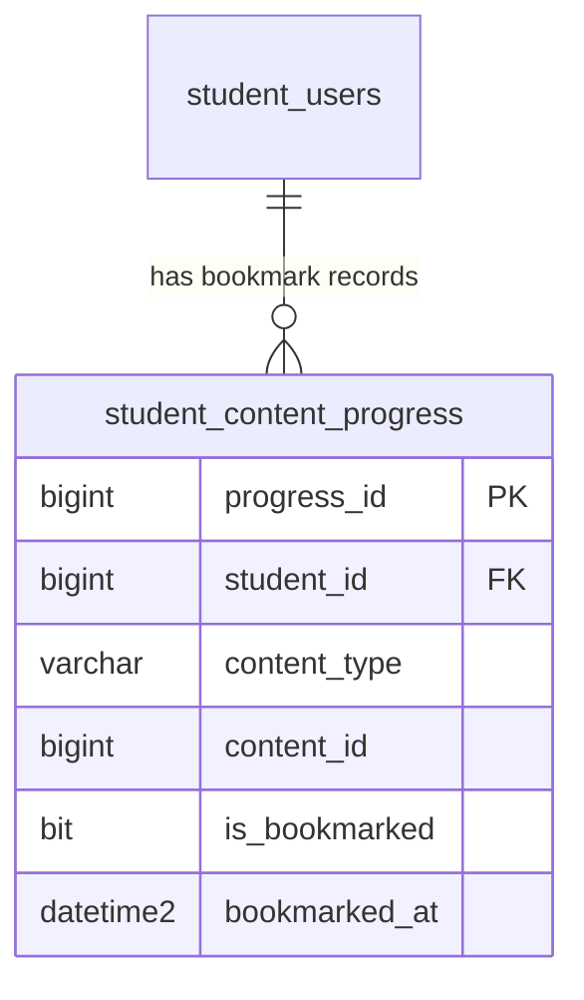

# SPEC — Dictionary & Bookmarks
> ⚠️ **DEPRECATED (2026-06-21).** Mô tả bookmark qua `student_content_progress` trong file này **không còn
> đúng với code**: cơ chế bookmark đã được thay bằng sổ "Từ cần ôn lại" (review deck). Tham chiếu spec
> hiện hành: [`docs/specs/SPEC_BACKEND_FLASHCARD_NOTEBOOK_DICTIONARY.md`](../../../../docs/specs/SPEC_BACKEND_FLASHCARD_NOTEBOOK_DICTIONARY.md).
> Giữ lại để tra lịch sử; KHÔNG dùng làm nguồn chuẩn.
>
> **Feature ID:** `feat-dictionary-bookmark`
> **UC Coverage:** UC-16 (Dictionary & Search), UC-17 (Bookmark Learning)
> **Version:** 1.0 | **Status:** Deprecated
> **Author:** Team | **Last Updated:** 2026-05-28

---

## 1. CONTEXT & GOAL

### 1.1 Bối cảnh
Trong quá trình học tiếng Nhật, khả năng tra cứu nhanh chóng và lưu trữ các kiến thức quan trọng để ôn tập lại là vô cùng cần thiết. Học viên cần một công cụ tra cứu từ điển tích hợp sẵn toàn diện (từ vựng, ngữ pháp, Kanji) và tính năng đánh dấu (bookmark) bài học để cá nhân hóa lộ trình tự ôn tập.

### 1.2 Mục tiêu
- Cung cấp thanh tìm kiếm thông minh giúp tra cứu toàn hệ thống (từ vựng, Kanji, ngữ pháp, bài học) bằng từ khóa (Hiragana, Romaji, Kanji, tiếng Việt).
- Cung cấp giao diện tra cứu từ điển chi tiết với đầy đủ cách đọc Furigana, âm Hán Việt, âm Onyomi/Kunyomi, dịch nghĩa, câu ví dụ song ngữ và audio phát âm.
- Cho phép đánh dấu (bookmark) bất kỳ mục nội dung nào kèm ghi chú cá nhân và thời gian đánh dấu.
- Hỗ trợ xem danh sách bookmarks được phân loại rõ ràng (Kanji, ngữ pháp, từ vựng, bài học) và bộ lọc theo cấp độ JLPT.

### 1.3 Tại sao cần?
Không có từ điển tích hợp $\rightarrow$ học viên phải sử dụng các bên thứ ba, làm ngắt quãng trải nghiệm học. Không có bookmark $\rightarrow$ học viên dễ quên các phần kiến thức khó và không thể gom nhóm nội dung cần ôn tập trọng tâm.

---

## 2. ACTOR

| Actor | Role | Điều kiện tiền quyết |
|:---|:---|:---|
| **Student** | Người tra cứu từ điển và đánh dấu bài học | Đã đăng nhập, status = `active` |

---

## 3. FUNCTIONAL REQUIREMENTS (EARS)

### 3.1 UC-16 — Tra từ điển & Tìm kiếm (Dictionary & Search)

| ID | EARS Requirement |
|:---|:---|
| FR-DICT-01 | WHEN a Student enters a search query, THE SYSTEM SHALL search across `vocabulary` (word, furigana, meaning), `kanji` (character_value, meaning), `grammar_points` (structure, meaning), and `lessons` (title). |
| FR-DICT-02 | THE SYSTEM SHALL return search results grouped by category: Vocabulary, Kanji, Grammar, and Lessons, with relevance-based pagination. |
| FR-DICT-03 | WHEN a Student selects a search result, THE SYSTEM SHALL fetch and display the detailed model of the item (with example sentences, audio_url, Onyomi, Kunyomi, or usage explanations). |
| FR-DICT-04 | THE SYSTEM SHALL support queries in Japanese characters (Kanji/Kana), Romaji, and Vietnamese translations. |
| FR-DICT-05 | WHILE searching, THE SYSTEM SHALL exclude any items with `status != 'published'` from the search results to prevent exposure of draft or archived content. |

### 3.2 UC-17 — Đánh dấu học tập (Bookmark Learning)

| ID | EARS Requirement |
|:---|:---|
| FR-BOOK-10 | WHEN a Student clicks the 'Bookmark' button on a grammar point, Kanji, vocabulary, lesson, or Kana character, THE SYSTEM SHALL upsert `student_content_progress` with `is_bookmarked = 1`, `bookmarked_at = SYSUTCDATETIME()`, and the optional `bookmark_note`. |
| FR-BOOK-11 | WHEN a Student removes a bookmark, THE SYSTEM SHALL update `student_content_progress` setting `is_bookmarked = 0` and clearing `bookmark_note` and `bookmarked_at`. |
| FR-BOOK-12 | WHEN a Student views the Bookmark page, THE SYSTEM SHALL query `student_content_progress` where `student_id` matches and `is_bookmarked = 1`, sorted by `bookmarked_at DESC`. |
| FR-BOOK-13 | THE SYSTEM SHALL allow a Student to filter bookmarks by `content_type` ('lesson','vocabulary','kanji','kana','grammar') and search within bookmark notes. |
| FR-BOOK-14 | IF a bookmarked content item is deleted or status changes to `deleted`, THEN THE SYSTEM SHALL automatically hide it from the bookmarks view. |

---

## 4. NON-FUNCTIONAL REQUIREMENTS

| ID | Category | Requirement |
|:---|:---|:---|
| NFR-DICT-01 | Performance | Kết quả tìm kiếm (Search API) phải trả về dưới 300ms (p95) cho cơ sở dữ liệu lên đến 100,000 bản ghi. |
| NFR-DICT-02 | Performance | Bookmark toggle API phải xử lý dưới 200ms (p95) để đảm bảo trải nghiệm tương tác mượt mà. |
| NFR-DICT-03 | Security | Kết quả tra cứu chỉ hiển thị các tài liệu đã được duyệt (`status = 'published'`). |
| NFR-DICT-04 | Security | Student chỉ được truy cập, tạo, sửa, xóa danh sách bookmark của chính mình. |
| NFR-DICT-05 | Logging | Log mọi thao tác tìm kiếm và bookmark bằng SLF4J: `[INFO] {studentId, action: SEARCH/BOOKMARK, query/contentId}`. |

---

## 5. DATA MODEL

### 5.1 Bảng chính

> Nguồn: [`jlpt_database_v2.sql`](file:///d:/Japanese-Skill-Practice-Platform/3.src/infra/Database/jlpt_database_v2.sql)

```sql
-- Bảng 8: vocabulary
CREATE TABLE vocabulary (
    vocabulary_id       BIGINT IDENTITY(1,1) PRIMARY KEY,
    word                NVARCHAR(100)  NOT NULL,
    furigana            NVARCHAR(200)  NULL,
    meaning             NVARCHAR(500)  NOT NULL,
    word_type           NVARCHAR(50)   NULL,
    jlpt_level          NVARCHAR(5)    NOT NULL
        CHECK (jlpt_level IN ('N5','N4','N3','N2','N1')),
    topic               NVARCHAR(100)  NULL,
    audio_url           NVARCHAR(500)  NULL,
    example_sentence_jp NVARCHAR(MAX)  NULL,
    example_sentence_vi NVARCHAR(MAX)  NULL,
    lesson_id           BIGINT         NULL,
    status              NVARCHAR(20)   NOT NULL DEFAULT 'draft'
        CHECK (status IN ('draft','pending_review','rejected','published','archived','deleted')),
    created_by          BIGINT         NULL,
    approved_by         BIGINT         NULL,
    published_at        DATETIME2      NULL,
    created_at          DATETIME2      NOT NULL DEFAULT SYSUTCDATETIME(),
    updated_at          DATETIME2      NOT NULL DEFAULT SYSUTCDATETIME()
);

-- Bảng 7: kanji
CREATE TABLE kanji (
    kanji_id          BIGINT IDENTITY(1,1) PRIMARY KEY,
    character_value   NVARCHAR(5)    NOT NULL UNIQUE,
    meaning           NVARCHAR(500)  NOT NULL,
    onyomi            NVARCHAR(200)  NULL,
    kunyomi           NVARCHAR(200)  NULL,
    stroke_count      INT            NULL,
    jlpt_level        NVARCHAR(5)    NOT NULL
        CHECK (jlpt_level IN ('N5','N4','N3','N2','N1')),
    stroke_order_url  NVARCHAR(500)  NULL,
    example_word      NVARCHAR(100)  NULL,
    example_reading   NVARCHAR(200)  NULL,
    example_meaning   NVARCHAR(500)  NULL,
    status            NVARCHAR(20)   NOT NULL DEFAULT 'draft'
        CHECK (status IN ('draft','pending_review','rejected','published','archived','deleted')),
    created_by        BIGINT         NULL,
    approved_by       BIGINT         NULL,
    published_at      DATETIME2      NULL,
    created_at        DATETIME2      NOT NULL DEFAULT SYSUTCDATETIME(),
    updated_at        DATETIME2      NOT NULL DEFAULT SYSUTCDATETIME()
);

-- Bảng 9: grammar_points
CREATE TABLE grammar_points (
    grammar_id          BIGINT IDENTITY(1,1) PRIMARY KEY,
    structure           NVARCHAR(255)  NOT NULL,
    formula             NVARCHAR(500)  NULL,
    meaning             NVARCHAR(500)  NOT NULL,
    usage_explanation   NVARCHAR(MAX)  NULL,
    jlpt_level          NVARCHAR(5)    NOT NULL
        CHECK (jlpt_level IN ('N5','N4','N3','N2','N1')),
    example_sentence_jp NVARCHAR(MAX)  NULL,
    example_sentence_vi NVARCHAR(MAX)  NULL,
    lesson_id           BIGINT         NULL,
    status              NVARCHAR(20)   NOT NULL DEFAULT 'draft'
        CHECK (status IN ('draft','pending_review','rejected','published','archived','deleted')),
    created_by          BIGINT         NULL,
    approved_by         BIGINT         NULL,
    published_at        DATETIME2      NULL,
    created_at          DATETIME2      NOT NULL DEFAULT SYSUTCDATETIME(),
    updated_at          DATETIME2      NOT NULL DEFAULT SYSUTCDATETIME()
);

-- Bảng 6: lessons (covers lesson / reading / listening / speaking)
CREATE TABLE lessons (
    lesson_id        BIGINT IDENTITY(1,1) PRIMARY KEY,
    course_id        BIGINT          NULL,
    lesson_type      NVARCHAR(20)    NOT NULL DEFAULT 'lesson'
        CHECK (lesson_type IN ('lesson','reading','listening','speaking')),
    title            NVARCHAR(255)   NOT NULL,
    jlpt_level       NVARCHAR(5)     NOT NULL
        CHECK (jlpt_level IN ('N5','N4','N3','N2','N1')),
    content_text     NVARCHAR(MAX)   NULL,
    video_url        NVARCHAR(500)   NULL,
    audio_url        NVARCHAR(500)   NULL,
    attachment_url   NVARCHAR(500)   NULL,
    explanation      NVARCHAR(MAX)   NULL,
    display_order    INT             NOT NULL DEFAULT 0,
    status           NVARCHAR(20)    NOT NULL DEFAULT 'draft'
        CHECK (status IN ('draft','pending_review','rejected','published','archived','deleted')),
    created_by       BIGINT          NULL,
    approved_by      BIGINT          NULL,
    published_at     DATETIME2       NULL,
    created_at       DATETIME2       NOT NULL DEFAULT SYSUTCDATETIME(),
    updated_at       DATETIME2       NOT NULL DEFAULT SYSUTCDATETIME()
);

-- Bảng 16: student_content_progress
CREATE TABLE student_content_progress (
    progress_id      BIGINT IDENTITY(1,1) PRIMARY KEY,
    student_id       BIGINT          NOT NULL,
    content_type     NVARCHAR(30)    NOT NULL
        CHECK (content_type IN ('lesson','vocabulary','kanji','kana','grammar')),
    content_id       BIGINT          NOT NULL,
    status           NVARCHAR(20)    NOT NULL DEFAULT 'learning'
        CHECK (status IN ('learning','completed','reviewing')),
    progress_percent DECIMAL(5,2)    NOT NULL DEFAULT 0,
    completed_at     DATETIME2       NULL,
    is_bookmarked    BIT             NOT NULL DEFAULT 0,
    bookmark_note    NVARCHAR(500)   NULL,
    bookmarked_at    DATETIME2       NULL,
    last_studied_at  DATETIME2       NOT NULL DEFAULT SYSUTCDATETIME(),
    created_at       DATETIME2       NOT NULL DEFAULT SYSUTCDATETIME(),
    CONSTRAINT FK_progress_student FOREIGN KEY (student_id) REFERENCES student_users(student_id) ON DELETE CASCADE,
    CONSTRAINT UQ_progress UNIQUE (student_id, content_type, content_id)
);
```

### 5.2 Quan hệ



---

## 6. API SPEC

### `GET /api/dictionary/search?q={query}&page=0&size=20`
**Actor:** Student | **Auth:** Bearer JWT

**Response (200):**
```json
{
  "status": 200,
  "message": "Tìm kiếm thành công",
  "data": {
    "vocabulary": [
      {
        "vocabId": 12,
        "word": "食べる",
        "furigana": "たべる",
        "meaning": "Ăn",
        "jlptLevel": "N5"
      }
    ],
    "kanji": [
      {
        "kanjiId": 45,
        "characterValue": "食",
        "meaning": "Thực (ăn)",
        "jlptLevel": "N5"
      }
    ],
    "grammar": [
      {
        "grammarId": 23,
        "structure": "～たい",
        "meaning": "Muốn làm gì",
        "jlptLevel": "N5"
      }
    ],
    "lessons": [
      {
        "lessonId": 2,
        "title": "Bài 2: Đi ăn nhà hàng",
        "lessonType": "lesson",
        "jlptLevel": "N5"
      }
    ]
  }
}
```

---

### `POST /api/bookmarks`
**Actor:** Student | **Auth:** Bearer JWT

**Request:**
```json
{
  "contentType": "vocabulary",
  "contentId": 12,
  "note": "Từ vựng quan trọng cần nhớ kỹ"
}
```

**Response (200):**
```json
{
  "status": 200,
  "message": "Đã lưu bookmark thành công",
  "data": {
    "progressId": 123,
    "contentType": "vocabulary",
    "contentId": 12,
    "isBookmarked": true,
    "bookmarkNote": "Từ vựng quan trọng cần nhớ kỹ",
    "bookmarkedAt": "2026-05-28T23:44:00Z"
  }
}
```

---

### `DELETE /api/bookmarks/{progressId}`
**Actor:** Student | **Auth:** Bearer JWT

**Response (200):**
```json
{
  "status": 200,
  "message": "Đã gỡ bookmark thành công",
  "data": null
}
```

---

### `GET /api/bookmarks?type={vocabulary|kanji|grammar|lesson|kana}&page=0&size=20`
**Actor:** Student | **Auth:** Bearer JWT

**Response (200):**
```json
{
  "status": 200,
  "message": "Lấy danh sách bookmark thành công",
  "data": {
    "content": [
      {
        "progressId": 123,
        "contentType": "vocabulary",
        "contentId": 12,
        "bookmarkedAt": "2026-05-28T23:44:00Z",
        "note": "Từ vựng quan trọng cần nhớ kỹ",
        "details": {
          "titleOrWord": "食べる",
          "furigana": "たべる",
          "meaning": "Ăn",
          "jlptLevel": "N5"
        }
      }
    ],
    "totalElements": 1,
    "totalPages": 1
  }
}
```

---

## 7. ERROR HANDLING

| HTTP Code | Error Code | Message | Trigger |
|:---:|:---|:---|:---|
| 400 | `VALIDATION_FAILED` | "contentType không hợp lệ" | Gửi contentType không thuộc danh mục |
| 401 | `UNAUTHORIZED` | "Yêu cầu đăng nhập" | JWT token thiếu hoặc hết hạn |
| 403 | `FORBIDDEN` | "Không có quyền chỉnh sửa bookmark này" | Student cố gỡ bookmark của người khác |
| 404 | `CONTENT_NOT_FOUND` | "Nội dung học tập không tồn tại" | contentId không tồn tại trong hệ thống |
| 404 | `BOOKMARK_NOT_FOUND` | "Không tìm thấy bookmark" | progressId không chính xác |
| 500 | `INTERNAL_ERROR` | "Internal server error" | Lỗi kết nối CSDL hoặc lỗi hệ thống |

---

## 8. ACCEPTANCE CRITERIA

| ID | Scenario | Given | When | Then |
|:---|:---|:---|:---|:---|
| AC-DICT-01 | Tìm kiếm thông minh trả kết quả đa nhóm | Có dữ liệu Kanji, Từ vựng, Ngữ pháp đã xuất bản | GET /api/dictionary/search?q=taberu | Trả về kết quả phân tách nhóm rõ ràng |
| AC-BOOK-01 | Đánh dấu bookmark thành công | Student đã đăng nhập, nội dung hợp lệ | POST /api/bookmarks | Lưu dữ liệu vào student_content_progress với `is_bookmarked = 1` |
| AC-BOOK-02 | Không hiển thị nội dung bị xóa | Bookmark cũ trỏ tới Kanji đã bị deleted | GET /api/bookmarks | Kết quả không chứa Kanji đó |
| AC-BOOK-03 | Gỡ bỏ bookmark thành công | Bookmark đang tồn tại | DELETE /api/bookmarks/{id} | Cập nhật `is_bookmarked = 0` và không còn hiện ở danh sách bookmarks |

---

## OUT OF SCOPE

- ❌ Tra từ điển bằng máy ảnh (OCR) trực tiếp — xem `feat-ai-skills`.
- ❌ Chia sẻ danh sách bookmark giữa các học viên.
