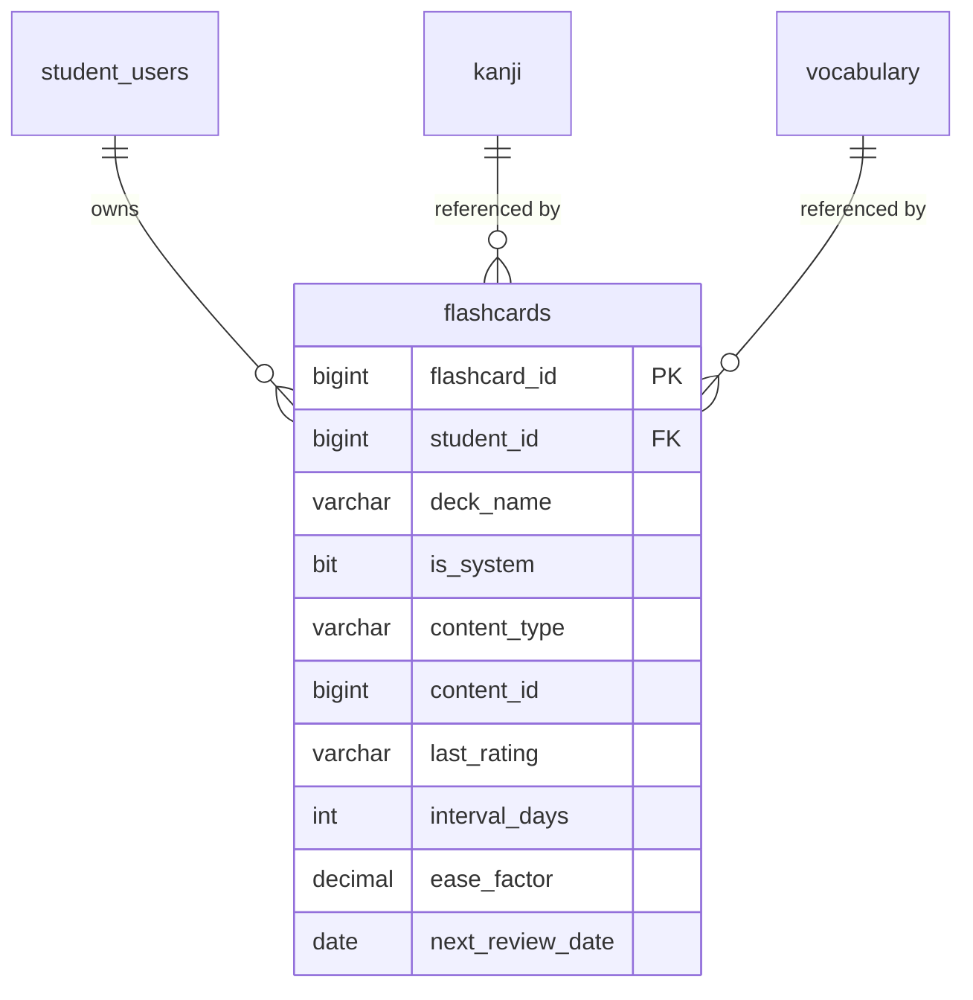

# SPEC — Flashcard Learning with SRS Algorithm
> **Feature ID:** `feat-flashcard-srs`
> **UC Coverage:** UC-12 (Flashcard Learning)
> **Version:** 1.0 | **Status:** Draft
> **Author:** Team | **Last Updated:** 2026-05-28

---

## 1. CONTEXT & GOAL

### 1.1 Bối cảnh
Ghi nhớ từ vựng và Kanji đòi hỏi ôn tập đúng thời điểm. Thuật toán Spaced Repetition System (SRS) — cụ thể là SM-2 — tự động lên lịch ôn tập dựa trên mức độ ghi nhớ của học viên, giúp ghi nhớ lâu hơn với thời gian ôn ít hơn.

### 1.2 Mục tiêu
- Hiển thị flashcard từ bộ thẻ cá nhân hoặc bộ thẻ hệ thống
- Thực thi thuật toán SM-2 để tính `interval_days` và `ease_factor` sau mỗi đánh giá
- Ưu tiên hiển thị các thẻ đến hạn ôn tập hôm nay (`next_review_date <= TODAY`)

### 1.3 Tại sao cần?
SRS là công cụ học ngôn ngữ hiệu quả nhất về mặt khoa học nhận thức. Không có SRS, học viên sẽ ôn tập ngẫu nhiên và quên nhanh hơn nhiều.

---

## 2. ACTOR

| Actor | Role | Điều kiện tiền quyết |
|:---|:---|:---|
| **Student** | Học và ôn tập flashcard | Đã đăng nhập, status = `active` |

---

## 3. FUNCTIONAL REQUIREMENTS (EARS)

### 3.1 Quản lý Deck & Thẻ

| ID | EARS Requirement |
|:---|:---|
| FR-FC-01 | WHEN a Student accesses the Flashcard section, THE SYSTEM SHALL display all decks belonging to the student (`student_id` matches) plus system decks (`is_system = 1`). |
| FR-FC-02 | WHEN a Student opens a deck, THE SYSTEM SHALL prioritize displaying flashcards where `next_review_date <= CURRENT_DATE`, ordered by `next_review_date ASC`. |
| FR-FC-03 | IF a deck has no cards due today (`next_review_date > CURRENT_DATE`), THE SYSTEM SHALL display a message indicating the next scheduled review date. |
| FR-FC-04 | THE SYSTEM SHALL allow a Student to create a custom deck by specifying a `deck_name`. |
| FR-FC-05 | THE SYSTEM SHALL allow a Student to delete a personal deck (soft delete: `is_deleted = 1` on all cards in the deck). THE SYSTEM SHALL NOT allow deletion of system decks (`is_system = 1`). |

### 3.2 Phiên ôn tập (Review Session)

| ID | EARS Requirement |
|:---|:---|
| FR-FC-10 | WHEN a flashcard is shown, THE SYSTEM SHALL display the front side (question/character) only. THE SYSTEM SHALL NOT reveal the back side (answer) until the Student requests it. |
| FR-FC-11 | WHEN a Student clicks "Lật thẻ" (Flip), THE SYSTEM SHALL reveal the back side of the card containing the answer, meaning, example sentence, and audio URL if available. |
| FR-FC-12 | WHEN a Student submits a rating of `easy`, `hard`, or `wrong`, THE SYSTEM SHALL apply the SM-2 algorithm to update `interval_days`, `ease_factor`, `next_review_date`, `repetition_count`, and `last_rating`. |
| FR-FC-13 | THE SYSTEM SHALL store `last_reviewed_at = CURRENT_TIMESTAMP` on every rating submission. |

### 3.3 Thuật toán SM-2

| ID | EARS Requirement |
|:---|:---|
| FR-FC-20 | THE SYSTEM SHALL implement SM-2 with the following rating mapping: `easy` = quality 5, `hard` = quality 2, `wrong` = quality 0. |
| FR-FC-21 | WHEN `rating = 'wrong'` (quality < 3), THE SYSTEM SHALL reset `repetition_count = 0` and `interval_days = 1`, and schedule `next_review_date = CURRENT_DATE + 1`. |
| FR-FC-22 | WHEN `rating = 'hard'` (quality = 2), THE SYSTEM SHALL keep `ease_factor` unchanged and set `interval_days = MAX(1, previous_interval)`. |
| FR-FC-23 | WHEN `rating = 'easy'` (quality = 5), THE SYSTEM SHALL calculate new `interval_days` using SM-2 formula and increase `ease_factor` by 0.1 (max 2.5). |
| FR-FC-24 | THE SYSTEM SHALL enforce: `ease_factor >= 1.3` at all times to prevent interval collapse. |
| FR-FC-25 | THE SYSTEM SHALL NOT store full review history per card — only the current SRS state (last rating, interval, ease_factor, next_review_date). |

```
SM-2 Algorithm:
IF repetition_count == 0: interval = 1 day
IF repetition_count == 1: interval = 6 days
IF repetition_count >= 2: interval = round(previous_interval * ease_factor)

ease_factor = ease_factor + (0.1 - (5 - quality) * (0.08 + (5 - quality) * 0.02))
ease_factor = MAX(1.3, ease_factor)
```

### 3.4 Thêm thẻ từ nội dung học

| ID | EARS Requirement |
|:---|:---|
| FR-FC-30 | WHEN a Student adds a Kanji or Vocabulary item to Flashcard (from `feat-core-learning`), THE SYSTEM SHALL create a new `flashcards` record with `content_type`, `content_id`, `interval_days = 1`, `ease_factor = 2.50`, `next_review_date = CURRENT_DATE`. |
| FR-FC-31 | IF a flashcard for the same `(student_id, content_type, content_id)` already exists, THE SYSTEM SHALL return HTTP 409 and not create a duplicate. |

---

## 4. NON-FUNCTIONAL REQUIREMENTS

| ID | Category | Requirement |
|:---|:---|:---|
| NFR-FC-01 | Performance | Deck list và card fetch < 200ms (p95) |
| NFR-FC-02 | Correctness | SM-2 algorithm phải được unit tested với ít nhất 10 test cases |
| NFR-FC-03 | Data Integrity | `ease_factor` KHÔNG BAO GIỜ < 1.3 — validate tại Service layer |
| NFR-FC-04 | Security | Student chỉ truy cập deck/card của chính mình hoặc system decks |
| NFR-FC-05 | Logging | Log mọi review session: `{studentId, flashcardId, rating, newInterval}` |

---

## 5. DATA MODEL

### 5.1 Bảng chính

> Nguồn: [`jlpt_database_v2.sql`](file:///d:/Japanese-Skill-Practice-Platform/3.src/infra/Database/jlpt_database_v2.sql)

```sql
-- Bảng 17: flashcards (deck + card + SRS state gộp chung)
CREATE TABLE flashcards (
    flashcard_id     BIGINT IDENTITY(1,1) PRIMARY KEY,
    student_id       BIGINT          NULL,               -- FK → student_users (NULL = system card)
    deck_name        NVARCHAR(255)   NOT NULL DEFAULT N'Default',
    is_system        BIT             NOT NULL DEFAULT 0,
    content_type     NVARCHAR(20)    NOT NULL
        CHECK (content_type IN ('kanji','vocabulary','grammar','custom')),
    content_id       BIGINT          NULL,               -- FK đến bảng tương ứng (nullable đối với custom)
    front_text       NVARCHAR(MAX)   NULL,               -- custom card front
    back_text        NVARCHAR(MAX)   NULL,               -- custom card back
    -- SRS State (SM-2 Algorithm)
    last_rating      NVARCHAR(10)    NULL
        CHECK (last_rating IN ('easy','hard','wrong')),
    interval_days    INT             NOT NULL DEFAULT 1,  -- days until next review
    ease_factor      DECIMAL(5,2)    NOT NULL DEFAULT 2.50, -- SM-2 factor
    repetition_count INT             NOT NULL DEFAULT 0,
    next_review_date DATE            NULL,
    last_reviewed_at DATETIME2       NULL,
    created_at       DATETIME2       NOT NULL DEFAULT SYSUTCDATETIME(),
    CONSTRAINT FK_flashcard_student FOREIGN KEY (student_id)
        REFERENCES student_users(student_id) ON DELETE CASCADE
);
```

### 5.2 Quan hệ



---

## 6. API SPEC

### `GET /api/flashcard-decks`
**Actor:** Student | **Auth:** Bearer JWT

**Response (200):**
```json
{
  "status": 200,
  "message": "OK",
  "data": [
    {
      "deckName": "string",
      "isSystem": "boolean",
      "totalCards": "int",
      "dueToday": "int",
      "nextReviewDate": "date|null"
    }
  ]
}
```

---

### `GET /api/flashcards?deckName={name}&dueOnly=true&page=0&size=20`
**Actor:** Student | **Auth:** Bearer JWT

**Response (200):**
```json
{
  "status": 200,
  "message": "OK",
  "data": {
    "content": [
      {
        "flashcardId": "long",
        "contentType": "string",
        "contentId": "long|null",
        "frontText": "string",
        "nextReviewDate": "date",
        "isDue": "boolean"
      }
    ],
    "totalElements": "long",
    "totalPages": "int"
  }
}
```

---

### `GET /api/flashcards/{flashcardId}/reveal`
**Actor:** Student | **Auth:** Bearer JWT
> Lật thẻ — trả về mặt sau (answer side).

**Response (200):**
```json
{
  "status": 200,
  "message": "OK",
  "data": {
    "flashcardId": "long",
    "contentType": "string",
    "backContent": {
      "meaning": "string",
      "reading": "string|null",
      "exampleSentence": "string|null",
      "audioUrl": "string|null"
    },
    "currentInterval": "int",
    "easeFactor": "number"
  }
}
```

---

### `POST /api/flashcards/{flashcardId}/review`
**Actor:** Student | **Auth:** Bearer JWT

**Request:**
```json
{
  "rating": "string — easy|hard|wrong"
}
```

**Response (200):**
```json
{
  "status": 200,
  "message": "Đánh giá đã được lưu",
  "data": {
    "flashcardId": "long",
    "newIntervalDays": "int",
    "newEaseFactor": "number",
    "nextReviewDate": "date",
    "repetitionCount": "int"
  }
}
```

---

### `POST /api/flashcard-decks`
**Actor:** Student | **Auth:** Bearer JWT

**Request:**
```json
{ "deckName": "string — max 100 chars" }
```

**Response (201):**
```json
{
  "status": 201,
  "message": "Tạo bộ thẻ thành công",
  "data": { "deckName": "string" }
}
```

---

### `DELETE /api/flashcard-decks/{deckName}`
**Actor:** Student | **Auth:** Bearer JWT

**Response (200):**
```json
{
  "status": 200,
  "message": "Đã xóa bộ thẻ",
  "data": null
}
```

---

## 7. ERROR HANDLING

| HTTP Code | Error Code | Message | Trigger |
|:---:|:---|:---|:---|
| 400 | `INVALID_RATING` | "Rating phải là easy, hard hoặc wrong" | rating không hợp lệ |
| 401 | `UNAUTHORIZED` | "Yêu cầu đăng nhập" | JWT thiếu/hết hạn |
| 403 | `ACCESS_DENIED` | "Không có quyền truy cập bộ thẻ này" | Truy cập deck của người khác |
| 403 | `SYSTEM_DECK_IMMUTABLE` | "Không thể xóa bộ thẻ hệ thống" | Xóa is_system=1 deck |
| 404 | `FLASHCARD_NOT_FOUND` | "Thẻ không tồn tại" | flashcardId không có hoặc đã xóa |
| 404 | `DECK_NOT_FOUND` | "Bộ thẻ không tồn tại" | deckName không có |
| 409 | `FLASHCARD_EXISTS` | "Nội dung này đã có trong Flashcard" | Tạo thẻ trùng |
| 422 | `EASE_FACTOR_VIOLATION` | "ease_factor không hợp lệ" | ease_factor < 1.3 (internal guard) |
| 500 | `INTERNAL_ERROR` | "Internal server error" | Lỗi hệ thống |

---

## 8. ACCEPTANCE CRITERIA

| ID | Scenario | Given | When | Then |
|:---|:---|:---|:---|:---|
| AC-FC-01 | Xem deck list | Student có 2 deck cá nhân + 1 system deck | GET /api/flashcard-decks | Trả 3 deck, is_system đúng |
| AC-FC-02 | Lấy thẻ đến hạn | 5 thẻ: 3 due today, 2 future | GET ?dueOnly=true | Chỉ trả 3 thẻ |
| AC-FC-03 | Lật thẻ | flashcard kanji tồn tại | GET /reveal | Trả meaning, reading, không lộ khi chưa gọi |
| AC-FC-04 | Đánh giá "wrong" reset | interval=10, ease=2.5 | POST rating=wrong | interval=1, ease=2.5 (hoặc giảm), nextReview=tomorrow |
| AC-FC-05 | Đánh giá "easy" tăng interval | interval=6, ease=2.5, count=2 | POST rating=easy | interval=15 (6*2.5), nextReview+=15 |
| AC-FC-06 | ease_factor không xuống < 1.3 | ease=1.4, nhiều "wrong" liên tiếp | POST rating=wrong nhiều lần | ease_factor không bao giờ < 1.3 |
| AC-FC-07 | Không tạo trùng flashcard | Đã có flashcard cho kanji ID 5 | POST thêm lại kanji ID 5 | HTTP 409 FLASHCARD_EXISTS |
| AC-FC-08 | Không xóa system deck | deck is_system=1 | DELETE deck | HTTP 403 SYSTEM_DECK_IMMUTABLE |

---

## OUT OF SCOPE

- ❌ Full review history per card — chỉ lưu state hiện tại (thiết kế v2.4)
- ❌ Custom card creation (front/back text tự nhập) — Phase 2
- ❌ Deck sharing giữa users — Phase 2
- ❌ Import/Export deck (Anki format) — Phase 2
- ❌ Advanced SRS (SM-4, FSRS) — chỉ dùng SM-2
- ❌ Leech detection (thẻ học mãi không nhớ) — Phase 2
