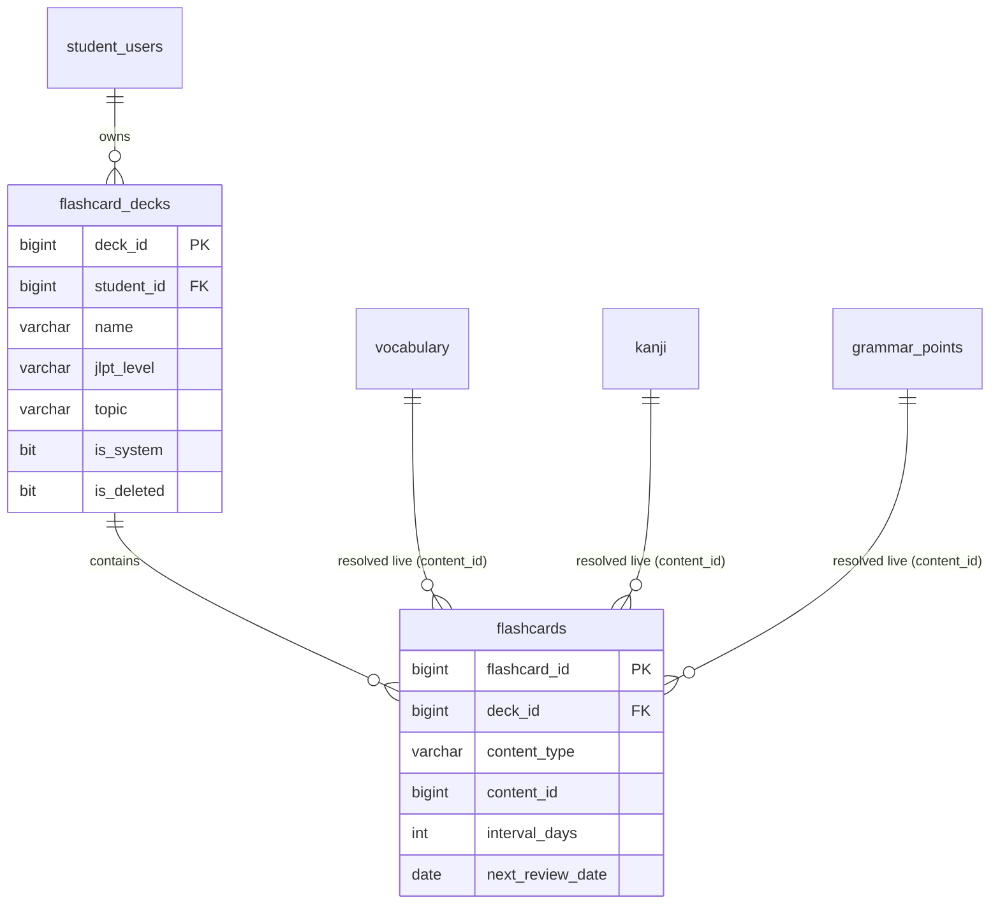

# SPEC — Flashcard Learning with SRS Algorithm
> **Feature ID:** `feat-flashcard-srs`
> **UC Coverage:** UC-12 (Flashcard Learning)
> **Version:** 2.2 | **Status:** Draft (revised)
> **Author:** Team | **Last Updated:** 2026-06-14

---

## CHANGELOG

| Version | Date | Thay đổi |
|:---|:---|:---|
| 1.0 | 2026-05-28 | Bản đầu — deck là chuỗi `deck_name` trên bảng `flashcards`, text copy vào thẻ. |
| **2.0** | **2026-06-14** | **(1)** Tách "Sổ tay riêng" thành bảng `flashcard_decks` first-class (deck có id, metadata, đổi tên rẻ). **(2)** Thẻ tích hợp từ vựng/Kanji/ngữ pháp **resolve live** qua JOIN thay vì copy text. **(3)** Bỏ hack "thẻ giữ chỗ" (`is_placeholder`) — deck rỗng là bản ghi thật. **(4)** Bỏ magic string tách `jlpt_level`/`topic` từ tên deck. **(5)** Sau phiên ôn từ vựng, gợi ý thêm **từ sai** vào sổ tay tự động **"Từ cần ôn lại"** (per-student, cờ `is_review_deck` — không phải `is_system` toàn cục). **Bỏ** cơ chế gợi ý bookmark cũ (`suggestBookmark` → `student_content_progress`). |
| **2.1** | **2026-06-14** | **Học từ vựng theo cặp**: trong một cụm (deck), mỗi từ đi qua **Thẻ chữ** (học) → **Thẻ ôn tập** (trắc nghiệm 2 đáp án; chữ Nhật → chọn nghĩa). Phiên học **trộn từ mới + từ đến hạn ôn**. Chấm SM-2 **tự động từ đáp án** (đúng → easy, sai → wrong) — **SUPERSEDES** tự chấm easy/hard/wrong (FR-FC-12) cho từ vựng. **Không** đổi schema (NEW/REVIEW suy ra từ `repetition_count`/`last_reviewed_at`). Xem §3.6. |
| **2.2** | **2026-06-14** | **Điều hướng học từ vựng theo giáo trình**: Cấp độ (N5→N1) → Chủ đề → phiên Flashcard. Thêm `GET /api/vocabulary/levels`, `GET /api/vocabulary/topics`; session nhận `level+topic`. NEW/REVIEW tính bằng LEFT JOIN vocabulary↔flashcards (không pre-create card; tạo card khi trả lời lần đầu). Xem §3.7. |

> ⚠️ **Sai lệch đã biết (carry-over từ v1.0):** Mục §3.3 mô tả SM-2 dùng `ease_factor`, nhưng schema thực tế (`V1__init_schema.sql`) và entity `Flashcard.java` **chưa có cột `ease_factor`** — hiện chỉ dùng `interval_days` + `repetition_count`. Sai lệch này **nằm ngoài phạm vi** bản revision 2.0 (chỉ xử lý deck + live-resolve) và được giữ nguyên để theo dõi riêng. Data model §5 phản ánh **schema thật**, không phải `ease_factor` giả định.

---

## 1. CONTEXT & GOAL

### 1.1 Bối cảnh
Ghi nhớ từ vựng và Kanji đòi hỏi ôn tập đúng thời điểm. Thuật toán Spaced Repetition System (SRS) — cụ thể là SM-2 — tự động lên lịch ôn tập dựa trên mức độ ghi nhớ của học viên, giúp ghi nhớ lâu hơn với thời gian ôn ít hơn. Học viên cũng cần tự tổ chức nội dung thành **sổ tay riêng** (personal deck) và đưa nhanh từ vựng đang tra cứu vào sổ tay để học.

### 1.2 Mục tiêu
- Cho phép học viên quản lý **sổ tay riêng** như một thực thể độc lập (`flashcard_decks`): tạo, đổi tên, gắn mô tả/cấp độ/chủ đề/màu, xóa mềm.
- Hiển thị flashcard từ sổ tay cá nhân hoặc bộ thẻ hệ thống (`is_system = 1`).
- **Tích hợp từ vựng vào flashcard**: thêm một mục từ vựng/Kanji/ngữ pháp vào sổ tay; mặt thẻ được **resolve live** từ bảng nguồn tại thời điểm hiển thị (Staff sửa nghĩa → thẻ tự cập nhật).
- Thực thi thuật toán SM-2 để tính lịch ôn tập sau mỗi đánh giá.
- Ưu tiên hiển thị các thẻ đến hạn ôn tập hôm nay (`next_review_date <= TODAY`).
- **Ôn từ vựng bằng flashcard**: kết thúc một phiên ôn, hệ thống **gợi ý** đưa các **từ bị chấm sai** vào sổ tay tự động **"Từ cần ôn lại"** (mỗi học viên một sổ, tự tạo khi cần) để ôn tập trọng tâm.
- **Học từ vựng theo cặp Thẻ chữ → Thẻ ôn tập**: trong một cụm, mỗi từ hiển thị **Thẻ chữ** để học rồi **Thẻ ôn tập** trắc nghiệm 2 đáp án (chữ Nhật → chọn nghĩa); một phiên **trộn từ mới và từ đến hạn ôn**; chọn đáp án **tự động** sinh rating SM-2 (đúng → easy, sai → wrong).

### 1.3 Tại sao cần?
SRS là công cụ học ngôn ngữ hiệu quả nhất về mặt khoa học nhận thức. Không có SRS, học viên ôn tập ngẫu nhiên và quên nhanh hơn. Không có sổ tay first-class, việc đổi tên/quản lý nhóm thẻ tốn kém (phải UPDATE hàng loạt) và thiếu metadata. Không resolve live, dữ liệu thẻ đông cứng và lệch với nội dung do Staff biên tập.

---

## 2. ACTOR

| Actor | Role | Điều kiện tiền quyết |
|:---|:---|:---|
| **Student** | Quản lý sổ tay, học và ôn tập flashcard | Đã đăng nhập, status = `active` |

---

## 3. FUNCTIONAL REQUIREMENTS (EARS)

### 3.1 Quản lý Sổ tay (Deck) — *first-class*

| ID | EARS Requirement |
|:---|:---|
| FR-FC-01 | WHEN a Student accesses the Flashcard section, THE SYSTEM SHALL list all decks from `flashcard_decks` where `student_id` matches plus system decks (`is_system = 1`), each with `total_cards` and `due_today` aggregated from `flashcards`. |
| FR-FC-02 | WHEN a Student opens a deck, THE SYSTEM SHALL prioritize displaying flashcards where `next_review_date <= CURRENT_DATE`, ordered by `next_review_date ASC`. |
| FR-FC-03 | IF a deck has no cards due today, THE SYSTEM SHALL display a message indicating the next scheduled review date. |
| FR-FC-04 | THE SYSTEM SHALL allow a Student to create a personal deck by specifying `deckName` (required, max 100 chars); other metadata (`description`, `jlpt_level`, `topic`, `color`) is set afterwards via PATCH (FR-FC-06). THE SYSTEM SHALL reject (HTTP 409) a `deckName` that already exists for that student (non-deleted). |
| FR-FC-05 | THE SYSTEM SHALL allow a Student to delete a personal deck (soft delete: set `flashcard_decks.is_deleted = 1` AND `is_deleted = 1` on all its cards). THE SYSTEM SHALL NOT allow deletion of system decks (`is_system = 1`). |
| FR-FC-06 | THE SYSTEM SHALL allow a Student to rename a personal deck or update its metadata by `deck_id` (single-row UPDATE). THE SYSTEM SHALL NOT allow editing system decks. |
| FR-FC-07 | THE SYSTEM SHALL display a newly created deck even when it contains zero cards, WITHOUT relying on placeholder cards. |

### 3.2 Phiên ôn tập (Review Session)

| ID | EARS Requirement |
|:---|:---|
| FR-FC-10 | WHEN a flashcard is shown, THE SYSTEM SHALL display the front side only and SHALL NOT reveal the back side until the Student requests it. |
| FR-FC-11 | WHEN a Student clicks "Lật thẻ" (Flip), THE SYSTEM SHALL reveal the back side (answer, meaning, example sentence, audio URL if available). |
| FR-FC-12 | WHEN a Student submits a rating of `easy`, `hard`, or `wrong`, THE SYSTEM SHALL apply the SM-2 algorithm to update `interval_days`, `next_review_date`, `repetition_count`, and `last_rating`. |
| FR-FC-13 | THE SYSTEM SHALL store `last_reviewed_at = CURRENT_TIMESTAMP` on every rating submission. |

### 3.3 Thuật toán SM-2

| ID | EARS Requirement |
|:---|:---|
| FR-FC-20 | THE SYSTEM SHALL implement SM-2 with rating mapping: `easy` = quality 5, `hard` = quality 2, `wrong` = quality 0. |
| FR-FC-21 | WHEN `rating = 'wrong'`, THE SYSTEM SHALL reset `repetition_count = 0`, `interval_days = 1`, `next_review_date = CURRENT_DATE + 1`. |
| FR-FC-22 | WHEN `rating = 'hard'`, THE SYSTEM SHALL set `interval_days = MAX(1, previous_interval)`. |
| FR-FC-23 | WHEN `rating = 'easy'`, THE SYSTEM SHALL increase the interval per SM-2 progression (1 → 6 → round(prev × factor)). |
| FR-FC-24 | THE SYSTEM SHALL NOT store full review history per card — only the current SRS state. |

> Tham chiếu công thức SM-2 đầy đủ ở phần cuối §3.3 (v1.0). `ease_factor` xem ghi chú sai lệch ở đầu file.

### 3.4 Thêm thẻ từ nội dung học — *tích hợp + live resolve*

| ID | EARS Requirement |
|:---|:---|
| FR-FC-30 | WHEN a Student adds a Vocabulary, Kanji, or Grammar item to a deck, THE SYSTEM SHALL create a `flashcards` record storing `deck_id`, `content_type`, `content_id`, `interval_days = 1`, `next_review_date = CURRENT_DATE`, and SHALL leave `front_text`/`back_text` NULL (text is resolved live, not copied). |
| FR-FC-31 | IF a flashcard for the same `(student_id, content_type, content_id)` already exists, THE SYSTEM SHALL return HTTP 409 and not create a duplicate. |
| FR-FC-32 | WHEN rendering a flashcard whose `content_type ∈ {vocabulary, kanji, grammar}`, THE SYSTEM SHALL resolve the display fields (word/character/structure, meaning, reading, jlpt_level, audio) live from the source table at read time (batch-fetched to avoid N+1). |
| FR-FC-33 | WHEN a Student adds a CUSTOM card, THE SYSTEM SHALL require `front_text` and `back_text` and store them literally (no live resolution). |
| FR-FC-34 | IF the source content of an integrated card is soft-deleted or its `status != 'published'`, THEN THE SYSTEM SHALL hide that card from review lists (consistent with bookmark behavior FR-BOOK-14). |

### 3.5 Gợi ý "Từ cần ôn lại" sau phiên ôn từ vựng

| ID | EARS Requirement |
|:---|:---|
| FR-FC-40 | THE SYSTEM SHALL maintain at most one auto deck named "Từ cần ôn lại" per student (`flashcard_decks.is_review_deck = 1`), created lazily (get-or-create) the first time it is needed. |
| FR-FC-41 | WHEN a Student submits the last review of a session (`isLastCardInSession = true`), THE SYSTEM SHALL collect the distinct cards rated `wrong` during that session whose `content_type = 'vocabulary'` and return them as `wrongWords` with `suggestAddToReviewDeck = true` (empty list ⇒ `false`). |
| FR-FC-42 | THE SYSTEM SHALL only *suggest*; it SHALL NOT auto-add wrong words. The wrong words are added only WHEN the Student explicitly confirms. |
| FR-FC-43 | WHEN a Student confirms, THE SYSTEM SHALL get-or-create the "Từ cần ôn lại" deck and create one flashcard per confirmed vocab item into that deck (`content_type='vocabulary'`, `content_id`, live-resolve per FR-FC-32, `next_review_date = CURRENT_DATE`). |
| FR-FC-44 | IF a vocab item already exists as a card in the "Từ cần ôn lại" deck, THE SYSTEM SHALL skip it (no duplicate) and count it as skipped. |
| FR-FC-45 | THE SYSTEM SHALL NOT emit the legacy bookmark suggestion (`student_content_progress`); the post-session suggestion targets the deck only. |

### 3.6 Học từ vựng theo cặp: Thẻ chữ → Thẻ ôn tập (trắc nghiệm 2 đáp án) — *vocabulary-first*

> Áp dụng cho thẻ `content_type = 'vocabulary'`. Thẻ Kanji/Grammar/Custom giữ luồng lật thẻ + tự chấm (§3.2). **SUPERSEDES FR-FC-12** (tự chấm easy/hard/wrong) đối với **từ vựng**: rating suy ra **tự động** từ kết quả trắc nghiệm. Không cần đổi schema — NEW/REVIEW suy ra từ `repetition_count` + `last_reviewed_at`; đáp án trắc nghiệm sinh runtime từ bảng `vocabulary`.

**Khái niệm:** Một "cụm" = một deck. Một phiên học **trộn** thẻ TỪ MỚI và thẻ ĐẾN HẠN ÔN. Mỗi từ gồm 2 bước nối tiếp — (1) **Thẻ chữ**: hiện từ + furigana + nghĩa + ví dụ (học/nhắc); (2) **Thẻ ôn tập**: câu trắc nghiệm 2 đáp án, hiện **chữ Nhật → chọn nghĩa**.

| ID | EARS Requirement |
|:---|:---|
| FR-FC-50 | THE SYSTEM SHALL classify each vocab card as **NEW** (`repetition_count = 0 AND last_reviewed_at IS NULL`) or **REVIEW** (`last_reviewed_at IS NOT NULL AND next_review_date <= CURRENT_DATE`), derived at read time without schema change. |
| FR-FC-51 | WHEN a Student starts a deck session, THE SYSTEM SHALL build ONE interleaved queue of up to `NEW_CARDS_PER_DAY` (named constant, default 10) NEW cards plus ALL REVIEW cards due today, in randomized mixed order. |
| FR-FC-52 | WHEN a queue item is a NEW card, THE SYSTEM SHALL present the **Thẻ chữ** first (word, furigana, meaning, example — live-resolved per FR-FC-32) THEN the **Thẻ ôn tập** quiz. |
| FR-FC-53 | WHEN a queue item is a REVIEW card, THE SYSTEM SHALL present the **Thẻ ôn tập** quiz directly WITHOUT revealing the meaning first; IF the submitted answer is wrong, THEN THE SYSTEM SHALL reveal the Thẻ chữ before advancing. |
| FR-FC-54 | THE SYSTEM SHALL build each Thẻ ôn tập with EXACTLY 2 options — the correct meaning of the card's vocab plus 1 distractor meaning from a DIFFERENT vocab (prefer same deck, else same `jlpt_level`), in randomized order, distractors batch-fetched (no N+1). |
| FR-FC-55 | THE SYSTEM SHALL NOT include any `isCorrect` flag, the correct meaning, or the card's own `content_id` in the **REVIEW** quiz payload sent to the client (anti-pattern: client-trusted data / authorization-by-UI-hide). The verdict is computed server-side on submission. |
| FR-FC-56 | WHEN a Student submits a quiz answer (`selectedOptionId`), THE SYSTEM SHALL determine correctness server-side, map `correct → quality 'easy'` and `wrong → 'wrong'`, apply SM-2 (FR-FC-20..23), and set `last_reviewed_at = CURRENT_TIMESTAMP` (a NEW card thereby becomes REVIEW). |
| FR-FC-57 | WHEN a quiz answer is submitted, THE SYSTEM SHALL return `{ correct, correctOptionId, correctMeaning, rating, newIntervalDays, nextReviewDate, repetitionCount }` so the client can show feedback and the Thẻ chữ on a wrong answer. |
| FR-FC-58 | THE SYSTEM SHALL treat a quiz wrong answer as rating `wrong` for the "Từ cần ôn lại" suggestion (§3.5): wrong vocab cards in the session are collected as `wrongWords` per FR-FC-41. |

### 3.7 Điều hướng học từ vựng: Cấp độ → Chủ đề → Flashcard

> Một "cụm" từ vựng có thể đến từ **(a)** giáo trình hệ thống — chọn **Cấp độ (N5→N1) → Chủ đề** — hoặc **(b)** sổ tay riêng (§3.1). Cả hai đều chạy phiên học theo cặp §3.6.

| ID | EARS Requirement |
|:---|:---|
| FR-FC-60 | WHEN a Student opens vocabulary learning, THE SYSTEM SHALL list JLPT levels N5..N1, each with the count of distinct published topics and total published words at that level. |
| FR-FC-61 | WHEN a Student selects a level, THE SYSTEM SHALL list the distinct `topic` values of published, non-deleted vocabulary at that level, each with `wordCount`, `learnedCount` (student already has a flashcard), and `dueCount` (due today). |
| FR-FC-62 | WHEN a Student selects a topic, THE SYSTEM SHALL start a §3.6 session over the published vocabulary of that `(jlpt_level, topic)`, computing NEW/REVIEW by LEFT JOIN of vocabulary with the student's flashcards on `content_id` — WITHOUT pre-creating cards. |
| FR-FC-63 | THE SYSTEM SHALL treat a vocab with NO flashcard row, OR a row with `repetition_count = 0 AND last_reviewed_at IS NULL`, as NEW; a reviewed row due today as REVIEW; a reviewed row not yet due SHALL be excluded from the session. |
| FR-FC-64 | WHEN a Student submits the first quiz answer for a vocab that has no flashcard row, THE SYSTEM SHALL get-or-create the flashcard (`student`, `content_type='vocabulary'`, `content_id`, deck = that level+topic) BEFORE applying SM-2. |
| FR-FC-65 | THE SYSTEM SHALL include only vocabulary with `status = 'published'` AND `is_deleted = 0` in levels, topics, and sessions (consistent with FR-FC-34). |

---

## 4. NON-FUNCTIONAL REQUIREMENTS

| ID | Category | Requirement |
|:---|:---|:---|
| NFR-FC-01 | Performance | Deck list và card fetch < 200ms (p95). Live-resolve PHẢI batch-fetch theo loại (không N+1). |
| NFR-FC-02 | Correctness | SM-2 algorithm phải được unit tested với ít nhất 10 test cases. |
| NFR-FC-04 | Security | Student chỉ truy cập deck/card của chính mình hoặc system decks. |
| NFR-FC-05 | Logging | Log mọi review session: `{studentId, flashcardId, rating, newInterval}`. |
| NFR-FC-06 | Consistency | Thẻ tích hợp KHÔNG lưu bản sao text; nguồn sự thật là bảng content. |

---

## 5. DATA MODEL

### 5.1 Bảng chính

```sql
-- MỚI (V9) — Sổ tay first-class
CREATE TABLE flashcard_decks (
    deck_id        BIGINT IDENTITY(1,1) PRIMARY KEY,
    student_id     BIGINT          NULL,            -- NULL = deck hệ thống
    name           NVARCHAR(255)   NOT NULL,
    description    NVARCHAR(500)   NULL,
    jlpt_level     NVARCHAR(5)     NULL
        CHECK (jlpt_level IN ('N5','N4','N3','N2','N1')),
    topic          NVARCHAR(100)   NULL,
    color          NVARCHAR(20)    NULL,
    display_order  INT             NOT NULL DEFAULT 0,
    is_system      BIT             NOT NULL DEFAULT 0,   -- deck hệ thống toàn cục (student_id NULL)
    is_review_deck BIT             NOT NULL DEFAULT 0,   -- sổ auto "Từ cần ôn lại" (per-student)
    is_deleted     BIT             NOT NULL DEFAULT 0,
    created_at     DATETIME2       NOT NULL DEFAULT SYSUTCDATETIME(),
    updated_at     DATETIME2       NOT NULL DEFAULT SYSUTCDATETIME(),
    CONSTRAINT FK_deck_student FOREIGN KEY (student_id)
        REFERENCES student_users(student_id) ON DELETE CASCADE
);
-- Unique tên deck theo từng học viên (filtered: bỏ qua deck đã xóa & deck hệ thống student_id NULL)
CREATE UNIQUE INDEX UQ_deck_student_name
    ON flashcard_decks(student_id, name)
    WHERE is_deleted = 0 AND student_id IS NOT NULL;
-- Đảm bảo mỗi học viên chỉ có TỐI ĐA 1 sổ "Từ cần ôn lại"
CREATE UNIQUE INDEX UQ_review_deck_per_student
    ON flashcard_decks(student_id)
    WHERE is_review_deck = 1 AND is_deleted = 0;

-- SỬA (V9) — flashcards: thay deck_name (string) bằng deck_id (FK); bỏ is_placeholder.
-- Phản ánh schema THẬT: KHÔNG có ease_factor.
CREATE TABLE flashcards (
    flashcard_id     BIGINT IDENTITY(1,1) PRIMARY KEY,
    student_id       BIGINT          NULL,           -- NULL = system card
    deck_id          BIGINT          NOT NULL,       -- FK → flashcard_decks (thay deck_name)
    is_system        BIT             NOT NULL DEFAULT 0,
    content_type     NVARCHAR(20)    NOT NULL
        CHECK (content_type IN ('kanji','vocabulary','grammar','custom')),
    content_id       BIGINT          NULL,           -- FK logic tới bảng nguồn (NULL với custom)
    front_text       NVARCHAR(MAX)   NULL,           -- CHỈ dùng cho custom; NULL với thẻ tích hợp
    back_text        NVARCHAR(MAX)   NULL,           -- CHỈ dùng cho custom; NULL với thẻ tích hợp
    last_rating      NVARCHAR(10)    NULL
        CHECK (last_rating IN ('easy','hard','wrong')),
    interval_days    INT             NOT NULL DEFAULT 1,
    repetition_count INT             NOT NULL DEFAULT 0,
    next_review_date DATE            NULL,
    last_reviewed_at DATETIME2       NULL,
    is_deleted       BIT             NOT NULL DEFAULT 0,
    created_at       DATETIME2       NOT NULL DEFAULT SYSUTCDATETIME(),
    CONSTRAINT FK_flashcard_student FOREIGN KEY (student_id)
        REFERENCES student_users(student_id) ON DELETE CASCADE,
    CONSTRAINT FK_flashcard_deck FOREIGN KEY (deck_id)
        REFERENCES flashcard_decks(deck_id)
);
```

### 5.2 Quan hệ



### 5.3 Migration `V9__flashcard_decks.sql` — thứ tự bắt buộc

1. `CREATE TABLE flashcard_decks` + filtered unique index.
2. Backfill: `INSERT INTO flashcard_decks (student_id, name, is_system, jlpt_level, topic)` từ `SELECT DISTINCT student_id, deck_name, ...` của `flashcards` (tách `jlpt_level`/`topic` từ pattern `"{level}_{topic}"` cũ nếu có).
3. `ALTER TABLE flashcards ADD deck_id BIGINT NULL;` rồi `UPDATE` join theo `(student_id, deck_name)`.
4. `DELETE FROM flashcards WHERE is_placeholder = 1;` (deck rỗng giờ là row thật) → `DROP COLUMN is_placeholder`.
5. Thêm `FK_flashcard_deck` + đặt `deck_id NOT NULL`.
6. **Giữ `deck_name` lại tạm thời**; chỉ `DROP COLUMN deck_name` ở **V10** sau khi code chạy ổn (an toàn rollback).

> ⚠️ Rủi ro & cách xử lý: (a) system deck `student_id NULL` không dính unique → đã dùng *filtered index* loại `student_id IS NULL`; (b) backfill phải chạy **trước** khi set `NOT NULL`.

---

## 6. API SPEC

### `GET /api/flashcard-decks`
**Actor:** Student | **Auth:** Bearer JWT
```json
{ "status": 200, "message": "OK", "data": [
  { "deckId": 12, "name": "Sổ tay N3", "description": "Từ khó", "jlptLevel": "N3",
    "topic": "食べ物", "color": "#22aa55", "isSystem": false,
    "totalCards": 24, "dueToday": 5, "nextReviewDate": "2026-06-15" } ] }
```

### `POST /api/flashcard-decks`
**Request:** `{ "deckName": "Sổ tay N3" }`  *(chỉ tên; metadata khác đặt qua PATCH — FR-FC-06)*
**Response (201):** `{ "status": 201, "message": "Tạo sổ tay thành công", "data": { "deckId": 12, "name": "Sổ tay N3" } }`

### `PATCH /api/flashcard-decks/{deckId}`  *(mới)*
**Request:** `{ "name": "Tên mới", "description": "...", "color": "#3366ff" }`
**Response (200):** `{ "status": 200, "message": "Đã cập nhật sổ tay", "data": { "deckId": 12, "name": "Tên mới" } }`

### `DELETE /api/flashcard-decks/{deckId}`
**Response (200):** `{ "status": 200, "message": "Đã xóa sổ tay", "data": null }`

### `GET /api/flashcards?deckId={id}&dueOnly=true&page=0&size=20`
> `frontText` ở response là giá trị **resolve live** từ bảng nguồn (với thẻ tích hợp).
```json
{ "status": 200, "message": "OK", "data": { "content": [
  { "flashcardId": 88, "deckId": 12, "contentType": "vocabulary", "contentId": 15,
    "frontText": "食べる", "jlptLevel": "N5", "nextReviewDate": "2026-06-14", "isDue": true } ],
  "totalElements": 24, "totalPages": 2 } }
```

### `GET /api/vocabulary/levels`  *(mới — §3.7 điều hướng)*
**Actor:** Student | **Auth:** Bearer JWT
```json
{ "status": 200, "message": "OK", "data": [
  { "level": "N5", "topicCount": 12, "wordCount": 480 },
  { "level": "N4", "topicCount": 10, "wordCount": 360 } ] }
```

### `GET /api/vocabulary/topics?level=N5`  *(mới — §3.7)*
**Actor:** Student | **Auth:** Bearer JWT
> Trả các chủ đề (distinct `topic`) của từ vựng published ở cấp độ đó, kèm tiến độ học viên.
```json
{ "status": 200, "message": "OK", "data": [
  { "topic": "食べ物", "wordCount": 40, "learnedCount": 12, "dueCount": 5 },
  { "topic": "家族", "wordCount": 25, "learnedCount": 0, "dueCount": 0 } ] }
```

### `GET /api/flashcards/session`  *(mới — phiên học trộn mới + ôn)*
**Query (chọn 1 nguồn cụm):** `?level=N5&topic={topic}&newLimit=10` (giáo trình, §3.7) **hoặc** `?deckId={id}&newLimit=10` (sổ tay riêng).
**Actor:** Student | **Auth:** Bearer JWT
> Trả hàng đợi đã **trộn**: tối đa `newLimit` thẻ NEW (mặc định `NEW_CARDS_PER_DAY = 10`) + tất cả thẻ REVIEW đến hạn. Với chế độ giáo trình, NEW/REVIEW tính bằng LEFT JOIN vocabulary↔flashcards (FR-FC-62..64). Mỗi phần tử có `stage`. Với `stage = REVIEW`, payload **KHÔNG** chứa `learn` (nghĩa) hay `contentId` (chống lộ đáp án — FR-FC-55).
```json
{ "status": 200, "message": "OK", "data": { "deckId": 12, "newCount": 8, "reviewCount": 5, "queue": [
  { "flashcardId": 88, "stage": "NEW",
    "front": { "word": "食べる", "furigana": "たべる" },
    "learn": { "meaning": "ăn", "exampleJp": "ご飯を食べる", "exampleVi": "ăn cơm", "audioUrl": "/uploads/a.mp3" },
    "quiz": { "options": [ { "optionId": 41, "meaning": "uống" }, { "optionId": 15, "meaning": "ăn" } ] } },
  { "flashcardId": 92, "stage": "REVIEW",
    "front": { "word": "飲む", "furigana": "のむ" }, "learn": null,
    "quiz": { "options": [ { "optionId": 15, "meaning": "ăn" }, { "optionId": 41, "meaning": "uống" } ] } } ] } }
```

### `POST /api/flashcards`  *(thêm thẻ vào sổ tay)*
**Request:** `{ "deckId": 12, "contentType": "VOCABULARY", "contentId": 15 }`  *(hoặc custom: `{ "deckId": 12, "contentType": "CUSTOM", "frontText": "...", "backText": "..." }`)*
**Response (201):** thẻ vừa tạo (frontText resolve live nếu là thẻ tích hợp).

### `GET /api/flashcards/{flashcardId}/reveal`
> Lật thẻ — resolve live mặt sau với thẻ tích hợp. Giữ hành vi v1.0.

### `POST /api/flashcards/{flashcardId}/review`
> **Từ vựng (trắc nghiệm):** Client gửi `selectedOptionId`; server **tự** xác định đúng/sai, suy ra rating (`đúng → easy`, `sai → wrong`) rồi chấm SM-2. KHÔNG nhận `rating` từ client cho thẻ từ vựng (chống client-trusted data — FR-FC-55/56).
> **Kanji/Grammar/Custom (lật thẻ):** giữ `rating` (easy/hard/wrong) như §3.2.
> Nếu là thẻ cuối phiên (`isLastCardInSession=true`) → trả kèm gợi ý từ sai (§3.5).

**Request (vocab):** `{ "selectedOptionId": 41, "isLastCardInSession": true }`
**Request (kanji/grammar/custom):** `{ "rating": "wrong", "isLastCardInSession": true }`
**Response (vocab quiz):**
```json
{ "status": 200, "message": "Đánh giá đã được lưu", "data": {
  "flashcardId": 92, "correct": false, "correctOptionId": 15, "correctMeaning": "ăn",
  "rating": "wrong", "newIntervalDays": 1, "nextReviewDate": "2026-06-15", "repetitionCount": 0,
  "suggestAddToReviewDeck": true,
  "wrongWords": [ { "contentType": "vocabulary", "contentId": 41, "frontText": "飲む" } ] } }
```

### `POST /api/flashcards/review-deck/add`  *(mới — xác nhận thêm từ sai vào "Từ cần ôn lại")*
**Request:** `{ "items": [ { "contentType": "vocabulary", "contentId": 15 } ] }`
> Get-or-create sổ "Từ cần ôn lại" của học viên rồi thêm các từ (bỏ qua trùng).
```json
{ "status": 200, "message": "Đã thêm vào Từ cần ôn lại", "data": {
  "deckId": 7, "name": "Từ cần ôn lại", "addedCount": 1, "skippedCount": 0 } }
```

---

## 7. ERROR HANDLING

| HTTP Code | Error Code | Message | Trigger |
|:---:|:---|:---|:---|
| 400 | `INVALID_RATING` | "Rating phải là easy, hard hoặc wrong" | rating không hợp lệ |
| 400 | `INVALID_OPTION` | "Đáp án không hợp lệ" | selectedOptionId không thuộc 2 đáp án đã phát |
| 400 | `CUSTOM_TEXT_REQUIRED` | "frontText và backText là bắt buộc cho thẻ tùy chỉnh" | CUSTOM thiếu text |
| 401 | `UNAUTHORIZED` | "Yêu cầu đăng nhập" | JWT thiếu/hết hạn |
| 403 | `ACCESS_DENIED` | "Không có quyền truy cập sổ tay này" | Truy cập deck của người khác |
| 403 | `SYSTEM_DECK_IMMUTABLE` | "Không thể sửa/xóa sổ tay hệ thống" | Sửa/xóa is_system=1 deck |
| 404 | `FLASHCARD_NOT_FOUND` | "Thẻ không tồn tại" | flashcardId không có/đã xóa |
| 404 | `DECK_NOT_FOUND` | "Sổ tay không tồn tại" | deckId không có |
| 404 | `CONTENT_NOT_FOUND` | "Nội dung học tập không tồn tại" | contentId không tồn tại khi thêm thẻ |
| 409 | `DECK_NAME_DUPLICATE` | "Sổ tay này đã tồn tại" | Trùng name theo student |
| 409 | `FLASHCARD_EXISTS` | "Nội dung này đã có trong Flashcard" | Trùng (student, content_type, content_id) |
| 500 | `INTERNAL_ERROR` | "Internal server error" | Lỗi hệ thống |

---

## 8. ACCEPTANCE CRITERIA

| ID | Scenario | Given | When | Then |
|:---|:---|:---|:---|:---|
| AC-FC-01 | Xem deck list | Student có 2 sổ tay + 1 system deck | GET /api/flashcard-decks | Trả 3 deck với deckId, total, dueToday |
| AC-FC-02 | Lấy thẻ đến hạn | 5 thẻ: 3 due today, 2 future | GET ?dueOnly=true | Chỉ trả 3 thẻ |
| AC-FC-03 | Tạo sổ tay rỗng | Student chưa có sổ "Du lịch" | POST /api/flashcard-decks | Deck hiện ngay với totalCards=0, KHÔNG có placeholder card |
| AC-FC-04 | Đổi tên sổ tay rẻ | Sổ tay deckId=12 có 50 thẻ | PATCH name | Chỉ 1 row flashcard_decks bị UPDATE, 50 thẻ không đụng |
| AC-FC-05 | Thêm từ vựng vào sổ tay | Vocabulary ID 15 published | POST contentType=VOCABULARY | Thẻ lưu content_id=15, front_text NULL |
| AC-FC-06 | Resolve live | Thẻ trỏ vocab 15; Staff sửa meaning | GET /api/flashcards | frontText/back phản ánh nghĩa MỚI ngay |
| AC-FC-07 | Ẩn nội dung đã xóa | Thẻ trỏ vocab đã soft-delete | GET /api/flashcards | Thẻ không xuất hiện |
| AC-FC-08 | Không tạo trùng thẻ | Đã có thẻ cho vocab 15 | POST lại vocab 15 | HTTP 409 FLASHCARD_EXISTS |
| AC-FC-09 | Không xóa system deck | deck is_system=1 | DELETE deck | HTTP 403 SYSTEM_DECK_IMMUTABLE |
| AC-FC-10 | SM-2 wrong reset | interval=10 | POST rating=wrong | interval=1, nextReview=tomorrow |
| AC-FC-11 | Gợi ý từ sai cuối phiên | Phiên có 2 thẻ vocab chấm wrong | POST review (isLastCardInSession=true) | suggestAddToReviewDeck=true, wrongWords có 2 mục |
| AC-FC-12 | Không gợi ý khi không sai | Phiên toàn easy/hard | POST review cuối phiên | suggestAddToReviewDeck=false, wrongWords rỗng |
| AC-FC-13 | Xác nhận thêm vào "Từ cần ôn lại" | Học viên chưa có sổ review | POST /review-deck/add | Sổ "Từ cần ôn lại" được tạo, addedCount đúng |
| AC-FC-14 | Bỏ qua trùng | Vocab 15 đã có trong sổ review | POST /review-deck/add lại vocab 15 | skippedCount=1, không tạo trùng |
| AC-FC-15 | Chỉ 1 sổ review/học viên | Đã có sổ "Từ cần ôn lại" | Thêm từ sai lần 2 | Dùng lại đúng sổ cũ (UQ_review_deck_per_student) |
| AC-FC-16 | Phân loại NEW/REVIEW | Thẻ A repetition=0 & lastReviewed NULL; thẻ B đã ôn, đến hạn | GET /session | A.stage=NEW, B.stage=REVIEW |
| AC-FC-17 | Phiên trộn, giới hạn từ mới | 30 từ mới + 5 từ đến hạn, newLimit=10 | GET /session | queue có 10 NEW + 5 REVIEW, trộn ngẫu nhiên |
| AC-FC-18 | Từ mới: thẻ chữ rồi quiz | Item stage=NEW | Render | Có `learn` (nghĩa/ví dụ) + `quiz` 2 đáp án |
| AC-FC-19 | Từ ôn: không lộ nghĩa | Item stage=REVIEW | GET /session | `learn=null`, payload không chứa nghĩa đúng/contentId |
| AC-FC-20 | Quiz đúng 2 đáp án | Thẻ vocab bất kỳ | GET /session | `options` đúng 2 mục, không có field isCorrect |
| AC-FC-21 | Chấm tự động — sai | Thẻ REVIEW interval=10 | POST review selectedOptionId SAI | correct=false, rating=wrong, interval=1, nextReview=mai, vào wrongWords |
| AC-FC-22 | Chấm tự động — đúng | Thẻ vocab | POST review selectedOptionId ĐÚNG | correct=true, rating=easy, interval tăng theo SM-2 |
| AC-FC-23 | Liệt kê cấp độ | Có vocab published ở N5, N4 | GET /vocabulary/levels | Trả N5..N1, mỗi cấp có topicCount, wordCount |
| AC-FC-24 | Liệt kê chủ đề theo cấp | N5 có 3 chủ đề published | GET /vocabulary/topics?level=N5 | Trả 3 chủ đề + wordCount/learnedCount/dueCount |
| AC-FC-25 | Mở chủ đề → phiên | Chủ đề 食べ物 40 từ, học viên chưa học | GET /session?level=N5&topic=食べ物 | queue NEW (≤ newLimit), KHÔNG pre-create card; submit lần đầu mới tạo card |

---

## OUT OF SCOPE

- ❌ Bổ sung cột `ease_factor` (sai lệch v1.0) — theo dõi & xử lý riêng.
- ❌ Full review history per card — chỉ lưu state hiện tại.
- ❌ Deck sharing giữa users — Phase sau.
- ❌ Import/Export deck (Anki format) — Phase sau.
- ❌ Advanced SRS (SM-4, FSRS) — chỉ dùng SM-2.
- ❌ Drop cột `deck_name` — để migration V10 sau khi code ổn định.
- ❌ Trắc nghiệm cho Kanji/Grammar — phase sau (v2.1 chỉ áp dụng **từ vựng**; Kanji/Grammar giữ lật thẻ + tự chấm).
