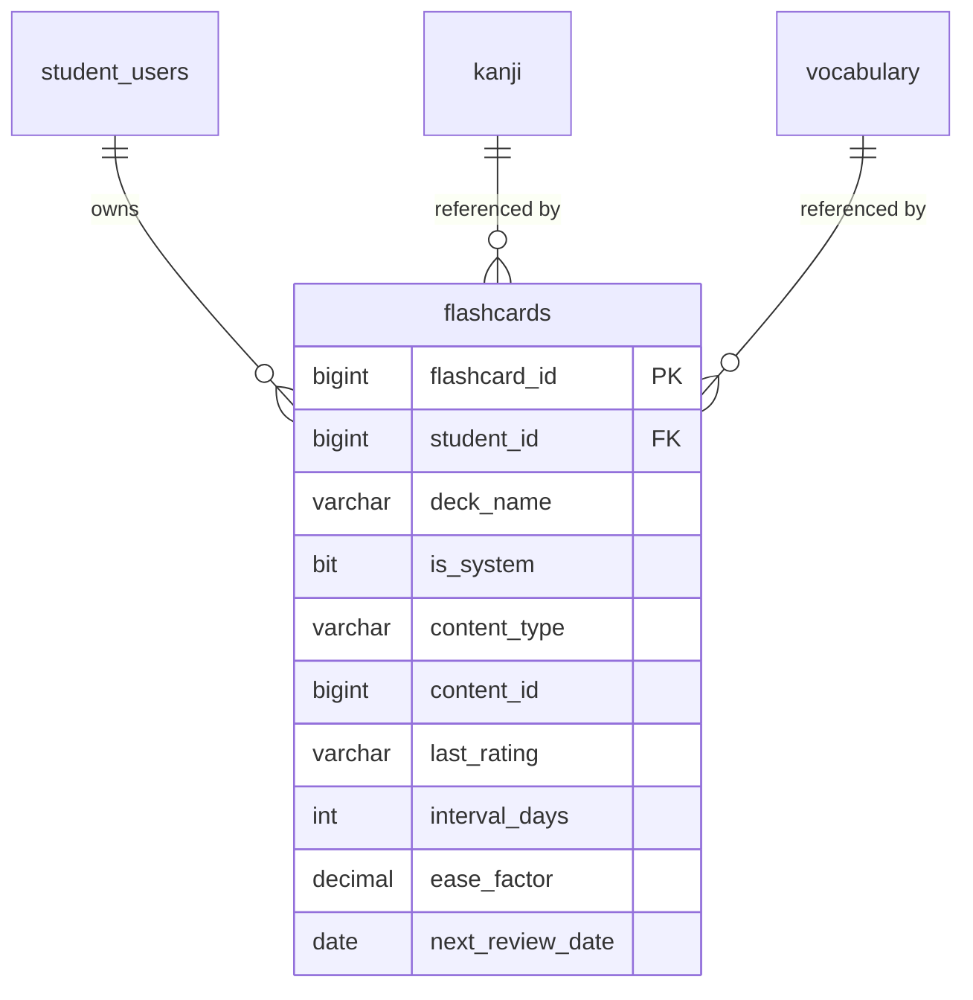

# SPEC — Flashcard Learning with SRS Algorithm
> **Feature ID:** `feat-flashcard-srs`
> **UC Coverage:** UC-12 (Flashcard Learning)
> **Version:** 2.1 | **Status:** Active
> **Author:** Team | **Last Updated:** 2026-06-17

---

## CHANGELOG

| Version | Date | Thay đổi |
|:---|:---|:---|
| 1.0 | 2026-05-28 | Bản nháp đầu: deck/card, SM-2 day-level, reveal, add card (FR-FC-01..31). |
| 2.0 | 2026-06-17 | Bổ sung **§3.5 Phiên học trộn NEW + REVIEW** (FR-FC-50..56, 64, 65 — đã triển khai) và **§3.6 Nhịp phiên & Learning Steps** (FR-FC-70..81 — cải tiến: cadence 5 NEW : 1–2 REVIEW, intra-session requeue, overload caps, điều kiện kết thúc). Bổ sung API `GET /api/flashcard-sessions`, AC pacing, và §10 Implementation Delta. |
| 2.1 | 2026-06-17 | **Đổi mô hình cadence §3.6** (FR-FC-70..72): bỏ nhịp gate-theo-số-NEW (5 NEW → 1–2 REVIEW), thay bằng **gate theo backlog hàng đợi REVIEW**: mặc định phục vụ NEW, khi `reviewQueue ≥ REVIEW_TRIGGER = 5` thì xả một loạt `REVIEW_BURST = 3` thẻ ÔN TẬP rồi quay lại NEW. Cập nhật pseudocode, AC-FC-09, §10. Không đổi DB/migration. |
| 2.2 | 2026-06-18 | **Đồng bộ §6 với contract đã triển khai** (FE+BE): session endpoint là `GET /api/flashcards/session` (không phải `/api/flashcard-sessions`); deck thao tác bằng `deckId` (deck first-class V9), thêm `PATCH /api/flashcard-decks/{deckId}`; `POST .../review` nhận thêm `selectedOptionId`/`isLastCardInSession` và rating không phân biệt hoa/thường; thêm lỗi `DECK_EXISTS` (409). Thêm logging review (NFR-FC-05). Không đổi DB/logic SRS. |

---

## 1. CONTEXT & GOAL

### 1.1 Bối cảnh
Ghi nhớ từ vựng và Kanji đòi hỏi ôn tập đúng thời điểm. Thuật toán Spaced Repetition System (SRS) — cụ thể là SM-2 — tự động lên lịch ôn tập dựa trên mức độ ghi nhớ của học viên, giúp ghi nhớ lâu hơn với thời gian ôn ít hơn.

### 1.2 Mục tiêu
- Hiển thị flashcard từ bộ thẻ cá nhân hoặc bộ thẻ hệ thống
- Thực thi thuật toán SM-2 để tính `interval_days` và `ease_factor` sau mỗi đánh giá
- Ưu tiên hiển thị các thẻ đến hạn ôn tập hôm nay (`next_review_date <= TODAY`)

### 1.3 Tại sao cần?
SRS là công cụ học ngôn ngữ hiệu quả nhất về mặt khoa học nhận thức. Không có SRS, học viên sẽ ôn tập ngẫu nhiên và quên nhanh hơn nhiều.

---

## 2. ACTOR

| Actor | Role | Điều kiện tiền quyết |
|:---|:---|:---|
| **Student** | Học và ôn tập flashcard | Đã đăng nhập, status = `active` |

---

## 3. FUNCTIONAL REQUIREMENTS (EARS)

### 3.1 Quản lý Deck & Thẻ

| ID | EARS Requirement |
|:---|:---|
| FR-FC-01 | WHEN a Student accesses the Flashcard section, THE SYSTEM SHALL display all decks belonging to the student (`student_id` matches) plus system decks (`is_system = 1`). |
| FR-FC-02 | WHEN a Student opens a deck, THE SYSTEM SHALL prioritize displaying flashcards where `next_review_date <= CURRENT_DATE`, ordered by `next_review_date ASC`. |
| FR-FC-03 | IF a deck has no cards due today (`next_review_date > CURRENT_DATE`), THE SYSTEM SHALL display a message indicating the next scheduled review date. |
| FR-FC-04 | THE SYSTEM SHALL allow a Student to create a custom deck by specifying a `deck_name`. |
| FR-FC-05 | THE SYSTEM SHALL allow a Student to delete a personal deck (soft delete: `is_deleted = 1` on all cards in the deck). THE SYSTEM SHALL NOT allow deletion of system decks (`is_system = 1`). |

### 3.2 Phiên ôn tập (Review Session)

| ID | EARS Requirement |
|:---|:---|
| FR-FC-10 | WHEN a flashcard is shown, THE SYSTEM SHALL display the front side (question/character) only. THE SYSTEM SHALL NOT reveal the back side (answer) until the Student requests it. |
| FR-FC-11 | WHEN a Student clicks "Lật thẻ" (Flip), THE SYSTEM SHALL reveal the back side of the card containing the answer, meaning, example sentence, and audio URL if available. |
| FR-FC-12 | WHEN a Student submits a rating of `easy`, `hard`, or `wrong`, THE SYSTEM SHALL apply the SM-2 algorithm to update `interval_days`, `ease_factor`, `next_review_date`, `repetition_count`, and `last_rating`. |
| FR-FC-13 | THE SYSTEM SHALL store `last_reviewed_at = CURRENT_TIMESTAMP` on every rating submission. |

### 3.3 Thuật toán SM-2

| ID | EARS Requirement |
|:---|:---|
| FR-FC-20 | THE SYSTEM SHALL implement SM-2 with the following rating mapping: `easy` = quality 5, `hard` = quality 2, `wrong` = quality 0. |
| FR-FC-21 | WHEN `rating = 'wrong'` (quality < 3), THE SYSTEM SHALL reset `repetition_count = 0` and `interval_days = 1`, and schedule `next_review_date = CURRENT_DATE + 1`. |
| FR-FC-22 | WHEN `rating = 'hard'` (quality = 2), THE SYSTEM SHALL keep `ease_factor` unchanged and set `interval_days = MAX(1, previous_interval)`. |
| FR-FC-23 | WHEN `rating = 'easy'` (quality = 5), THE SYSTEM SHALL calculate new `interval_days` using SM-2 formula and increase `ease_factor` by 0.1 (max 2.5). |
| FR-FC-24 | THE SYSTEM SHALL enforce: `ease_factor >= 1.3` at all times to prevent interval collapse. |
| FR-FC-25 | THE SYSTEM SHALL NOT store full review history per card — only the current SRS state (last rating, interval, ease_factor, next_review_date). |

```
SM-2 Algorithm:
IF repetition_count == 0: interval = 1 day
IF repetition_count == 1: interval = 6 days
IF repetition_count >= 2: interval = round(previous_interval * ease_factor)

ease_factor = ease_factor + (0.1 - (5 - quality) * (0.08 + (5 - quality) * 0.02))
ease_factor = MAX(1.3, ease_factor)
```

### 3.4 Thêm thẻ từ nội dung học

| ID | EARS Requirement |
|:---|:---|
| FR-FC-30 | WHEN a Student adds a Kanji or Vocabulary item to Flashcard (from `feat-core-learning`), THE SYSTEM SHALL create a new `flashcards` record with `content_type`, `content_id`, `interval_days = 1`, `ease_factor = 2.50`, `next_review_date = CURRENT_DATE`. |
| FR-FC-31 | IF a flashcard for the same `(student_id, content_type, content_id)` already exists, THE SYSTEM SHALL return HTTP 409 and not create a duplicate. |
| FR-FC-34 | WHEN resolving a card whose integrated source (`vocabulary`/`kanji`/`grammar`) is soft-deleted or `status != 'published'`, THE SYSTEM SHALL hide that card (exclude from list/session) rather than show a broken card. |

### 3.5 Phiên học trộn NEW + REVIEW (đã triển khai)

> Phiên học (`GET /api/flashcard-sessions`) trộn **thẻ MỚI** (chưa từng học) và **thẻ ÔN TẬP** (đến hạn SRS) thành một hàng đợi liền mạch cho 1 chủ đề/deck. Thẻ MỚI hiển thị dạng lật (học nghĩa), thẻ ÔN TẬP hiển thị dạng trắc nghiệm chấm tự động.

| ID | EARS Requirement |
|:---|:---|
| FR-FC-50 | WHEN a Student starts a session by `deckId`, OR by `level` + `topic`, THE SYSTEM SHALL build a queue from that scope only. IF neither is provided, THE SYSTEM SHALL return HTTP 400. |
| FR-FC-51 | THE SYSTEM SHALL cap the number of **NEW** cards admitted to a session at `newLimit` (default `NEW_CARDS_PER_DAY = 10`, overridable by request). |
| FR-FC-52 | A card is **NEW** WHEN `repetition_count = 0` AND `last_reviewed_at IS NULL`; a card is **REVIEW (due)** WHEN `next_review_date <= CURRENT_DATE`. THE SYSTEM SHALL classify every candidate as exactly one of NEW / REVIEW-due / not-eligible. |
| FR-FC-54 | WHEN building a REVIEW (quiz) card, THE SYSTEM SHALL offer the correct meaning plus at least one distractor meaning drawn from a different vocabulary item, shuffled. |
| FR-FC-55 | THE SYSTEM SHALL NOT include the correct answer (`contentId` / correct meaning) in the payload of a REVIEW (quiz) card — the server determines correctness on submit. |
| FR-FC-56 | WHEN a Student submits a REVIEW (quiz) answer, THE SYSTEM SHALL determine correctness server-side (selected `optionId` == card `content_id`) and map it to an SM-2 rating (`correct → easy`, `wrong → wrong`). |
| FR-FC-64 | WHEN a session is built by `level` + `topic`, THE SYSTEM SHALL create a persisted card row **only for the NEW cards actually admitted** to the session (after applying `newLimit`), not for every candidate vocabulary item. |
| FR-FC-65 | THE SYSTEM SHALL include only vocabulary with `status = 'published'` as session candidates. |

### 3.6 Nhịp phiên & Learning Steps (cải tiến — v2.0)

> Mục tiêu: không để học viên gặp quá nhiều thẻ MỚI liên tiếp, và cho thẻ trả lời chưa chắc xuất hiện lại **trong cùng phiên** để củng cố. Cadence được điều khiển bởi **kích thước hàng đợi ÔN TẬP** (v2.1): mặc định phục vụ thẻ MỚI; khi hàng đợi REVIEW dồn đủ `REVIEW_TRIGGER = 5` thẻ (gồm thẻ đến hạn SRS + thẻ bị đẩy lại từ learning-steps), hệ thống **xả một loạt `REVIEW_BURST = 3` thẻ ÔN TẬP** rồi quay lại thẻ MỚI. Vòng lặp "learning steps" đẩy thẻ vừa trả lời chưa chắc trở lại hàng đợi REVIEW, nhờ đó backlog tăng và kích hoạt burst một cách tự nhiên.
>
> **Lưu ý phân biệt 2 lớp lịch ôn:**
> - **Lịch SRS (ngày)** — `next_review_date`, do SM-2 quyết định, lưu bền (§3.3). Không đổi.
> - **Learning steps (trong phiên)** — thẻ được đưa lại hàng đợi sau N *lượt thẻ* (đếm theo số thẻ đã xem, không theo thời gian thực). Đây là trạng thái **tạm thời của phiên**, KHÔNG ghi vào DB ngoài kết quả SM-2 cuối cùng của thẻ.

#### Cadence (gate theo backlog hàng đợi REVIEW — v2.1)

| ID | EARS Requirement |
|:---|:---|
| FR-FC-70 | THE SYSTEM SHALL serve NEW cards by default. WHEN the review queue size reaches `REVIEW_TRIGGER = 5` cards, THE SYSTEM SHALL switch to REVIEW and serve up to `REVIEW_BURST = 3` review cards (ordered by `next_review_date ASC`) — continuing the burst even if the queue drops below `REVIEW_TRIGGER` mid-burst — before resuming NEW. |
| FR-FC-71 | IF the review queue holds fewer than `REVIEW_TRIGGER` cards AND the NEW queue is non-empty, THE SYSTEM SHALL serve NEW cards (NEVER block waiting for the review queue to fill). |
| FR-FC-72 | IF the NEW queue is empty, THE SYSTEM SHALL serve remaining REVIEW cards back-to-back — ignoring `REVIEW_TRIGGER` — until both queues (and pending re-queues) are empty. |

#### Learning steps (đưa thẻ lại trong phiên theo rating)

| ID | EARS Requirement |
|:---|:---|
| FR-FC-73 | WHEN a Student rates a card during the session, THE SYSTEM SHALL re-queue it within the same session after a fixed number of subsequent cards ("step offset") according to the rating, measured in cards presented (not wall-clock time). |
| FR-FC-74 | THE SYSTEM SHALL use this rating → step-offset mapping: `AGAIN → +2 cards`, `HARD → +5 cards`, `GOOD → +10 cards`, `EASY → not shown again this session`. |
| FR-FC-75 | WHEN the session uses the 3-button model (current FE: `WRONG`/`HARD`/`EASY`), THE SYSTEM SHALL map `WRONG → AGAIN (+2)`, `HARD → HARD (+5)`, `EASY → EASY (drop)`, so no new persisted rating value is required. `GOOD` is reserved for a future 4-button UI and persists as `easy`. |
| FR-FC-76 | THE SYSTEM SHALL apply the SM-2 day-level update (§3.3) on every rating regardless of intra-session re-queueing; the learning-steps loop only affects within-session ordering. |
| FR-FC-77 | THE SYSTEM SHALL only re-queue a card within the session while session queues are non-empty; a re-queued card never extends the session past FR-FC-80. |

#### Review ordering & difficulty spread (v2.2 — xem `ALGO-session-ordering.md`)

> Tăng cường thứ tự thẻ ÔN trong cadence gate-backlog (KHÔNG đổi mô hình nhịp). Chi tiết công thức, pseudocode nhúng, ví dụ: `ALGO-session-ordering.md`.

| ID | EARS Requirement |
|:---|:---|
| FR-FC-82 | WHEN building/refilling the REVIEW queue, THE SYSTEM SHALL order review cards by a priority score `0.5·(1−correctRate) + 0.3·staleness + 0.2·difficulty` (DESC), replacing the `next_review_date ASC` ordering in FR-FC-70/72/79. `correctRate` is approximated from `last_rating` (`easy=0.9, hard=0.6, wrong=0.1`); `difficulty=(2.5−ease_factor)/1.2` clamped [0,1]; `staleness=clamp(overdueDays/14,0,1)`. |
| FR-FC-83 | WHEN serving a REVIEW burst, THE SYSTEM SHALL avoid presenting two `hard`-band cards (`difficulty ≥ 0.66`) consecutively if a non-hard card exists within the next 3 queued cards; AND THE SYSTEM SHALL admit NEW cards ordered by ascending difficulty. `REVIEW_BURST` is 3–4 (default 3; 4 when review backlog exceeds remaining NEW and the projected review ratio stays ≤ 40%). |

#### Overload protection

| ID | EARS Requirement |
|:---|:---|
| FR-FC-78 | THE SYSTEM SHALL cap admitted NEW cards at `MAX_NEW = 20` and admitted REVIEW cards at `MAX_REVIEW = 50` per session (in addition to `newLimit`, FR-FC-51 — the effective NEW cap is `min(newLimit, MAX_NEW)`). |
| FR-FC-79 | IF the number of due REVIEW cards exceeds `MAX_REVIEW`, THE SYSTEM SHALL prioritize REVIEW over NEW: serve REVIEW cards first (ordered by priority score FR-FC-82, fallback `next_review_date ASC`) and reduce/skip NEW admission so the session stays within caps. |

#### Điều kiện kết thúc

| ID | EARS Requirement |
|:---|:---|
| FR-FC-80 | THE SYSTEM SHALL end the session WHEN the NEW queue is empty AND the review queue is empty AND no card remains pending re-queue from learning steps. |
| FR-FC-81 | WHEN the session ends, IF any VOCABULARY card was answered `WRONG`/`AGAIN` during the session, THE SYSTEM SHALL offer to add those words to the "Từ cần ôn lại" review deck (see `SPEC-review-deck.md`, FR-FC-43/44). |

#### Pseudocode (tham chiếu — không ràng buộc impl)

```
REVIEW_TRIGGER = 5; REVIEW_BURST = 3
STEP = { AGAIN: 2, HARD: 5, GOOD: 10, EASY: ∞ }   # learning-steps offset (cards)
newQ    = newCards[: min(newLimit, MAX_NEW)]       # FR-FC-78
reviewQ = dueCards[: MAX_REVIEW]                    # ordered by next_review_date ASC
if len(dueCards) > MAX_REVIEW: prioritizeReview = true   # FR-FC-79

presented = 0
pending   = []            # [(card, readyAt)] — cards waiting to re-enter reviewQ
while newQ or reviewQ or pending:
    moveReadyPendingIntoReviewQ(pending, presented)       # FR-FC-73/74

    if len(reviewQ) >= REVIEW_TRIGGER or not newQ:        # FR-FC-70 / FR-FC-72
        burst = 0
        while reviewQ and burst < REVIEW_BURST:
            serveAndRate(reviewQ.pop(0)); burst += 1
    elif newQ:                                            # FR-FC-71
        serveAndRate(newQ.pop(0))
    else:
        serveAndRate(reviewQ.pop(0))                      # only re-queued cards left

def serveAndRate(card):
    show(card); presented += 1
    rating = await rate(card)
    applySm2(card, rating)                                # FR-FC-76, persists SM-2
    if STEP[rating] != ∞:                                 # FR-FC-73/74
        pending.add(card, presented + STEP[rating])       # re-enters reviewQ when readyAt <= presented
```

> **Magic numbers** (`REVIEW_TRIGGER`, `REVIEW_BURST`, `MAX_NEW`, `MAX_REVIEW`, step offsets) phải là named constants tại Service layer (CLAUDE.md anti-pattern *Magic Numbers*).

---

## 4. NON-FUNCTIONAL REQUIREMENTS

| ID | Category | Requirement |
|:---|:---|:---|
| NFR-FC-01 | Performance | Deck list và card fetch < 200ms (p95) |
| NFR-FC-02 | Correctness | SM-2 algorithm phải được unit tested với ít nhất 10 test cases |
| NFR-FC-03 | Data Integrity | `ease_factor` KHÔNG BAO GIỜ < 1.3 — validate tại Service layer |
| NFR-FC-04 | Security | Student chỉ truy cập deck/card của chính mình hoặc system decks |
| NFR-FC-05 | Logging | Log mọi review session: `{studentId, flashcardId, rating, newInterval}` |

---

## 5. DATA MODEL

### 5.1 Bảng chính

> Nguồn: [`jlpt_database_v2.sql`](file:///d:/Japanese-Skill-Practice-Platform/3.src/infra/Database/jlpt_database_v2.sql)

```sql
-- Bảng 17: flashcards (deck + card + SRS state gộp chung)
CREATE TABLE flashcards (
    flashcard_id     BIGINT IDENTITY(1,1) PRIMARY KEY,
    student_id       BIGINT          NULL,               -- FK → student_users (NULL = system card)
    deck_name        NVARCHAR(255)   NOT NULL DEFAULT N'Default',
    is_system        BIT             NOT NULL DEFAULT 0,
    content_type     NVARCHAR(20)    NOT NULL
        CHECK (content_type IN ('kanji','vocabulary','grammar','custom')),
    content_id       BIGINT          NULL,               -- FK đến bảng tương ứng (nullable đối với custom)
    front_text       NVARCHAR(MAX)   NULL,               -- custom card front
    back_text        NVARCHAR(MAX)   NULL,               -- custom card back
    -- SRS State (SM-2 Algorithm)
    last_rating      NVARCHAR(10)    NULL
        CHECK (last_rating IN ('easy','hard','wrong')),
    interval_days    INT             NOT NULL DEFAULT 1,  -- days until next review
    ease_factor      DECIMAL(5,2)    NOT NULL DEFAULT 2.50, -- SM-2 factor
    repetition_count INT             NOT NULL DEFAULT 0,
    next_review_date DATE            NULL,
    last_reviewed_at DATETIME2       NULL,
    created_at       DATETIME2       NOT NULL DEFAULT SYSUTCDATETIME(),
    CONSTRAINT FK_flashcard_student FOREIGN KEY (student_id)
        REFERENCES student_users(student_id) ON DELETE CASCADE
);
```

### 5.2 Quan hệ



---

## 6. API SPEC

### `GET /api/flashcard-decks`
**Actor:** Student | **Auth:** Bearer JWT

**Response (200):**
```json
{
  "status": 200,
  "message": "OK",
  "data": [
    {
      "deckName": "string",
      "isSystem": "boolean",
      "totalCards": "int",
      "dueToday": "int",
      "nextReviewDate": "date|null"
    }
  ]
}
```

---

### `GET /api/flashcards?deckName={name}&dueOnly=true&page=0&size=20`
**Actor:** Student | **Auth:** Bearer JWT

**Response (200):**
```json
{
  "status": 200,
  "message": "OK",
  "data": {
    "content": [
      {
        "flashcardId": "long",
        "contentType": "string",
        "contentId": "long|null",
        "frontText": "string",
        "nextReviewDate": "date",
        "isDue": "boolean"
      }
    ],
    "totalElements": "long",
    "totalPages": "int"
  }
}
```

---

### `GET /api/flashcards/{flashcardId}/reveal`
**Actor:** Student | **Auth:** Bearer JWT
> Lật thẻ — trả về mặt sau (answer side).

**Response (200):**
```json
{
  "status": 200,
  "message": "OK",
  "data": {
    "flashcardId": "long",
    "contentType": "string",
    "backContent": {
      "meaning": "string",
      "reading": "string|null",
      "exampleSentence": "string|null",
      "audioUrl": "string|null"
    },
    "currentInterval": "int",
    "easeFactor": "number"
  }
}
```

---

### `POST /api/flashcards/{flashcardId}/review`
**Actor:** Student | **Auth:** Bearer JWT
> `rating` chấp nhận không phân biệt hoa/thường (`easy|hard|wrong`). Với thẻ **từ vựng dạng trắc nghiệm**, client gửi `selectedOptionId` thay cho `rating` — server tự chấm đúng/sai và suy ra rating (FR-FC-55/56). `isLastCardInSession=true` kích hoạt gợi ý "Từ cần ôn lại" (FR-FC-81).

**Request:**
```json
{
  "rating": "string|null — easy|hard|wrong (lật thẻ kanji/grammar/custom)",
  "selectedOptionId": "long|null — id đáp án chọn (vocab quiz)",
  "isLastCardInSession": "boolean — mặc định false"
}
```

**Response (200):**
```json
{
  "status": 200,
  "message": "Đánh giá đã được lưu",
  "data": {
    "flashcardId": "long",
    "newIntervalDays": "int",
    "newEaseFactor": "number",
    "nextReviewDate": "date",
    "repetitionCount": "int"
  }
}
```

---

### `POST /api/flashcard-decks`
**Actor:** Student | **Auth:** Bearer JWT

**Request:**
```json
{ "deckName": "string — max 100 chars" }
```

**Response (201):**
```json
{
  "status": 201,
  "message": "Tạo bộ thẻ thành công",
  "data": { "deckName": "string" }
}
```

---

### `PATCH /api/flashcard-decks/{deckId}`
**Actor:** Student | **Auth:** Bearer JWT
> Sửa metadata sổ tay cá nhân (name/description/jlptLevel/topic/color). System deck → 403.

**Request:**
```json
{ "name": "string|null", "description": "string|null", "jlptLevel": "string|null", "topic": "string|null", "color": "string|null" }
```

---

### `DELETE /api/flashcard-decks/{deckId}`
**Actor:** Student | **Auth:** Bearer JWT
> Xóa bằng `deckId` (deck first-class từ migration V9). Soft delete deck + toàn bộ thẻ.

**Response (200):**
```json
{
  "status": 200,
  "message": "Đã xóa sổ tay",
  "data": null
}
```

---

### `POST /api/flashcards/session?deckId={id}` or `?level={N5}&topic={topic}&newLimit={n}`
**Actor:** Student | **Auth:** Bearer JWT
> Xây hàng đợi phiên trộn NEW + REVIEW theo nhịp §3.6. `queue` đã được xếp thứ tự sẵn; thẻ `REVIEW` KHÔNG kèm đáp án đúng (FR-FC-55).
> Dùng POST (không phải GET) vì build phiên có side-effect: tạo deck/thẻ MỚI cho các từ được chọn. Tham số vẫn truyền qua query string.

**Response (200):**
```json
{
  "status": 200,
  "message": "OK",
  "data": {
    "deckId": "long",
    "newCount": "int",
    "reviewCount": "int",
    "queue": [
      {
        "flashcardId": "long",
        "stage": "string — NEW|REVIEW",
        "front": { "word": "string", "furigana": "string|null" },
        "learn": {
          "meaning": "string",
          "exampleJp": "string|null",
          "exampleVi": "string|null",
          "audioUrl": "string|null"
        },
        "quiz": { "options": [ { "optionId": "long", "meaning": "string" } ] }
      }
    ]
  }
}
```
> `learn` chỉ có cho `stage = NEW`; `quiz` chỉ có cho `stage = REVIEW`.

---

## 7. ERROR HANDLING

| HTTP Code | Error Code | Message | Trigger |
|:---:|:---|:---|:---|
| 400 | `INVALID_RATING` | "Rating phải là easy, hard hoặc wrong" | rating không hợp lệ |
| 400 | `INVALID_SESSION_SCOPE` | "Cần deckId, hoặc level + topic hợp lệ" | GET session thiếu cả deckId lẫn level+topic (FR-FC-50) |
| 401 | `UNAUTHORIZED` | "Yêu cầu đăng nhập" | JWT thiếu/hết hạn |
| 403 | `ACCESS_DENIED` | "Không có quyền truy cập bộ thẻ này" | Truy cập deck của người khác |
| 403 | `SYSTEM_DECK_IMMUTABLE` | "Không thể xóa bộ thẻ hệ thống" | Xóa is_system=1 deck |
| 404 | `FLASHCARD_NOT_FOUND` | "Thẻ không tồn tại" | flashcardId không có hoặc đã xóa |
| 404 | `DECK_NOT_FOUND` | "Bộ thẻ không tồn tại" | deckName không có |
| 409 | `FLASHCARD_EXISTS` | "Nội dung này đã có trong Flashcard" | Tạo thẻ trùng |
| 409 | `DECK_EXISTS` | "Sổ tay '{name}' đã tồn tại" | Tạo/đổi tên deck trùng tên |
| 422 | `EASE_FACTOR_VIOLATION` | "ease_factor không hợp lệ" | ease_factor < 1.3 (internal guard) |
| 500 | `INTERNAL_ERROR` | "Internal server error" | Lỗi hệ thống |

---

## 8. ACCEPTANCE CRITERIA

| ID | Scenario | Given | When | Then |
|:---|:---|:---|:---|:---|
| AC-FC-01 | Xem deck list | Student có 2 deck cá nhân + 1 system deck | GET /api/flashcard-decks | Trả 3 deck, is_system đúng |
| AC-FC-02 | Lấy thẻ đến hạn | 5 thẻ: 3 due today, 2 future | GET ?dueOnly=true | Chỉ trả 3 thẻ |
| AC-FC-03 | Lật thẻ | flashcard kanji tồn tại | GET /reveal | Trả meaning, reading, không lộ khi chưa gọi |
| AC-FC-04 | Đánh giá "wrong" reset | interval=10, ease=2.5 | POST rating=wrong | interval=1, ease=2.5 (hoặc giảm), nextReview=tomorrow |
| AC-FC-05 | Đánh giá "easy" tăng interval | interval=6, ease=2.5, count=2 | POST rating=easy | interval=15 (6*2.5), nextReview+=15 |
| AC-FC-06 | ease_factor không xuống < 1.3 | ease=1.4, nhiều "wrong" liên tiếp | POST rating=wrong nhiều lần | ease_factor không bao giờ < 1.3 |
| AC-FC-07 | Không tạo trùng flashcard | Đã có flashcard cho kanji ID 5 | POST thêm lại kanji ID 5 | HTTP 409 FLASHCARD_EXISTS |
| AC-FC-08 | Không xóa system deck | deck is_system=1 | DELETE deck | HTTP 403 SYSTEM_DECK_IMMUTABLE |
| AC-FC-09 | Cadence theo backlog | reviewQueue dồn ≥ REVIEW_TRIGGER (5) | tiếp tục phiên | Hệ thống xả đúng REVIEW_BURST (3) thẻ REVIEW (next_review_date ASC) rồi quay lại NEW |
| AC-FC-10 | Review dưới ngưỡng không chặn | 8 NEW, reviewQueue < 5 | GET session | Phục vụ NEW liên tiếp, không treo chờ review đủ ngưỡng |
| AC-FC-11 | Learning step AGAIN | Đang giữa phiên | rate `WRONG`/`AGAIN` | Thẻ xuất hiện lại sau đúng 2 thẻ kế; SM-2 vẫn reset interval=1 |
| AC-FC-12 | Learning step EASY | Đang giữa phiên | rate `EASY` | Thẻ KHÔNG xuất hiện lại trong phiên |
| AC-FC-13 | Cap NEW | newLimit=100 | GET session | NEW admitted ≤ MAX_NEW (20) |
| AC-FC-14 | Overload ưu tiên REVIEW | 60 REVIEW due (> MAX_REVIEW) | GET session | REVIEW phục vụ trước (next_review_date ASC), NEW bị giảm/bỏ, tổng ≤ caps |
| AC-FC-15 | Kết thúc phiên | newQueue & reviewQueue rỗng, không còn pending | hết thẻ | Phiên kết thúc; gợi ý thêm từ sai vào "Từ cần ôn lại" nếu có |

---

## 10. IMPLEMENTATION DELTA (v1 → v2)

> Khoảng cách giữa code hiện tại (`FlashcardSrsService.getSession`) và spec v2.0. Đây là việc cần làm khi triển khai §3.6.

| # | Hiện tại (v1) | Spec v2.0 | Việc cần làm |
|:---|:---|:---|:---|
| 1 | Xen kẽ cứng **1 NEW : 1 REVIEW** (`interleave()`) | Cadence **gate theo backlog**: `reviewQueue ≥ REVIEW_TRIGGER (5)` → xả `REVIEW_BURST (3)` REVIEW rồi quay lại NEW (FR-FC-70) | Thay `interleave()` bằng vòng lặp gate theo kích thước reviewQueue (xem pseudocode §3.6). |
| 2 | Mỗi thẻ xuất hiện **đúng 1 lần**; hàng đợi tĩnh trả 1 lần | **Learning-steps requeue** trong phiên (FR-FC-73/74) | Thêm vòng requeue. Vì SM-2 grading vẫn ở server, phần xếp lại *thứ tự* trong phiên có thể do FE điều phối (chỉ là sequencing, không phải chấm điểm) — chọn 1 nơi và ghi rõ. |
| 3 | Chỉ cap `newLimit` (10) | Thêm `MAX_NEW=20`, `MAX_REVIEW=50` + ưu tiên REVIEW khi quá tải (FR-FC-78/79) | Thêm caps + nhánh prioritize. |
| 4 | 3 nút `WRONG/HARD/EASY` | Mapping 3-nút ↔ AGAIN/HARD/GOOD/EASY (FR-FC-75); GOOD dành cho 4-nút tương lai | Không đổi DB; chỉ map offset. 4-nút là tùy chọn UI sau. |
| 5 | `NEW_CARDS_PER_DAY` hằng số duy nhất | Tách `REVIEW_TRIGGER`, `REVIEW_BURST`, `MAX_NEW`, `MAX_REVIEW`, step offsets thành named constants | Khai báo hằng số tại Service. |

> **Không cần migration** — `last_rating` giữ `easy/hard/wrong`; learning-steps là trạng thái phiên tạm thời (FR-FC-73), không cột mới.

---

## OUT OF SCOPE

- ❌ Full review history per card — chỉ lưu state hiện tại (thiết kế v2.4)
- ❌ Custom card creation (front/back text tự nhập) — Phase 2
- ❌ Deck sharing giữa users — Phase 2
- ❌ Import/Export deck (Anki format) — Phase 2
- ❌ Advanced SRS (SM-4, FSRS) — chỉ dùng SM-2
- ❌ Leech detection (thẻ học mãi không nhớ) — Phase 2
