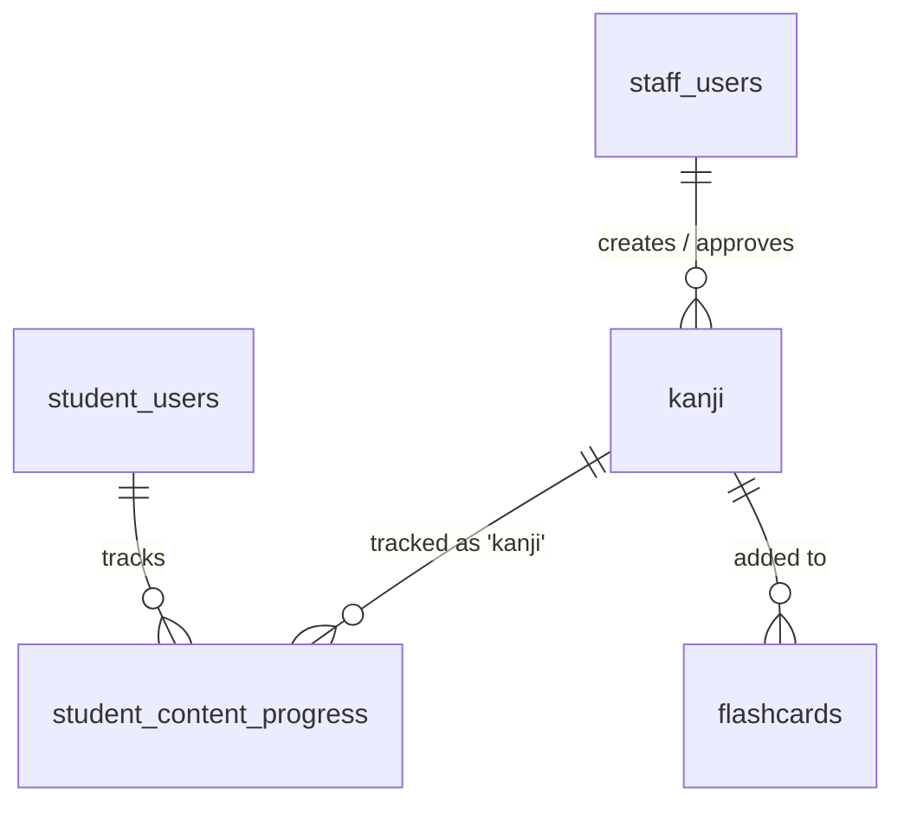

# SPEC — Học Kanji (Kanji)
> **Feature ID:** `feat-kanji`
> **UC Coverage:** UC-07 (Học Kanji theo Level)
> **Version:** 1.0 | **Status:** Draft
> **Author:** Team | **Last Updated:** 2026-06-12
> **Liên quan:** `feat-core-learning/SPEC.md` (UC-07 tổng quan) · `feat-vocabulary/SPEC.md` · `feat-flashcard-srs/SPEC.md` · `feat-content-management/SPEC.md` · `feat-ai-skills/SPEC.md` (OCR viết tay)
> **Frontend ref:** `frontend/feat-student/SPEC-kanji-list.md` · `frontend/feat-student/SPEC-kanji-practice.md`

---

## 1. CONTEXT & GOAL

### 1.1 Bối cảnh
Kanji (漢字) là khối kiến thức nền tảng khó nhất với học viên JLPT — mỗi cấp độ bổ sung hàng trăm ký tự với cách đọc âm On (onyomi) / âm Kun (kunyomi), số nét và nghĩa khác nhau. Học viên cần kho Kanji được tổ chức **theo cấp độ N5→N1** (tương tự Từ vựng), kèm thông tin chi tiết để học có hệ thống: ký tự, số nét, ảnh thứ tự nét (static), các âm đọc, nghĩa Tiếng Việt và từ ví dụ.

Spec này tách riêng khỏi `feat-core-learning` để mô tả **chuyên sâu** luồng học Kanji phía học viên: liệt kê & lọc theo level (+ lọc phụ theo số nét / bộ thủ), xem chi tiết, đánh dấu đã học, và thêm vào Flashcard. Mô hình **song song với `feat-vocabulary`** nhưng đặc thù theo các thuộc tính của Kanji.

### 1.2 Mục tiêu
- Cung cấp danh sách Kanji `published` lọc theo **`jlpt_level`**, có phân trang, tìm kiếm và lọc phụ theo **số nét (`stroke_count`)** / **bộ thủ (`radical`)**.
- Hiển thị chi tiết một Kanji: `character_value`, `stroke_count`, `stroke_order_url` (ảnh tĩnh), `onyomi`, `kunyomi`, `meaning` (Tiếng Việt), và từ ví dụ (`example_word` + `example_reading` + `example_meaning`).
- Theo dõi tiến độ học từng Kanji qua `student_content_progress` với `content_type = 'kanji'` (upsert, không giảm thủ công).
- Cho phép "Thêm vào Flashcard" để tạo bản ghi `flashcards`.

### 1.3 Tại sao cần?
Kanji là rào cản lớn nhất khiến học viên bỏ cuộc. Tổ chức theo level + thông tin chi tiết + liên kết Flashcard/SRS giúp học viên chinh phục đúng phạm vi thi của từng cấp độ và ghi nhớ lâu hơn. Đây là core value của nền tảng (xem `AGENTS.md §1`).

---

## 2. ACTOR

| Actor | Role | Điều kiện tiền quyết |
|:---|:---|:---|
| **Student** | Học viên đọc/ học Kanji, đánh dấu tiến độ, thêm Flashcard | Đã đăng nhập (JWT hợp lệ), `status = 'active'` |
| **Staff** | Tạo/chỉnh sửa/duyệt Kanji (CRUD) | Ngoài phạm vi spec này — xem `feat-content-management` |
| **System (Scheduler/CDN)** | Phục vụ `stroke_order_url` qua storage/CDN | Không tương tác trực tiếp người dùng |

> Phân quyền theo **Role + Subscription/Level** (xem `CLAUDE.md` LESSON-003, `AGENTS.md §7.3`). Nội dung `is_vip_only = 1` yêu cầu subscription VIP còn hiệu lực.

---

## 3. FUNCTIONAL REQUIREMENTS (EARS)

> **EARS Syntax:**
> - `WHEN [trigger] THE SYSTEM SHALL [behavior]`
> - `WHILE [state] THE SYSTEM SHALL [behavior]`
> - `IF [condition] THEN THE SYSTEM SHALL [response]`
> - `THE SYSTEM SHALL [ubiquitous requirement]`

### 3.1 Liệt kê & Lọc theo Level (Happy Path)

| ID | EARS Requirement |
|:---|:---|
| FR-KAN-01 | WHEN an authenticated Student selects a JLPT level (`N5`–`N1`), THE SYSTEM SHALL return a paginated list of `kanji` filtered by `jlpt_level` with `status = 'published'`. |
| FR-KAN-02 | WHEN a Student applies a stroke-count filter (`strokeCount` hoặc khoảng `strokeMin`–`strokeMax`), THE SYSTEM SHALL filter Kanji by `stroke_count` within the current level. |
| FR-KAN-03 | WHEN a Student provides a `search` keyword, THE SYSTEM SHALL match it against `character_value`, `onyomi`, `kunyomi`, and `meaning` (case-insensitive, partial match) within the current level filter. |
| FR-KAN-04 | THE SYSTEM SHALL paginate results with default `size = 20`, `max size = 50`, and SHALL return `totalElements`, `totalPages`, and `completedCount` (số Kanji Student đã hoàn thành trong phạm vi lọc). |
| FR-KAN-05 | WHEN a Student opens a Kanji detail, THE SYSTEM SHALL return: `character_value`, `stroke_count`, `stroke_order_url`, `onyomi`, `kunyomi`, `meaning`, `jlpt_level`, `example_word`, `example_reading`, `example_meaning`, and the Student's `progressStatus` (nullable). |
| FR-KAN-06 | THE SYSTEM SHALL serve `stroke_order_url` as a **static image URL** (stored in `/uploads` or S3) and SHALL NOT serve animated stroke-order nor evaluate stroke direction (ADR-007). |

### 3.2 Tiến độ & Flashcard

| ID | EARS Requirement |
|:---|:---|
| FR-KAN-10 | WHEN a Student marks a Kanji as `completed`, THE SYSTEM SHALL upsert a `student_content_progress` record with `content_type = 'kanji'`, `content_id = kanji_id`, enforcing `UNIQUE (student_id, content_type, content_id)`. |
| FR-KAN-11 | THE SYSTEM SHALL track `progress_percent` (0–100) incrementally and SHALL NOT allow `progress_percent` or `status` to regress (e.g. từ `completed` về `learning`) thông qua API thông thường. |
| FR-KAN-12 | WHEN a Student clicks "Add to Flashcard" on a Kanji, THE SYSTEM SHALL create a `flashcards` record with `content_type = 'kanji'` linked to the Student's personal deck. |
| FR-KAN-13 | WHEN a Student returns to a Kanji list, THE SYSTEM SHALL annotate each item with `isCompleted` and `isInFlashcard` reflecting that Student's state. |
| FR-KAN-14 | WHEN a Student successfully views Kanji content, THE SYSTEM SHALL update `student_users.last_activity_date` for streak calculation. |

### 3.3 Alternate / Edge Cases

| ID | EARS Requirement |
|:---|:---|
| FR-KAN-20 | IF the requested `level` is not in {`N5`,`N4`,`N3`,`N2`,`N1`} THEN THE SYSTEM SHALL respond `422 LEVEL_MISMATCH` và SHALL NOT trả dữ liệu. |
| FR-KAN-21 | WHILE a Kanji has `status != 'published'` OR `is_deleted = 1`, THE SYSTEM SHALL treat it as non-existent for Student endpoints (404 on detail, excluded from lists). |
| FR-KAN-22 | IF a Student without an active VIP subscription requests a Kanji where `is_vip_only = 1` THEN THE SYSTEM SHALL respond `403 VIP_REQUIRED`. |
| FR-KAN-23 | IF a Student adds a Kanji already present in their Flashcard deck THEN THE SYSTEM SHALL respond `409 FLASHCARD_EXISTS` và SHALL NOT tạo bản ghi trùng. |
| FR-KAN-24 | WHEN a filter/search yields no result, THE SYSTEM SHALL return an empty `content` array with `200 OK` (không phải 404). |
| FR-KAN-25 | IF `page` hoặc `size` vượt giới hạn (size > 50, page < 0) THEN THE SYSTEM SHALL clamp về giá trị hợp lệ (size = 50, page = 0). |
| FR-KAN-26 | IF `strokeMin > strokeMax` THEN THE SYSTEM SHALL respond `400 VALIDATION_FAILED`. |

---

## 4. NON-FUNCTIONAL REQUIREMENTS

| ID | Category | Requirement |
|:---|:---|:---|
| NFR-KAN-01 | Performance | API list/detail phản hồi < 300ms (p95) với dữ liệu paginated (≤ 50 items/page). |
| NFR-KAN-02 | Performance | Index trên `(jlpt_level, status, stroke_count)` và FK; tránh N+1 khi join `student_content_progress` (dùng `JOIN FETCH`/`@EntityGraph`). |
| NFR-KAN-03 | Performance | `stroke_order_url` phục vụ qua CDN/pre-signed URL — **KHÔNG** stream qua Spring Boot. |
| NFR-KAN-04 | Security | Mọi endpoint yêu cầu JWT hợp lệ; kiểm tra **Role STUDENT + subscription** cho nội dung `is_vip_only`. |
| NFR-KAN-05 | Correctness | Dữ liệu JLPT level chính xác — **KHÔNG** trộn Kanji N1 vào danh sách N5 (xem `AGENTS.md §5` rule 5). |
| NFR-KAN-06 | Data Integrity | `student_content_progress` phải **upsert** (INSERT OR UPDATE) — không tạo duplicate; tôn trọng `UQ_progress`. |
| NFR-KAN-07 | Logging | SLF4J — log access với `{studentId, level, kanjiId}`; **KHÔNG** dùng `System.out.println`. |
| NFR-KAN-08 | API Contract | Mọi response theo chuẩn `{ status, message, data }`; **KHÔNG** trả Entity JPA trực tiếp — chỉ DTO (ADR-005). |
| NFR-KAN-09 | Maintainability | Method ≤ 40 dòng, file ≤ 300 dòng (Constitution §2.2). |

---

## 5. DATA MODEL

### 5.1 Bảng chính

> Nguồn: `jlpt_database_v2.sql`. Bảng `kanji` và `student_content_progress` đã định nghĩa trong `feat-core-learning/SPEC.md §5` — trích lại phần liên quan để tự chứa. `radical` là cột bổ sung khuyến nghị cho lọc phụ theo bộ thủ.

```sql
-- Bảng 7: kanji
CREATE TABLE kanji (
    kanji_id          BIGINT IDENTITY(1,1) PRIMARY KEY,
    character_value   NVARCHAR(5)    NOT NULL UNIQUE,     -- 食
    meaning           NVARCHAR(500)  NOT NULL,            -- nghĩa Tiếng Việt: "ăn / thức ăn"
    onyomi            NVARCHAR(200)  NULL,                -- ショク, ジキ
    kunyomi           NVARCHAR(200)  NULL,                -- た(べる), く(う)
    stroke_count      INT            NULL,                -- 9
    radical           NVARCHAR(20)   NULL,                -- bộ thủ: 食 (lọc phụ)
    jlpt_level        NVARCHAR(5)    NOT NULL
        CHECK (jlpt_level IN ('N5','N4','N3','N2','N1')),
    stroke_order_url  NVARCHAR(500)  NULL,                -- ảnh tĩnh /uploads hoặc S3
    example_word      NVARCHAR(100)  NULL,                -- 食べる
    example_reading   NVARCHAR(200)  NULL,                -- たべる
    example_meaning   NVARCHAR(500)  NULL,                -- ăn
    is_vip_only       BIT            NOT NULL DEFAULT 0,
    status            NVARCHAR(20)   NOT NULL DEFAULT 'draft'
        CHECK (status IN ('draft','pending_review','rejected','published','archived','deleted')),
    is_deleted        BIT            NOT NULL DEFAULT 0,
    created_by        BIGINT         NULL,                -- FK → staff_users
    approved_by       BIGINT         NULL,                -- FK → staff_users
    published_at      DATETIME2      NULL,
    created_at        DATETIME2      NOT NULL DEFAULT SYSUTCDATETIME(),
    updated_at        DATETIME2      NOT NULL DEFAULT SYSUTCDATETIME()
);

-- Index phục vụ lọc theo level + số nét (NFR-KAN-02)
CREATE INDEX IX_kanji_level_status_stroke
    ON kanji (jlpt_level, status, stroke_count) WHERE is_deleted = 0;

-- Bảng 16: student_content_progress (tiến độ + bookmark) — dùng chung
CREATE TABLE student_content_progress (
    progress_id      BIGINT IDENTITY(1,1) PRIMARY KEY,
    student_id       BIGINT          NOT NULL,            -- FK → student_users
    content_type     NVARCHAR(30)    NOT NULL
        CHECK (content_type IN ('lesson','vocabulary','kanji','kana','grammar')),
    content_id       BIGINT          NOT NULL,
    status           NVARCHAR(20)    NOT NULL DEFAULT 'learning'
        CHECK (status IN ('learning','completed','reviewing')),
    progress_percent DECIMAL(5,2)    NOT NULL DEFAULT 0,
    completed_at     DATETIME2       NULL,
    is_bookmarked    BIT             NOT NULL DEFAULT 0,
    bookmark_note    NVARCHAR(500)   NULL,
    bookmarked_at    DATETIME2       NULL,
    last_studied_at  DATETIME2       NOT NULL DEFAULT SYSUTCDATETIME(),
    created_at       DATETIME2       NOT NULL DEFAULT SYSUTCDATETIME(),
    CONSTRAINT UQ_progress UNIQUE (student_id, content_type, content_id)
);
```

> **Đồng bộ với `feat-core-learning/SPEC.md §5`:** bảng `student_content_progress` giữ nguyên đầy đủ cột so với spec gốc. Hai cột `is_vip_only` và `is_deleted` trên `kanji` là phần mở rộng để hiện thực hóa rule VIP (FR-KAN-22) và soft-delete (FR-KAN-21, tương ứng `FR-LEARN-41` của bản gốc).

### 5.2 Phân loại theo Level & lọc phụ (song song với Vocabulary)

> Trục **Level** giống Vocabulary (`jlpt_level`). Kanji **không có** trục `topic` như từ vựng; thay vào đó dùng các trục lọc phụ đặc thù: **số nét** (`stroke_count`) và **bộ thủ** (`radical`).

| Level | Phạm vi Kanji (ước lượng theo chuẩn JLPT) |
|:---|:---|
| N5 | ~80 ký tự cơ bản (日, 本, 人, 食, 学…) |
| N4 | ~170 ký tự tích lũy (~250 tổng) |
| N3 | ~370 ký tự tích lũy (~650 tổng) |
| N2 | ~380 ký tự tích lũy (~1,000 tổng) |
| N1 | ~1,200+ ký tự tích lũy (~2,000+ tổng) |

**Trục lọc phụ:**

| Trục | Cột | Ví dụ giá trị | Mục đích |
|:---|:---|:---|:---|
| Số nét | `stroke_count` | `1`–`30`, hoặc khoảng `1–5`, `6–10`… | Học theo độ phức tạp tăng dần |
| Bộ thủ | `radical` | 水, 木, 食, 心, 言… | Nhóm Kanji cùng bộ để liên tưởng nghĩa |

> Bộ thủ/số nét được suy ra động từ DB cho bộ lọc (tương tự cách Vocabulary suy ra topic). Spec này chỉ **đọc**, không định nghĩa danh mục.

### 5.3 Quan hệ



---

## 6. API SPEC

> Prefix `/api/kanji` (kebab-case, plural — `AGENTS.md §3.3`). Auth: Bearer JWT, Role STUDENT.

### `GET /api/kanji?level={N5}&strokeMin={int}&strokeMax={int}&search={kw}&page=0&size=20`
**Actor:** Student | **Auth:** Bearer JWT
> Danh sách Kanji lọc theo level (bắt buộc) + số nét + search (tùy chọn), phân trang.

**Response (200):**
```json
{
  "status": 200,
  "message": "OK",
  "data": {
    "content": [
      {
        "kanjiId": "long",
        "characterValue": "string",
        "meaning": "string",
        "onyomi": "string",
        "kunyomi": "string",
        "strokeCount": "int",
        "jlptLevel": "string",
        "isCompleted": "boolean",
        "isInFlashcard": "boolean"
      }
    ],
    "totalElements": "long",
    "totalPages": "int",
    "page": "int",
    "size": "int",
    "completedCount": "long"
  }
}
```

---

### `GET /api/kanji/radicals?level={N5}`
**Actor:** Student | **Auth:** Bearer JWT
> Danh sách bộ thủ khả dụng (có ≥1 Kanji `published`) tại level — dựng bộ lọc phụ.

**Response (200):**
```json
{
  "status": 200,
  "message": "OK",
  "data": [
    { "radical": "水", "count": 12 },
    { "radical": "木", "count": 9 }
  ]
}
```

---

### `GET /api/kanji/{kanjiId}`
**Actor:** Student | **Auth:** Bearer JWT
> Chi tiết một Kanji.

**Response (200):**
```json
{
  "status": 200,
  "message": "OK",
  "data": {
    "kanjiId": "long",
    "characterValue": "string",
    "strokeCount": "int",
    "strokeOrderUrl": "string",
    "radical": "string",
    "onyomi": "string",
    "kunyomi": "string",
    "meaning": "string",
    "jlptLevel": "string",
    "exampleWord": "string",
    "exampleReading": "string",
    "exampleMeaning": "string",
    "isCompleted": "boolean",
    "isInFlashcard": "boolean",
    "progressStatus": "string|null"
  }
}
```

---

### `POST /api/learning-progress`
**Actor:** Student | **Auth:** Bearer JWT
> Đánh dấu hoàn thành / cập nhật tiến độ một Kanji (upsert). Dùng chung endpoint của `feat-core-learning`.

**Request:**
```json
{
  "contentType": "string — phải là 'kanji'",
  "contentId": "long — kanjiId",
  "status": "string — learning|completed|reviewing",
  "progressPercent": "int — 0..100"
}
```

**Response (200):**
```json
{
  "status": 200,
  "message": "Cập nhật tiến độ thành công",
  "data": {
    "progressId": "long",
    "contentType": "kanji",
    "contentId": "long",
    "status": "string",
    "progressPercent": "int"
  }
}
```

---

### `POST /api/flashcards`
**Actor:** Student | **Auth:** Bearer JWT
> Thêm Kanji vào bộ Flashcard cá nhân.

**Request:**
```json
{
  "contentType": "string — 'kanji'",
  "contentId": "long — kanjiId",
  "deckName": "string — optional, default 'Mặc định'"
}
```

**Response (201):**
```json
{
  "status": 201,
  "message": "Đã thêm vào Flashcard",
  "data": { "flashcardId": "long" }
}
```

---

## 7. ERROR HANDLING

| HTTP Code | Error Code | Message | Trigger |
|:---:|:---|:---|:---|
| 400 | `VALIDATION_FAILED` | "Dữ liệu không hợp lệ: {field}" | `contentType` sai, `progressPercent` ngoài 0–100, thiếu `level`, `strokeMin > strokeMax` |
| 401 | `UNAUTHORIZED` | "Yêu cầu đăng nhập" | JWT thiếu/hết hạn |
| 403 | `VIP_REQUIRED` | "Nội dung này yêu cầu tài khoản VIP" | `is_vip_only = 1` mà user không có VIP |
| 404 | `CONTENT_NOT_FOUND` | "Kanji không tồn tại" | `kanjiId` không tồn tại / `is_deleted = 1` / chưa `published` |
| 409 | `FLASHCARD_EXISTS` | "Kanji này đã có trong Flashcard" | Thêm Flashcard trùng |
| 422 | `LEVEL_MISMATCH` | "Cấp độ JLPT không hợp lệ" | `level` ngoài {N5..N1} |
| 422 | `PROGRESS_REGRESSION` | "Không thể hạ tiến độ đã đạt" | Cố cập nhật `completed → learning` (FR-KAN-11) |
| 500 | `INTERNAL_ERROR` | "Internal server error" | Lỗi hệ thống |

---

## 8. ACCEPTANCE CRITERIA

| ID | Scenario | Given | When | Then |
|:---|:---|:---|:---|:---|
| AC-KAN-01 | Liệt kê Kanji theo level | Student login; có Kanji N5 published | `GET /api/kanji?level=N5` | Trả list đúng N5, không có `draft`/`deleted`, có phân trang |
| AC-KAN-02 | Lọc theo số nét | Có Kanji N5 nhiều số nét | `GET /api/kanji?level=N5&strokeMin=1&strokeMax=5` | Chỉ trả Kanji `stroke_count` 1–5 trong N5 |
| AC-KAN-03 | Tìm kiếm từ khóa | Tồn tại Kanji "食" | `GET ...&search=食` | Khớp theo character/onyomi/kunyomi/meaning, trong phạm vi level |
| AC-KAN-04 | Danh sách bộ thủ theo level | Có Kanji N5 nhiều bộ thủ | `GET /api/kanji/radicals?level=N5` | Trả các radical distinct + count, chỉ tính `published` |
| AC-KAN-05 | Chi tiết Kanji | Kanji published tồn tại | `GET /api/kanji/{id}` | Có đủ onyomi, kunyomi, strokeOrderUrl (ảnh tĩnh), example word/reading/meaning |
| AC-KAN-06 | Đánh dấu hoàn thành | Student chưa học Kanji này | `POST /api/learning-progress` status=completed | Tạo/UPDATE record `content_type='kanji'`, completedCount tăng |
| AC-KAN-07 | Không tạo progress trùng | Đã có progress Kanji này | `POST` lại cùng contentId | Upsert, vẫn 1 record (UQ_progress) |
| AC-KAN-08 | Thêm Flashcard thành công | Kanji published | `POST /api/flashcards` contentType=kanji | Tạo `flashcards`, response 201 |
| AC-KAN-09 | Thêm Flashcard trùng | Kanji đã ở trong deck | `POST /api/flashcards` lại | HTTP 409 `FLASHCARD_EXISTS` |
| AC-KAN-10 | Nội dung VIP bị chặn | Student FREE; Kanji `is_vip_only=1` | Truy cập detail | HTTP 403 `VIP_REQUIRED` |
| AC-KAN-11 | Level sai bị từ chối | — | `GET /api/kanji?level=N9` | HTTP 422 `LEVEL_MISMATCH` |
| AC-KAN-12 | Kanji chưa duyệt không hiện | Kanji status=draft | `GET` list / detail | Không có trong list; detail trả 404 |
| AC-KAN-13 | Không hạ tiến độ | Đã `completed` | `POST` status=learning | HTTP 422 `PROGRESS_REGRESSION` |
| AC-KAN-14 | Lọc rỗng trả 200 | Không có Kanji khớp | `GET ...&strokeMin=29&strokeMax=30` | `content: []`, status 200 |
| AC-KAN-15 | Stroke order là ảnh tĩnh | Kanji có strokeOrderUrl | `GET /api/kanji/{id}` | `strokeOrderUrl` trỏ ảnh tĩnh; không có animation/đánh giá nét (ADR-007) |

---

## OUT OF SCOPE

- ❌ CRUD Kanji (tạo/sửa/xóa/duyệt) — thuộc `feat-content-management` / `feat-content-review`.
- ❌ Thuật toán Spaced Repetition của Flashcard — thuộc `feat-flashcard-srs` (spec này chỉ "thêm vào Flashcard").
- ❌ Luyện viết tay Kanji + chấm điểm OCR similarity — thuộc `feat-ai-skills` (ADR-007: chỉ similarity %, không phân tích thứ tự nét).
- ❌ Animated stroke order — chỉ ảnh tĩnh (ADR-007).
- ❌ Quiz/Mock test Kanji — thuộc `feat-assessment` / `feat-mock-test`.
- ❌ File serving backend cho ảnh — chỉ trả `stroke_order_url`, frontend tự render.
- ❌ Học Vocabulary / Kana / Ngữ pháp — thuộc `feat-vocabulary` / `feat-core-learning`.
