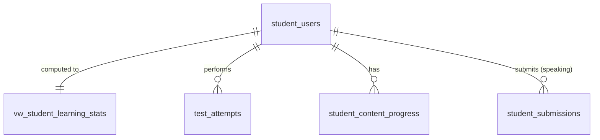

# SPEC — Learning Analytics & Reports
> **Feature ID:** `feat-learning-analytics`
> **UC Coverage:** UC-19 (Learning Progress & Stats), UC-32 (View Quiz Results), UC-38 (Report Screen)
> **Version:** 2.0 | **Status:** Ready for Implementation
> **Author:** Team | **Last Updated:** 2026-06-14

---

## 1. CONTEXT & GOAL

### 1.1 Bối cảnh
Để học tập hiệu quả, học viên cần theo dõi trực quan tiến độ học và điểm số qua các kỳ thi thử. Đồng thời, Nhân viên (Staff) và Quản trị viên (Admin) cần những báo cáo phân tích tổng hợp để đánh giá chất lượng học liệu và sự phát triển của hệ thống.

### 1.2 Mục tiêu
- **Cho Student (UC-19):** Hiển thị thống kê số lượng bài học hoàn thành, biểu đồ radar năng lực kỹ năng, chuỗi học tập hàng ngày (streak) và lịch sử điểm số thi thử JLPT.
- **Cho Staff (UC-32):** Cung cấp giao diện phân tích kết quả làm bài Quiz/Exam của từng học viên và tỷ lệ trả lời đúng/sai của từng câu hỏi trong hệ thống.
- **Cho Admin (UC-38):** Dashboard báo cáo tổng quát về tăng trưởng người dùng, phân phối phổ điểm thi thử JLPT và xuất dữ liệu ra CSV/Excel.

### 1.3 Tại sao cần?
Không có thống kê tiến độ → học viên thiếu động lực duy trì chuỗi học và khó tự nhận biết kỹ năng còn yếu. Không có báo cáo quản trị → hệ thống mất kiểm soát về chất lượng đề thi, sự tương tác và sức khỏe tổng quát của nền tảng.

---

## 2. ACTOR

| Actor | Role | Điều kiện tiền quyết |
|:---|:---|:---|
| **Student** | Xem lịch sử học tập cá nhân, streak, radar năng lực | Đã đăng nhập Student, status = `active` |
| **Staff** | Phân tích kết quả kiểm tra quiz, xem Dashboard Staff | Đã đăng nhập Staff, status = `active` |
| **Admin** | Dashboard quản trị, xuất báo cáo | Đã đăng nhập Admin, status = `active` |

---

## 3. FUNCTIONAL REQUIREMENTS (EARS)

### 3.1 UC-19 — Tiến độ học tập của Học viên (Student Progress & Stats)

| ID | EARS Requirement |
|:---|:---|
| FR-ANALYTICS-01 | WHEN a Student views their dashboard, THE SYSTEM SHALL return their `current_streak`, `longest_streak`, `last_activity_date`, and `streak_status` ('ACTIVE', 'AT_RISK', or 'BROKEN') from `student_users`. |
| FR-ANALYTICS-02 | THE SYSTEM SHALL compute streak_status server-side: `ACTIVE` if `last_activity_date = today`, `AT_RISK` if `last_activity_date = yesterday`, `BROKEN` otherwise. |
| FR-ANALYTICS-03 | THE SYSTEM SHALL aggregate completion counts per content type (lessons, kanji, vocabulary, grammar, kana) from `student_content_progress` where `status = 'completed'`. |
| FR-ANALYTICS-04 | THE SYSTEM SHALL compute the completion rate per content type: `completedCount / totalCount × 100`. THE SYSTEM SHALL handle division by zero by returning 0. |
| FR-ANALYTICS-05 | THE SYSTEM SHALL generate skills radar data based on average scores from: grammar (`test_attempts` grammar section), vocabulary, reading, listening, and pronunciation (`student_submissions` average `final_score`). |
| FR-ANALYTICS-06 | THE SYSTEM SHALL ensure that a Student can only view their own analytics — studentId is extracted from JWT, not from request params. |

### 3.2 UC-32 — Phân tích Kết quả làm bài (Staff Quiz Analysis)

| ID | EARS Requirement |
|:---|:---|
| FR-ANALYTICS-10 | WHEN a Staff member requests quiz statistics, THE SYSTEM SHALL return: total attempts, average score, pass rate, and per-question accuracy from `test_attempts` and `attempt_answers`. |
| FR-ANALYTICS-11 | THE SYSTEM SHALL compute per-question accuracy as: `correctCount / totalAttempts × 100` by comparing `attempt_answers.selected_option` with `questions.correct_option`. |
| FR-ANALYTICS-12 | WHEN a Staff requests a Student's exam history, THE SYSTEM SHALL return a paginated list of `test_attempts` for that student, ordered by `started_at DESC`. |
| FR-ANALYTICS-13 | THE SYSTEM SHALL provide a Staff dashboard showing: open tickets count, in-progress tickets count, pending submissions to grade, and recent tickets. |

### 3.3 UC-38 — Bảng báo cáo Quản trị (Admin Report Screen)

| ID | EARS Requirement |
|:---|:---|
| FR-ANALYTICS-20 | WHEN an Admin requests the system dashboard, THE SYSTEM SHALL aggregate: total students, active students, new registrations this month, open tickets, in-progress tickets, pending submissions, and recent audit activity. |
| FR-ANALYTICS-21 | WHEN an Admin requests system reports with date range filter, THE SYSTEM SHALL aggregate data from `student_users` (registrations), `test_attempts` (exam stats), and `student_content_progress` (completion rates). |
| FR-ANALYTICS-22 | THE SYSTEM SHALL compute statistical distributions (score histograms, completion rates) at the server level — never at the client. |
| FR-ANALYTICS-23 | WHEN an Admin triggers a report export, THE SYSTEM SHALL compile filtered statistics into CSV or XLSX files and return a secure download URL. |

---

## 4. NON-FUNCTIONAL REQUIREMENTS

| ID | Category | Requirement |
|:---|:---|:---|
| NFR-ANALYTICS-01 | Performance | Student analytics endpoint phải phản hồi dưới 400ms (p95). Sử dụng JPQL aggregation thay vì N+1 queries. |
| NFR-ANALYTICS-02 | Performance | Admin reports aggregation: có tùy chọn timeout 60 giây đối với tác vụ lớn. |
| NFR-ANALYTICS-03 | Security | Dữ liệu analytics của học viên chỉ hiển thị cho chính học viên đó, Staff, và Admin. Student không được xem analytics của người khác. |
| NFR-ANALYTICS-04 | Correctness | Streak ngày học phải đối sánh theo múi giờ địa phương (`LocalDate.now()` tại server). |
| NFR-ANALYTICS-05 | Logging | Log mọi yêu cầu xuất dữ liệu báo cáo: `[WARN] Admin {adminId} exported {reportType} format {format}`. |

---

## 5. DATA MODEL

### 5.1 Bảng & View chính

> Nguồn: [`database/init.sql`](../../../../database/init.sql)

```sql
-- View: Student learning statistics summary (dùng để query nhanh)
-- Lưu ý: Spring Boot query view này qua @Query native SQL hoặc @Immutable @Entity
CREATE VIEW vw_student_learning_stats AS
SELECT
    s.student_id,
    s.full_name,
    s.email,
    s.current_jlpt_level,
    s.current_streak,
    s.longest_streak,
    s.last_activity_date,
    (SELECT COUNT(*) FROM student_content_progress ucp
     WHERE ucp.student_id = s.student_id AND ucp.content_type='lesson'     AND ucp.status='completed') AS lessons_completed,
    (SELECT COUNT(*) FROM student_content_progress ucp
     WHERE ucp.student_id = s.student_id AND ucp.content_type='kanji'      AND ucp.status='completed') AS kanji_completed,
    (SELECT COUNT(*) FROM student_content_progress ucp
     WHERE ucp.student_id = s.student_id AND ucp.content_type='vocabulary' AND ucp.status='completed') AS vocabulary_completed,
    (SELECT COUNT(*) FROM student_content_progress ucp
     WHERE ucp.student_id = s.student_id AND ucp.content_type='grammar'    AND ucp.status='completed') AS grammar_completed,
    (SELECT COUNT(*) FROM student_content_progress ucp
     WHERE ucp.student_id = s.student_id AND ucp.content_type='kana'       AND ucp.status='completed') AS kana_completed,
    (SELECT COUNT(*) FROM test_attempts t
     WHERE t.student_id = s.student_id AND t.attempt_type='exam'
       AND t.status IN ('submitted','auto_submitted'))                       AS total_exams_taken,
    (SELECT MAX(t.total_score) FROM test_attempts t
     WHERE t.student_id = s.student_id AND t.attempt_type='exam')           AS highest_exam_score,
    (SELECT AVG(t.total_score) FROM test_attempts t
     WHERE t.student_id = s.student_id AND t.attempt_type='exam')           AS average_exam_score
FROM student_users s;

-- Bảng 13: test_attempts (owned by Người 3 — read-only cho Người 5)
CREATE TABLE test_attempts (
    attempt_id        BIGINT IDENTITY(1,1) PRIMARY KEY,
    student_id        BIGINT          NOT NULL,
    attempt_type      NVARCHAR(20)    NOT NULL
        CHECK (attempt_type IN ('exam','quiz','practice','reading','listening')),
    parent_type       NVARCHAR(30)    NOT NULL,
    parent_id         BIGINT          NULL,
    started_at        DATETIME2       NOT NULL DEFAULT SYSUTCDATETIME(),
    submitted_at      DATETIME2       NULL,
    total_score       DECIMAL(8,2)    NULL,
    max_score         DECIMAL(8,2)    NULL,
    is_passed         BIT             NULL,
    status            NVARCHAR(20)    NOT NULL DEFAULT 'in_progress'
        CHECK (status IN ('in_progress','submitted','auto_submitted','abandoned'))
);
```

### 5.2 Quan hệ



---

## 6. FILES CẦN TẠO

| File | Package | Loại | Ghi chú |
|:---|:---|:---|:---|
| `AnalyticsService.java` | `com.jlpt.service` | Service | Mới |
| `StudentAnalyticsController.java` | `com.jlpt.controller.student` | Controller | Mới |
| `AnalyticsResponse.java` | `com.jlpt.dto.response` | DTO Response | Mới |
| `DashboardResponse.java` | `com.jlpt.dto.response` | DTO Response | Mới |

**Phụ thuộc inject (read-only từ Người 3):**
- `StudentContentProgressRepository` — chỉ query
- `TestAttemptRepository` (nếu Người 3 tạo) — chỉ query
- `StudentSubmissionRepository` — chỉ query (đọc final_score cho radar)

---

## 7. SERVICE SPEC

### `AnalyticsService`
**Annotations:** `@Service`, `@RequiredArgsConstructor`, `@Slf4j`

| Method | Signature | Business Logic |
|:---|:---|:---|
| `getStudentProgressAnalytics` | `AnalyticsResponse getStudentProgressAnalytics(Long studentId)` | Load StudentUser (404 nếu không có), tính streak_status, query completions per contentType từ progressRepo, tính completionRate per type, build skills radar, trả AnalyticsResponse |
| `getStudyStreakDetail` | `StreakDetailResponse getStudyStreakDetail(Long studentId)` | Load StudentUser, tính streakStatus dựa trên lastActivityDate so với LocalDate.now() |
| `getCompletionRate` | `CompletionRateResponse getCompletionRate(Long studentId, String contentType)` | Query progressRepo theo studentId + contentType (nếu null → tổng hợp tất cả), tính rate |
| `getQuizStats` | `QuizStatsResponse getQuizStats(Long assessmentId)` | Query testAttempts theo parentId + parentType='assessment', tính totalAttempts/avgScore/passRate; query attemptAnswers để tính per-question accuracy |
| `getStudentExamHistory` | `Page<ExamAttemptResponse> getStudentExamHistory(Long studentId, int page, int size)` | Query testAttempts theo studentId + type in ('exam','quiz') |
| `getAdminDashboard` | `DashboardResponse getAdminDashboard()` | Aggregate: totalStudents, activeStudents, newStudentsThisMonth, openTickets, pendingSubmissions, recentAuditLogs (5 records) — chỉ ADMIN |
| `getStaffDashboard` | `DashboardResponse getStaffDashboard(Long staffId)` | Aggregate: myOpenTickets, myInProgressTickets, myPendingGrades (submissions chưa graded), recentTickets (5 records) — chỉ STAFF |

---

## 8. API SPEC

### `GET /api/analytics/my-progress`
**Actor:** Student | **Auth:** Bearer JWT | **Security:** `hasRole('STUDENT')`
> studentId lấy từ JWT — KHÔNG từ request param.

**Response (200):**
```json
{
  "status": 200,
  "message": "Lấy tiến độ học tập thành công",
  "data": {
    "studentId": 12,
    "currentStreak": 5,
    "longestStreak": 14,
    "lastActivityDate": "2026-06-13",
    "streakStatus": "AT_RISK",
    "completions": {
      "lessons": 12,
      "kanji": 45,
      "vocabulary": 120,
      "grammar": 8,
      "kana": 46
    },
    "completionRates": {
      "lessons": 60.0,
      "kanji": 45.0,
      "vocabulary": 80.0,
      "grammar": 32.0,
      "kana": 92.0
    },
    "skillsRadar": {
      "grammar": 85.0,
      "vocabulary": 90.0,
      "reading": 75.0,
      "listening": 60.0,
      "speaking": 80.0
    }
  }
}
```

---

### `GET /api/analytics/streak`
**Actor:** Student | **Auth:** Bearer JWT | **Security:** `hasRole('STUDENT')`

**Response (200):**
```json
{
  "status": 200,
  "message": "OK",
  "data": {
    "currentStreak": 5,
    "longestStreak": 14,
    "lastActivityDate": "2026-06-13",
    "streakStatus": "AT_RISK",
    "streakStatusMessage": "Bạn chưa học hôm nay. Hãy học ngay để duy trì streak!"
  }
}
```

---

### `GET /api/analytics/completion?contentType=kanji`
**Actor:** Student | **Auth:** Bearer JWT | **Security:** `hasRole('STUDENT')`

**Query Params:**
- `contentType` *(optional)*: `lesson` | `vocabulary` | `kanji` | `kana` | `grammar` — null = tổng hợp tất cả

**Response (200):**
```json
{
  "status": 200,
  "message": "OK",
  "data": {
    "contentType": "kanji",
    "totalCount": 100,
    "completedCount": 45,
    "completionRate": 45.0
  }
}
```

---

### `GET /api/analytics/quizzes/{assessmentId}/stats`
**Actor:** Staff/Admin | **Auth:** Bearer JWT | **Security:** `hasAnyRole('STAFF','ADMIN')`

**Response (200):**
```json
{
  "status": 200,
  "message": "Lấy thống kê bài kiểm tra thành công",
  "data": {
    "assessmentId": 23,
    "title": "Trắc nghiệm Kanji N5 bài 2",
    "totalAttempts": 150,
    "averageScore": 14.5,
    "maxScore": 20.0,
    "passRate": 82.5,
    "questionAccuracy": [
      {
        "questionId": 101,
        "questionText": "N5 Kanji: '水' đọc là gì?",
        "correctCount": 135,
        "incorrectCount": 15,
        "accuracyPercent": 90.0
      },
      {
        "questionId": 102,
        "questionText": "N5 Kanji: '山' đọc là gì?",
        "correctCount": 45,
        "incorrectCount": 105,
        "accuracyPercent": 30.0
      }
    ]
  }
}
```

---

### `GET /api/analytics/students/{studentId}/exam-history?page=0&size=10`
**Actor:** Staff/Admin | **Auth:** Bearer JWT | **Security:** `hasAnyRole('STAFF','ADMIN')`

**Response (200):**
```json
{
  "status": 200,
  "message": "Lấy lịch sử thi thành công",
  "data": {
    "content": [
      {
        "attemptId": 201,
        "attemptType": "exam",
        "assessmentTitle": "JLPT N3 Mock Test 1",
        "totalScore": 135.0,
        "maxScore": 180.0,
        "isPassed": true,
        "startedAt": "2026-06-10T09:00:00Z",
        "submittedAt": "2026-06-10T10:45:00Z"
      }
    ],
    "totalElements": 3,
    "totalPages": 1
  }
}
```

---

### `GET /api/analytics/dashboard`
**Actor:** Staff/Admin | **Auth:** Bearer JWT

**Security logic:**
- `hasRole('ADMIN')` → gọi `getAdminDashboard()`
- `hasRole('STAFF')` → gọi `getStaffDashboard(staffId)`

**Response (200) — Admin view:**
```json
{
  "status": 200,
  "message": "Lấy dashboard thành công",
  "data": {
    "generatedAt": "2026-06-14T00:44:00Z",
    "totalStudents": 5200,
    "activeStudents": 4800,
    "suspendedStudents": 150,
    "newStudentsThisMonth": 320,
    "openTickets": 45,
    "inProgressTickets": 12,
    "resolvedTicketsThisMonth": 88,
    "pendingSubmissions": 23,
    "gradedSubmissionsThisMonth": 145,
    "recentActivity": [
      {
        "actorName": "Nguyen Van A",
        "actorType": "STUDENT",
        "action": "Đăng ký mới",
        "timestamp": "2026-06-14T00:30:00Z"
      }
    ]
  }
}
```

**Response (200) — Staff view:**
```json
{
  "status": 200,
  "message": "Lấy dashboard thành công",
  "data": {
    "generatedAt": "2026-06-14T00:44:00Z",
    "myOpenTickets": 8,
    "myInProgressTickets": 3,
    "myPendingGrades": 5,
    "recentActivity": [
      {
        "actorName": "Nguyen Van A",
        "actorType": "STUDENT",
        "action": "Tạo ticket mới: Lỗi microphone",
        "timestamp": "2026-06-14T00:30:00Z"
      }
    ]
  }
}
```

---

### `GET /api/analytics/admin/reports?startDate=2026-05-01&endDate=2026-05-31`
**Actor:** Admin | **Auth:** Bearer JWT | **Security:** `hasRole('ADMIN')`

**Response (200):**
```json
{
  "status": 200,
  "message": "Lấy báo cáo hệ thống thành công",
  "data": {
    "period": { "startDate": "2026-05-01", "endDate": "2026-05-31" },
    "newRegistrations": 1250,
    "totalExamAttempts": 4500,
    "avgExamScore": 125.5,
    "courseCompletionRates": [
      {
        "jlptLevel": "N5",
        "completedStudentsCount": 350,
        "totalStudentsCount": 500,
        "completionRate": 70.0
      }
    ]
  }
}
```

---

### `GET /api/analytics/admin/reports/export?startDate=2026-05-01&endDate=2026-05-31&format=xlsx`
**Actor:** Admin | **Auth:** Bearer JWT | **Security:** `hasRole('ADMIN')`

**Response (200):**
```json
{
  "status": 200,
  "message": "Khởi tạo xuất file thành công",
  "data": {
    "downloadUrl": "https://jlpt.example.com/exports/report-20260531.xlsx",
    "expiresAt": "2026-05-31T23:59:59Z"
  }
}
```

---

## 9. DTO SPEC

### `AnalyticsResponse` *(mới)*
```java
Long studentId;
Integer currentStreak; Integer longestStreak;
LocalDate lastActivityDate; String streakStatus;   // ACTIVE|AT_RISK|BROKEN
// Completions:
Integer lessonsCompleted; Integer kanjiCompleted; Integer vocabularyCompleted;
Integer grammarCompleted; Integer kanaCompleted;
// Completion rates (0-100):
Map<String, Double> completionRates;  // key=contentType
// Skills radar (0-100):
Map<String, Double> skillsRadar;      // key: grammar|vocabulary|reading|listening|speaking
```

### `DashboardResponse` *(mới)*
```java
LocalDateTime generatedAt;
// Admin only:
Long totalStudents; Long activeStudents; Long suspendedStudents; Long newStudentsThisMonth;
Long openTickets; Long inProgressTickets; Long resolvedTicketsThisMonth;
Long pendingSubmissions; Long gradedSubmissionsThisMonth;
// Staff only:
Long myOpenTickets; Long myInProgressTickets; Long myPendingGrades;
// Both:
List<RecentActivityItem> recentActivity;
// Inner class:
// RecentActivityItem { String actorName; String actorType; String action; LocalDateTime timestamp; }
```

### `QuizStatsResponse` *(mới)*
```java
Long assessmentId; String title;
Integer totalAttempts; Double averageScore; Double maxScore; Double passRate;
List<QuestionAccuracyItem> questionAccuracy;
// Inner: QuestionAccuracyItem { Long questionId; String questionText; Integer correctCount; Integer incorrectCount; Double accuracyPercent; }
```

---

## 10. ERROR HANDLING

| HTTP Code | Error Code | Message | Trigger |
|:---:|:---|:---|:---|
| 400 | `BAD_REQUEST` | "Định dạng ngày không hợp lệ, dùng yyyy-MM-dd" | startDate/endDate sai format |
| 400 | `BAD_DATE_RANGE` | "startDate phải trước endDate" | startDate > endDate |
| 401 | `UNAUTHORIZED` | "Yêu cầu đăng nhập" | JWT thiếu hoặc hết hạn |
| 403 | `FORBIDDEN` | "Quyền truy cập bị từ chối" | Student cố gọi API Staff/Admin |
| 404 | `STUDENT_NOT_FOUND` | "Không tìm thấy học viên" | studentId không tồn tại |
| 404 | `ASSESSMENT_NOT_FOUND` | "Không tìm thấy bài kiểm tra này" | assessmentId không tồn tại |
| 500 | `EXPORT_FAILED` | "Lỗi xuất báo cáo, vui lòng thử lại" | Lỗi khi render XLSX hoặc CSV |

---

## 11. ACCEPTANCE CRITERIA

| ID | Scenario | Given | When | Then |
|:---|:---|:---|:---|:---|
| AC-ANALYTICS-01 | Student xem analytics của chính mình | Student đã học nhiều bài | GET /my-progress | Trả dữ liệu chính xác, studentId lấy từ JWT không phải param |
| AC-ANALYTICS-02 | Tính streak_status đúng | lastActivityDate = hôm qua | GET /streak | streakStatus = AT_RISK |
| AC-ANALYTICS-03 | Tính completion rate tránh chia 0 | Student chưa học môn nào | GET /completion?contentType=kanji | completionRate = 0, không throw exception |
| AC-ANALYTICS-04 | Staff xem thống kê quiz chính xác | Có 100 attempts cho Quiz | GET /quizzes/{id}/stats | Độ chính xác từng câu tính đúng server-side |
| AC-ANALYTICS-05 | Admin xuất file XLSX thành công | Bộ lọc thời gian hợp lệ | GET /reports/export?format=xlsx | Trả download URL có thời hạn |
| AC-ANALYTICS-06 | Student không xem analytics người khác | Student A cố xem analytics Student B | GET /my-progress (với JWT của A) | Chỉ trả data của A |

---

## OUT OF SCOPE

- ❌ Real-time live analytics qua WebSockets — chỉ dùng HTTP polling / refresh.
- ❌ Xuất báo cáo định dạng Word (.docx) hoặc PDF — chỉ CSV và XLSX.
- ❌ AI-generated insights hoặc learning recommendations — chỉ raw statistics.
