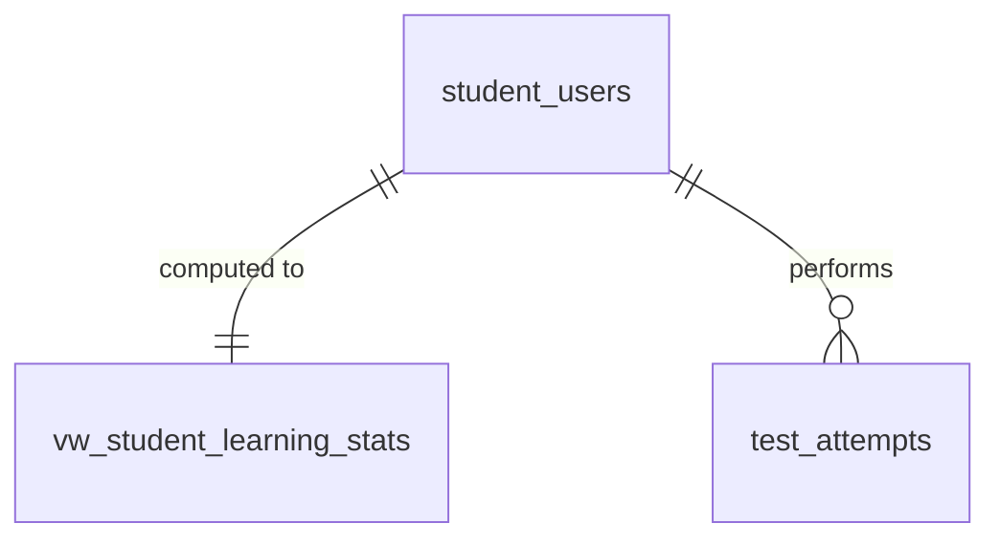

# SPEC — Learning Analytics & Reports
> **Feature ID:** `feat-learning-analytics`
> **UC Coverage:** UC-19 (Learning Progress & Stats), UC-32 (View Quiz Results), UC-38 (Report Screen)
> **Version:** 1.0 | **Status:** Draft
> **Author:** Team | **Last Updated:** 2026-05-28

---

## 1. CONTEXT & GOAL

### 1.1 Bối cảnh
Để học tập hiệu quả, học viên cần theo dõi trực quan tiến độ học và điểm số qua các kỳ thi thử. Đồng thời, Nhân viên (Staff) và Quản trị viên (Admin) cần những báo cáo phân tích tổng hợp để đánh giá chất lượng học liệu và sự phát triển của hệ thống.

### 1.2 Mục tiêu
- **Cho Student (UC-19):** Hiển thị thống kê số lượng bài học hoàn thành, biểu đồ radar năng lực kỹ năng, chuỗi học tập hàng ngày (streak) và lịch sử điểm số thi thử JLPT.
- **Cho Staff (UC-32):** Cung cấp giao diện phân tích kết quả làm bài Quiz/Exam của từng học viên và tỷ lệ trả lời đúng/sai của từng câu hỏi trong hệ thống.
- **Cho Admin (UC-38):** Cung cấp Dashboard quản trị báo cáo tổng quát về tăng trưởng người dùng, phân phối phổ điểm thi thử JLPT, và hỗ trợ xuất dữ liệu ra PDF/CSV/Excel.

### 1.3 Tại sao cần?
Không có thống kê tiến độ $\rightarrow$ học viên thiếu động lực duy trì chuỗi học và khó tự nhận biết kỹ năng còn yếu. Không có báo cáo quản trị $\rightarrow$ hệ thống mất kiểm soát về chất lượng đề thi, sự tương tác và sức khỏe tổng quát của nền tảng.

---

## 2. ACTOR

| Actor | Role | Điều kiện tiền quyết |
|:---|:---|:---|
| **Student** | Xem lịch sử học tập cá nhân, streak, radar năng lực | Đã đăng nhập Student, status = `active` |
| **Staff** | Phân tích kết quả kiểm tra quiz, phổ câu hỏi ngân hàng | Đã đăng nhập Staff, status = `active` |
| **Admin** | Phân tích báo cáo tăng trưởng và xuất biểu mẫu | Đã đăng nhập Admin, status = `active`, 2FA verified |

---

## 3. FUNCTIONAL REQUIREMENTS (EARS)

### 3.1 UC-19 — Tiến độ học tập của Học viên (Student Progress & Stats)

| ID | EARS Requirement |
|:---|:---|
| FR-ANALYTICS-01 | WHEN a Student views the dashboard, THE SYSTEM SHALL calculate and return their current streak, longest streak, and last activity date from `student_users`. |
| FR-ANALYTICS-02 | THE SYSTEM SHALL generate a skills radar chart based on the student's average scores in different domains: grammar (`grammar_points`), vocabulary (`vocabulary`), reading (`test_attempts`), listening (`test_attempts`), and pronunciation (`student_submissions`). |
| FR-ANALYTICS-03 | THE SYSTEM SHALL fetch overall completions (lessons, Kanji, grammar, vocabulary, Kana) directly from `vw_student_learning_stats` to ensure fast page load. |

### 3.2 UC-32 — Phân tích Kết quả làm bài (Staff Quiz Analysis)

| ID | EARS Requirement |
|:---|:---|
| FR-ANALYTICS-10 | WHEN a Staff member requests quiz statistics, THE SYSTEM SHALL return the total number of attempts, average score, pass rate, and completion time distribution from `test_attempts`. |
| FR-ANALYTICS-11 | THE SYSTEM SHALL return a per-question accuracy report comparing correct vs incorrect selections (`selected_option` from `attempt_answers`) to identify ambiguous questions. |
| FR-ANALYTICS-12 | WHEN requested, THE SYSTEM SHALL drill down to show the exact answered sheet of a specific student attempt. |

### 3.3 UC-38 — Bảng báo cáo Quản trị (Admin Report Screen)

| ID | EARS Requirement |
|:---|:---|
| FR-ANALYTICS-20 | WHEN an Admin requests system reports, THE SYSTEM SHALL aggregate data from `student_users` (registration rate), `test_attempts` (exam stats), and `student_content_progress`. |
| FR-ANALYTICS-21 | WHEN an Admin triggers a report export, THE SYSTEM SHALL compile the filtered statistics into PDF, CSV, or XLSX files using a secure download link. |
| FR-ANALYTICS-22 | THE SYSTEM SHALL compute statistical distributions (e.g. score histograms) dynamically at the server level. |

---

## 4. NON-FUNCTIONAL REQUIREMENTS

| ID | Category | Requirement |
|:---|:---|:---|
| NFR-ANALYTICS-01 | Performance | Biểu đồ học viên (Student Analytics) phải phản hồi dưới 400ms (p95) thông qua việc tận dụng database view `vw_student_learning_stats`. |
| NFR-ANALYTICS-02 | Performance | Báo cáo Admin (Admin Reports) phải có tùy chọn timeout 60 giây đối với các tác vụ tổng hợp dữ liệu quy mô lớn. |
| NFR-ANALYTICS-03 | Security | Báo cáo phân tích của học viên chỉ hiển thị cho chính học viên đó, các nhân viên quản lý (Staff), và Admin cấp cao. |
| NFR-ANALYTICS-04 | Correctness | Lịch streak ngày học phải được đối sánh theo múi giờ địa phương và cập nhật mỗi khi có `learning_activity_log` mới được ghi nhận. |
| NFR-ANALYTICS-05 | Logging | Log mọi yêu cầu xuất dữ liệu báo cáo hành chính: `[WARN] Admin {adminId} exported {reportType} format {format}`. |

---

## 5. DATA MODEL

### 5.1 Bảng chính & View

> Nguồn: [`jlpt_database_v2.sql`](file:///d:/Japanese-Skill-Practice-Platform/3.src/infra/Database/jlpt_database_v2.sql)

```sql
-- View: Student learning statistics summary
CREATE VIEW vw_student_learning_stats AS
SELECT
    s.student_id,
    s.full_name,
    s.email,
    s.current_jlpt_level,
    s.target_jlpt_level,
    s.current_streak,
    s.longest_streak,
    s.last_activity_date,

    -- Completed items
    (SELECT COUNT(*) FROM student_content_progress ucp
     WHERE ucp.student_id = s.student_id AND ucp.content_type='lesson'     AND ucp.status='completed') AS lessons_completed,
    (SELECT COUNT(*) FROM student_content_progress ucp
     WHERE ucp.student_id = s.student_id AND ucp.content_type='kanji'      AND ucp.status='completed') AS kanji_completed,
    (SELECT COUNT(*) FROM student_content_progress ucp
     WHERE ucp.student_id = s.student_id AND ucp.content_type='vocabulary' AND ucp.status='completed') AS vocabulary_completed,
    (SELECT COUNT(*) FROM student_content_progress ucp
     WHERE ucp.student_id = s.student_id AND ucp.content_type='grammar'    AND ucp.status='completed') AS grammar_completed,
    (SELECT COUNT(*) FROM student_content_progress ucp
     WHERE ucp.student_id = s.student_id AND ucp.content_type='kana'       AND ucp.status='completed') AS kana_completed,

    -- Exam / Quiz statistics
    (SELECT COUNT(*) FROM test_attempts t
     WHERE t.student_id = s.student_id AND t.attempt_type='exam' AND t.status IN ('submitted','auto_submitted')) AS total_exams_taken,
    (SELECT COUNT(*) FROM test_attempts t
     WHERE t.student_id = s.student_id AND t.attempt_type='quiz' AND t.status IN ('submitted','auto_submitted')) AS total_quizzes_taken,
    (SELECT MAX(t.total_score) FROM test_attempts t
     WHERE t.student_id = s.student_id AND t.attempt_type='exam') AS highest_exam_score,
    (SELECT AVG(t.total_score) FROM test_attempts t
     WHERE t.student_id = s.student_id AND t.attempt_type='exam') AS average_exam_score
FROM student_users s;

-- Bảng 13: test_attempts
CREATE TABLE test_attempts (
    attempt_id        BIGINT IDENTITY(1,1) PRIMARY KEY,
    student_id        BIGINT          NOT NULL,
    attempt_type      NVARCHAR(20)    NOT NULL
        CHECK (attempt_type IN ('exam','quiz','practice','reading','listening')),
    parent_type       NVARCHAR(30)    NOT NULL
        CHECK (parent_type IN ('assessment','lesson','random_practice')),
    parent_id         BIGINT          NULL,
    started_at        DATETIME2       NOT NULL DEFAULT SYSUTCDATETIME(),
    submitted_at      DATETIME2       NULL,
    duration_seconds  INT             NULL,
    total_score       DECIMAL(8,2)    NULL,
    max_score         DECIMAL(8,2)    NULL,
    is_passed         BIT             NULL,
    language_knowledge_score DECIMAL(8,2) NULL,
    reading_score            DECIMAL(8,2) NULL,
    listening_score          DECIMAL(8,2) NULL,
    status            NVARCHAR(20)    NOT NULL DEFAULT 'in_progress'
        CHECK (status IN ('in_progress','submitted','auto_submitted','abandoned')),
    CONSTRAINT FK_attempt_student FOREIGN KEY (student_id) REFERENCES student_users(student_id) ON DELETE CASCADE
);
```

### 5.2 Quan hệ



---

## 6. API SPEC

### `GET /api/analytics/my-progress`
**Actor:** Student | **Auth:** Bearer JWT

**Response (200):**
```json
{
  "status": 200,
  "message": "Lấy tiến độ học tập thành công",
  "data": {
    "currentStreak": 5,
    "longestStreak": 14,
    "completions": {
      "lessons": 12,
      "kanji": 45,
      "vocabulary": 120,
      "grammar": 8,
      "kana": 46
    },
    "skillsRadar": {
      "grammar": 85.0,
      "vocabulary": 90.0,
      "reading": 75.0,
      "listening": 60.0,
      "speaking": 80.0
    }
  }
}
```

---

### `GET /api/analytics/quizzes/{quizId}/stats`
**Actor:** Staff | **Auth:** Bearer JWT

**Response (200):**
```json
{
  "status": 200,
  "message": "Lấy thống kê bài kiểm tra thành công",
  "data": {
    "quizId": 23,
    "totalAttempts": 150,
    "averageScore": 14.5,
    "maxScore": 20.0,
    "passRate": 82.5,
    "questionAccuracy": [
      {
        "questionId": 101,
        "correctCount": 135,
        "incorrectCount": 15,
        "accuracyPercent": 90.0
      },
      {
        "questionId": 102,
        "correctCount": 45,
        "incorrectCount": 105,
        "accuracyPercent": 30.0
      }
    ]
  }
}
```

---

### `GET /api/analytics/admin/reports?startDate=2026-05-01&endDate=2026-05-28`
**Actor:** Admin | **Auth:** Bearer JWT (2FA required)

**Response (200):**
```json
{
  "status": 200,
  "message": "Lấy báo cáo hệ thống thành công",
  "data": {
    "newRegistrations": 1250,
    "totalAttempts": 4500,
    "courseCompletionRates": [
      {
        "courseId": 1,
        "courseTitle": "Khóa học N5 cấp tốc",
        "completedStudentsCount": 350
      }
    ]
  }
}
```

---

### `GET /api/analytics/admin/reports/export?startDate=2026-05-01&endDate=2026-05-28&format=xlsx`
**Actor:** Admin | **Auth:** Bearer JWT (2FA required)

**Response (200):**
```json
{
  "status": 200,
  "message": "Khởi tạo xuất file thành công",
  "data": {
    "downloadUrl": "https://jlpt.example.com/exports/system-report-20260528.xlsx",
    "expiresAt": "2026-05-28T23:59:59Z"
  }
}
```

---

## 7. ERROR HANDLING

| HTTP Code | Error Code | Message | Trigger |
|:---:|:---|:---|:---|
| 400 | `BAD_REQUEST` | "Định dạng ngày không hợp lệ" | Gửi tham số ngày sai định dạng |
| 401 | `UNAUTHORIZED` | "Yêu cầu đăng nhập" | JWT token thiếu hoặc hết hạn |
| 403 | `FORBIDDEN` | "Quyền truy cập bị từ chối" | Student cố gọi API thống kê của Staff/Admin |
| 403 | `MFA_REQUIRED` | "Yêu cầu xác thực 2 yếu tố (2FA)" | Admin chưa xác thực 2FA |
| 404 | `QUIZ_NOT_FOUND` | "Không tìm thấy bài kiểm tra này" | quizId sai lệch |
| 500 | `EXPORT_FAILED` | "Lỗi xuất báo cáo" | Lỗi trong quá trình render XLSX hoặc PDF |

---

## 8. ACCEPTANCE CRITERIA

| ID | Scenario | Given | When | Then |
|:---|:---|:---|:---|:---|
| AC-ANALYTICS-01 | Hiển thị radar kỹ năng chính xác | Có điểm trung bình của các phần thi | GET /my-progress | Trả về điểm trung bình kỹ năng chính xác |
| AC-ANALYTICS-02 | Thống kê chính xác độ khó câu hỏi | Có 100 attempts cho bài Quiz | GET /quizzes/{id}/stats | Độ chính xác từng câu được tính đúng server-side |
| AC-ANALYTICS-03 | Admin xuất file XLSX thành công | Bộ lọc thời gian hợp lệ | GET /reports/export?format=xlsx | Trả về link tải tệp tin có hiệu lực giới hạn |

---

## OUT OF SCOPE

- ❌ Real-time live analytics qua WebSockets — chỉ dùng HTTP polling / refresh.
- ❌ Xuất báo cáo theo định dạng tài liệu Word (.docx).
