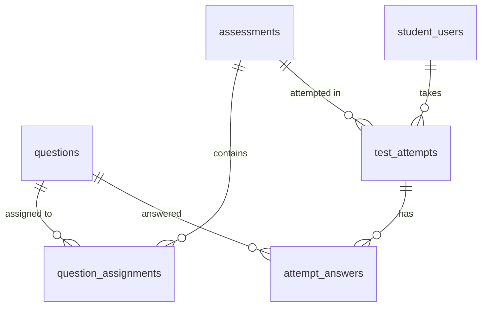

# SPEC — JLPT Mock Exam (`feat-mock-test`)
> **Feature ID:** `feat-mock-test`
> **UC Coverage:** UC-10 (JLPT Mock Test)
> **Version:** 1.0 | **Status:** Draft
> **Author:** Team | **Last Updated:** 2026-06-16
> **Phụ thuộc:** `feat-assessment` (dùng chung bảng `assessments`, `questions`, `question_assignments`, `test_attempts`, `attempt_answers`)

---

## 1. CONTEXT & GOAL

### 1.1 Bối cảnh
Học viên cần một hình thức thi thử mô phỏng đúng cấu trúc kỳ thi JLPT thật: đề thi đầy đủ 3 phần (Ngôn ngữ, Đọc hiểu, Nghe hiểu), có đồng hồ đếm ngược, và kết quả xác định đạt/không đạt theo `pass_score` chính thức của từng cấp độ. Đây khác với Quiz ngắn (`feat-assessment` UC-11) ở: timer bắt buộc do server kiểm soát, tính điểm theo 3 section riêng biệt, và có thể yêu cầu subscription VIP.

### 1.2 Mục tiêu
- Cho phép học viên chọn đề thi theo `jlpt_level`, xem thông tin (`durationMin`, `passScore`, `isVipOnly`) trước khi bắt đầu
- Server kiểm soát hoàn toàn thời gian làm bài (`started_at`, `expiresAt`) — client timer chỉ để hiển thị
- Tính điểm server-side theo 3 section: `language_knowledge`, `reading`, `listening`
- Hỗ trợ nộp bài thủ công (manual) và tự động khi hết giờ (auto-submit)
- Xác định đạt/không đạt dựa trên `assessments.pass_score`
- Cho phép xem lại chi tiết bài thi đã nộp (review) và lịch sử các lần thi
- Đảm bảo mỗi lần nộp tạo bản ghi `test_attempts` mới — bất biến, không update đè

### 1.3 Tại sao cần?
Mock exam là tính năng premium giúp học viên trải nghiệm áp lực thi thật, qua đó tự đánh giá khả năng đạt JLPT trước khi đăng ký thi chính thức. Đây là điểm phân biệt giá trị giữa tài khoản FREE và VIP.

---

## 2. ACTOR

| Actor | Role | Điều kiện tiền quyết |
|:---|:---|:---|
| **Student** | Chọn đề thi, làm bài, nộp bài (manual/auto), xem lại kết quả | Đã đăng nhập, `status = 'active'` |
| **System (Auto-submit)** | Nhận bài tự động khi `isAutoSubmit=true` | Client gửi sau khi đồng hồ về 0 |
| **AuditLogService** | Ghi log mọi lần nộp bài | Nội bộ |

---

## 3. FUNCTIONAL REQUIREMENTS (EARS)

### 3.1 Danh sách & bắt đầu thi

| ID | EARS Requirement |
|:---|:---|
| FR-MOCK-01 | WHEN a Student requests the exam list, THE SYSTEM SHALL return `assessments` filtered by `assessment_type = 'exam'`, `status = 'published'`, and optional `jlpt_level`, including `durationMin`, `passScore`, `isVipOnly`, `questionCount`. |
| FR-MOCK-02 | WHEN a Student starts an exam, THE SYSTEM SHALL record `started_at` using server time (`LocalDateTime.now()`); THE SYSTEM SHALL NOT accept a client-supplied timestamp. |
| FR-MOCK-03 | WHEN an exam starts, THE SYSTEM SHALL NOT include `correctOption` or `correctAnswerText` in any `ExamQuestionResponse` returned to the client. |
| FR-MOCK-04 | WHEN an exam starts, THE SYSTEM SHALL group questions by `section_name` (`language_knowledge`, `reading`, `listening`) ordered by `display_order`, and compute `expiresAt = started_at + assessments.duration_min`. |
| FR-MOCK-05 | IF `assessments.is_vip_only = true`, THE SYSTEM SHALL verify the Student has an active VIP subscription in real time (no cache older than 5 minutes) before creating the attempt; otherwise THE SYSTEM SHALL throw `VipRequiredException` (HTTP 403). |
| FR-MOCK-06 | WHEN an exam has a non-null `audio_url` for the listening section, THE SYSTEM SHALL return the URL as part of the start payload. THE SYSTEM SHALL NOT stream audio bytes from the backend. |

### 3.2 Theo dõi thời gian

| ID | EARS Requirement |
|:---|:---|
| FR-MOCK-07 | WHEN a Student polls exam status, THE SYSTEM SHALL compute `remainingSeconds = max(0, expiresAt - NOW())` and `isExpired = (remainingSeconds == 0)` using server time. |
| FR-MOCK-08 | IF the polling attempt does not belong to the requesting Student, THE SYSTEM SHALL throw `ForbiddenException` (HTTP 403). |

### 3.3 Nộp bài

| ID | EARS Requirement |
|:---|:---|
| FR-MOCK-09 | WHEN a Student submits an exam with `isAutoSubmit = false`, THE SYSTEM SHALL validate `NOW() <= expiresAt`; IF violated, THE SYSTEM SHALL throw `TimeExceededException` (HTTP 400, `TIME_EXCEEDED`) and SHALL NOT persist any attempt change. |
| FR-MOCK-10 | WHEN a Student submits an exam with `isAutoSubmit = true`, THE SYSTEM SHALL skip the time-exceeded check and accept the submission, setting `test_attempts.status = 'auto_submitted'`. |
| FR-MOCK-11 | WHEN submitting, THE SYSTEM SHALL validate the attempt belongs to the requesting Student (`test_attempts.student_id == JWT.studentId`); IF not, THE SYSTEM SHALL throw `ForbiddenException` (HTTP 403). |
| FR-MOCK-12 | WHEN submitting, THE SYSTEM SHALL validate `test_attempts.status = 'in_progress'`; IF the attempt was already submitted, THE SYSTEM SHALL throw `AttemptAlreadySubmittedException` (HTTP 422, `ATTEMPT_ALREADY_SUBMITTED`). |
| FR-MOCK-13 | WHEN scoring, THE SYSTEM SHALL calculate `languageKnowledgeScore`, `readingScore`, `listeningScore` by summing `question_assignments.score` for correct answers grouped by `section_name`, and `totalScore` as their sum. |
| FR-MOCK-14 | THE SYSTEM SHALL validate `0 <= totalScore <= maxScore`; IF violated, THE SYSTEM SHALL throw `BusinessRuleViolationException` (HTTP 422, `SCORE_INVARIANT_VIOLATION`) and log at `[ERROR]` level. |
| FR-MOCK-15 | WHEN scoring completes, THE SYSTEM SHALL set `is_passed = (totalScore >= assessments.pass_score)`. |
| FR-MOCK-16 | WHEN submitting, THE SYSTEM SHALL persist `attempt_answers` (batch insert) and update `test_attempts` (`status`, scores, `submitted_at`, `duration_seconds`) within a single `@Transactional` boundary. |
| FR-MOCK-17 | WHEN a submission completes (manual or auto), THE SYSTEM SHALL write an audit log entry `EXAM_SUBMITTED {studentId, assessmentId, attemptId, totalScore, isPassed, durationSeconds}`. |
| FR-MOCK-18 | EACH submission SHALL create a NEW `test_attempts` record at start time; THE SYSTEM SHALL NEVER update or reuse a previous attempt's row across separate exam sessions. |

### 3.4 Lịch sử & Review

| ID | EARS Requirement |
|:---|:---|
| FR-MOCK-19 | WHEN a Student requests exam history, THE SYSTEM SHALL return `test_attempts` where `parent_type = 'assessment'` and `attempt_type IN ('exam')` with `status IN ('submitted','auto_submitted')`, ordered by `submitted_at DESC`. |
| FR-MOCK-20 | WHEN a Student requests an exam review, THE SYSTEM SHALL validate the attempt belongs to the Student and `status != 'in_progress'`; THE SYSTEM SHALL return `attempt_answers` joined with `questions`, including `correctOption` and `explanation`. |
| FR-MOCK-21 | IF a Student requests review for an attempt still `in_progress`, THE SYSTEM SHALL throw `BadRequestException` (HTTP 400). |
| FR-MOCK-22 | THE SYSTEM SHALL NOT allow Staff/Admin actions in this feature; exam content management is out of scope (see §9). |

---

## 4. NON-FUNCTIONAL REQUIREMENTS

| ID | Category | Requirement |
|:---|:---|:---|
| NFR-MOCK-01 | Security | `started_at` luôn do server set; client không thể override qua request body. |
| NFR-MOCK-02 | Security | `correctOption`/`correctAnswerText` KHÔNG xuất hiện trong response của `/start` hoặc `/status`. |
| NFR-MOCK-03 | Security | VIP check phải real-time, không cache quá 5 phút (`AGENTS.md §7.3`). |
| NFR-MOCK-04 | Correctness | `0 <= totalScore <= maxScore` bắt buộc validate tại Service layer trước khi persist. |
| NFR-MOCK-05 | Correctness | `languageKnowledgeScore + readingScore + listeningScore == totalScore` (invariant). |
| NFR-MOCK-06 | Immutability | `test_attempts` đã `submitted`/`auto_submitted` không được UPDATE lại điểm số. |
| NFR-MOCK-07 | Transactionality | Toàn bộ scoring + persist (`attempt_answers` + `test_attempts`) nằm trong một `@Transactional`. |
| NFR-MOCK-08 | Performance | `POST /submit` phản hồi < 1500ms (p95) với đề 95 câu. |
| NFR-MOCK-09 | Logging | SLF4J ghi `[INFO]` mỗi lần `EXAM_SUBMITTED {studentId, assessmentId, score, isPassed, durationSeconds}`; ghi `[ERROR]` khi invariant vi phạm. |
| NFR-MOCK-10 | Testing | Unit test coverage `>= 80%` cho `MockExamService` (scoring, timer, VIP check). |

---

## 5. DATA MODEL

> Dùng chung schema với `feat-assessment` — xem chi tiết đầy đủ tại [`feat-assessment/SPEC.md §5`](../feat-assessment/SPEC.md). Phần dưới đây chỉ liệt lại các cột liên quan trực tiếp tới mock exam.

### 5.1 Bảng liên quan

```sql
-- assessments: đề thi (assessment_type = 'exam')
-- Cột dùng cho mock exam: duration_min, pass_score, total_score, audio_url, jlpt_level, status
-- ⚠️ Cần bổ sung cột is_vip_only (BIT, DEFAULT 0) nếu chưa tồn tại trong schema hiện tại
--    — phối hợp migration với feat-assessment để tránh xung đột.

-- question_assignments: câu hỏi gắn với đề thi
-- Cột dùng: section_name ('language_knowledge'|'reading'|'listening'), score, display_order

-- test_attempts: 1 bản ghi / lần thi
-- Cột dùng: attempt_type='exam', started_at, submitted_at, duration_seconds,
--           total_score, max_score, is_passed,
--           language_knowledge_score, reading_score, listening_score,
--           status ('in_progress'|'submitted'|'auto_submitted')

-- attempt_answers: 1 bản ghi / câu trả lời trong 1 attempt
-- Cột dùng: selected_option, answer_text, is_correct, score
```

### 5.2 Quan hệ



---

## 6. API SPEC

### `GET /api/assessments?type=exam&level={N3}&page=0&size=10`
**Actor:** Student | **Auth:** Bearer JWT

**Response (200):**
```json
{
  "status": 200,
  "message": "OK",
  "data": {
    "content": [
      {
        "assessmentId": "long",
        "title": "string",
        "jlptLevel": "string",
        "durationMin": "int",
        "passScore": "int",
        "totalScore": "int",
        "isVipOnly": "boolean",
        "questionCount": "long"
      }
    ],
    "totalElements": "long",
    "totalPages": "int"
  }
}
```

---

### `POST /api/assessments/{assessmentId}/start`
**Actor:** Student | **Auth:** Bearer JWT
> Tạo `TestAttempt` mới, server ghi `started_at`. VIP check nếu `is_vip_only = true`.

**Response (200):**
```json
{
  "status": 200,
  "message": "Bắt đầu làm bài",
  "data": {
    "attemptId": "long",
    "startedAt": "datetime",
    "expiresAt": "datetime",
    "sections": [
      {
        "sectionName": "language_knowledge|reading|listening",
        "questions": [
          {
            "questionId": "long",
            "questionText": "string",
            "questionType": "multiple_choice|fill_blank|true_false",
            "skill": "string",
            "optionA": "string|null",
            "optionB": "string|null",
            "optionC": "string|null",
            "optionD": "string|null",
            "audioUrl": "string|null",
            "imageUrl": "string|null",
            "displayOrder": "int"
          }
        ]
      }
    ],
    "listeningAudioUrl": "string|null"
  }
}
```
> **Lưu ý:** Không có field `correctOption`/`correctAnswerText` trong bất kỳ object câu hỏi nào.

---

### `GET /api/test-attempts/{attemptId}/status`
**Actor:** Student | **Auth:** Bearer JWT
> Dùng cho polling đồng bộ thời gian (tab reload, mất kết nối) — không bắt buộc.

**Response (200):**
```json
{
  "status": 200,
  "message": "OK",
  "data": {
    "attemptId": "long",
    "status": "in_progress|submitted|auto_submitted",
    "remainingSeconds": "long",
    "isExpired": "boolean"
  }
}
```

---

### `POST /api/assessments/{assessmentId}/submit`
**Actor:** Student | **Auth:** Bearer JWT

**Request:**
```json
{
  "attemptId": "long",
  "isAutoSubmit": "boolean",
  "answers": [
    {
      "questionId": "long",
      "selectedOption": "string|null — A|B|C|D",
      "answerText": "string|null — fill_blank, max 1000 ký tự"
    }
  ]
}
```

**Response (200):**
```json
{
  "status": 200,
  "message": "Nộp bài thành công",
  "data": {
    "attemptId": "long",
    "totalScore": "decimal",
    "maxScore": "decimal",
    "isPassed": "boolean",
    "durationSeconds": "int",
    "submittedAt": "datetime",
    "sectionScores": {
      "languageKnowledge": "decimal",
      "reading": "decimal",
      "listening": "decimal"
    },
    "results": [
      {
        "questionId": "long",
        "sectionName": "string",
        "isCorrect": "boolean",
        "selectedOption": "string|null",
        "correctOption": "string",
        "score": "decimal",
        "explanation": "string|null"
      }
    ]
  }
}
```

---

### `GET /api/test-attempts?type=exam&page=0&size=10`
**Actor:** Student | **Auth:** Bearer JWT
> Lịch sử thi thử của Student.

**Response (200):**
```json
{
  "status": 200,
  "message": "OK",
  "data": {
    "content": [
      {
        "attemptId": "long",
        "assessmentTitle": "string",
        "jlptLevel": "string",
        "totalScore": "decimal",
        "maxScore": "decimal",
        "isPassed": "boolean",
        "status": "submitted|auto_submitted",
        "sectionScores": {
          "languageKnowledge": "decimal",
          "reading": "decimal",
          "listening": "decimal"
        },
        "submittedAt": "datetime",
        "durationSeconds": "int"
      }
    ],
    "totalElements": "long"
  }
}
```

---

### `GET /api/test-attempts/{attemptId}/review`
**Actor:** Student | **Auth:** Bearer JWT
> Chỉ cho phép khi `status != 'in_progress'`.

**Response (200):**
```json
{
  "status": 200,
  "message": "OK",
  "data": {
    "attemptId": "long",
    "totalScore": "decimal",
    "maxScore": "decimal",
    "isPassed": "boolean",
    "sectionScores": {
      "languageKnowledge": "decimal",
      "reading": "decimal",
      "listening": "decimal"
    },
    "results": [
      {
        "questionId": "long",
        "questionText": "string",
        "optionA": "string|null",
        "optionB": "string|null",
        "optionC": "string|null",
        "optionD": "string|null",
        "selectedOption": "string|null",
        "correctOption": "string",
        "isCorrect": "boolean",
        "score": "decimal",
        "explanation": "string|null"
      }
    ]
  }
}
```

---

## 7. ERROR HANDLING

| HTTP Code | Error Code | Message | Trigger |
|:---:|:---|:---|:---|
| 400 | `VALIDATION_FAILED` | "Dữ liệu không hợp lệ" | `answers` rỗng, `selectedOption` không thuộc A-D, `answerText` > 1000 ký tự |
| 400 | `TIME_EXCEEDED` | "Đã hết thời gian làm bài" | Manual submit sau `expiresAt` |
| 400 | `ATTEMPT_IN_PROGRESS` | "Bài thi chưa kết thúc" | Review một attempt còn `in_progress` |
| 401 | `UNAUTHORIZED` | "Yêu cầu đăng nhập" | JWT thiếu/hết hạn |
| 403 | `VIP_REQUIRED` | "Đề thi này yêu cầu tài khoản VIP" | `is_vip_only = true` và student không có VIP active |
| 403 | `FORBIDDEN` | "Bạn không có quyền thao tác trên bài làm này" | `attempt.student_id != JWT.studentId` |
| 404 | `ASSESSMENT_NOT_FOUND` | "Đề thi không tồn tại" | `assessmentId` không có hoặc `status != published` hoặc `type != exam` |
| 404 | `ATTEMPT_NOT_FOUND` | "Lần thi không tồn tại" | `attemptId` không có |
| 422 | `SCORE_INVARIANT_VIOLATION` | "Điểm số không hợp lệ" | `totalScore < 0` hoặc `totalScore > maxScore` |
| 422 | `ATTEMPT_ALREADY_SUBMITTED` | "Bài đã được nộp" | Nộp lại attempt có `status != in_progress` |
| 500 | `INTERNAL_ERROR` | "Internal server error" | Lỗi hệ thống |

---

## 8. ACCEPTANCE CRITERIA

> Chi tiết đầy đủ (Given/When/Then) tại [`UC-10-mock-exam.md §8`](./UC-10-mock-exam.md#8-tiêu-chí-chấp-nhận-acceptance-criteria) — AC-10-01 đến AC-10-13. Tóm tắt:

| ID | Scenario | Then (tóm tắt) |
|:---|:---|:---|
| AC-10-01 | Lấy danh sách exam theo level | Chỉ trả `published` đúng level |
| AC-10-02 | `correctOption` không lộ khi start | Response không có field này |
| AC-10-03 | Server ghi `started_at` | `started_at` = server time, `expiresAt` tính đúng |
| AC-10-04 | Auto-submit được chấp nhận sau hết giờ | HTTP 200, `status='auto_submitted'` |
| AC-10-05 | Manual submit sau giờ bị chặn | HTTP 400 `TIME_EXCEEDED`, attempt vẫn `in_progress` |
| AC-10-06 | Tính điểm 3 section đúng | `totalScore` = tổng 3 section |
| AC-10-07 / 08 | Xác định đạt/không đạt | `isPassed` đúng theo `passScore` |
| AC-10-09 | Mỗi lần thi tạo bản ghi mới | `attemptId` mới, bản ghi cũ không đổi |
| AC-10-10 | Chặn nộp lại attempt đã submit | HTTP 422 `ATTEMPT_ALREADY_SUBMITTED` |
| AC-10-11 | VIP check khi exam vip-only | HTTP 403 `VIP_REQUIRED` |
| AC-10-12 | Xem lại chi tiết bài thi | Response có `correctOption`, `explanation`, `sectionScores` |
| AC-10-13 | Score không âm khi sai toàn bộ | `totalScore = 0`, `isPassed = false` |

---

## OUT OF SCOPE

- ❌ Quiz ngắn hàng ngày — xem `feat-assessment` (UC-11)
- ❌ Tạo/chỉnh sửa đề thi và câu hỏi — xem `feat-content-management`
- ❌ AI chấm điểm (OCR, Speech) — xem `feat-ai-skills`
- ❌ Phân tích điểm mạnh/yếu chi tiết theo skill — Phase 2
- ❌ So sánh kết quả với học viên khác (leaderboard) — Phase 2
- ❌ Download kết quả dạng PDF — Phase 2
- ❌ Giới hạn số lần thi lại / cooldown — Phase 2
- ❌ Pause/Resume bài thi — không hỗ trợ (mô phỏng thi thật, không cho tạm dừng)
