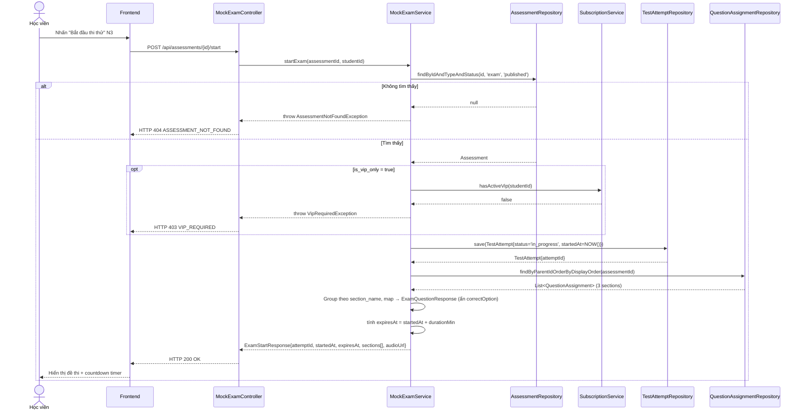
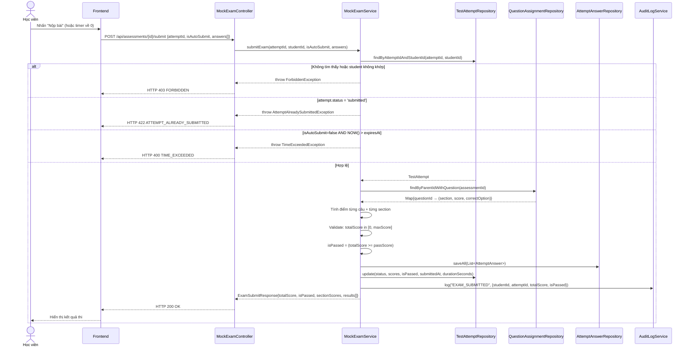
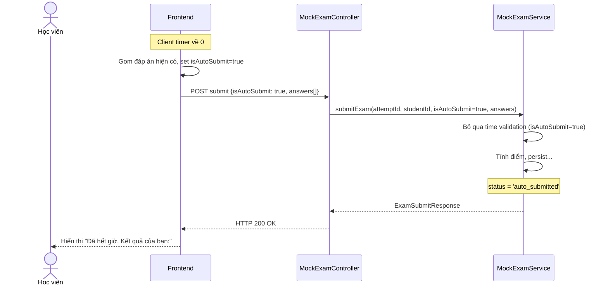

# UC-10 — Thi Thử JLPT (JLPT Mock Exam)

> **Feature:** `feat-mock-test` | **Phiên bản:** 1.0 | **Trạng thái:** Draft
> **Tham chiếu FR:** FR-MOCK-01 đến FR-MOCK-22
> **Cập nhật:** 2026-06-10

---

## 1. Tổng Quan

| Thuộc tính | Nội dung |
|:---|:---|
| **Mã Use Case** | UC-10 |
| **Tên** | Thi Thử JLPT (JLPT Mock Exam) |
| **Tác nhân chính** | Học viên (Student) — đã đăng nhập, `status = 'active'` |
| **Mô tả ngắn** | Học viên làm đề thi thử JLPT đầy đủ 3 phần (Ngôn ngữ, Đọc hiểu, Nghe hiểu) với timer đếm ngược. Kết quả trả về điểm từng phần, tổng điểm, và xác định đạt/không đạt theo chuẩn JLPT. |
| **Độ ưu tiên** | Cao (P1) — tính năng premium, điểm phân biệt của nền tảng |

---

## 2. Tác Nhân & Điều Kiện

### 2.1 Tác Nhân

| Tác nhân | Vai trò |
|:---|:---|
| **Học viên (Student)** | Chọn đề thi, làm bài, nộp bài (manual hoặc auto) |
| **System (Auto-submit)** | Tự động nhận bài khi client gửi `isAutoSubmit=true` sau khi timer hết |
| **AuditLogService** | Ghi lại mọi lần nộp bài thi |

### 2.2 Điều Kiện Tiền Quyết (Preconditions)

- Học viên đã đăng nhập và JWT còn hạn
- Tài khoản `status = 'active'`
- Đề thi tồn tại trong DB với `assessment_type = 'exam'` và `status = 'published'`
- Nếu đề thi `is_vip_only = true`: học viên phải có subscription VIP đang hoạt động

### 2.3 Hậu Điều Kiện (Postconditions)

- **Thành công:** Bản ghi `test_attempts` mới (status = `submitted` hoặc `auto_submitted`) với đầy đủ điểm, cùng toàn bộ `attempt_answers`.
- **Quá giờ (manual submit):** HTTP 400, không có bản ghi mới.
- **Thất bại nghiệp vụ:** Không có bản ghi nào được persist.

---

## 3. Luồng Xử Lý

### 3.1 Luồng Chính — Thi Thử và Nộp Bài Manual (Happy Path)

```
Bước 1  [Học viên]:   Mở trang danh sách đề thi, lọc theo level (ví dụ N3)
Bước 2  [Frontend]:   GET /api/assessments?type=exam&level=N3
Bước 3  [Backend]:    Filter: type='exam', level='N3', status='published'
                       Trả danh sách kèm durationMin, passScore, isVipOnly
Bước 4  [Học viên]:   Xem thông tin đề thi, nhấn "Bắt đầu thi thử"
Bước 5  [Frontend]:   POST /api/assessments/{assessmentId}/start
Bước 6  [Backend]:    Validate: assessment tồn tại, type='exam', status='published'
                       VIP check nếu is_vip_only=true
                       Tạo TestAttempt (status='in_progress', started_at=server NOW())
                       Load câu hỏi từ question_assignments, group theo section_name
                       Tính expiresAt = started_at + duration_min
                       Trả ExamStartResponse: attemptId, startedAt, expiresAt, sections[]
                       (sections chứa câu hỏi BÊN TRONG từng phần, KHÔNG có correctOption)
Bước 7  [Frontend]:   Hiển thị đồng hồ đếm ngược dựa trên expiresAt (client timer)
                       Hiển thị câu hỏi theo section
Bước 8  [Học viên]:   Làm bài (chọn đáp án A/B/C/D hoặc điền vào ô trống)
Bước 9  [Học viên]:   Nhấn "Nộp bài" trước khi hết giờ
Bước 10 [Frontend]:   POST /api/assessments/{assessmentId}/submit
                       { attemptId, isAutoSubmit: false, answers[] }
Bước 11 [Backend]:    Validate attempt thuộc student này
                       Validate attempt.status = 'in_progress'
                       Validate: NOW() <= expiresAt (manual submit)
                       Tính điểm từng section (language, reading, listening)
                       Tính totalScore = sum of section scores
                       Validate: totalScore >= 0 && totalScore <= maxScore
                       set is_passed = (totalScore >= assessment.passScore)
                       @Transactional: batch insert attempt_answers, update test_attempts
                       Audit log: EXAM_SUBMITTED
                       Trả ExamSubmitResponse: scores, isPassed, per-question results
Bước 12 [Frontend]:   Hiển thị kết quả: điểm từng phần, tổng điểm, đạt/không đạt
```

### 3.2 Luồng Phụ A — Auto-Submit Khi Hết Giờ

```
Bước 7 [Frontend]:    Client timer về 0
                       Frontend tự động gửi nộp bài với tất cả đáp án hiện có
Bước 10 [Frontend]:   POST submit { attemptId, isAutoSubmit: true, answers[] }
Bước 11 [Backend]:    Validate attempt thuộc student
                       Validate attempt.status = 'in_progress'
                       isAutoSubmit=true → bỏ qua time validation (client đã xử lý UI)
                       Tiếp tục tính điểm và persist như luồng chính
                       status = 'auto_submitted' (phân biệt với manual submit)
```

### 3.3 Luồng Phụ B — Kiểm Tra Thời Gian Còn Lại (Polling)

```
Bước X [Frontend]:    Định kỳ gọi GET /api/test-attempts/{attemptId}/status
Bước X [Backend]:     Tính remainingSeconds = max(0, expiresAt - NOW())
                       Trả ExamStatusResponse
```

> Polling này không bắt buộc — client tự tính từ `expiresAt`. Dùng khi cần đồng bộ với server (tab reload, mất kết nối).

### 3.4 Luồng Lỗi — Nộp Bài Sau Khi Hết Giờ (Manual Submit)

```
Bước 10 [Frontend]:   Gửi POST submit { isAutoSubmit: false, ... } lúc 106 phút (quá 105 phút)
Bước 11 [Backend]:    NOW() > expiresAt → throw TimeExceededException
                       Trả HTTP 400 — TIME_EXCEEDED
                       Bản ghi test_attempts vẫn ở trạng thái 'in_progress'
Bước 12 [Frontend]:   Hiển thị "Đã hết thời gian làm bài"
```

### 3.5 Luồng Lỗi — Học Viên Không Có VIP

```
Bước 5  [Frontend]:   POST start exam có is_vip_only=true
Bước 6  [Backend]:    Student subscription = FREE → throw VipRequiredException
                       Trả HTTP 403 — VIP_REQUIRED
Bước 7  [Frontend]:   Hiển thị "Đề thi này yêu cầu tài khoản VIP"
```

### 3.6 Luồng Lỗi — Nộp Lại Bài Đã Submitted

```
Bước 10 [Frontend]:   Gửi POST submit với attemptId đã có status='submitted'
Bước 11 [Backend]:    attempt.status = 'submitted' → throw AttemptAlreadySubmittedException
                       Trả HTTP 422 — ATTEMPT_ALREADY_SUBMITTED
```

### 3.7 Luồng Lỗi — Truy Cập Attempt Của Người Khác

```
Bước 11 [Backend]:    attempt.student_id ≠ JWT.studentId → throw ForbiddenException
                       Trả HTTP 403 — FORBIDDEN
```

---

## 4. Quy Tắc Nghiệp Vụ

| Mã | Quy tắc | Chi tiết |
|:---|:---|:---|
| BR-10-01 | `started_at` do **server tạo** tại thời điểm start | Client không được gửi timestamp |
| BR-10-02 | `expiresAt = started_at + duration_min` | Không thể gia hạn sau khi tạo |
| BR-10-03 | Manual submit: phải validate `NOW() <= expiresAt` | Throw `TimeExceededException` nếu quá giờ |
| BR-10-04 | Auto-submit: bỏ qua time validation ở server | Client đã kiểm soát UI; server tin `isAutoSubmit=true` |
| BR-10-05 | Score tính **100% server-side** | Client không gửi score |
| BR-10-06 | `correct_option` **KHÔNG BAO GIỜ** lộ trước khi nộp | `ExamQuestionResponse` không có field này |
| BR-10-07 | Mỗi lần nộp tạo **bản ghi MỚI** `test_attempts` | Không UPDATE bản ghi cũ |
| BR-10-08 | `totalScore >= 0` và `totalScore <= maxScore` bắt buộc | Throw `BusinessRuleViolationException`, log [ERROR] nếu vi phạm |
| BR-10-09 | `is_passed = (totalScore >= assessment.passScore)` | Tính và lưu trong DB |
| BR-10-10 | `attempt.student_id` phải khớp `JWT.studentId` | Throw 403 nếu không khớp |
| BR-10-11 | VIP check **real-time** — không cache quá 5 phút | Xem `AGENTS.md §7.3` |
| BR-10-12 | Toàn bộ persist phải trong **một `@Transactional`** | attempt_answers + test_attempts update cùng transaction |
| BR-10-13 | Mọi lần nộp bài phải ghi audit log | `EXAM_SUBMITTED {studentId, assessmentId, attemptId, score, isPassed}` |

---

## 5. Quy Tắc Kiểm Tra Đầu Vào

### POST /api/assessments/{assessmentId}/submit

| Trường | Kiểm tra | Lỗi khi vi phạm |
|:---|:---|:---|
| `attemptId` | Bắt buộc, `> 0` | "attemptId không hợp lệ" |
| `isAutoSubmit` | Bắt buộc (`true`/`false`) | "isAutoSubmit là bắt buộc" |
| `answers` | Bắt buộc, không rỗng | "Danh sách đáp án không được rỗng" |
| `answers[].questionId` | Bắt buộc, `> 0` | "questionId không hợp lệ" |
| `answers[].selectedOption` | `null` hoặc một trong `A`/`B`/`C`/`D` | "selectedOption phải là A, B, C, D hoặc null" |
| `answers[].answerText` | `null` hoặc max 1000 ký tự | "Câu trả lời quá dài" |

---

## 6. Sơ Đồ Tuần Tự (Sequence Diagram)

### 6.1 Luồng Start Exam



### 6.2 Luồng Submit Exam



### 6.3 Luồng Auto-Submit



---

## 7. Tham Chiếu API

> Xem đặc tả đầy đủ tại [SPEC.md § 6 — API SPEC](./SPEC.md)

| Phương thức | Endpoint | Mô tả |
|:---|:---|:---|
| `GET` | `/api/assessments?type=exam&level={level}` | Danh sách đề thi thử |
| `POST` | `/api/assessments/{id}/start` | Bắt đầu thi, nhận câu hỏi |
| `GET` | `/api/test-attempts/{attemptId}/status` | Kiểm tra thời gian còn lại |
| `POST` | `/api/assessments/{id}/submit` | Nộp bài (manual hoặc auto) |
| `GET` | `/api/test-attempts?type=exam` | Lịch sử thi thử |
| `GET` | `/api/test-attempts/{attemptId}/review` | Xem lại chi tiết bài thi |

---

## 8. Tiêu Chí Chấp Nhận (Acceptance Criteria)

### AC-10-01 — Lấy danh sách đề thi thử N3

> **Tham chiếu:** FR-MOCK-01

- **Cho trước:** 2 exam N3 published, 1 exam N3 draft, 1 exam N2 published
- **Khi:** GET `/api/assessments?type=exam&level=N3`
- **Thì:**
  - HTTP 200
  - Trả đúng 2 exam N3 published
  - Không trả draft, không trả N2

---

### AC-10-02 — `correct_option` không lộ khi bắt đầu thi

> **Tham chiếu:** FR-MOCK-03

- **Cho trước:** Exam N3 với 95 câu, mỗi câu có `correct_option` trong DB
- **Khi:** POST start
- **Thì:**
  - HTTP 200
  - Response KHÔNG có field `correctOption` trong bất kỳ `ExamQuestionResponse` nào
  - Response CÓ `optionA`, `optionB`, `optionC`, `optionD`
  - Response CÓ `attemptId`, `startedAt`, `expiresAt`

---

### AC-10-03 — Server ghi `started_at`

> **Tham chiếu:** FR-MOCK-02

- **Cho trước:** Client không gửi timestamp
- **Khi:** POST start
- **Thì:**
  - `test_attempts.started_at` trong DB = server time (không phải client time)
  - `expiresAt` trong response = `started_at + duration_min`

---

### AC-10-04 — Auto-submit được chấp nhận

> **Tham chiếu:** FR-MOCK-09

- **Cho trước:** Exam `duration_min=60`, timer về 0
- **Khi:** POST submit với `isAutoSubmit=true` lúc 61 phút sau khi start
- **Thì:**
  - HTTP 200
  - `test_attempts.status = 'auto_submitted'`
  - Điểm được tính và lưu đúng

---

### AC-10-05 — Manual submit sau giờ bị chặn

> **Tham chiếu:** FR-MOCK-08

- **Cho trước:** Exam `duration_min=60`
- **Khi:** POST submit với `isAutoSubmit=false` lúc 62 phút sau start
- **Thì:**
  - HTTP 400
  - `error_code = "TIME_EXCEEDED"`
  - Bản ghi `test_attempts` vẫn `status = 'in_progress'`

---

### AC-10-06 — Tính điểm 3 section đúng

> **Tham chiếu:** FR-MOCK-10

- **Cho trước:** 30 câu language (đúng 20, score=1/câu), 40 câu reading (đúng 30), 25 câu listening (đúng 20)
- **Khi:** POST submit
- **Thì:**
  - `languageKnowledge = 20`, `reading = 30`, `listening = 20`
  - `totalScore = 70`

---

### AC-10-07 — Xác định đạt

> **Tham chiếu:** FR-MOCK-11

- **Cho trước:** `pass_score = 90`, `total_score = 95`
- **Khi:** POST submit
- **Thì:** `isPassed = true`

---

### AC-10-08 — Xác định không đạt

> **Tham chiếu:** FR-MOCK-11

- **Cho trước:** `pass_score = 90`, `total_score = 80`
- **Khi:** POST submit
- **Thì:** `isPassed = false`

---

### AC-10-09 — Bản ghi mới mỗi lần thi

> **Tham chiếu:** FR-MOCK-13

- **Cho trước:** Student đã thi lần 1 (attemptId=5)
- **Khi:** POST start lần 2 → POST submit lần 2
- **Thì:**
  - attemptId lần 2 ≠ 5
  - Bản ghi attemptId=5 không bị thay đổi

---

### AC-10-10 — Chặn nộp lại attempt đã submitted

> **Tham chiếu:** FR-MOCK-13

- **Cho trước:** `attempt.status = 'submitted'`
- **Khi:** POST submit cùng attemptId
- **Thì:** HTTP 422 `ATTEMPT_ALREADY_SUBMITTED`

---

### AC-10-11 — VIP check khi exam vip only

> **Tham chiếu:** FR-MOCK-05

- **Cho trước:** Exam có `is_vip_only = true`, student `subscription = FREE`
- **Khi:** POST start
- **Thì:** HTTP 403 `VIP_REQUIRED`

---

### AC-10-12 — Xem lại chi tiết bài thi

> **Tham chiếu:** FR-MOCK-14

- **Cho trước:** Attempt đã `status = 'submitted'`
- **Khi:** GET `/api/test-attempts/{id}/review`
- **Thì:**
  - HTTP 200
  - Response có `correctOption`, `explanation` từng câu
  - Response có `sectionScores`, `isPassed`

---

### AC-10-13 — Score không âm

> **Tham chiếu:** FR-MOCK-20

- **Cho trước:** Học viên thi sai toàn bộ 95 câu
- **Khi:** POST submit
- **Thì:**
  - `totalScore = 0`
  - `languageScore = 0`, `readingScore = 0`, `listeningScore = 0`
  - `isPassed = false`

---

## 9. Ngoài Phạm Vi (Out of Scope)

- ❌ Quiz ngắn hàng ngày — xem `feat-assessment` (UC-11)
- ❌ Tạo/chỉnh sửa đề thi và câu hỏi — xem `feat-content-management`
- ❌ AI chấm điểm (OCR, Speech) — xem `feat-ai-skills`
- ❌ Phân tích điểm mạnh/yếu chi tiết — Phase 2
- ❌ So sánh kết quả với học viên khác — Phase 2
- ❌ Download kết quả PDF — Phase 2
- ❌ Giới hạn số lần thi lại — Phase 2
- ❌ Pause/Resume bài thi — không hỗ trợ (giống thi thật)
