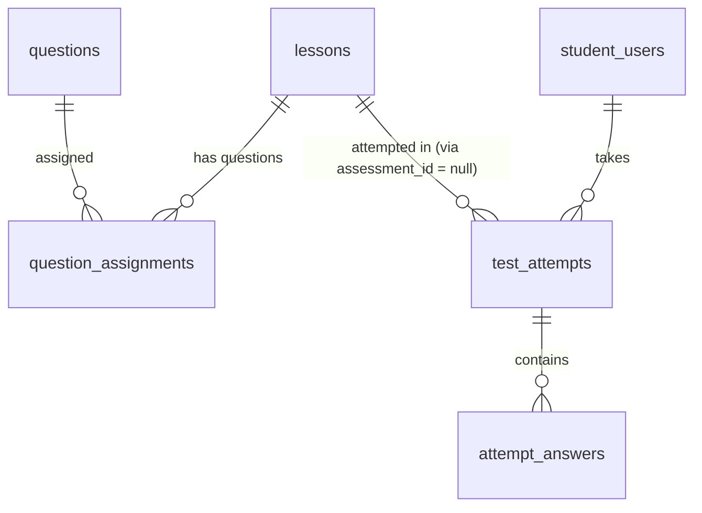

# SPEC — Reading & Listening Practice
> **Feature ID:** `feat-reading-listening`
> **UC Coverage:** UC-14 (Reading Practice), UC-15 (Listening Practice)
> **Version:** 1.0 | **Status:** Draft
> **Author:** Team | **Last Updated:** 2026-05-28

---

## 1. CONTEXT & GOAL

### 1.1 Bối cảnh
Đọc hiểu và nghe hiểu là hai kỹ năng chiếm tỉ trọng lớn trong kỳ thi JLPT. Học viên cần luyện tập với ngữ liệu thực tế (đoạn văn + audio) kết hợp câu hỏi trắc nghiệm, nhận phản hồi ngay sau khi nộp bài.

### 1.2 Mục tiêu
- Cung cấp bài luyện đọc hiểu với đoạn văn tiếng Nhật và câu hỏi trắc nghiệm
- Cung cấp bài luyện nghe hiểu với audio và câu hỏi trắc nghiệm (phát lại được)
- Chấm điểm tức thì, hiển thị transcript (nghe) và giải thích đáp án

### 1.3 Tại sao cần?
Reading và Listening chiếm ~2/3 điểm JLPT. Luyện tập thường xuyên với ngữ liệu đa dạng là cách duy nhất để cải thiện hai kỹ năng này.

---

## 2. ACTOR

| Actor | Role | Điều kiện tiền quyết |
|:---|:---|:---|
| **Student** | Làm bài luyện đọc/nghe | Đã đăng nhập; có loa/tai nghe (UC-15) |

---

## 3. FUNCTIONAL REQUIREMENTS (EARS)

### 3.1 UC-14 — Reading Practice

| ID | EARS Requirement |
|:---|:---|
| FR-RL-01 | WHEN a Student accesses Reading Practice, THE SYSTEM SHALL display a list of reading lessons (`lessons.lesson_type = 'reading'`, `status = 'published'`) filtered by JLPT level. |
| FR-RL-02 | WHEN a Student opens a reading lesson, THE SYSTEM SHALL display: the Japanese passage text (`lessons.content`), and a list of multiple-choice questions from `question_assignments` linked to this lesson. |
| FR-RL-03 | THE SYSTEM SHALL NOT include `correct_option` or `correct_answer_text` in the initial question payload. |
| FR-RL-04 | WHEN a Student submits answers, THE SYSTEM SHALL calculate the score server-side, create a new `test_attempts` record with `attempt_type = 'reading'`, and return per-question results with explanation. |
| FR-RL-05 | WHEN the result is displayed, THE SYSTEM SHALL show: total score, which questions were correct/incorrect, the correct answer for each question, and the explanation text. |

### 3.2 UC-15 — Listening Practice

| ID | EARS Requirement |
|:---|:---|
| FR-RL-10 | WHEN a Student accesses Listening Practice, THE SYSTEM SHALL display a list of listening lessons (`lessons.lesson_type = 'listening'`, `status = 'published'`) filtered by JLPT level. |
| FR-RL-11 | WHEN a Student opens a listening lesson, THE SYSTEM SHALL return the `audio_url` for the listening passage and the associated multiple-choice questions, WITHOUT revealing correct answers. |
| FR-RL-12 | THE SYSTEM SHALL return `audio_url` as a playable URL (hosted on `/uploads` or S3). THE SYSTEM SHALL NOT stream audio directly from the Spring Boot backend. |
| FR-RL-13 | THE SYSTEM SHALL allow the frontend to pause, resume, and replay the audio using the provided URL — this is a client-side capability. |
| FR-RL-14 | WHEN a Student submits listening answers, THE SYSTEM SHALL calculate the score server-side, create a new `test_attempts` record with `attempt_type = 'listening'`, and return results. |
| FR-RL-15 | WHEN the listening result is returned, THE SYSTEM SHALL include: total score, per-question results, correct answers with explanations, and a `transcriptText` field if available in the lesson. |

### 3.3 Quy tắc chung

| ID | EARS Requirement |
|:---|:---|
| FR-RL-20 | THE SYSTEM SHALL create a new `test_attempts` record for every submission. THE SYSTEM SHALL NOT update existing attempt records (immutability rule). |
| FR-RL-21 | THE SYSTEM SHALL validate: `score >= 0` AND `score <= total_questions`. IF violated, THE SYSTEM SHALL throw a `BusinessRuleViolationException`. |
| FR-RL-22 | WHILE a lesson has `status != 'published'`, THE SYSTEM SHALL NOT expose it to Student endpoints. |
| FR-RL-23 | THE SYSTEM SHALL update `student_users.last_activity_date` on each lesson access to support streak tracking. |

---

## 4. NON-FUNCTIONAL REQUIREMENTS

| ID | Category | Requirement |
|:---|:---|:---|
| NFR-RL-01 | Performance | Lesson detail API < 500ms (p95); audio load time phụ thuộc CDN |
| NFR-RL-02 | Security | `correct_option` KHÔNG BAO GIỜ trả về trước khi nộp bài |
| NFR-RL-03 | Security | Score tính server-side; client không gửi score |
| NFR-RL-04 | Immutability | `test_attempts` bất biến sau submission |
| NFR-RL-05 | Storage | Audio files: `/uploads` hoặc S3, chỉ lưu URL trong DB |
| NFR-RL-06 | Logging | SLF4J: log submission `{studentId, lessonId, attemptId, score}` |

---

## 5. DATA MODEL

### 5.1 Bảng chính

> Nguồn: [`jlpt_database_v2.sql`](file:///d:/Japanese-Skill-Practice-Platform/3.src/infra/Database/jlpt_database_v2.sql)

```sql
-- Bảng 6: lessons (covers lesson / reading / listening / speaking)
CREATE TABLE lessons (
    lesson_id        BIGINT IDENTITY(1,1) PRIMARY KEY,
    course_id        BIGINT          NULL,                       -- FK to courses (NULL = standalone)
    lesson_type      NVARCHAR(20)    NOT NULL DEFAULT 'lesson'
        CHECK (lesson_type IN ('lesson','reading','listening','speaking')),
    title            NVARCHAR(255)   NOT NULL,
    jlpt_level       NVARCHAR(5)     NOT NULL
        CHECK (jlpt_level IN ('N5','N4','N3','N2','N1')),
    content_text     NVARCHAR(MAX)   NULL,                      -- lecture body text / reading passage / transcription
    video_url        NVARCHAR(500)   NULL,                      -- YouTube / Vimeo
    audio_url        NVARCHAR(500)   NULL,
    attachment_url   NVARCHAR(500)   NULL,                      -- PDF attachment
    explanation      NVARCHAR(MAX)   NULL,
    display_order    INT             NOT NULL DEFAULT 0,
    status           NVARCHAR(20)    NOT NULL DEFAULT 'draft'
        CHECK (status IN ('draft','pending_review','rejected','published','archived','deleted')),
    created_by       BIGINT          NULL,
    approved_by      BIGINT          NULL,
    published_at     DATETIME2       NULL,
    created_at       DATETIME2       NOT NULL DEFAULT SYSUTCDATETIME(),
    updated_at       DATETIME2       NOT NULL DEFAULT SYSUTCDATETIME(),

    CONSTRAINT FK_lessons_course   FOREIGN KEY (course_id)   REFERENCES courses(course_id),
    CONSTRAINT FK_lessons_creator  FOREIGN KEY (created_by)  REFERENCES staff_users(staff_id),
    CONSTRAINT FK_lessons_approver FOREIGN KEY (approved_by) REFERENCES staff_users(staff_id)
);

-- Bảng 12: question_assignments (link questions to assessments or lessons)
CREATE TABLE question_assignments (
    assignment_id   BIGINT IDENTITY(1,1) PRIMARY KEY,
    parent_type     NVARCHAR(30)    NOT NULL
        CHECK (parent_type IN ('assessment','lesson')),
    parent_id       BIGINT          NOT NULL,                   -- assessment_id or lesson_id
    question_id     BIGINT          NOT NULL,
    section_name    NVARCHAR(100)   NULL,                       -- exam section: 'Reading', 'Listening'...
    score           DECIMAL(6,2)    NOT NULL DEFAULT 1,         -- points for this question
    display_order   INT             NOT NULL DEFAULT 0,

    CONSTRAINT FK_assign_question FOREIGN KEY (question_id) REFERENCES questions(question_id) ON DELETE CASCADE,
    CONSTRAINT UQ_assign UNIQUE (parent_type, parent_id, question_id)
);

-- Bảng 13: test_attempts (quiz / exam / practice / reading / listening)
CREATE TABLE test_attempts (
    attempt_id        BIGINT IDENTITY(1,1) PRIMARY KEY,
    student_id        BIGINT          NOT NULL,
    attempt_type      NVARCHAR(20)    NOT NULL
        CHECK (attempt_type IN ('exam','quiz','practice','reading','listening')),
    parent_type       NVARCHAR(30)    NOT NULL
        CHECK (parent_type IN ('assessment','lesson','random_practice')),
    parent_id         BIGINT          NULL,                     -- NULL for random_practice
    started_at        DATETIME2       NOT NULL DEFAULT SYSUTCDATETIME(),
    submitted_at      DATETIME2       NULL,
    duration_seconds  INT             NULL,
    total_score       DECIMAL(8,2)    NULL,
    max_score         DECIMAL(8,2)    NULL,
    is_passed         BIT             NULL,
    language_knowledge_score DECIMAL(8,2) NULL,
    reading_score            DECIMAL(8,2) NULL,
    listening_score          DECIMAL(8,2) NULL,
    status            NVARCHAR(20)    NOT NULL DEFAULT 'in_progress'
        CHECK (status IN ('in_progress','submitted','auto_submitted','abandoned')),

    CONSTRAINT FK_attempt_student FOREIGN KEY (student_id) REFERENCES student_users(student_id) ON DELETE CASCADE
);

-- Bảng 14: attempt_answers (per-question answer records)
CREATE TABLE attempt_answers (
    answer_id          BIGINT IDENTITY(1,1) PRIMARY KEY,
    attempt_id         BIGINT          NOT NULL,
    question_id        BIGINT          NOT NULL,
    selected_option    CHAR(1)         NULL
        CHECK (selected_option IN ('A','B','C','D')),
    answer_text        NVARCHAR(MAX)   NULL,                    -- for fill_blank questions
    is_correct         BIT             NULL,
    score              DECIMAL(6,2)    NULL,
    answered_at        DATETIME2       NOT NULL DEFAULT SYSUTCDATETIME(),

    CONSTRAINT FK_ans_attempt  FOREIGN KEY (attempt_id)  REFERENCES test_attempts(attempt_id) ON DELETE CASCADE,
    CONSTRAINT FK_ans_question FOREIGN KEY (question_id) REFERENCES questions(question_id)
);
```

### 5.2 Quan hệ



---

## 6. API SPEC

### `GET /api/lessons?type={reading|listening}&level={N3}&page=0&size=10`
**Actor:** Student | **Auth:** Bearer JWT

**Response (200):**
```json
{
  "status": 200,
  "message": "OK",
  "data": {
    "content": [
      {
        "lessonId": "long",
        "title": "string",
        "lessonType": "string",
        "jlptLevel": "string",
        "questionCount": "int",
        "hasAttempted": "boolean"
      }
    ],
    "totalElements": "long",
    "totalPages": "int"
  }
}
```

---

### `GET /api/lessons/{lessonId}/reading`
**Actor:** Student | **Auth:** Bearer JWT

**Response (200):**
```json
{
  "status": 200,
  "message": "OK",
  "data": {
    "lessonId": "long",
    "title": "string",
    "jlptLevel": "string",
    "passageText": "string",
    "questions": [
      {
        "questionId": "long",
        "content": "string",
        "questionType": "string",
        "optionA": "string",
        "optionB": "string",
        "optionC": "string",
        "optionD": "string|null",
        "displayOrder": "int"
      }
    ]
  }
}
```

---

### `GET /api/lessons/{lessonId}/listening`
**Actor:** Student | **Auth:** Bearer JWT

**Response (200):**
```json
{
  "status": 200,
  "message": "OK",
  "data": {
    "lessonId": "long",
    "title": "string",
    "jlptLevel": "string",
    "audioUrl": "string",
    "questions": [
      {
        "questionId": "long",
        "content": "string",
        "questionType": "string",
        "optionA": "string",
        "optionB": "string",
        "optionC": "string",
        "optionD": "string|null",
        "displayOrder": "int"
      }
    ]
  }
}
```

---

### `POST /api/lessons/{lessonId}/submit`
**Actor:** Student | **Auth:** Bearer JWT
> Nộp bài đọc hoặc nghe.

**Request:**
```json
{
  "attemptType": "string — reading|listening",
  "answers": [
    {
      "questionId": "long",
      "selectedOption": "string — A|B|C|D",
      "answerText": "string|null"
    }
  ]
}
```

**Response (200):**
```json
{
  "status": 200,
  "message": "Nộp bài thành công",
  "data": {
    "attemptId": "long",
    "score": "int",
    "maxScore": "int",
    "transcriptText": "string|null",
    "results": [
      {
        "questionId": "long",
        "isCorrect": "boolean",
        "selectedOption": "string",
        "correctOption": "string",
        "explanation": "string|null"
      }
    ]
  }
}
```

---

## 7. ERROR HANDLING

| HTTP Code | Error Code | Message | Trigger |
|:---:|:---|:---|:---|
| 400 | `VALIDATION_FAILED` | "Dữ liệu không hợp lệ: {field}" | answers thiếu/sai |
| 401 | `UNAUTHORIZED` | "Yêu cầu đăng nhập" | JWT thiếu |
| 403 | `VIP_REQUIRED` | "Cần tài khoản VIP" | is_vip_only content |
| 404 | `LESSON_NOT_FOUND` | "Bài học không tồn tại" | lessonId không có hoặc status ≠ published |
| 422 | `SCORE_INVARIANT` | "Điểm số không hợp lệ" | score < 0 hoặc > max |
| 500 | `INTERNAL_ERROR` | "Internal server error" | Lỗi hệ thống |

---

## 8. ACCEPTANCE CRITERIA

| ID | Scenario | Given | When | Then |
|:---|:---|:---|:---|:---|
| AC-RL-01 | Lấy danh sách reading N3 | Có reading lessons N3 published | GET /lessons?type=reading&level=N3 | Trả đúng list, không có draft |
| AC-RL-02 | correct_option không lộ | Reading lesson tồn tại | GET /reading | Response không có correct_option |
| AC-RL-03 | Nộp bài reading, tính đúng | 5 câu, đúng 4 | POST /submit | score=4, từng câu isCorrect đúng |
| AC-RL-04 | Tạo attempt mới | Submit lần 2 cùng lesson | POST /submit lại | attempt_id mới, không update cũ |
| AC-RL-05 | audioUrl là URL hợp lệ | Listening lesson | GET /listening | audioUrl là string URL, không phải binary |
| AC-RL-06 | Transcript trả về sau nộp | Listening có transcriptText | POST /submit | Response có transcriptText |
| AC-RL-07 | Nội dung chưa duyệt bị ẩn | lesson status=draft | GET list | Không xuất hiện trong kết quả |

---

## OUT OF SCOPE

- ❌ Audio streaming từ backend — chỉ trả URL
- ❌ Transcript tự động bằng AI — transcript là nội dung Staff tạo thủ công
- ❌ Thi thử JLPT đầy đủ — xem `feat-assessment` UC-10
- ❌ AI chấm bài — xem `feat-ai-skills`
- ❌ Playback controls (tốc độ âm thanh) — client-side feature
