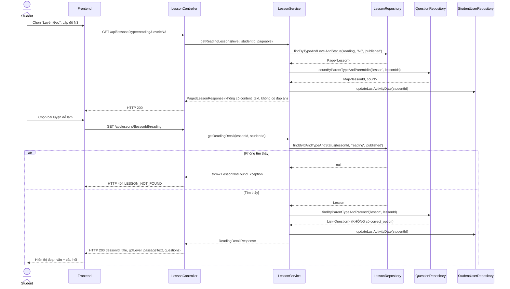
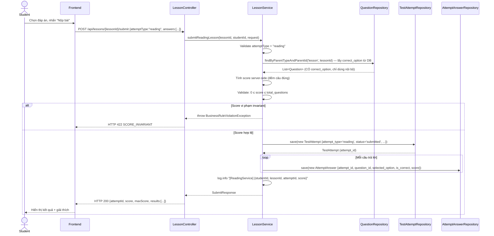

# UC-14 — Luyện Đọc Hiểu (Reading Practice)

> **Feature:** `feat-reading-listening` | **Phiên bản:** 1.0 | **Trạng thái:** Draft
> **Tham chiếu FR:** FR-RL-01, FR-RL-02, FR-RL-03, FR-RL-04, FR-RL-05, FR-RL-20, FR-RL-21, FR-RL-22, FR-RL-23
> **Cập nhật:** 2026-06-17

---

## 1. Tổng Quan

| Thuộc tính | Nội dung |
|:---|:---|
| **Mã Use Case** | UC-14 |
| **Tên** | Luyện Đọc Hiểu (Reading Practice) |
| **Tác nhân chính** | Student — học viên đã đăng nhập |
| **Mô tả ngắn** | Học viên chọn bài luyện đọc theo cấp độ JLPT, đọc đoạn văn tiếng Nhật, trả lời câu hỏi trắc nghiệm, nhận điểm và phản hồi tức thì |
| **Độ ưu tiên** | Cao (P1) — đọc hiểu chiếm ~1/3 điểm JLPT |

---

## 2. Tác Nhân & Điều Kiện

### 2.1 Tác Nhân

| Tác nhân | Vai trò |
|:---|:---|
| **Student** | Xem danh sách bài luyện, đọc đoạn văn, trả lời câu hỏi, nộp bài |
| **Staff** | Tạo/duyệt bài luyện đọc — ngoài phạm vi (xem `feat-content-management`, `feat-content-review`) |

### 2.2 Điều Kiện Tiền Quyết (Preconditions)

- Student đã đăng nhập (JWT hợp lệ), `student_users.status = 'active'`
- Tồn tại ít nhất một `lessons` với `lesson_type = 'reading'`, `status = 'published'` ở cấp độ được chọn

### 2.3 Hậu Điều Kiện (Postconditions)

- **Thành công (lấy danh sách/chi tiết):** Trả đúng danh sách/nội dung bài luyện; cập nhật `student_users.last_activity_date`
- **Thành công (nộp bài):** Tạo bản ghi mới trong `test_attempts` (`attempt_type = 'reading'`, `status = 'submitted'`) và các bản ghi trong `attempt_answers`; trả về điểm số + kết quả từng câu
- **Thất bại:** Không có thay đổi dữ liệu; trả lỗi tương ứng (400/401/403/404/422/500)

---

## 3. Luồng Xử Lý

### 3.1 Luồng Chính — Làm Bài Luyện Đọc (Happy Path)

```
Bước 1  [Student]:   Vào trang "Luyện Đọc", chọn cấp độ JLPT (VD: N3)
Bước 2  [Frontend]:  GET /api/lessons?type=reading&level=N3&page=0&size=10
Bước 3  [Backend]:   Validate JWT; query lessons WHERE lesson_type='reading' AND jlpt_level='N3' AND status='published'
Bước 4  [Backend]:   Tính questionCount từ question_assignments; xác định hasAttempted của student hiện tại
Bước 5  [Backend]:   Cập nhật student_users.last_activity_date = NOW()
Bước 6  [Backend]:   Trả danh sách phân trang (không bao gồm content_text, không lộ đáp án)
Bước 7  [Student]:   Chọn một bài luyện để bắt đầu
Bước 8  [Frontend]:  GET /api/lessons/{lessonId}/reading
Bước 9  [Backend]:   Validate lessonId tồn tại và status='published'; validate lesson_type='reading'
Bước 10 [Backend]:   Lấy đoạn văn (content_text) và danh sách câu hỏi từ question_assignments
                      KHÔNG trả về correct_option, correct_answer_text trong câu hỏi
Bước 11 [Backend]:   Cập nhật student_users.last_activity_date = NOW()
Bước 12 [Backend]:   Trả về passageText + danh sách questions (không có đáp án đúng)
Bước 13 [Student]:   Đọc đoạn văn, chọn đáp án cho từng câu hỏi, nhấn "Nộp bài"
Bước 14 [Frontend]:  POST /api/lessons/{lessonId}/submit {attemptType: "reading", answers: [...]}
Bước 15 [Backend]:   Validate request: attemptType phải là "reading", answers không rỗng, selectedOption ∈ {A,B,C,D}
Bước 16 [Backend]:   Lấy correct_option từ DB cho từng question_id trong question_assignments của lesson
Bước 17 [Backend]:   Tính score server-side: đếm số câu đúng
Bước 18 [Backend]:   Validate score: 0 ≤ score ≤ total_questions (ném BusinessRuleViolationException nếu vi phạm)
Bước 19 [Backend]:   Tạo bản ghi test_attempts mới {student_id, attempt_type='reading', parent_type='lesson', parent_id=lessonId, total_score, max_score, status='submitted', submitted_at=NOW()}
Bước 20 [Backend]:   Tạo bản ghi attempt_answers cho từng câu {attempt_id, question_id, selected_option, is_correct, score}
Bước 21 [Backend]:   Log: [INFO] [ReadingService] {studentId, lessonId, attemptId, score}
Bước 22 [Backend]:   Trả về {attemptId, score, maxScore, results: [{questionId, isCorrect, selectedOption, correctOption, explanation}]}
Bước 23 [Student]:   Xem kết quả: điểm số, từng câu đúng/sai, đáp án đúng, giải thích
```

### 3.2 Luồng Phụ — Làm Lại Bài (Attempt Lần 2+)

```
Bước 7  [Student]:   Chọn bài đã làm trước (hasAttempted = true), nhấn "Làm lại"
Bước 8→ [Backend]:   Xử lý như luồng chính — KHÔNG kiểm tra xem đã có attempt chưa
Bước 19 [Backend]:   Tạo bản ghi test_attempts MỚI (không cập nhật bản ghi cũ)
                      → attempt_id mới, khác với attempt_id trước đó
```

### 3.3 Luồng Lỗi — Bài Luyện Không Tồn Tại / Chưa Duyệt

```
Bước 9  [Backend]:   Không tìm thấy lessonId HOẶC status ≠ 'published'
Bước X  [Backend]:   Log: [WARN] [ReadingService] Lesson not found or not published {lessonId, studentId}
Bước X  [Backend]:   Trả về HTTP 404 — LESSON_NOT_FOUND
                      "Bài học không tồn tại"
```

### 3.4 Luồng Lỗi — Dữ Liệu Nộp Bài Không Hợp Lệ

```
Bước 15 [Backend]:   answers rỗng HOẶC selectedOption không thuộc {A,B,C,D} HOẶC questionId không thuộc lesson
Bước X  [Backend]:   Trả về HTTP 400 — VALIDATION_FAILED
                      "Dữ liệu không hợp lệ: {field}"
```

### 3.5 Luồng Lỗi — Vi Phạm Invariant Điểm Số

```
Bước 18 [Backend]:   score < 0 HOẶC score > total_questions (không thể xảy ra bình thường, bảo vệ lớp sâu)
Bước X  [Backend]:   Log: [ERROR] [ReadingService] Score invariant violated {score, maxScore, lessonId}
Bước X  [Backend]:   Ném BusinessRuleViolationException
Bước X  [Backend]:   Trả về HTTP 422 — SCORE_INVARIANT
                      "Điểm số không hợp lệ"
```

---

## 4. Quy Tắc Nghiệp Vụ

| Mã | Quy tắc | Tham chiếu |
|:---|:---|:---|
| BR-14-01 | Chỉ trả lessons có `lesson_type='reading'` VÀ `status='published'` cho Student | FR-RL-01, FR-RL-22 |
| BR-14-02 | `correct_option` và `correct_answer_text` **KHÔNG BAO GIỜ** được trả về trước khi nộp bài | FR-RL-03, NFR-RL-02 |
| BR-14-03 | Điểm số được tính **server-side** từ DB; client không gửi score | FR-RL-04, NFR-RL-03 |
| BR-14-04 | Mỗi lần nộp bài tạo bản ghi `test_attempts` **mới** — không cập nhật bản ghi cũ | FR-RL-04, FR-RL-20, NFR-RL-04 |
| BR-14-05 | `score >= 0` VÀ `score <= total_questions` — vi phạm → ném `BusinessRuleViolationException` | FR-RL-21 |
| BR-14-06 | `student_users.last_activity_date` cập nhật mỗi lần truy cập lesson (xem danh sách + xem chi tiết) | FR-RL-23 |
| BR-14-07 | `attempt_type = 'reading'`, `parent_type = 'lesson'` khi tạo test_attempts | FR-RL-04 |
| BR-14-08 | Sau khi nộp bài, response bao gồm: score, maxScore, per-question results với correctOption + explanation | FR-RL-05 |

---

## 5. Quy Tắc Kiểm Tra Đầu Vào

| Trường | Kiểm tra | Thông báo lỗi nếu sai |
|:---|:---|:---|
| `type` (query param) | Bắt buộc, = `"reading"` | 400 VALIDATION_FAILED |
| `level` (query param) | Tùy chọn; nếu có phải thuộc {N5, N4, N3, N2, N1} | 400 VALIDATION_FAILED |
| `page` / `size` | Số nguyên ≥0 / 1–50 (mặc định 0/10) | Clamp về giá trị hợp lệ |
| `lessonId` (path) | Bắt buộc, tồn tại và status='published' và lesson_type='reading' | 404 LESSON_NOT_FOUND |
| `attemptType` (body) | Bắt buộc, = `"reading"` | 400 VALIDATION_FAILED |
| `answers` (body) | Bắt buộc, không rỗng | 400 VALIDATION_FAILED |
| `answers[].questionId` | Bắt buộc, phải thuộc question_assignments của lesson | 400 VALIDATION_FAILED |
| `answers[].selectedOption` | Tùy chọn (student có thể bỏ trống), nếu có phải ∈ {A, B, C, D} | 400 VALIDATION_FAILED |
| `answers[].answerText` | Tùy chọn, dùng cho câu hỏi fill_blank | — |

---

## 6. Sơ Đồ Tuần Tự (Sequence Diagram)

### 6.1 Lấy Danh Sách & Chi Tiết Bài Luyện Đọc



### 6.2 Nộp Bài Luyện Đọc



---

## 7. Tham Chiếu API

> Xem đặc tả đầy đủ tại [SPEC.md § 6 — API SPEC](./SPEC.md)

| Phương thức | Endpoint | Mô tả |
|:---|:---|:---|
| `GET` | `/api/lessons?type=reading&level={N3}&page=0&size=10` | Danh sách bài luyện đọc theo cấp độ |
| `GET` | `/api/lessons/{lessonId}/reading` | Chi tiết bài luyện: đoạn văn + câu hỏi (không có đáp án) |
| `POST` | `/api/lessons/{lessonId}/submit` | Nộp bài, nhận điểm và phản hồi |

**Request body mẫu — POST /api/lessons/{lessonId}/submit:**

```json
{
  "attemptType": "reading",
  "answers": [
    { "questionId": 101, "selectedOption": "B", "answerText": null },
    { "questionId": 102, "selectedOption": "A", "answerText": null }
  ]
}
```

**Response body mẫu (200):**

```json
{
  "status": 200,
  "message": "Nộp bài thành công",
  "data": {
    "attemptId": 55,
    "score": 4,
    "maxScore": 5,
    "transcriptText": null,
    "results": [
      {
        "questionId": 101,
        "isCorrect": true,
        "selectedOption": "B",
        "correctOption": "B",
        "explanation": "正解はBです。..."
      }
    ]
  }
}
```

---

## 8. Tiêu Chí Chấp Nhận (Acceptance Criteria)

### AC-14-01 — Lấy danh sách bài luyện đọc đúng cấp độ, không có draft

> **Tham chiếu:** FR-RL-01, FR-RL-22, AC-RL-01, AC-RL-07

- **Cho trước:** Có 3 lessons N3 `published` và 1 lesson N3 `draft`
- **Khi:** `GET /api/lessons?type=reading&level=N3`
- **Thì:**
  - HTTP 200
  - `data.content` có đúng 3 phần tử (không có bài `draft`)
  - Mỗi phần tử có `lessonId`, `title`, `lessonType='reading'`, `jlptLevel='N3'`, `questionCount`, `hasAttempted`
  - Không có trường `correct_option` hoặc `content_text`

---

### AC-14-02 — Đáp án đúng không lộ trong chi tiết bài luyện

> **Tham chiếu:** FR-RL-02, FR-RL-03, NFR-RL-02, AC-RL-02

- **Cho trước:** Lesson `published` tồn tại với 5 câu hỏi có đáp án đúng trong DB
- **Khi:** `GET /api/lessons/{lessonId}/reading`
- **Thì:**
  - HTTP 200
  - Response có `passageText`, `questions[]`
  - Mỗi question có `questionId`, `content`, `optionA–D`, `displayOrder`
  - **KHÔNG** có trường `correctOption`, `correctAnswerText`, `explanation` trong questions

---

### AC-14-03 — Tính điểm đúng khi nộp bài

> **Tham chiếu:** FR-RL-04, FR-RL-05, AC-RL-03

- **Cho trước:** Lesson có 5 câu; student trả lời đúng 4 câu
- **Khi:** `POST /api/lessons/{lessonId}/submit` với `attemptType="reading"` và 5 answers
- **Thì:**
  - HTTP 200
  - `data.score = 4`, `data.maxScore = 5`
  - `data.results` có 5 phần tử, `isCorrect` đúng cho từng câu
  - `data.results[].correctOption` được trả về
  - `data.results[].explanation` được trả về (có thể null nếu không có)

---

### AC-14-04 — Tạo attempt mới mỗi lần nộp bài

> **Tham chiếu:** FR-RL-20, NFR-RL-04, AC-RL-04

- **Cho trước:** Student đã có 1 attempt cho lesson này
- **Khi:** `POST /api/lessons/{lessonId}/submit` lần 2
- **Thì:**
  - HTTP 200
  - `data.attemptId` là ID mới (khác với attempt trước)
  - Bản ghi attempt cũ **không bị cập nhật** trong DB
  - Tổng số bản ghi `test_attempts` cho cặp (student_id, parent_id) tăng lên 1

---

### AC-14-05 — Bài chưa duyệt không hiển thị

> **Tham chiếu:** FR-RL-22, AC-RL-07

- **Cho trước:** Lesson tồn tại với `status = 'draft'`
- **Khi:** `GET /api/lessons/{lessonId}/reading`
- **Thì:**
  - HTTP 404
  - `error_code = "LESSON_NOT_FOUND"`

---

### AC-14-06 — Cập nhật last_activity_date khi truy cập

> **Tham chiếu:** FR-RL-23

- **Cho trước:** `student_users.last_activity_date` = ngày hôm qua
- **Khi:** `GET /api/lessons?type=reading&level=N3`
- **Thì:** `student_users.last_activity_date` trong DB = NOW() (ngày hôm nay)

---

## 9. Ngoài Phạm Vi (Out of Scope)

- ❌ CRUD bài luyện đọc (tạo/sửa/xóa/duyệt) — xem `feat-content-management`, `feat-content-review`
- ❌ Thi thử JLPT đầy đủ — xem `feat-assessment` (UC-10)
- ❌ AI chấm bài reading — xem `feat-ai-skills`
- ❌ Lưu trạng thái làm bài dở (save draft) — không áp dụng cho reading practice
- ❌ Luyện nghe (audio) — xem UC-15
