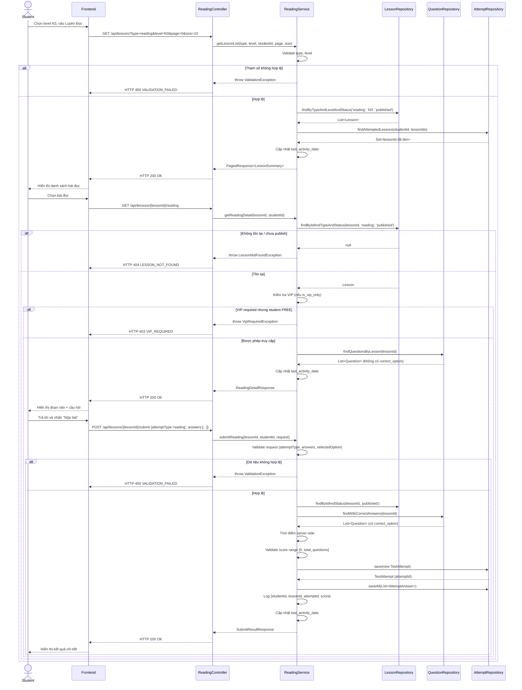

# UC-14 — Luyện Đọc Hiểu (Reading Practice)

> **Feature:** `feat-reading-listening` | **Phiên bản:** 1.0 | **Trạng thái:** Draft
> **Tham chiếu FR:** FR-RL-01, FR-RL-02, FR-RL-03, FR-RL-04, FR-RL-05, FR-RL-20, FR-RL-21, FR-RL-22, FR-RL-23
> **Cập nhật:** 2026-06-19

---

## 1. Tổng Quan

| Thuộc tính | Nội dung |
|:---|:---|
| **Mã Use Case** | UC-14 |
| **Tên** | Luyện Đọc Hiểu (Reading Practice) |
| **Tác nhân chính** | Student — học viên đã đăng nhập |
| **Mô tả ngắn** | Học viên chọn bài đọc theo cấp độ JLPT, đọc đoạn văn tiếng Nhật, trả lời câu hỏi trắc nghiệm và nhận kết quả chấm điểm ngay sau khi nộp bài |
| **Độ ưu tiên** | Cao (P1) — Reading chiếm tỉ trọng lớn trong kỳ thi JLPT |

---

## 2. Tác Nhân & Điều Kiện

### 2.1 Tác Nhân

| Tác nhân | Vai trò |
|:---|:---|
| **Student** | Người chủ động làm bài luyện đọc và nộp đáp án |
| **Staff** | Tạo/duyệt nội dung bài đọc — ngoài phạm vi (xem `feat-content-management`, `feat-content-review`) |

### 2.2 Điều Kiện Tiền Quyết (Preconditions)

- Student đã đăng nhập (JWT hợp lệ), `student_users.status = 'active'`
- Tồn tại ít nhất một `lessons` với `lesson_type = 'reading'`, `status = 'published'` ở cấp độ được chọn
- Bài đọc phải có ít nhất một câu hỏi được liên kết qua `question_assignments`

### 2.3 Hậu Điều Kiện (Postconditions)

- **Thành công (xem danh sách/chi tiết):** Danh sách/chi tiết bài đọc trả về đúng `lesson_type='reading'` và `status='published'`; `student_users.last_activity_date` được cập nhật
- **Thành công (nộp bài):** Một bản ghi `test_attempts` MỚI được tạo (`attempt_type='reading'`); bản ghi `attempt_answers` được tạo cho mỗi câu trả lời; điểm được tính server-side và trả về kèm kết quả từng câu
- **Thất bại:** Không có thay đổi dữ liệu; trả lỗi tương ứng (400/401/403/404/422)

---

## 3. Luồng Xử Lý

### 3.1 Luồng Chính — Xem Danh Sách → Chi Tiết → Nộp Bài (Happy Path)

```
Bước 1  [Student]:   Chọn cấp độ JLPT tại trang "Luyện Đọc", nhấn vào tab Reading
Bước 2  [Frontend]:  GET /api/lessons?type=reading&level=N3&page=0&size=10
Bước 3  [Backend]:   Validate type ∈ {reading, listening}; level ∈ {N5,N4,N3,N2,N1}
Bước 4  [Backend]:   Query lessons WHERE lesson_type='reading' AND jlpt_level=level AND status='published'
Bước 5  [Backend]:   LEFT JOIN question_assignments để đếm questionCount
Bước 6  [Backend]:   LEFT JOIN test_attempts theo studentId hiện tại để gắn cờ hasAttempted
Bước 7  [Backend]:   Cập nhật student_users.last_activity_date = NOW()
Bước 8  [Backend]:   Trả HTTP 200 — danh sách phân trang (content, totalElements, totalPages)
Bước 9  [Student]:   Chọn một bài đọc từ danh sách
Bước 10 [Frontend]:  GET /api/lessons/{lessonId}/reading
Bước 11 [Backend]:   Tìm lessons theo lessonId; nếu không tồn tại HOẶC lesson_type≠'reading' HOẶC status≠'published' → 404
Bước 12 [Backend]:   Query question_assignments JOIN questions WHERE parent_type='lesson' AND parent_id=lessonId
Bước 13 [Backend]:   Loại bỏ correct_option, correct_answer_text khỏi payload câu hỏi
Bước 14 [Backend]:   Trả HTTP 200 với passageText (content_text), danh sách câu hỏi (không có đáp án)
Bước 15 [Student]:   Đọc đoạn văn, trả lời từng câu hỏi trắc nghiệm
Bước 16 [Student]:   Nhấn "Nộp bài"
Bước 17 [Frontend]:  POST /api/lessons/{lessonId}/submit với {attemptType:'reading', answers:[...]}
Bước 18 [Backend]:   Validate request: attemptType='reading', answers không rỗng, selectedOption ∈ {A,B,C,D}
Bước 19 [Backend]:   Xác minh lessonId tồn tại + published + type='reading'
Bước 20 [Backend]:   Lấy danh sách question_assignments của lesson kèm correct_option từ DB
Bước 21 [Backend]:   Tính điểm server-side: đối chiếu từng selectedOption với correct_option
Bước 22 [Backend]:   Validate: score >= 0 AND score <= total_questions; nếu vi phạm → throw BusinessRuleViolationException
Bước 23 [Backend]:   Tạo bản ghi test_attempts MỚI {student_id, attempt_type='reading', parent_type='lesson', parent_id=lessonId, total_score, max_score, status='submitted', submitted_at=NOW()}
Bước 24 [Backend]:   Tạo attempt_answers cho mỗi câu {attempt_id, question_id, selected_option, is_correct, score}
Bước 25 [Backend]:   Ghi log: [INFO] [ReadingService] {studentId, lessonId, attemptId, score}
Bước 26 [Backend]:   Cập nhật student_users.last_activity_date = NOW()
Bước 27 [Backend]:   Trả HTTP 200 với attemptId, score, maxScore, results (từng câu: isCorrect, correctOption, explanation)
Bước 28 [Student]:   Xem kết quả chi tiết từng câu, đọc giải thích
```

### 3.2 Luồng Phụ A — Lọc Theo Level / Phân Trang

```
Bước 1 [Student]:   Đổi dropdown level hoặc chuyển trang
Bước 2 [Frontend]:  GET /api/lessons?type=reading&level={level mới}&page={n}&size=10
Bước 3 [Backend]:   Lặp lại Bước 3–8 của luồng chính với tham số mới
```

### 3.3 Luồng Phụ B — Làm Bài Lần Hai (Thêm Attempt)

```
Bước 1 [Student]:   Nhấn "Làm lại" hoặc vào bài đọc đã làm trước đó
Bước 2 [Frontend]:  GET /api/lessons/{lessonId}/reading (tải lại bài)
Bước 3 [Backend]:   Trả bài đọc + câu hỏi như luồng chính (không thay đổi)
Bước 4 [Student]:   Nộp bài
Bước 5 [Backend]:   Tạo bản ghi test_attempts MỚI — KHÔNG cập nhật attempt cũ (immutability rule)
                     hasAttempted = true trong danh sách bài
```

### 3.4 Luồng Lỗi — Bài Đọc Không Tồn Tại / Chưa Duyệt

```
Bước 11→ [Backend]: lessonId không tồn tại HOẶC lesson_type≠'reading' HOẶC status ∈ {draft, pending_review, rejected, archived, deleted}
Bước X   [Backend]: Ghi log: [WARN] [ReadingService] Truy cập lesson không tồn tại {studentId, lessonId}
Bước X   [Backend]: Trả HTTP 404 — LESSON_NOT_FOUND
                    "Bài học không tồn tại"
```

### 3.5 Luồng Lỗi — Request Nộp Bài Không Hợp Lệ

```
Bước 18→ [Backend]: attemptType ≠ 'reading' HOẶC answers rỗng HOẶC selectedOption ∉ {A,B,C,D} HOẶC questionId không hợp lệ
Bước X   [Backend]: Trả HTTP 400 — VALIDATION_FAILED
                    "Dữ liệu không hợp lệ: {field}"
```

### 3.6 Luồng Lỗi — Vi Phạm Bất Biến Điểm Số

```
Bước 22→ [Backend]: score < 0 HOẶC score > total_questions (không bao giờ xảy ra trong logic đúng, nhưng phải guard)
Bước X   [Backend]: Trả HTTP 422 — SCORE_INVARIANT
                    "Điểm số không hợp lệ"
```

### 3.7 Luồng Lỗi — Nội Dung VIP Bị Chặn

```
Bước 11→ [Backend]: lesson.is_vip_only = 1 VÀ Student không có subscription VIP còn hiệu lực
Bước X   [Backend]: Trả HTTP 403 — VIP_REQUIRED
                    "Cần tài khoản VIP"
```

### 3.8 Luồng Lỗi — Thiếu JWT / Token Hết Hạn

```
Bước 2/10/17→ [Backend]: Authorization header thiếu hoặc JWT không hợp lệ/hết hạn
Bước X        [Backend]:  Trả HTTP 401 — UNAUTHORIZED
                           "Yêu cầu đăng nhập"
```

---

## 4. Quy Tắc Nghiệp Vụ

| Mã | Quy tắc | Chi tiết |
|:---|:---|:---|
| BR-14-01 | Chỉ trả `lessons` có `lesson_type='reading'`, `status='published'` cho Student | FR-RL-01, FR-RL-22 |
| BR-14-02 | `correct_option` và `correct_answer_text` **KHÔNG BAO GIỜ** xuất hiện trong response GET bài đọc | FR-RL-03, NFR-RL-02 |
| BR-14-03 | Điểm số **PHẢI** được tính server-side; client **KHÔNG** gửi score | FR-RL-04, NFR-RL-03 |
| BR-14-04 | Mỗi lần nộp bài tạo bản ghi `test_attempts` **MỚI**; không UPDATE bản ghi cũ | FR-RL-04, FR-RL-20, NFR-RL-04 |
| BR-14-05 | `score >= 0` AND `score <= total_questions`; vi phạm → `BusinessRuleViolationException` | FR-RL-21 |
| BR-14-06 | Kết quả trả về bao gồm: tổng điểm, từng câu đúng/sai, đáp án đúng, giải thích | FR-RL-05 |
| BR-14-07 | Mọi lượt truy cập bài đọc cập nhật `student_users.last_activity_date` | FR-RL-23 |
| BR-14-08 | Response luôn theo chuẩn `{ status, message, data }`, không trả Entity JPA trực tiếp | ADR-005 |
| BR-14-09 | Log submission: `[INFO] [ReadingService] {studentId, lessonId, attemptId, score}` | NFR-RL-06 |

---

## 5. Quy Tắc Kiểm Tra Đầu Vào

| Trường | Kiểm tra | Thông báo lỗi nếu sai |
|:---|:---|:---|
| `type` (query) | Bắt buộc, enum {reading, listening} | "Dữ liệu không hợp lệ: type" (400) |
| `level` (query) | Bắt buộc, enum {N5,N4,N3,N2,N1} | "Dữ liệu không hợp lệ: level" (400) |
| `page` | Số nguyên ≥ 0, mặc định 0 | Clamp về 0 nếu âm |
| `size` | Số nguyên 1–50, mặc định 10 | Clamp về 50 nếu vượt |
| `lessonId` (path) | Bắt buộc, tồn tại trong DB, `lesson_type='reading'`, `status='published'` | 404 LESSON_NOT_FOUND |
| `attemptType` (body) | Bắt buộc, phải = `"reading"` | "Dữ liệu không hợp lệ: attemptType" (400) |
| `answers` (body) | Bắt buộc, mảng không rỗng | "Dữ liệu không hợp lệ: answers" (400) |
| `answers[].questionId` | Bắt buộc, long, phải thuộc question_assignments của lessonId | "Dữ liệu không hợp lệ: questionId" (400) |
| `answers[].selectedOption` | Bắt buộc, enum {A, B, C, D} | "Dữ liệu không hợp lệ: selectedOption" (400) |
| `answers[].answerText` | Tùy chọn, chuỗi hoặc null | — |

---

## 6. Sơ Đồ Tuần Tự (Sequence Diagram)



---

## 7. Tham Chiếu API

> Xem đặc tả đầy đủ tại [SPEC.md § 6 — API SPEC](./SPEC.md)

| Phương thức | Endpoint | Mô tả |
|:---|:---|:---|
| `GET` | `/api/lessons?type=reading&level=&page=&size=` | Danh sách bài đọc theo level (phân trang) |
| `GET` | `/api/lessons/{lessonId}/reading` | Chi tiết bài đọc: đoạn văn + câu hỏi (không có đáp án) |
| `POST` | `/api/lessons/{lessonId}/submit` | Nộp bài, nhận kết quả chấm điểm |

---

## 8. Tiêu Chí Chấp Nhận (Acceptance Criteria)

### AC-14-01 — Xem danh sách bài đọc theo level

> **Tham chiếu:** FR-RL-01, AC-RL-01

- **Cho trước:** Student đã login; tồn tại 3 reading lessons N3 `published` và 1 bài N3 `draft`
- **Khi:** `GET /api/lessons?type=reading&level=N3`
- **Thì:** HTTP 200; danh sách chỉ chứa 3 bài `published`; bài `draft` không xuất hiện; mỗi phần tử có `questionCount` và `hasAttempted`

---

### AC-14-02 — `correct_option` không bị lộ khi xem bài đọc

> **Tham chiếu:** FR-RL-03, NFR-RL-02, AC-RL-02

- **Cho trước:** Reading lesson tồn tại với câu hỏi có `correct_option = 'B'`
- **Khi:** `GET /api/lessons/{lessonId}/reading`
- **Thì:** HTTP 200; response chứa các trường `optionA/B/C/D` và `content` nhưng **không có** trường `correct_option`, `correct_answer_text`, hay bất kỳ thông tin đáp án nào

---

### AC-14-03 — Đoạn văn đầy đủ và câu hỏi hiển thị đúng

> **Tham chiếu:** FR-RL-02

- **Cho trước:** Reading lesson có `content_text` và 5 câu hỏi trắc nghiệm
- **Khi:** `GET /api/lessons/{lessonId}/reading`
- **Thì:** `passageText` không null; `questions` có đúng 5 phần tử; mỗi câu có `questionId`, `content`, `optionA`, `optionB`, `optionC`, `displayOrder`

---

### AC-14-04 — Nộp bài, tính điểm đúng

> **Tham chiếu:** FR-RL-04, FR-RL-05, AC-RL-03

- **Cho trước:** Reading lesson có 5 câu; Student trả lời đúng 4 câu
- **Khi:** `POST /api/lessons/{lessonId}/submit` với `attemptType='reading'`, 4 đáp án đúng và 1 sai
- **Thì:** HTTP 200; `score = 4`; `maxScore = 5`; `results` có 5 phần tử; câu sai có `isCorrect = false`, `correctOption` đúng là đáp án thực tế từ DB; `explanation` trả về nếu có

---

### AC-14-05 — Tạo attempt mới, không cập nhật attempt cũ

> **Tham chiếu:** FR-RL-04, FR-RL-20, AC-RL-04

- **Cho trước:** Student đã có `attempt_id = 101` cho lesson này
- **Khi:** `POST /api/lessons/{lessonId}/submit` lần 2
- **Thì:** Tạo `attempt_id = 102` mới; attempt 101 vẫn nguyên vẹn trong DB; `hasAttempted = true` trong danh sách bài

---

### AC-14-06 — Bài chưa duyệt bị ẩn

> **Tham chiếu:** FR-RL-22, AC-RL-07

- **Cho trước:** Lesson có `status = 'draft'`
- **Khi:** `GET /api/lessons?type=reading&level=N3`
- **Thì:** Bài đó không xuất hiện trong danh sách

---

### AC-14-07 — Truy cập bài chưa duyệt qua ID bị từ chối

> **Tham chiếu:** FR-RL-22

- **Cho trước:** Lesson có `status = 'draft'`
- **Khi:** `GET /api/lessons/{lessonId}/reading` với ID bài draft
- **Thì:** HTTP 404; `error_code = "LESSON_NOT_FOUND"`

---

### AC-14-08 — Nội dung VIP bị chặn với Student FREE

- **Cho trước:** Reading lesson có `is_vip_only = 1`; Student có subscription FREE
- **Khi:** `GET /api/lessons/{lessonId}/reading`
- **Thì:** HTTP 403; `error_code = "VIP_REQUIRED"`; không có nội dung bài đọc hay câu hỏi trong response

---

### AC-14-09 — Dữ liệu nộp bài không hợp lệ bị từ chối

- **Cho trước:** —
- **Khi:** `POST /api/lessons/{lessonId}/submit` với `selectedOption = 'E'` (không hợp lệ)
- **Thì:** HTTP 400; `error_code = "VALIDATION_FAILED"`; không có bản ghi `test_attempts` nào được tạo

---

### AC-14-10 — Cập nhật last_activity_date

> **Tham chiếu:** FR-RL-23

- **Cho trước:** `student_users.last_activity_date = 2026-06-01`
- **Khi:** Student truy cập danh sách hoặc chi tiết bài đọc
- **Thì:** `student_users.last_activity_date` được cập nhật về thời điểm hiện tại

---

## 9. Ngoài Phạm Vi (Out of Scope)

- ❌ CRUD nội dung bài đọc (tạo/sửa/xóa/duyệt) — xem `feat-content-management`, `feat-content-review`
- ❌ Audio trong bài đọc — UC-14 chỉ là đoạn văn text; audio thuộc UC-15 (Listening)
- ❌ Thi thử JLPT đầy đủ có tính giờ — xem `feat-assessment` UC-10
- ❌ AI chấm bài tự luận — xem `feat-ai-skills`
- ❌ Gợi ý từ vựng/ngữ pháp inline trong bài đọc — Phase 2
