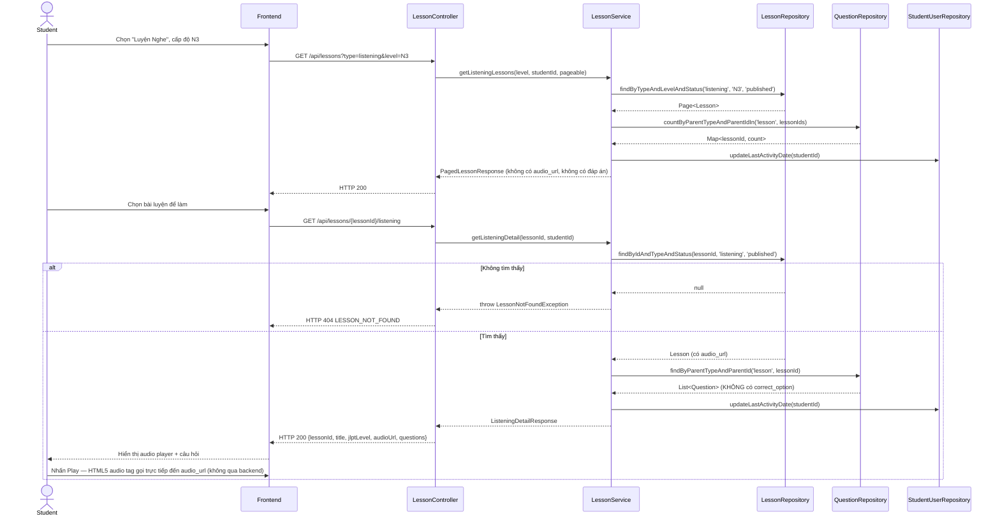
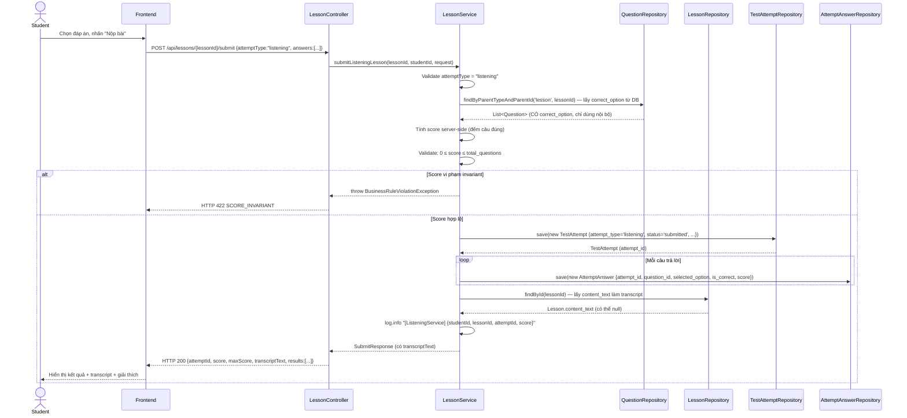

# UC-15 — Luyện Nghe Hiểu (Listening Practice)

> **Feature:** `feat-reading-listening` | **Phiên bản:** 1.0 | **Trạng thái:** Draft
> **Tham chiếu FR:** FR-RL-10, FR-RL-11, FR-RL-12, FR-RL-13, FR-RL-14, FR-RL-15, FR-RL-20, FR-RL-21, FR-RL-22, FR-RL-23
> **Cập nhật:** 2026-06-17

---

## 1. Tổng Quan

| Thuộc tính | Nội dung |
|:---|:---|
| **Mã Use Case** | UC-15 |
| **Tên** | Luyện Nghe Hiểu (Listening Practice) |
| **Tác nhân chính** | Student — học viên đã đăng nhập, có loa/tai nghe |
| **Mô tả ngắn** | Học viên chọn bài luyện nghe theo cấp độ JLPT, nghe audio, trả lời câu hỏi trắc nghiệm, nhận điểm, đáp án đúng và transcript (nếu có) |
| **Độ ưu tiên** | Cao (P1) — nghe hiểu chiếm ~1/3 điểm JLPT |

---

## 2. Tác Nhân & Điều Kiện

### 2.1 Tác Nhân

| Tác nhân | Vai trò |
|:---|:---|
| **Student** | Xem danh sách bài luyện, nghe audio, trả lời câu hỏi, nộp bài |
| **CDN / File Storage** | Phục vụ file audio qua URL (`/uploads` hoặc S3) |
| **Staff** | Tạo/duyệt bài luyện nghe (upload audio, nhập transcript) — ngoài phạm vi (xem `feat-content-management`, `feat-content-review`) |

### 2.2 Điều Kiện Tiền Quyết (Preconditions)

- Student đã đăng nhập (JWT hợp lệ), `student_users.status = 'active'`
- Student có thiết bị phát âm thanh (loa/tai nghe) — điều kiện phía client
- Tồn tại ít nhất một `lessons` với `lesson_type = 'listening'`, `status = 'published'` ở cấp độ được chọn
- File audio đã được upload vào `/uploads` hoặc S3; `lessons.audio_url` chứa URL hợp lệ

### 2.3 Hậu Điều Kiện (Postconditions)

- **Thành công (lấy danh sách/chi tiết):** Trả đúng danh sách/nội dung bài luyện kèm `audio_url`; cập nhật `student_users.last_activity_date`
- **Thành công (nộp bài):** Tạo bản ghi mới trong `test_attempts` (`attempt_type = 'listening'`, `status = 'submitted'`) và các bản ghi trong `attempt_answers`; trả về điểm số + kết quả + transcript
- **Thất bại:** Không có thay đổi dữ liệu; trả lỗi tương ứng (400/401/403/404/422/500)

---

## 3. Luồng Xử Lý

### 3.1 Luồng Chính — Làm Bài Luyện Nghe (Happy Path)

```
Bước 1  [Student]:   Vào trang "Luyện Nghe", chọn cấp độ JLPT (VD: N3)
Bước 2  [Frontend]:  GET /api/lessons?type=listening&level=N3&page=0&size=10
Bước 3  [Backend]:   Validate JWT; query lessons WHERE lesson_type='listening' AND jlpt_level='N3' AND status='published'
Bước 4  [Backend]:   Tính questionCount từ question_assignments; xác định hasAttempted của student hiện tại
Bước 5  [Backend]:   Cập nhật student_users.last_activity_date = NOW()
Bước 6  [Backend]:   Trả danh sách phân trang (KHÔNG bao gồm audio_url, KHÔNG lộ đáp án)
Bước 7  [Student]:   Chọn một bài luyện để bắt đầu
Bước 8  [Frontend]:  GET /api/lessons/{lessonId}/listening
Bước 9  [Backend]:   Validate lessonId tồn tại và status='published'; validate lesson_type='listening'
Bước 10 [Backend]:   Lấy audio_url và danh sách câu hỏi từ question_assignments
                      KHÔNG trả về correct_option, correct_answer_text trong câu hỏi
Bước 11 [Backend]:   Cập nhật student_users.last_activity_date = NOW()
Bước 12 [Backend]:   Trả về {audioUrl, questions} — audioUrl là URL phát được (không phải binary stream)
Bước 13 [Student]:   Nghe audio qua trình phát của browser (play/pause/replay — client-side)
Bước 14 [Student]:   Chọn đáp án cho từng câu hỏi, nhấn "Nộp bài"
Bước 15 [Frontend]:  POST /api/lessons/{lessonId}/submit {attemptType: "listening", answers: [...]}
Bước 16 [Backend]:   Validate request: attemptType phải là "listening", answers không rỗng, selectedOption ∈ {A,B,C,D}
Bước 17 [Backend]:   Lấy correct_option từ DB cho từng question_id trong question_assignments của lesson
Bước 18 [Backend]:   Tính score server-side: đếm số câu đúng
Bước 19 [Backend]:   Validate score: 0 ≤ score ≤ total_questions (ném BusinessRuleViolationException nếu vi phạm)
Bước 20 [Backend]:   Tạo bản ghi test_attempts mới {student_id, attempt_type='listening', parent_type='lesson', parent_id=lessonId, total_score, max_score, status='submitted', submitted_at=NOW()}
Bước 21 [Backend]:   Tạo bản ghi attempt_answers cho từng câu {attempt_id, question_id, selected_option, is_correct, score}
Bước 22 [Backend]:   Lấy content_text từ lesson (dùng làm transcript nếu có)
Bước 23 [Backend]:   Log: [INFO] [ListeningService] {studentId, lessonId, attemptId, score}
Bước 24 [Backend]:   Trả về {attemptId, score, maxScore, transcriptText, results: [{questionId, isCorrect, selectedOption, correctOption, explanation}]}
Bước 25 [Student]:   Xem kết quả: điểm số, từng câu đúng/sai, đáp án đúng, giải thích, transcript
```

### 3.2 Luồng Phụ — Nghe Lại Audio (Trước Khi Nộp)

```
Bước 13 [Student]:   Nhấn "Nghe lại" nhiều lần (không giới hạn)
Bước X  [Frontend]:  Audio tag HTML5 thực hiện replay — KHÔNG gọi thêm API
                      Backend không cần biết student đã nghe bao nhiêu lần
```

> Playback controls (play/pause/replay) là tính năng client-side — xem FR-RL-13.

### 3.3 Luồng Phụ — Làm Lại Bài (Attempt Lần 2+)

```
Bước 7  [Student]:   Chọn bài đã làm trước (hasAttempted = true), nhấn "Làm lại"
Bước 8→ [Backend]:   Xử lý như luồng chính — KHÔNG kiểm tra xem đã có attempt chưa
Bước 20 [Backend]:   Tạo bản ghi test_attempts MỚI (không cập nhật bản ghi cũ)
                      → attempt_id mới, khác với attempt_id trước đó
```

### 3.4 Luồng Lỗi — Bài Luyện Không Tồn Tại / Chưa Duyệt

```
Bước 9  [Backend]:   Không tìm thấy lessonId HOẶC status ≠ 'published'
Bước X  [Backend]:   Log: [WARN] [ListeningService] Lesson not found or not published {lessonId, studentId}
Bước X  [Backend]:   Trả về HTTP 404 — LESSON_NOT_FOUND
                      "Bài học không tồn tại"
```

### 3.5 Luồng Lỗi — Dữ Liệu Nộp Bài Không Hợp Lệ

```
Bước 16 [Backend]:   answers rỗng HOẶC selectedOption không thuộc {A,B,C,D} HOẶC questionId không thuộc lesson
Bước X  [Backend]:   Trả về HTTP 400 — VALIDATION_FAILED
                      "Dữ liệu không hợp lệ: {field}"
```

### 3.6 Luồng Lỗi — Vi Phạm Invariant Điểm Số

```
Bước 19 [Backend]:   score < 0 HOẶC score > total_questions (bảo vệ lớp sâu)
Bước X  [Backend]:   Log: [ERROR] [ListeningService] Score invariant violated {score, maxScore, lessonId}
Bước X  [Backend]:   Ném BusinessRuleViolationException
Bước X  [Backend]:   Trả về HTTP 422 — SCORE_INVARIANT
                      "Điểm số không hợp lệ"
```

---

## 4. Quy Tắc Nghiệp Vụ

| Mã | Quy tắc | Tham chiếu |
|:---|:---|:---|
| BR-15-01 | Chỉ trả lessons có `lesson_type='listening'` VÀ `status='published'` cho Student | FR-RL-10, FR-RL-22 |
| BR-15-02 | `audio_url` trả về là **URL phát được** (HTTP/HTTPS dẫn đến `/uploads` hoặc S3) — backend **KHÔNG** stream binary audio | FR-RL-11, FR-RL-12, ADR-006 |
| BR-15-03 | `correct_option` và `correct_answer_text` **KHÔNG BAO GIỜ** được trả về trước khi nộp bài | FR-RL-11, NFR-RL-02 |
| BR-15-04 | Play/pause/replay audio là **client-side capability** — backend không tracking số lần nghe | FR-RL-13 |
| BR-15-05 | Điểm số được tính **server-side** từ DB; client không gửi score | FR-RL-14, NFR-RL-03 |
| BR-15-06 | Mỗi lần nộp bài tạo bản ghi `test_attempts` **mới** — không cập nhật bản ghi cũ | FR-RL-14, FR-RL-20, NFR-RL-04 |
| BR-15-07 | `score >= 0` VÀ `score <= total_questions` — vi phạm → ném `BusinessRuleViolationException` | FR-RL-21 |
| BR-15-08 | `student_users.last_activity_date` cập nhật mỗi lần truy cập lesson | FR-RL-23 |
| BR-15-09 | `attempt_type = 'listening'`, `parent_type = 'lesson'` khi tạo test_attempts | FR-RL-14 |
| BR-15-10 | `transcriptText` được lấy từ `lessons.content_text` — là nội dung Staff nhập thủ công; có thể null nếu Staff chưa nhập | FR-RL-15 |
| BR-15-11 | Sau khi nộp bài, response bao gồm: score, maxScore, transcriptText (nullable), per-question results với correctOption + explanation | FR-RL-15 |

---

## 5. Quy Tắc Kiểm Tra Đầu Vào

| Trường | Kiểm tra | Thông báo lỗi nếu sai |
|:---|:---|:---|
| `type` (query param) | Bắt buộc, = `"listening"` | 400 VALIDATION_FAILED |
| `level` (query param) | Tùy chọn; nếu có phải thuộc {N5, N4, N3, N2, N1} | 400 VALIDATION_FAILED |
| `page` / `size` | Số nguyên ≥0 / 1–50 (mặc định 0/10) | Clamp về giá trị hợp lệ |
| `lessonId` (path) | Bắt buộc, tồn tại và status='published' và lesson_type='listening' | 404 LESSON_NOT_FOUND |
| `attemptType` (body) | Bắt buộc, = `"listening"` | 400 VALIDATION_FAILED |
| `answers` (body) | Bắt buộc, không rỗng | 400 VALIDATION_FAILED |
| `answers[].questionId` | Bắt buộc, phải thuộc question_assignments của lesson | 400 VALIDATION_FAILED |
| `answers[].selectedOption` | Tùy chọn (student có thể bỏ trống), nếu có phải ∈ {A, B, C, D} | 400 VALIDATION_FAILED |
| `answers[].answerText` | Tùy chọn, dùng cho câu hỏi fill_blank | — |

---

## 6. Sơ Đồ Tuần Tự (Sequence Diagram)

### 6.1 Lấy Danh Sách & Chi Tiết Bài Luyện Nghe



### 6.2 Nộp Bài Luyện Nghe



---

## 7. Tham Chiếu API

> Xem đặc tả đầy đủ tại [SPEC.md § 6 — API SPEC](./SPEC.md)

| Phương thức | Endpoint | Mô tả |
|:---|:---|:---|
| `GET` | `/api/lessons?type=listening&level={N3}&page=0&size=10` | Danh sách bài luyện nghe theo cấp độ |
| `GET` | `/api/lessons/{lessonId}/listening` | Chi tiết bài luyện: audio URL + câu hỏi (không có đáp án) |
| `POST` | `/api/lessons/{lessonId}/submit` | Nộp bài, nhận điểm, kết quả và transcript |

**Request body mẫu — POST /api/lessons/{lessonId}/submit:**
```json
{
  "attemptType": "listening",
  "answers": [
    { "questionId": 201, "selectedOption": "C", "answerText": null },
    { "questionId": 202, "selectedOption": "A", "answerText": null }
  ]
}
```

**Response body mẫu (200):**
```json
{
  "status": 200,
  "message": "Nộp bài thành công",
  "data": {
    "attemptId": 72,
    "score": 3,
    "maxScore": 4,
    "transcriptText": "先週の土曜日、私は友達と映画を見に行きました...",
    "results": [
      {
        "questionId": 201,
        "isCorrect": true,
        "selectedOption": "C",
        "correctOption": "C",
        "explanation": "音声では「先週の土曜日」と言っているので、正解はCです。"
      }
    ]
  }
}
```

---

## 8. Tiêu Chí Chấp Nhận (Acceptance Criteria)

### AC-15-01 — Lấy danh sách bài luyện nghe đúng cấp độ, không có draft

> **Tham chiếu:** FR-RL-10, FR-RL-22, AC-RL-01, AC-RL-07

- **Cho trước:** Có 2 lessons N4 `published` và 1 lesson N4 `draft`
- **Khi:** `GET /api/lessons?type=listening&level=N4`
- **Thì:**
  - HTTP 200
  - `data.content` có đúng 2 phần tử (không có bài `draft`)
  - Mỗi phần tử có `lessonId`, `title`, `lessonType='listening'`, `jlptLevel='N4'`, `questionCount`, `hasAttempted`
  - Không có trường `audioUrl`, `correct_option` trong response này

---

### AC-15-02 — audioUrl là URL hợp lệ, không phải binary stream

> **Tham chiếu:** FR-RL-11, FR-RL-12, NFR-RL-05, AC-RL-05

- **Cho trước:** Lesson `listening` `published` có `audio_url` hợp lệ trong DB
- **Khi:** `GET /api/lessons/{lessonId}/listening`
- **Thì:**
  - HTTP 200
  - `data.audioUrl` là chuỗi URL hợp lệ (bắt đầu bằng `http://` hoặc `https://`)
  - Response body là JSON, **không phải** binary data
  - `data.questions[]` không có trường `correctOption`

---

### AC-15-03 — Đáp án đúng không lộ trong chi tiết bài luyện

> **Tham chiếu:** FR-RL-11, NFR-RL-02, AC-RL-02

- **Cho trước:** Lesson `published` với 4 câu hỏi có đáp án đúng trong DB
- **Khi:** `GET /api/lessons/{lessonId}/listening`
- **Thì:**
  - Mỗi question trong response có `questionId`, `content`, `optionA–D`, `displayOrder`
  - **KHÔNG** có trường `correctOption`, `correctAnswerText`, `explanation` trong questions

---

### AC-15-04 — Tính điểm đúng khi nộp bài và trả về transcript

> **Tham chiếu:** FR-RL-14, FR-RL-15, AC-RL-03, AC-RL-06

- **Cho trước:** Lesson có 4 câu và `content_text` là transcript; student trả lời đúng 3 câu
- **Khi:** `POST /api/lessons/{lessonId}/submit` với `attemptType="listening"` và 4 answers
- **Thì:**
  - HTTP 200
  - `data.score = 3`, `data.maxScore = 4`
  - `data.transcriptText` là nội dung transcript (không null)
  - `data.results` có 4 phần tử, `isCorrect` đúng cho từng câu
  - `data.results[].correctOption` được trả về
  - `data.results[].explanation` được trả về (nullable)

---

### AC-15-05 — Tạo attempt mới mỗi lần nộp bài

> **Tham chiếu:** FR-RL-20, NFR-RL-04, AC-RL-04

- **Cho trước:** Student đã có 1 attempt cho lesson này
- **Khi:** `POST /api/lessons/{lessonId}/submit` lần 2
- **Thì:**
  - HTTP 200
  - `data.attemptId` là ID mới (khác với attempt trước)
  - Bản ghi attempt cũ **không bị cập nhật** trong DB
  - Tổng số bản ghi `test_attempts` cho cặp (student_id, parent_id) tăng lên 1

---

### AC-15-06 — transcriptText là null khi lesson không có transcript

> **Tham chiếu:** FR-RL-15

- **Cho trước:** Lesson `listening` có `content_text = NULL` trong DB
- **Khi:** `POST /api/lessons/{lessonId}/submit`
- **Thì:**
  - HTTP 200
  - `data.transcriptText = null` (không phải chuỗi rỗng, không phải lỗi)

---

### AC-15-07 — Bài chưa duyệt không hiển thị

> **Tham chiếu:** FR-RL-22, AC-RL-07

- **Cho trước:** Lesson tồn tại với `status = 'draft'`
- **Khi:** `GET /api/lessons/{lessonId}/listening`
- **Thì:**
  - HTTP 404
  - `error_code = "LESSON_NOT_FOUND"`

---

### AC-15-08 — Cập nhật last_activity_date khi truy cập

> **Tham chiếu:** FR-RL-23

- **Cho trước:** `student_users.last_activity_date` = ngày hôm qua
- **Khi:** `GET /api/lessons?type=listening&level=N4`
- **Thì:** `student_users.last_activity_date` trong DB = NOW() (ngày hôm nay)

---

## 9. Ngoài Phạm Vi (Out of Scope)

- ❌ Audio streaming trực tiếp từ Spring Boot backend — chỉ trả URL (FR-RL-12)
- ❌ Playback controls tốc độ âm thanh (0.5x/1.5x/2x) — client-side feature (FR-RL-13)
- ❌ Transcript tự động bằng AI (Speech-to-Text) — transcript là nội dung Staff nhập thủ công
- ❌ CRUD bài luyện nghe (tạo/sửa/xóa/duyệt, upload audio) — xem `feat-content-management`, `feat-content-review`
- ❌ Thi thử JLPT đầy đủ — xem `feat-assessment` (UC-10)
- ❌ AI chấm bài listening — xem `feat-ai-skills`
- ❌ Luyện đọc (văn bản) — xem UC-14
