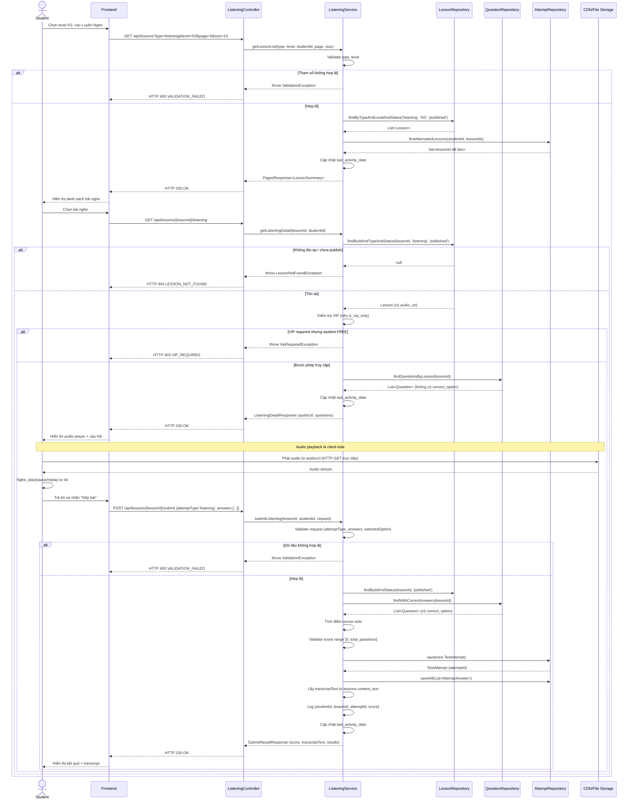

# UC-15 — Luyện Nghe Hiểu (Listening Practice)

> **Feature:** `feat-reading-listening` | **Phiên bản:** 1.0 | **Trạng thái:** Draft
> **Tham chiếu FR:** FR-RL-10, FR-RL-11, FR-RL-12, FR-RL-13, FR-RL-14, FR-RL-15, FR-RL-20, FR-RL-21, FR-RL-22, FR-RL-23
> **Cập nhật:** 2026-06-19

---

## 1. Tổng Quan

| Thuộc tính | Nội dung |
|:---|:---|
| **Mã Use Case** | UC-15 |
| **Tên** | Luyện Nghe Hiểu (Listening Practice) |
| **Tác nhân chính** | Student — học viên đã đăng nhập |
| **Mô tả ngắn** | Học viên chọn bài nghe theo cấp độ JLPT, phát audio, trả lời câu hỏi trắc nghiệm và nhận kết quả kèm transcript sau khi nộp bài |
| **Độ ưu tiên** | Cao (P1) — Listening chiếm tỉ trọng lớn trong kỳ thi JLPT |

---

## 2. Tác Nhân & Điều Kiện

### 2.1 Tác Nhân

| Tác nhân | Vai trò |
|:---|:---|
| **Student** | Người chủ động làm bài nghe và nộp đáp án; cần loa/tai nghe để nghe audio |
| **Staff** | Tạo/duyệt nội dung bài nghe + upload audio — ngoài phạm vi (xem `feat-content-management`, `feat-content-review`) |
| **CDN / File Storage** | Cung cấp URL phát audio (`/uploads` hoặc S3) |

### 2.2 Điều Kiện Tiền Quyết (Preconditions)

- Student đã đăng nhập (JWT hợp lệ), `student_users.status = 'active'`
- Tồn tại ít nhất một `lessons` với `lesson_type = 'listening'`, `status = 'published'` ở cấp độ được chọn
- Bài nghe phải có `audio_url` hợp lệ (URL tới file audio, không phải binary)
- Bài nghe phải có ít nhất một câu hỏi được liên kết qua `question_assignments`

### 2.3 Hậu Điều Kiện (Postconditions)

- **Thành công (xem danh sách/chi tiết):** Danh sách/chi tiết bài nghe trả về đúng `lesson_type='listening'` và `status='published'`; `audio_url` là URL phát được (string, không phải binary); `student_users.last_activity_date` được cập nhật
- **Thành công (nộp bài):** Một bản ghi `test_attempts` MỚI được tạo (`attempt_type='listening'`); bản ghi `attempt_answers` được tạo cho mỗi câu trả lời; điểm tính server-side; `transcriptText` trả về nếu có trong `content_text` của lesson
- **Thất bại:** Không có thay đổi dữ liệu; trả lỗi tương ứng (400/401/403/404/422)

---

## 3. Luồng Xử Lý

### 3.1 Luồng Chính — Xem Danh Sách → Chi Tiết → Nghe Audio → Nộp Bài (Happy Path)

```
Bước 1  [Student]:   Chọn cấp độ JLPT tại trang "Luyện Nghe", nhấn tab Listening
Bước 2  [Frontend]:  GET /api/lessons?type=listening&level=N3&page=0&size=10
Bước 3  [Backend]:   Validate type ∈ {reading, listening}; level ∈ {N5,N4,N3,N2,N1}
Bước 4  [Backend]:   Query lessons WHERE lesson_type='listening' AND jlpt_level=level AND status='published'
Bước 5  [Backend]:   LEFT JOIN question_assignments để đếm questionCount
Bước 6  [Backend]:   LEFT JOIN test_attempts theo studentId hiện tại để gắn cờ hasAttempted
Bước 7  [Backend]:   Cập nhật student_users.last_activity_date = NOW()
Bước 8  [Backend]:   Trả HTTP 200 — danh sách phân trang (content, totalElements, totalPages)
Bước 9  [Student]:   Chọn một bài nghe từ danh sách
Bước 10 [Frontend]:  GET /api/lessons/{lessonId}/listening
Bước 11 [Backend]:   Tìm lessons theo lessonId; nếu không tồn tại HOẶC lesson_type≠'listening' HOẶC status≠'published' → 404
Bước 12 [Backend]:   Lấy audio_url từ bảng lessons (URL tới /uploads hoặc S3 — không streaming trực tiếp)
Bước 13 [Backend]:   Query question_assignments JOIN questions WHERE parent_type='lesson' AND parent_id=lessonId
Bước 14 [Backend]:   Loại bỏ correct_option, correct_answer_text khỏi payload câu hỏi
Bước 15 [Backend]:   Cập nhật student_users.last_activity_date = NOW()
Bước 16 [Backend]:   Trả HTTP 200 với audioUrl (string URL), danh sách câu hỏi (không có đáp án)
Bước 17 [Student]:   Nhận audioUrl, frontend dùng HTML5 <audio> để play/pause/replay (client-side)
Bước 18 [Student]:   Nghe audio, trả lời từng câu hỏi trắc nghiệm
Bước 19 [Student]:   Nhấn "Nộp bài"
Bước 20 [Frontend]:  POST /api/lessons/{lessonId}/submit với {attemptType:'listening', answers:[...]}
Bước 21 [Backend]:   Validate request: attemptType='listening', answers không rỗng, selectedOption ∈ {A,B,C,D}
Bước 22 [Backend]:   Xác minh lessonId tồn tại + published + type='listening'
Bước 23 [Backend]:   Lấy danh sách question_assignments của lesson kèm correct_option từ DB
Bước 24 [Backend]:   Tính điểm server-side: đối chiếu từng selectedOption với correct_option
Bước 25 [Backend]:   Validate: score >= 0 AND score <= total_questions; nếu vi phạm → throw BusinessRuleViolationException
Bước 26 [Backend]:   Tạo bản ghi test_attempts MỚI {student_id, attempt_type='listening', parent_type='lesson', parent_id=lessonId, total_score, max_score, status='submitted', submitted_at=NOW()}
Bước 27 [Backend]:   Tạo attempt_answers cho mỗi câu {attempt_id, question_id, selected_option, is_correct, score}
Bước 28 [Backend]:   Lấy transcriptText từ lessons.content_text (nếu có)
Bước 29 [Backend]:   Ghi log: [INFO] [ListeningService] {studentId, lessonId, attemptId, score}
Bước 30 [Backend]:   Cập nhật student_users.last_activity_date = NOW()
Bước 31 [Backend]:   Trả HTTP 200 với attemptId, score, maxScore, transcriptText, results (từng câu: isCorrect, correctOption, explanation)
Bước 32 [Student]:   Xem kết quả chi tiết, đọc transcript, đọc giải thích từng câu
```

### 3.2 Luồng Phụ A — Lọc Theo Level / Phân Trang

```
Bước 1 [Student]:   Đổi dropdown level hoặc chuyển trang
Bước 2 [Frontend]:  GET /api/lessons?type=listening&level={level mới}&page={n}&size=10
Bước 3 [Backend]:   Lặp lại Bước 3–8 của luồng chính với tham số mới
```

### 3.3 Luồng Phụ B — Phát Lại Audio

```
Bước 1 [Student]:   Nhấn replay trong audio player
Bước 2 [Frontend]:  HTML5 audio element tự phát lại từ audioUrl đã nhận — KHÔNG gọi thêm API
Bước 3 [Backend]:   Không xử lý gì (client-side feature)
```

### 3.4 Luồng Phụ C — Làm Bài Lần Hai (Thêm Attempt)

```
Bước 1 [Student]:   Nhấn "Làm lại" hoặc vào bài nghe đã làm trước đó
Bước 2 [Frontend]:  GET /api/lessons/{lessonId}/listening (tải lại bài)
Bước 3 [Backend]:   Trả bài nghe + audioUrl + câu hỏi như luồng chính (không thay đổi)
Bước 4 [Student]:   Nộp bài
Bước 5 [Backend]:   Tạo bản ghi test_attempts MỚI — KHÔNG cập nhật attempt cũ (immutability rule)
                     hasAttempted = true trong danh sách bài
```

### 3.5 Luồng Lỗi — Bài Nghe Không Tồn Tại / Chưa Duyệt

```
Bước 11→ [Backend]: lessonId không tồn tại HOẶC lesson_type≠'listening' HOẶC status ∈ {draft, pending_review, rejected, archived, deleted}
Bước X   [Backend]: Ghi log: [WARN] [ListeningService] Truy cập lesson không tồn tại {studentId, lessonId}
Bước X   [Backend]: Trả HTTP 404 — LESSON_NOT_FOUND
                    "Bài học không tồn tại"
```

### 3.6 Luồng Lỗi — Request Nộp Bài Không Hợp Lệ

```
Bước 21→ [Backend]: attemptType ≠ 'listening' HOẶC answers rỗng HOẶC selectedOption ∉ {A,B,C,D} HOẶC questionId không hợp lệ
Bước X   [Backend]: Trả HTTP 400 — VALIDATION_FAILED
                    "Dữ liệu không hợp lệ: {field}"
```

### 3.7 Luồng Lỗi — Vi Phạm Bất Biến Điểm Số

```
Bước 25→ [Backend]: score < 0 HOẶC score > total_questions
Bước X   [Backend]: Trả HTTP 422 — SCORE_INVARIANT
                    "Điểm số không hợp lệ"
```

### 3.8 Luồng Lỗi — Nội Dung VIP Bị Chặn

```
Bước 11→ [Backend]: lesson.is_vip_only = 1 VÀ Student không có subscription VIP còn hiệu lực
Bước X   [Backend]: Trả HTTP 403 — VIP_REQUIRED
                    "Cần tài khoản VIP"
```

### 3.9 Luồng Lỗi — Thiếu JWT / Token Hết Hạn

```
Bước 2/10/20→ [Backend]: Authorization header thiếu hoặc JWT không hợp lệ/hết hạn
Bước X         [Backend]: Trả HTTP 401 — UNAUTHORIZED
                           "Yêu cầu đăng nhập"
```

---

## 4. Quy Tắc Nghiệp Vụ

| Mã | Quy tắc | Chi tiết |
|:---|:---|:---|
| BR-15-01 | Chỉ trả `lessons` có `lesson_type='listening'`, `status='published'` cho Student | FR-RL-10, FR-RL-22 |
| BR-15-02 | `correct_option` và `correct_answer_text` **KHÔNG BAO GIỜ** xuất hiện trong response GET bài nghe | FR-RL-11, NFR-RL-02 |
| BR-15-03 | `audio_url` PHẢI là URL string phát được (hosted `/uploads` hoặc S3) — **KHÔNG** trả binary / stream trực tiếp từ Spring Boot | FR-RL-12, ADR-006 |
| BR-15-04 | Play/pause/replay audio là client-side — backend chỉ cung cấp URL, không quản lý playback state | FR-RL-13 |
| BR-15-05 | Điểm số **PHẢI** được tính server-side; client **KHÔNG** gửi score | FR-RL-14, NFR-RL-03 |
| BR-15-06 | Mỗi lần nộp bài tạo bản ghi `test_attempts` **MỚI**; không UPDATE bản ghi cũ | FR-RL-14, FR-RL-20, NFR-RL-04 |
| BR-15-07 | `score >= 0` AND `score <= total_questions`; vi phạm → `BusinessRuleViolationException` | FR-RL-21 |
| BR-15-08 | Kết quả trả về bao gồm: tổng điểm, từng câu đúng/sai, đáp án đúng, giải thích, và `transcriptText` nếu có trong `lessons.content_text` | FR-RL-15 |
| BR-15-09 | Mọi lượt truy cập bài nghe cập nhật `student_users.last_activity_date` | FR-RL-23 |
| BR-15-10 | `transcriptText` là nội dung Staff tạo thủ công (từ `lessons.content_text`) — không AI-generated | FR-RL-15, SPEC Out of Scope |
| BR-15-11 | Response luôn theo chuẩn `{ status, message, data }`, không trả Entity JPA trực tiếp | ADR-005 |
| BR-15-12 | Log submission: `[INFO] [ListeningService] {studentId, lessonId, attemptId, score}` | NFR-RL-06 |

---

## 5. Quy Tắc Kiểm Tra Đầu Vào

| Trường | Kiểm tra | Thông báo lỗi nếu sai |
|:---|:---|:---|
| `type` (query) | Bắt buộc, enum {reading, listening} | "Dữ liệu không hợp lệ: type" (400) |
| `level` (query) | Bắt buộc, enum {N5,N4,N3,N2,N1} | "Dữ liệu không hợp lệ: level" (400) |
| `page` | Số nguyên ≥ 0, mặc định 0 | Clamp về 0 nếu âm |
| `size` | Số nguyên 1–50, mặc định 10 | Clamp về 50 nếu vượt |
| `lessonId` (path) | Bắt buộc, tồn tại trong DB, `lesson_type='listening'`, `status='published'` | 404 LESSON_NOT_FOUND |
| `attemptType` (body) | Bắt buộc, phải = `"listening"` | "Dữ liệu không hợp lệ: attemptType" (400) |
| `answers` (body) | Bắt buộc, mảng không rỗng | "Dữ liệu không hợp lệ: answers" (400) |
| `answers[].questionId` | Bắt buộc, long, phải thuộc question_assignments của lessonId | "Dữ liệu không hợp lệ: questionId" (400) |
| `answers[].selectedOption` | Bắt buộc, enum {A, B, C, D} | "Dữ liệu không hợp lệ: selectedOption" (400) |
| `answers[].answerText` | Tùy chọn, chuỗi hoặc null | — |

---

## 6. Sơ Đồ Tuần Tự (Sequence Diagram)



---

## 7. Tham Chiếu API

> Xem đặc tả đầy đủ tại [SPEC.md § 6 — API SPEC](./SPEC.md)

| Phương thức | Endpoint | Mô tả |
|:---|:---|:---|
| `GET` | `/api/lessons?type=listening&level=&page=&size=` | Danh sách bài nghe theo level (phân trang) |
| `GET` | `/api/lessons/{lessonId}/listening` | Chi tiết bài nghe: audioUrl + câu hỏi (không có đáp án) |
| `POST` | `/api/lessons/{lessonId}/submit` | Nộp bài, nhận kết quả kèm transcript |

---

## 8. Tiêu Chí Chấp Nhận (Acceptance Criteria)

### AC-15-01 — Xem danh sách bài nghe theo level

> **Tham chiếu:** FR-RL-10, AC-RL-01

- **Cho trước:** Student đã login; tồn tại 3 listening lessons N3 `published` và 1 bài N3 `draft`
- **Khi:** `GET /api/lessons?type=listening&level=N3`
- **Thì:** HTTP 200; danh sách chỉ chứa 3 bài `published`; bài `draft` không xuất hiện; mỗi phần tử có `questionCount` và `hasAttempted`

---

### AC-15-02 — audioUrl là URL string hợp lệ, không phải binary

> **Tham chiếu:** FR-RL-12, AC-RL-05

- **Cho trước:** Listening lesson tồn tại với `audio_url = 'https://storage.example.com/audio/n3-01.mp3'`
- **Khi:** `GET /api/lessons/{lessonId}/listening`
- **Thì:** HTTP 200; `audioUrl` trong response là string URL hợp lệ; response body không chứa binary data; Content-Type là `application/json`

---

### AC-15-03 — `correct_option` không bị lộ khi xem bài nghe

> **Tham chiếu:** FR-RL-11, NFR-RL-02, AC-RL-02

- **Cho trước:** Listening lesson tồn tại với câu hỏi có `correct_option = 'C'`
- **Khi:** `GET /api/lessons/{lessonId}/listening`
- **Thì:** HTTP 200; response chứa các trường `optionA/B/C/D` nhưng **không có** trường `correct_option`, `correct_answer_text`, hay bất kỳ thông tin đáp án nào

---

### AC-15-04 — Nộp bài, tính điểm đúng

> **Tham chiếu:** FR-RL-14, FR-RL-15, AC-RL-03

- **Cho trước:** Listening lesson có 5 câu; Student trả lời đúng 3 câu
- **Khi:** `POST /api/lessons/{lessonId}/submit` với `attemptType='listening'`, 3 đáp án đúng và 2 sai
- **Thì:** HTTP 200; `score = 3`; `maxScore = 5`; `results` có 5 phần tử; câu sai có `isCorrect = false`, `correctOption` đúng là đáp án thực tế từ DB; `explanation` trả về nếu có

---

### AC-15-05 — Transcript trả về sau khi nộp bài

> **Tham chiếu:** FR-RL-15, AC-RL-06

- **Cho trước:** Listening lesson có `content_text` chứa transcript
- **Khi:** `POST /api/lessons/{lessonId}/submit`
- **Thì:** HTTP 200; `transcriptText` trong response không null và khớp với `lessons.content_text`

---

### AC-15-06 — transcriptText null nếu lesson không có transcript

> **Tham chiếu:** FR-RL-15

- **Cho trước:** Listening lesson có `content_text = NULL`
- **Khi:** `POST /api/lessons/{lessonId}/submit`
- **Thì:** HTTP 200; `transcriptText = null` trong response; các trường khác bình thường

---

### AC-15-07 — Tạo attempt mới, không cập nhật attempt cũ

> **Tham chiếu:** FR-RL-14, FR-RL-20, AC-RL-04

- **Cho trước:** Student đã có `attempt_id = 201` cho lesson này
- **Khi:** `POST /api/lessons/{lessonId}/submit` lần 2
- **Thì:** Tạo `attempt_id = 202` mới; attempt 201 vẫn nguyên vẹn trong DB; `hasAttempted = true` trong danh sách bài

---

### AC-15-08 — Bài chưa duyệt bị ẩn

> **Tham chiếu:** FR-RL-22, AC-RL-07

- **Cho trước:** Lesson có `status = 'draft'`
- **Khi:** `GET /api/lessons?type=listening&level=N3`
- **Thì:** Bài đó không xuất hiện trong danh sách

---

### AC-15-09 — Truy cập bài chưa duyệt qua ID bị từ chối

> **Tham chiếu:** FR-RL-22

- **Cho trước:** Lesson có `status = 'draft'`
- **Khi:** `GET /api/lessons/{lessonId}/listening` với ID bài draft
- **Thì:** HTTP 404; `error_code = "LESSON_NOT_FOUND"`; không lộ thông tin bài

---

### AC-15-10 — Nội dung VIP bị chặn với Student FREE

- **Cho trước:** Listening lesson có `is_vip_only = 1`; Student có subscription FREE
- **Khi:** `GET /api/lessons/{lessonId}/listening`
- **Thì:** HTTP 403; `error_code = "VIP_REQUIRED"`; không có `audioUrl` hay câu hỏi trong response

---

### AC-15-11 — Dữ liệu nộp bài không hợp lệ bị từ chối

- **Cho trước:** —
- **Khi:** `POST /api/lessons/{lessonId}/submit` với `attemptType = 'reading'` (sai loại) cho listening lesson
- **Thì:** HTTP 400; `error_code = "VALIDATION_FAILED"`; không có bản ghi `test_attempts` nào được tạo

---

### AC-15-12 — Cập nhật last_activity_date

> **Tham chiếu:** FR-RL-23

- **Cho trước:** `student_users.last_activity_date = 2026-06-01`
- **Khi:** Student truy cập danh sách hoặc chi tiết bài nghe
- **Thì:** `student_users.last_activity_date` được cập nhật về thời điểm hiện tại

---

## 9. Ngoài Phạm Vi (Out of Scope)

- ❌ Audio streaming trực tiếp từ Spring Boot backend — backend chỉ trả URL
- ❌ Kiểm soát tốc độ phát audio (0.75x, 1.5x) — client-side feature
- ❌ Transcript tự động bằng AI — transcript là nội dung Staff tạo thủ công
- ❌ CRUD nội dung bài nghe / upload audio — xem `feat-content-management`, `feat-content-review`
- ❌ Thi thử JLPT đầy đủ có tính giờ — xem `feat-assessment` UC-10
- ❌ AI chấm bài tự luận — xem `feat-ai-skills`
- ❌ Lưu vị trí phát audio (resume playback) — Phase 2
