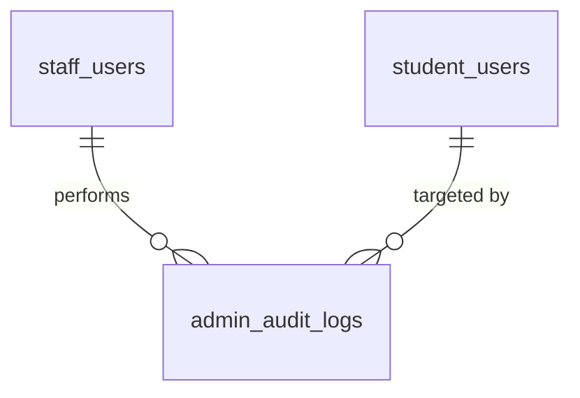

# SPEC — Student Management (Staff Role)
> **Feature ID:** `feat-student-management`
> **UC Coverage:** UC-21 (View Student Progress), UC-22 (Manage Student Accounts), UC-23 (Suspend or Activate Account)
> **Version:** 1.0 | **Status:** Draft
> **Author:** Team | **Last Updated:** 2026-05-28

---

## 1. CONTEXT & GOAL

### 1.1 Bối cảnh
Để đảm bảo môi trường học tập lành mạnh và hỗ trợ học viên kịp thời, các Nhân viên hỗ trợ (Staff) cần có các công cụ giám sát tiến độ và quản lý tài khoản học viên. Nếu phát hiện học viên vi phạm quy chế hoặc gian lận, Nhân viên phải có khả năng đình chỉ tài khoản ngay lập tức.

### 1.2 Mục tiêu
- **Xem tiến độ học viên (UC-21):** Cho phép Staff tra cứu và xem báo cáo tiến trình học tập chi tiết của từng Student để hỗ trợ học tập trực tiếp.
- **Quản lý danh sách tài khoản (UC-22):** Hỗ trợ tìm kiếm, lọc danh sách tài khoản Student theo trạng thái (`active`, `suspended`, `pending`, `deleted`) và cấp độ JLPT.
- **Khóa/Mở tài khoản (UC-23):** Cấp quyền cho Staff đình chỉ (suspend) tài khoản Student vi phạm (bắt buộc điền lý do) và tự động đăng xuất Student khỏi mọi thiết bị. Cho phép kích hoạt lại khi hết hạn kỷ luật.

### 1.3 Tại sao cần?
Không có sự quản lý của Staff $\rightarrow$ không thể xử lý các trường hợp spam bài đăng, gian lận làm đề thi hoặc các hành vi vi phạm điều khoản sử dụng. Việc ngắt toàn bộ phiên làm việc tức thì khi khóa tài khoản là yêu cầu bảo mật bắt buộc để ngăn chặn truy cập trái phép.

---

## 2. ACTOR

| Actor | Role | Điều kiện tiền quyết |
|:---|:---|:---|
| **Staff** | Quản lý tài khoản, theo dõi tiến độ, khóa/mở khóa tài khoản học viên | Đã đăng nhập với vai trò Staff/StaffManager, status = `active` |

---

## 3. FUNCTIONAL REQUIREMENTS (EARS)

### 3.1 UC-21 & UC-22 — Quản lý & Xem Tiến độ Học viên

| ID | EARS Requirement |
|:---|:---|
| FR-STUDENT-01 | WHEN a Staff requests the student list, THE SYSTEM SHALL display paginated student records from `student_users` with options to filter by `status` and `current_jlpt_level`. |
| FR-STUDENT-02 | WHEN a Staff selects a student, THE SYSTEM SHALL display a comprehensive profile containing contact info, streak status, active study progress counts, and their highest/average exam scores. |
| FR-STUDENT-03 | THE SYSTEM SHALL NOT allow Staff to modify any student's private credentials (such as password_hash or OAuth provider linking). |

### 3.2 UC-23 — Tạm khóa & Kích hoạt lại tài khoản (Suspend/Activate Account)

| ID | EARS Requirement |
|:---|:---|
| FR-STUDENT-10 | WHEN a Staff suspends a student account, THE SYSTEM SHALL: (1) set `student_users.status = 'suspended'`, (2) record the `suspend_reason`, (3) revoke all corresponding session tokens in `auth_tokens` setting `revoked_at = SYSUTCDATETIME()`, and (4) log the action to `admin_audit_logs`. |
| FR-STUDENT-11 | IF a suspended Student attempts to access any API endpoint, THEN THE SYSTEM SHALL reject the request with HTTP 403 Forbidden and return the suspension reason. |
| FR-STUDENT-12 | WHEN a Staff activates a suspended student account, THE SYSTEM SHALL update `student_users.status = 'active'`, clear `suspend_reason`, log the action to `admin_audit_logs`, and allow new login sessions. |
| FR-STUDENT-13 | THE SYSTEM SHALL enforce that a suspension request must contain a non-empty `suspend_reason` with a length between 10 and 500 characters. |

---

## 4. NON-FUNCTIONAL REQUIREMENTS

| ID | Category | Requirement |
|:---|:---|:---|
| NFR-STUDENT-01 | Performance | Việc tải danh sách học viên kèm theo lọc kết quả phải dưới 500ms (p95) với cơ sở dữ liệu quy mô 50,000 học viên. |
| NFR-STUDENT-02 | Security (Session Revocation) | Khi khóa tài khoản, việc vô hiệu hóa toàn bộ session token trong `auth_tokens` phải được xử lý ngay lập tức (real-time) và không được cache vượt quá 5 giây ở cấp độ gateway. |
| NFR-STUDENT-03 | Security | Nhân viên (Staff) không bao giờ được phép xem mật khẩu hoặc thay đổi email của học viên trực tiếp. |
| NFR-STUDENT-04 | Logging & Audit | Mọi thao tác khóa/mở khóa tài khoản phải ghi đầy đủ vào `admin_audit_logs` nhằm lưu vết phục vụ công tác thanh kiểm tra của Admin. |

---

## 5. DATA MODEL

### 5.1 Bảng chính

> Nguồn: [`jlpt_database_v2.sql`](file:///d:/Japanese-Skill-Practice-Platform/3.src/infra/Database/jlpt_database_v2.sql)

```sql
-- Bảng 3: student_users
CREATE TABLE student_users (
    student_id           BIGINT IDENTITY(1,1) PRIMARY KEY,
    email                NVARCHAR(255)   NOT NULL UNIQUE,
    password_hash        NVARCHAR(255)   NULL,                       -- NULL for OAuth login
    full_name            NVARCHAR(150)   NOT NULL,
    status               NVARCHAR(20)    NOT NULL DEFAULT 'active'
        CHECK (status IN ('active','suspended','pending','deleted')),
    suspend_reason       NVARCHAR(500)   NULL,
    email_verified_at    DATETIME2       NULL,
    avatar_url           NVARCHAR(500)   NULL,
    phone                NVARCHAR(20)    NULL,
    date_of_birth        DATE            NULL,                       -- UC-04 User Profile
    bio                  NVARCHAR(500)   NULL,                       -- UC-04 User Profile (short bio)

    -- OAuth fields (single identity per student)
    oauth_provider       NVARCHAR(30)    NULL
        CHECK (oauth_provider IN ('google','facebook','apple','github')),
    oauth_provider_id    NVARCHAR(255)   NULL,
    oauth_provider_email NVARCHAR(255)   NULL,                       -- Email returned from OAuth provider
    oauth_linked_at      DATETIME2       NULL,                       -- Timestamp when OAuth was linked

    -- JLPT Level
    current_jlpt_level   NVARCHAR(5)     NULL
        CHECK (current_jlpt_level IN ('N5','N4','N3','N2','N1')),
    target_jlpt_level    NVARCHAR(5)     NULL
        CHECK (target_jlpt_level IN ('N5','N4','N3','N2','N1')),

    -- Study streak statistics
    current_streak       INT             NOT NULL DEFAULT 0,
    longest_streak       INT             NOT NULL DEFAULT 0,
    last_activity_date   DATE            NULL,

    -- Security & Authentication
    login_attempts       INT             NOT NULL DEFAULT 0,
    locked_until         DATETIME2       NULL,
    last_login_at        DATETIME2       NULL,
    last_login_ip        NVARCHAR(45)    NULL,
    password_changed_at  DATETIME2       NULL,

    created_at           DATETIME2       NOT NULL DEFAULT SYSUTCDATETIME(),
    updated_at           DATETIME2       NOT NULL DEFAULT SYSUTCDATETIME()
);

-- Bảng 22: admin_audit_logs
CREATE TABLE admin_audit_logs (
    audit_id        BIGINT IDENTITY(1,1) PRIMARY KEY,
    admin_actor_id  BIGINT          NULL,                       -- Admin who performed action
    staff_actor_id  BIGINT          NULL,                       -- Staff who performed action
    action          NVARCHAR(100)   NOT NULL,                   -- 'create_user','suspend_user','update_setting'...
    target_table    NVARCHAR(100)   NULL,
    target_id       BIGINT          NULL,
    description     NVARCHAR(MAX)   NULL,
    ip_address      NVARCHAR(45)    NULL,
    created_at      DATETIME2       NOT NULL DEFAULT SYSUTCDATETIME(),

    CONSTRAINT FK_audit_admin FOREIGN KEY (admin_actor_id) REFERENCES admin_users(admin_id),
    CONSTRAINT FK_audit_staff FOREIGN KEY (staff_actor_id) REFERENCES staff_users(staff_id),
    CONSTRAINT CK_audit_actor CHECK (
        (admin_actor_id IS NOT NULL AND staff_actor_id IS NULL) OR
        (admin_actor_id IS NULL     AND staff_actor_id IS NOT NULL)
    )
);
```

### 5.2 Quan hệ



---

## 6. API SPEC

### `GET /api/staff/students?q={query}&status={active|suspended}&page=0&size=20`
**Actor:** Staff | **Auth:** Bearer JWT

**Response (200):**
```json
{
  "status": 200,
  "message": "Lấy danh sách học viên thành công",
  "data": {
    "content": [
      {
        "studentId": 12,
        "fullName": "Nguyen Van A",
        "email": "studentA@example.com",
        "status": "active",
        "currentJlptLevel": "N3",
        "createdAt": "2026-05-01T12:00:00Z"
      }
    ],
    "totalElements": 120,
    "totalPages": 6
  }
}
```

---

### `GET /api/staff/students/{studentId}/progress`
**Actor:** Staff | **Auth:** Bearer JWT

**Response (200):**
```json
{
  "status": 200,
  "message": "Lấy chi tiết tiến trình thành công",
  "data": {
    "studentId": 12,
    "fullName": "Nguyen Van A",
    "email": "studentA@example.com",
    "currentStreak": 5,
    "longestStreak": 14,
    "lessonsCompleted": 10,
    "kanjiCompleted": 40,
    "vocabularyCompleted": 95,
    "grammarCompleted": 12,
    "totalExamsTaken": 3,
    "averageExamScore": 135.5
  }
}
```

---

### `POST /api/staff/students/{studentId}/suspend`
**Actor:** Staff | **Auth:** Bearer JWT

**Request:**
```json
{
  "reason": "Sử dụng công cụ hack để tăng điểm số thi thử một cách bất thường."
}
```

**Response (200):**
```json
{
  "status": 200,
  "message": "Đã đình chỉ tài khoản học viên thành công",
  "data": {
    "studentId": 12,
    "status": "suspended",
    "suspendReason": "Sử dụng công cụ hack để tăng điểm số thi thử một cách bất thường.",
    "suspendedAt": "2026-05-28T23:44:00Z"
  }
}
```

---

### `POST /api/staff/students/{studentId}/activate`
**Actor:** Staff | **Auth:** Bearer JWT

**Response (200):**
```json
{
  "status": 200,
  "message": "Đã kích hoạt lại tài khoản thành công",
  "data": {
    "studentId": 12,
    "status": "active",
    "activatedAt": "2026-05-28T23:44:00Z"
  }
}
```

---

## 7. ERROR HANDLING

| HTTP Code | Error Code | Message | Trigger |
|:---:|:---|:---|:---|
| 400 | `VALIDATION_FAILED` | "Lý do khóa phải từ 10 đến 500 ký tự" | Gửi reason quá ngắn hoặc rỗng |
| 401 | `UNAUTHORIZED` | "Yêu cầu đăng nhập" | JWT token thiếu hoặc hết hạn |
| 403 | `FORBIDDEN` | "Tài khoản nhân viên bị đình chỉ hoặc không đủ quyền" | Account không phải Staff / bị suspended |
| 404 | `STUDENT_NOT_FOUND` | "Không tìm thấy tài khoản học viên" | studentId sai lệch |
| 409 | `ALREADY_IN_STATE` | "Tài khoản học viên đã ở trạng thái này rồi" | Khóa tài khoản đã bị khóa hoặc mở tài khoản đã mở |
| 500 | `INTERNAL_ERROR` | "Internal server error" | Lỗi hệ thống CSDL hoặc lỗi hạ tầng |

---

## 8. ACCEPTANCE CRITERIA

| ID | Scenario | Given | When | Then |
|:---|:---|:---|:---|:---|
| AC-STUDENT-01 | Xem tiến độ học tập chi tiết | Học viên Nguyen Van A có lịch sử học tập | GET /progress | Trả về thống kê chính xác khớp với view thống kê |
| AC-STUDENT-02 | Khóa tài khoản thành công | Tài khoản đang `active` | POST /suspend | Status thành `suspended`, phiên đăng nhập cũ bị hủy hoàn toàn |
| AC-STUDENT-03 | Chặn đăng nhập tài khoản bị khóa | Học viên Nguyen Van A bị suspended | GET /api/dictionary/search | API trả về lỗi 403 kèm lý do khóa tài khoản |
| AC-STUDENT-04 | Mở khóa tài khoản thành công | Tài khoản đang `suspended` | POST /activate | Status chuyển sang `active` và cho phép đăng nhập lại bình thường |

---

## OUT OF SCOPE

- ❌ Staff gửi email hỗ trợ trực tiếp từ hòm thư cá nhân của mình — mọi trao đổi email phải đi qua SMTP cấu hình tập trung.
- ❌ Đình chỉ tự động bằng AI hoặc Bot phát hiện gian lận.
