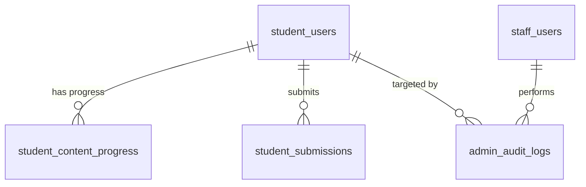

# SPEC — Student Management (Staff Role)
> **Feature ID:** `feat-student-management`
> **UC Coverage:** UC-21 (View Student Progress), UC-22 (Manage Student Accounts), UC-23 (Suspend or Activate Account)
> **Version:** 2.0 | **Status:** Ready for Implementation
> **Author:** Team | **Last Updated:** 2026-06-14

---

## 1. CONTEXT & GOAL

### 1.1 Bối cảnh
Để đảm bảo môi trường học tập lành mạnh và hỗ trợ học viên kịp thời, các Nhân viên hỗ trợ (Staff) cần có các công cụ giám sát tiến độ và quản lý tài khoản học viên. Nếu phát hiện học viên vi phạm quy chế hoặc gian lận, Nhân viên phải có khả năng đình chỉ tài khoản ngay lập tức.

### 1.2 Mục tiêu
- **Xem tiến độ học viên (UC-21):** Cho phép Staff tra cứu và xem báo cáo tiến trình học tập chi tiết của từng Student để hỗ trợ học tập trực tiếp.
- **Quản lý danh sách tài khoản (UC-22):** Hỗ trợ tìm kiếm, lọc danh sách tài khoản Student theo trạng thái (`active`, `suspended`, `pending`, `deleted`) và cấp độ JLPT.
- **Khóa/Mở tài khoản (UC-23):** Cấp quyền cho Staff đình chỉ (suspend) tài khoản Student vi phạm (bắt buộc điền lý do) và tự động đăng xuất Student khỏi mọi thiết bị. Cho phép kích hoạt lại khi hết hạn kỷ luật.

### 1.3 Tại sao cần?
Không có sự quản lý của Staff $\rightarrow$ không thể xử lý các trường hợp spam bài đăng, gian lận làm đề thi hoặc các hành vi vi phạm điều khoản sử dụng. Việc ngắt toàn bộ phiên làm việc tức thì khi khóa tài khoản là yêu cầu bảo mật bắt buộc để ngăn chặn truy cập trái phép.

---

## 2. ACTOR

| Actor | Role | Điều kiện tiền quyết |
|:---|:---|:---|
| **Staff** | Xem danh sách, xem tiến độ học tập, xem bài nộp, khóa/mở tài khoản | Đã đăng nhập với vai trò Staff/StaffManager, status = `active` |
| **Admin** | Tất cả quyền của Staff | Đã đăng nhập Admin, status = `active` |

---

## 3. FUNCTIONAL REQUIREMENTS (EARS)

### 3.1 UC-21 & UC-22 — Quản lý & Xem Tiến độ Học viên

| ID | EARS Requirement |
|:---|:---|
| FR-STUDENT-01 | WHEN a Staff requests the student list, THE SYSTEM SHALL display paginated student records from `student_users` with options to filter by `q` (search name/email), `status`, and `current_jlpt_level`. |
| FR-STUDENT-02 | WHEN a Staff selects a student, THE SYSTEM SHALL display a comprehensive profile containing: contact info, streak stats, `current_jlpt_level`, `target_jlpt_level`, `last_login_at`, and `created_at`. |
| FR-STUDENT-03 | WHEN a Staff views a student's progress detail, THE SYSTEM SHALL return completion counts per content type (`lesson`, `kanji`, `vocabulary`, `grammar`, `kana`) and exam statistics from `student_content_progress` and `test_attempts`. |
| FR-STUDENT-04 | WHEN a Staff views a student's submissions, THE SYSTEM SHALL return a paginated list of `student_submissions` filtered by `submission_type` and `status`, excluding raw AI error details. |
| FR-STUDENT-05 | THE SYSTEM SHALL NOT allow Staff to view or modify any student's `password_hash`, `oauth_provider_id`, or OAuth credentials. |

### 3.2 UC-23 — Tạm khóa & Kích hoạt lại tài khoản (Suspend/Activate Account)

| ID | EARS Requirement |
|:---|:---|
| FR-STUDENT-10 | WHEN a Staff suspends a student account, THE SYSTEM SHALL: (1) set `student_users.status = 'suspended'`, (2) record the `suspend_reason`, (3) revoke all active session tokens in `auth_tokens` by setting `revoked_at = NOW()`, and (4) log the action to `admin_audit_logs` with `staff_actor_id`. |
| FR-STUDENT-11 | IF a suspended Student attempts to access any protected API endpoint, THEN THE SYSTEM SHALL reject the request with HTTP 403 Forbidden. |
| FR-STUDENT-12 | WHEN a Staff activates a suspended student account, THE SYSTEM SHALL update `student_users.status = 'active'`, clear `suspend_reason`, and log the action to `admin_audit_logs`. |
| FR-STUDENT-13 | THE SYSTEM SHALL enforce that a suspension request must contain a non-empty `suspend_reason` with a length between 10 and 500 characters. |
| FR-STUDENT-14 | THE SYSTEM SHALL reject a suspend request if the student is already `suspended`, and reject an activate request if the student is already `active` — returning HTTP 409. |

---

## 4. NON-FUNCTIONAL REQUIREMENTS

| ID | Category | Requirement |
|:---|:---|:---|
| NFR-STUDENT-01 | Performance | Danh sách học viên có filter phải phản hồi dưới 500ms (p95) với dữ liệu 50,000 học viên. |
| NFR-STUDENT-02 | Security (Session Revocation) | Khi khóa tài khoản, vô hiệu hóa toàn bộ session token trong `auth_tokens` phải xử lý real-time trong cùng transaction — không được cache quá 5 giây. |
| NFR-STUDENT-03 | Security | Staff không bao giờ được phép xem `password_hash` hoặc thay đổi email của học viên. |
| NFR-STUDENT-04 | Logging & Audit | Mọi thao tác khóa/mở khóa tài khoản phải ghi đầy đủ vào `admin_audit_logs` với `action`, `target_table = 'student_users'`, `target_id`, `description`, `staff_actor_id`. |

---

## 5. DATA MODEL

### 5.1 Bảng chính

> Nguồn: [`database/init.sql`](../../../../database/init.sql)

```sql
-- Bảng 3: student_users
CREATE TABLE student_users (
    student_id           BIGINT IDENTITY(1,1) PRIMARY KEY,
    email                NVARCHAR(255)   NOT NULL UNIQUE,
    password_hash        NVARCHAR(255)   NULL,
    full_name            NVARCHAR(150)   NOT NULL,
    status               NVARCHAR(20)    NOT NULL DEFAULT 'active'
        CHECK (status IN ('active','suspended','pending','deleted')),
    suspend_reason       NVARCHAR(500)   NULL,
    email_verified_at    DATETIME2       NULL,
    avatar_url           NVARCHAR(500)   NULL,
    phone                NVARCHAR(20)    NULL,
    current_jlpt_level   NVARCHAR(5)     NULL
        CHECK (current_jlpt_level IN ('N5','N4','N3','N2','N1')),
    target_jlpt_level    NVARCHAR(5)     NULL
        CHECK (target_jlpt_level IN ('N5','N4','N3','N2','N1')),
    current_streak       INT             NOT NULL DEFAULT 0,
    longest_streak       INT             NOT NULL DEFAULT 0,
    last_activity_date   DATE            NULL,
    login_attempts       INT             NOT NULL DEFAULT 0,
    locked_until         DATETIME2       NULL,
    last_login_at        DATETIME2       NULL,
    created_at           DATETIME2       NOT NULL DEFAULT SYSUTCDATETIME(),
    updated_at           DATETIME2       NOT NULL DEFAULT SYSUTCDATETIME()
);

-- Bảng 14: student_content_progress (owned by Người 3 — read-only)
CREATE TABLE student_content_progress (
    progress_id      BIGINT IDENTITY(1,1) PRIMARY KEY,
    student_id       BIGINT          NOT NULL,
    content_type     NVARCHAR(30)    NOT NULL
        CHECK (content_type IN ('lesson','vocabulary','kanji','kana','grammar')),
    content_id       BIGINT          NOT NULL,
    status           NVARCHAR(20)    NOT NULL DEFAULT 'learning'
        CHECK (status IN ('learning','completed','reviewing')),
    progress_percent DECIMAL(5,2)    NOT NULL DEFAULT 0,
    completed_at     DATETIME2       NULL,
    last_studied_at  DATETIME2       NOT NULL DEFAULT SYSUTCDATETIME()
);

-- Bảng 22: admin_audit_logs
CREATE TABLE admin_audit_logs (
    audit_id        BIGINT IDENTITY(1,1) PRIMARY KEY,
    admin_actor_id  BIGINT          NULL,
    staff_actor_id  BIGINT          NULL,
    action          NVARCHAR(100)   NOT NULL,
    target_table    NVARCHAR(100)   NULL,
    target_id       BIGINT          NULL,
    description     NVARCHAR(MAX)   NULL,
    ip_address      NVARCHAR(45)    NULL,
    created_at      DATETIME2       NOT NULL DEFAULT SYSUTCDATETIME(),
    CONSTRAINT CK_audit_actor CHECK (
        (admin_actor_id IS NOT NULL AND staff_actor_id IS NULL) OR
        (admin_actor_id IS NULL     AND staff_actor_id IS NOT NULL)
    )
);
```

### 5.2 Quan hệ



---

## 6. FILES CẦN TẠO

| File | Package | Loại | Ghi chú |
|:---|:---|:---|:---|
| `StudentManagementService.java` | `com.jlpt.service` | Service | Mới |
| `StaffStudentController.java` | `com.jlpt.controller.admin` | Controller | Mới |
| `StudentDetailResponse.java` | `com.jlpt.dto.response` | DTO Response | **Mở rộng** file đã có |

**Phụ thuộc inject (read-only từ Người 3):**
- `StudentContentProgressRepository` — chỉ query, không save
- `StudentSubmissionRepository` — chỉ query, không save

---

## 7. SERVICE SPEC

### `StudentManagementService`
**Annotations:** `@Service`, `@RequiredArgsConstructor`, `@Slf4j`

| Method | Signature | Business Logic |
|:---|:---|:---|
| `getStudentList` | `Page<StudentDetailResponse> getStudentList(String q, String status, String jlptLevel, int page, int size)` | Gọi `studentUserRepository.findAllAdminFiltered()`, map sang DTO |
| `getStudentDetail` | `StudentDetailResponse getStudentDetail(Long studentId)` | Load student, throw 404 nếu không có, map sang DTO đầy đủ (không include passwordHash) |
| `getStudentProgressSummary` | `StudentProgressResponse getStudentProgressSummary(Long studentId)` | Query `studentContentProgressRepository` (read-only), group theo contentType, tính completedCount + kanjiCount + vocabCount + examStats |
| `getStudentSubmissions` | `Page<SubmissionSummaryResponse> getStudentSubmissions(Long studentId, String type, String status, int page, int size)` | Query `studentSubmissionRepository` (read-only), trả summary (không expose AI error detail) |
| `suspendStudent` | `@Transactional SuspendUserResponse suspendStudent(String actorEmail, Long studentId, String reason)` | Validate reason [10-500 chars], set status=suspended, revoke auth_tokens, ghi audit log action=`STUDENT_SUSPENDED` |
| `activateStudent` | `@Transactional ActivateUserResponse activateStudent(String actorEmail, Long studentId)` | Validate current status ≠ active (409 nếu đã active), set status=active, clear suspend_reason, ghi audit log action=`STUDENT_ACTIVATED` |

---

## 8. API SPEC

### `GET /api/staff/students`
**Actor:** Staff/Admin | **Auth:** Bearer JWT | **Security:** `@PreAuthorize("hasAnyRole('STAFF','ADMIN')")`

**Query Params:**
- `q` *(optional)*: tìm kiếm theo tên hoặc email
- `status` *(optional)*: `active` | `suspended` | `pending` | `deleted`
- `jlptLevel` *(optional)*: `N5` | `N4` | `N3` | `N2` | `N1`
- `page` *(default=0)*, `size` *(default=20)*

**Response (200):**
```json
{
  "status": 200,
  "message": "Lấy danh sách học viên thành công",
  "data": {
    "content": [
      {
        "studentId": 12,
        "fullName": "Nguyen Van A",
        "email": "studentA@example.com",
        "status": "active",
        "currentJlptLevel": "N3",
        "currentStreak": 5,
        "lastLoginAt": "2026-06-13T10:00:00Z",
        "createdAt": "2026-05-01T12:00:00Z"
      }
    ],
    "totalElements": 120,
    "totalPages": 6
  }
}
```

---

### `GET /api/staff/students/{studentId}`
**Actor:** Staff/Admin | **Auth:** Bearer JWT

**Response (200):**
```json
{
  "status": 200,
  "message": "Lấy thông tin học viên thành công",
  "data": {
    "studentId": 12,
    "fullName": "Nguyen Van A",
    "email": "studentA@example.com",
    "phone": "0901234567",
    "avatarUrl": "https://cdn.example.com/avatars/12.png",
    "status": "active",
    "suspendReason": null,
    "currentJlptLevel": "N3",
    "targetJlptLevel": "N2",
    "currentStreak": 5,
    "longestStreak": 14,
    "lastLoginAt": "2026-06-13T10:00:00Z",
    "createdAt": "2026-05-01T12:00:00Z"
  }
}
```

---

### `GET /api/staff/students/{studentId}/progress`
**Actor:** Staff/Admin | **Auth:** Bearer JWT

**Response (200):**
```json
{
  "status": 200,
  "message": "Lấy chi tiết tiến trình thành công",
  "data": {
    "studentId": 12,
    "fullName": "Nguyen Van A",
    "currentStreak": 5,
    "longestStreak": 14,
    "lastActivityDate": "2026-06-13",
    "completions": {
      "lessons": 10,
      "kanji": 40,
      "vocabulary": 95,
      "grammar": 12,
      "kana": 46
    },
    "totalExamsTaken": 3,
    "averageExamScore": 135.5,
    "highestExamScore": 150.0
  }
}
```

---

### `GET /api/staff/students/{studentId}/submissions`
**Actor:** Staff/Admin | **Auth:** Bearer JWT

**Query Params:**
- `type` *(optional)*: `speaking` | `handwriting`
- `status` *(optional)*: `pending` | `ai_graded` | `graded` | `rejected`
- `page` *(default=0)*, `size` *(default=10)*

**Response (200):**
```json
{
  "status": 200,
  "message": "Lấy danh sách bài nộp thành công",
  "data": {
    "content": [
      {
        "submissionId": 45,
        "submissionType": "speaking",
        "status": "ai_graded",
        "aiOverallScore": 72.50,
        "manualScore": null,
        "finalScore": 72.50,
        "gradedByStaffName": null,
        "submittedAt": "2026-06-12T09:00:00Z"
      }
    ],
    "totalElements": 8,
    "totalPages": 1
  }
}
```

---

### `POST /api/staff/students/{studentId}/suspend`
**Actor:** Staff/Admin | **Auth:** Bearer JWT

**Request:**
```json
{
  "reason": "Sử dụng công cụ hack để tăng điểm số thi thử một cách bất thường."
}
```

**Response (200):**
```json
{
  "status": 200,
  "message": "Đã đình chỉ tài khoản học viên thành công",
  "data": {
    "studentId": 12,
    "status": "suspended",
    "suspendReason": "Sử dụng công cụ hack để tăng điểm số thi thử một cách bất thường.",
    "suspendedAt": "2026-06-14T00:44:00Z"
  }
}
```

---

### `POST /api/staff/students/{studentId}/activate`
**Actor:** Staff/Admin | **Auth:** Bearer JWT

**Response (200):**
```json
{
  "status": 200,
  "message": "Đã kích hoạt lại tài khoản thành công",
  "data": {
    "studentId": 12,
    "status": "active",
    "activatedAt": "2026-06-14T00:44:00Z"
  }
}
```

---

## 9. DTO SPEC

### `StudentDetailResponse` *(mở rộng file đã có)*
```java
// Thêm vào các fields đã có:
private String phone;
private String avatarUrl;
private String targetJlptLevel;
private LocalDate lastActivityDate;
// Giữ nguyên: studentId, fullName, email, status, suspendReason,
//             currentJlptLevel, currentStreak, longestStreak, lastLoginAt, createdAt
```

### `StudentProgressResponse` *(mới)*
```java
Long studentId; String fullName;
Integer currentStreak; Integer longestStreak; LocalDate lastActivityDate;
// completions:
Integer lessonsCompleted; Integer kanjiCompleted; Integer vocabularyCompleted;
Integer grammarCompleted; Integer kanaCompleted;
// exam stats:
Integer totalExamsTaken; BigDecimal averageExamScore; BigDecimal highestExamScore;
```

### `SubmissionSummaryResponse` *(mới — dùng chung với feat-support)*
```java
Long submissionId; String submissionType; String status;
BigDecimal aiOverallScore; BigDecimal manualScore; BigDecimal finalScore;
String gradedByStaffName; LocalDateTime submittedAt;
```

---

## 10. ERROR HANDLING

| HTTP Code | Error Code | Message | Trigger |
|:---:|:---|:---|:---|
| 400 | `VALIDATION_FAILED` | "Lý do khóa phải từ 10 đến 500 ký tự" | suspend_reason quá ngắn hoặc rỗng |
| 401 | `UNAUTHORIZED` | "Yêu cầu đăng nhập" | JWT thiếu hoặc hết hạn |
| 403 | `FORBIDDEN` | "Không đủ quyền thực hiện thao tác này" | Không phải Staff hoặc Admin |
| 404 | `STUDENT_NOT_FOUND` | "Không tìm thấy tài khoản học viên" | studentId không tồn tại |
| 409 | `ALREADY_IN_STATE` | "Tài khoản đã ở trạng thái này rồi" | Khóa tài khoản đã bị khóa hoặc mở tài khoản đã mở |
| 500 | `INTERNAL_ERROR` | "Internal server error" | Lỗi hệ thống CSDL |

---

## 11. ACCEPTANCE CRITERIA

| ID | Scenario | Given | When | Then |
|:---|:---|:---|:---|:---|
| AC-STUDENT-01 | Xem danh sách học viên có filter | Staff đã đăng nhập | GET /staff/students?status=active&jlptLevel=N3 | Trả về danh sách paginated đúng filter |
| AC-STUDENT-02 | Xem tiến độ học tập chi tiết | Học viên đã học nhiều bài | GET /staff/students/{id}/progress | Trả về completions chính xác theo từng content type |
| AC-STUDENT-03 | Khóa tài khoản & revoke session | Tài khoản đang `active` | POST /suspend với reason hợp lệ | Status = `suspended`, auth_tokens bị revoke, audit log được ghi |
| AC-STUDENT-04 | Chặn đăng nhập tài khoản bị khóa | Học viên bị suspended | Gọi bất kỳ protected API | HTTP 403 |
| AC-STUDENT-05 | Mở khóa tài khoản | Tài khoản đang `suspended` | POST /activate | Status = `active`, audit log được ghi |
| AC-STUDENT-06 | Từ chối khóa tài khoản đã bị khóa | Tài khoản đang `suspended` | POST /suspend | HTTP 409 ALREADY_IN_STATE |

---

## OUT OF SCOPE

- ❌ Staff gửi email hỗ trợ trực tiếp từ hòm thư cá nhân — mọi email phải qua SMTP tập trung.
- ❌ Đình chỉ tự động bằng AI hoặc Bot phát hiện gian lận.
- ❌ Staff chỉnh sửa email hoặc mật khẩu học viên — chỉ Admin mới được qua `feat-system-admin`.
