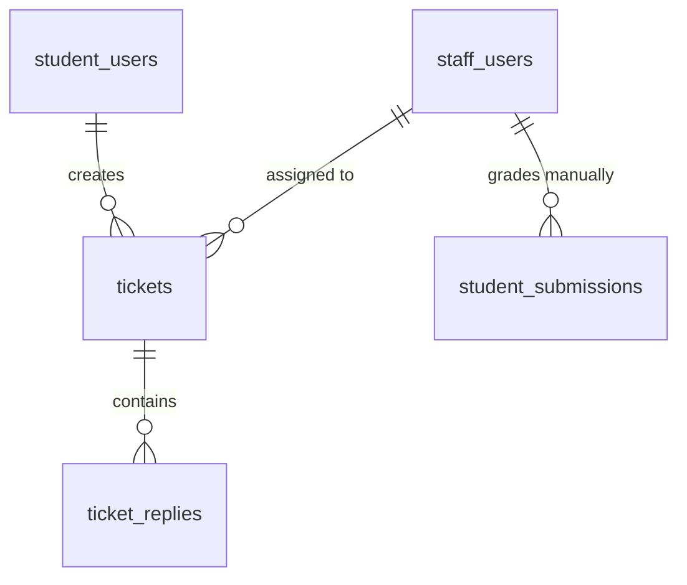

# SPEC — Support, Notifications & Manual Grading (Staff Role)
>
> **Feature ID:** `feat-support`
> **UC Coverage:** UC-29 (Respond to Student Support), UC-30 (Send Notifications), UC-31 (Grade Speaking Submission)
> **Version:** 1.0 | **Status:** Draft
> **Author:** Team | **Last Updated:** 2026-05-28

---

## 1. CONTEXT & GOAL

### 1.1 Bối cảnh

Để đảm bảo trải nghiệm người dùng tối ưu, học viên cần được hỗ trợ kịp thời khi gặp sự cố kỹ thuật hoặc thắc mắc học tập qua hệ thống Ticket. Đồng thời, Nhân viên (Staff) cần có các công cụ để điều phối thông báo hệ thống và thực hiện chấm điểm thủ công đối với các bài nói Speaking mà trí tuệ nhân tạo (AI) chưa thể tự quyết định chính xác 100%.

### 1.2 Mục tiêu

- **Hỗ trợ người dùng (UC-29):** Thiết lập hệ thống Ticket hỗ trợ hai chiều cho phép học viên gửi thắc mắc và Staff theo dõi, phản hồi, thay đổi trạng thái ticket (`open` $\rightarrow$ `in_progress` $\rightarrow$ `resolved` $\rightarrow$ `closed`).
- **Gửi thông báo (UC-30):** Cho phép Staff soạn thảo và gửi thông báo hệ thống (In-app, Email) hướng tới toàn bộ học viên hoặc nhóm học viên được chọn lọc cụ thể theo cấp độ JLPT.
- **Chấm điểm thủ công bài luyện nói (UC-31):** Cho phép Staff nghe bài nộp nói (`student_submissions` với `submission_type = 'speaking'`) của học viên, ghi nhận điểm số thực tế (`manual_score`) và phản hồi chi tiết để ghi đè điểm đề xuất của AI (`ai_overall_score`).

### 1.3 Tại sao cần?

Không có hệ thống ticket $\rightarrow$ yêu cầu hỗ trợ của học viên bị thất lạc và không có chỉ số SLA phản hồi. Không có chấm bài thủ công $\rightarrow$ AI có thể đánh giá sai lệch giọng điệu/âm điệu của học viên mà không có cơ chế sửa đổi, làm giảm tính khách quan của hệ thống chấm điểm kỹ năng.

---

## 2. ACTOR

| Actor | Role | Điều kiện tiền quyết |
|:---|:---|:---|
| **Staff** | Tiếp nhận giải quyết hỗ trợ, gửi thông báo diện rộng, chấm điểm bài luyện nói | Đã đăng nhập vai trò Staff, status = `active` |

---

## 3. FUNCTIONAL REQUIREMENTS (EARS)

### 3.1 UC-29 — Hệ thống Hỗ trợ Học viên (Support Tickets)

| ID | EARS Requirement |
|:---|:---|
| FR-SUPPORT-01 | WHEN a Student submits a support request, THE SYSTEM SHALL create a record in `tickets` with `status = 'open'` and allow the student to attach detailed message text. |
| FR-SUPPORT-02 | WHEN a Staff replies to a ticket, THE SYSTEM SHALL create a `ticket_replies` record, update `tickets.last_reply_at = SYSUTCDATETIME()`, and transition `tickets.status` to `'in_progress'`. |
| FR-SUPPORT-03 | WHEN a Staff resolves a ticket, THE SYSTEM SHALL set `tickets.status = 'resolved'` and `tickets.resolved_at = SYSUTCDATETIME()`. |
| FR-SUPPORT-04 | THE SYSTEM SHALL validate that a ticket reply is sent by either the owner student or an active staff member, rejecting others with HTTP 403. |

### 3.2 UC-30 — Soạn thảo & Gửi thông báo (Notifications)

| ID | EARS Requirement |
|:---|:---|
| FR-SUPPORT-10 | WHEN a Staff sends a manual notification, THE SYSTEM SHALL: (1) create a `notifications` record for each target student, (2) format the communication channels (In-app, Email, or Both), and (3) enqueue the sending task. |
| FR-SUPPORT-11 | IF a notification is scheduled for a future time, THEN THE SYSTEM SHALL set `scheduled_at` and hold processing until the scheduled timestamp is reached. |
| FR-SUPPORT-12 | THE SYSTEM SHALL mark `is_read = 1` and set `read_at = SYSUTCDATETIME()` in `notifications` when the targeted Student opens the notification in the application. |

### 3.3 UC-31 — Chấm điểm & Ghi nhận phản hồi Bài nói (Grade Speaking Submission)

| ID | EARS Requirement |
|:---|:---|
| FR-SUPPORT-20 | WHEN a Staff member grades a speaking submission, THE SYSTEM SHALL set `manual_score`, `manual_feedback`, `graded_by = StaffId`, `graded_at = SYSUTCDATETIME()`, and update `status = 'graded'`. |
| FR-SUPPORT-21 | THE SYSTEM SHALL automatically calculate the `final_score` as `manual_score` (if present) else `ai_overall_score` and update `student_submissions.final_score` correspondingly. |
| FR-SUPPORT-22 | THE SYSTEM SHALL enforce that `manual_score` must be between `0.00` and `100.00` (representing percentage scores). |
| FR-SUPPORT-23 | WHEN a speaking grading is completed, THE SYSTEM SHALL automatically send an in-app notification to the corresponding student. |

---

## 4. NON-FUNCTIONAL REQUIREMENTS

| ID | Category | Requirement |
|:---|:---|:---|
| NFR-SUPPORT-01 | Performance | Trình nghe âm thanh bài nói phải nạp tệp ghi âm dưới 1 giây qua CDN link. |
| NFR-SUPPORT-02 | Reliability | Tác vụ gửi thông báo hàng loạt đến 10,000 học viên phải thực hiện bất đồng bộ (async background job) để không làm block UI của Staff. |
| NFR-SUPPORT-03 | Security | Học viên chỉ được xem và tương tác với các Ticket hỗ trợ của chính họ. |
| NFR-SUPPORT-04 | Security | Mọi hành động gán điểm và nhận xét thủ công bài nộp Speaking phải ghi đầy đủ thông tin định danh của Staff để phục vụ kiểm soát chất lượng giáo viên. |
| NFR-SUPPORT-05 | Logging | Log mọi hành vi gửi thông báo và gán điểm bằng SLF4J. |

---

## 5. DATA MODEL

### 5.1 Bảng chính

> Nguồn: [`jlpt_database_v2.sql`](file:///d:/Japanese-Skill-Practice-Platform/3.src/infra/Database/jlpt_database_v2.sql)

```sql
-- Bảng 18: tickets
CREATE TABLE tickets (
    ticket_id       BIGINT IDENTITY(1,1) PRIMARY KEY,
    student_id      BIGINT          NOT NULL,
    subject         NVARCHAR(255)   NOT NULL,
    content         NVARCHAR(MAX)   NOT NULL,
    category        NVARCHAR(50)    NULL,
    priority        NVARCHAR(20)    NOT NULL DEFAULT 'normal'
        CHECK (priority IN ('low','normal','high','urgent')),
    status          NVARCHAR(20)    NOT NULL DEFAULT 'open'
        CHECK (status IN ('open','in_progress','resolved','closed')),
    assigned_to     BIGINT          NULL,
    last_reply_at   DATETIME2       NULL,
    created_at      DATETIME2       NOT NULL DEFAULT SYSUTCDATETIME(),
    resolved_at     DATETIME2       NULL,
    CONSTRAINT FK_tk_student  FOREIGN KEY (student_id)  REFERENCES student_users(student_id) ON DELETE CASCADE,
    CONSTRAINT FK_tk_assignee FOREIGN KEY (assigned_to) REFERENCES staff_users(staff_id)
);

-- Bảng 19: ticket_replies
CREATE TABLE ticket_replies (
    reply_id           BIGINT IDENTITY(1,1) PRIMARY KEY,
    ticket_id          BIGINT          NOT NULL,
    student_sender_id  BIGINT          NULL,
    staff_sender_id    BIGINT          NULL,
    message            NVARCHAR(MAX)   NOT NULL,
    attachment_url     NVARCHAR(500)   NULL,
    created_at         DATETIME2       NOT NULL DEFAULT SYSUTCDATETIME(),
    CONSTRAINT FK_rep_ticket         FOREIGN KEY (ticket_id)         REFERENCES tickets(ticket_id)      ON DELETE CASCADE,
    CONSTRAINT FK_rep_student_sender FOREIGN KEY (student_sender_id) REFERENCES student_users(student_id),
    CONSTRAINT FK_rep_staff_sender   FOREIGN KEY (staff_sender_id)   REFERENCES staff_users(staff_id),
    CONSTRAINT CK_replies_sender CHECK (
        (student_sender_id IS NOT NULL AND staff_sender_id IS NULL) OR
        (student_sender_id IS NULL     AND staff_sender_id IS NOT NULL)
    )
);

-- Bảng 20: notifications
CREATE TABLE notifications (
    notification_id   BIGINT IDENTITY(1,1) PRIMARY KEY,
    student_id        BIGINT          NOT NULL,
    title             NVARCHAR(255)   NOT NULL,
    content           NVARCHAR(MAX)   NOT NULL,
    notification_type NVARCHAR(30)    NOT NULL DEFAULT 'news'
        CHECK (notification_type IN ('news','warning','promotion','system','achievement','reminder')),
    channel           NVARCHAR(30)    NOT NULL DEFAULT 'in_app'
        CHECK (channel IN ('in_app','email','both')),
    is_auto           BIT             NOT NULL DEFAULT 0,
    rule_key          NVARCHAR(100)   NULL,
    scheduled_at      DATETIME2       NULL,
    sent_at           DATETIME2       NULL,
    is_read           BIT             NOT NULL DEFAULT 0,
    read_at           DATETIME2       NULL,
    delivered_at      DATETIME2       NULL,
    admin_creator_id  BIGINT          NULL,
    staff_creator_id  BIGINT          NULL,
    created_at        DATETIME2       NOT NULL DEFAULT SYSUTCDATETIME(),
    CONSTRAINT FK_noti_student       FOREIGN KEY (student_id)       REFERENCES student_users(student_id) ON DELETE CASCADE,
    CONSTRAINT FK_noti_admin_creator FOREIGN KEY (admin_creator_id) REFERENCES admin_users(admin_id),
    CONSTRAINT FK_noti_staff_creator FOREIGN KEY (staff_creator_id) REFERENCES staff_users(staff_id),
    CONSTRAINT CK_noti_creator CHECK (
        (admin_creator_id IS NOT NULL AND staff_creator_id IS NULL) OR
        (admin_creator_id IS NULL     AND staff_creator_id IS NOT NULL) OR
        (admin_creator_id IS NULL     AND staff_creator_id IS NULL)
    )
);

-- Bảng 15: student_submissions (Speaking & Handwriting)
CREATE TABLE student_submissions (
    submission_id     BIGINT IDENTITY(1,1) PRIMARY KEY,
    student_id        BIGINT          NOT NULL,
    submission_type   NVARCHAR(20)    NOT NULL
        CHECK (submission_type IN ('speaking','handwriting')),
    status            NVARCHAR(20)    NOT NULL DEFAULT 'pending'
        CHECK (status IN ('pending','ai_graded','graded','rejected')),
    exercise_id       BIGINT          NULL,
    recording_url     NVARCHAR(500)   NULL,
    duration_seconds  INT             NULL,
    ai_overall_score        DECIMAL(5,2)  NULL,
    ai_pronunciation_score  DECIMAL(5,2)  NULL,
    ai_fluency_score        DECIMAL(5,2)  NULL,
    ai_highlighted_errors   NVARCHAR(MAX) NULL,
    ai_suggestions          NVARCHAR(MAX) NULL,
    ai_graded_at            DATETIME2     NULL,
    target_type             NVARCHAR(20)  NULL
        CONSTRAINT CK_sub_target_type CHECK (target_type IN ('kanji','kana')),
    kanji_id                BIGINT        NULL,
    kana_id                 INT           NULL,
    handwriting_image_url   NVARCHAR(500) NULL,
    expected_character      NVARCHAR(5)   NULL,
    recognized_character    NVARCHAR(5)   NULL,
    similarity_percent      DECIMAL(5,2)  NULL,
    is_correct              BIT           NULL,
    ocr_processed_at        DATETIME2     NULL,
    final_score             DECIMAL(5,2)  NULL,
    manual_score            DECIMAL(5,2)  NULL,
    manual_feedback         NVARCHAR(MAX) NULL,
    graded_by               BIGINT        NULL,
    graded_at               DATETIME2     NULL,
    submitted_at      DATETIME2       NOT NULL DEFAULT SYSUTCDATETIME(),
    updated_at        DATETIME2       NOT NULL DEFAULT SYSUTCDATETIME(),
    CONSTRAINT FK_sub_student  FOREIGN KEY (student_id)  REFERENCES student_users(student_id) ON DELETE CASCADE,
    CONSTRAINT FK_sub_exercise FOREIGN KEY (exercise_id) REFERENCES lessons(lesson_id),
    CONSTRAINT FK_sub_kanji    FOREIGN KEY (kanji_id)    REFERENCES kanji(kanji_id),
    CONSTRAINT FK_sub_kana     FOREIGN KEY (kana_id)     REFERENCES kana_characters(kana_id),
    CONSTRAINT FK_sub_grader   FOREIGN KEY (graded_by)   REFERENCES staff_users(staff_id)
);
```

### 5.2 Quan hệ



---

## 6. API SPEC

### `POST /api/staff/tickets/{ticketId}/reply`

**Actor:** Staff | **Auth:** Bearer JWT

**Request:**

```json
{
  "message": "Chào bạn, lỗi phát âm trong bài tập Shadowing bài 2 đã được ghi nhận. Bạn vui lòng kiểm tra micro của mình xem đã cấp quyền đầy đủ chưa nhé."
}
```

**Response (200 OK):**

```json
{
  "status": 200,
  "message": "Gửi phản hồi ticket thành công",
  "data": {
    "replyId": 512,
    "createdAt": "2026-05-28T23:44:00Z"
  }
}
```

---

### `POST /api/staff/notifications`

**Actor:** Staff | **Auth:** Bearer JWT

**Request:**

```json
{
  "title": "Bảo trì định kỳ hệ thống tối 29/05",
  "content": "Hệ thống sẽ tiến hành bảo trì từ 23:00 tối mai đến 01:00 sáng ngày kia để nâng cấp cụm AI OCR. Học viên vui lòng không nộp bài luyện viết trong thời gian này.",
  "notificationType": "warning",
  "channel": "both",
  "targetJlptLevel": "N3"
}
```

**Response (201 Created):**

```json
{
  "status": 201,
  "message": "Gửi thông báo thành công",
  "data": {
    "jobId": "job_notification_951"
  }
}
```

---

### `POST /api/staff/submissions/{submissionId}/grade`

**Actor:** Staff | **Auth:** Bearer JWT

**Request:**

```json
{
  "manualScore": 85.50,
  "manualFeedback": "Phát âm từ 'おはよう' rất tốt, tuy nhiên ở cuối câu âm điệu của bạn bị kéo quá dài. Hãy chú ý ngắt âm dứt khoát hơn ở lần sau nhé."
}
```

**Response (200 OK):**

```json
{
  "status": 200,
  "message": "Chấm điểm bài nộp nói thành công",
  "data": {
    "submissionId": 45,
    "status": "graded",
    "finalScore": 85.50,
    "gradedAt": "2026-05-28T23:44:00Z"
  }
}
```

---

## 7. ERROR HANDLING

| HTTP Code | Error Code | Message | Trigger |
|:---:|:---|:---|:---|
| 400 | `VALIDATION_FAILED` | "Điểm số thủ công phải nằm trong khoảng từ 0 đến 100" | manualScore vượt quá [0, 100] |
| 401 | `UNAUTHORIZED` | "Yêu cầu đăng nhập" | JWT token thiếu hoặc hết hạn |
| 403 | `FORBIDDEN` | "Không đủ thẩm quyền xử lý tác vụ này" | Student gọi API của Staff |
| 404 | `TICKET_NOT_FOUND` | "Không tìm thấy ticket yêu cầu" | ticketId không tồn tại |
| 404 | `SUBMISSION_NOT_FOUND` | "Không tìm thấy bài nộp luyện nói" | submissionId không tồn tại hoặc sai lệch |
| 409 | `TICKET_CLOSED` | "Ticket đã đóng, không thể trả lời thêm" | Gửi phản hồi vào ticket có status = 'closed' |
| 500 | `INTERNAL_ERROR` | "Internal server error" | Lỗi hệ thống CSDL |

---

## 8. ACCEPTANCE CRITERIA

| ID | Scenario | Given | When | Then |
|:---|:---|:---|:---|:---|
| AC-SUPPORT-01 | Phản hồi ticket chuyển trạng thái tự động | Ticket đang `open` | POST /tickets/{id}/reply | Lưu trả lời và đặt trạng thái ticket sang `in_progress` |
| AC-SUPPORT-02 | Chấm điểm bài nói thủ công ghi đè AI | Bài nộp nói có điểm AI `70.00` | POST /submissions/{id}/grade với score `85.50` | `final_score` cập nhật thành `85.50` |
| AC-SUPPORT-03 | Gửi thông báo diện rộng async | Soạn thông báo kênh `both` cho 1,000 học viên | POST /notifications | Trả về `jobId` ngay lập tức và xử lý ngầm, gửi email + inapp |

---

## OUT OF SCOPE

- ❌ AI trả lời tự động hỗ trợ (AI Chatbot hỗ trợ kỹ thuật) — toàn bộ phản hồi ticket là thủ công từ Staff.
- ❌ Hủy gỡ các thông báo đã gửi đi thành công tới thiết bị học viên.
