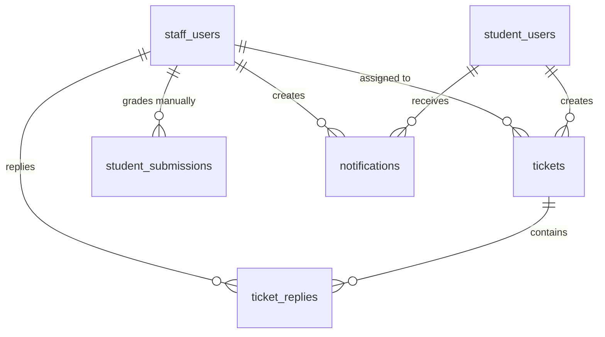

# SPEC — Support, Notifications & Manual Grading (Staff Role)
> **Feature ID:** `feat-support`
> **UC Coverage:** UC-29 (Respond to Student Support), UC-30 (Send Notifications), UC-31 (Grade Speaking Submission)
> **Version:** 2.0 | **Status:** Ready for Implementation
> **Author:** Team | **Last Updated:** 2026-06-14

---

## 1. CONTEXT & GOAL

### 1.1 Bối cảnh
Để đảm bảo trải nghiệm người dùng tối ưu, học viên cần được hỗ trợ kịp thời khi gặp sự cố kỹ thuật hoặc thắc mắc học tập qua hệ thống Ticket. Đồng thời, Nhân viên (Staff) cần có các công cụ để điều phối thông báo hệ thống và thực hiện chấm điểm thủ công đối với các bài nói Speaking mà trí tuệ nhân tạo (AI) chưa thể tự quyết định chính xác 100%.

### 1.2 Mục tiêu
- **Hỗ trợ người dùng (UC-29):** Thiết lập hệ thống Ticket hỗ trợ hai chiều cho phép học viên gửi thắc mắc và Staff theo dõi, phản hồi, thay đổi trạng thái ticket (`open` → `in_progress` → `resolved` → `closed`).
- **Gửi thông báo (UC-30):** Cho phép Staff soạn thảo và gửi thông báo hệ thống (In-app, Email) hướng tới toàn bộ học viên hoặc nhóm học viên được chọn lọc cụ thể theo cấp độ JLPT.
- **Chấm điểm thủ công bài luyện nói (UC-31):** Cho phép Staff nghe bài nộp nói của học viên, ghi nhận điểm số thực tế (`manual_score`) và phản hồi chi tiết để ghi đè điểm đề xuất của AI (`ai_overall_score`), từ đó cập nhật `final_score`.

### 1.3 Tại sao cần?
Không có hệ thống ticket → yêu cầu hỗ trợ của học viên bị thất lạc và không có chỉ số SLA phản hồi. Không có chấm bài thủ công → AI có thể đánh giá sai lệch giọng điệu/âm điệu của học viên mà không có cơ chế sửa đổi.

---

## 2. ACTOR

| Actor | Role | Điều kiện tiền quyết |
|:---|:---|:---|
| **Student** | Tạo ticket, phản hồi ticket của mình, xem thông báo | Đã đăng nhập Student, status = `active` |
| **Staff** | Xem tất cả tickets, phản hồi, đóng ticket, gửi thông báo, chấm điểm bài nộp | Đã đăng nhập Staff, status = `active` |
| **Staff Manager** | Tất cả quyền Staff + assign ticket | Đã đăng nhập với role `staff_manager` |

---

## 3. FUNCTIONAL REQUIREMENTS (EARS)

### 3.1 UC-29 — Hệ thống Hỗ trợ Học viên (Support Tickets)

| ID | EARS Requirement |
|:---|:---|
| FR-SUPPORT-01 | WHEN a Student submits a support request, THE SYSTEM SHALL create a record in `tickets` with `status = 'open'`, `priority = 'normal'` (default), and allow setting `category` and custom `priority`. |
| FR-SUPPORT-02 | WHEN a Staff replies to a ticket, THE SYSTEM SHALL create a `ticket_replies` record, update `tickets.last_reply_at = NOW()`, and transition `tickets.status` to `'in_progress'` if currently `'open'`. |
| FR-SUPPORT-03 | WHEN a Staff closes a ticket, THE SYSTEM SHALL set `tickets.status = 'resolved'` and `tickets.resolved_at = NOW()`. |
| FR-SUPPORT-04 | THE SYSTEM SHALL validate that a ticket reply is sent by either the owner Student OR an active Staff member — rejecting others with HTTP 403. |
| FR-SUPPORT-05 | THE SYSTEM SHALL reject any reply attempt on a ticket with `status = 'closed'` — returning HTTP 409. |
| FR-SUPPORT-06 | WHEN a Staff Manager assigns a ticket, THE SYSTEM SHALL set `tickets.assigned_to = staffId`. |
| FR-SUPPORT-07 | THE SYSTEM SHALL ensure a Student can only view and reply to tickets they created. |

### 3.2 UC-30 — Soạn thảo & Gửi thông báo (Notifications)

| ID | EARS Requirement |
|:---|:---|
| FR-SUPPORT-10 | WHEN a Staff sends a manual notification, THE SYSTEM SHALL: (1) create a `notifications` record for each target student, (2) support channel selection (`in_app`, `email`, `both`), and (3) execute sending asynchronously — returning a `jobId` immediately. |
| FR-SUPPORT-11 | THE SYSTEM SHALL support targeting notifications by `targetJlptLevel` (all students at a level) or broadcast to all `active` students when no level is specified. |
| FR-SUPPORT-12 | THE SYSTEM SHALL mark `is_read = true` and set `read_at = NOW()` in `notifications` when the targeted Student reads the notification. |
| FR-SUPPORT-13 | THE SYSTEM SHALL prevent duplicate milestone notifications: do not send the same `rule_key` notification to a student if one was already sent in the past 24 hours. |
| FR-SUPPORT-14 | WHEN a Student requests their notifications, THE SYSTEM SHALL return a paginated list ordered by `created_at DESC`, and include the count of unread notifications. |

### 3.3 UC-31 — Chấm điểm & Ghi nhận phản hồi Bài nói (Grade Speaking Submission)

| ID | EARS Requirement |
|:---|:---|
| FR-SUPPORT-20 | WHEN a Staff member grades a speaking submission, THE SYSTEM SHALL set `manual_score`, `manual_feedback`, `graded_by = staffId`, `graded_at = NOW()`, and update `status = 'graded'`. |
| FR-SUPPORT-21 | THE SYSTEM SHALL automatically calculate `final_score = manual_score` (if provided) else `ai_overall_score`, and persist `student_submissions.final_score` accordingly. |
| FR-SUPPORT-22 | THE SYSTEM SHALL enforce that `manual_score` must be between `0.00` and `100.00`. |
| FR-SUPPORT-23 | WHEN a speaking grading is completed, THE SYSTEM SHALL automatically send an in-app notification to the corresponding student (type = `achievement`, rule_key = `speaking_graded_{submissionId}`). |
| FR-SUPPORT-24 | THE SYSTEM SHALL only allow grading of submissions with `submission_type = 'speaking'` and `status = 'ai_graded'`. Grading `pending` or `handwriting` submissions must return HTTP 422. |

---

## 4. NON-FUNCTIONAL REQUIREMENTS

| ID | Category | Requirement |
|:---|:---|:---|
| NFR-SUPPORT-01 | Performance | Trình nghe âm thanh bài nói phải nạp tệp ghi âm dưới 1 giây qua CDN link. |
| NFR-SUPPORT-02 | Reliability | Tác vụ gửi thông báo hàng loạt đến 10,000 học viên phải thực hiện bất đồng bộ (async background job) để không block UI của Staff. |
| NFR-SUPPORT-03 | Security | Học viên chỉ được xem và tương tác với các Ticket hỗ trợ của chính họ. |
| NFR-SUPPORT-04 | Security | Mọi hành động gán điểm thủ công bài nộp phải ghi đầy đủ thông tin định danh Staff vào audit log. |
| NFR-SUPPORT-05 | Logging | Log mọi hành vi gửi thông báo và gán điểm bằng SLF4J: `[INFO] Staff {staffId} graded submission {submissionId} score {score}`. |

---

## 5. DATA MODEL

### 5.1 Bảng chính

> Nguồn: [`database/init.sql`](../../../../database/init.sql)

```sql
-- Bảng 18: tickets
CREATE TABLE tickets (
    ticket_id       BIGINT IDENTITY(1,1) PRIMARY KEY,
    student_id      BIGINT          NOT NULL,
    subject         NVARCHAR(255)   NOT NULL,
    content         NVARCHAR(MAX)   NOT NULL,
    category        NVARCHAR(50)    NULL,
    priority        NVARCHAR(20)    NOT NULL DEFAULT 'normal'
        CHECK (priority IN ('low','normal','high','urgent')),
    status          NVARCHAR(20)    NOT NULL DEFAULT 'open'
        CHECK (status IN ('open','in_progress','resolved','closed')),
    assigned_to     BIGINT          NULL,
    last_reply_at   DATETIME2       NULL,
    created_at      DATETIME2       NOT NULL DEFAULT SYSUTCDATETIME(),
    resolved_at     DATETIME2       NULL,
    CONSTRAINT FK_tk_student  FOREIGN KEY (student_id)  REFERENCES student_users(student_id) ON DELETE CASCADE,
    CONSTRAINT FK_tk_assignee FOREIGN KEY (assigned_to) REFERENCES staff_users(staff_id)
);

-- Bảng 19: ticket_replies
CREATE TABLE ticket_replies (
    reply_id           BIGINT IDENTITY(1,1) PRIMARY KEY,
    ticket_id          BIGINT          NOT NULL,
    student_sender_id  BIGINT          NULL,
    staff_sender_id    BIGINT          NULL,
    message            NVARCHAR(MAX)   NOT NULL,
    attachment_url     NVARCHAR(500)   NULL,
    created_at         DATETIME2       NOT NULL DEFAULT SYSUTCDATETIME(),
    CONSTRAINT FK_rep_ticket         FOREIGN KEY (ticket_id)         REFERENCES tickets(ticket_id)      ON DELETE CASCADE,
    CONSTRAINT FK_rep_student_sender FOREIGN KEY (student_sender_id) REFERENCES student_users(student_id),
    CONSTRAINT FK_rep_staff_sender   FOREIGN KEY (staff_sender_id)   REFERENCES staff_users(staff_id),
    CONSTRAINT CK_replies_sender CHECK (
        (student_sender_id IS NOT NULL AND staff_sender_id IS NULL) OR
        (student_sender_id IS NULL     AND staff_sender_id IS NOT NULL)
    )
);

-- Bảng 20: notifications
CREATE TABLE notifications (
    notification_id   BIGINT IDENTITY(1,1) PRIMARY KEY,
    student_id        BIGINT          NOT NULL,
    title             NVARCHAR(255)   NOT NULL,
    content           NVARCHAR(MAX)   NOT NULL,
    notification_type NVARCHAR(30)    NOT NULL DEFAULT 'news'
        CHECK (notification_type IN ('news','warning','promotion','system','achievement','reminder')),
    channel           NVARCHAR(30)    NOT NULL DEFAULT 'in_app'
        CHECK (channel IN ('in_app','email','both')),
    is_auto           BIT             NOT NULL DEFAULT 0,
    rule_key          NVARCHAR(100)   NULL,
    scheduled_at      DATETIME2       NULL,
    sent_at           DATETIME2       NULL,
    is_read           BIT             NOT NULL DEFAULT 0,
    read_at           DATETIME2       NULL,
    delivered_at      DATETIME2       NULL,
    admin_creator_id  BIGINT          NULL,
    staff_creator_id  BIGINT          NULL,
    created_at        DATETIME2       NOT NULL DEFAULT SYSUTCDATETIME(),
    CONSTRAINT FK_noti_student       FOREIGN KEY (student_id)       REFERENCES student_users(student_id) ON DELETE CASCADE,
    CONSTRAINT FK_noti_admin_creator FOREIGN KEY (admin_creator_id) REFERENCES admin_users(admin_id),
    CONSTRAINT FK_noti_staff_creator FOREIGN KEY (staff_creator_id) REFERENCES staff_users(staff_id)
);

-- Bảng 15: student_submissions (final_score field — owned by Người 3, read/update by Người 5)
-- Các cột liên quan đến manual grading:
--   final_score    DECIMAL(5,2) NULL  -- = manual_score ?? ai_overall_score
--   manual_score   DECIMAL(5,2) NULL
--   manual_feedback NVARCHAR(MAX) NULL
--   graded_by      BIGINT NULL  -- FK → staff_users
--   graded_at      DATETIME2 NULL
```

### 5.2 Quan hệ



---

## 6. FILES CẦN TẠO

| File | Package | Loại | Ghi chú |
|:---|:---|:---|:---|
| `TicketRepository.java` | `com.jlpt.repository` | Repository | Mới |
| `TicketReplyRepository.java` | `com.jlpt.repository` | Repository | Mới |
| `NotificationRepository.java` | `com.jlpt.repository` | Repository | Mới |
| `SupportTicketService.java` | `com.jlpt.service` | Service | Mới |
| `SupportController.java` | `com.jlpt.controller.student` | Controller | Mới — student ticket endpoints |
| `StaffTicketController.java` | `com.jlpt.controller.admin` | Controller | Mới — staff ticket + grading endpoints |
| `TicketRequest.java` | `com.jlpt.dto.request` | DTO Request | Mới |
| `TicketReplyRequest.java` | `com.jlpt.dto.request` | DTO Request | Mới |
| `SendNotificationRequest.java` | `com.jlpt.dto.request` | DTO Request | Mới |
| `ManualGradeRequest.java` | `com.jlpt.dto.request` | DTO Request | Mới |
| `TicketResponse.java` | `com.jlpt.dto.response` | DTO Response | Mới |
| `TicketReplyResponse.java` | `com.jlpt.dto.response` | DTO Response | Mới |
| `NotificationResponse.java` | `com.jlpt.dto.response` | DTO Response | Mới |
| `GradeResponse.java` | `com.jlpt.dto.response` | DTO Response | Mới |

**Phụ thuộc inject (read/write từ Người 3):**
- `StudentSubmissionRepository` — đọc để lấy submission, update khi grade (set manual_score, final_score, graded_by, graded_at, status)

---

## 7. SERVICE SPEC

### `SupportTicketService`
**Annotations:** `@Service`, `@RequiredArgsConstructor`, `@Slf4j`, `@Transactional`

| Method | Signature | Business Logic |
|:---|:---|:---|
| `createTicket` | `TicketResponse createTicket(Long studentId, TicketRequest req)` | Validate subject/content không rỗng, tạo Ticket với status=OPEN, audit log `TICKET_CREATED` |
| `getMyTickets` | `Page<TicketResponse> getMyTickets(Long studentId, String status, int page, int size)` | Chỉ trả tickets thuộc studentId này |
| `getTicketDetail` | `TicketDetailResponse getTicketDetail(Long ticketId, Long actorId, String role)` | Kiểm tra ownership (Student chỉ xem ticket của mình), load kèm replies |
| `replyToTicket` | `TicketReplyResponse replyToTicket(Long ticketId, Long actorId, String role, String message, String attachmentUrl)` | Validate ticket không CLOSED (409), tạo TicketReply, update lastReplyAt, nếu Staff reply + ticket OPEN → set IN_PROGRESS |
| `closeTicket` | `TicketResponse closeTicket(Long ticketId, Long staffId)` | Chỉ STAFF/ADMIN, set status=RESOLVED, resolvedAt=now, audit log `TICKET_CLOSED` |
| `assignTicket` | `TicketResponse assignTicket(Long ticketId, Long staffId, Long assignToStaffId)` | Chỉ STAFF_MANAGER/ADMIN, set assignedTo, audit log `TICKET_ASSIGNED` |
| `getAllTickets` | `Page<TicketResponse> getAllTickets(String status, String category, String priority, String q, int page, int size)` | Staff xem tất cả tickets với filter |
| `sendNotification` | `String sendNotification(Long staffId, SendNotificationRequest req)` | Tạo Notification records batch async, trả jobId ngay |
| `getMyNotifications` | `Page<NotificationResponse> getMyNotifications(Long studentId, int page, int size)` | Student xem notifications của mình, trả kèm `unreadCount` |
| `markNotificationRead` | `void markNotificationRead(Long notificationId, Long studentId)` | Set is_read=true, read_at=now, validate ownership |
| `markAllNotificationsRead` | `int markAllNotificationsRead(Long studentId)` | Bulk update tất cả unread của student, trả số lượng đã mark |
| `manualGrade` | `GradeResponse manualGrade(Long submissionId, Long staffId, ManualGradeRequest req)` | Validate type=speaking, status=ai_graded (422 nếu sai); set manual_score, final_score, manual_feedback, graded_by, graded_at, status=GRADED; gửi notification cho student; audit log `SUBMISSION_GRADED` |

---

## 8. API SPEC

### Student Ticket Endpoints — `/api/support/tickets`
**Security:** `@PreAuthorize("hasRole('STUDENT')")`

#### `POST /api/support/tickets`
**Request:**
```json
{
  "subject": "Không thể phát âm bài luyện nói bài 2",
  "content": "Khi nhấn nút Record, hệ thống báo lỗi không tìm thấy microphone.",
  "category": "technical",
  "priority": "high"
}
```
**Response (201 Created):**
```json
{
  "status": 201,
  "message": "Tạo ticket hỗ trợ thành công",
  "data": {
    "ticketId": 88,
    "status": "open",
    "createdAt": "2026-06-14T00:44:00Z"
  }
}
```

---

#### `GET /api/support/tickets?status=open&page=0&size=10`
**Response (200):**
```json
{
  "status": 200,
  "message": "Lấy danh sách ticket thành công",
  "data": {
    "content": [
      {
        "ticketId": 88,
        "subject": "Không thể phát âm bài luyện nói bài 2",
        "category": "technical",
        "priority": "high",
        "status": "open",
        "replyCount": 0,
        "lastReplyAt": null,
        "createdAt": "2026-06-14T00:44:00Z"
      }
    ],
    "totalElements": 3,
    "totalPages": 1
  }
}
```

---

#### `GET /api/support/tickets/{ticketId}`
**Response (200):**
```json
{
  "status": 200,
  "message": "Lấy chi tiết ticket thành công",
  "data": {
    "ticketId": 88,
    "subject": "Không thể phát âm bài luyện nói bài 2",
    "content": "Khi nhấn nút Record, hệ thống báo lỗi không tìm thấy microphone.",
    "category": "technical",
    "priority": "high",
    "status": "in_progress",
    "assignedToStaffName": "Tran Thi B",
    "createdAt": "2026-06-14T00:44:00Z",
    "replies": [
      {
        "replyId": 512,
        "senderName": "Tran Thi B",
        "senderRole": "STAFF",
        "message": "Chào bạn, bạn vui lòng kiểm tra lại quyền microphone trong trình duyệt nhé.",
        "createdAt": "2026-06-14T01:00:00Z"
      }
    ]
  }
}
```

---

#### `POST /api/support/tickets/{ticketId}/reply`
**Request:**
```json
{
  "message": "Tôi đã cấp quyền nhưng vẫn bị lỗi ạ."
}
```
**Response (200):**
```json
{
  "status": 200,
  "message": "Gửi phản hồi thành công",
  "data": {
    "replyId": 513,
    "senderName": "Nguyen Van A",
    "senderRole": "STUDENT",
    "message": "Tôi đã cấp quyền nhưng vẫn bị lỗi ạ.",
    "createdAt": "2026-06-14T01:10:00Z"
  }
}
```

---

### Student Notification Endpoints — `/api/notifications`
**Security:** `@PreAuthorize("hasRole('STUDENT')")`

#### `GET /api/notifications?page=0&size=20`
**Response (200):**
```json
{
  "status": 200,
  "message": "OK",
  "data": {
    "unreadCount": 2,
    "content": [
      {
        "notificationId": 201,
        "title": "Chúc mừng chuỗi học tập 10 ngày!",
        "content": "Bạn đã duy trì streak 10 ngày liên tiếp.",
        "notificationType": "achievement",
        "isRead": false,
        "createdAt": "2026-06-13T08:00:00Z"
      }
    ],
    "totalElements": 5,
    "totalPages": 1
  }
}
```

---

#### `POST /api/notifications/{notificationId}/read`
**Response (200):** `{ "status": 200, "message": "Đã đánh dấu đã đọc" }`

#### `POST /api/notifications/read-all`
**Response (200):** `{ "status": 200, "message": "Đã đánh dấu tất cả là đã đọc", "data": { "markedCount": 2 } }`

---

### Staff Ticket Endpoints — `/api/staff/tickets`
**Security:** `@PreAuthorize("hasAnyRole('STAFF','ADMIN')")`

#### `GET /api/staff/tickets?status=open&category=technical&priority=high&q=micro&page=0&size=20`
**Response (200):**
```json
{
  "status": 200,
  "message": "Lấy danh sách ticket thành công",
  "data": {
    "content": [
      {
        "ticketId": 88,
        "studentName": "Nguyen Van A",
        "studentEmail": "studentA@example.com",
        "subject": "Không thể phát âm bài luyện nói bài 2",
        "category": "technical",
        "priority": "high",
        "status": "open",
        "assignedToStaffName": null,
        "replyCount": 0,
        "createdAt": "2026-06-14T00:44:00Z"
      }
    ],
    "totalElements": 1,
    "totalPages": 1
  }
}
```

---

#### `POST /api/staff/tickets/{ticketId}/reply`
**Request:** `{ "message": "Chào bạn, lỗi phát âm trong bài tập Shadowing bài 2 đã được ghi nhận." }`
**Response (200):**
```json
{
  "status": 200,
  "message": "Gửi phản hồi ticket thành công",
  "data": {
    "replyId": 512,
    "senderName": "Tran Thi B",
    "senderRole": "STAFF",
    "message": "Chào bạn, lỗi phát âm trong bài tập Shadowing bài 2 đã được ghi nhận.",
    "createdAt": "2026-06-14T01:00:00Z"
  }
}
```

---

#### `POST /api/staff/tickets/{ticketId}/close`
**Response (200):** `{ "status": 200, "message": "Đã đóng ticket thành công", "data": { "ticketId": 88, "status": "resolved", "resolvedAt": "2026-06-14T02:00:00Z" } }`

---

#### `POST /api/staff/tickets/{ticketId}/assign`
**Security:** `@PreAuthorize("hasAnyRole('STAFF_MANAGER','ADMIN')")`
**Request:** `{ "assignToStaffId": 5 }`
**Response (200):** `{ "status": 200, "message": "Đã gán ticket cho nhân viên thành công" }`

---

### Staff Notification Endpoints — `/api/staff/notifications`
**Security:** `@PreAuthorize("hasAnyRole('STAFF','ADMIN')")`

#### `POST /api/staff/notifications`
**Request:**
```json
{
  "title": "Bảo trì định kỳ hệ thống tối 29/05",
  "content": "Hệ thống sẽ tiến hành bảo trì từ 23:00 tối mai đến 01:00 sáng ngày kia.",
  "notificationType": "warning",
  "channel": "both",
  "targetJlptLevel": "N3"
}
```
**Response (201 Created):**
```json
{
  "status": 201,
  "message": "Gửi thông báo thành công",
  "data": {
    "jobId": "job_notification_951"
  }
}
```

---

### Submission Grading — `/api/staff/submissions`
**Security:** `@PreAuthorize("hasAnyRole('STAFF','ADMIN')")`

#### `POST /api/staff/submissions/{submissionId}/grade`
**Request:**
```json
{
  "manualScore": 85.50,
  "manualFeedback": "Phát âm từ 'おはよう' rất tốt, tuy nhiên ở cuối câu âm điệu bị kéo quá dài."
}
```
**Response (200):**
```json
{
  "status": 200,
  "message": "Chấm điểm bài nộp nói thành công",
  "data": {
    "submissionId": 45,
    "studentName": "Nguyen Van A",
    "submissionType": "speaking",
    "status": "graded",
    "aiOverallScore": 72.50,
    "manualScore": 85.50,
    "finalScore": 85.50,
    "manualFeedback": "Phát âm từ 'おはよう' rất tốt, tuy nhiên ở cuối câu âm điệu bị kéo quá dài.",
    "gradedByStaffName": "Tran Thi B",
    "gradedAt": "2026-06-14T01:00:00Z"
  }
}
```

---

## 9. DTO SPEC

### `TicketRequest` *(mới)*
```java
@NotBlank @Size(max=255)  String subject;
@NotBlank                  String content;
@Size(max=50)              String category;   // "technical","content","billing","other"
                           String priority;   // "LOW","NORMAL","HIGH","URGENT" — default NORMAL nếu null
```

### `TicketReplyRequest` *(mới)*
```java
@NotBlank          String message;
@Size(max=500)     String attachmentUrl;  // optional
```

### `ManualGradeRequest` *(mới)*
```java
@NotNull
@DecimalMin("0.00") @DecimalMax("100.00")   BigDecimal manualScore;
@Size(max=2000)                              String manualFeedback;
```

### `SendNotificationRequest` *(mới)*
```java
@NotBlank @Size(max=255)  String title;
@NotBlank                  String content;
@NotBlank                  String notificationType;  // news|warning|promotion|system|achievement|reminder
@NotBlank                  String channel;           // in_app|email|both
                           String targetJlptLevel;   // N5|N4|N3|N2|N1 — null = broadcast tất cả
                           LocalDateTime scheduledAt; // null = gửi ngay
```

### `TicketResponse` *(mới)*
```java
Long ticketId; Long studentId; String studentName; String studentEmail;
String subject; String content; String category; String priority; String status;
Long assignedToStaffId; String assignedToStaffName;
Integer replyCount; LocalDateTime lastReplyAt; LocalDateTime createdAt; LocalDateTime resolvedAt;
// TicketDetailResponse extends TicketResponse:
List<TicketReplyResponse> replies;
```

### `TicketReplyResponse` *(mới)*
```java
Long replyId; String senderName; String senderRole;  // "STUDENT"|"STAFF"
String message; String attachmentUrl; LocalDateTime createdAt;
```

### `GradeResponse` *(mới)*
```java
Long submissionId; Long studentId; String studentName; String submissionType; String status;
BigDecimal aiOverallScore; BigDecimal manualScore; BigDecimal finalScore;
String manualFeedback; String gradedByStaffName; LocalDateTime gradedAt; LocalDateTime submittedAt;
```

### `NotificationResponse` *(mới)*
```java
Long notificationId; String title; String content; String notificationType;
String channel; Boolean isRead; LocalDateTime readAt; LocalDateTime createdAt;
// Ngoài ra response list có thêm: Integer unreadCount (tại header của list)
```

---

## 10. ERROR HANDLING

| HTTP Code | Error Code | Message | Trigger |
|:---:|:---|:---|:---|
| 400 | `VALIDATION_FAILED` | "Điểm số thủ công phải nằm trong khoảng từ 0 đến 100" | manualScore ngoài [0, 100] |
| 401 | `UNAUTHORIZED` | "Yêu cầu đăng nhập" | JWT token thiếu hoặc hết hạn |
| 403 | `FORBIDDEN` | "Không đủ thẩm quyền xử lý tác vụ này" | Student gọi API Staff, hoặc xem ticket người khác |
| 404 | `TICKET_NOT_FOUND` | "Không tìm thấy ticket yêu cầu" | ticketId không tồn tại |
| 404 | `SUBMISSION_NOT_FOUND` | "Không tìm thấy bài nộp luyện nói" | submissionId không tồn tại |
| 409 | `TICKET_CLOSED` | "Ticket đã đóng, không thể trả lời thêm" | Reply vào ticket có status = `closed` |
| 422 | `INVALID_SUBMISSION_STATE` | "Bài nộp chưa được AI chấm hoặc không phải bài luyện nói" | Grade submission không phải speaking hoặc status ≠ ai_graded |
| 500 | `INTERNAL_ERROR` | "Internal server error" | Lỗi hệ thống CSDL |

---

## 11. ACCEPTANCE CRITERIA

| ID | Scenario | Given | When | Then |
|:---|:---|:---|:---|:---|
| AC-SUPPORT-01 | Phản hồi ticket chuyển trạng thái tự động | Ticket đang `open` | POST /staff/tickets/{id}/reply | Ticket chuyển sang `in_progress`, `last_reply_at` được cập nhật |
| AC-SUPPORT-02 | Student không xem ticket người khác | Ticket thuộc student khác | GET /support/tickets/{id} | HTTP 403 |
| AC-SUPPORT-03 | Reply ticket đã đóng bị từ chối | Ticket có status = `closed` | POST /reply | HTTP 409 TICKET_CLOSED |
| AC-SUPPORT-04 | Chấm điểm bài nói ghi đè AI | Bài nộp nói có AI score `70.00` | POST /grade với score `85.50` | `final_score = 85.50`, `status = graded`, notification gửi cho student |
| AC-SUPPORT-05 | Grade bài chưa qua AI bị từ chối | Submission status = `pending` | POST /grade | HTTP 422 |
| AC-SUPPORT-06 | Gửi thông báo diện rộng async | Soạn thông báo kênh `both` | POST /staff/notifications | HTTP 201, trả `jobId` ngay, không block |
| AC-SUPPORT-07 | Mark notification đã đọc | Notification chưa đọc | POST /notifications/{id}/read | is_read=true, read_at được set |

---

## OUT OF SCOPE

- ❌ AI trả lời tự động hỗ trợ (AI Chatbot) — toàn bộ phản hồi ticket là thủ công từ Staff.
- ❌ Hủy gỡ các thông báo đã gửi đi thành công tới thiết bị học viên.
- ❌ Chấm điểm bài viết tay OCR thủ công — OCR chỉ dùng similarity % tự động (ADR-007).
