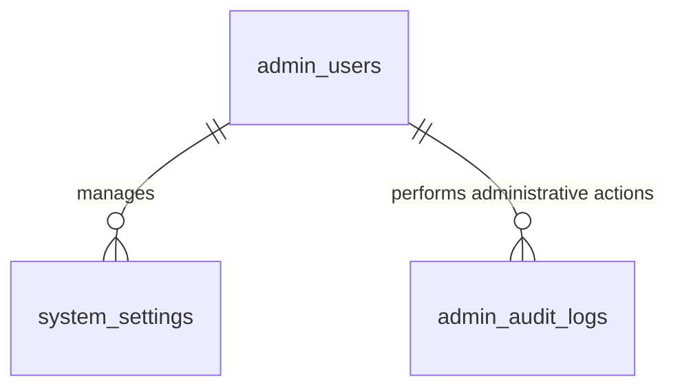

# SPEC — System Administration (Admin Role)
> **Feature ID:** `feat-system-admin`
> **UC Coverage:** UC-35 (Login System), UC-36 (View Dashboard), UC-37 (User Management), UC-39 (Settings), UC-40 (Notification Rules)
> **Version:** 1.0 | **Status:** Draft
> **Author:** Team | **Last Updated:** 2026-05-28

---

## 1. CONTEXT & GOAL

### 1.1 Bối cảnh
Để vận hành hệ thống ổn định và an toàn, Quản trị viên cấp cao (Admin) cần một bảng điều khiển trung tâm (Admin Panel) để quản lý cấu hình hệ thống, theo dõi sức khỏe ứng dụng, quản lý phân quyền nhân viên và thiết lập các kịch bản tương tác tự động. Do nắm giữ quyền lực tuyệt đối, tài khoản Admin yêu cầu các hàng rào bảo mật nghiêm ngặt nhất.

### 1.2 Mục tiêu
- **Đăng nhập bảo mật 2FA (UC-35):** Triển khai cơ chế đăng nhập Admin Panel bắt buộc đi qua xác thực 2 bước (TOTP - Google Authenticator/Authy).
- **Dashboard Tổng quan (UC-36):** Hiển thị số liệu thời gian thực về đăng ký người dùng mới, lượng bài thi/quiz thực hiện hàng ngày và trạng thái tài nguyên.
- **Quản lý phân quyền người dùng (UC-37):** Cấp quyền Admin tạo mới, chỉnh sửa thông tin, đặt lại mật khẩu và chuyển đổi phân quyền giữa các vai trò tài khoản (`admin_users`, `staff_users`, `student_users`).
- **Cấu hình hệ thống (UC-39):** Lưu trữ các cài đặt kỹ thuật (SMTP, khóa đăng nhập, bảo trì) vào cặp Key-Value lưu trữ trong bảng `system_settings`.
- **Quản lý quy tắc thông báo tự động (UC-40):** Thiết lập các template thông báo và quy tắc kích hoạt tự động (Notification Rules) khi người dùng đạt mốc streak học tập hoặc thi cử.

### 1.3 Tại sao cần?
Không có 2FA cho Admin $\rightarrow$ hệ thống đối mặt với nguy cơ bị hacker brute-force chiếm quyền điều khiển cao nhất, dẫn đến rò rỉ toàn bộ cơ sở dữ liệu. Không có cấu hình cài đặt `system_settings` $\rightarrow$ không thể linh hoạt chuyển đổi chế độ bảo trì hoặc thay đổi máy chủ gửi mail mà không cần phải compile lại mã nguồn backend.

---

## 2. ACTOR

| Actor | Role | Điều kiện tiền quyết |
|:---|:---|:---|
| **Admin** | Quản trị toàn bộ tài khoản người dùng, cấu hình SMTP/Cài đặt và thiết lập quy tắc tự động | Đã đăng nhập vai trò Admin, trạng thái hoạt động (`status = 'active'`), vượt qua xác thực 2FA |

---

## 3. FUNCTIONAL REQUIREMENTS (EARS)

### 3.1 UC-35 — Đăng nhập xác thực 2 yếu tố (2FA Login)

| ID | EARS Requirement |
|:---|:---|
| FR-ADMIN-01 | WHEN an Admin submits valid credentials, IF `two_factor_enabled = 1`, THEN THE SYSTEM SHALL issue a temporary token `2fa_temp` and prompt for the 6-digit TOTP code. |
| FR-ADMIN-02 | WHEN an Admin submits a valid TOTP code corresponding to the stored `two_factor_secret`, THE SYSTEM SHALL transition the session to active and return a JWT bearer token. |
| FR-ADMIN-03 | THE SYSTEM SHALL block Admin logins after 5 failed attempts, setting `locked_until = SYSUTCDATETIME() + 15 minutes` to mitigate brute-force attacks. |

### 3.2 UC-37 — Quản trị phân quyền (User Management)

| ID | EARS Requirement |
|:---|:---|
| FR-ADMIN-10 | WHEN an Admin updates a staff role, THE SYSTEM SHALL support transitioning roles between 'staff' and 'staff_manager' in `staff_users` and immediately audit the action. |
| FR-ADMIN-11 | THE SYSTEM SHALL NOT allow an Admin to modify the email or status of their own current logged-in account to prevent lockout scenarios. |
| FR-ADMIN-12 | WHEN an Admin resets a student or staff password, THE SYSTEM SHALL generate a secure random temporary password and send a reset link via email. |

### 3.3 UC-39 & UC-40 — Cấu hình & Quy tắc Thông báo (Settings & Notification Rules)

| ID | EARS Requirement |
|:---|:---|
| FR-ADMIN-20 | WHEN an Admin edits a system setting, THE SYSTEM SHALL update `system_settings` with the new value, validating the `value_type` constraints. |
| FR-ADMIN-21 | WHEN a configured system milestone occurs (e.g. Student achieves a 10-day study streak), THE SYSTEM SHALL automatically resolve the template in `notifications` and send it through the defined channel. |
| FR-ADMIN-22 | WHILE the system is in `maintenance = true` state, THE SYSTEM SHALL block all Student logins with a friendly maintenance message, allowing only Admin and Staff access. |

---

## 4. NON-FUNCTIONAL REQUIREMENTS

| ID | Category | Requirement |
|:---|:---|:---|
| NFR-ADMIN-01 | Security (2FA) | TOTP 2FA phải tuân thủ chuẩn RFC 6238 sử dụng thuật toán HMAC-SHA1 và độ dài mã khóa 6 số tự động thay đổi sau mỗi 30 giây. |
| NFR-ADMIN-02 | Security | Secret key của 2FA (`two_factor_secret`) phải được mã hóa đối xứng (AES-256) trước khi lưu vào cơ sở dữ liệu. |
| NFR-ADMIN-03 | Security | Cấu hình mật khẩu SMTP, mã khóa API dịch vụ AI phải được ẩn hoàn toàn trên giao diện cấu hình Admin Panel (chỉ hiển thị dưới dạng dấu sao `*****`). |
| NFR-ADMIN-04 | Performance | Dashboard Admin phải tải và hiển thị các số liệu tổng hợp thời gian thực dưới 1.5 giây thông qua việc lập chỉ mục (indexing) tối ưu trên các bảng giao dịch chính. |
| NFR-ADMIN-05 | Logging | Log mọi hành vi cấu hình và phân quyền của Admin bằng SLF4J gửi tới `admin_audit_logs`. |

---

## 5. DATA MODEL

### 5.1 Bảng chính

> Nguồn: [`jlpt_database_v2.sql`](file:///d:/Japanese-Skill-Practice-Platform/3.src/infra/Database/jlpt_database_v2.sql)

```sql
-- Bảng 1: admin_users
CREATE TABLE admin_users (
    admin_id             BIGINT IDENTITY(1,1) PRIMARY KEY,
    email                NVARCHAR(255)   NOT NULL UNIQUE,
    password_hash        NVARCHAR(255)   NULL,
    full_name            NVARCHAR(150)   NOT NULL,
    status               NVARCHAR(20)    NOT NULL DEFAULT 'active'
        CHECK (status IN ('active','suspended','pending','deleted')),
    suspend_reason       NVARCHAR(500)   NULL,
    email_verified_at    DATETIME2       NULL,
    login_attempts       INT             NOT NULL DEFAULT 0,
    locked_until         DATETIME2       NULL,
    last_login_at        DATETIME2       NULL,
    last_login_ip        NVARCHAR(45)    NULL,
    password_changed_at  DATETIME2       NULL,
    two_factor_enabled   BIT             NOT NULL DEFAULT 0,
    two_factor_secret    NVARCHAR(255)   NULL,
    created_at           DATETIME2       NOT NULL DEFAULT SYSUTCDATETIME(),
    updated_at           DATETIME2       NOT NULL DEFAULT SYSUTCDATETIME()
);

-- Bảng 21: system_settings
CREATE TABLE system_settings (
    setting_id      INT IDENTITY(1,1) PRIMARY KEY,
    setting_group   NVARCHAR(50)    NOT NULL,
    setting_key     NVARCHAR(100)   NOT NULL,
    setting_value   NVARCHAR(MAX)   NULL,
    value_type      NVARCHAR(20)    NOT NULL DEFAULT 'string'
        CHECK (value_type IN ('string','integer','boolean','time')),
    is_editable     BIT             NOT NULL DEFAULT 1,
    updated_by      BIGINT          NULL,
    updated_at      DATETIME2       NOT NULL DEFAULT SYSUTCDATETIME(),
    CONSTRAINT UQ_setting    UNIQUE (setting_group, setting_key),
    CONSTRAINT FK_setting_admin FOREIGN KEY (updated_by) REFERENCES admin_users(admin_id)
);
```

### 5.2 Quan hệ



---

## 6. API SPEC

### `POST /api/admin/login`
**Actor:** Admin | **Auth:** None (Anonymous)

**Request:**
```json
{
  "email": "admin@jlpt.com",
  "password": "SecurePassword123"
}
```

**Response (200 OK - 2FA Required):**
```json
{
  "status": 200,
  "message": "Thông tin tài khoản chính xác. Yêu cầu nhập mã xác thực 2 yếu tố.",
  "data": {
    "mfaToken": "temp_mfa_token_abc123",
    "twoFactorEnabled": true
  }
}
```

---

### `POST /api/admin/login/verify-mfa`
**Actor:** Admin | **Auth:** Bearer JWT (temp_mfa_token)

**Request:**
```json
{
  "totpCode": "562914"
}
```

**Response (200 OK):**
```json
{
  "status": 200,
  "message": "Xác thực 2 yếu tố thành công",
  "data": {
    "accessToken": "jwt_token_here",
    "expiresIn": 900
  }
}
```

---

### `PUT /api/admin/settings/{settingGroup}/{settingKey}`
**Actor:** Admin | **Auth:** Bearer JWT (2FA required)

**Request:**
```json
{
  "settingValue": "smtp.googlemail.com"
}
```

**Response (200 OK):**
```json
{
  "status": 200,
  "message": "Cập nhật cài đặt hệ thống thành công",
  "data": {
    "settingKey": "smtp_host",
    "settingValue": "smtp.googlemail.com",
    "updatedAt": "2026-05-28T23:44:00Z"
  }
}
```

---

### `POST /api/admin/notification-rules`
**Actor:** Admin | **Auth:** Bearer JWT (2FA required)

**Request:**
```json
{
  "ruleKey": "streak_10_days",
  "milestone": "streak_10",
  "templateTitle": "Chúc mừng chuỗi học tập xuất sắc!",
  "templateContent": "Bạn đã duy trì chuỗi học tập 10 ngày liên tiếp. Hãy tiếp tục phong độ tuyệt vời này nhé!",
  "channel": "in_app"
}
```

**Response (201 Created):**
```json
{
  "status": 201,
  "message": "Tạo quy tắc thông báo tự động thành công",
  "data": {
    "ruleId": 5
  }
}
```

---

## 7. ERROR HANDLING

| HTTP Code | Error Code | Message | Trigger |
|:---:|:---|:---|:---|
| 400 | `INVALID_MFA` | "Mã xác thực 2 yếu tố không chính xác" | Nhập sai mã TOTP |
| 401 | `UNAUTHORIZED` | "Yêu cầu đăng nhập" | JWT token thiếu hoặc hết hạn |
| 403 | `FORBIDDEN` | "Tài khoản không có quyền quản trị tối cao" | Staff / Student cố tiếp cận API Admin |
| 403 | `MFA_REQUIRED` | "Yêu cầu xác thực 2 yếu tố" | Chưa qua xác thực 2FA nhưng cố gọi API cấu hình |
| 404 | `SETTING_NOT_FOUND` | "Không tìm thấy cấu hình này" | settingKey sai lệch |
| 500 | `INTERNAL_ERROR` | "Internal server error" | Lỗi hệ thống |

---

## 8. ACCEPTANCE CRITERIA

| ID | Scenario | Given | When | Then |
|:---|:---|:---|:---|:---|
| AC-ADMIN-01 | Đăng nhập Admin Panel yêu cầu 2FA | Email/Password chính xác, 2FA enabled | POST /api/admin/login | Trả về status 200 kèm `temp_mfa_token` |
| AC-ADMIN-02 | Chặn truy cập cấu hình khi chưa xác thực 2FA | Có tài khoản Admin nhưng chưa verify OTP | PUT /settings | Trả về lỗi 403 `MFA_REQUIRED` |
| AC-ADMIN-03 | Cập nhật cấu hình SMTP thành công | Admin đã xác thực 2FA | PUT /settings/smtp/host | Cập nhật setting_value và ghi log audit |
| AC-ADMIN-04 | Kích hoạt bảo trì chặn Student | Cấu hình bảo trì = true | Đăng nhập Student | Chặn đăng nhập với thông điệp bảo trì |

---

## OUT OF SCOPE

- ❌ Tự động sao lưu (auto-backup) cơ sở dữ liệu trực tiếp từ Admin Panel — đây là tác vụ hạ tầng ở mức DevOps.
- ❌ Cập nhật phiên bản phần mềm (software update) từ giao diện.
