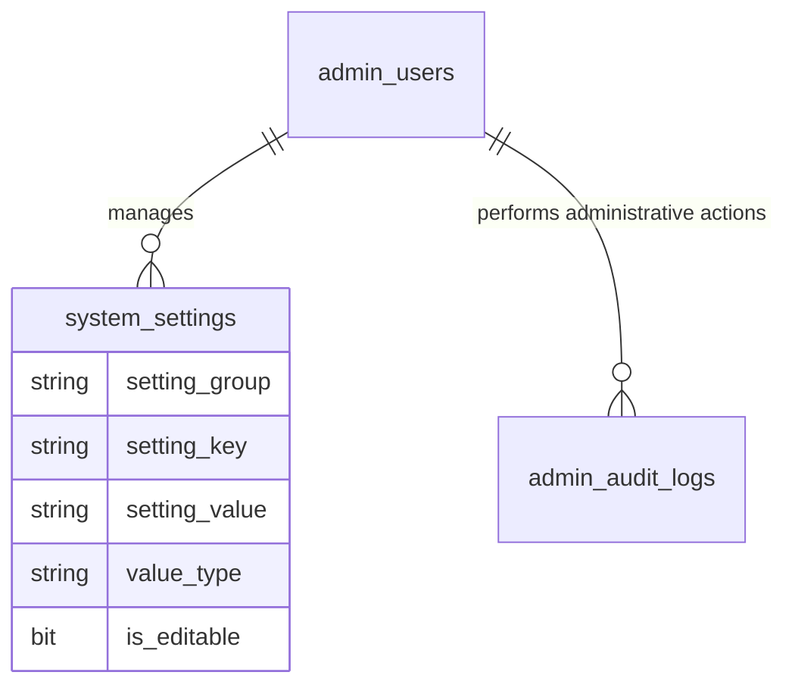

# SPEC — System Administration (Admin Role)
> **Feature ID:** `feat-system-admin`
> **UC Coverage:** UC-35 (Login System), UC-36 (View Dashboard), UC-37 (User Management), UC-39 (Settings), UC-40 (Notification Rules)
> **Version:** 2.0 | **Status:** Ready for Implementation
> **Author:** Team | **Last Updated:** 2026-06-14

---

## 1. CONTEXT & GOAL

### 1.1 Bối cảnh
Để vận hành hệ thống ổn định và an toàn, Quản trị viên cấp cao (Admin) cần một bảng điều khiển trung tâm (Admin Panel) để quản lý cấu hình hệ thống, theo dõi sức khỏe ứng dụng, quản lý phân quyền nhân viên và thiết lập các kịch bản tương tác tự động.

### 1.2 Mục tiêu
- **Đăng nhập bảo mật (UC-35):** Admin đăng nhập bằng Email/Password, nhận JWT trực tiếp.
- **Dashboard Tổng quan (UC-36):** Hiển thị số liệu thời gian thực về đăng ký người dùng mới, lượng bài thi/quiz thực hiện hàng ngày và trạng thái tài nguyên.
- **Quản lý phân quyền người dùng (UC-37):** Admin tạo mới, chỉnh sửa thông tin, đặt lại mật khẩu và chuyển đổi phân quyền giữa các vai trò.
- **Cấu hình hệ thống (UC-39):** Lưu trữ các cài đặt kỹ thuật (SMTP, khóa đăng nhập, bảo trì) vào cặp Key-Value trong bảng `system_settings`.
- **Quản lý quy tắc thông báo tự động (UC-40):** Thiết lập template thông báo và quy tắc kích hoạt tự động (Notification Rules) khi người dùng đạt mốc streak hoặc thi cử.

### 1.3 Tại sao cần?
Không có cấu hình `system_settings` → không thể linh hoạt chuyển đổi chế độ bảo trì hoặc thay đổi máy chủ gửi mail mà không cần compile lại mã nguồn backend.

---

## 2. ACTOR

| Actor | Role | Điều kiện tiền quyết |
|:---|:---|:---|
| **Admin** | Quản trị toàn bộ tài khoản, cấu hình SMTP/Settings, quy tắc tự động | Đã đăng nhập thành công với vai trò Admin, status = `active` |

---

## 3. FUNCTIONAL REQUIREMENTS (EARS)

### 3.1 UC-35 — Đăng nhập Admin
> UC-35 đã được implement trong `feat-auth`. Phần này chỉ ghi nhận rule liên quan đến Admin.

| ID | EARS Requirement |
|:---|:---|
| FR-ADMIN-01 | WHEN an Admin submits valid credentials, THE SYSTEM SHALL immediately issue a JWT access token and refresh token with `role = ADMIN`. |
| FR-ADMIN-02 | THE SYSTEM SHALL block Admin logins after 5 failed attempts, setting `locked_until = NOW() + 15 minutes`. |

### 3.2 UC-37 — Quản trị phân quyền (User Management)
> Chi tiết CRUD User đã được implement trong `AdminController` (hiện có). Phần này bổ sung rules còn thiếu.

| ID | EARS Requirement |
|:---|:---|
| FR-ADMIN-10 | WHEN an Admin updates a staff role, THE SYSTEM SHALL support transitioning between `staff` and `staff_manager`, log to `admin_audit_logs` immediately. |
| FR-ADMIN-11 | THE SYSTEM SHALL NOT allow an Admin to modify their own email or status to prevent lockout scenarios. |
| FR-ADMIN-12 | WHEN an Admin resets a student or staff password, THE SYSTEM SHALL generate a secure random temporary password and send a reset link via email. |

### 3.3 UC-39 — Cấu hình Hệ thống (System Settings)

| ID | EARS Requirement |
|:---|:---|
| FR-ADMIN-20 | THE SYSTEM SHALL allow Admin to list all setting groups, list settings within a group, and get a specific setting by `(group, key)`. |
| FR-ADMIN-21 | WHEN an Admin edits a system setting, THE SYSTEM SHALL validate the new value against `value_type` constraints (boolean/integer/time/string) before saving. |
| FR-ADMIN-22 | THE SYSTEM SHALL block updates to settings with `is_editable = false` — returning HTTP 422. |
| FR-ADMIN-23 | WHILE the system is in `maintenance_mode = true`, THE SYSTEM SHALL block all Student logins with a maintenance message. Admin and Staff can still log in. |
| FR-ADMIN-24 | EVERY setting update MUST be logged to `admin_audit_logs` with `action = 'SETTING_UPDATED'`, `description = '{group}/{key} → {newValue}'`. |

### 3.4 UC-40 — Quản lý Quy tắc Thông báo tự động (Notification Rules)

| ID | EARS Requirement |
|:---|:---|
| FR-ADMIN-30 | THE SYSTEM SHALL allow Admin to list all notification rules stored as settings in group `notification`. |
| FR-ADMIN-31 | WHEN an Admin creates a notification rule, THE SYSTEM SHALL create a `system_settings` record with `setting_group = 'notification'`, `setting_key = ruleKey`, and `setting_value` as a JSON string containing `{ "enabled": true, "condition": "...", "channel": "...", "templateTitle": "...", "templateContent": "..." }`. |
| FR-ADMIN-32 | WHEN an Admin updates a notification rule, THE SYSTEM SHALL update the JSON value in `system_settings` and log the action. |
| FR-ADMIN-33 | WHEN an Admin deletes a notification rule, THE SYSTEM SHALL set the rule's `isEnabled = false` in the JSON value (soft disable — KHÔNG xóa record). |
| FR-ADMIN-34 | WHEN a configured system milestone occurs (e.g. Student achieves 10-day streak), THE SYSTEM SHALL automatically resolve the template in `notifications` and send through the defined channel, subject to duplicate-check (24h window). |

---

## 4. NON-FUNCTIONAL REQUIREMENTS

| ID | Category | Requirement |
|:---|:---|:---|
| NFR-ADMIN-01 | Security | Mật khẩu Admin phải dùng bcrypt cost ≥ 12; login endpoint giới hạn 5 request/phút/IP. |
| NFR-ADMIN-02 | Security | Giá trị settings nhạy cảm (SMTP password, API keys) phải được ẩn trong response API — trả về `"*****"` thay vì giá trị thực. |
| NFR-ADMIN-03 | Performance | Dashboard Admin phải phản hồi dưới 1.5 giây (tận dụng index trên các bảng giao dịch chính). |
| NFR-ADMIN-04 | Logging | Log mọi hành vi cấu hình và phân quyền của Admin bằng SLF4J → `admin_audit_logs`. |
| NFR-ADMIN-05 | Data Integrity | Không xóa cứng (hard delete) bất kỳ notification rule nào — chỉ soft disable. |

---

## 5. DATA MODEL

### 5.1 Bảng chính

> Nguồn: [`database/init.sql`](../../../../database/init.sql)

```sql
-- Bảng 1: admin_users
CREATE TABLE admin_users (
    admin_id             BIGINT IDENTITY(1,1) PRIMARY KEY,
    email                NVARCHAR(255)   NOT NULL UNIQUE,
    password_hash        NVARCHAR(255)   NULL,
    full_name            NVARCHAR(150)   NOT NULL,
    status               NVARCHAR(20)    NOT NULL DEFAULT 'active'
        CHECK (status IN ('active','suspended','pending','deleted')),
    suspend_reason       NVARCHAR(500)   NULL,
    login_attempts       INT             NOT NULL DEFAULT 0,
    locked_until         DATETIME2       NULL,
    last_login_at        DATETIME2       NULL,
    created_at           DATETIME2       NOT NULL DEFAULT SYSUTCDATETIME(),
    updated_at           DATETIME2       NOT NULL DEFAULT SYSUTCDATETIME()
);

-- Bảng 21: system_settings
CREATE TABLE system_settings (
    setting_id      INT IDENTITY(1,1) PRIMARY KEY,
    setting_group   NVARCHAR(50)    NOT NULL,
    setting_key     NVARCHAR(100)   NOT NULL,
    setting_value   NVARCHAR(MAX)   NULL,
    value_type      NVARCHAR(20)    NOT NULL DEFAULT 'string'
        CHECK (value_type IN ('string','integer','boolean','time')),
    is_editable     BIT             NOT NULL DEFAULT 1,
    updated_by      BIGINT          NULL,
    updated_at      DATETIME2       NOT NULL DEFAULT SYSUTCDATETIME(),
    CONSTRAINT UQ_setting    UNIQUE (setting_group, setting_key),
    CONSTRAINT FK_setting_admin FOREIGN KEY (updated_by) REFERENCES admin_users(admin_id)
);

-- Bảng 22: admin_audit_logs (dùng chung)
CREATE TABLE admin_audit_logs (
    audit_id        BIGINT IDENTITY(1,1) PRIMARY KEY,
    admin_actor_id  BIGINT          NULL,
    staff_actor_id  BIGINT          NULL,
    action          NVARCHAR(100)   NOT NULL,
    target_table    NVARCHAR(100)   NULL,
    target_id       BIGINT          NULL,
    description     NVARCHAR(MAX)   NULL,
    ip_address      NVARCHAR(45)    NULL,
    created_at      DATETIME2       NOT NULL DEFAULT SYSUTCDATETIME(),
    CONSTRAINT CK_audit_actor CHECK (
        (admin_actor_id IS NOT NULL AND staff_actor_id IS NULL) OR
        (admin_actor_id IS NULL     AND staff_actor_id IS NOT NULL)
    )
);

-- Notification Rules lưu trong system_settings với:
--   setting_group = 'notification'
--   setting_key   = ruleKey (e.g. 'streak_10_days')
--   setting_value = JSON: { "enabled":true, "condition":"streak_10", "channel":"in_app",
--                           "templateTitle":"...", "templateContent":"..." }
--   value_type    = 'string'
```

### 5.2 Quan hệ



---

## 6. FILES CẦN TẠO

| File | Package | Loại | Ghi chú |
|:---|:---|:---|:---|
| `SystemSettingRepository.java` | `com.jlpt.repository` | Repository | Mới |
| `SystemSettingService.java` | `com.jlpt.service` | Service | Mới |
| `NotificationRuleService.java` | `com.jlpt.service` | Service | Mới |
| `AdminSystemController.java` | `com.jlpt.controller.admin` | Controller | Mới — **KHÔNG sửa** `AdminController.java` hiện có |
| `AdminDashboardController.java` | `com.jlpt.controller.admin` | Controller | Mới |
| `SystemSettingRequest.java` | `com.jlpt.dto.request` | DTO Request | Mới |
| `NotificationRuleRequest.java` | `com.jlpt.dto.request` | DTO Request | Mới |
| `SystemSettingResponse.java` | `com.jlpt.dto.response` | DTO Response | Mới |
| `NotificationRuleResponse.java` | `com.jlpt.dto.response` | DTO Response | Mới |

> **⚠️ Quan trọng:** KHÔNG sửa `AdminController.java` đã có. Tạo `AdminSystemController.java` và `AdminDashboardController.java` riêng biệt để tránh conflict với team khác.

---

## 7. SERVICE SPEC

### `SystemSettingService`
**Annotations:** `@Service`, `@RequiredArgsConstructor`, `@Slf4j`, `@Transactional`

| Method | Signature | Business Logic |
|:---|:---|:---|
| `getAllGroups` | `List<String> getAllGroups()` | Gọi `settingRepository.findAllGroups()` |
| `getSettingsByGroup` | `List<SystemSettingResponse> getSettingsByGroup(String group)` | Map sang response, ẩn giá trị nhạy cảm nếu key chứa `password`/`secret`/`api_key` → trả `"*****"` |
| `getSetting` | `SystemSettingResponse getSetting(String group, String key)` | 404 nếu không tìm thấy |
| `updateSetting` | `SystemSettingResponse updateSetting(String group, String key, SystemSettingRequest req, Long adminId)` | Load setting, check isEditable (422 nếu false), validate value theo valueType, save, ghi audit log `SETTING_UPDATED` |
| `isMaintenanceMode` | `boolean isMaintenanceMode()` | Tìm setting `system/maintenance_mode`, parse boolean value |
| `setMaintenanceMode` | `void setMaintenanceMode(boolean enabled, Long adminId)` | Update setting `system/maintenance_mode`, ghi audit log `MAINTENANCE_MODE_TOGGLED` |

**Value type validation rules:**
- `BOOLEAN`: value phải là `"true"` hoặc `"false"` (case-insensitive)
- `INTEGER`: value phải parse được sang `Integer` (`NumberFormatException` → 400)
- `TIME`: value phải match pattern `HH:mm` (regex `^([01]\d|2[0-3]):[0-5]\d$`)
- `STRING`: bất kỳ string không rỗng

---

### `NotificationRuleService`
**Annotations:** `@Service`, `@RequiredArgsConstructor`, `@Slf4j`, `@Transactional`

| Method | Signature | Business Logic |
|:---|:---|:---|
| `listRules` | `List<NotificationRuleResponse> listRules()` | Lấy tất cả settings có `settingGroup = 'notification'`, parse JSON value thành NotificationRuleResponse |
| `createRule` | `NotificationRuleResponse createRule(NotificationRuleRequest req, Long adminId)` | Validate ruleKey không trùng, tạo SystemSetting với group=`notification`, key=ruleKey, value=JSON, ghi audit log `NOTIFICATION_RULE_CREATED` |
| `updateRule` | `NotificationRuleResponse updateRule(String ruleKey, NotificationRuleRequest req, Long adminId)` | Load setting `notification/{ruleKey}` (404 nếu không có), update JSON value, ghi audit log `NOTIFICATION_RULE_UPDATED` |
| `deleteRule` | `void deleteRule(String ruleKey, Long adminId)` | Load setting, set `enabled=false` trong JSON (soft disable), ghi audit log `NOTIFICATION_RULE_DELETED` |
| `triggerMilestone` | `void triggerMilestone(Long studentId, String milestone)` | Kiểm tra rule `notification/milestone_{milestone}` enabled, check duplicate (24h), tạo Notification, ghi log `MILESTONE_NOTIFICATION_SENT` |

---

## 8. API SPEC

### System Settings — `/api/admin/settings`
**Security:** `@PreAuthorize("hasRole('ADMIN')")`

#### `GET /api/admin/settings`
**Response (200):**
```json
{
  "status": 200,
  "message": "Lấy danh sách nhóm cài đặt thành công",
  "data": ["system", "smtp", "security", "notification", "ai"]
}
```

---

#### `GET /api/admin/settings/{group}`
**Response (200):**
```json
{
  "status": 200,
  "message": "Lấy cài đặt thành công",
  "data": [
    {
      "settingId": 1,
      "settingGroup": "system",
      "settingKey": "maintenance_mode",
      "settingValue": "false",
      "valueType": "boolean",
      "isEditable": true,
      "updatedByAdminName": "Admin JLPT",
      "updatedAt": "2026-06-10T10:00:00Z"
    },
    {
      "settingId": 2,
      "settingGroup": "smtp",
      "settingKey": "smtp_password",
      "settingValue": "*****",
      "valueType": "string",
      "isEditable": true,
      "updatedByAdminName": "Admin JLPT",
      "updatedAt": "2026-06-01T08:00:00Z"
    }
  ]
}
```

---

#### `GET /api/admin/settings/{group}/{key}`
**Response (200):**
```json
{
  "status": 200,
  "message": "Lấy cài đặt thành công",
  "data": {
    "settingId": 1,
    "settingGroup": "system",
    "settingKey": "maintenance_mode",
    "settingValue": "false",
    "valueType": "boolean",
    "isEditable": true,
    "updatedByAdminName": "Admin JLPT",
    "updatedAt": "2026-06-10T10:00:00Z"
  }
}
```

---

#### `PUT /api/admin/settings/{group}/{key}`
**Request:**
```json
{
  "value": "smtp.googlemail.com",
  "changeReason": "Chuyển sang Gmail SMTP mới"
}
```
**Response (200):**
```json
{
  "status": 200,
  "message": "Cập nhật cài đặt hệ thống thành công",
  "data": {
    "settingGroup": "smtp",
    "settingKey": "smtp_host",
    "settingValue": "smtp.googlemail.com",
    "updatedAt": "2026-06-14T00:44:00Z"
  }
}
```

---

### Notification Rules — `/api/admin/notification-rules`
**Security:** `@PreAuthorize("hasRole('ADMIN')")`

#### `GET /api/admin/notification-rules`
**Response (200):**
```json
{
  "status": 200,
  "message": "Lấy danh sách quy tắc thông báo thành công",
  "data": [
    {
      "ruleKey": "streak_10_days",
      "description": "Thông báo khi học viên đạt streak 10 ngày",
      "isEnabled": true,
      "triggerCondition": "streak_10",
      "channel": "in_app",
      "templateTitle": "Chúc mừng chuỗi học tập xuất sắc!",
      "updatedAt": "2026-06-10T10:00:00Z",
      "updatedByAdminName": "Admin JLPT"
    }
  ]
}
```

---

#### `POST /api/admin/notification-rules`
**Request:**
```json
{
  "ruleKey": "streak_10_days",
  "description": "Thông báo khi học viên đạt streak 10 ngày",
  "isEnabled": true,
  "triggerCondition": "streak_10",
  "channel": "in_app",
  "templateTitle": "Chúc mừng chuỗi học tập xuất sắc!",
  "templateContent": "Bạn đã duy trì chuỗi học tập 10 ngày liên tiếp. Hãy tiếp tục phong độ tuyệt vời này nhé!"
}
```
**Response (201 Created):**
```json
{
  "status": 201,
  "message": "Tạo quy tắc thông báo tự động thành công",
  "data": {
    "ruleKey": "streak_10_days",
    "isEnabled": true
  }
}
```

---

#### `PUT /api/admin/notification-rules/{ruleKey}`
**Request:** *(tương tự POST nhưng không cần ruleKey trong body)*
```json
{
  "description": "Thông báo khi học viên đạt streak 10 ngày (cập nhật)",
  "isEnabled": false,
  "triggerCondition": "streak_10",
  "channel": "both",
  "templateTitle": "Chúc mừng!",
  "templateContent": "Bạn đã duy trì streak 10 ngày!"
}
```
**Response (200):** Trả về `NotificationRuleResponse` đã cập nhật.

---

#### `DELETE /api/admin/notification-rules/{ruleKey}`
**Response (200):**
```json
{
  "status": 200,
  "message": "Đã vô hiệu hóa quy tắc thông báo thành công"
}
```

---

### Admin Dashboard — `/api/admin/dashboard`
**Security:** `@PreAuthorize("hasRole('ADMIN')")`

#### `GET /api/admin/dashboard`
> Chi tiết response xem tại `feat-learning-analytics` § 8 GET /api/analytics/dashboard (Admin view).

---

#### `GET /api/admin/dashboard/audit-logs?action=SETTING_UPDATED&page=0&size=50`
**Query Params:**
- `action` *(optional)*: filter theo action name
- `adminId` *(optional)*: filter theo người thực hiện
- `page` *(default=0)*, `size` *(default=50)*

**Response (200):**
```json
{
  "status": 200,
  "message": "Lấy audit log thành công",
  "data": {
    "content": [
      {
        "auditId": 1001,
        "actorName": "Admin JLPT",
        "actorType": "ADMIN",
        "action": "SETTING_UPDATED",
        "targetTable": "system_settings",
        "targetId": null,
        "description": "smtp/smtp_host → smtp.googlemail.com",
        "ipAddress": "192.168.1.1",
        "createdAt": "2026-06-14T00:44:00Z"
      }
    ],
    "totalElements": 250,
    "totalPages": 5
  }
}
```

---

## 9. DTO SPEC

### `SystemSettingRequest` *(mới)*
```java
@NotBlank(message = "Giá trị setting không được để trống")
String value;

@Size(max = 500)
String changeReason;   // optional — cho audit log
```

### `SystemSettingResponse` *(mới)*
```java
Integer settingId; String settingGroup; String settingKey;
String settingValue;   // "*****" nếu là sensitive key
String valueType;      // "STRING"|"INTEGER"|"BOOLEAN"|"TIME"
Boolean isEditable;
String updatedByAdminName;
LocalDateTime updatedAt;
```

### `NotificationRuleRequest` *(mới)*
```java
@NotBlank
@Pattern(regexp = "^[a-z][a-z0-9_]{2,49}$", message = "ruleKey chỉ chứa chữ thường, số và underscore, bắt đầu bằng chữ cái")
String ruleKey;

@NotBlank @Size(max = 255)
String description;

@NotNull
Boolean isEnabled;

@Size(max = 100)
String triggerCondition;   // "streak_10", "exam_passed_n3", v.v.

String channel;            // "in_app"|"email"|"both"

@Size(max = 255)
String templateTitle;

@Size(max = 2000)
String templateContent;
```

### `NotificationRuleResponse` *(mới)*
```java
String ruleKey; String description;
Boolean isEnabled; String triggerCondition; String channel;
String templateTitle; String templateContent;
LocalDateTime updatedAt; String updatedByAdminName;
```

---

## 10. AUDIT LOG ACTIONS

| Action | Trigger |
|:---|:---|
| `SETTING_UPDATED` | Admin cập nhật bất kỳ system setting |
| `MAINTENANCE_MODE_TOGGLED` | Admin bật/tắt maintenance mode |
| `NOTIFICATION_RULE_CREATED` | Admin tạo mới notification rule |
| `NOTIFICATION_RULE_UPDATED` | Admin cập nhật notification rule |
| `NOTIFICATION_RULE_DELETED` | Admin soft disable notification rule |
| `STUDENT_SUSPENDED` | Staff/Admin khóa tài khoản student |
| `STUDENT_ACTIVATED` | Staff/Admin mở khóa tài khoản student |
| `BROADCAST_SENT` | Staff/Admin gửi notification broadcast |
| `SUBMISSION_GRADED` | Staff chấm điểm thủ công bài nộp |

---

## 11. ERROR HANDLING

| HTTP Code | Error Code | Message | Trigger |
|:---:|:---|:---|:---|
| 400 | `VALIDATION_FAILED` | "Giá trị không hợp lệ cho loại {valueType}" | Value không match value_type (boolean/integer/time) |
| 400 | `DUPLICATE_RULE_KEY` | "Rule key đã tồn tại" | Tạo rule với ruleKey trùng |
| 401 | `INVALID_CREDENTIALS` | "Email hoặc mật khẩu không đúng" | Sai mật khẩu hoặc email không tồn tại |
| 401 | `UNAUTHORIZED` | "Yêu cầu đăng nhập" | JWT thiếu hoặc hết hạn |
| 403 | `FORBIDDEN` | "Tài khoản không có quyền quản trị tối cao" | Staff / Student cố tiếp cận API Admin |
| 404 | `SETTING_NOT_FOUND` | "Không tìm thấy cấu hình này" | group/key sai lệch |
| 404 | `RULE_NOT_FOUND` | "Không tìm thấy quy tắc thông báo này" | ruleKey không tồn tại |
| 422 | `SETTING_READ_ONLY` | "Cài đặt này không thể chỉnh sửa" | is_editable = false |
| 429 | `TOO_MANY_REQUESTS` | "Tài khoản tạm thời bị khóa. Vui lòng thử lại sau {X} phút" | login_attempts ≥ 5 |
| 500 | `INTERNAL_ERROR` | "Internal server error" | Lỗi hệ thống |

---

## 12. ACCEPTANCE CRITERIA

| ID | Scenario | Given | When | Then |
|:---|:---|:---|:---|:---|
| AC-ADMIN-01 | Đăng nhập Admin thành công | Email/Password chính xác, status = active | POST /api/auth/login | HTTP 200, JWT với role = ADMIN |
| AC-ADMIN-02 | Cập nhật cấu hình SMTP thành công | Admin đã đăng nhập | PUT /settings/smtp/smtp_host | settingValue cập nhật, audit log được ghi |
| AC-ADMIN-03 | Cập nhật setting read-only bị từ chối | Setting có is_editable = false | PUT /settings/{g}/{k} | HTTP 422 SETTING_READ_ONLY |
| AC-ADMIN-04 | Validate giá trị boolean sai định dạng | Gửi value = "yes" cho setting type boolean | PUT /settings | HTTP 400 VALIDATION_FAILED |
| AC-ADMIN-05 | Kích hoạt maintenance chặn Student | maintenance_mode = true | Student gọi POST /api/auth/login | HTTP 503 với thông điệp bảo trì |
| AC-ADMIN-06 | Tạo notification rule thành công | Rule key chưa tồn tại | POST /notification-rules | HTTP 201, setting được lưu với group=notification |
| AC-ADMIN-07 | Xóa rule là soft disable | Rule đang enabled | DELETE /notification-rules/{key} | isEnabled = false trong JSON, record không bị xóa |
| AC-ADMIN-08 | Lấy danh sách audit logs | Có nhiều log | GET /dashboard/audit-logs | Trả paginated list với filter hoạt động |
| AC-ADMIN-09 | Sensitive setting value bị ẩn | Setting key chứa 'password' | GET /settings/smtp | settingValue = "*****" |

---

## OUT OF SCOPE

- ❌ Tự động sao lưu (auto-backup) cơ sở dữ liệu từ Admin Panel — tác vụ hạ tầng DevOps.
- ❌ Cập nhật phiên bản phần mềm (software update) từ giao diện.
- ❌ Two-factor authentication (2FA) cho Admin — mặc dù schema có `two_factor_enabled`, tính năng này nằm ngoài phạm vi sprint hiện tại.
- ❌ Import/Export cấu hình (settings dump) — chỉ update từng key.
