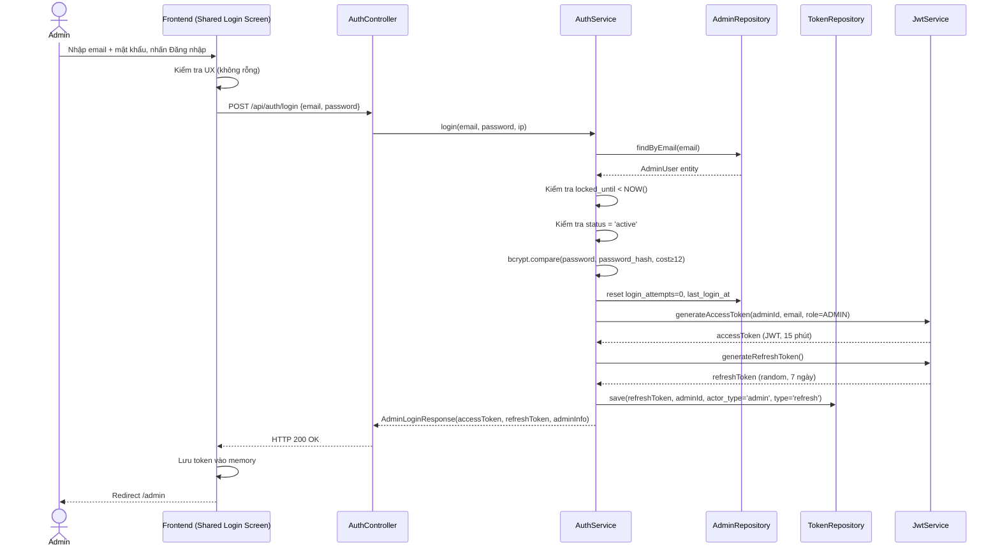
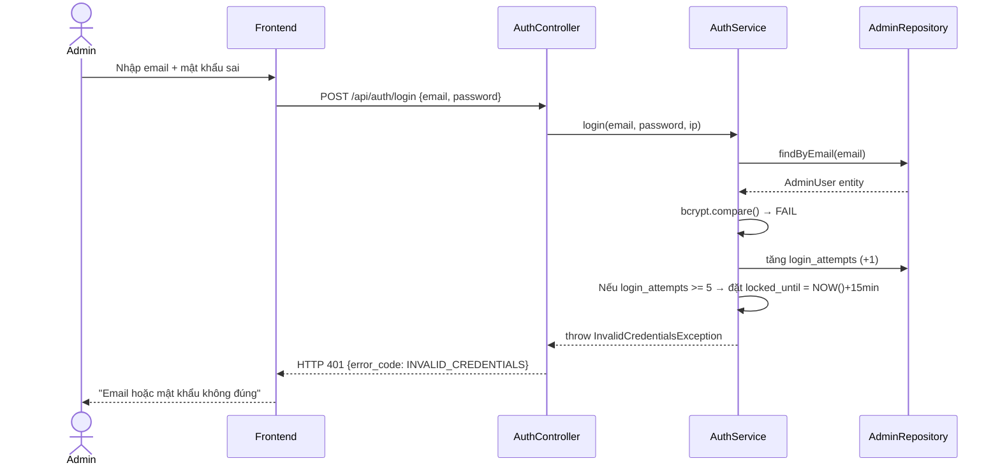

# UC-35 — Đăng Nhập Admin (Admin Login — Shared Login Screen)

> **Feature:** `feat-system-admin` | **Phiên bản:** 2.0 | **Trạng thái:** Draft
> **Tham chiếu FR:** FR-ADMIN-01, FR-ADMIN-02, FR-ADMIN-03
> **Mở rộng từ:** UC-01 (Login) — dùng chung endpoint `POST /api/auth/login`
> **Cập nhật:** 2026-06-03

---

## 1. Tổng Quan

| Thuộc tính | Nội dung |
|:---|:---|
| **Mã Use Case** | UC-35 |
| **Tên** | Đăng Nhập Admin (Admin Login via Shared Login Screen) |
| **Tác nhân chính** | Khách (Guest) — đăng nhập với tài khoản Admin |
| **Mô tả ngắn** | Admin dùng màn hình đăng nhập chung với các role khác. Backend tự phát hiện role theo email, xác thực credential, cấp JWT với claim `role = ADMIN` ngay lập tức. Frontend redirect đến `/admin` sau khi đăng nhập thành công. |
| **Độ ưu tiên** | Rất cao (P0) — cổng vào Admin Panel |

> **Thiết kế cốt lõi:** Chỉ có **một endpoint** `POST /api/auth/login` cho mọi role. Backend tra cứu email theo thứ tự `admin_users → staff_users → student_users`, từ đó quyết định luồng xử lý. Admin nhận JWT access token và refresh token trực tiếp sau khi xác thực credential thành công.

---

## 2. Tác Nhân & Điều Kiện

### 2.1 Tác Nhân

| Tác nhân | Vai trò |
|:---|:---|
| **Khách (Admin)** | Người chủ động đăng nhập với tài khoản Admin |
| **Hệ thống** | Xác thực credential, cấp JWT Admin |

### 2.2 Điều Kiện Tiền Quyết (Preconditions)

- Admin có tài khoản tồn tại trong bảng `admin_users`
- `status = 'active'`

### 2.3 Hậu Điều Kiện (Postconditions)

- **Thành công:** Bản ghi `auth_tokens` (type `refresh`, `actor_type = 'admin'`) được tạo; JWT access token (15 phút, `role = ADMIN`) được cấp; Admin được chuyển đến `/admin`
- **Thất bại (credentials):** `login_attempts` tăng; không tạo bất kỳ token nào; Admin ở lại trang đăng nhập

---

## 3. Luồng Xử Lý

### 3.1 Luồng Chính — Đăng Nhập Admin (Happy Path)

```
Bước 1  [Admin]:    Điền email và mật khẩu vào form đăng nhập chung, nhấn "Đăng nhập"
Bước 2  [Frontend]: Kiểm tra UX cơ bản (email không rỗng, mật khẩu không rỗng)
                     Gửi POST /api/auth/login { email, password }
Bước 3  [Backend]:  Validate định dạng request (email format, required fields)
Bước 4  [Backend]:  Tra cứu email theo thứ tự: admin_users → staff_users → student_users
                     → Tìm thấy trong admin_users: đi tiếp luồng Admin
Bước 5  [Backend]:  Kiểm tra locked_until < NOW() hoặc NULL (chưa bị khóa)
Bước 6  [Backend]:  Kiểm tra status = 'active'
Bước 7  [Backend]:  So sánh mật khẩu với bcrypt (cost ≥ 12, theo CONSTITUTION §3.1)
Bước 8  [Backend]:  Đặt login_attempts = 0, cập nhật last_login_at
Bước 9  [Backend]:  Tạo JWT access token (15 phút, claims: adminId, email, role=ADMIN)
Bước 10 [Backend]:  Tạo refresh token ngẫu nhiên (7 ngày), lưu vào auth_tokens
                       (token_type = 'refresh', actor_type = 'admin')
Bước 11 [Backend]:  Trả về HTTP 200 với accessToken, refreshToken, adminInfo
Bước 12 [Frontend]: Lưu token vào memory, redirect đến /admin
```

### 3.2 Luồng Phụ A — Phát Hiện Role Theo Email (Multi-Role Detection)

```
Bước 4 mở rộng:
   AuthService.login(email, password):
   ├── TRY: adminRepo.findByEmail(email)
   │        → Found → goto Admin Flow (UC-35)
   ├── TRY: staffRepo.findByEmail(email)
   │        → Found → goto Staff Flow (UC-36-staff-login, TBD)
   └── TRY: studentRepo.findByEmail(email)
            → Found → goto Student Flow (UC-01)
            → Not found → throw InvalidCredentialsException
```

> **Lưu ý bảo mật:** Kết quả tra cứu KHÔNG được tiết lộ trong thông báo lỗi. Dù email thuộc về admin, staff, hay không tồn tại, thông báo lỗi luôn là "Email hoặc mật khẩu không đúng".

### 3.3 Luồng Lỗi — Sai Mật Khẩu (Bước 7 thất bại)

```
Bước 7→ [Backend]:  bcrypt so sánh thất bại
Bước X  [Backend]:  Tăng login_attempts thêm 1
                     Ghi log: [WARN] [AuthService] Admin login failed {email, ip, attempt_count}
Bước X  [Backend]:  Trả về HTTP 401 — INVALID_CREDENTIALS
                     "Email hoặc mật khẩu không đúng"
```

> **Lưu ý bảo mật:** Không phân biệt "email không tồn tại" vs "sai mật khẩu" để tránh email enumeration.

### 3.4 Luồng Lỗi — Tài Khoản Bị Khóa Tạm Thời (5 lần sai liên tiếp)

```
Bước X  [Backend]:  login_attempts đạt ngưỡng 5
Bước X  [Backend]:  Đặt locked_until = NOW() + 15 phút
                     Ghi log: [WARN] [AuthService] Admin account locked {email, ip}
Bước X  [Backend]:  Trả về HTTP 429 — TOO_MANY_REQUESTS
                     "Tài khoản tạm thời bị khóa. Vui lòng thử lại sau {X} phút"
```

> **Lưu ý:** Mọi lần thử đăng nhập trong thời gian bị khóa đều bị từ chối ngay (kiểm tra `locked_until` **trước** khi so sánh mật khẩu) và KHÔNG tăng thêm `login_attempts`.

### 3.5 Luồng Lỗi — Tài Khoản Bị Đình Chỉ

```
Bước 6  [Backend]:  status = 'suspended'
Bước X  [Backend]:  Ghi log: [WARN] [AuthService] Admin login rejected - suspended {email}
Bước X  [Backend]:  Trả về HTTP 403 — ACCOUNT_SUSPENDED
                     "Tài khoản bị đình chỉ. Lý do: {suspend_reason}"
```

---

## 4. Quy Tắc Nghiệp Vụ

| Mã | Quy tắc | Chi tiết |
|:---|:---|:---|
| BR-35-01 | Bộ đếm `login_attempts` reset khi **credential đúng** | Đặt về 0 sau Bước 8 |
| BR-35-02 | JWT Admin chứa claim `role = "ADMIN"` | Spring Security kiểm tra claim này trên mọi endpoint `/api/admin/**` |
| BR-35-03 | Mật khẩu Admin dùng bcrypt **cost ≥ 12** | Cao hơn mức tối thiểu bcrypt cost 10 cho Student/Staff |
| BR-35-04 | Thông báo lỗi đăng nhập luôn **chung chung** | "Email hoặc mật khẩu không đúng" — không tiết lộ role hay sự tồn tại của email |
| BR-35-05 | Mọi sự kiện đăng nhập Admin phải ghi vào `admin_audit_logs` | Bao gồm: login thành công, thất bại |
| BR-35-06 | Rate limit: **5 request/phút/IP** trên endpoint `/api/auth/login` với email Admin | Nghiêm ngặt hơn Student (10 req/phút) |

---

## 5. Quy Tắc Kiểm Tra Đầu Vào

### 5.1 POST /api/auth/login

| Trường | Kiểm tra | Thông báo lỗi nếu sai |
|:---|:---|:---|
| `email` | Bắt buộc, không rỗng | "Email là bắt buộc" |
| `email` | Định dạng email hợp lệ (RFC 5322 cơ bản) | "Email không hợp lệ" |
| `email` | Độ dài tối đa 255 ký tự | "Email quá dài" |
| `password` | Bắt buộc, không rỗng | "Mật khẩu là bắt buộc" |

> **Lưu ý:** Validation đầu vào trả về HTTP 400 trước khi truy vấn DB.

---

## 6. Sơ Đồ Tuần Tự (Sequence Diagram)

### 6.1 Luồng Happy Path — Admin Login



### 6.2 Luồng Lỗi — Sai Mật Khẩu



---

## 7. Tham Chiếu API

> Xem đặc tả đầy đủ tại [SPEC.md § 6 — API SPEC](./SPEC.md)

| Phương thức | Endpoint | Mô tả | UC |
|:---|:---|:---|:---|
| `POST` | `/api/auth/login` | Đăng nhập chung — phát hiện role tự động | UC-01, UC-35 |
| `POST` | `/api/auth/refresh` | Làm mới access token (dùng chung) | UC-01, UC-35 |
| `POST` | `/api/auth/logout` | Đăng xuất (dùng chung) | UC-18 |

---

## 8. Đặc Tả API Chi Tiết

### `POST /api/auth/login`

> **Mở rộng từ UC-01** — endpoint này xử lý cả Admin, Staff, Student qua role detection.

**Actor:** Guest (tất cả role) | **Auth:** None

**Request:**
```json
{
  "email": "admin@jlpt.com",
  "password": "SecureAdminPass123"
}
```

**Response — Admin (200 OK, Login Complete):**
```json
{
  "status": 200,
  "message": "Đăng nhập thành công",
  "data": {
    "accessToken": "jwt_token (15 phút, role=ADMIN)",
    "refreshToken": "refresh_token (7 ngày)",
    "role": "ADMIN",
    "admin": {
      "adminId": 1,
      "fullName": "Admin JLPT",
      "email": "admin@jlpt.com"
    }
  }
}
```

**Response — Student/Staff (200 OK, Login Complete):**
```json
{
  "status": 200,
  "message": "Đăng nhập thành công",
  "data": {
    "accessToken": "jwt_token",
    "refreshToken": "refresh_token",
    "role": "STUDENT",
    "user": {
      "id": 1,
      "fullName": "Nguyen Van A",
      "email": "student@jlpt.com",
      "avatarUrl": null
    }
  }
}
```

---

## 9. Xử Lý Lỗi

| HTTP Code | Error Code | Message | Trigger |
|:---:|:---|:---|:---|
| 400 | `VALIDATION_FAILED` | "Dữ liệu đầu vào không hợp lệ: {field}" | Field thiếu hoặc sai định dạng |
| 401 | `INVALID_CREDENTIALS` | "Email hoặc mật khẩu không đúng" | Sai mật khẩu hoặc email không tồn tại |
| 403 | `ACCOUNT_SUSPENDED` | "Tài khoản bị đình chỉ. Lý do: {suspend_reason}" | status = 'suspended' |
| 429 | `TOO_MANY_REQUESTS` | "Tài khoản tạm thời bị khóa. Vui lòng thử lại sau {X} phút" | login_attempts ≥ 5 |
| 500 | `INTERNAL_ERROR` | "Internal server error" | Lỗi hệ thống không xác định |

---

## 10. Tiêu Chí Chấp Nhận (Acceptance Criteria)

### AC-35-01 — Đăng nhập Admin thành công, nhận JWT trực tiếp

> **Tham chiếu:** FR-ADMIN-01

- **Cho trước:** Tài khoản `admin@jlpt.com` tồn tại trong `admin_users`, `status = 'active'`, `login_attempts = 0`
- **Khi:** Gửi POST `/api/auth/login` với email và mật khẩu đúng
- **Thì:**
  - Nhận HTTP 200
  - Response chứa `accessToken` (JWT hợp lệ, hết hạn trong 15 phút, claim `role = "ADMIN"`)
  - Response chứa `refreshToken`
  - Response chứa `admin` info (adminId, fullName, email)
  - Bản ghi `auth_tokens` mới (type=`refresh`, actor_type=`admin`) được tạo trong DB
  - `login_attempts` trong DB được đặt về 0
  - `last_login_at` được cập nhật

---

### AC-35-02 — Sai mật khẩu tăng bộ đếm

> **Tham chiếu:** FR-ADMIN-03

- **Cho trước:** Tài khoản tồn tại, `login_attempts = 2`
- **Khi:** Gửi POST `/api/auth/login` với mật khẩu sai
- **Thì:**
  - Nhận HTTP 401
  - `error_code = "INVALID_CREDENTIALS"`
  - Thông báo: "Email hoặc mật khẩu không đúng"
  - `login_attempts` trong DB tăng lên 3
  - Không tạo bản ghi token nào

---

### AC-35-03 — Khóa tài khoản sau 5 lần sai liên tiếp

> **Tham chiếu:** FR-ADMIN-03

- **Cho trước:** `login_attempts = 4`
- **Khi:** Gửi POST `/api/auth/login` với mật khẩu sai lần thứ 5
- **Thì:**
  - Nhận HTTP 429
  - `error_code = "TOO_MANY_REQUESTS"`
  - `locked_until` trong DB = `NOW() + 15 phút`
  - Thông báo chứa số phút cần chờ

---

### AC-35-04 — Không thể đăng nhập khi đang bị khóa (dù mật khẩu đúng)

- **Cho trước:** `locked_until = NOW() + 8 phút`
- **Khi:** Gửi POST `/api/auth/login` với mật khẩu đúng
- **Thì:**
  - Nhận HTTP 429
  - `login_attempts` KHÔNG tăng thêm
  - Không tạo token nào

---

### AC-35-05 — Tài khoản bị đình chỉ không thể đăng nhập

- **Cho trước:** `status = 'suspended'`
- **Khi:** Gửi POST `/api/auth/login` với credential đúng
- **Thì:**
  - Nhận HTTP 403
  - `error_code = "ACCOUNT_SUSPENDED"`
  - Không cấp bất kỳ token nào

---

### AC-35-06 — Audit log được ghi cho mọi sự kiện Admin

- **Cho trước:** Bất kỳ thao tác đăng nhập nào của Admin (thành công/thất bại)
- **Thì:** Bản ghi mới xuất hiện trong `admin_audit_logs` với thông tin: event_type, admin_id (nếu có), ip_address, timestamp, result

---

## 11. Ngoài Phạm Vi (Out of Scope)

- ❌ Logout admin — xem UC-18 (dùng chung endpoint `/api/auth/logout`)
- ❌ Refresh token Admin — xem UC-01 (dùng chung endpoint `/api/auth/refresh`)
- ❌ Login qua Google OAuth cho Admin — Admin chỉ dùng Email/Password
- ❌ "Remember this device" — Phase 2
