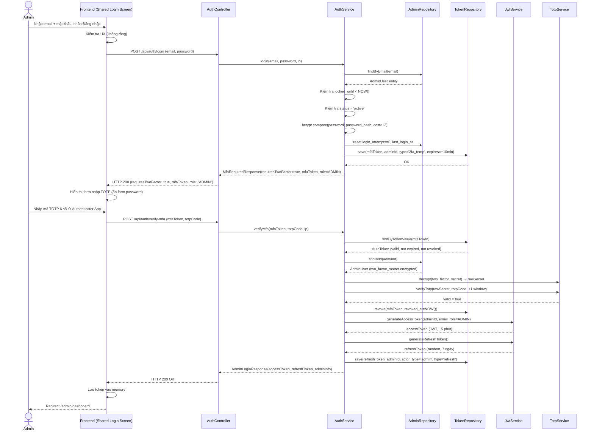
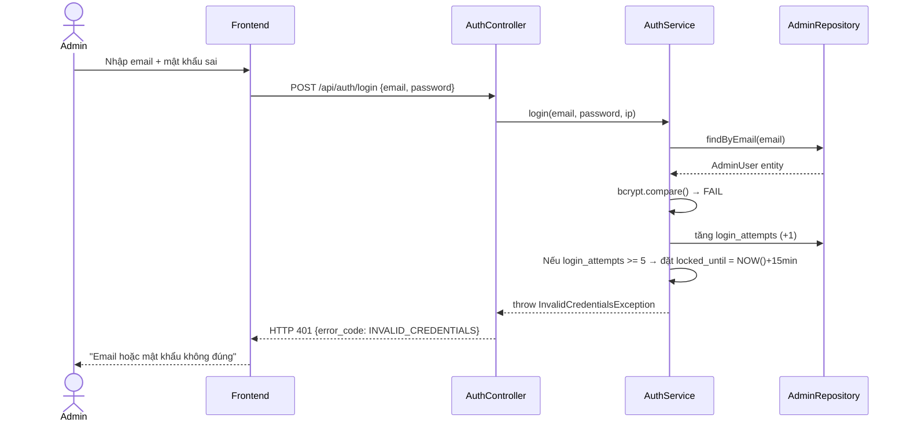
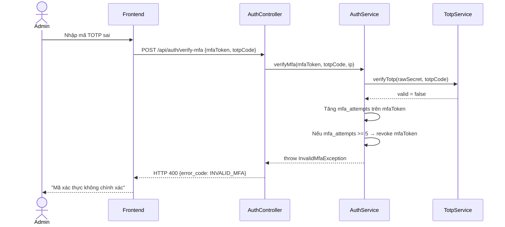

# UC-35 — Đăng Nhập Admin (Admin Login — Shared Login Screen)

> **Feature:** `feat-system-admin` | **Phiên bản:** 1.0 | **Trạng thái:** Draft
> **Tham chiếu FR:** FR-ADMIN-01, FR-ADMIN-02, FR-ADMIN-03
> **Mở rộng từ:** UC-01 (Login) — dùng chung endpoint `POST /api/auth/login`
> **Cập nhật:** 2026-06-01

---

## 1. Tổng Quan

| Thuộc tính | Nội dung |
|:---|:---|
| **Mã Use Case** | UC-35 |
| **Tên** | Đăng Nhập Admin (Admin Login via Shared Login Screen) |
| **Tác nhân chính** | Khách (Guest) — đăng nhập với tài khoản Admin |
| **Mô tả ngắn** | Admin dùng màn hình đăng nhập chung với các role khác. Backend tự phát hiện role theo email, áp dụng luồng 2FA bắt buộc (TOTP) cho Admin, trả JWT với claim `role = ADMIN`. Frontend redirect đến `/admin/dashboard` sau khi xác thực thành công. |
| **Độ ưu tiên** | Rất cao (P0) — cổng vào Admin Panel, bảo mật tuyệt đối |

> **Thiết kế cốt lõi:** Chỉ có **một endpoint** `POST /api/auth/login` cho mọi role. Backend tra cứu email theo thứ tự `admin_users → staff_users → student_users`, từ đó quyết định luồng xử lý. Admin luôn đi qua bước 2FA — không có ngoại lệ.

---

## 2. Tác Nhân & Điều Kiện

### 2.1 Tác Nhân

| Tác nhân | Vai trò |
|:---|:---|
| **Khách (Admin)** | Người chủ động đăng nhập với tài khoản Admin |
| **Authenticator App** | Google Authenticator / Authy — cung cấp mã TOTP 6 số mỗi 30 giây |
| **Hệ thống** | Xác thực credential + TOTP, cấp JWT Admin |

### 2.2 Điều Kiện Tiền Quyết (Preconditions)

- Admin có tài khoản tồn tại trong bảng `admin_users`
- `status = 'active'`
- `two_factor_enabled = 1` và `two_factor_secret` đã được thiết lập (không NULL)
- Admin đã cài đặt Authenticator App và đã quét QR code khi setup 2FA

### 2.3 Hậu Điều Kiện (Postconditions)

- **Thành công:** Bản ghi `auth_tokens` (type `refresh`, `actor_type = 'admin'`) được tạo; JWT access token (15 phút, `role = ADMIN`) được cấp; Admin được chuyển đến `/admin/dashboard`
- **Thất bại (credentials):** `login_attempts` tăng; không tạo bất kỳ token nào; Admin ở lại trang đăng nhập
- **Thất bại (TOTP):** `mfaToken` bị revoke; không tạo JWT cuối; Admin ở lại màn hình nhập TOTP

---

## 3. Luồng Xử Lý

### 3.1 Luồng Chính — Đăng Nhập Admin với 2FA (Happy Path)

```
Bước 1  [Admin]:    Điền email và mật khẩu vào form đăng nhập chung, nhấn "Đăng nhập"
Bước 2  [Frontend]: Kiểm tra UX cơ bản (email không rỗng, mật khẩu không rỗng)
                     Gửi POST /api/auth/login { email, password }
Bước 3  [Backend]:  Validate định dạng request (email format, required fields)
Bước 4  [Backend]:  Tra cứu email theo thứ tự: admin_users → staff_users → student_users
                     → Tìm thấy trong admin_users: đi tiếp luồng Admin
Bước 5  [Backend]:  Kiểm tra locked_until < NOW() hoặc NULL (chưa bị khóa)
Bước 6  [Backend]:  Kiểm tra status = 'active'
Bước 7  [Backend]:  So sánh mật khẩu với bcrypt (cost ≥ 12, theo CONSTITUTION §3.1)
Bước 8  [Backend]:  Đặt login_attempts = 0, cập nhật last_login_at
Bước 9  [Backend]:  Tạo mfaToken ngẫu nhiên (≥ 32 bytes URL-safe), lưu vào auth_tokens
                       (token_type = '2fa_temp', actor_type = 'admin', expires_at = NOW() + 10 phút)
Bước 10 [Backend]:  Trả về HTTP 200 { requiresTwoFactor: true, mfaToken, role: "ADMIN" }
Bước 11 [Frontend]: Phát hiện requiresTwoFactor = true → hiển thị form nhập mã TOTP 6 số
                     (ẩn form email/password, KHÔNG redirect trang mới)
Bước 12 [Admin]:    Mở Authenticator App, lấy mã TOTP 6 số hiện tại
Bước 13 [Admin]:    Nhập mã TOTP vào form, nhấn "Xác nhận"
Bước 14 [Frontend]: Gửi POST /api/auth/verify-mfa { mfaToken, totpCode }
Bước 15 [Backend]:  Tìm mfaToken trong auth_tokens: kiểm tra tồn tại, chưa hết hạn, chưa revoke
Bước 16 [Backend]:  Verify TOTP theo RFC 6238:
                       - Giải mã two_factor_secret (AES-256)
                       - So sánh totpCode với code hiện tại ± 1 window (30 giây)
Bước 17 [Backend]:  Revoke mfaToken (đặt revoked_at = NOW())
Bước 18 [Backend]:  Tạo JWT access token (15 phút, claims: adminId, email, role=ADMIN)
Bước 19 [Backend]:  Tạo refresh token ngẫu nhiên (7 ngày), lưu vào auth_tokens
                       (token_type = 'refresh', actor_type = 'admin')
Bước 20 [Backend]:  Trả về HTTP 200 với accessToken, refreshToken, adminInfo
Bước 21 [Frontend]: Lưu token vào memory, redirect đến /admin/dashboard
```

### 3.2 Luồng Phụ A — Phát Hiện Role Theo Email (Multi-Role Detection)

```
Bước 4 mở rộng:
   AuthService.login(email, password):
   ├── TRY: adminRepo.findByEmail(email)
   │        → Found → goto Admin Flow (UC-35)
   ├── TRY: staffRepo.findByEmail(email)
   │        → Found → goto Staff Flow (UC-36-staff-login, TBD)
   └── TRY: studentRepo.findByEmail(email)
            → Found → goto Student Flow (UC-01)
            → Not found → throw InvalidCredentialsException
```

> **Lưu ý bảo mật:** Kết quả tra cứu KHÔNG được tiết lộ trong thông báo lỗi. Dù email thuộc về admin, staff, hay không tồn tại, thông báo lỗi luôn là "Email hoặc mật khẩu không đúng".

### 3.3 Luồng Lỗi — Sai Mật Khẩu (Bước 7 thất bại)

```
Bước 7→ [Backend]:  bcrypt so sánh thất bại
Bước X  [Backend]:  Tăng login_attempts thêm 1
                     Ghi log: [WARN] [AuthService] Admin login failed {email, ip, attempt_count}
Bước X  [Backend]:  Trả về HTTP 401 — INVALID_CREDENTIALS
                     "Email hoặc mật khẩu không đúng"
```

> **Lưu ý bảo mật:** Không phân biệt "email không tồn tại" vs "sai mật khẩu" để tránh email enumeration.

### 3.4 Luồng Lỗi — Tài Khoản Bị Khóa Tạm Thời (5 lần sai liên tiếp)

```
Bước X  [Backend]:  login_attempts đạt ngưỡng 5
Bước X  [Backend]:  Đặt locked_until = NOW() + 15 phút
                     Ghi log: [WARN] [AuthService] Admin account locked {email, ip}
Bước X  [Backend]:  Trả về HTTP 429 — TOO_MANY_REQUESTS
                     "Tài khoản tạm thời bị khóa. Vui lòng thử lại sau {X} phút"
```

> **Lưu ý:** Mọi lần thử đăng nhập trong thời gian bị khóa đều bị từ chối ngay (kiểm tra `locked_until` **trước** khi so sánh mật khẩu) và KHÔNG tăng thêm `login_attempts`.

### 3.5 Luồng Lỗi — Tài Khoản Bị Đình Chỉ

```
Bước 6  [Backend]:  status = 'suspended'
Bước X  [Backend]:  Ghi log: [WARN] [AuthService] Admin login rejected - suspended {email}
Bước X  [Backend]:  Trả về HTTP 403 — ACCOUNT_SUSPENDED
                     "Tài khoản bị đình chỉ. Lý do: {suspend_reason}"
```

### 3.6 Luồng Lỗi — Sai Mã TOTP (Bước 16 thất bại)

```
Bước 16→ [Backend]: TOTP verify thất bại
Bước X   [Backend]: Ghi log: [WARN] [AdminAuthService] TOTP verification failed {adminId, ip}
Bước X   [Backend]: KHÔNG revoke mfaToken (Admin còn được thử lại trong thời hạn 10 phút)
Bước X   [Backend]: Trả về HTTP 400 — INVALID_MFA
                     "Mã xác thực không chính xác. Vui lòng kiểm tra lại ứng dụng Authenticator."
```

> **Lưu ý:** mfaToken bị giới hạn 5 lần nhập sai TOTP. Sau 5 lần, mfaToken bị revoke và Admin phải đăng nhập lại từ đầu.

### 3.7 Luồng Lỗi — mfaToken Hết Hạn hoặc Không Hợp Lệ

```
Bước 15→ [Backend]: mfaToken không tồn tại / đã hết hạn / đã bị revoke
Bước X   [Backend]: Trả về HTTP 401 — INVALID_MFA_TOKEN
                     "Phiên xác thực đã hết hạn. Vui lòng đăng nhập lại."
Bước X   [Frontend]: Ẩn form TOTP, hiển thị lại form email/password
```

---

## 4. Quy Tắc Nghiệp Vụ

| Mã | Quy tắc | Chi tiết |
|:---|:---|:---|
| BR-35-01 | Admin **BẮT BUỘC** qua 2FA — không có ngoại lệ | `two_factor_enabled = 1` là điều kiện cứng; nếu chưa setup 2FA → từ chối đăng nhập, trả HTTP 403 `TWO_FACTOR_NOT_SETUP` |
| BR-35-02 | `two_factor_secret` phải mã hóa AES-256 trong DB | Giải mã tại Service layer khi verify TOTP; không bao giờ log secret |
| BR-35-03 | mfaToken chỉ dùng được **một lần** và hết hạn sau **10 phút** | Revoke ngay sau khi verify TOTP thành công |
| BR-35-04 | TOTP verify cho phép sai lệch **±1 window (30 giây)** | Bù clock drift thiết bị; không mở rộng hơn |
| BR-35-05 | Sau **5 lần nhập sai TOTP**, mfaToken bị revoke | Admin phải đăng nhập lại từ đầu |
| BR-35-06 | Bộ đếm `login_attempts` chỉ reset khi **credential đúng** (sau Bước 8) | Không reset khi chỉ mới qua password, chưa verify TOTP |
| BR-35-07 | JWT Admin chứa claim `role = "ADMIN"` | Spring Security kiểm tra claim này trên mọi endpoint `/api/admin/**` |
| BR-35-08 | Mật khẩu Admin dùng bcrypt **cost ≥ 12** | Cao hơn mức tối thiểu bcrypt cost 10 cho Student/Staff |
| BR-35-09 | Thông báo lỗi đăng nhập luôn **chung chung** | "Email hoặc mật khẩu không đúng" — không tiết lộ role hay sự tồn tại của email |
| BR-35-10 | Mọi sự kiện đăng nhập Admin phải ghi vào `admin_audit_logs` | Bao gồm: login thành công, thất bại, 2FA thành công, 2FA thất bại |
| BR-35-11 | Rate limit: **5 request/phút/IP** trên endpoint `/api/auth/login` với email Admin | Nghiêm ngặt hơn Student (10 req/phút) |

---

## 5. Quy Tắc Kiểm Tra Đầu Vào

### 5.1 POST /api/auth/login

| Trường | Kiểm tra | Thông báo lỗi nếu sai |
|:---|:---|:---|
| `email` | Bắt buộc, không rỗng | "Email là bắt buộc" |
| `email` | Định dạng email hợp lệ (RFC 5322 cơ bản) | "Email không hợp lệ" |
| `email` | Độ dài tối đa 255 ký tự | "Email quá dài" |
| `password` | Bắt buộc, không rỗng | "Mật khẩu là bắt buộc" |

### 5.2 POST /api/auth/verify-mfa

| Trường | Kiểm tra | Thông báo lỗi nếu sai |
|:---|:---|:---|
| `mfaToken` | Bắt buộc, không rỗng | "Token xác thực không hợp lệ" |
| `totpCode` | Bắt buộc, đúng 6 ký tự số | "Mã xác thực phải gồm 6 chữ số" |

> **Lưu ý:** Validation đầu vào trả về HTTP 400 trước khi truy vấn DB.

---

## 6. Sơ Đồ Tuần Tự (Sequence Diagram)

### 6.1 Luồng Happy Path — Admin Login + 2FA



### 6.2 Luồng Lỗi — Sai Mật Khẩu



### 6.3 Luồng Lỗi — Sai TOTP



---

## 7. Tham Chiếu API

> Xem đặc tả đầy đủ tại [SPEC.md § 6 — API SPEC](./SPEC.md)

| Phương thức | Endpoint | Mô tả | UC |
|:---|:---|:---|:---|
| `POST` | `/api/auth/login` | Đăng nhập chung — phát hiện role tự động | UC-01, UC-35 |
| `POST` | `/api/auth/verify-mfa` | Xác thực TOTP — hoàn tất đăng nhập Admin | UC-35 |
| `POST` | `/api/auth/refresh` | Làm mới access token (dùng chung) | UC-01, UC-35 |
| `POST` | `/api/auth/logout` | Đăng xuất (dùng chung) | UC-18 |

---

## 8. Đặc Tả API Chi Tiết

### `POST /api/auth/login`

> **Mở rộng từ UC-01** — endpoint này xử lý cả Admin, Staff, Student qua role detection.

**Actor:** Guest (tất cả role) | **Auth:** None

**Request:**
```json
{
  "email": "admin@jlpt.com",
  "password": "SecureAdminPass123"
}
```

**Response — Admin (200 OK, 2FA Required):**
```json
{
  "status": 200,
  "message": "Xác thực thành công. Vui lòng nhập mã xác thực 2 yếu tố.",
  "data": {
    "requiresTwoFactor": true,
    "mfaToken": "random_url_safe_string_32bytes",
    "role": "ADMIN"
  }
}
```

**Response — Student/Staff (200 OK, Login Complete):**
```json
{
  "status": 200,
  "message": "Đăng nhập thành công",
  "data": {
    "requiresTwoFactor": false,
    "accessToken": "jwt_token",
    "refreshToken": "refresh_token",
    "role": "STUDENT",
    "user": {
      "id": 1,
      "fullName": "Nguyen Van A",
      "email": "student@jlpt.com",
      "avatarUrl": null
    }
  }
}
```

---

### `POST /api/auth/verify-mfa`

**Actor:** Admin (sau bước 1 login) | **Auth:** None (dùng mfaToken thay thế)

**Request:**
```json
{
  "mfaToken": "random_url_safe_string_32bytes",
  "totpCode": "562914"
}
```

**Response (200 OK):**
```json
{
  "status": 200,
  "message": "Xác thực 2 yếu tố thành công. Chào mừng trở lại.",
  "data": {
    "accessToken": "jwt_token (15 phút, role=ADMIN)",
    "refreshToken": "refresh_token (7 ngày)",
    "admin": {
      "adminId": 1,
      "fullName": "Admin JLPT",
      "email": "admin@jlpt.com"
    }
  }
}
```

---

## 9. Xử Lý Lỗi

| HTTP Code | Error Code | Message | Trigger |
|:---:|:---|:---|:---|
| 400 | `VALIDATION_FAILED` | "Dữ liệu đầu vào không hợp lệ: {field}" | Field thiếu hoặc sai định dạng |
| 400 | `INVALID_MFA` | "Mã xác thực không chính xác. Vui lòng kiểm tra lại ứng dụng Authenticator." | Nhập sai TOTP |
| 400 | `INVALID_TOTP_FORMAT` | "Mã xác thực phải gồm 6 chữ số" | totpCode không phải 6 ký tự số |
| 401 | `INVALID_CREDENTIALS` | "Email hoặc mật khẩu không đúng" | Sai mật khẩu hoặc email không tồn tại |
| 401 | `INVALID_MFA_TOKEN` | "Phiên xác thực đã hết hạn. Vui lòng đăng nhập lại." | mfaToken hết hạn / đã revoke / không tồn tại |
| 403 | `ACCOUNT_SUSPENDED` | "Tài khoản bị đình chỉ. Lý do: {suspend_reason}" | status = 'suspended' |
| 403 | `TWO_FACTOR_NOT_SETUP` | "Tài khoản Admin chưa thiết lập xác thực 2 yếu tố. Liên hệ quản trị viên hệ thống." | two_factor_enabled = 0 hoặc two_factor_secret NULL |
| 429 | `TOO_MANY_REQUESTS` | "Tài khoản tạm thời bị khóa. Vui lòng thử lại sau {X} phút" | login_attempts ≥ 5 |
| 429 | `MFA_TOO_MANY_ATTEMPTS` | "Quá nhiều lần nhập sai mã xác thực. Vui lòng đăng nhập lại từ đầu." | mfa_attempts ≥ 5 trên mfaToken |
| 500 | `INTERNAL_ERROR` | "Internal server error" | Lỗi hệ thống không xác định |

---

## 10. Tiêu Chí Chấp Nhận (Acceptance Criteria)

### AC-35-01 — Đăng nhập Admin thành công, nhận 2FA challenge

> **Tham chiếu:** FR-ADMIN-01

- **Cho trước:** Tài khoản `admin@jlpt.com` tồn tại trong `admin_users`, `status = 'active'`, `two_factor_enabled = 1`, `login_attempts = 0`
- **Khi:** Gửi POST `/api/auth/login` với email và mật khẩu đúng
- **Thì:**
  - Nhận HTTP 200
  - Response chứa `requiresTwoFactor = true`
  - Response chứa `mfaToken` (chuỗi không rỗng)
  - Response chứa `role = "ADMIN"`
  - Bản ghi `auth_tokens` mới (type=`2fa_temp`, actor_type=`admin`) được tạo trong DB
  - `login_attempts` trong DB được đặt về 0
  - `last_login_at` được cập nhật
  - **Không có** `accessToken` hay `refreshToken` trong response này

---

### AC-35-02 — Xác thực TOTP thành công, nhận JWT

> **Tham chiếu:** FR-ADMIN-02

- **Cho trước:** `mfaToken` hợp lệ (còn hạn, chưa revoke), mã TOTP đúng từ Authenticator App
- **Khi:** Gửi POST `/api/auth/verify-mfa` với `mfaToken` và `totpCode` đúng
- **Thì:**
  - Nhận HTTP 200
  - Response chứa `accessToken` (JWT hợp lệ, hết hạn trong 15 phút, claim `role = "ADMIN"`)
  - Response chứa `refreshToken`
  - Response chứa `admin` info (adminId, fullName, email)
  - Bản ghi `mfaToken` trong `auth_tokens` có `revoked_at` được đặt
  - Bản ghi `auth_tokens` mới (type=`refresh`, actor_type=`admin`) được tạo

---

### AC-35-03 — Sai mật khẩu tăng bộ đếm, không trả 2FA challenge

> **Tham chiếu:** FR-ADMIN-03

- **Cho trước:** Tài khoản tồn tại, `login_attempts = 2`
- **Khi:** Gửi POST `/api/auth/login` với mật khẩu sai
- **Thì:**
  - Nhận HTTP 401
  - `error_code = "INVALID_CREDENTIALS"`
  - Thông báo: "Email hoặc mật khẩu không đúng"
  - `login_attempts` trong DB tăng lên 3
  - Không có `mfaToken` trong response
  - Không tạo bản ghi token nào

---

### AC-35-04 — Khóa tài khoản sau 5 lần sai liên tiếp

> **Tham chiếu:** FR-ADMIN-03

- **Cho trước:** `login_attempts = 4`
- **Khi:** Gửi POST `/api/auth/login` với mật khẩu sai lần thứ 5
- **Thì:**
  - Nhận HTTP 429
  - `error_code = "TOO_MANY_REQUESTS"`
  - `locked_until` trong DB = `NOW() + 15 phút`
  - Thông báo chứa số phút cần chờ

---

### AC-35-05 — Không thể đăng nhập khi đang bị khóa (dù mật khẩu đúng)

- **Cho trước:** `locked_until = NOW() + 8 phút`
- **Khi:** Gửi POST `/api/auth/login` với mật khẩu đúng
- **Thì:**
  - Nhận HTTP 429
  - `login_attempts` KHÔNG tăng thêm
  - Không tạo `mfaToken`

---

### AC-35-06 — Sai TOTP không revoke mfaToken ngay (trừ khi đủ 5 lần)

- **Cho trước:** `mfaToken` hợp lệ, chưa hết hạn
- **Khi:** Gửi POST `/api/auth/verify-mfa` với `totpCode` sai (lần đầu)
- **Thì:**
  - Nhận HTTP 400
  - `error_code = "INVALID_MFA"`
  - `mfaToken` vẫn còn hiệu lực trong DB (chưa bị revoke)
  - `mfa_attempts` tăng lên 1

---

### AC-35-07 — Sai TOTP 5 lần — mfaToken bị revoke

- **Cho trước:** mfaToken đã bị thử sai 4 lần
- **Khi:** Gửi POST `/api/auth/verify-mfa` với `totpCode` sai lần thứ 5
- **Thì:**
  - Nhận HTTP 429
  - `error_code = "MFA_TOO_MANY_ATTEMPTS"`
  - `mfaToken` bị revoke trong DB (`revoked_at` được đặt)
  - Admin phải đăng nhập lại từ bước 1

---

### AC-35-08 — mfaToken hết hạn

- **Cho trước:** mfaToken đã tạo > 10 phút trước
- **Khi:** Gửi POST `/api/auth/verify-mfa` với `mfaToken` hết hạn (dù totpCode đúng)
- **Thì:**
  - Nhận HTTP 401
  - `error_code = "INVALID_MFA_TOKEN"`
  - Frontend hiển thị lại form email/password

---

### AC-35-09 — Admin chưa setup 2FA bị từ chối đăng nhập

- **Cho trước:** `two_factor_enabled = 0` hoặc `two_factor_secret IS NULL`
- **Khi:** Gửi POST `/api/auth/login` với credential đúng
- **Thì:**
  - Nhận HTTP 403
  - `error_code = "TWO_FACTOR_NOT_SETUP"`
  - Không cấp bất kỳ token nào

---

### AC-35-10 — Student/Staff không kích hoạt luồng 2FA

- **Cho trước:** Tài khoản `student@jlpt.com` tồn tại trong `student_users`
- **Khi:** Gửi POST `/api/auth/login` với credential đúng
- **Thì:**
  - Nhận HTTP 200
  - `requiresTwoFactor = false`
  - Response chứa `accessToken` và `refreshToken` trực tiếp (không qua 2FA)

---

### AC-35-11 — Audit log được ghi cho mọi sự kiện Admin

- **Cho trước:** Bất kỳ thao tác đăng nhập nào của Admin (thành công/thất bại/2FA)
- **Thì:** Bản ghi mới xuất hiện trong `admin_audit_logs` với thông tin: event_type, admin_id (nếu có), ip_address, timestamp, result

---

## 11. Ngoài Phạm Vi (Out of Scope)

- ❌ Setup/enroll 2FA ban đầu cho Admin — đây là tác vụ Admin Management, không phải Login
- ❌ Recovery code khi mất Authenticator App — Phase 2
- ❌ Push notification 2FA (approve/deny trên mobile) — Phase 2
- ❌ "Remember this device" (bỏ qua 2FA trên thiết bị đã tin) — Phase 2
- ❌ Login qua Google OAuth cho Admin — Admin chỉ dùng Email/Password + TOTP
- ❌ Logout admin — xem UC-18 (dùng chung endpoint `/api/auth/logout`)
- ❌ Refresh token Admin — xem UC-01 (dùng chung endpoint `/api/auth/refresh`)
