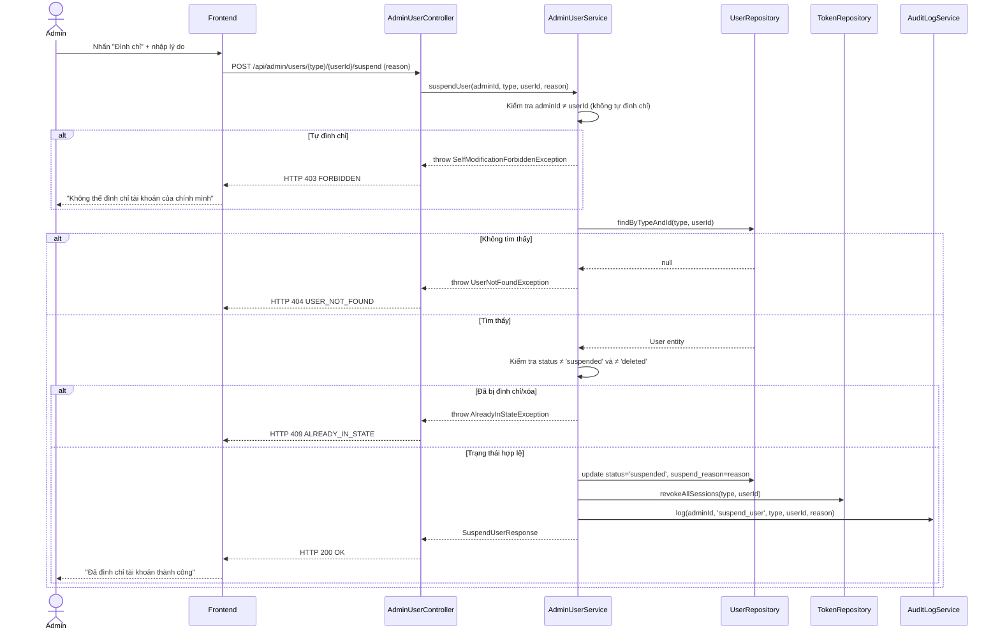
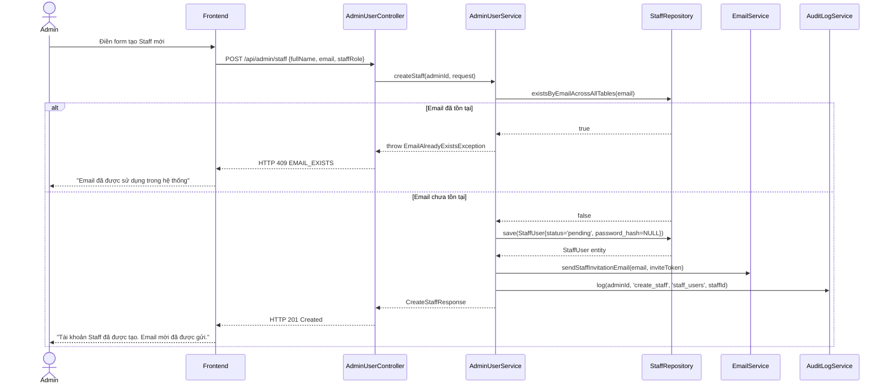

# UC-37 — Quản Lý Người Dùng (Admin Manage Users)

> **Feature:** `feat-system-admin` | **Phiên bản:** 1.0 | **Trạng thái:** Draft
> **Tham chiếu FR:** FR-ADMIN-10, FR-ADMIN-11, FR-ADMIN-12, FR-ADMIN-13 → FR-ADMIN-30
> **Cập nhật:** 2026-05-30

---

## 1. Tổng Quan

| Thuộc tính | Nội dung |
|:---|:---|
| **Mã Use Case** | UC-37 |
| **Tên** | Quản Lý Người Dùng (Admin Manage Users) |
| **Tác nhân chính** | Admin — đã đăng nhập |
| **Mô tả ngắn** | Admin quản lý toàn bộ tài khoản trong hệ thống: Student, Staff và Admin. Bao gồm xem danh sách, xem chi tiết, tạo Staff mới, chỉnh sửa thông tin, đình chỉ/kích hoạt, đặt lại mật khẩu, xóa mềm và chuyển đổi vai trò Staff. |
| **Độ ưu tiên** | Cao (P1) — cần thiết để vận hành và kiểm soát người dùng toàn hệ thống |

---

## 2. Tác Nhân & Điều Kiện

### 2.1 Tác Nhân

| Tác nhân | Vai trò |
|:---|:---|
| **Admin** | Thực hiện toàn bộ thao tác quản trị người dùng |
| **Hệ thống Email (SMTP)** | Gửi email thông báo khi Admin đặt lại mật khẩu hoặc tạo tài khoản |

### 2.2 Điều Kiện Tiền Quyết (Preconditions)

- Admin đã đăng nhập thành công (có JWT hợp lệ với role `ADMIN`)
- Tài khoản Admin đang ở trạng thái `active`

### 2.3 Hậu Điều Kiện (Postconditions)

- **Thành công:** Dữ liệu được cập nhật trong DB; mọi thao tác được ghi vào `admin_audit_logs`
- **Thất bại:** Không thay đổi dữ liệu; lỗi trả về rõ ràng kèm mã lỗi

---

## 3. Phạm Vi Quản Lý

| Loại người dùng | Bảng | Thao tác được phép |
|:---|:---|:---|
| **Student** | `student_users` | Xem danh sách, Xem chi tiết, Đình chỉ, Kích hoạt, Đặt lại mật khẩu, Xóa mềm |
| **Staff** | `staff_users` | Xem danh sách, Xem chi tiết, Tạo mới, Chỉnh sửa, Đình chỉ, Kích hoạt, Đặt lại mật khẩu, Xóa mềm, Chuyển đổi vai trò |
| **Admin** | `admin_users` | Xem danh sách, Xem chi tiết (Không tạo/xóa Admin khác qua API này) |

---

## 4. Các Luồng Xử Lý

### 4.1 UC-37-01 — Xem Danh Sách Người Dùng

```
Bước 1 [Admin]:    Chọn loại người dùng (Student / Staff / Admin), tùy chọn nhập từ khóa tìm kiếm và bộ lọc
Bước 2 [Frontend]: Gửi GET /api/admin/users?type={student|staff|admin}&q={query}&status={}&page=0&size=20
Bước 3 [Backend]:  Validate params; truy vấn bảng tương ứng với phân trang
Bước 4 [Backend]:  Map sang DTO (KHÔNG trả password_hash, two_factor_secret)
Bước 5 [Backend]:  Trả về HTTP 200 với danh sách phân trang
Bước 6 [Frontend]: Hiển thị bảng danh sách người dùng
```

**Bộ lọc hỗ trợ:**
- `type`: `student` | `staff` | `admin` (bắt buộc)
- `q`: tìm theo `full_name` hoặc `email` (tùy chọn, LIKE)
- `status`: `active` | `suspended` | `pending` | `deleted` (tùy chọn)
- `jlptLevel`: `N5`–`N1` (chỉ áp dụng cho Student)
- `staffRole`: `staff` | `staff_manager` (chỉ áp dụng cho Staff)
- `page`, `size`: phân trang (mặc định page=0, size=20)

---

### 4.2 UC-37-02 — Xem Chi Tiết Người Dùng

```
Bước 1 [Admin]:    Nhấn vào một người dùng trong danh sách
Bước 2 [Frontend]: Gửi GET /api/admin/users/{type}/{userId}
Bước 3 [Backend]:  Tìm user theo type và userId
Bước 4 [Backend]:  Trả về DTO đầy đủ (trừ password_hash, two_factor_secret)
Bước 5 [Frontend]: Hiển thị trang hồ sơ chi tiết
```

---

### 4.3 UC-37-03 — Tạo Tài Khoản Staff Mới

```
Bước 1 [Admin]:    Điền form tạo Staff: fullName, email, staffRole (staff | staff_manager)
Bước 2 [Frontend]: Validate UX cơ bản, gửi POST /api/admin/staff
Bước 3 [Backend]:  Validate: email chưa tồn tại trong staff_users hoặc student_users hoặc admin_users
Bước 4 [Backend]:  Tạo bản ghi staff_users mới:
                     - status = 'pending'
                     - password_hash = NULL (chưa đặt mật khẩu)
                     - email_verified_at = NULL
Bước 5 [Backend]:  Tạo token email_verification, lưu vào auth_tokens (expires 24h)
Bước 6 [Backend]:  Gửi email mời kèm link đặt mật khẩu lần đầu
Bước 7 [Backend]:  Ghi audit log: action = 'create_staff', target_id = staff_id
Bước 8 [Backend]:  Trả về HTTP 201 kèm thông tin Staff mới (không có mật khẩu)
```

---

### 4.4 UC-37-04 — Chỉnh Sửa Thông Tin Người Dùng

```
Bước 1 [Admin]:    Chỉnh sửa các trường cho phép trên form
Bước 2 [Frontend]: Gửi PUT /api/admin/users/{type}/{userId}
Bước 3 [Backend]:  Validate:
                     - Admin không được chỉnh sửa tài khoản chính mình (kiểm tra admin_id từ JWT)
                     - Không cho phép thay đổi email hoặc role thông qua endpoint này
Bước 4 [Backend]:  Cập nhật các trường được phép vào bảng tương ứng
Bước 5 [Backend]:  Ghi audit log: action = 'update_user', target_id, description = các field thay đổi
Bước 6 [Backend]:  Trả về HTTP 200 kèm thông tin đã cập nhật
```

**Trường được phép chỉnh sửa:**
- Student: `full_name`, `phone`, `target_jlpt_level`
- Staff: `full_name`
- Admin: không cho phép chỉnh sửa thông tin Admin khác qua endpoint này

---

### 4.5 UC-37-05 — Đình Chỉ Tài Khoản (Suspend)

```
Bước 1 [Admin]:    Nhấn "Đình chỉ", nhập lý do (bắt buộc)
Bước 2 [Frontend]: Gửi POST /api/admin/users/{type}/{userId}/suspend { reason }
Bước 3 [Backend]:  Validate:
                     - Admin không được tự đình chỉ tài khoản của chính mình
                     - Tài khoản chưa ở trạng thái 'suspended' hoặc 'deleted'
                     - reason không rỗng, từ 10 đến 500 ký tự
Bước 4 [Backend]:  Cập nhật status = 'suspended', suspend_reason = reason
Bước 5 [Backend]:  Revoke toàn bộ session token trong auth_tokens (revoked_at = NOW())
Bước 6 [Backend]:  Ghi audit log: action = 'suspend_user', description = reason
Bước 7 [Backend]:  Trả về HTTP 200
```

---

### 4.6 UC-37-06 — Kích Hoạt Lại Tài Khoản (Activate)

```
Bước 1 [Admin]:    Nhấn "Kích hoạt" trên tài khoản đang bị đình chỉ
Bước 2 [Frontend]: Gửi POST /api/admin/users/{type}/{userId}/activate
Bước 3 [Backend]:  Validate: tài khoản đang ở trạng thái 'suspended'
Bước 4 [Backend]:  Cập nhật status = 'active', xóa suspend_reason
Bước 5 [Backend]:  Ghi audit log: action = 'activate_user'
Bước 6 [Backend]:  Trả về HTTP 200
```

---

### 4.7 UC-37-07 — Đặt Lại Mật Khẩu (Admin-initiated Reset Password)

```
Bước 1 [Admin]:    Nhấn "Đặt lại mật khẩu" trên trang hồ sơ người dùng
Bước 2 [Frontend]: Gửi POST /api/admin/users/{type}/{userId}/reset-password
Bước 3 [Backend]:  Validate: user tồn tại, status = 'active' hoặc 'pending'
Bước 4 [Backend]:  Tạo password_reset token ngẫu nhiên (≥ 32 bytes URL-safe), expires 15 phút
                    Lưu vào auth_tokens (token_type = 'password_reset')
                    Revoke toàn bộ session token hiện có của user
Bước 5 [Backend]:  Gửi email chứa link đặt lại mật khẩu đến địa chỉ email của user
Bước 6 [Backend]:  Ghi audit log: action = 'reset_password_initiated', target_id
Bước 7 [Backend]:  Trả về HTTP 200 ("Email đặt lại mật khẩu đã được gửi")
```

> **Lưu ý bảo mật:** Admin KHÔNG được phép đặt trực tiếp mật khẩu mới cho người dùng. Toàn bộ quá trình phải qua email để đảm bảo người dùng tự đặt mật khẩu mới.

---

### 4.8 UC-37-08 — Xóa Mềm Tài Khoản (Soft Delete)

```
Bước 1 [Admin]:    Nhấn "Xóa tài khoản", xác nhận hộp thoại cảnh báo
Bước 2 [Frontend]: Gửi DELETE /api/admin/users/{type}/{userId}
Bước 3 [Backend]:  Validate:
                     - Admin không được xóa tài khoản của chính mình
                     - Tài khoản chưa ở trạng thái 'deleted'
Bước 4 [Backend]:  Cập nhật status = 'deleted' (KHÔNG xóa bản ghi khỏi DB)
Bước 5 [Backend]:  Revoke toàn bộ session token
Bước 6 [Backend]:  Ghi audit log: action = 'soft_delete_user'
Bước 7 [Backend]:  Trả về HTTP 200
```

> **Nguyên tắc ADR-004:** Tuyệt đối không dùng `DELETE FROM`. Soft delete bằng `status = 'deleted'`.

---

### 4.9 UC-37-09 — Chuyển Đổi Vai Trò Staff

```
Bước 1 [Admin]:    Chọn vai trò mới (staff | staff_manager) trên trang hồ sơ Staff
Bước 2 [Frontend]: Gửi PUT /api/admin/staff/{staffId}/role { staffRole }
Bước 3 [Backend]:  Validate: staffRole chỉ nhận 'staff' hoặc 'staff_manager'
Bước 4 [Backend]:  Cập nhật staff_users.staff_role
Bước 5 [Backend]:  Ghi audit log: action = 'change_staff_role', description = old → new role
Bước 6 [Backend]:  Trả về HTTP 200
```

---

## 5. Quy Tắc Nghiệp Vụ

| Mã | Quy tắc | Chi tiết |
|:---|:---|:---|
| BR-37-01 | Admin **không được** tự thao tác lên tài khoản của chính mình | Ngăn chặn lock-out; kiểm tra `admin_id` từ JWT so với `target_id` |
| BR-37-02 | Không cho phép thay đổi `email` của bất kỳ tài khoản nào qua API này | Email là định danh không đổi; thay đổi email yêu cầu quy trình xác minh riêng |
| BR-37-03 | Mọi thao tác thay đổi trạng thái/quyền **phải** ghi vào `admin_audit_logs` | Audit log là bắt buộc, không được bỏ qua dù thao tác thành công hay thất bại |
| BR-37-04 | Tài khoản ở trạng thái `deleted` **không được phục hồi** qua giao diện cơ bản | Phục hồi tài khoản đã xóa là tác vụ đặc biệt, cần quy trình riêng |
| BR-37-05 | Admin đặt lại mật khẩu **không được** đặt trực tiếp — phải qua email | Đảm bảo người dùng tự kiểm soát mật khẩu của mình |
| BR-37-06 | Khi đình chỉ/xóa tài khoản, **toàn bộ** session token phải bị revoke ngay lập tức | Không để tài khoản bị khóa vẫn có phiên làm việc hoạt động |
| BR-37-07 | `suspend_reason` bắt buộc khi đình chỉ, từ **10 đến 500 ký tự** | Đảm bảo tính minh bạch và trách nhiệm giải trình |
| BR-37-08 | Không được tạo tài khoản Admin mới qua API này | Tài khoản Admin được tạo thủ công qua script khởi tạo hệ thống |
| BR-37-09 | `password_hash` và `two_factor_secret` **không bao giờ** được trả về trong response | Tuân thủ nguyên tắc không lộ thông tin nhạy cảm |

---

## 6. Quy Tắc Kiểm Tra Đầu Vào

### Tạo Staff mới (UC-37-03)

| Trường | Kiểm tra | Thông báo lỗi |
|:---|:---|:---|
| `fullName` | Bắt buộc, 2–150 ký tự | "Họ tên là bắt buộc và không vượt quá 150 ký tự" |
| `email` | Bắt buộc, định dạng email hợp lệ, tối đa 255 ký tự | "Email không hợp lệ" |
| `email` | Chưa tồn tại trong bất kỳ bảng user nào | "Email đã được sử dụng trong hệ thống" |
| `staffRole` | Bắt buộc, chỉ nhận `staff` hoặc `staff_manager` | "Vai trò Staff không hợp lệ" |

### Đình chỉ tài khoản (UC-37-05)

| Trường | Kiểm tra | Thông báo lỗi |
|:---|:---|:---|
| `reason` | Bắt buộc, 10–500 ký tự | "Lý do đình chỉ phải từ 10 đến 500 ký tự" |

### Chỉnh sửa thông tin (UC-37-04)

| Trường | Kiểm tra | Thông báo lỗi |
|:---|:---|:---|
| `fullName` | Không rỗng nếu có, 2–150 ký tự | "Họ tên không hợp lệ" |
| `phone` | Định dạng số điện thoại hợp lệ nếu có, tối đa 20 ký tự | "Số điện thoại không hợp lệ" |
| `targetJlptLevel` | Trong tập `N5, N4, N3, N2, N1` nếu có | "Cấp độ JLPT không hợp lệ" |

---

## 7. Sơ Đồ Tuần Tự (Sequence Diagram)

### 7.1 Đình Chỉ Tài Khoản (Suspend)



### 7.2 Tạo Staff Mới



---

## 8. Tham Chiếu API

### `GET /api/admin/users`
**Actor:** Admin | **Auth:** Bearer JWT

**Query params:** `type`, `q`, `status`, `jlptLevel`, `staffRole`, `page`, `size`

**Response (200):**
```json
{
  "status": 200,
  "message": "OK",
  "data": {
    "content": [
      {
        "userId": 12,
        "userType": "student",
        "fullName": "Nguyen Van A",
        "email": "student@example.com",
        "status": "active",
        "currentJlptLevel": "N3",
        "createdAt": "2026-01-10T09:00:00Z"
      }
    ],
    "totalElements": 320,
    "totalPages": 16
  }
}
```

---

### `GET /api/admin/users/{type}/{userId}`
**Actor:** Admin | **Auth:** Bearer JWT

**Path params:** `type` = `student` | `staff` | `admin`, `userId` = Long

**Response (200) — Student:**
```json
{
  "status": 200,
  "message": "OK",
  "data": {
    "studentId": 12,
    "fullName": "Nguyen Van A",
    "email": "student@example.com",
    "phone": "0901234567",
    "avatarUrl": "/uploads/avatars/12.jpg",
    "status": "active",
    "suspendReason": null,
    "currentJlptLevel": "N3",
    "targetJlptLevel": "N2",
    "currentStreak": 7,
    "longestStreak": 20,
    "lastLoginAt": "2026-05-29T08:00:00Z",
    "createdAt": "2026-01-10T09:00:00Z"
  }
}
```

---

### `POST /api/admin/staff`
**Actor:** Admin | **Auth:** Bearer JWT

**Request:**
```json
{
  "fullName": "Tran Thi B",
  "email": "staff_b@jlpt.com",
  "staffRole": "staff"
}
```

**Response (201):**
```json
{
  "status": 201,
  "message": "Tạo tài khoản Staff thành công. Email mời đã được gửi.",
  "data": {
    "staffId": 5,
    "fullName": "Tran Thi B",
    "email": "staff_b@jlpt.com",
    "staffRole": "staff",
    "status": "pending"
  }
}
```

---

### `PUT /api/admin/users/{type}/{userId}`
**Actor:** Admin | **Auth:** Bearer JWT

**Request (Student):**
```json
{
  "fullName": "Nguyen Van A (Updated)",
  "phone": "0987654321",
  "targetJlptLevel": "N2"
}
```

**Response (200):**
```json
{
  "status": 200,
  "message": "Cập nhật thông tin người dùng thành công",
  "data": { "...UserDetailResponse..." }
}
```

---

### `POST /api/admin/users/{type}/{userId}/suspend`
**Actor:** Admin | **Auth:** Bearer JWT

**Request:**
```json
{
  "reason": "Vi phạm điều khoản sử dụng: spam câu hỏi và nội dung không phù hợp."
}
```

**Response (200):**
```json
{
  "status": 200,
  "message": "Đã đình chỉ tài khoản thành công",
  "data": {
    "userId": 12,
    "userType": "student",
    "status": "suspended",
    "suspendReason": "Vi phạm điều khoản sử dụng: spam câu hỏi và nội dung không phù hợp.",
    "suspendedAt": "2026-05-30T10:00:00Z"
  }
}
```

---

### `POST /api/admin/users/{type}/{userId}/activate`
**Actor:** Admin | **Auth:** Bearer JWT

**Response (200):**
```json
{
  "status": 200,
  "message": "Đã kích hoạt lại tài khoản thành công",
  "data": {
    "userId": 12,
    "userType": "student",
    "status": "active",
    "activatedAt": "2026-05-30T10:30:00Z"
  }
}
```

---

### `POST /api/admin/users/{type}/{userId}/reset-password`
**Actor:** Admin | **Auth:** Bearer JWT

**Response (200):**
```json
{
  "status": 200,
  "message": "Email đặt lại mật khẩu đã được gửi đến người dùng",
  "data": null
}
```

---

### `DELETE /api/admin/users/{type}/{userId}`
**Actor:** Admin | **Auth:** Bearer JWT

**Response (200):**
```json
{
  "status": 200,
  "message": "Đã xóa tài khoản thành công (soft delete)",
  "data": {
    "userId": 12,
    "userType": "student",
    "status": "deleted",
    "deletedAt": "2026-05-30T11:00:00Z"
  }
}
```

---

### `PUT /api/admin/staff/{staffId}/role`
**Actor:** Admin | **Auth:** Bearer JWT

**Request:**
```json
{
  "staffRole": "staff_manager"
}
```

**Response (200):**
```json
{
  "status": 200,
  "message": "Đã cập nhật vai trò Staff thành công",
  "data": {
    "staffId": 5,
    "oldRole": "staff",
    "newRole": "staff_manager",
    "updatedAt": "2026-05-30T10:00:00Z"
  }
}
```

---

## 9. Xử Lý Lỗi

| HTTP Code | Error Code | Message | Trigger |
|:---:|:---|:---|:---|
| 400 | `VALIDATION_FAILED` | "Dữ liệu đầu vào không hợp lệ: {field}" | Trường thiếu hoặc sai định dạng |
| 400 | `INVALID_USER_TYPE` | "Loại người dùng không hợp lệ" | `type` không phải `student\|staff\|admin` |
| 400 | `INVALID_STAFF_ROLE` | "Vai trò Staff không hợp lệ" | `staffRole` ngoài `staff\|staff_manager` |
| 401 | `UNAUTHORIZED` | "Yêu cầu đăng nhập" | JWT thiếu hoặc hết hạn |
| 403 | `FORBIDDEN` | "Tài khoản không có quyền Admin" | Role ≠ ADMIN |

| 403 | `SELF_MODIFICATION_FORBIDDEN` | "Không thể thực hiện thao tác này lên tài khoản của chính mình" | Admin thao tác lên chính mình |
| 404 | `USER_NOT_FOUND` | "Không tìm thấy người dùng" | `userId` không tồn tại hoặc đã xóa |
| 409 | `EMAIL_EXISTS` | "Email đã được sử dụng trong hệ thống" | Tạo Staff với email trùng |
| 409 | `ALREADY_IN_STATE` | "Tài khoản đã ở trạng thái này rồi" | Đình chỉ tài khoản đã suspended, hoặc kích hoạt tài khoản đã active |
| 422 | `CANNOT_DELETE_ACTIVE_ADMIN` | "Không thể xóa tài khoản Admin đang hoạt động qua giao diện này" | Xóa Admin (được bảo vệ) |
| 500 | `INTERNAL_ERROR` | "Internal server error" | Lỗi hệ thống |

---

## 10. Tiêu Chí Chấp Nhận (Acceptance Criteria)

### AC-37-01 — Xem danh sách Student có bộ lọc

- **Cho trước:** Có 320 học viên, trong đó 50 ở trạng thái `suspended`, 200 ở cấp độ N3
- **Khi:** GET `/api/admin/users?type=student&status=suspended&jlptLevel=N3&page=0&size=20`
- **Thì:**
  - Nhận HTTP 200
  - `data.content` chứa đúng học viên bị suspend ở cấp N3, tối đa 20 bản ghi
  - Không có trường `password_hash` trong response

---

### AC-37-02 — Tạo Staff mới thành công

- **Cho trước:** Email `new_staff@jlpt.com` chưa tồn tại trong hệ thống
- **Khi:** POST `/api/admin/staff` với `{fullName, email, staffRole: "staff"}`
- **Thì:**
  - Nhận HTTP 201
  - Bản ghi `staff_users` mới được tạo với `status = 'pending'`, `password_hash = NULL`
  - Email mời được gửi đến `new_staff@jlpt.com`
  - Audit log ghi nhận `action = 'create_staff'`

---

### AC-37-03 — Tạo Staff với email đã tồn tại

- **Cho trước:** `email@example.com` đã tồn tại trong `student_users`
- **Khi:** POST `/api/admin/staff` với email đó
- **Thì:**
  - Nhận HTTP 409, `error_code = "EMAIL_EXISTS"`
  - Không tạo bản ghi nào trong DB

---

### AC-37-04 — Đình chỉ tài khoản thành công

- **Cho trước:** Student ID 12 đang `active`, có 2 session token hoạt động
- **Khi:** POST `/api/admin/users/student/12/suspend` với `reason` hợp lệ (≥ 10 ký tự)
- **Thì:**
  - Nhận HTTP 200
  - `student_users.status = 'suspended'`, `suspend_reason` được lưu
  - Cả 2 session token trong `auth_tokens` có `revoked_at` được đặt
  - Audit log ghi nhận `action = 'suspend_user'`

---

### AC-37-05 — Admin không tự đình chỉ tài khoản mình

- **Cho trước:** Admin đang đăng nhập với `admin_id = 1`
- **Khi:** POST `/api/admin/users/admin/1/suspend`
- **Thì:**
  - Nhận HTTP 403, `error_code = "SELF_MODIFICATION_FORBIDDEN"`
  - Không có thay đổi nào trong DB

---

### AC-37-06 — Đặt lại mật khẩu qua email

- **Cho trước:** Staff ID 5, `status = 'active'`, email hợp lệ
- **Khi:** POST `/api/admin/users/staff/5/reset-password`
- **Thì:**
  - Nhận HTTP 200
  - Token `password_reset` mới tạo trong `auth_tokens` (expires 15 phút)
  - Toàn bộ session token hiện có bị revoke
  - Email được gửi đến staff
  - Audit log ghi nhận `action = 'reset_password_initiated'`

---

### AC-37-07 — Xóa mềm tài khoản

- **Cho trước:** Student ID 15, `status = 'suspended'`
- **Khi:** DELETE `/api/admin/users/student/15`
- **Thì:**
  - Nhận HTTP 200
  - `student_users.status = 'deleted'` (bản ghi VẪN tồn tại trong DB)
  - Toàn bộ session token bị revoke
  - Audit log ghi nhận `action = 'soft_delete_user'`

---

### AC-37-08 — Chuyển đổi vai trò Staff

- **Cho trước:** Staff ID 5, `staff_role = 'staff'`
- **Khi:** PUT `/api/admin/staff/5/role` với `{ "staffRole": "staff_manager" }`
- **Thì:**
  - Nhận HTTP 200
  - `staff_users.staff_role = 'staff_manager'`
  - Audit log ghi nhận `action = 'change_staff_role'`, `description = 'staff → staff_manager'`

---

### AC-37-09 — Kích hoạt tài khoản đã active bị từ chối

- **Cho trước:** Student ID 12, `status = 'active'`
- **Khi:** POST `/api/admin/users/student/12/activate`
- **Thì:**
  - Nhận HTTP 409, `error_code = "ALREADY_IN_STATE"`
  - Không có thay đổi nào trong DB

---

## 11. Non-Functional Requirements

| ID | Category | Requirement |
|:---|:---|:---|
| NFR-37-01 | Performance | API danh sách phân trang phải phản hồi < 500ms (p95) với 100,000 users |
| NFR-37-02 | Security | Mọi endpoint phải xác thực JWT + role ADMIN |
| NFR-37-03 | Security | `password_hash`, `two_factor_secret` không bao giờ được xuất hiện trong bất kỳ response nào |
| NFR-37-04 | Security | Session revoke khi suspend/delete phải xảy ra trong cùng một transaction với thay đổi status |
| NFR-37-05 | Logging | 100% thao tác thay đổi dữ liệu phải ghi vào `admin_audit_logs` với `admin_actor_id`, `action`, `target_table`, `target_id` |
| NFR-37-06 | Data Integrity | Soft delete không được xóa dữ liệu học tập liên quan (quiz attempts, progress) — chỉ đổi status |

---

## 12. Ngoài Phạm Vi (Out of Scope)

- ❌ Tạo tài khoản Admin mới qua API — chỉ tạo thủ công qua script khởi tạo hệ thống
- ❌ Khôi phục tài khoản đã xóa mềm (`status = 'deleted'`) qua giao diện này
- ❌ Import/Export danh sách người dùng hàng loạt (bulk import/export) — Phase 2
- ❌ Phân tích hành vi người dùng (behavior analytics) — xem `feat-learning-analytics`
- ❌ Giao tiếp trực tiếp với học viên/staff qua email tùy ý — chỉ các email hệ thống định sẵn
- ❌ Chỉnh sửa email của người dùng — email là định danh bất biến
