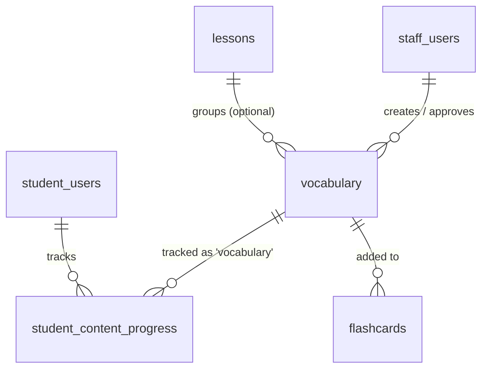

# SPEC — Học Từ Vựng (Vocabulary)
> **Feature ID:** `feat-vocabulary`
> **UC Coverage:** UC-09 (Học Từ vựng theo Level/Topic)
> **Version:** 1.0 | **Status:** Draft
> **Author:** Team | **Last Updated:** 2026-06-12
> **Liên quan:** `feat-core-learning/SPEC.md` (UC-09 tổng quan) · `feat-flashcard-srs/SPEC.md` · `feat-content-management/SPEC.md`
> **Frontend ref:** `frontend/feat-student/SPEC-vocabulary.md`

---

## 1. CONTEXT & GOAL

### 1.1 Bối cảnh
Từ vựng (語彙) là một trong bốn khối kiến thức nền tảng của lộ trình JLPT (cùng Kanji, Kana, Ngữ pháp). Học viên cần một kho từ vựng được tổ chức **theo cấp độ N5→N1** và **theo chủ đề (topic)** — ví dụ: Gia đình, Đồ ăn, Du lịch, Thời gian, Cơ thể — để học có hệ thống thay vì học rời rạc. Mô hình tổ chức này **tương tự module Kanji** (lọc theo `jlpt_level`), nhưng bổ sung thêm trục **topic** cho phép lọc đa chiều.

Spec này tách riêng khỏi `feat-core-learning` để mô tả **chuyên sâu** luồng học từ vựng phía học viên: liệt kê, lọc theo level + topic + từ khóa, xem chi tiết, phát âm, đánh dấu đã học, và thêm vào Flashcard.

### 1.2 Mục tiêu
- Cung cấp danh sách từ vựng `published` lọc đồng thời theo **`jlpt_level`** và **`topic`**, có phân trang và tìm kiếm.
- Hiển thị chi tiết một từ: `word`, `furigana`, `meaning` (Tiếng Việt), `word_type`, `audio_url`, câu ví dụ song ngữ (JP + VI).
- Theo dõi tiến độ học từng từ qua `student_content_progress` với `content_type = 'vocabulary'` (upsert, không giảm thủ công).
- Cho phép "Thêm vào Flashcard" để tạo bản ghi `flashcards`.
- Cung cấp danh sách topic khả dụng theo level để dựng bộ lọc.

### 1.3 Tại sao cần?
Từ vựng là khối kiến thức có khối lượng lớn nhất (mỗi level hàng trăm tới hàng nghìn từ). Tổ chức theo level + topic giúp học viên **học đúng phạm vi thi**, theo dõi được tiến độ, và liên kết trực tiếp sang Flashcard/SRS — tăng tỉ lệ ghi nhớ và giữ chân người học. Đây là core value của nền tảng (xem `AGENTS.md §1`).

---

## 2. ACTOR

| Actor | Role | Điều kiện tiền quyết |
|:---|:---|:---|
| **Student** | Học viên đọc/ học từ vựng, đánh dấu tiến độ, thêm Flashcard | Đã đăng nhập (JWT hợp lệ), `status = 'active'` |
| **Staff** | Tạo/chỉnh sửa/duyệt từ vựng (CRUD) | Ngoài phạm vi spec này — xem `feat-content-management` |
| **System (Scheduler/CDN)** | Phục vụ `audio_url` qua storage/CDN | Không tương tác trực tiếp người dùng |

> Phân quyền theo **Role + Subscription/Level** (xem `CLAUDE.md` LESSON-003, `AGENTS.md §7.3`). Nội dung `is_vip_only = 1` yêu cầu subscription VIP còn hiệu lực.

---

## 3. FUNCTIONAL REQUIREMENTS (EARS)

> **EARS Syntax:**
> - `WHEN [trigger] THE SYSTEM SHALL [behavior]`
> - `WHILE [state] THE SYSTEM SHALL [behavior]`
> - `IF [condition] THEN THE SYSTEM SHALL [response]`
> - `THE SYSTEM SHALL [ubiquitous requirement]`

### 3.1 Liệt kê & Lọc theo Level / Topic (Happy Path)

| ID | EARS Requirement |
|:---|:---|
| FR-VOC-01 | WHEN an authenticated Student selects a JLPT level (`N5`–`N1`), THE SYSTEM SHALL return a paginated list of `vocabulary` filtered by `jlpt_level` with `status = 'published'`. |
| FR-VOC-02 | WHEN a Student selects a `topic` in addition to a level, THE SYSTEM SHALL filter vocabulary by **both** `jlpt_level` AND `topic` simultaneously. |
| FR-VOC-03 | WHEN a Student provides a `search` keyword, THE SYSTEM SHALL match it against `word`, `furigana`, and `meaning` (case-insensitive, partial match) within the current level/topic filter. |
| FR-VOC-04 | THE SYSTEM SHALL paginate results with default `size = 20`, `max size = 50`, and SHALL return `totalElements`, `totalPages`, and `completedCount` (số từ Student đã hoàn thành trong phạm vi lọc). |
| FR-VOC-05 | WHEN a Student requests the topic list for a level, THE SYSTEM SHALL return the distinct set of `topic` values that have at least one `published` vocabulary item at that `jlpt_level`. |
| FR-VOC-06 | WHEN a Student opens a vocabulary detail, THE SYSTEM SHALL return: `word`, `furigana`, `meaning`, `word_type`, `jlpt_level`, `topic`, `audio_url`, `example_sentence_jp`, `example_sentence_vi`, and the Student's `progressStatus` (nullable). |
| FR-VOC-07 | THE SYSTEM SHALL serve `audio_url` as a static/CDN URL (stored in `/uploads` or S3) and SHALL allow the browser to play it directly without a separate API call. |

### 3.2 Tiến độ & Flashcard

| ID | EARS Requirement |
|:---|:---|
| FR-VOC-10 | WHEN a Student marks a vocabulary item as `completed`, THE SYSTEM SHALL upsert a `student_content_progress` record with `content_type = 'vocabulary'`, `content_id = vocabulary_id`, enforcing `UNIQUE (student_id, content_type, content_id)`. |
| FR-VOC-11 | THE SYSTEM SHALL track `progress_percent` (0–100) incrementally and SHALL NOT allow `progress_percent` or `status` to regress (e.g. từ `completed` về `learning`) thông qua API thông thường. |
| FR-VOC-12 | WHEN a Student clicks "Add to Flashcard" on a vocabulary item, THE SYSTEM SHALL create a `flashcards` record with `content_type = 'vocabulary'` linked to the Student's personal deck. |
| FR-VOC-13 | WHEN a Student returns to a vocabulary list, THE SYSTEM SHALL annotate each item with `isCompleted` and `isInFlashcard` reflecting that Student's state. |
| FR-VOC-14 | WHEN a Student successfully views vocabulary content, THE SYSTEM SHALL update `student_users.last_activity_date` for streak calculation. |

### 3.3 Alternate / Edge Cases

| ID | EARS Requirement |
|:---|:---|
| FR-VOC-20 | IF the requested `level` is not in {`N5`,`N4`,`N3`,`N2`,`N1`} THEN THE SYSTEM SHALL respond `422 LEVEL_MISMATCH` và SHALL NOT trả dữ liệu. |
| FR-VOC-21 | WHILE a vocabulary item has `status != 'published'` OR `is_deleted = 1`, THE SYSTEM SHALL treat it as non-existent for Student endpoints (404 on detail, excluded from lists). |
| FR-VOC-22 | IF a Student without an active VIP subscription requests a vocabulary item where `is_vip_only = 1` THEN THE SYSTEM SHALL respond `403 VIP_REQUIRED`. |
| FR-VOC-23 | IF a Student adds a vocabulary item already present in their Flashcard deck THEN THE SYSTEM SHALL respond `409 FLASHCARD_EXISTS` và SHALL NOT tạo bản ghi trùng. |
| FR-VOC-24 | WHEN a filter/search yields no result, THE SYSTEM SHALL return an empty `content` array with `200 OK` (không phải 404). |
| FR-VOC-25 | IF `page` hoặc `size` vượt giới hạn (size > 50, page < 0) THEN THE SYSTEM SHALL clamp về giá trị hợp lệ (size = 50, page = 0) thay vì lỗi. |

---

## 4. NON-FUNCTIONAL REQUIREMENTS

| ID | Category | Requirement |
|:---|:---|:---|
| NFR-VOC-01 | Performance | API list/detail phản hồi < 300ms (p95) với dữ liệu paginated (≤ 50 items/page). |
| NFR-VOC-02 | Performance | Index trên `(jlpt_level, topic, status)` và FK; tránh N+1 khi join `student_content_progress` (dùng `JOIN FETCH`/`@EntityGraph`). |
| NFR-VOC-03 | Performance | `audio_url` phục vụ qua CDN/pre-signed URL — **KHÔNG** stream qua Spring Boot. |
| NFR-VOC-04 | Security | Mọi endpoint yêu cầu JWT hợp lệ; kiểm tra **Role STUDENT + subscription** cho nội dung `is_vip_only`. |
| NFR-VOC-05 | Correctness | Dữ liệu JLPT level chính xác — **KHÔNG** trộn từ N1 vào danh sách N5 (xem `AGENTS.md §5` rule 5). |
| NFR-VOC-06 | Data Integrity | `student_content_progress` phải **upsert** (INSERT OR UPDATE) — không tạo duplicate; tôn trọng `UQ_progress`. |
| NFR-VOC-07 | Logging | SLF4J — log access với `{studentId, level, topic, vocabularyId}`; **KHÔNG** dùng `System.out.println`. |
| NFR-VOC-08 | API Contract | Mọi response theo chuẩn `{ status, message, data }`; **KHÔNG** trả Entity JPA trực tiếp — chỉ DTO (ADR-005). |
| NFR-VOC-09 | Maintainability | Method ≤ 40 dòng, file ≤ 300 dòng (Constitution §2.2). |

---

## 5. DATA MODEL

### 5.1 Bảng chính

> Nguồn: `jlpt_database_v2.sql`. Bảng `vocabulary` và `student_content_progress` đã định nghĩa trong `feat-core-learning/SPEC.md §5` — trích lại phần liên quan để tự chứa.

```sql
-- Bảng 8: vocabulary
CREATE TABLE vocabulary (
    vocabulary_id       BIGINT IDENTITY(1,1) PRIMARY KEY,
    word                NVARCHAR(100)  NOT NULL,          -- 食べる
    furigana            NVARCHAR(200)  NULL,              -- たべる
    meaning             NVARCHAR(500)  NOT NULL,          -- nghĩa Tiếng Việt: "ăn"
    word_type           NVARCHAR(50)   NULL,              -- 動詞 / 名詞 / 形容詞 ...
    jlpt_level          NVARCHAR(5)    NOT NULL
        CHECK (jlpt_level IN ('N5','N4','N3','N2','N1')),
    topic               NVARCHAR(100)  NULL,              -- 'food','family','travel',...
    audio_url           NVARCHAR(500)  NULL,              -- /uploads hoặc S3
    example_sentence_jp NVARCHAR(MAX)  NULL,
    example_sentence_vi NVARCHAR(MAX)  NULL,
    lesson_id           BIGINT         NULL,              -- FK → lessons
    is_vip_only         BIT            NOT NULL DEFAULT 0,
    status              NVARCHAR(20)   NOT NULL DEFAULT 'draft'
        CHECK (status IN ('draft','pending_review','rejected','published','archived','deleted')),
    is_deleted          BIT            NOT NULL DEFAULT 0,
    created_by          BIGINT         NULL,              -- FK → staff_users
    approved_by         BIGINT         NULL,              -- FK → staff_users
    published_at        DATETIME2      NULL,
    created_at          DATETIME2      NOT NULL DEFAULT SYSUTCDATETIME(),
    updated_at          DATETIME2      NOT NULL DEFAULT SYSUTCDATETIME()
);

-- Index phục vụ lọc theo level + topic (NFR-VOC-02)
CREATE INDEX IX_vocabulary_level_topic_status
    ON vocabulary (jlpt_level, topic, status) WHERE is_deleted = 0;

-- Bảng 16: student_content_progress (tiến độ + bookmark) — dùng chung
CREATE TABLE student_content_progress (
    progress_id      BIGINT IDENTITY(1,1) PRIMARY KEY,
    student_id       BIGINT          NOT NULL,            -- FK → student_users
    content_type     NVARCHAR(30)    NOT NULL
        CHECK (content_type IN ('lesson','vocabulary','kanji','kana','grammar')),
    content_id       BIGINT          NOT NULL,
    status           NVARCHAR(20)    NOT NULL DEFAULT 'learning'
        CHECK (status IN ('learning','completed','reviewing')),
    progress_percent DECIMAL(5,2)    NOT NULL DEFAULT 0,
    completed_at     DATETIME2       NULL,
    is_bookmarked    BIT             NOT NULL DEFAULT 0,
    bookmark_note    NVARCHAR(500)   NULL,
    bookmarked_at    DATETIME2       NULL,
    last_studied_at  DATETIME2       NOT NULL DEFAULT SYSUTCDATETIME(),
    created_at       DATETIME2       NOT NULL DEFAULT SYSUTCDATETIME(),
    CONSTRAINT UQ_progress UNIQUE (student_id, content_type, content_id)
);
```

> **Đồng bộ với `feat-core-learning/SPEC.md §5`:** bảng `student_content_progress` ở trên giữ nguyên đầy đủ cột (kể cả `bookmark_note`, `bookmarked_at`) so với spec gốc. Hai cột `is_vip_only` và `is_deleted` trên `vocabulary` là phần mở rộng để hiện thực hóa rule VIP (FR-VOC-22) và soft-delete (FR-VOC-21, tương ứng `FR-LEARN-41` của bản gốc).

### 5.2 Phân loại theo Level & Topic (tương tự Kanji)

> Trục **Level** giống Kanji (`jlpt_level`). Trục **Topic** là đặc thù của từ vựng — tập giá trị chuẩn hóa (slug) dùng cho cột `vocabulary.topic`.

| Level | Phạm vi từ vựng (ước lượng) |
|:---|:---|
| N5 | Từ vựng cơ bản đời sống (~800 từ) |
| N4 | Mở rộng sinh hoạt, công việc cơ bản (~1,500 từ tích lũy) |
| N3 | Trung cấp, tin tức đơn giản (~3,700 từ tích lũy) |
| N2 | Cao trung cấp, học thuật/báo chí (~6,000 từ tích lũy) |
| N1 | Nâng cao, chuyên ngành, văn viết (~10,000+ từ tích lũy) |

**Topic taxonomy (slug → nhãn hiển thị):** giá trị chuẩn cho `vocabulary.topic`

| slug | Nhãn (VI) | slug | Nhãn (VI) |
|:---|:---|:---|:---|
| `family` | Gia đình | `food` | Đồ ăn & Ẩm thực |
| `time` | Thời gian | `body` | Cơ thể & Sức khỏe |
| `nature` | Thiên nhiên | `travel` | Du lịch & Giao thông |
| `work` | Công việc | `school` | Trường học & Học tập |
| `shopping` | Mua sắm | `home` | Nhà cửa & Đồ dùng |
| `emotion` | Cảm xúc | `weather` | Thời tiết |
| `numbers` | Số đếm & Đơn vị | `verbs-common` | Động từ thông dụng |
| `adjectives` | Tính từ | `daily-life` | Sinh hoạt hằng ngày |

> Topic không cố định cứng trong code — danh sách hiển thị được suy ra động từ DB (FR-VOC-05). Bảng trên là **bộ chuẩn khuyến nghị** khi Staff nhập liệu (xem `feat-content-management`).

### 5.3 Quan hệ



---

## 6. API SPEC

> Prefix `/api/vocabulary` (kebab-case, plural — `AGENTS.md §3.3`). Auth: Bearer JWT, Role STUDENT.

### `GET /api/vocabulary?level={N5}&topic={slug}&search={kw}&page=0&size=20`
**Actor:** Student | **Auth:** Bearer JWT
> Danh sách từ vựng lọc theo level (bắt buộc) + topic + search (tùy chọn), phân trang.

**Response (200):**
```json
{
  "status": 200,
  "message": "OK",
  "data": {
    "content": [
      {
        "vocabId": "long",
        "word": "string",
        "furigana": "string",
        "meaning": "string",
        "wordType": "string",
        "jlptLevel": "string",
        "topic": "string",
        "audioUrl": "string",
        "isCompleted": "boolean",
        "isInFlashcard": "boolean"
      }
    ],
    "totalElements": "long",
    "totalPages": "int",
    "page": "int",
    "size": "int",
    "completedCount": "long"
  }
}
```

---

### `GET /api/vocabulary/topics?level={N5}`
**Actor:** Student | **Auth:** Bearer JWT
> Danh sách topic khả dụng (có ≥1 từ `published`) tại level — dựng bộ lọc.

**Response (200):**
```json
{
  "status": 200,
  "message": "OK",
  "data": [
    { "slug": "food",   "label": "Đồ ăn & Ẩm thực", "count": 120 },
    { "slug": "family", "label": "Gia đình",         "count": 64 }
  ]
}
```

---

### `GET /api/vocabulary/{vocabId}`
**Actor:** Student | **Auth:** Bearer JWT
> Chi tiết một từ vựng.

**Response (200):**
```json
{
  "status": 200,
  "message": "OK",
  "data": {
    "vocabId": "long",
    "word": "string",
    "furigana": "string",
    "meaning": "string",
    "wordType": "string",
    "jlptLevel": "string",
    "topic": "string",
    "audioUrl": "string",
    "exampleSentenceJp": "string",
    "exampleSentenceVi": "string",
    "isCompleted": "boolean",
    "isInFlashcard": "boolean",
    "progressStatus": "string|null"
  }
}
```

---

### `POST /api/learning-progress`
**Actor:** Student | **Auth:** Bearer JWT
> Đánh dấu hoàn thành / cập nhật tiến độ một từ vựng (upsert). Dùng chung endpoint của `feat-core-learning`.

**Request:**
```json
{
  "contentType": "string — phải là 'vocabulary'",
  "contentId": "long — vocabularyId",
  "status": "string — learning|completed|reviewing",
  "progressPercent": "int — 0..100"
}
```

**Response (200):**
```json
{
  "status": 200,
  "message": "Cập nhật tiến độ thành công",
  "data": {
    "progressId": "long",
    "contentType": "vocabulary",
    "contentId": "long",
    "status": "string",
    "progressPercent": "int"
  }
}
```

---

### `POST /api/flashcards`
**Actor:** Student | **Auth:** Bearer JWT
> Thêm từ vựng vào bộ Flashcard cá nhân.

**Request:**
```json
{
  "contentType": "string — 'vocabulary'",
  "contentId": "long — vocabularyId",
  "deckName": "string — optional, default 'Mặc định'"
}
```

**Response (201):**
```json
{
  "status": 201,
  "message": "Đã thêm vào Flashcard",
  "data": { "flashcardId": "long" }
}
```

---

## 7. ERROR HANDLING

| HTTP Code | Error Code | Message | Trigger |
|:---:|:---|:---|:---|
| 400 | `VALIDATION_FAILED` | "Dữ liệu không hợp lệ: {field}" | `contentType` sai, `progressPercent` ngoài 0–100, thiếu `level` |
| 401 | `UNAUTHORIZED` | "Yêu cầu đăng nhập" | JWT thiếu/hết hạn |
| 403 | `VIP_REQUIRED` | "Nội dung này yêu cầu tài khoản VIP" | `is_vip_only = 1` mà user không có VIP |
| 404 | `CONTENT_NOT_FOUND` | "Từ vựng không tồn tại" | `vocabId` không tồn tại / `is_deleted = 1` / chưa `published` |
| 409 | `FLASHCARD_EXISTS` | "Từ này đã có trong Flashcard" | Thêm Flashcard trùng |
| 422 | `LEVEL_MISMATCH` | "Cấp độ JLPT không hợp lệ" | `level` ngoài {N5..N1} |
| 422 | `PROGRESS_REGRESSION` | "Không thể hạ tiến độ đã đạt" | Cố cập nhật `completed → learning` (FR-VOC-11) |
| 500 | `INTERNAL_ERROR` | "Internal server error" | Lỗi hệ thống |

---

## 8. ACCEPTANCE CRITERIA

| ID | Scenario | Given | When | Then |
|:---|:---|:---|:---|:---|
| AC-VOC-01 | Liệt kê từ vựng theo level | Student login; có từ N5 published | `GET /api/vocabulary?level=N5` | Trả list đúng N5, không có `draft`/`deleted`, có phân trang |
| AC-VOC-02 | Lọc level + topic đồng thời | Có từ N5 topic=food | `GET /api/vocabulary?level=N5&topic=food` | Chỉ trả từ N5 thuộc topic food |
| AC-VOC-03 | Tìm kiếm từ khóa | Tồn tại từ "食べる" | `GET ...&search=食` | Khớp theo word/furigana/meaning, trong phạm vi level |
| AC-VOC-04 | Danh sách topic theo level | Có từ N5 nhiều topic | `GET /api/vocabulary/topics?level=N5` | Trả các topic distinct + count, chỉ tính `published` |
| AC-VOC-05 | Chi tiết từ vựng | Từ published tồn tại | `GET /api/vocabulary/{id}` | Có đủ furigana, meaning, audioUrl, ví dụ JP+VI |
| AC-VOC-06 | Đánh dấu hoàn thành | Student chưa học từ này | `POST /api/learning-progress` status=completed | Tạo/UPDATE record `content_type='vocabulary'`, completedCount tăng |
| AC-VOC-07 | Không tạo progress trùng | Đã có progress từ này | `POST` lại cùng contentId | Upsert, vẫn 1 record (UQ_progress) |
| AC-VOC-08 | Thêm Flashcard thành công | Từ published | `POST /api/flashcards` contentType=vocabulary | Tạo `flashcards`, response 201 |
| AC-VOC-09 | Thêm Flashcard trùng | Từ đã ở trong deck | `POST /api/flashcards` lại | HTTP 409 `FLASHCARD_EXISTS` |
| AC-VOC-10 | Nội dung VIP bị chặn | Student FREE; từ `is_vip_only=1` | Truy cập detail | HTTP 403 `VIP_REQUIRED` |
| AC-VOC-11 | Level sai bị từ chối | — | `GET /api/vocabulary?level=N9` | HTTP 422 `LEVEL_MISMATCH` |
| AC-VOC-12 | Từ chưa duyệt không hiện | Từ status=draft | `GET` list / detail | Không có trong list; detail trả 404 |
| AC-VOC-13 | Không hạ tiến độ | Đã `completed` | `POST` status=learning | HTTP 422 `PROGRESS_REGRESSION` |
| AC-VOC-14 | Lọc rỗng trả 200 | Không có từ khớp | `GET ...&topic=khong-ton-tai` | `content: []`, status 200 |

---

## OUT OF SCOPE

- ❌ CRUD từ vựng (tạo/sửa/xóa/duyệt) — thuộc `feat-content-management` / `feat-content-review`.
- ❌ Thuật toán Spaced Repetition của Flashcard — thuộc `feat-flashcard-srs` (spec này chỉ "thêm vào Flashcard").
- ❌ Quản lý/định nghĩa danh mục topic (tạo topic mới) — thuộc content management; spec này chỉ đọc.
- ❌ Luyện viết tay / phát âm AI cho từ vựng — thuộc `feat-ai-skills`.
- ❌ Quiz/Mock test từ vựng — thuộc `feat-assessment` / `feat-mock-test`.
- ❌ Audio streaming backend — chỉ trả `audio_url`, frontend tự phát.
- ❌ Học Kanji / Kana / Ngữ pháp — thuộc `feat-core-learning` (các UC tương ứng).
