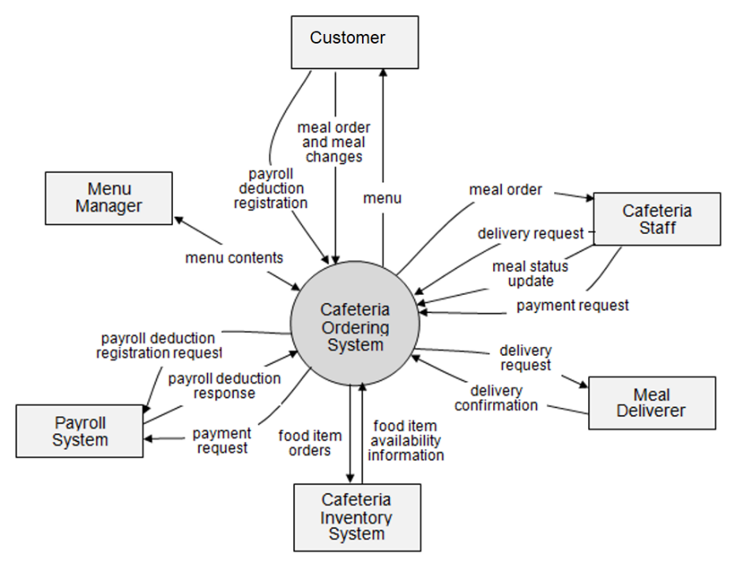
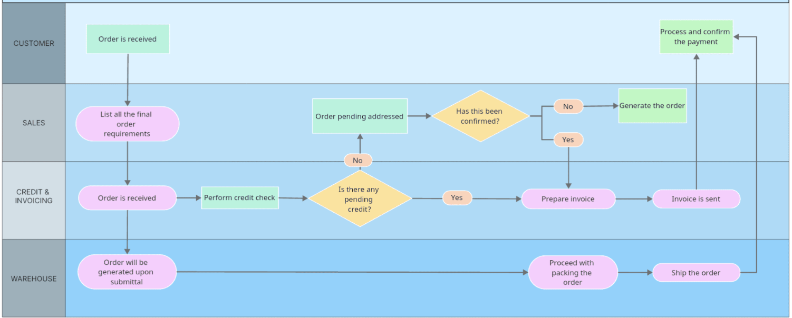
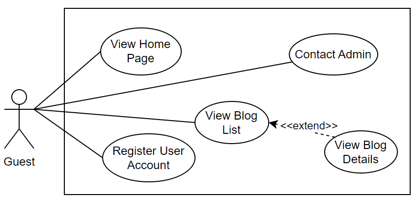
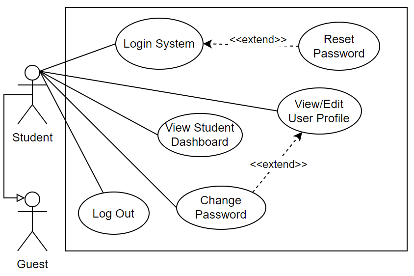
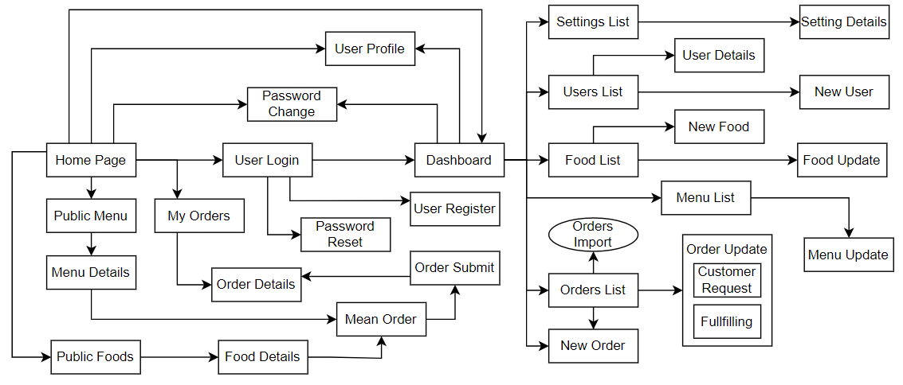
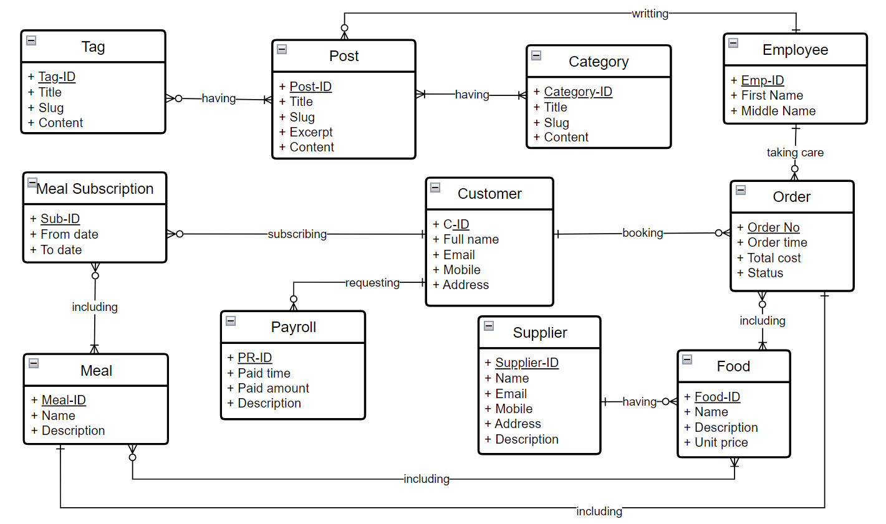
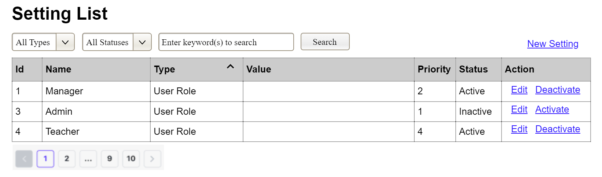
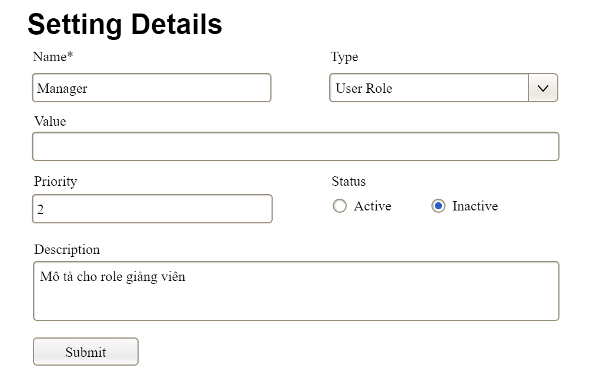

**SOFTWARE REQUIREMENT SPECIFICATION**

**Project Name (Code)**

– Hanoi, Jan 2024 –

**Table of Contents**

# I. Record of Changes

| **Date** | **A*****M, D** | **In charge** | **Change Description** |
| --- | --- | --- | --- |
|  |  |  |  |
|  |  |  |  |
|  |  |  |  |
|  |  |  |  |
|  |  |  |  |
|  |  |  |  |
|  |  |  |  |
|  |  |  |  |
|  |  |  |  |
|  |  |  |  |
|  |  |  |  |
|  |  |  |  |
|  |  |  |  |

*A - Added M - Modified D - Deleted

# II. Software Requirement Specification

## 1. Overall Requirements

### 1.1 Context Diagram

*[Gives the overall description about the product with some introduction and the context diagram. The context diagram presents the boundary and connections between the system you’re developing and everything else in the universe. This identifies external entities (or terminators – software, hardware, human components, and other systems) outside the system that interface to it in some way, as well as data, control, and material flows between the terminators and the system.]*

<<Sample: The Cafeteria Ordering System is a new software system that replaces the current manual and telephone processes for ordering and picking up meals in the Process Impact cafeteria. The context diagram below illustrates the external entities and system interfaces for release 1.0. The system is expected to evolve over several releases, ultimately connecting to the Internet ordering services for several local restaurants and to credit and debit card authorization services.

>>

### 1.2 Main Business Processes

*[Provide main workflows (business processes) using the swim-lane diagram(s) like sample below]*

#### 1.2.1 Order Processing

#### 1.2.2 Customer Support

…

### 1.3 User Requirements

#### 1.3.1 Actors

*[An actor is someone/something that interacts with the system.*

*The only external entities that interact with the system*

*Actors are outside the system and not part of it*

*A user is an individual, whereas an actor represents the role played by all users of the same type*

*There are other types of actors in addition to or in place of human actors: external systems, I/O devices, or timers*

*Following are some questions you might ask to help user representatives identify actors*

*Who (or what) is notified when something occurs within the system?*

*Who (or what) provides information or services to the system?*

*Who (or what) helps the system respond to and complete a task?*

*This part gives the description of system actors, you can follow the table form as below]*

| **#** | **Actor** | **Description** |
| --- | --- | --- |
| 1 | Administrator | Actor description here.. |
| 2 | Menu Manager | .. |
| 3 | … |  |

#### 1.3.2 Use Cases (UC)

*[A use case (UC) describes a sequence of interactions between a system and an external actor that results in the actor being able to achieve some outcome of value. The names of use cases are always**written in the form of a verb followed by an object. Select strong, descriptive names to make it evident from the name that the use case will deliver something valuable for some user.*

*Following are some questions you might ask to help user representatives identify use cases*

*What will the actor use the system for?*

*Will the actor create, store, change, remove, or read data in the system?*

*Will the actor need to inform the system about external events or changes?*

*Will the actor need to be informed about certain occurrences in the system?*

*This part describes the use cases you could define, you can follow the table form as below]*

| **ID** | **Use Case** | **Feature** | **Use Case Description** |
| --- | --- | --- | --- |
| 01 | View Menu | Feature Name1 |  |
| 02 | Order a Meal | Feature Name2 |  |
| 03 | … |  |  |

…

#### 1.3.2 Use Case Diagrams

*In this section, you need to provide the UC diagram(s) to show the actor-UCs and UC-UC relationships like the sample below. You can have multiple UC diagrams for the system, each diagram is for one actor or one workflow]*

##### 1.3.2.1 UCs for Guest

##### 1.3.2.2 UCs for Student

##### 1.3.2.3 …

### 1.4 System Functionalities

*[Provide functionality overview of software system: screen flow, screen descriptions, system user roles, screen authorization, non-screen functions, ERD]*

#### 1.4.1 Screens Flow

*[This part shows the system screens and the relationship among screens. You can draw the Screens Flow for the system in the form of diagram as below.]*

#### 1.4.2 Screen Authorization

*[Provide the system roles authorization to the system features (down to screens, and event to the screen activities if applicable) in the table form as below – replace Role-Name1, Role-Name2,… with your specific system user role names]*

| **Screen** | **Role-Name1** | **Role-Name2** | **Role-Name3** | **…** |
| --- | --- | --- | --- | --- |
| > **Sample:**   > Screen Name1 | X |  | X | X |
| > **Sample:**   > Screen Name2 |  | X |  |  |
| … |  |  |  |  |

#### 1.4.3 Non-UI Functions

*[Provide the descriptions for the non-screen system functions, i.e batch/cron job, service, API, etc.]*

| **#** | **Feature** | **System Function** | **Description** |
| --- | --- | --- | --- |
| 1 | > **Sample:**   > Feature Name | > **Sample:**   > Function Name1 | > **Sample:**   > Function Name1 Description |
| 2 | … |  |  |

### 1.5 Entity Relationship Diagram

*[Provide the****ERD****using the Crow-Foot notation and the entity descriptions as below]*

**Entities Description**

| **#** | **Entity** | **Description** |
| --- | --- | --- |
| 1 | Patrol | Cafeteria’s customer information |
| 2 | Meal | … |
| 3 | … |  |

## 2. Use Case Specifications

*[Provide specifications for the use cases (UCs) those are covered in the system. The UCs are grouped by the system features and even sub features.****You just need to provide UC specifications for complex UCs involving in the main workflows (business processes)****. Other UCs (i.e CRUD or data-viewing UCs) are simple, and you just need to refer the descriptions in the Functional Requirement (part 3) below)]*

### 2.1 <<Feature Name1>>

#### 2.1.1 UC Name1

| Primary Actors |  | Secondary Actors |  |
| --- | --- | --- | --- |
| Description |  |  |  |
| Preconditions |  |  |  |
| Postconditions |  |  |  |
| Normal Sequence/Flow |  |  |  |
| Alternative Sequences/Flows |  |  |  |

***Primary and Secondary Actors***

An actor is a person or other entity external to the software system being specified who interacts with the system and performs use cases to accomplish tasks. Name the primary actor that will be initiating this UC and any other secondary actors who will participate in completing execution of the UC.

***Description***

Provide a brief description of the reason for and outcome of this use case, or a high-level description of the sequence of actions and the outcome of executing the use case. The description can be in the form of a user story (As a **<type of user>**, I want **<some goal>**so that **<some reasons>**)

***Preconditions***

List any activities that must take place, or any conditions that must be true, before the use case can be started.

***Postconditions***

Describe the state of the system at the successful conclusion of the use case execution.

***Normal Flow***

Provide a description of the user actions and corresponding system responses that will take place during execution of the use case under normal, expected conditions.

***Alternative Flows***

Describe below two information if any:

Other successful usage scenarios that can take place within this use case. State the alternative flow, and describe any differences in the sequence of steps that take place.

Any anticipated error conditions that could occur during execution of the use case and how the system is to respond to those conditions.

#### 2.1.2 Login System

| Primary Actors | Customer | Secondary Actors | None |
| --- | --- | --- | --- |
| Description | As a user, I want to be able to log into the system so that I can use the system’s authenticated features and access my personalized account. |  |  |
| Preconditions | User account has been created & authorized |  |  |
| Postconditions | User logs in the system successfully The system tracked successful login into the Activity Log |  |  |
| Normal Sequence/Flow | ***Login System*** User clicks Login button from the page header or accesses an authenticated feature (from a link or type the page URL directly into the address bar) System show the User Login screen User types in the login details (email, password) User clicks the Login button System validates the login details (BR-01, BR-02) System allows user to access System tracks user’s success login to the Activity Log System directs user to the Home Page (or the previous calling page if any) |  |  |
| Alternative Sequences/Flows | ***Step 2.1_Google Login*** User clicks Google Login button to login system using Google account System redirects the user to the Google’s Login screen User types in the Google account details and chooses to login Google validates user’s login information successfully and redirect him/her back to the system Return to step 5 of normal flow. ***Step 4_System can’t authenticate the user*** User can’t be authenticated & get relevant error message in one of below cases He/she leaves the Email and/or Password field blank (MSG10) Input Email or Password are incorrect (MSG09) Input Email/Password are correct but email has not been verified (MSG11) The user account is blocked / inactive (MSG12) If user inputs wrong logging-in details 5 times continuously, system will lock his/her account in 30 minutes (with relevant warning message - MSG13) |  |  |

#### 2.1.3 UC Name2

…

### 2.2 Xyz Feature

…

## 3. Functional Requirements

*[Provide descriptions about the system’s functions/screens. The functions/screens are grouped by the system features, and even sub-features if needed. For the screens, you need to provide the screen layouts (mock-up screens) and relevant specifications if needed]*

### 3.1 Feature Name1

#### 3.1.1 SubFeature Name1.1

##### 3.1.1.1 Screen/Function Name1

*[Content #1: UI layout (Mockup screen prototype)]*

*[Content #2: brief descriptions of the screen/function, mapped to the relevant use cases]*

*[Content #3: provide further descriptions for the screen’s components/fields using table format below]*

| **Field Name** | **Description** |
| --- | --- |
| Field Name1 | Field description: data type min/max length or value, initial data, etc. |
| Field Name2 | … |
| ***Field Group-Name1*** |  |
| Field Name3 | … |
| Field Name4 | … |
| ***Field Group-Name2*** |  |
| … | … |

##### 3.1.1.2 Screen/Function Name2

…

#### 3.1.2 SubFeature Name1.2

…

### 3.2 User Authentication

#### 3.2.1 User Register

…

#### 3.2.2 User Login

…

#### 3.2.3 Password Reset

…

### 3.3 System Administration

#### 3.3.1 Master Data

##### 3.3.1.1 Setting List

This screen allows the Administrator to:

View Setting List: view list of current master data.

Filter Setting List: filter master data by data types, statuses

Search Settings: enter keyword(s) to search master data by their names or values

Sort Setting List: sort master data list (ascending, descending) by clicking column headers

On the screen, s/he can also

Activate/Deactivate Setting: change status of a specific inactive/active master data

Choose to go to the Setting Details screens for adding new or updating an existing master data by clicking the New Setting or Edit 	link.

**Field Description**

| **Field Name** | **Description** |
| --- | --- |
| (1) | Initial values: all the active setting names with null or blank type Hover the mouse to show the field name: “Setting Type” |
| (2) | Initial values: All Statuses, Active, Inactive (default value “All Status”) Hover the mouse to show the field name: “Setting Status” |
| (3) | The change-status action is Activate or Deactivate depending on the current status of the relevant setting (Inactive or Active, respectively). |

##### 3.3.1.2 Setting Details

This screen allows the Administrator to:

Add New Setting: add new master data.

Update Setting Details: update details of a specific master data

**Field Description**

| **Field Name** | **Description** |
| --- | --- |
| Name | Data type: non-digit string, max length of 20 characters |
| Type | Initial data values: all active setting names (with null or blank type) |
| Value | Data type: any string, max length of 100 characters |
| Priority | Data type: a positive integer |
| Description | Data type: any string, max length of 200 characters |

#### 3.3.2 User Management

##### 3.3.2.1 User List

…

##### 3.3.2.2 User Details

…

## 4. Non-Functional Requirements

### 3.1 External Interfaces

*[This section provides information to ensure that the system will communicate properly with users and with external hardware or software/system elements.]*

### 3.2 Quality Attributes

*[List all the required system characteristics (quality attributes) specification. Some of the possible attributes are provided with the guide/descriptions are mentioned here]*

#### 3.2.1 Usability

*[This section includes all those requirements that affect usability. For example, specify the required training time for a normal user and a power user to become productive at particular operations specify measurable task times for typical tasks or base the new system’s usability requirements on other systems that the users know and like specify requirement to conform to common usability standards, such as IBM’s CUA standards Microsoft’s GUI standards]*

#### 3.2.2 Performance

*[The system’s performance characteristics are outlined in this section. Include specific response times. Where applicable, reference related Use Cases by name.*

*Response time for a transaction (average, maximum)*

*Throughput, for example, transactions per second*

*Capacity, for example, the number of customers or transactions the system can accommodate*

*Resource utilization, such as memory, disk, communications, and so forth.]*

#### 3.2.3 …

## 5. Requirement Appendix

*[Provide business rules, common requirements, or other extra requirements information here]*

### 5.1 Business Rules

*[Provide common business rules that you must follow. The information can be provided in the table format as the sample below]*

| **ID** | **Rule Definition** |
| --- | --- |
| BR-01 | Delivery time windows are 15 minutes, beginning on each quarter hour. |
| BR-02 | Deliveries must be completed between 10:00 A.M. and 2:00 P.M. local time, inclusive. |
| BR-03 | All meals in a single order must be delivered to the same location. |
| BR-04 | All meals in a single order must be paid for by using the same payment method. |
| BR-11 | If an order is to be delivered, the patron must pay by payroll deduction. |
| BR-12 | Order price is calculated as the sum of each food item price times the quantity of that food item ordered, plus applicable sales tax, plus a delivery charge if a meal is delivered outside the free delivery zone. |
| BR-24 | Only cafeteria employees who are designated as Menu Managers by the Cafeteria Manager can create, modify, or delete cafeteria menus. |
| BR-33 | Network transmissions that involve financial information or personally identifiable information require 256-bit encryption. |
| BR-86 | Only regular employees can register for payroll deduction for any company purchase. |
| BR-88 | An employee can register for payroll deduction payment of cafeteria meals if no more than 40 percent of his gross pay is currently being deducted for other reasons. |

### 5.2 System Messages

| **#** | **Message code** | **Message Type** | **Context** | **Content** |
| --- | --- | --- | --- | --- |
| 1 | MSG01 | In line | There is not any search result | *No search results.* |
| 2 | MSG02 | In red, under the text box | Input-required fields are empty | *The * field is required.* |
| 3 | MSG03 | Toast message | Updating asset(s) information successfully | *Update asset(s) successfully.* |
| 4 | MSG04 | Toast message | Adding new asset successfully | *Add asset successfully.* |
| 5 | MSG05 | Toast message | Confirming email of asset hand-over is sent successfully | *A confirmation email has been sent to {email_address}.* |
| 6 | MSG06 | Toast message | Resetting asset information successfully | *Return asset(s) successfully.* |
| 7 | MSG07 | Toast message | Deleting asset information successfully | *Delete asset(s) successfully.* |
| 8 | MSG08 | In red, under the text box | Input value length > max length | *Exceed max length of {max_length}.* |
| 9 | MSG09 | In line | Username or password is not correct when clicking sign-in | *Incorrrect user name or password. Please check again.* |
| 10 | .. |  |  |  |

### 5.3 Other Requirements…