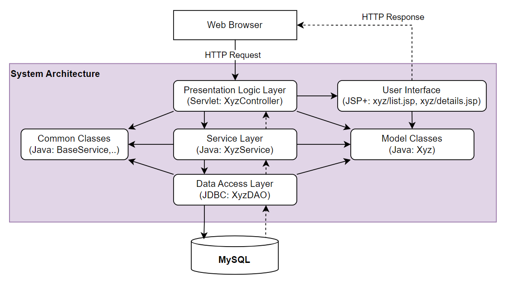
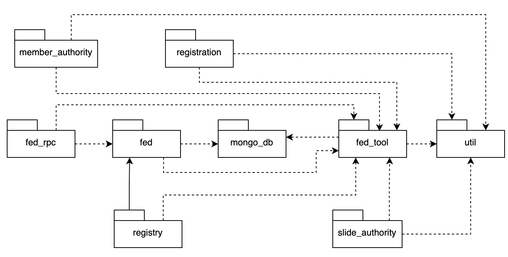
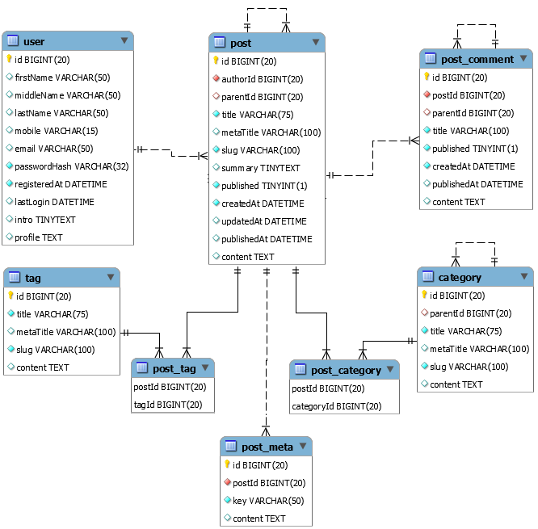
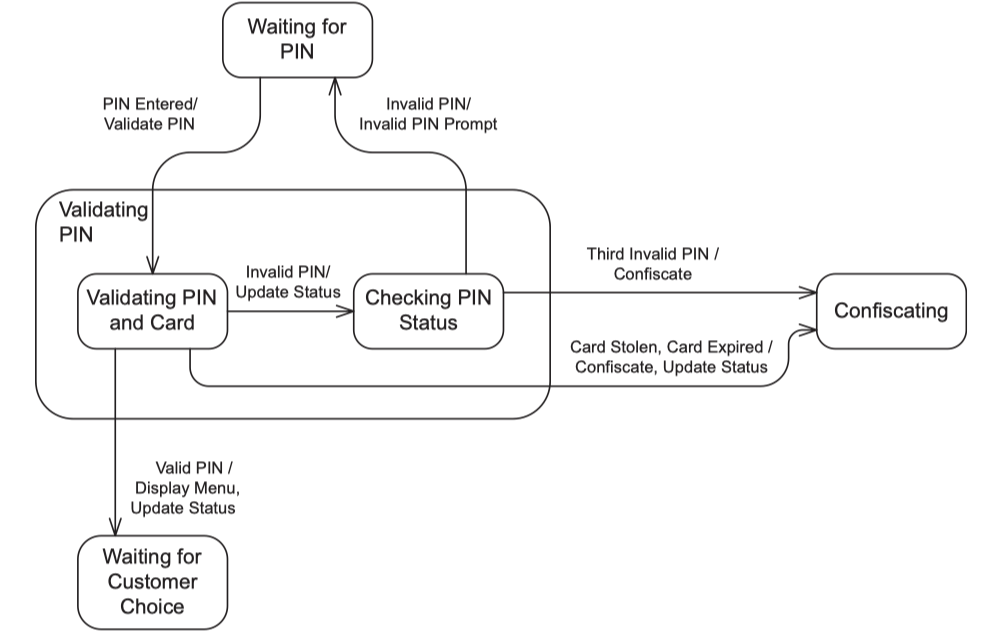
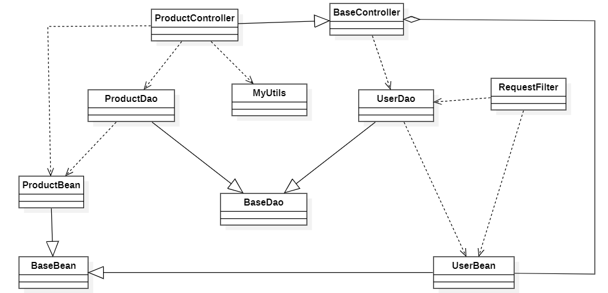
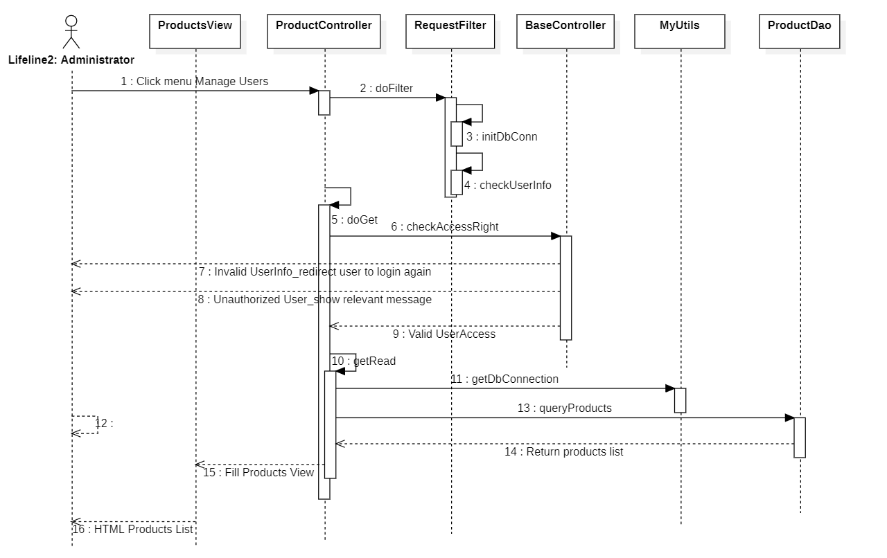

**SOFTWARE****DESIGN****SPECIFICATION**

**Project Name (Code)**

– Hanoi, Sep 2025 –

# I. Record of Changes

| Date | A*   M, D | In charge | Change Description |
| --- | --- | --- | --- |
|  |  |  |  |
|  |  |  |  |
|  |  |  |  |
|  |  |  |  |
|  |  |  |  |
|  |  |  |  |
|  |  |  |  |
|  |  |  |  |
|  |  |  |  |
|  |  |  |  |
|  |  |  |  |
|  |  |  |  |
|  |  |  |  |

*A - Added M - Modified D - Deleted

# II. Software Design Document

## 1. High Level Design

### 1.1 Software Architecture

*[**The content of this section include**s**the overall**architectural**diagram**which includes the sub-systems**and/or components**, the external systems**(if any)**, and the relationship**s (communication messages)**among them. You need also provide the**explanation for each of the diagram components**(**modules,**sub-systems, external systems, etc.)**]**.*

*-*

### 1.2 Package Diagram

*[Provide the package diagram for each sub-system.**The content of this section including the overall package diagram, the explanation, package and class naming conventions in each package. Please see the sample & description table format below**]*

***Package descriptions***

| **No** | **Package** | **Description** |
| --- | --- | --- |
| *01* | *Member_authority* | *<Description of**the package**>* |
| *02* | *registration* | *<Description of**the package**>* |
| *03* | *…* |  |

### 1.3 Database Design

*[Provide the**files description, database table relationship &**table**description**s**like example below]*

#### 1.3.1 table_name1

> *[Provide brief description of the table here]*

> *[Provide the detailed table fields description using below table format*
> ** PK~Primary Key; FK~Foreign Key; UN~Unique; NN ~ not null*

| **No** | **Field** | **PK** | **FK** | **UN** | **NN** | **Description** |
| --- | --- | --- | --- | --- | --- | --- |
| *01* | *<**field_**name**1**>* |  |  |  |  | *<Description of**the**field_name1**>* |
| *02* | *<**field_**name**2**>* |  |  |  |  | *…* |
| *..* |  |  |  |  |  |  |

#### 1.3.2 table_name2

…

## 2. State Transition Diagrams

*[Specify and draw**state charts (state transition diagrams) for the data and system**like below sample. In the diagrams, beside the states, you are required to provide suitable events, actions on the state transitions, entry actions, or exit actions]*

### 2.1 PIN Validation

*[Provide sta**te**chart with extra explanation**s**if needed]*

### 2.2 …

## 3. Detailed Design

### 3.1 <Feature/Function Name1>

*[**Provide the detailed design for the feature**<Feature Name1>**. It include**s****Class Diagram****and**Sequence Diagram**(s**)**;****F******or the features/functions with the same structure of class & sequence diagrams,******you******need to provide the diagrams once******for one feature/function******and refer to those diagrams from other************features/functions****]*

#### 3.1.1 Class Diagram

*[**This part presents the class di**agram for the relevant feature]*

#### 3.1.2 <Sequence Diagram Name1>

*[**Provide the sequence diagram(s) for the feature, see the sample below**]*

#### 3.1.3 <Sequence Diagram Name2>

#### 3.1.4 …

### 3.2 <Feature/Function Name2>

…